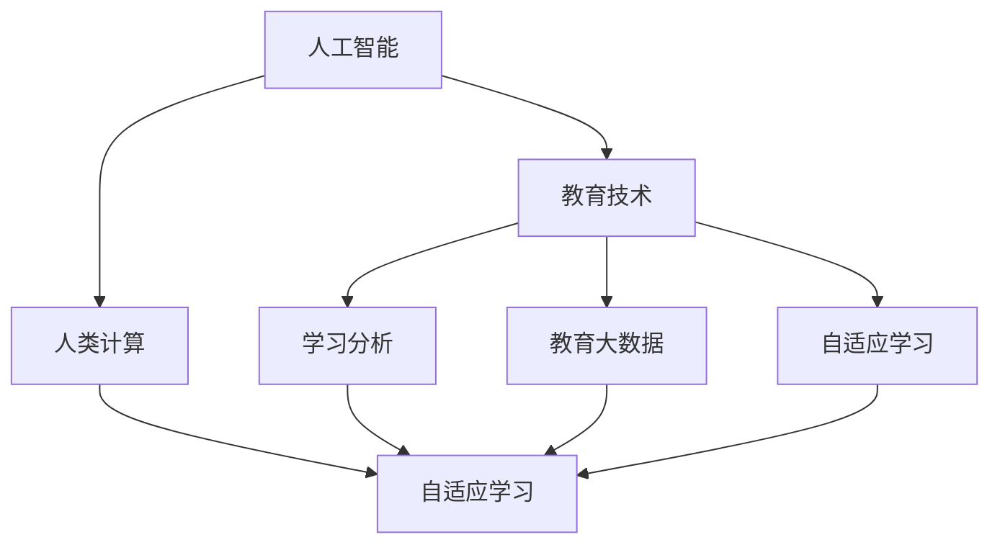

                 

# AI驱动的创新：人类计算在教育中的作用

> 关键词：人工智能(AI), 教育技术(EdTech), 人类计算(Human Computation), 学习分析(Learning Analytics), 教育大数据(Educational Big Data), 自适应学习(Adaptive Learning)

## 1. 背景介绍

### 1.1 问题由来
随着人工智能技术的迅猛发展，其在教育领域的应用也日益广泛。从智能评估系统、个性化学习平台到虚拟助教和智能教育游戏，AI正在彻底改变着教育的面貌。然而，尽管AI技术带来了诸多便利和潜力，它仍然面临一些关键挑战，特别是如何真正实现人机协同，提升教学效果，而不是仅仅作为一个辅助工具。

### 1.2 问题核心关键点
AI在教育中的应用并非一帆风顺，其核心挑战包括：

- 数据隐私和安全：如何收集、存储和处理学生数据，同时保护学生隐私？
- 教师角色与责任：在AI辅助教学中，教师应承担何种角色？
- 学生的适应性：AI如何帮助不同学习风格和能力的学生？
- 教育公平性：如何确保AI技术的普及不会加剧教育不公平？
- 教育伦理：AI教育应用中的伦理问题和道德考量。

### 1.3 问题研究意义
在教育领域引入AI技术，旨在通过数据驱动的个性化教学、学习路径的智能推荐、高效评估反馈等方式，提升教学质量，促进教育公平，培养学生创新能力。

通过AI技术，教育者可以更深入地了解学生学习状态和需求，提供更加个性化的教育服务。同时，AI还可以自动化繁琐的评估和反馈过程，释放教师的精力，使其能够专注于更高层次的教学和研究。

## 2. 核心概念与联系

### 2.1 核心概念概述

为了更好地理解AI在教育中的作用，本节将介绍几个核心概念：

- 人工智能(AI)：使用算法和计算机程序模拟人类智能的领域，包括学习、推理、感知、语言处理等能力。
- 教育技术(EdTech)：应用信息技术于教育领域，提升教学质量和学习体验的技术和工具。
- 人类计算(Human Computation)：利用人类的智慧和能力，结合计算机技术，共同解决复杂问题的方法。
- 学习分析(Learning Analytics)：使用数据分析技术，了解和优化学习过程，提升学习效果和教学质量。
- 教育大数据(Educational Big Data)：通过收集和分析大规模教育数据，发现教育规律和趋势，优化教学策略。
- 自适应学习(Adaptive Learning)：根据学生的学习表现和偏好，动态调整教学内容和策略，实现个性化学习。

这些概念之间的联系可以通过以下Mermaid流程图来展示：



这个流程图展示了大语言模型微调的各个核心概念及其之间的关系：

1. 人工智能通过技术手段辅助教育，实现个性化教学、智能评估等。
2. 教育技术是AI在教育中的具体应用工具。
3. 学习分析利用大数据和AI技术，评估和优化学习过程。
4. 教育大数据支持学习分析，促进教育决策科学化。
5. 自适应学习是AI技术的具体应用场景，旨在提升学习效果和教学质量。

这些概念共同构成了AI在教育中的应用框架，使其能够更好地服务于学生和教师。

## 3. 核心算法原理 & 具体操作步骤
### 3.1 算法原理概述

AI在教育中的应用，主要是通过数据驱动的算法模型，对学生的学习数据进行分析，提供个性化的教学和评估。其中，学习分析和学习路径推荐是核心的技术手段。

形式化地，假设学生的学习数据为 $D=\{(x_i, y_i)\}_{i=1}^N, x_i \in \mathcal{X}, y_i \in \mathcal{Y}$，其中 $x_i$ 为学生的状态变量（如成绩、兴趣、作业完成度等），$y_i$ 为学生的行为变量（如学习时长、参与度、互动反馈等）。定义学习分析函数 $\mathcal{A}(D)$，目标是最小化学习分析误差，即：

$$
\mathcal{A}(D) = \mathop{\arg\min}_{\mathcal{A}} \sum_{i=1}^N \lVert \mathcal{A}(x_i) - y_i \rVert^2
$$

通过学习分析，我们可以获取学生的学习模式和趋势，预测其未来的学习行为，从而制定个性化的教学策略。

### 3.2 算法步骤详解

AI在教育中的具体应用流程包括以下几个关键步骤：

**Step 1: 数据收集与预处理**
- 收集学生学习过程中的各种数据，包括在线作业、测试成绩、参与度等。
- 清洗和预处理数据，去除噪音和不相关特征。
- 采用数据增强技术，丰富数据集的多样性。

**Step 2: 建立学习模型**
- 选择合适的机器学习算法（如决策树、随机森林、神经网络等），构建学习模型。
- 使用交叉验证等技术评估模型性能。
- 在验证集上微调模型超参数，优化模型泛化能力。

**Step 3: 学习分析**
- 利用学习模型对学生学习数据进行分析，识别出学生的学习模式和趋势。
- 根据分析结果，预测学生未来的学习行为和成绩。
- 生成个性化学习建议和教学策略。

**Step 4: 教学反馈与调整**
- 将学习分析和预测结果反馈给教师和学生。
- 教师根据反馈调整教学内容和方法。
- 学生根据建议优化学习计划和方法。
- 周期性重新收集数据，更新学习模型和策略。

### 3.3 算法优缺点

AI在教育中的应用具有以下优点：

- 数据驱动：基于大量学习数据，AI可以提供更加精准的教学和评估，提升教学效果。
- 个性化学习：通过分析学生数据，AI可以定制个性化的学习路径，满足不同学生的学习需求。
- 自动反馈：AI能够实时提供评估和反馈，帮助教师及时调整教学策略，提升教学质量。
- 高效管理：AI可以自动化繁琐的评估和反馈过程，减轻教师负担，提高管理效率。

同时，AI在教育中也存在一些局限性：

- 数据隐私：大量学生数据的收集和处理可能涉及隐私问题，需要严格的数据保护措施。
- 教师依赖：过度依赖AI可能导致教师在教学中失去主动性和创造性。
- 技术门槛：AI技术的应用需要一定的技术背景，教师和教育机构需要具备相应的技术能力。
- 公平性问题：AI算法可能存在偏见，影响教育公平性。
- 可解释性：AI模型的决策过程往往缺乏可解释性，难以理解和调试。

尽管存在这些局限性，但AI在教育中的应用潜力巨大，有望通过数据驱动的方式，提升教育质量和公平性。

### 3.4 算法应用领域

AI在教育领域的应用广泛，主要包括以下几个方面：

- 自适应学习平台：通过AI技术，自动推荐个性化学习资源和路径，提升学习效果。
- 智能评估系统：利用AI算法，自动批改作业、评估学生表现，提高评估效率和公平性。
- 虚拟助教：AI驱动的虚拟助教可以随时回答学生问题，提供即时辅导，增强学习支持。
- 教育游戏与模拟：结合AI和虚拟现实技术，开发互动式教育游戏和模拟，提升学生兴趣和参与度。
- 教育数据分析：利用AI对大规模教育数据进行分析，发现教育规律和趋势，优化教学策略。

这些应用展示了AI技术在教育领域的广泛应用前景，有助于提升教育质量和公平性，推动教育现代化。

## 4. 数学模型和公式 & 详细讲解  
### 4.1 数学模型构建

本节将使用数学语言对AI在教育中的应用进行更加严格的刻画。

记学生学习数据为 $D=\{(x_i, y_i)\}_{i=1}^N, x_i \in \mathcal{X}, y_i \in \mathcal{Y}$。定义学习分析函数 $\mathcal{A}(D)$，目标是最小化分析误差，即：

$$
\mathcal{A}(D) = \mathop{\arg\min}_{\mathcal{A}} \sum_{i=1}^N \lVert \mathcal{A}(x_i) - y_i \rVert^2
$$

在实践中，我们通常使用基于梯度的优化算法（如SGD、Adam等）来近似求解上述最优化问题。设 $\eta$ 为学习率，$\lambda$ 为正则化系数，则参数的更新公式为：

$$
\theta \leftarrow \theta - \eta \nabla_{\theta}\mathcal{L}(\theta) - \eta\lambda\theta
$$

其中 $\nabla_{\theta}\mathcal{L}(\theta)$ 为损失函数对参数 $\theta$ 的梯度，可通过反向传播算法高效计算。

### 4.2 公式推导过程

以下我们以二分类任务为例，推导分类模型的损失函数及其梯度的计算公式。

假设模型 $M_{\theta}$ 在输入 $x$ 上的输出为 $\hat{y}=M_{\theta}(x) \in [0,1]$，表示学生属于正类的概率。真实标签 $y \in \{0,1\}$。则二分类交叉熵损失函数定义为：

$$
\ell(M_{\theta}(x),y) = -[y\log \hat{y} + (1-y)\log (1-\hat{y})]
$$

将其代入经验风险公式，得：

$$
\mathcal{L}(\theta) = -\frac{1}{N}\sum_{i=1}^N [y_i\log M_{\theta}(x_i)+(1-y_i)\log(1-M_{\theta}(x_i))]
$$

根据链式法则，损失函数对参数 $\theta_k$ 的梯度为：

$$
\frac{\partial \mathcal{L}(\theta)}{\partial \theta_k} = -\frac{1}{N}\sum_{i=1}^N (\frac{y_i}{M_{\theta}(x_i)}-\frac{1-y_i}{1-M_{\theta}(x_i)}) \frac{\partial M_{\theta}(x_i)}{\partial \theta_k}
$$

其中 $\frac{\partial M_{\theta}(x_i)}{\partial \theta_k}$ 可进一步递归展开，利用自动微分技术完成计算。

在得到损失函数的梯度后，即可带入参数更新公式，完成模型的迭代优化。重复上述过程直至收敛，最终得到适应学习分析任务的最优模型参数 $\theta^*$。

## 5. 项目实践：代码实例和详细解释说明
### 5.1 开发环境搭建

在进行学习分析实践前，我们需要准备好开发环境。以下是使用Python进行Scikit-learn开发的环境配置流程：

1. 安装Anaconda：从官网下载并安装Anaconda，用于创建独立的Python环境。

2. 创建并激活虚拟环境：
```bash
conda create -n sklearn-env python=3.8 
conda activate sklearn-env
```

3. 安装Scikit-learn：使用pip安装Scikit-learn库，这是常用的机器学习工具包。
```bash
pip install scikit-learn
```

4. 安装numpy、pandas、matplotlib等依赖库：
```bash
pip install numpy pandas matplotlib scikit-learn tqdm jupyter notebook ipython
```

完成上述步骤后，即可在`sklearn-env`环境中开始学习分析实践。

### 5.2 源代码详细实现

下面我们以学生成绩预测为例，给出使用Scikit-learn库进行学习分析的Python代码实现。

首先，定义预测任务的数据处理函数：

```python
import pandas as pd
from sklearn.model_selection import train_test_split
from sklearn.preprocessing import StandardScaler

def load_data(filename):
    data = pd.read_csv(filename)
    X = data.drop([' grade'], axis=1)
    y = data[' grade']
    return X, y

X, y = load_data('student_scores.csv')

# 数据标准化
scaler = StandardScaler()
X_scaled = scaler.fit_transform(X)
```

然后，定义模型和优化器：

```python
from sklearn.linear_model import LogisticRegression
from sklearn.metrics import accuracy_score

model = LogisticRegression()
model.fit(X_scaled, y)
```

接着，定义评估函数：

```python
def evaluate(model, X_test, y_test):
    y_pred = model.predict(X_test)
    accuracy = accuracy_score(y_test, y_pred)
    return accuracy

# 使用测试集评估模型
X_test, y_test = load_data('test_student_scores.csv')
X_test_scaled = scaler.transform(X_test)
accuracy = evaluate(model, X_test_scaled, y_test)
print(f'Accuracy on test set: {accuracy:.2f}')
```

最后，启动学习分析流程并在测试集上评估：

```python
from sklearn.model_selection import cross_val_score

# 使用交叉验证评估模型
scores = cross_val_score(model, X_scaled, y, cv=5)
mean_score = scores.mean()
print(f'Mean accuracy on cross-validation: {mean_score:.2f}')
```

以上就是使用Scikit-learn对学生成绩进行预测的学习分析实践的完整代码实现。可以看到，利用Scikit-learn库，可以便捷地实现机器学习算法的训练、评估和预测。

### 5.3 代码解读与分析

让我们再详细解读一下关键代码的实现细节：

**load_data函数**：
- `load_data`方法：读取数据集，将特征和标签分离，并使用数据标准化技术。

**model定义与训练**：
- `LogisticRegression`：定义逻辑回归模型，用于二分类任务。
- `fit`方法：使用标准化后的特征数据训练模型。

**evaluate函数**：
- `evaluate`方法：对模型进行测试集评估，计算准确率。

**交叉验证**：
- `cross_val_score`方法：使用交叉验证评估模型性能，并计算平均准确率。

可以看到，通过Scikit-learn库，我们能够快速构建和评估机器学习模型，验证学习分析的效果。

## 6. 实际应用场景
### 6.1 智能评估系统

智能评估系统利用AI技术，通过自动批改作业、评估学生表现，提高评估效率和公平性。具体来说，系统收集学生的作业、测试和参与度数据，使用机器学习算法构建评分模型。学生提交作业后，系统自动进行批改，给出评分和反馈。评估结果可以生成详细的报告，供教师和学生查阅。

### 6.2 自适应学习平台

自适应学习平台利用AI技术，根据学生的学习表现和偏好，动态调整教学内容和策略，实现个性化学习。系统通过学习分析学生的数据，识别出学生的学习模式和需求，生成个性化的学习资源和路径。学生可以自主选择学习内容和进度，系统会根据学习效果实时调整推荐。

### 6.3 虚拟助教

虚拟助教利用AI技术，提供即时辅导和反馈，增强学习支持。系统可以回答学生的问题，提供解题步骤和资源。虚拟助教可以覆盖多个学科和主题，适用于不同年龄段和层次的学生。

### 6.4 教育游戏与模拟

教育游戏与模拟利用AI技术和虚拟现实技术，开发互动式教育游戏和模拟，提升学生兴趣和参与度。系统可以模拟真实世界的情境，提供沉浸式学习体验。AI可以根据学生的反馈和表现，动态调整游戏难度和内容，满足不同学生的需求。

## 7. 工具和资源推荐
### 7.1 学习资源推荐

为了帮助开发者系统掌握AI在教育中的应用，这里推荐一些优质的学习资源：

1. 《Python机器学习》系列书籍：由机器学习专家Sebastian Raschka和Vahid Mirjalili撰写，介绍了Python在机器学习中的广泛应用，包括Scikit-learn等工具的使用。

2. Coursera的机器学习课程：由斯坦福大学Andrew Ng教授主讲，涵盖机器学习的基本概念和算法，适合初学者和进阶者。

3. Kaggle教育数据集：Kaggle提供了多个教育相关的数据集，供机器学习爱好者进行实践和研究。

4. Scikit-learn官方文档：Scikit-learn的详细文档，提供了丰富的算法和工具，是进行机器学习实践的必备资源。

5. TensorFlow和PyTorch的教程：TensorFlow和PyTorch是流行的深度学习框架，提供了大量的教程和样例代码，助力深度学习应用开发。

通过对这些资源的学习实践，相信你一定能够快速掌握AI在教育中的应用，并用于解决实际的NLP问题。

### 7.2 开发工具推荐

高效的开发离不开优秀的工具支持。以下是几款用于AI在教育中的应用开发的常用工具：

1. Python：作为数据科学和机器学习的主流语言，Python具备丰富的科学计算和机器学习库，非常适合AI应用开发。

2. Scikit-learn：基于Python的机器学习库，提供了简单易用的机器学习算法，适合初学者和中级开发者。

3. TensorFlow和PyTorch：流行的深度学习框架，支持丰富的算法和模型，适用于复杂的AI应用开发。

4. Jupyter Notebook：交互式编程环境，支持Python、R、JavaScript等多种语言，非常适合数据科学和机器学习实践。

5. Weights & Biases：模型训练的实验跟踪工具，可以记录和可视化模型训练过程中的各项指标，方便对比和调优。

6. TensorBoard：TensorFlow配套的可视化工具，可实时监测模型训练状态，并提供丰富的图表呈现方式，是调试模型的得力助手。

合理利用这些工具，可以显著提升AI在教育中的开发效率，加快创新迭代的步伐。

### 7.3 相关论文推荐

AI在教育中的应用源于学界的持续研究。以下是几篇奠基性的相关论文，推荐阅读：

1. "The Rise of AI in Education: Opportunities and Challenges"：介绍AI在教育中的应用现状、机会和挑战。

2. "Human-Centered AI in Education: Design Principles and Ethical Considerations"：探讨AI在教育中的人机协同设计原则和伦理考量。

3. "Adaptive Learning Systems: A Survey of Architectures, Methodologies, and Evaluation"：综述自适应学习系统的架构和评估方法。

4. "Personalized Learning through AI: A Review of Techniques and Applications"：综述AI在个性化学习中的应用和技术。

5. "Educational Data Mining: Algorithms and Models for Predicting and Analyzing Students' Learning"：介绍教育数据分析的算法和技术，用于预测和分析学生学习行为。

这些论文代表了大语言模型微调技术的发展脉络。通过学习这些前沿成果，可以帮助研究者把握学科前进方向，激发更多的创新灵感。

## 8. 总结：未来发展趋势与挑战

### 8.1 总结

本文对AI在教育中的应用进行了全面系统的介绍。首先阐述了AI技术在教育中的广泛应用和巨大潜力，明确了AI在提升教育质量和公平性方面的独特价值。其次，从原理到实践，详细讲解了机器学习模型的构建和评估，给出了学习分析任务开发的完整代码实例。同时，本文还探讨了AI在教育中面临的挑战和未来发展方向，展示了AI技术在教育领域的广阔前景。

通过本文的系统梳理，可以看到，AI在教育中的应用正在逐步走向成熟，有望通过数据驱动的方式，提升教育质量和公平性。未来，伴随AI技术的持续演进，教育将更加智能化、个性化和普适化，引领教育事业的全面变革。

### 8.2 未来发展趋势

展望未来，AI在教育中的应用将呈现以下几个发展趋势：

1. 数据驱动的个性化学习：利用AI对学生学习数据进行深度分析，定制个性化的学习资源和路径，提升学习效果。

2. 智能评估和反馈系统：开发智能评估和反馈系统，自动批改作业、评估学生表现，提高评估效率和公平性。

3. 人机协同的教学模式：构建人机协同的教学系统，利用AI辅助教师进行教学设计、评估和反馈。

4. 多模态学习平台：融合文本、图像、视频、语音等多模态数据，提升学习体验和效果。

5. 跨学科知识图谱：开发跨学科知识图谱，帮助学生理解和应用多学科知识。

6. 教育大数据分析：利用AI对大规模教育数据进行分析，发现教育规律和趋势，优化教学策略。

以上趋势凸显了AI在教育中的广阔前景。这些方向的探索发展，必将进一步提升教育质量和公平性，推动教育现代化。

### 8.3 面临的挑战

尽管AI在教育中的应用前景广阔，但仍面临诸多挑战：

1. 数据隐私和安全：大规模学生数据的收集和处理涉及隐私问题，需要严格的数据保护措施。

2. 技术门槛：AI技术的应用需要一定的技术背景，教师和教育机构需要具备相应的技术能力。

3. 教育公平性：AI算法可能存在偏见，影响教育公平性，需要设计公平无偏的算法模型。

4. 可解释性：AI模型的决策过程往往缺乏可解释性，难以理解和调试，需要开发可解释的AI模型。

5. 技术普及：AI技术的普及需要克服资源和技术的壁垒，推广到更广泛的教育场景。

6. 伦理和道德：AI在教育中的应用需要考虑伦理和道德问题，确保算法透明、公正、安全。

这些挑战需要通过技术创新和政策支持，逐步解决，确保AI技术在教育中的良性发展。

### 8.4 研究展望

未来，AI在教育中的应用需要在以下几个方面寻求新的突破：

1. 开发更加公平无偏的AI模型：通过改进算法设计和数据预处理，减少算法偏见，提升教育公平性。

2. 增强AI模型的可解释性：开发可解释的AI模型，帮助教师和学生理解AI的决策过程和输出结果。

3. 融合多模态数据和知识图谱：开发融合文本、图像、视频、语音等多模态数据的教育平台，提升学习体验和效果。

4. 探索新型的学习分析方法：开发基于深度学习、因果推理等新方法的学习分析模型，提升学习效果。

5. 优化智能评估系统：开发智能评估和反馈系统，自动批改作业、评估学生表现，提高评估效率和公平性。

6. 推动教育技术的普及应用：通过政策支持和教育技术企业的合作，推广AI技术在教育中的应用。

这些研究方向将进一步推动AI在教育中的应用，提升教育质量和公平性，实现教育的全面现代化。

## 9. 附录：常见问题与解答

**Q1：AI在教育中的应用有哪些局限性？**

A: AI在教育中的应用虽然前景广阔，但也存在一些局限性：

- 数据隐私和安全：大规模学生数据的收集和处理涉及隐私问题，需要严格的数据保护措施。

- 技术门槛：AI技术的应用需要一定的技术背景，教师和教育机构需要具备相应的技术能力。

- 教育公平性：AI算法可能存在偏见，影响教育公平性，需要设计公平无偏的算法模型。

- 可解释性：AI模型的决策过程往往缺乏可解释性，难以理解和调试，需要开发可解释的AI模型。

- 技术普及：AI技术的普及需要克服资源和技术的壁垒，推广到更广泛的教育场景。

- 伦理和道德：AI在教育中的应用需要考虑伦理和道德问题，确保算法透明、公正、安全。

尽管存在这些局限性，但AI在教育中的应用潜力巨大，有望通过数据驱动的方式，提升教育质量和公平性。

**Q2：AI如何实现个性化学习？**

A: AI通过分析学生学习数据，识别出学生的学习模式和需求，生成个性化的学习资源和路径，实现个性化学习。

- 数据收集与预处理：收集学生学习过程中的各种数据，包括在线作业、测试成绩、参与度等。

- 学习模型建立：选择合适的机器学习算法（如决策树、随机森林、神经网络等），构建学习模型。

- 学习分析：利用学习模型对学生学习数据进行分析，识别出学生的学习模式和趋势。

- 个性化推荐：根据分析结果，生成个性化的学习资源和路径，供学生自主选择。

- 实时调整：系统会根据学习效果实时调整推荐，动态调整教学内容和策略。

通过数据驱动的方式，AI可以更好地理解学生需求，提供个性化的学习支持，提升学习效果。

**Q3：AI在教育中如何提升教学质量？**

A: AI通过数据驱动的方式，提升教学质量，主要体现在以下几个方面：

- 实时评估和反馈：AI可以自动批改作业、评估学生表现，提高评估效率和公平性。

- 个性化学习路径：AI可以根据学生的学习表现和偏好，动态调整教学内容和策略，实现个性化学习。

- 教学数据分析：AI可以分析大规模教育数据，发现教育规律和趋势，优化教学策略。

- 智能助教系统：AI驱动的虚拟助教可以随时回答学生问题，提供即时辅导，增强学习支持。

通过这些技术手段，AI可以提升教学效果，减轻教师负担，推动教育现代化。

**Q4：AI在教育中的应用如何确保数据隐私和安全？**

A: 数据隐私和安全是大规模学生数据收集和处理中的关键问题，需要采取以下措施：

- 数据匿名化：对学生数据进行匿名化处理，去除可以识别个人身份的信息。

- 数据加密：采用加密技术保护数据传输和存储的安全性。

- 访问控制：严格控制数据访问权限，确保只有授权人员可以访问敏感数据。

- 数据审计：定期对数据使用情况进行审计，发现和修复安全漏洞。

- 合规监管：遵守相关法律法规，确保数据使用符合法律和道德标准。

通过这些措施，可以最大程度保护学生隐私，确保AI在教育中的应用安全可靠。

**Q5：AI在教育中的应用如何体现公平性？**

A: 确保AI在教育中的应用公平性，需要采取以下措施：

- 数据平衡：确保训练数据集涵盖各种背景和能力的学生，避免算法偏见。

- 公平算法：设计公平无偏的算法模型，确保不同学生获得平等的机会和资源。

- 人工干预：在关键决策环节引入人工干预，确保算法透明公正。

- 社会监督：建立社会监督机制，确保AI应用符合伦理和道德标准。

- 持续改进：定期评估AI应用的效果和公平性，不断改进算法和策略。

通过这些措施，可以确保AI在教育中的应用公平无偏，推动教育公平性。

---

作者：禅与计算机程序设计艺术 / Zen and the Art of Computer Programming

