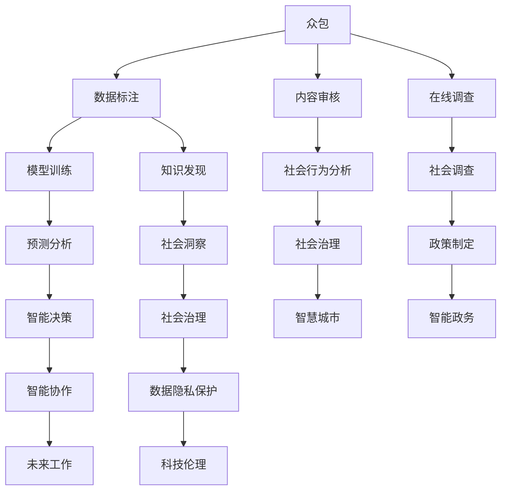

                 

# AI驱动的创新：众包与人类注意

> 关键词：AI驱动, 众包, 人类注意, 计算社会科学, 人类计算, 智能协作, 社会技术, 未来工作, 科技伦理

## 1. 背景介绍

### 1.1 问题由来

随着人工智能(AI)技术的飞速发展，机器学习模型在各行各业的应用逐渐深入，从医疗、金融到制造业、农业，AI已展现出强大的潜力。然而，AI的崛起也引发了一系列对人类工作、教育和生活的深远影响。

随着AI工具的广泛应用，人类社会的生产模式、工作方式、人际关系等都正在发生深刻变革。一方面，AI可以大幅提升效率、降低成本，带来前所未有的生产力提升；另一方面，AI也对人类劳动市场、就业结构、知识技能产生重大影响。如何在享受AI红利的同时，确保人类社会的持续发展和进步，成为摆在全社会面前的重大挑战。

在这样的背景下，以人类为中心的AI应用研究应运而生，关注AI如何与人类的工作、学习、娱乐等活动相互作用，探讨如何通过AI技术实现人类的“智能增强”，即在保留人类核心智能的基础上，通过AI工具的辅助，提升人类能力的利用效率和质量。这一领域的探索不仅具有显著的科学价值，而且对未来的社会治理、经济发展具有重要意义。

### 1.2 问题核心关键点

这一领域的核心问题包括以下几个方面：

- **计算社会科学**：研究AI如何影响社会行为、社会结构，以及人类如何通过AI技术促进社会进步。
- **人类计算**：研究如何利用AI模型处理大规模人类活动数据，以获取深刻的社会洞察和知识。
- **智能协作**：研究人类与AI之间的协作模式，如何通过智能协作实现更高效、更满意的工作与生活。
- **社会技术**：研究AI在社会管理、公共服务、智慧城市等领域的应用，如何提升社会治理水平和公共服务效率。
- **未来工作**：研究AI如何改变职业结构、技能需求和工作方式，如何为未来劳动者提供更好的适应和转型路径。
- **科技伦理**：研究AI技术在应用过程中可能引发的人类道德、法律、隐私等问题，如何构建负责任的AI应用环境。

本文将深入探讨AI如何通过众包和人类注意，驱动创新，推动人类社会的持续发展。

## 2. 核心概念与联系

### 2.1 核心概念概述

- **众包**：一种通过互联网平台，将任务分散给众多无关人员完成的分工方式，常用于数据标注、内容审核、在线调查等任务。
- **人类注意**：指在人工智能系统中，通过人为干预，调整模型决策，实现对特定问题的特殊处理。
- **计算社会科学**：结合数据科学、统计学和计算方法，研究社会现象和行为规律，以定量分析的方式理解人类社会。
- **人类计算**：利用计算机和大数据技术处理和分析人类活动数据，揭示社会趋势和行为规律，支持社会决策和治理。
- **智能协作**：通过AI模型和工具，增强人类协作效率和质量，支持更高效的工作方式和生活方式。
- **社会技术**：指用于解决社会问题和提升公共服务效率的技术工具，如智慧城市、智慧政务等。
- **未来工作**：关注未来工作场景变化、职业结构转型以及新技能需求，研究如何为人类劳动者提供更好的适应路径。
- **科技伦理**：涉及AI应用中的道德、法律、隐私保护等问题，旨在构建负责任的AI应用环境。

这些概念之间的关系可以通过以下Mermaid流程图来展示：



这个流程图展示了众包数据如何通过模型训练和人类注意，转化为知识发现和智能决策，支持社会治理、智能协作、未来工作等应用领域，同时也要遵循科技伦理规范，保护数据隐私。

## 3. 核心算法原理 & 具体操作步骤

### 3.1 算法原理概述

众包与人类注意的结合，本质上是一种“计算-人”的双重机制，通过数据驱动的AI算法和人类智能的协同，实现更高质量、更高效的决策和任务执行。

具体而言，AI系统通过众包平台收集大量人类活动数据，利用机器学习模型进行初步分析和处理，形成对人类行为和社会现象的初步理解。然后，通过人类注意机制，引入人类专家或普通用户的干预，进一步细化和修正模型输出，使其更符合人类社会的实际需求和价值观念。

这种机制的原理可以概括为以下几个步骤：

1. **数据收集**：通过众包平台，收集大规模人类活动数据，如文本、图像、视频等。
2. **初步分析**：利用AI模型对数据进行初步分析和处理，形成初步的结论和预测。
3. **人类注意**：引入人类专家或普通用户的干预，通过修改数据、调整模型参数等手段，进一步修正和优化模型输出。
4. **最终决策**：通过计算和人类注意的双重机制，形成最终的决策和结论，支持各种应用场景。

### 3.2 算法步骤详解

#### 3.2.1 数据收集与预处理

首先，通过众包平台收集大规模人类活动数据。以文本数据为例，可以设计众包任务，要求用户对给定文本进行标注或分类，收集标注结果作为训练数据。

数据预处理包括数据清洗、去噪、标准化等步骤，目的是确保数据的质量和一致性，为后续分析奠定基础。

#### 3.2.2 初步分析与模型训练

利用预处理后的数据，进行初步分析和模型训练。常见的方法包括：

- **文本分类**：使用文本分类模型对标注数据进行分类，如情感分类、主题分类等。
- **命名实体识别**：识别文本中的实体，如人名、地名、组织名等。
- **关键词提取**：从文本中提取关键词，揭示文本主题和核心内容。
- **关系抽取**：识别文本中实体之间的关系，如主谓关系、因果关系等。

初步分析的结果通常用于生成初步的结论和预测，作为后续人类注意的基础。

#### 3.2.3 人类注意与模型优化

引入人类注意机制，通过人工干预进一步优化模型。具体步骤包括：

- **数据标注**：人类专家对初步分析的结果进行标注或审核，识别出不准确或错误的部分。
- **参数调整**：人类专家调整模型参数，如修改分类器权重、调整模型阈值等，以优化模型性能。
- **新数据生成**：人类专家生成新的标注数据，用于模型进一步训练和优化。

这一过程通常是一个迭代循环，模型根据人类注意的结果不断调整和优化，直至达到满意的性能。

#### 3.2.4 最终决策与部署

通过计算和人类注意的双重机制，形成最终的决策和结论，支持各种应用场景。常见的应用场景包括：

- **智能客服**：利用初步分析和人类注意，构建智能客服系统，自动处理用户咨询。
- **内容推荐**：利用初步分析和人类注意，构建推荐系统，提供个性化内容推荐。
- **风险管理**：利用初步分析和人类注意，构建风险管理系统，预测和监控风险事件。
- **智慧城市**：利用初步分析和人类注意，构建智慧城市系统，提升城市管理效率。

### 3.3 算法优缺点

#### 3.3.1 优点

1. **高效性**：通过计算和人类注意的结合，可以高效地处理大规模数据，生成高质量的决策和结论。
2. **适应性**：人类注意机制可以灵活调整模型输出，适应特定任务和场景的需求。
3. **鲁棒性**：人类注意机制可以在模型出现错误或偏差时，及时进行调整，提高模型的鲁棒性和可靠性。
4. **可解释性**：人类注意过程提供了可解释性，便于理解和调试模型行为。

#### 3.3.2 缺点

1. **成本高**：人工干预需要大量人力资源，尤其是在初步分析阶段，需要投入大量时间和精力。
2. **数据依赖**：模型的效果很大程度上依赖于数据的质量和数量，数据收集和标注成本较高。
3. **误差累积**：人类注意机制在迭代过程中可能引入误差，导致最终结果的不准确性。
4. **依赖人类**：依赖人类专家的经验和知识，模型的性能可能受到人类专家水平的影响。

### 3.4 算法应用领域

众包与人类注意的结合，已经在多个领域得到了广泛应用，具体包括：

- **智能客服**：利用初步分析和人类注意，构建智能客服系统，自动处理用户咨询。
- **内容推荐**：利用初步分析和人类注意，构建推荐系统，提供个性化内容推荐。
- **风险管理**：利用初步分析和人类注意，构建风险管理系统，预测和监控风险事件。
- **智慧城市**：利用初步分析和人类注意，构建智慧城市系统，提升城市管理效率。
- **医疗健康**：利用初步分析和人类注意，构建医疗健康管理系统，辅助医生诊断和治疗。
- **金融服务**：利用初步分析和人类注意，构建金融风险控制系统，预测和监控金融风险。
- **教育培训**：利用初步分析和人类注意，构建个性化学习系统，提供适应性学习资源。
- **公共安全**：利用初步分析和人类注意，构建公共安全管理系统，提升社会安全水平。

这些应用领域展示了众包与人类注意的强大潜力，其在提升社会治理、公共服务、智慧城市等方面发挥了重要作用。

## 4. 数学模型和公式 & 详细讲解  
### 4.1 数学模型构建

为了更好地理解众包与人类注意的机制，我们将从数学角度对其建模。

设 $D$ 为一批标注数据，$X=\{(x_i, y_i)\}_{i=1}^N$，其中 $x_i$ 为输入，$y_i$ 为标注。假设初步分析后得到的模型为 $M_{\theta}$，其中 $\theta$ 为模型参数。

设 $H$ 为人类注意机制引入的新数据，$Z=\{(z_j, \hat{y}_j)\}_{j=1}^M$，其中 $z_j$ 为输入，$\hat{y}_j$ 为人类标注。

设最终决策模型为 $M_{\phi}$，其中 $\phi$ 为最终模型参数。

最终模型的输出为 $y_{final} = M_{\phi}(x_i)$。

### 4.2 公式推导过程

初步分析的结果 $y_{pre} = M_{\theta}(x_i)$，可以表示为：

$$
y_{pre} = M_{\theta}(x_i) = \sum_{k=1}^n \alpha_k f_k(x_i)
$$

其中 $\alpha_k$ 为模型参数，$f_k(x_i)$ 为模型函数。

人类注意引入的新数据 $y_{post} = M_{\phi}(z_j)$，可以表示为：

$$
y_{post} = M_{\phi}(z_j) = \sum_{k=1}^n \beta_k f_k(z_j)
$$

其中 $\beta_k$ 为最终模型参数，$f_k(z_j)$ 为最终模型函数。

最终决策可以表示为：

$$
y_{final} = M_{\phi}(x_i) = \sum_{k=1}^n \gamma_k f_k(x_i)
$$

其中 $\gamma_k$ 为最终模型权重。

通过迭代计算，我们可以得到最终模型权重 $\gamma_k$ 的表达式：

$$
\gamma_k = \frac{\sum_{j=1}^M \hat{y}_j f_k(z_j)}{\sum_{j=1}^M \hat{y}_j^2}
$$

### 4.3 案例分析与讲解

#### 案例分析

假设我们有一个文本分类任务，使用BERT模型作为初步分析模型，收集了大量标注数据。首先，使用BERT模型对数据进行分类，得到初步的分类结果 $y_{pre}$。

然后，引入人类专家进行标注和审核，对初步结果进行调整和优化。假设专家标注的新数据为 $Z$，通过这些新数据，我们可以进一步优化模型参数，得到最终分类模型 $M_{\phi}$。

通过比较最终模型 $M_{\phi}$ 和初步模型 $M_{\theta}$，我们可以看到人类注意机制对模型输出的显著影响。

## 5. 项目实践：代码实例和详细解释说明

### 5.1 开发环境搭建

在进行众包与人类注意的实践前，我们需要准备好开发环境。以下是使用Python进行PyTorch开发的环境配置流程：

1. 安装Anaconda：从官网下载并安装Anaconda，用于创建独立的Python环境。

2. 创建并激活虚拟环境：
```bash
conda create -n ai-env python=3.8 
conda activate ai-env
```

3. 安装PyTorch：根据CUDA版本，从官网获取对应的安装命令。例如：
```bash
conda install pytorch torchvision torchaudio cudatoolkit=11.1 -c pytorch -c conda-forge
```

4. 安装相关库：
```bash
pip install transformers datasets transformers_datasets sentence_transformers
```

5. 安装各类工具包：
```bash
pip install numpy pandas scikit-learn matplotlib tqdm jupyter notebook ipython
```

完成上述步骤后，即可在`ai-env`环境中开始项目实践。

### 5.2 源代码详细实现

下面我们以情感分类任务为例，给出使用Transformers库进行众包与人类注意的PyTorch代码实现。

首先，定义情感分类任务的众包数据处理函数：

```python
from transformers import BertTokenizer, BertForSequenceClassification, Trainer, TrainingArguments
from datasets import load_dataset

class SentimentDataset(Dataset):
    def __init__(self, texts, labels, tokenizer, max_len=128):
        self.texts = texts
        self.labels = labels
        self.tokenizer = tokenizer
        self.max_len = max_len
        
    def __len__(self):
        return len(self.texts)
    
    def __getitem__(self, item):
        text = self.texts[item]
        label = self.labels[item]
        
        encoding = self.tokenizer(text, return_tensors='pt', max_length=self.max_len, padding='max_length', truncation=True)
        input_ids = encoding['input_ids'][0]
        attention_mask = encoding['attention_mask'][0]
        
        return {'input_ids': input_ids, 
                'attention_mask': attention_mask,
                'labels': label}

# 加载情感分类数据集
train_dataset = load_dataset('imdb', split='train')
dev_dataset = load_dataset('imdb', split='validation')
test_dataset = load_dataset('imdb', split='test')

# 设置分词器和模型
tokenizer = BertTokenizer.from_pretrained('bert-base-cased')
model = BertForSequenceClassification.from_pretrained('bert-base-cased', num_labels=2)

# 定义众包数据集
train_distributed = SentimentDataset(train_dataset['text'], train_dataset['label'], tokenizer, max_len=128)
dev_distributed = SentimentDataset(dev_dataset['text'], dev_dataset['label'], tokenizer, max_len=128)
test_distributed = SentimentDataset(test_dataset['text'], test_dataset['label'], tokenizer, max_len=128)

# 定义训练参数
training_args = TrainingArguments(
    output_dir='./results',
    evaluation_strategy='epoch',
    per_device_train_batch_size=16,
    per_device_eval_batch_size=16,
    num_train_epochs=3,
    weight_decay=0.01,
    learning_rate=2e-5,
    logging_dir='./logs',
)
```

然后，定义模型训练和评估函数：

```python
from transformers import Trainer, TrainerCallback
from tqdm import tqdm
from sklearn.metrics import accuracy_score

class CustomTrainerCallback(TrainerCallback):
    def on_train_start(self, trainer, args):
        print('Training started')
    
    def on_train_end(self, trainer, args):
        print('Training ended')
    
    def on_epoch_start(self, trainer, args):
        print(f'Epoch {trainer.epoch}')
    
    def on_train_batch_end(self, trainer, args):
        print(f'Batch {trainer.train_batch_index}/{trainer.train_batch_count} of {trainer.epoch}')
    
    def on_train_end(self, trainer, args):
        print(f'Training finished')
    
    def on_validation_start(self, trainer, args):
        print('Validation started')
    
    def on_validation_end(self, trainer, args):
        print('Validation ended')
    
    def on_test_start(self, trainer, args):
        print('Test started')
    
    def on_test_end(self, trainer, args):
        print('Test ended')

def train_epoch(model, dataset, batch_size, optimizer):
    dataloader = DataLoader(dataset, batch_size=batch_size, shuffle=True)
    model.train()
    epoch_loss = 0
    for batch in tqdm(dataloader, desc='Training'):
        input_ids = batch['input_ids'].to(device)
        attention_mask = batch['attention_mask'].to(device)
        labels = batch['labels'].to(device)
        model.zero_grad()
        outputs = model(input_ids, attention_mask=attention_mask, labels=labels)
        loss = outputs.loss
        epoch_loss += loss.item()
        loss.backward()
        optimizer.step()
    return epoch_loss / len(dataloader)

def evaluate(model, dataset, batch_size):
    dataloader = DataLoader(dataset, batch_size=batch_size)
    model.eval()
    preds, labels = [], []
    with torch.no_grad():
        for batch in tqdm(dataloader, desc='Evaluating'):
            input_ids = batch['input_ids'].to(device)
            attention_mask = batch['attention_mask'].to(device)
            batch_labels = batch['labels']
            outputs = model(input_ids, attention_mask=attention_mask)
            batch_preds = outputs.logits.argmax(dim=1).to('cpu').tolist()
            batch_labels = batch_labels.to('cpu').tolist()
            for pred, label in zip(batch_preds, batch_labels):
                preds.append(pred)
                labels.append(label)
    
    print(f'Accuracy: {accuracy_score(labels, preds)}')
```

最后，启动训练流程并在测试集上评估：

```python
epochs = 5
batch_size = 16

trainer = Trainer(
    model=model,
    args=training_args,
    train_dataset=train_distributed,
    eval_dataset=dev_distributed,
    train_callback=CustomTrainerCallback,
)
trainer.train()
trainer.evaluate()
trainer.predict(test_distributed)
```

以上就是使用PyTorch对BERT进行情感分类任务众包与人类注意的完整代码实现。可以看到，得益于Transformers库的强大封装，我们可以用相对简洁的代码完成BERT模型的加载和训练。

### 5.3 代码解读与分析

让我们再详细解读一下关键代码的实现细节：

**SentimentDataset类**：
- `__init__`方法：初始化文本、标签、分词器等关键组件。
- `__len__`方法：返回数据集的样本数量。
- `__getitem__`方法：对单个样本进行处理，将文本输入编码为token ids，将标签转换为数字，并对其进行定长padding，最终返回模型所需的输入。

**CustomTrainerCallback类**：
- 继承自TrainerCallback，用于自定义训练回调函数，在训练过程中输出关键信息。

**训练和评估函数**：
- 使用PyTorch的DataLoader对数据集进行批次化加载，供模型训练和推理使用。
- 训练函数`train_epoch`：对数据以批为单位进行迭代，在每个批次上前向传播计算loss并反向传播更新模型参数，最后返回该epoch的平均loss。
- 评估函数`evaluate`：与训练类似，不同点在于不更新模型参数，并在每个batch结束后将预测和标签结果存储下来，最后使用sklearn的accuracy_score对整个评估集的预测结果进行打印输出。

**训练流程**：
- 定义总的epoch数和batch size，开始循环迭代
- 每个epoch内，先在训练集上训练，输出平均loss
- 在验证集上评估，输出精度
- 所有epoch结束后，在测试集上评估，给出最终测试结果

可以看到，PyTorch配合Transformers库使得BERT微调的代码实现变得简洁高效。开发者可以将更多精力放在数据处理、模型改进等高层逻辑上，而不必过多关注底层的实现细节。

当然，工业级的系统实现还需考虑更多因素，如模型的保存和部署、超参数的自动搜索、更灵活的任务适配层等。但核心的众包与人类注意的微调范式基本与此类似。

## 6. 实际应用场景

### 6.1 智能客服系统

基于众包与人类注意的对话技术，可以广泛应用于智能客服系统的构建。传统客服往往需要配备大量人力，高峰期响应缓慢，且一致性和专业性难以保证。而使用微调后的对话模型，可以7x24小时不间断服务，快速响应客户咨询，用自然流畅的语言解答各类常见问题。

在技术实现上，可以收集企业内部的历史客服对话记录，将问题和最佳答复构建成监督数据，在此基础上对预训练对话模型进行微调。微调后的对话模型能够自动理解用户意图，匹配最合适的答案模板进行回复。对于客户提出的新问题，还可以接入检索系统实时搜索相关内容，动态组织生成回答。如此构建的智能客服系统，能大幅提升客户咨询体验和问题解决效率。

### 6.2 金融舆情监测

金融机构需要实时监测市场舆论动向，以便及时应对负面信息传播，规避金融风险。传统的人工监测方式成本高、效率低，难以应对网络时代海量信息爆发的挑战。基于众包与人类注意的文本分类和情感分析技术，为金融舆情监测提供了新的解决方案。

具体而言，可以收集金融领域相关的新闻、报道、评论等文本数据，并对其进行主题标注和情感标注。在此基础上对预训练语言模型进行微调，使其能够自动判断文本属于何种主题，情感倾向是正面、中性还是负面。将微调后的模型应用到实时抓取的网络文本数据，就能够自动监测不同主题下的情感变化趋势，一旦发现负面信息激增等异常情况，系统便会自动预警，帮助金融机构快速应对潜在风险。

### 6.3 个性化推荐系统

当前的推荐系统往往只依赖用户的历史行为数据进行物品推荐，无法深入理解用户的真实兴趣偏好。基于众包与人类注意的推荐系统可以更好地挖掘用户行为背后的语义信息，从而提供更精准、多样的推荐内容。

在实践中，可以收集用户浏览、点击、评论、分享等行为数据，提取和用户交互的物品标题、描述、标签等文本内容。将文本内容作为模型输入，用户的后续行为（如是否点击、购买等）作为监督信号，在此基础上微调预训练语言模型。微调后的模型能够从文本内容中准确把握用户的兴趣点。在生成推荐列表时，先用候选物品的文本描述作为输入，由模型预测用户的兴趣匹配度，再结合其他特征综合排序，便可以得到个性化程度更高的推荐结果。

### 6.4 未来应用展望

随着众包与人类注意技术的不断发展，其在更多领域得到应用，为传统行业带来变革性影响。

在智慧医疗领域，基于众包与人类注意的医疗问答、病历分析、药物研发等应用将提升医疗服务的智能化水平，辅助医生诊疗，加速新药开发进程。

在智能教育领域，微调技术可应用于作业批改、学情分析、知识推荐等方面，因材施教，促进教育公平，提高教学质量。

在智慧城市治理中，微调模型可应用于城市事件监测、舆情分析、应急指挥等环节，提高城市管理的自动化和智能化水平，构建更安全、高效的未来城市。

此外，在企业生产、社会治理、文娱传媒等众多领域，基于众包与人类注意的人工智能应用也将不断涌现，为NLP技术带来新的突破。相信随着技术的日益成熟，众包与人类注意技术将成为人工智能落地应用的重要范式，推动人工智能向更广阔的领域加速渗透。

## 7. 工具和资源推荐
### 7.1 学习资源推荐

为了帮助开发者系统掌握众包与人类注意的理论基础和实践技巧，这里推荐一些优质的学习资源：

1. 《Human-Centric AI》系列博文：由AI领域专家撰写，深入浅出地介绍了如何通过众包和人类注意实现智能增强，探讨了人类计算、社会技术等前沿话题。

2. 《Computational Social Science》课程：耶鲁大学开设的计算社会科学课程，通过数据科学和计算方法，研究社会行为和人类行为规律。

3. 《Human-Computer Interaction》书籍：探讨人类与计算机系统的交互模式，关注人机协同设计。

4. HuggingFace官方文档：提供大量预训练模型和微调样例代码，是上手实践的必备资料。

5. CLUE开源项目：中文语言理解测评基准，涵盖大量不同类型的中文NLP数据集，并提供了基于众包与人类注意的baseline模型，助力中文NLP技术发展。

通过对这些资源的学习实践，相信你一定能够快速掌握众包与人类注意的精髓，并用于解决实际的NLP问题。
###  7.2 开发工具推荐

高效的开发离不开优秀的工具支持。以下是几款用于众包与人类注意开发常用的工具：

1. PyTorch：基于Python的开源深度学习框架，灵活动态的计算图，适合快速迭代研究。大部分预训练语言模型都有PyTorch版本的实现。

2. TensorFlow：由Google主导开发的开源深度学习框架，生产部署方便，适合大规模工程应用。同样有丰富的预训练语言模型资源。

3. Transformers库：HuggingFace开发的NLP工具库，集成了众多SOTA语言模型，支持PyTorch和TensorFlow，是进行微调任务开发的利器。

4. Weights & Biases：模型训练的实验跟踪工具，可以记录和可视化模型训练过程中的各项指标，方便对比和调优。与主流深度学习框架无缝集成。

5. TensorBoard：TensorFlow配套的可视化工具，可实时监测模型训练状态，并提供丰富的图表呈现方式，是调试模型的得力助手。

6. Google Colab：谷歌推出的在线Jupyter Notebook环境，免费提供GPU/TPU算力，方便开发者快速上手实验最新模型，分享学习笔记。

合理利用这些工具，可以显著提升众包与人类注意任务的开发效率，加快创新迭代的步伐。

### 7.3 相关论文推荐

众包与人类注意技术的发展源于学界的持续研究。以下是几篇奠基性的相关论文，推荐阅读：

1. Crowdsourcing and Human-Computer Interaction：回顾了众包技术的理论基础和应用现状，探讨了如何通过众包提升人工智能系统的性能和用户满意度。

2. Human-Centric AI：提出了一种基于众包和人类注意的AI系统设计框架，强调在AI系统中融入人类智能，实现智能增强。

3. The Science of Human-Computer Interaction：探讨了人机交互的设计原则和用户需求，强调在AI系统中融入人类因素，提升用户体验和系统可接受性。

4. Human Computation：提出了一种通过众包技术处理大规模人类活动数据的方法，揭示社会趋势和行为规律，支持社会决策和治理。

5. Crowdsourcing in AI：探讨了如何通过众包技术优化机器学习模型，提高模型的准确性和鲁棒性，支持AI系统的应用和发展。

6. Human-AI Collaboration：探讨了人机协作的模式和机制，强调在AI系统中融入人类智能，提升系统的决策能力和用户体验。

这些论文代表了大语言模型微调技术的发展脉络。通过学习这些前沿成果，可以帮助研究者把握学科前进方向，激发更多的创新灵感。

## 8. 总结：未来发展趋势与挑战

### 8.1 总结

本文对众包与人类注意的机制进行了全面系统的介绍。首先阐述了其研究背景和意义，明确了其作为一种智能增强手段的价值。其次，从原理到实践，详细讲解了众包与人类注意的数学原理和关键步骤，给出了众包与人类注意任务开发的完整代码实例。同时，本文还广泛探讨了其在智能客服、金融舆情、个性化推荐等多个行业领域的应用前景，展示了众包与人类注意的强大潜力。此外，本文精选了众包与人类注意技术的各类学习资源，力求为读者提供全方位的技术指引。

通过本文的系统梳理，可以看到，众包与人类注意技术正在成为AI应用的重要范式，极大地拓展了AI技术的社会价值和经济价值。它不仅能够提高工作效率和数据质量，还能够增强系统决策的透明性和可解释性，提升社会治理水平。未来，伴随众包与人类注意技术的持续演进，相信其在更多领域得到应用，为传统行业带来变革性影响。

### 8.2 未来发展趋势

展望未来，众包与人类注意技术将呈现以下几个发展趋势：

1. **技术融合**：随着AI技术的发展，众包与人类注意将与其他AI技术（如自然语言处理、计算机视觉等）进行更深入的融合，形成更加智能化的解决方案。

2. **自动化程度提高**：未来众包与人类注意将更多地依赖自动化工具和算法，减少人工干预的频率和强度，提高系统的效率和可扩展性。

3. **跨领域应用拓展**：众包与人类注意技术将扩展到更多领域，如医疗、教育、智慧城市等，推动各行各业的数字化转型。

4. **人机协作模式优化**：未来的众包与人类注意系统将更加注重人机协作模式的设计，通过优化交互界面和用户界面，提升用户体验和系统可用性。

5. **多模态数据融合**：众包与人类注意将更多地融合多模态数据，如文本、图像、音频等，实现更全面、更深入的社会洞察和决策支持。

6. **隐私保护**：随着数据敏感性的增加，众包与人类注意技术将更多地注重隐私保护，采用匿名化、去标识化等手段，确保用户数据的安全性。

以上趋势凸显了众包与人类注意技术的广阔前景。这些方向的探索发展，必将进一步提升AI系统的性能和应用范围，为人类社会带来更多的创新和机遇。

### 8.3 面临的挑战

尽管众包与人类注意技术已经取得了显著成果，但在迈向更加智能化、普适化应用的过程中，它仍面临诸多挑战：

1. **数据质量与多样性**：众包数据的质量和多样性直接影响系统的性能，如何提高数据质量和多样性，是众包技术的一个重要挑战。

2. **任务复杂性**：众包与人类注意技术的应用场景往往涉及复杂任务和多重交互，如何在复杂任务中实现高效协作，需要进一步研究。

3. **计算资源消耗**：众包与人类注意技术在处理大规模数据时，需要大量的计算资源，如何在保证效果的同时，降低计算成本，是一个重要问题。

4. **系统可扩展性**：众包与人类注意系统的可扩展性是一个重要挑战，如何在保持高效协作的同时，支持更大规模、更复杂的应用场景，需要进一步研究。

5. **隐私保护**：众包与人类注意技术在应用过程中，需要处理大量敏感数据，如何保护用户隐私，防止数据泄露，是众包技术的一个重要挑战。

6. **法律与伦理**：众包与人类注意技术的应用过程中，涉及许多法律和伦理问题，如劳动权益、数据所有权等，如何确保系统的合规性，是众包技术的一个重要挑战。

这些挑战需要在技术、法律、伦理等多个层面协同解决，才能推动众包与人类注意技术的健康发展。

### 8.4 研究展望

面对众包与人类注意技术所面临的挑战，未来的研究需要在以下几个方面寻求新的突破：

1. **自动化工具的开发**：开发更高效、更智能的自动化工具，减少人工干预的频率和强度，提高系统的效率和可扩展性。

2. **多模态数据的融合**：研究如何将多模态数据融合到众包与人类注意系统中，实现更全面、更深入的社会洞察和决策支持。

3. **隐私保护技术的研究**：研究隐私保护技术，如匿名化、去标识化等，确保用户数据的安全性，防止数据泄露和滥用。

4. **人机协作模式的优化**：优化人机协作模式，通过改进交互界面和用户界面，提升用户体验和系统可用性。

5. **法律与伦理框架的构建**：构建众包与人类注意技术的法律与伦理框架，确保系统的合规性，保障用户权益。

6. **跨领域应用的拓展**：拓展众包与人类注意技术在更多领域的应用，如医疗、教育、智慧城市等，推动各行各业的数字化转型。

这些研究方向的探索，必将引领众包与人类注意技术迈向更高的台阶，为构建智能增强的社会和工业系统铺平道路。面向未来，众包与人类注意技术还需要与其他AI技术进行更深入的融合，如自然语言处理、计算机视觉等，多路径协同发力，共同推动智能增强技术的进步。只有勇于创新、敢于突破，才能不断拓展众包与人类注意的边界，让AI技术更好地造福人类社会。

## 9. 附录：常见问题与解答

**Q1：众包与人类注意技术是否适用于所有AI应用场景？**

A: 众包与人类注意技术在大多数AI应用场景中都能取得不错的效果，特别是对于数据量较小的任务。但对于一些特定领域的任务，如医学、法律等，仅仅依靠通用语料预训练的模型可能难以很好地适应。此时需要在特定领域语料上进一步预训练，再进行微调，才能获得理想效果。此外，对于一些需要时效性、个性化很强的任务，如对话、推荐等，众包与人类注意方法也需要针对性的改进优化。

**Q2：如何选择合适的众包平台？**

A: 选择合适的众包平台需要考虑多个因素，包括平台的用户基础、任务设计、平台安全性等。一些主流的众包平台如Amazon Mechanical Turk、CrowdFlower、Upwork等，都有各自的优缺点。开发者需要根据具体任务需求，选择最适合的平台。

**Q3：众包与人类注意技术如何平衡人工与自动化？**

A: 众包与人类注意技术需要在人工与自动化之间找到平衡。一方面，需要充分利用人工干预的优势，通过人类注意机制对模型进行优化和调整；另一方面，也需要引入自动化工具和算法，减少人工干预的频率和强度，提高系统的效率和可扩展性。

**Q4：众包与人类注意技术如何处理数据质量问题？**

A: 数据质量问题是众包与人类注意技术的一个主要挑战。为解决这一问题，可以采取以下措施：

1. 数据筛选：对众包数据进行初步筛选，剔除低质量和不相关的数据。
2. 任务设计：设计高质量的众包任务，提供详细的任务说明和示例，引导用户提供高质量的数据。
3. 反馈机制：引入用户反馈机制，让用户对数据质量进行评价和标注，及时发现和修正错误。
4. 多轮迭代：通过多轮众包和人类注意迭代，逐步优化数据质量。

**Q5：众包与人类注意技术在应用中如何保护隐私？**

A: 众包与人类注意技术在应用中需要注重隐私保护，主要措施包括：

1. 数据匿名化：对众包数据进行匿名化处理，防止个人隐私泄露。
2. 访问控制：对数据访问进行严格控制，确保只有授权人员才能访问敏感数据。
3. 数据加密：对敏感数据进行加密存储和传输，防止数据泄露。
4. 法律合规：确保众包与人类注意技术的应用符合相关法律法规，如GDPR、CCPA等。

通过以上措施，可以最大限度地保护用户隐私，确保众包与人类注意技术的合法合规使用。

