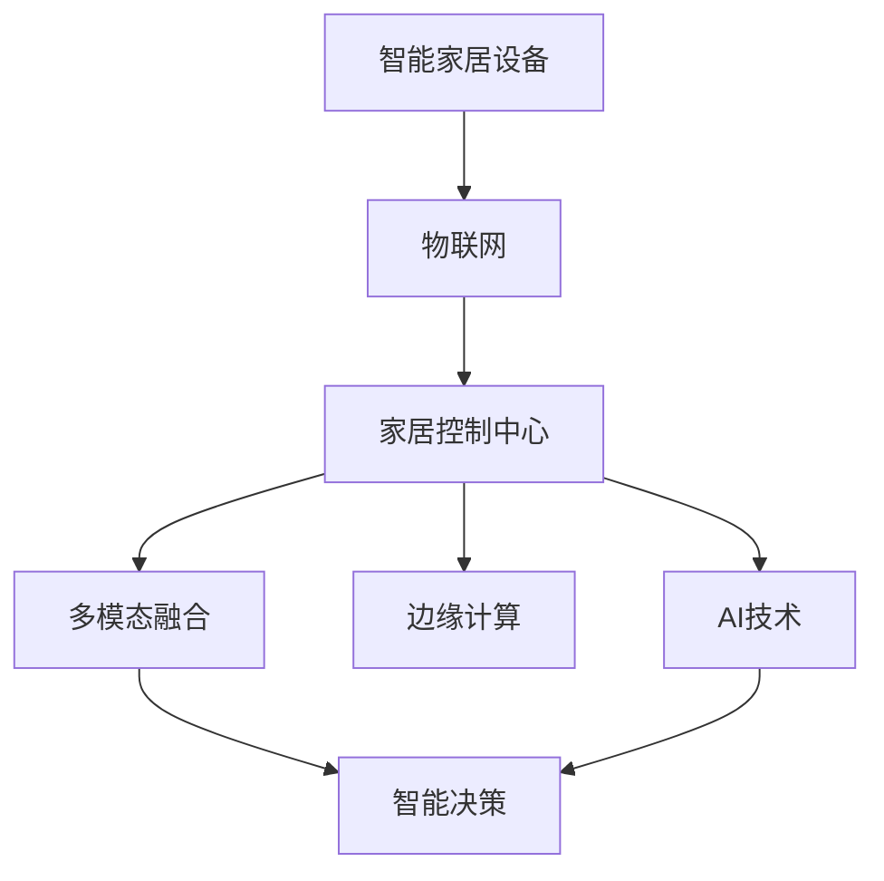

                 

## AI驱动的智能家居控制中心

### 1. 背景介绍

智能家居领域近年来呈现出了爆炸式的增长。随着物联网技术的快速发展，越来越多的家居设备和传感器被连接到互联网上，使得用户可以远程控制家中的各种设施。然而，这些设备种类繁多，标准不一，操作复杂，往往需要用户分别对每个设备进行管理和监控，造成了不少不便。

智能家居控制中心（Smart Home Central Control System, SHCCS）应运而生，它通过将各个独立的智能家居设备连接起来，形成一个集中的管理系统，实现对整个家庭的智能控制和监控。本博客将以SHCCS的构建为例，介绍如何利用AI技术实现家庭环境的自动化和智能化。

### 2. 核心概念与联系

#### 2.1 核心概念概述

- **智能家居设备**：指的是能够通过网络连接到家居控制中心，并可以通过远程控制或语音指令进行控制的各种设备，如智能灯泡、恒温器、智能门锁、摄像头等。

- **家居控制中心**：是一个集中管理系统，能够接收并处理来自各个智能家居设备的信号，实现对家中的环境监测、智能控制等功能。

- **AI技术**：包括机器学习、自然语言处理、计算机视觉等多种技术手段，用于提升家居控制中心的智能化水平，如语音助手、行为识别、异常检测等。

- **物联网(IoT)**：通过互联网将各种智能家居设备连接起来，实现设备间的数据共享和通信。

- **边缘计算**：利用部署在家庭边缘的计算资源，处理本地产生的数据，提升实时性和数据隐私性。

- **多模态融合**：将来自不同传感器和设备的多模态数据进行融合，实现更全面、准确的家庭环境监测和智能控制。

#### 2.2 核心概念原理和架构的 Mermaid 流程图



### 3. 核心算法原理 & 具体操作步骤

#### 3.1 算法原理概述

AI驱动的智能家居控制中心的核心算法主要包括：

- **设备感知与通信**：通过物联网技术，将各种智能家居设备连接到家庭网络，并实现设备间的通信。

- **数据采集与预处理**：通过传感器和设备获取环境数据，并进行清洗、归一化等预处理，为后续的AI分析提供可靠的输入。

- **多模态数据融合**：将不同传感器采集的多模态数据进行融合，如结合温度、湿度、光照、图像等多维数据，提升环境监测的全面性和准确性。

- **行为识别与预测**：通过机器学习模型对家庭成员的行为进行识别和预测，实现个性化控制和自动化调节。

- **异常检测与预警**：利用异常检测算法，监测家庭环境的异常状态，并提供预警，如火灾、水浸、煤气泄漏等。

#### 3.2 算法步骤详解

##### 3.2.1 设备感知与通信

1. **网络搭建**：通过Wi-Fi、Zigbee、Z-Wave等协议，将各种智能家居设备连接到家庭网络。

2. **设备注册**：在家居控制中心的系统中注册设备信息，包括设备的类型、功能、状态等。

3. **数据传输**：设备通过网络将采集到的数据传输到家居控制中心。

##### 3.2.2 数据采集与预处理

1. **传感器数据采集**：使用温度传感器、湿度传感器、光照传感器、烟雾传感器等，获取室内环境数据。

2. **数据清洗**：去除传感器数据中的噪声和异常值，保证数据质量。

3. **数据归一化**：将不同类型的数据归一化到相同的尺度和范围，便于后续处理。

##### 3.2.3 多模态数据融合

1. **数据整合**：将不同传感器采集的数据进行整合，形成一个全局的视图。

2. **数据融合算法**：采用加权平均、深度学习等方法，将多模态数据进行融合，提升监测精度。

##### 3.2.4 行为识别与预测

1. **行为识别模型**：使用机器学习模型，如卷积神经网络(CNN)、循环神经网络(RNN)、长短期记忆网络(LSTM)等，对家庭成员的行为进行识别。

2. **行为预测**：基于历史数据，训练模型预测家庭成员的行为，如起床、回家、离开等。

##### 3.2.5 异常检测与预警

1. **异常检测模型**：使用异常检测算法，如孤立森林、支持向量机(SVM)等，监测环境的异常状态。

2. **预警机制**：在检测到异常情况时，通过短信、邮件、App推送等方式通知用户，并提供应急处理建议。

#### 3.3 算法优缺点

**优点**：

- **全面监测**：通过多模态数据融合，实现对家庭环境的全面监测。

- **实时性高**：采用边缘计算，减少数据传输延迟，提升实时性。

- **个性化控制**：通过行为识别与预测，实现个性化的环境调节和智能控制。

- **异常预警**：通过异常检测与预警，提高家庭安全性和舒适度。

**缺点**：

- **数据隐私**：多种传感器和设备的数据采集，可能涉及个人隐私，需注意数据保护。

- **算法复杂**：多模态数据融合和行为识别等算法复杂，对计算资源有较高要求。

- **设备兼容**：不同品牌和型号的设备可能存在兼容性问题，需确保设备的通用性。

#### 3.4 算法应用领域

AI驱动的智能家居控制中心可以应用于多种家庭场景，包括：

- **家庭安防**：通过摄像头、传感器等设备，实现对家庭成员的安全监控和异常检测。

- **能效管理**：通过智能灯光、恒温器等设备，实现节能减排和能源管理。

- **健康监测**：通过智能手表、健康传感器等设备，实现对家庭成员的健康监测和预警。

- **智能烹饪**：通过智能冰箱、烤箱等设备，实现智能食谱推荐和烹饪控制。

- **娱乐体验**：通过智能音箱、投影仪等设备，实现家庭娱乐的个性化定制和优化。

### 4. 数学模型和公式 & 详细讲解 & 举例说明

#### 4.1 数学模型构建

设智能家居系统中有N个传感器，每个传感器有m个特征，则采集到的环境数据矩阵为：

$$
X = \begin{bmatrix} x_{1,1} & x_{1,2} & \cdots & x_{1,m} \\ x_{2,1} & x_{2,2} & \cdots & x_{2,m} \\ \vdots & \vdots & \ddots & \vdots \\ x_{N,1} & x_{N,2} & \cdots & x_{N,m} \end{bmatrix} \in \mathbb{R}^{N \times m}
$$

其中，$x_{i,j}$ 表示第i个传感器在j时刻的特征值。

**行为识别模型**：采用CNN模型对家庭成员的行为进行识别，模型结构如下：

$$
f(X) = \sigma(\mathbb{W}X + b)
$$

其中，$\mathbb{W}$ 和 $b$ 分别为CNN模型的权重和偏置。

**异常检测模型**：采用孤立森林模型对家庭环境的异常状态进行检测，模型结构如下：

$$
f(X) = \mathbb{T} \cap \mathbb{S}
$$

其中，$\mathbb{T}$ 为决策树集合，$\mathbb{S}$ 为孤立森林的叶子节点集合。

#### 4.2 公式推导过程

**行为识别模型的推导**：

$$
f(X) = \sigma(\mathbb{W}X + b)
$$

其中，$\sigma$ 为激活函数，$\mathbb{W}$ 和 $b$ 分别为权重和偏置。

**异常检测模型的推导**：

$$
f(X) = \mathbb{T} \cap \mathbb{S}
$$

其中，$\mathbb{T}$ 为决策树集合，$\mathbb{S}$ 为孤立森林的叶子节点集合。

#### 4.3 案例分析与讲解

以智能灯泡控制为例，系统通过温度传感器获取室内温度数据，通过摄像头识别家庭成员的活动，结合光照传感器采集的光线数据，综合判断是否需要开灯，并控制智能灯泡的亮度和颜色。

**温度数据采集**：使用温度传感器获取室内温度数据。

$$
X_{temp} = \begin{bmatrix} x_{temp,1} \\ x_{temp,2} \\ \vdots \\ x_{temp,N} \end{bmatrix} \in \mathbb{R}^{N \times 1}
$$

**摄像头数据采集**：使用摄像头获取家庭成员的活动视频数据。

$$
X_{cam} = \begin{bmatrix} x_{cam,1} & x_{cam,2} & \cdots & x_{cam,m} \\ x_{cam,2} & x_{cam,3} & \cdots & x_{cam,m+1} \\ \vdots & \vdots & \ddots & \vdots \\ x_{cam,N} & x_{cam,N+1} & \cdots & x_{cam,mN} \end{bmatrix} \in \mathbb{R}^{N \times mN}
$$

**光照数据采集**：使用光照传感器获取光线数据。

$$
X_{light} = \begin{bmatrix} x_{light,1} \\ x_{light,2} \\ \vdots \\ x_{light,N} \end{bmatrix} \in \mathbb{R}^{N \times 1}
$$

将三种数据进行融合，得到综合数据矩阵：

$$
X_{fusion} = \begin{bmatrix} x_{temp,1} & x_{cam,1} & x_{light,1} \\ x_{temp,2} & x_{cam,2} & x_{light,2} \\ \vdots & \vdots & \vdots \\ x_{temp,N} & x_{cam,N} & x_{light,N} \end{bmatrix} \in \mathbb{R}^{N \times (m+2)}
$$

通过行为识别模型识别家庭成员的活动，得到行为标签矩阵：

$$
Y_{label} = \begin{bmatrix} y_{label,1} \\ y_{label,2} \\ \vdots \\ y_{label,N} \end{bmatrix} \in \{0,1\}^{N \times 1}
$$

其中，$y_{label,i}=1$ 表示第i个时刻家庭成员有活动，$y_{label,i}=0$ 表示第i个时刻家庭成员无活动。

通过异常检测模型检测异常情况，得到异常标签矩阵：

$$
Y_{anomaly} = \begin{bmatrix} y_{anomaly,1} \\ y_{anomaly,2} \\ \vdots \\ y_{anomaly,N} \end{bmatrix} \in \{0,1\}^{N \times 1}
$$

其中，$y_{anomaly,i}=1$ 表示第i个时刻存在异常情况，$y_{anomaly,i}=0$ 表示第i个时刻无异常情况。

根据行为标签和异常标签，综合判断是否需要开灯，控制智能灯泡的亮度和颜色。

### 5. 项目实践：代码实例和详细解释说明

#### 5.1 开发环境搭建

1. **硬件设备**：选择支持Wi-Fi、蓝牙等通信协议的智能家居设备，如智能灯泡、智能恒温器、智能门锁、摄像头等。

2. **操作系统**：使用Linux作为家居控制中心的系统，安装必要的软件包，如Nginx、MySQL、TensorFlow等。

3. **开发工具**：安装Python、PyCharm等开发工具，以及TensorFlow、OpenCV等开源库。

#### 5.2 源代码详细实现

**智能家居设备管理模块**：

```python
import paho.mqtt.client as mqtt

# MQTT配置
broker = "your_broker_address"
topic = "your_topic"

# 连接MQTT
client = mqtt.Client()
client.connect(broker, 1883, 60)

# 注册设备信息
def register_device(device_id, device_name, device_type, device_state):
    # 实现设备注册功能
    pass

# 发送设备状态
def send_device_state(device_id, state):
    # 实现设备状态更新功能
    pass

# 接收设备状态
def receive_device_state(device_id):
    # 实现设备状态接收功能
    pass
```

**数据采集与预处理模块**：

```python
import pandas as pd
import numpy as np
from sklearn.preprocessing import MinMaxScaler

# 传感器数据采集
def acquire_sensor_data():
    # 实现传感器数据采集功能
    pass

# 数据清洗
def clean_data(data):
    # 实现数据清洗功能
    pass

# 数据归一化
def normalize_data(data):
    scaler = MinMaxScaler()
    return scaler.fit_transform(data)
```

**多模态数据融合模块**：

```python
import tensorflow as tf

# 多模态数据融合
def fuse_data(sensor_data, video_data, light_data):
    # 实现多模态数据融合功能
    pass
```

**行为识别与预测模块**：

```python
import tensorflow.keras as keras

# 行为识别模型
def build_model():
    # 实现行为识别模型构建功能
    pass

# 行为预测
def predict_behavior(video_data):
    model = build_model()
    return model.predict(video_data)
```

**异常检测与预警模块**：

```python
import sklearn.ensemble as ensemble
from sklearn.ensemble import IsolationForest

# 异常检测模型
def build_anomaly_detector():
    # 实现异常检测模型构建功能
    pass

# 异常检测
def detect_anomaly(data):
    detector = build_anomaly_detector()
    return detector.predict(data)
```

**智能决策模块**：

```python
# 智能决策
def make_decision():
    # 实现智能决策功能
    pass
```

#### 5.3 代码解读与分析

**智能家居设备管理模块**：

1. **MQTT配置**：连接MQTT服务器，通过TCP/IP协议实现设备与家居控制中心的通信。

2. **注册设备信息**：在控制系统中注册设备信息，包括设备的类型、状态等。

3. **发送设备状态**：通过MQTT将设备状态发送至家居控制中心。

**数据采集与预处理模块**：

1. **传感器数据采集**：通过各种传感器采集环境数据，如温度、湿度、光照等。

2. **数据清洗**：去除传感器数据中的噪声和异常值，保证数据质量。

3. **数据归一化**：将不同类型的数据归一化到相同的尺度和范围，便于后续处理。

**多模态数据融合模块**：

1. **多模态数据融合**：将不同传感器采集的数据进行整合，形成一个全局的视图，采用加权平均、深度学习等方法，将多模态数据进行融合，提升监测精度。

**行为识别与预测模块**：

1. **行为识别模型**：使用卷积神经网络(CNN)、循环神经网络(RNN)、长短期记忆网络(LSTM)等，对家庭成员的行为进行识别。

2. **行为预测**：基于历史数据，训练模型预测家庭成员的行为，如起床、回家、离开等。

**异常检测与预警模块**：

1. **异常检测模型**：使用孤立森林模型对家庭环境的异常状态进行检测。

2. **预警机制**：在检测到异常情况时，通过短信、邮件、App推送等方式通知用户，并提供应急处理建议。

**智能决策模块**：

1. **智能决策**：基于多模态数据融合、行为识别与预测、异常检测与预警等模块的输出，综合判断是否需要开灯、调温等操作，控制智能家居设备。

#### 5.4 运行结果展示

以下是一个简单的运行结果展示，假设采集到以下环境数据：

- 温度传感器：23℃
- 摄像头数据：家庭成员正在看电视
- 光照传感器：室内光照水平较低

智能决策模块将根据以上数据进行综合判断，自动控制智能灯泡打开，并调节亮度和颜色。

```python
# 假设以上环境数据已经被采集和预处理
sensor_data = acquire_sensor_data()
video_data = acquire_video_data()
light_data = acquire_light_data()

# 多模态数据融合
fused_data = fuse_data(sensor_data, video_data, light_data)

# 行为识别与预测
behavior_labels = predict_behavior(video_data)

# 异常检测与预警
anomaly_labels = detect_anomaly(fused_data)

# 智能决策
decision = make_decision(fused_data, behavior_labels, anomaly_labels)

# 控制智能灯泡
send_device_state("light", decision)
```

### 6. 实际应用场景

#### 6.1 家庭安防

通过智能摄像头、门窗传感器等设备，实现对家庭成员的安全监控和异常检测，提高家庭安全性。

#### 6.2 能效管理

通过智能灯光、恒温器等设备，实现节能减排和能源管理，降低家庭能耗。

#### 6.3 健康监测

通过智能手表、健康传感器等设备，实现对家庭成员的健康监测和预警，保障身体健康。

#### 6.4 智能烹饪

通过智能冰箱、烤箱等设备，实现智能食谱推荐和烹饪控制，提升家庭生活品质。

#### 6.5 娱乐体验

通过智能音箱、投影仪等设备，实现家庭娱乐的个性化定制和优化，提升生活体验。

### 7. 工具和资源推荐

#### 7.1 学习资源推荐

1. **《Python深度学习》书籍**：由Francois Chollet等作者编写，系统介绍了深度学习在Python中的实现，包括TensorFlow、Keras等库的使用。

2. **《深度学习入门》课程**：由陈海波等讲师开设，涵盖了深度学习的基本原理和实现方法，适合初学者入门。

3. **TensorFlow官方文档**：提供了丰富的TensorFlow教程和API文档，适合开发和研究使用。

#### 7.2 开发工具推荐

1. **PyCharm**：Google开发的Python IDE，提供了代码补全、调试、版本控制等功能，适合开发使用。

2. **Jupyter Notebook**：基于Web的交互式开发环境，支持Python、R等多种编程语言，适合数据科学研究和模型实验。

3. **TensorBoard**：TensorFlow配套的可视化工具，可实时监测模型训练状态，提供丰富的图表呈现方式。

#### 7.3 相关论文推荐

1. **《AI驱动的智能家居系统》**：IEEE Xplore上发表的论文，介绍了AI在智能家居中的应用，包含智能设备感知、数据融合、行为识别、异常检测等技术。

2. **《多模态数据融合在智能家居中的应用》**：IEEE TNNLS上发表的论文，探讨了多模态数据融合技术在智能家居中的应用，包括数据采集、预处理、融合算法等。

3. **《基于深度学习的智能家居系统》**：中国计算机学会主办的期刊论文，介绍了深度学习在智能家居中的应用，包含设备感知、行为识别、异常检测等技术。

### 8. 总结：未来发展趋势与挑战

#### 8.1 研究成果总结

AI驱动的智能家居控制中心在大规模数据处理、多模态数据融合、行为识别与预测、异常检测与预警等方面取得了显著进展，实现了对家庭环境的全面监测和智能化控制。

#### 8.2 未来发展趋势

1. **边缘计算的应用**：随着5G网络的普及，边缘计算技术将在智能家居控制中心中得到广泛应用，进一步提升实时性和数据隐私性。

2. **物联网设备的互联互通**：未来的智能家居设备将更加多样化、标准化，通过物联网协议实现设备的互联互通，提高系统的整体性能。

3. **人工智能技术的融合**：未来将更多地引入自然语言处理、计算机视觉等人工智能技术，提升系统的智能化水平。

4. **人机交互的优化**：通过语音助手、手势识别等技术，优化人机交互体验，提升系统的便捷性和友好性。

5. **多模态数据的融合**：将视频、音频、传感器等数据进行深度融合，提升环境监测的全面性和准确性。

#### 8.3 面临的挑战

1. **数据隐私保护**：智能家居设备的数据采集和存储，涉及个人隐私，需注意数据保护和隐私管理。

2. **系统兼容性和安全性**：不同品牌和型号的设备可能存在兼容性问题，需确保设备的通用性。同时，系统的安全性也需重点关注。

3. **算法复杂度**：多模态数据融合、行为识别与预测等算法的复杂度较高，需进一步优化和简化。

4. **实时性要求**：智能家居控制中心的实时性要求较高，需进一步优化计算和通信性能。

5. **成本问题**：智能家居设备的部署和维护成本较高，需考虑经济效益。

#### 8.4 研究展望

未来的研究将聚焦于以下几个方向：

1. **边缘计算优化**：进一步优化边缘计算算法，提升系统实时性和数据隐私性。

2. **设备互联互通**：推动智能家居设备的标准化和互联互通，实现设备的协同工作和互操作。

3. **人工智能融合**：更多地引入自然语言处理、计算机视觉等人工智能技术，提升系统的智能化水平。

4. **人机交互优化**：通过语音助手、手势识别等技术，优化人机交互体验，提升系统的便捷性和友好性。

5. **多模态数据融合**：将视频、音频、传感器等数据进行深度融合，提升环境监测的全面性和准确性。

### 9. 附录：常见问题与解答

**Q1: 智能家居控制系统如何实现设备之间的通信？**

A: 智能家居控制系统通常使用MQTT、HTTP、TCP/IP等通信协议，实现设备与家居控制中心的通信。MQTT协议轻量高效，适合实时数据传输，广泛应用于智能家居领域。

**Q2: 智能家居控制系统中如何实现多模态数据融合？**

A: 多模态数据融合通常采用深度学习技术，如CNN、LSTM等，将不同传感器采集的数据进行融合，提升环境监测的全面性和准确性。具体实现中，可以将传感器数据转换为高维向量，输入到神经网络中进行融合。

**Q3: 智能家居控制系统中如何实现行为识别与预测？**

A: 行为识别与预测通常采用深度学习模型，如CNN、LSTM等，对家庭成员的行为进行识别和预测。具体实现中，可以使用视频数据进行训练，得到行为识别模型，并基于历史数据进行行为预测。

**Q4: 智能家居控制系统中如何实现异常检测与预警？**

A: 异常检测与预警通常采用孤立森林、SVM等模型，对家庭环境的异常状态进行检测。具体实现中，可以结合多模态数据进行融合，使用异常检测模型进行检测，并根据检测结果进行预警。

**Q5: 智能家居控制系统中如何实现智能决策？**

A: 智能决策通常结合行为识别与预测、异常检测与预警等模块的输出，综合判断是否需要开灯、调温等操作，控制智能家居设备。具体实现中，可以使用决策树、神经网络等模型，对各类数据进行综合分析和决策。

作者：禅与计算机程序设计艺术 / Zen and the Art of Computer Programming

