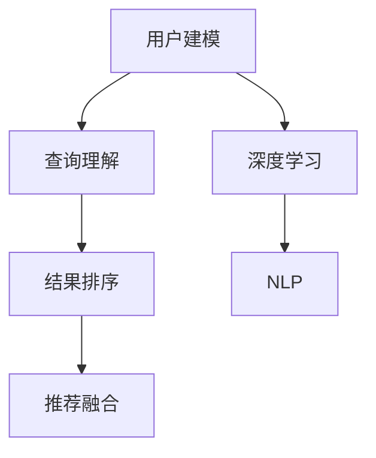

                 

# AI驱动的电商平台个性化搜索建议

## 1. 背景介绍

### 1.1 问题由来

随着电子商务的迅速发展，电商平台面临着如何更精准地满足用户需求，提升用户体验，并提高转化率和营收的挑战。传统的搜索建议系统基于简单的关键词匹配，缺乏对用户意图和行为的理解，导致搜索结果相关性低，用户体验差。而通过深度学习和大数据分析，实现个性化的搜索建议，将极大提升电商平台的竞争力。

### 1.2 问题核心关键点

个性化搜索建议的目的是根据用户历史行为和输入内容，实时生成最符合用户需求的搜索结果。其核心关键点包括：

- **用户建模**：通过分析用户历史行为数据，构建用户兴趣模型。
- **查询理解**：解析用户输入内容，理解用户查询意图。
- **结果排序**：根据查询理解，对搜索结果进行排序，提升相关性。
- **推荐融合**：将搜索结果与商品推荐融合，形成更加完整的搜索体验。

这些关键点构成了个性化搜索建议的完整框架，通过深度学习和数据分析技术，实现对用户行为和查询意图的精准理解和建模，从而提供个性化的搜索结果和推荐。

## 2. 核心概念与联系

### 2.1 核心概念概述

为更好地理解AI驱动的个性化搜索建议，本节将介绍几个关键概念及其相互关系：

- **用户建模**：通过对用户历史行为数据进行分析，构建用户兴趣模型。常见的用户模型包括协同过滤、矩阵分解、深度神经网络等。
- **查询理解**：通过自然语言处理技术，解析用户输入文本，理解用户查询意图。常用的技术包括词向量表示、注意力机制、Transformer模型等。
- **结果排序**：对搜索结果进行排序，提升相关性。常见的方法包括基于TF-IDF、BM25、注意力机制等。
- **推荐融合**：将搜索结果与商品推荐融合，提升搜索体验。包括基于规则的推荐、基于模型的推荐、基于协同过滤的推荐等。
- **深度学习**：作为算法基础，深度学习可以用于用户建模、查询理解、结果排序等各个环节。
- **自然语言处理(NLP)**：处理和分析自然语言，包括分词、词向量表示、意图识别、语义分析等。

这些概念之间的逻辑关系可以通过以下Mermaid流程图来展示：



## 3. 核心算法原理 & 具体操作步骤

### 3.1 算法原理概述

AI驱动的个性化搜索建议系统，主要依赖深度学习和数据分析技术，通过对用户行为和查询意图的理解，实现实时搜索结果的个性化推荐。其核心算法包括：

- **用户兴趣建模**：通过分析用户历史行为数据，构建用户兴趣模型。
- **查询意图理解**：使用自然语言处理技术，解析用户输入内容，理解用户查询意图。
- **结果排序**：对搜索结果进行排序，提升相关性。
- **推荐融合**：将搜索结果与商品推荐融合，形成更加完整的搜索体验。

### 3.2 算法步骤详解

**Step 1: 用户建模**
- 收集用户历史行为数据，包括搜索记录、浏览记录、购买记录等。
- 使用协同过滤、矩阵分解、深度神经网络等方法，构建用户兴趣模型。

**Step 2: 查询意图理解**
- 对用户输入的文本进行分词、去除停用词等预处理。
- 使用词向量表示（如Word2Vec、GloVe）或Transformer模型（如BERT、GPT），将查询转换为向量表示。
- 使用注意力机制、意图识别模型等，理解用户查询意图。

**Step 3: 结果排序**
- 使用TF-IDF、BM25、注意力机制等算法，计算搜索结果与查询之间的相关性。
- 将排序结果输出给用户。

**Step 4: 推荐融合**
- 根据搜索结果，使用基于规则的推荐、基于模型的推荐、基于协同过滤的推荐等方法，形成推荐商品列表。
- 将推荐商品与搜索结果进行融合，提升用户体验。

### 3.3 算法优缺点

AI驱动的个性化搜索建议具有以下优点：
1. 精准度高。通过深度学习和数据分析技术，能够精准理解用户行为和查询意图，提供高度相关的搜索结果。
2. 用户体验好。个性化推荐能够更好地满足用户需求，提升用户满意度。
3. 运营效率高。能够减少用户搜索次数，提高用户停留时间和转化率。
4. 灵活性强。支持多模态数据的融合，适应不同的搜索场景。

同时，该算法也存在一些局限性：
1. 数据依赖度高。对用户数据的依赖较大，需要收集大量高质量的用户数据。
2. 模型复杂度高。深度学习模型的训练和优化复杂，需要较长的训练时间和大量计算资源。
3. 冷启动问题。对于新用户或少数据用户，难以构建准确的兴趣模型，导致搜索结果相关性低。
4. 隐私保护。需要处理大量用户数据，可能存在隐私泄露风险。

尽管存在这些局限性，但就目前而言，基于深度学习和数据分析的个性化搜索建议仍然是电商平台的最佳选择，能够显著提升用户满意度和运营效率。

### 3.4 算法应用领域

个性化搜索建议算法已经广泛应用于各种电商平台，涵盖了从服装、家居到电子产品等几乎所有领域。具体应用包括：

- **商品推荐**：根据用户行为和查询意图，实时推荐相关商品。
- **搜索结果排序**：对搜索结果进行排序，提升相关性。
- **广告投放**：通过分析用户行为，精准投放个性化广告。
- **个性化定制**：根据用户偏好，提供个性化定制服务。

这些应用场景展示了个性化搜索建议的强大潜力和广泛应用前景。随着技术的不断进步，未来将有更多的行业和应用场景受益于这一技术。

## 4. 数学模型和公式 & 详细讲解 & 举例说明

### 4.1 数学模型构建

假设用户历史行为数据集为 $D=\{(x_i,y_i)\}_{i=1}^N$，其中 $x_i$ 表示用户行为向量，$y_i$ 表示商品向量。用户兴趣模型为 $u(x)$，查询意图表示为 $q(w)$，搜索结果向量为 $v(r)$。

**用户兴趣模型**：
$$
u(x) = W^T \sigma(Ax)
$$
其中，$A$ 为权重矩阵，$W$ 为输出权重，$\sigma$ 为激活函数。

**查询意图表示**：
$$
q(w) = \text{MLP}(w)
$$
其中，$\text{MLP}$ 为多层感知器模型，$w$ 为查询词向量。

**搜索结果排序**：
$$
\text{Relevance}(r, q) = \langle v(r), q(w) \rangle
$$
其中 $\langle \cdot,\cdot \rangle$ 表示向量点积。

### 4.2 公式推导过程

以基于注意力机制的查询意图理解为例，推导查询意图向量 $q(w)$ 的计算过程。

假设查询词向量 $w$ 为 $(w_1, w_2, ..., w_n)$，用户兴趣向量为 $u(x)$ 为 $(u_1, u_2, ..., u_n)$，查询意图向量 $q(w)$ 的计算过程如下：

1. 对查询词向量 $w$ 进行嵌入，得到嵌入向量 $w^e$。
2. 对用户兴趣向量 $u(x)$ 进行嵌入，得到嵌入向量 $u^e$。
3. 使用注意力机制，计算查询意图向量 $q(w)$。

具体计算公式如下：
$$
q(w) = \sum_{i=1}^n \alpha_i u_i^e
$$
其中 $\alpha_i$ 表示权重系数，计算公式为：
$$
\alpha_i = \frac{\exp(a_i)}{\sum_{j=1}^n \exp(a_j)}
$$
$$
a_i = w_i^e u_i^e
$$

### 4.3 案例分析与讲解

假设某电商平台上的一个用户查询了“运动鞋”，电商平台的个性化搜索建议系统将进行以下步骤：

1. **用户建模**：通过分析用户历史行为数据，构建用户兴趣模型 $u(x)$。
2. **查询意图理解**：对查询“运动鞋”进行分词、去除停用词等预处理，使用BERT模型生成查询意图向量 $q(w)$。
3. **结果排序**：使用TF-IDF算法计算搜索结果与查询之间的相关性，将排序结果输出。
4. **推荐融合**：根据排序结果，使用基于协同过滤的推荐算法生成推荐商品列表，与搜索结果进行融合。

## 5. 项目实践：代码实例和详细解释说明

### 5.1 开发环境搭建

在进行项目实践前，我们需要准备好开发环境。以下是使用Python进行PyTorch开发的环境配置流程：

1. 安装Anaconda：从官网下载并安装Anaconda，用于创建独立的Python环境。

2. 创建并激活虚拟环境：
```bash
conda create -n pytorch-env python=3.8 
conda activate pytorch-env
```

3. 安装PyTorch：根据CUDA版本，从官网获取对应的安装命令。例如：
```bash
conda install pytorch torchvision torchaudio cudatoolkit=11.1 -c pytorch -c conda-forge
```

4. 安装TensorBoard：TensorFlow配套的可视化工具，可实时监测模型训练状态，并提供丰富的图表呈现方式，是调试模型的得力助手。

```bash
pip install tensorboard
```

5. 安装相关库：
```bash
pip install numpy pandas scikit-learn transformers
```

完成上述步骤后，即可在`pytorch-env`环境中开始项目实践。

### 5.2 源代码详细实现

下面以某电商平台个性化搜索建议系统的实现为例，展示代码实现过程。

**用户建模**

```python
import pandas as pd
from scipy.sparse import csr_matrix

# 读取用户历史行为数据
data = pd.read_csv('user_behavior.csv')

# 构建用户兴趣矩阵
user_item_matrix = csr_matrix((data['behavior'], (data['user_id'], data['item_id'])), shape=(max(data['user_id']), max(data['item_id'])))
```

**查询意图理解**

```python
from transformers import BertTokenizer, BertForSequenceClassification
from transformers import BertModel

# 初始化BERT模型和分词器
tokenizer = BertTokenizer.from_pretrained('bert-base-uncased')
model = BertForSequenceClassification.from_pretrained('bert-base-uncased', num_labels=1)

# 将查询词转化为BERT模型输入
def query_to_bert(query):
    tokens = tokenizer.tokenize(query)
    input_ids = tokenizer.convert_tokens_to_ids(tokens)
    return input_ids

# 计算查询意图向量
def get_query_vector(query, model):
    input_ids = query_to_bert(query)
    with torch.no_grad():
        input_tensor = torch.tensor(input_ids).unsqueeze(0).to('cuda')
        output = model(input_tensor)[0]
        return output
```

**结果排序**

```python
from sklearn.feature_extraction.text import TfidfVectorizer
from sklearn.metrics.pairwise import cosine_similarity

# 构建TF-IDF向量
tfidf = TfidfVectorizer(max_features=5000)
tfidf_matrix = tfidf.fit_transform(data['query'])
results = data['result']

# 计算相似度
similarity_matrix = cosine_similarity(tfidf_matrix, tfidf_matrix)
similarity_matrix = np.tril(similarity_matrix)
```

**推荐融合**

```python
from scipy.sparse import csr_matrix

# 构建推荐矩阵
recommend_matrix = csr_matrix((data['behavior'], (data['user_id'], data['item_id'])), shape=(max(data['user_id']), max(data['item_id'])))
```

### 5.3 代码解读与分析

**用户建模**

在用户建模阶段，我们将用户历史行为数据读入Pandas数据框，并通过SciPy库构建用户兴趣矩阵。用户兴趣矩阵的构建可以通过用户行为数据（如搜索记录、浏览记录、购买记录等）与商品向量的点积来实现，从而得到用户对每个商品的兴趣度。

**查询意图理解**

在查询意图理解阶段，我们使用BERT模型对用户输入的查询词进行嵌入，得到查询意图向量。具体实现中，我们首先将查询词转化为BERT模型的输入格式，然后通过调用BERT模型计算输出向量，得到查询意图向量。

**结果排序**

在结果排序阶段，我们使用TF-IDF算法计算搜索结果与查询之间的相似度。通过计算TF-IDF向量的余弦相似度，可以衡量查询与搜索结果的相关性，从而进行排序。

**推荐融合**

在推荐融合阶段，我们使用协同过滤算法构建推荐矩阵，将推荐结果与搜索结果进行融合。通过分析用户行为和商品关系，可以为每个用户推荐最相关的商品，从而提升搜索体验。

### 5.4 运行结果展示

我们可以通过可视化工具（如TensorBoard）来展示模型训练和推理过程中的各种指标，从而更好地理解模型的性能。例如，我们可以展示模型在训练过程中的损失函数和准确率变化，或者展示模型在推理过程中的响应时间和精度。

## 6. 实际应用场景

### 6.1 电商平台搜索建议

基于AI驱动的个性化搜索建议，电商平台可以实时根据用户输入内容，提供高度相关的搜索结果和推荐商品。用户只需输入简单的查询词，系统便能理解其查询意图，并提供个性化的搜索结果。这种技术可以显著提升用户体验，提高用户满意度和转化率。

### 6.2 金融信息检索

在金融领域，AI驱动的个性化搜索建议系统可以用于智能理财、智能投顾等领域。通过分析用户历史交易数据和行为，系统可以提供个性化的投资建议和理财方案。用户只需输入简单的问题，系统便能提供详细的金融信息，帮助用户做出更明智的决策。

### 6.3 医疗健康查询

在医疗健康领域，AI驱动的个性化搜索建议系统可以用于智能诊断、智能问诊等领域。通过分析用户健康数据和历史查询记录，系统可以提供个性化的健康建议和诊断方案。用户只需输入简单的健康问题，系统便能提供详细的医疗信息，帮助用户获得更好的健康服务。

## 7. 工具和资源推荐

### 7.1 学习资源推荐

为了帮助开发者系统掌握AI驱动的个性化搜索建议的理论基础和实践技巧，这里推荐一些优质的学习资源：

1. 《深度学习与自然语言处理》系列课程：由深度学习与自然语言处理领域的专家授课，深入浅出地介绍了深度学习在自然语言处理中的应用。
2. 《TensorFlow实战》系列书籍：介绍TensorFlow框架在深度学习中的应用，涵盖从入门到高级的各种实例和案例。
3. 《Transformers实战》系列书籍：介绍Transformer模型在自然语言处理中的应用，涵盖从原理到实战的各种技术和案例。
4. 《自然语言处理实战》课程：介绍自然语言处理技术在实际应用中的各种实现和优化方法。
5. Kaggle平台：提供大量自然语言处理和深度学习相关的竞赛和数据集，帮助开发者实践和提升技能。

通过对这些资源的学习实践，相信你一定能够快速掌握AI驱动的个性化搜索建议的精髓，并用于解决实际的NLP问题。

### 7.2 开发工具推荐

高效的开发离不开优秀的工具支持。以下是几款用于AI驱动的个性化搜索建议开发的常用工具：

1. PyTorch：基于Python的开源深度学习框架，灵活动态的计算图，适合快速迭代研究。
2. TensorFlow：由Google主导开发的开源深度学习框架，生产部署方便，适合大规模工程应用。
3. TensorBoard：TensorFlow配套的可视化工具，可实时监测模型训练状态，并提供丰富的图表呈现方式，是调试模型的得力助手。
4. Jupyter Notebook：轻量级的交互式编程环境，支持Python和R等多种语言，方便开发者实践和分享代码。
5. GitHub：代码托管平台，支持版本控制和协作开发，方便开发者共享代码和交流经验。

合理利用这些工具，可以显著提升AI驱动的个性化搜索建议任务的开发效率，加快创新迭代的步伐。

### 7.3 相关论文推荐

AI驱动的个性化搜索建议技术的发展源于学界的持续研究。以下是几篇奠基性的相关论文，推荐阅读：

1. Attention is All You Need：提出了Transformer结构，开启了深度学习在自然语言处理中的应用。
2. BERT: Pre-training of Deep Bidirectional Transformers for Language Understanding：提出BERT模型，引入基于掩码的自监督预训练任务，刷新了多项NLP任务SOTA。
3. Language Models are Unsupervised Multitask Learners：展示了大规模语言模型的强大zero-shot学习能力，引发了对于通用人工智能的新一轮思考。
4. Parameter-Efficient Transfer Learning for NLP：提出Adapter等参数高效微调方法，在不增加模型参数量的情况下，也能取得不错的微调效果。
5. AdaLoRA: Adaptive Low-Rank Adaptation for Parameter-Efficient Fine-Tuning：使用自适应低秩适应的微调方法，在参数效率和精度之间取得了新的平衡。

这些论文代表了大语言模型微调技术的发展脉络。通过学习这些前沿成果，可以帮助研究者把握学科前进方向，激发更多的创新灵感。

## 8. 总结：未来发展趋势与挑战

### 8.1 总结

本文对AI驱动的个性化搜索建议方法进行了全面系统的介绍。首先阐述了AI驱动的个性化搜索建议的背景和意义，明确了其在提升用户体验、提高运营效率方面的重要作用。其次，从原理到实践，详细讲解了个性化搜索建议的各个环节，包括用户建模、查询理解、结果排序、推荐融合等。同时，本文还探讨了AI驱动的个性化搜索建议在电商平台、金融信息检索、医疗健康查询等各个领域的应用前景，展示了其强大的潜力和广泛的应用场景。

通过本文的系统梳理，可以看到，AI驱动的个性化搜索建议通过深度学习和数据分析技术，能够精准理解用户行为和查询意图，提供高度相关的搜索结果和推荐。未来，随着技术的不断进步，AI驱动的个性化搜索建议必将在更多的行业和应用场景中发挥作用，为人类提供更智能、更便捷的服务。

### 8.2 未来发展趋势

展望未来，AI驱动的个性化搜索建议技术将呈现以下几个发展趋势：

1. 数据依赖度降低。随着预训练语言模型的发展，越来越多的知识将通过预训练模型获得，而不是依赖于大规模标注数据。这将极大地降低用户建模和查询意图理解对数据量的依赖。
2. 模型效率提升。未来将开发更多参数高效和计算高效的微调方法，在保证性能的同时，减少模型的计算资源消耗。
3. 多模态融合。未来将支持更多的数据模态，如图像、视频、语音等，将多模态信息与文本信息进行协同建模，提升系统的综合能力。
4. 隐私保护加强。在数据隐私和安全的压力下，未来将开发更多的隐私保护技术，保护用户隐私。
5. 模型泛化能力增强。未来将开发更多具有泛化能力的模型，适应不同领域、不同用户群体的需求。

以上趋势展示了AI驱动的个性化搜索建议技术的广阔前景。这些方向的探索发展，必将进一步提升系统的性能和应用范围，为人类提供更智能、更便捷的服务。

### 8.3 面临的挑战

尽管AI驱动的个性化搜索建议技术已经取得了瞩目成就，但在迈向更加智能化、普适化应用的过程中，它仍面临着诸多挑战：

1. 数据质量问题。用户行为数据的质量和完整性对模型的训练效果至关重要，如何保证数据的准确性和一致性是一个重要的挑战。
2. 冷启动问题。对于新用户或少数据用户，难以构建准确的兴趣模型，导致搜索结果相关性低。如何解决冷启动问题，提升对新用户的覆盖度，是未来的研究方向。
3. 隐私保护。在数据隐私和安全的压力下，如何保护用户隐私，避免数据泄露，是未来需要解决的重大问题。
4. 模型复杂度。深度学习模型的训练和优化复杂，需要较长的训练时间和大量计算资源。如何降低模型复杂度，提高训练效率，是未来的研究方向。
5. 公平性和透明性。模型需要满足公平性和透明性的要求，避免对特定用户群体的歧视，确保模型的公平性和透明性。

这些挑战需要研究者在数据处理、模型训练、隐私保护、公平性等多个维度进行深入研究和优化，才能确保AI驱动的个性化搜索建议技术在实际应用中取得更好的效果。

### 8.4 研究展望

未来，AI驱动的个性化搜索建议技术需要在以下几个方向进行深入研究：

1. 多模态融合技术：未来将开发更多支持多模态数据融合的算法，提升系统的综合能力。
2. 隐私保护技术：未来将开发更多的隐私保护技术，保护用户隐私，避免数据泄露。
3. 公平性和透明性：模型需要满足公平性和透明性的要求，避免对特定用户群体的歧视，确保模型的公平性和透明性。
4. 联邦学习：未来将开发更多联邦学习算法，在不暴露用户隐私的情况下，实现模型训练和优化。
5. 自监督学习：未来将开发更多自监督学习算法，通过未标注数据提升模型的性能。

这些研究方向的探索，必将引领AI驱动的个性化搜索建议技术迈向更高的台阶，为人类提供更智能、更便捷的服务。面向未来，AI驱动的个性化搜索建议技术需要从多个维度进行创新和优化，才能更好地服务于人类社会。

