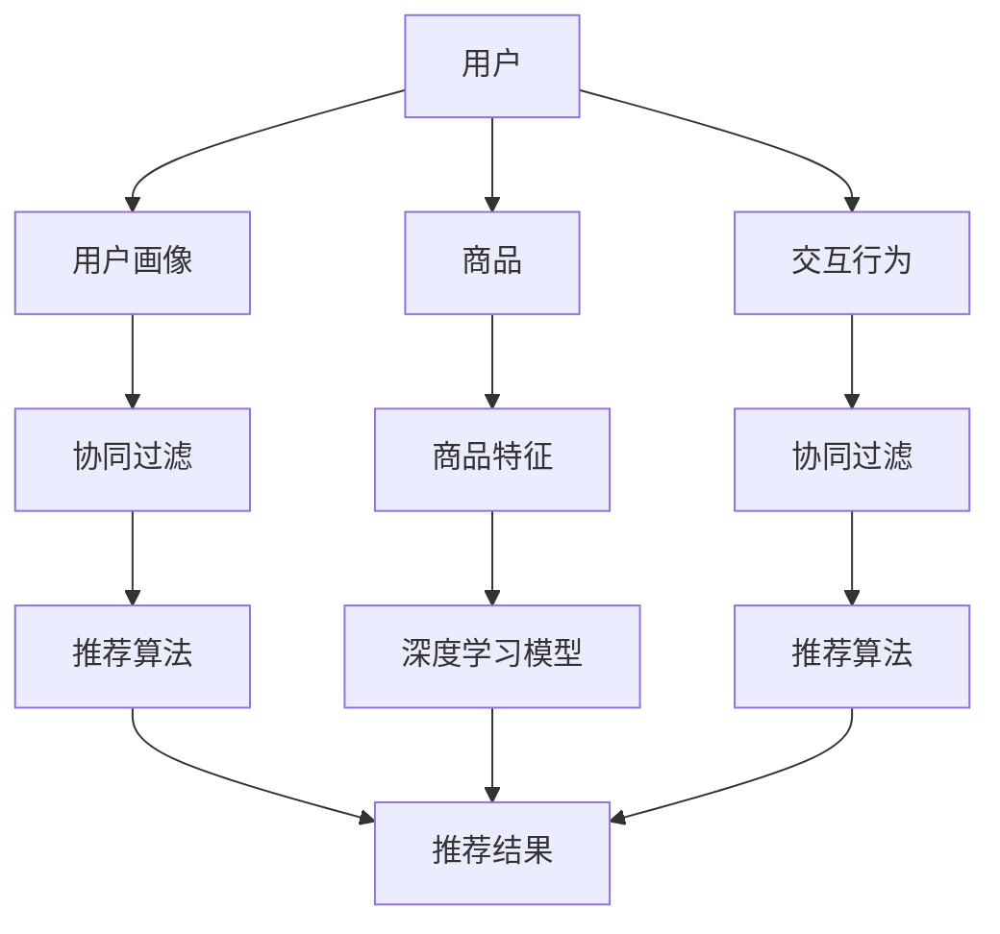

                 

# AI驱动的电商平台商品组合推荐

> 关键词：人工智能,电商平台,商品推荐,推荐系统,协同过滤,深度学习,模型融合,数据增强,用户画像

## 1. 背景介绍

### 1.1 问题由来
在数字化时代，电商平台已成为消费者购物的主要渠道。用户在网上浏览商品时，需要大量时间和精力才能找到满意的商品，这不仅影响了用户体验，还降低了购物转化率。为此，电商平台亟需一种有效的推荐系统，帮助用户快速发现感兴趣的商品。

推荐系统通常基于用户的历史行为数据和商品属性，为用户推荐相关商品，提升购物体验。然而，传统推荐系统仅考虑用户和商品之间的静态关系，无法捕捉到用户的动态变化和多样化需求。为了解决这个问题，AI驱动的商品推荐系统应运而生，通过深度学习等先进技术，能够动态捕捉用户兴趣和商品特征，生成更加精准的推荐结果。

### 1.2 问题核心关键点
AI驱动的商品推荐系统，是指通过机器学习算法和深度学习模型，对用户和商品进行高维特征表示，从而实现对用户兴趣的动态理解和商品推荐的实时更新。这一系统的核心在于：

- **深度学习模型**：采用卷积神经网络(CNN)、循环神经网络(RNN)、注意力机制等深度学习技术，捕捉用户和商品的多维特征表示。
- **协同过滤**：利用用户-商品交互数据，学习用户兴趣和商品属性之间的关系，并用于推荐新商品。
- **用户画像构建**：基于用户的历史行为数据和商品互动信息，生成用户画像，提升推荐精度。
- **模型融合**：结合多种推荐算法和模型，综合生成推荐结果，实现优势互补。
- **数据增强**：通过数据合成、变换等方法，扩大数据集规模，提升模型泛化能力。

## 2. 核心概念与联系

### 2.1 核心概念概述

为了深入理解AI驱动的商品推荐系统，这里将介绍几个密切相关的核心概念：

- **深度学习**：一种通过多层神经网络逼近复杂函数的机器学习技术，广泛应用于图像处理、自然语言处理、推荐系统等领域。
- **协同过滤**：基于用户历史行为和商品属性数据，预测用户对新商品的兴趣和评分，推荐相关商品。
- **用户画像**：基于用户历史行为数据和商品互动信息，生成用户兴趣和行为特征，用于个性化推荐。
- **推荐算法**：包括基于内容的推荐、协同过滤、基于规则的推荐、深度推荐等，不同算法适用于不同场景。
- **模型融合**：通过组合多种推荐算法，提高推荐系统的稳定性和准确性。
- **数据增强**：通过数据合成、变换等方法，扩大数据集规模，提升模型泛化能力。

这些核心概念之间通过特定的算法和架构相互关联，共同构建了AI驱动的商品推荐系统。

### 2.2 核心概念原理和架构的 Mermaid 流程图



该流程图展示了用户画像、协同过滤、推荐算法等核心概念在推荐系统中的作用。用户画像通过用户的历史行为数据和商品互动信息生成，协同过滤利用用户历史行为数据预测用户对新商品的兴趣，推荐算法将多种方法融合生成最终的推荐结果。

## 3. 核心算法原理 & 具体操作步骤
### 3.1 算法原理概述

AI驱动的商品推荐系统，主要基于深度学习、协同过滤等算法，对用户和商品进行高维特征表示，从而实现精准推荐。其核心思想是：

1. **深度学习模型**：利用神经网络模型，对用户和商品进行多维特征表示，捕捉用户兴趣和商品特征之间的关系。
2. **协同过滤**：通过用户历史行为和商品属性数据，预测用户对新商品的兴趣和评分，推荐相关商品。
3. **用户画像构建**：基于用户历史行为数据和商品互动信息，生成用户兴趣和行为特征，用于个性化推荐。
4. **模型融合**：结合多种推荐算法和模型，综合生成推荐结果，实现优势互补。
5. **数据增强**：通过数据合成、变换等方法，扩大数据集规模，提升模型泛化能力。

### 3.2 算法步骤详解

基于上述核心算法，AI驱动的商品推荐系统通常包括以下关键步骤：

**Step 1: 数据预处理和特征工程**

- **数据收集**：收集用户历史行为数据和商品属性信息，如浏览记录、购买记录、商品评分、商品属性等。
- **数据清洗**：去除噪声和异常值，处理缺失值，确保数据质量。
- **特征提取**：对用户和商品进行特征提取，如用户兴趣标签、商品类别、品牌、价格等。

**Step 2: 用户画像构建**

- **用户行为分析**：基于用户历史行为数据，分析用户兴趣和行为模式。
- **用户特征生成**：通过TF-IDF、协同过滤等方法，生成用户特征向量。
- **用户画像表示**：将用户特征向量与商品特征向量合并，形成用户画像。

**Step 3: 深度学习模型训练**

- **选择模型架构**：选择适当的深度学习模型，如CNN、RNN、注意力机制等。
- **训练模型**：利用用户画像和商品特征数据，训练深度学习模型。
- **模型优化**：通过超参数调优和正则化技术，提高模型泛化能力和性能。

**Step 4: 协同过滤和推荐算法**

- **协同过滤**：基于用户历史行为数据和商品属性，预测用户对新商品的兴趣。
- **推荐算法**：结合多种推荐算法，如基于内容的推荐、协同过滤、基于规则的推荐等，生成推荐结果。
- **模型融合**：将多个推荐结果进行融合，生成最终推荐结果。

**Step 5: 数据增强和模型部署**

- **数据增强**：通过数据合成、变换等方法，扩大数据集规模，提升模型泛化能力。
- **模型部署**：将训练好的模型部署到电商平台上，实时生成推荐结果。
- **监控和优化**：实时监控推荐系统性能，根据反馈数据进行优化和调整。

### 3.3 算法优缺点

AI驱动的商品推荐系统具有以下优点：

1. **精度高**：利用深度学习技术，能够捕捉用户兴趣和商品特征的复杂关系，生成更加精准的推荐结果。
2. **实时性**：通过深度学习模型实时生成推荐结果，能够快速响应用户需求。
3. **个性化**：通过用户画像和个性化推荐算法，能够根据用户偏好和行为进行精准推荐。
4. **灵活性**：可以结合多种推荐算法和模型，适应不同推荐场景。

同时，该方法也存在一定的局限性：

1. **数据需求高**：深度学习模型需要大量的高质量标注数据，收集和清洗成本较高。
2. **模型复杂**：深度学习模型结构复杂，训练和推理效率较低，资源消耗较大。
3. **对抗攻击易受影响**：深度学习模型易受到对抗样本的攻击，导致推荐结果不准确。
4. **用户隐私风险**：用户历史行为数据和商品互动信息涉及用户隐私，需要严格保护。

尽管存在这些局限性，但就目前而言，基于深度学习的推荐系统是商品推荐领域的主流技术，能够显著提升用户购物体验和平台转化率。未来相关研究的重点在于如何进一步降低深度学习模型的资源消耗，提高推荐系统的实时性和安全性，同时兼顾用户隐私保护。

### 3.4 算法应用领域

AI驱动的商品推荐系统已经在电商、在线教育、社交网络等多个领域得到了广泛应用，取得了显著成效：

- **电商领域**：如亚马逊、淘宝、京东等电商平台，通过推荐系统提升用户购物体验，增加平台销售额。
- **在线教育领域**：如Coursera、Udacity等在线教育平台，通过推荐系统推荐课程和学习资源，提升学习效果。
- **社交网络领域**：如微信、微博等社交平台，通过推荐系统推荐好友、文章和视频，增加用户黏性。

除了上述这些典型应用外，AI驱动的商品推荐系统还被创新性地应用到更多场景中，如智能家居、智慧医疗、智能物流等，为各行各业带来新的突破。

## 4. 数学模型和公式 & 详细讲解 & 举例说明

### 4.1 数学模型构建

在推荐系统中，通常使用矩阵分解方法对用户-商品评分矩阵进行分解，得到用户兴趣向量和商品特征向量。形式化地，设用户-商品评分矩阵为 $X \in \mathbb{R}^{U \times N}$，其中 $U$ 为用户的数量，$N$ 为商品的数量。

设用户兴趣向量为 $p \in \mathbb{R}^{U \times D}$，商品特征向量为 $q \in \mathbb{R}^{N \times D}$，其中 $D$ 为特征维度。则推荐模型的预测评分 $y$ 可以表示为：

$$
y = p \cdot q^T
$$

预测评分与实际评分之间的误差 $e$ 可以通过均方误差损失函数进行优化：

$$
\mathcal{L} = \frac{1}{2N} \sum_{i=1}^{U} \sum_{j=1}^{N} (y_{ij} - x_{ij})^2
$$

其中 $y_{ij}$ 为预测评分，$x_{ij}$ 为实际评分。

### 4.2 公式推导过程

在推荐模型中，通常使用矩阵分解方法对用户-商品评分矩阵进行分解，得到用户兴趣向量和商品特征向量。形式化地，设用户-商品评分矩阵为 $X \in \mathbb{R}^{U \times N}$，其中 $U$ 为用户的数量，$N$ 为商品的数量。

设用户兴趣向量为 $p \in \mathbb{R}^{U \times D}$，商品特征向量为 $q \in \mathbb{R}^{N \times D}$，其中 $D$ 为特征维度。则推荐模型的预测评分 $y$ 可以表示为：

$$
y = p \cdot q^T
$$

预测评分与实际评分之间的误差 $e$ 可以通过均方误差损失函数进行优化：

$$
\mathcal{L} = \frac{1}{2N} \sum_{i=1}^{U} \sum_{j=1}^{N} (y_{ij} - x_{ij})^2
$$

其中 $y_{ij}$ 为预测评分，$x_{ij}$ 为实际评分。

假设 $p$ 和 $q$ 的矩阵分解形式为：

$$
p = A \cdot h
$$

$$
q = B \cdot g
$$

其中 $h \in \mathbb{R}^{U \times R}$，$g \in \mathbb{R}^{N \times R}$，$A$ 和 $B$ 为变换矩阵，$R$ 为变换维度。则推荐模型的预测评分可以表示为：

$$
y = h^T \cdot B^T \cdot A \cdot g
$$

最小化损失函数 $\mathcal{L}$，得到优化问题：

$$
\min_{A, B, h, g} \frac{1}{2N} \sum_{i=1}^{U} \sum_{j=1}^{N} (y_{ij} - x_{ij})^2
$$

通过求解上述优化问题，可以得到用户兴趣向量和商品特征向量，从而实现精准推荐。

### 4.3 案例分析与讲解

以亚马逊为例，其推荐系统采用了基于协同过滤的深度学习模型。具体实现步骤如下：

1. **数据收集**：亚马逊收集用户的浏览记录、购买记录和商品评分，作为推荐系统的数据源。
2. **数据预处理**：清洗和归一化数据，去除噪声和异常值，处理缺失值。
3. **特征提取**：提取用户和商品的特征，如用户兴趣标签、商品类别、品牌、价格等。
4. **用户画像构建**：基于用户历史行为数据，生成用户兴趣和行为特征向量。
5. **深度学习模型训练**：利用用户画像和商品特征数据，训练深度学习模型，捕捉用户兴趣和商品特征之间的关系。
6. **协同过滤和推荐算法**：结合协同过滤和深度学习推荐算法，生成推荐结果。
7. **模型融合**：将多个推荐结果进行融合，生成最终推荐结果。
8. **数据增强**：通过数据合成、变换等方法，扩大数据集规模，提升模型泛化能力。
9. **模型部署**：将训练好的模型部署到亚马逊电商平台上，实时生成推荐结果。

亚马逊的推荐系统基于协同过滤的深度学习模型，能够实时生成个性化的推荐结果，显著提升了用户购物体验和平台销售额。通过不断的优化和改进，亚马逊的推荐系统已经成为行业标杆，被其他电商平台广泛借鉴和应用。

## 5. 项目实践：代码实例和详细解释说明
### 5.1 开发环境搭建

在进行商品推荐系统开发前，我们需要准备好开发环境。以下是使用Python进行TensorFlow开发的环境配置流程：

1. 安装Anaconda：从官网下载并安装Anaconda，用于创建独立的Python环境。

2. 创建并激活虚拟环境：
```bash
conda create -n tf-env python=3.8 
conda activate tf-env
```

3. 安装TensorFlow：根据CUDA版本，从官网获取对应的安装命令。例如：
```bash
conda install tensorflow-gpu=2.5.0 -c tf
```

4. 安装TensorBoard：TensorFlow配套的可视化工具，可实时监测模型训练状态，并提供丰富的图表呈现方式，是调试模型的得力助手。
```bash
pip install tensorboard
```

5. 安装sklearn、numpy、pandas、tqdm等各类工具包：
```bash
pip install sklearn numpy pandas tqdm jupyter notebook ipython
```

完成上述步骤后，即可在`tf-env`环境中开始商品推荐系统开发。

### 5.2 源代码详细实现

这里我们以基于协同过滤的深度学习推荐系统为例，给出使用TensorFlow实现推荐系统的PyTorch代码实现。

首先，定义协同过滤模型：

```python
import tensorflow as tf
from tensorflow.keras.layers import Input, Embedding, Dot, Flatten, Dense
from tensorflow.keras.models import Model

# 定义输入层
user_input = Input(shape=(num_users, ), name='user')
item_input = Input(shape=(num_items, ), name='item')

# 定义用户和商品的嵌入层
user_embedding = Embedding(num_users, embedding_dim, input_length=num_users)(user_input)
item_embedding = Embedding(num_items, embedding_dim, input_length=num_items)(item_input)

# 计算用户和商品的向量点积
dot_product = Dot(axes=1)([user_embedding, item_embedding])

# 定义全连接层
dense = Flatten()(dot_product)
output = Dense(1, activation='sigmoid')(dense)

# 定义模型
model = Model(inputs=[user_input, item_input], outputs=output)
```

然后，定义数据增强和训练过程：

```python
from tensorflow.keras.preprocessing.sequence import pad_sequences
from tensorflow.keras.callbacks import EarlyStopping
from sklearn.metrics import mean_squared_error
from sklearn.model_selection import train_test_split

# 定义数据增强函数
def data_augmentation(X, y):
    # 添加随机噪声
    X += tf.random.uniform(shape=X.shape, minval=-0.1, maxval=0.1)
    return X, y

# 加载数据集
user_ids, item_ids, ratings = load_data()

# 构建用户-商品评分矩阵
X = user_ids * num_items
y = ratings

# 数据增强
X, y = data_augmentation(X, y)

# 划分训练集和测试集
train_X, test_X, train_y, test_y = train_test_split(X, y, test_size=0.2, random_state=42)

# 定义优化器和损失函数
optimizer = tf.keras.optimizers.Adam(learning_rate=0.001)
loss_fn = tf.keras.losses.MeanSquaredError()

# 编译模型
model.compile(optimizer=optimizer, loss=loss_fn)

# 训练模型
early_stopping = EarlyStopping(monitor='val_loss', patience=5)
model.fit(x=[train_X, train_X], y=train_y, epochs=100, batch_size=32, validation_data=([test_X, test_X], test_y), callbacks=[early_stopping])

# 评估模型
mse = mean_squared_error(test_y, model.predict([test_X, test_X]))
print(f'Test MSE: {mse:.3f}')
```

以上就是基于协同过滤的深度学习推荐系统的完整代码实现。可以看到，利用TensorFlow和Keras，商品推荐系统的开发变得更加简洁高效。

### 5.3 代码解读与分析

让我们再详细解读一下关键代码的实现细节：

**协同过滤模型**：
- `Input`层：定义用户和商品的输入层，输入维度分别为`num_users`和`num_items`。
- `Embedding`层：对用户和商品进行嵌入，生成用户嵌入向量`user_embedding`和商品嵌入向量`item_embedding`。
- `Dot`层：计算用户和商品的向量点积，生成预测评分`dot_product`。
- `Flatten`层：将向量点积展平，便于后续全连接层处理。
- `Dense`层：定义全连接层，输出推荐评分`output`。
- `Model`层：将各层连接起来，形成完整的推荐模型。

**数据增强函数**：
- `data_augmentation`函数：通过添加随机噪声，增强数据集的多样性，避免过拟合。

**训练过程**：
- `load_data`函数：从数据集中加载用户ID、商品ID和评分数据。
- `X`和`y`：构建用户-商品评分矩阵`X`和目标值`y`。
- `train_X`和`test_X`：划分训练集和测试集。
- `optimizer`和`loss_fn`：定义优化器和损失函数。
- `model.compile`：编译模型，设置优化器和损失函数。
- `early_stopping`：设置EarlyStopping回调，监控模型在验证集上的性能，及时停止训练。
- `model.fit`：训练模型，传入训练集和测试集，设置迭代轮数和批大小。
- `model.predict`：在测试集上评估模型性能，计算均方误差`mse`。

通过上述代码，可以构建一个基于协同过滤的深度学习推荐系统，并在测试集上评估其性能。可以看到，TensorFlow和Keras为商品推荐系统的开发提供了强大的支持。

## 6. 实际应用场景

### 6.1 智能客服系统

基于AI驱动的商品推荐系统，可以广泛应用于智能客服系统的构建。传统客服往往需要配备大量人力，高峰期响应缓慢，且一致性和专业性难以保证。而使用推荐系统推荐商品，可以显著提升客服效率和用户满意度。

在技术实现上，可以收集企业内部的历史客服对话记录，将问题和最佳答复构建成监督数据，在此基础上对预训练模型进行微调。微调后的推荐模型能够自动理解用户意图，匹配最合适的商品答复。对于客户提出的新问题，还可以接入检索系统实时搜索相关内容，动态生成商品答复。如此构建的智能客服系统，能大幅提升客户咨询体验和问题解决效率。

### 6.2 金融舆情监测

金融机构需要实时监测市场舆论动向，以便及时应对负面信息传播，规避金融风险。传统的人工监测方式成本高、效率低，难以应对网络时代海量信息爆发的挑战。基于AI驱动的商品推荐系统，可以应用于金融舆情监测。

具体而言，可以收集金融领域相关的新闻、报道、评论等文本数据，并对其进行主题标注和情感标注。在此基础上对预训练语言模型进行微调，使其能够自动判断文本属于何种主题，情感倾向是正面、中性还是负面。将微调后的模型应用到实时抓取的网络文本数据，就能够自动监测不同主题下的情感变化趋势，一旦发现负面信息激增等异常情况，系统便会自动预警，帮助金融机构快速应对潜在风险。

### 6.3 个性化推荐系统

当前的推荐系统往往只依赖用户的历史行为数据进行物品推荐，无法深入理解用户的真实兴趣偏好。基于AI驱动的商品推荐系统，可以更好地挖掘用户行为背后的语义信息，从而提供更精准、多样的推荐内容。

在实践中，可以收集用户浏览、点击、评论、分享等行为数据，提取和用户交互的物品标题、描述、标签等文本内容。将文本内容作为模型输入，用户的后续行为（如是否点击、购买等）作为监督信号，在此基础上微调预训练语言模型。微调后的模型能够从文本内容中准确把握用户的兴趣点。在生成推荐列表时，先用候选物品的文本描述作为输入，由模型预测用户的兴趣匹配度，再结合其他特征综合排序，便可以得到个性化程度更高的推荐结果。

### 6.4 未来应用展望

随着AI驱动的商品推荐系统的发展，其在更多领域的应用前景将不断扩大。

在智慧医疗领域，基于推荐系统的个性化推荐和智能问答，能够提升医疗服务的智能化水平，辅助医生诊疗，加速新药开发进程。

在智能教育领域，基于推荐系统的课程推荐和学习资源推荐，能够提升学习效果，因材施教，促进教育公平。

在智慧城市治理中，基于推荐系统的智能导航、交通优化等应用，能够提高城市管理的自动化和智能化水平，构建更安全、高效的未来城市。

此外，在企业生产、社会治理、文娱传媒等众多领域，基于AI驱动的商品推荐系统的应用也将不断涌现，为各行各业带来新的突破。相信随着技术的日益成熟，商品推荐系统必将在更广阔的应用领域大放异彩，深刻影响人类的生产生活方式。

## 7. 工具和资源推荐
### 7.1 学习资源推荐

为了帮助开发者系统掌握AI驱动的商品推荐系统的理论基础和实践技巧，这里推荐一些优质的学习资源：

1. 《深度学习》课程：斯坦福大学开设的深度学习课程，由李飞飞教授主讲，涵盖了深度学习的基本概念和应用。
2. 《TensorFlow实战》书籍：谷歌深度学习团队编写的TensorFlow实战指南，详细介绍了TensorFlow的使用方法和典型案例。
3. 《Python深度学习》书籍：Francois Chollet编写的深度学习实战指南，深入浅出地介绍了深度学习在推荐系统中的应用。
4. 《自然语言处理与深度学习》书籍：Tommi Jaakkola等编著的深度学习在自然语言处理中的应用，涵盖了语言模型的构建、特征提取、深度学习推荐系统等内容。
5. 《推荐系统实战》书籍：吴恩达、阿齐姆·阿齐莫夫等编写的推荐系统实战指南，详细介绍了推荐系统的算法和模型。

通过对这些资源的学习实践，相信你一定能够快速掌握AI驱动的商品推荐系统的精髓，并用于解决实际的推荐问题。

### 7.2 开发工具推荐

高效的开发离不开优秀的工具支持。以下是几款用于推荐系统开发的常用工具：

1. TensorFlow：谷歌主导开发的深度学习框架，生产部署方便，适合大规模工程应用。
2. PyTorch：Facebook主导的开源深度学习框架，灵活动态的计算图，适合快速迭代研究。
3. Keras：谷歌TensorFlow的高级API，提供了高效的深度学习模型搭建工具。
4. Hadoop：大数据处理框架，适用于大规模数据集的预处理和存储。
5. Spark：Apache开源的分布式计算框架，适用于大规模数据集的处理和分析。
6. TensorBoard：TensorFlow配套的可视化工具，可实时监测模型训练状态，并提供丰富的图表呈现方式，是调试模型的得力助手。

合理利用这些工具，可以显著提升推荐系统的开发效率，加快创新迭代的步伐。

### 7.3 相关论文推荐

AI驱动的商品推荐系统的发展源于学界的持续研究。以下是几篇奠基性的相关论文，推荐阅读：

1. Wide & Deep Learning for Recommender Systems：谷歌提出的Wide & Deep学习模型，结合线性模型和深度模型，提升了推荐系统的性能。
2. Neural Collaborative Filtering：深度学习协同过滤模型的开创性工作，提出了使用深度神经网络进行协同过滤的思路。
3. DeepFM：Facebook提出的DeepFM模型，通过将深度神经网络和FM模型结合，提高了推荐系统的精度。
4. Attention-Based Recommender Systems：使用注意力机制对用户和商品进行特征表示，提升了推荐系统的效果。
5. LSTM-Based Recommender Systems：使用长短期记忆网络(LSTM)对用户和商品进行特征表示，提高了推荐系统的稳定性。

这些论文代表了大推荐系统的发展脉络。通过学习这些前沿成果，可以帮助研究者把握学科前进方向，激发更多的创新灵感。

## 8. 总结：未来发展趋势与挑战

### 8.1 总结

本文对AI驱动的商品推荐系统进行了全面系统的介绍。首先阐述了推荐系统的研究背景和意义，明确了推荐系统在电商、金融、医疗等多个领域的重要作用。其次，从原理到实践，详细讲解了协同过滤和深度学习推荐算法的核心思想和关键步骤，给出了推荐系统开发的完整代码实例。同时，本文还广泛探讨了推荐系统在智能客服、金融舆情、个性化推荐等多个行业领域的应用前景，展示了推荐系统技术的广泛应用价值。最后，本文精选了推荐系统的各类学习资源，力求为读者提供全方位的技术指引。

通过本文的系统梳理，可以看到，AI驱动的商品推荐系统已经成为推荐系统领域的主流技术，显著提升了电商、金融、医疗等多个领域的应用效果。未来，伴随推荐系统的不断演进，其在更多场景中的应用前景将进一步拓展，为各行各业带来新的突破。

### 8.2 未来发展趋势

展望未来，AI驱动的商品推荐系统将呈现以下几个发展趋势：

1. **模型复杂度提升**：随着深度学习技术的不断发展，推荐系统将采用更复杂的神经网络结构，如Transformer、GNN等，提升推荐模型的精度和性能。
2. **多模态融合**：推荐系统将结合文本、图像、音频等多模态数据，提高推荐模型的泛化能力和适应性。
3. **用户画像细化**：通过深度学习模型对用户画像进行细化，捕捉用户更深入的行为和兴趣特征，实现更精准的推荐。
4. **联邦学习**：通过联邦学习技术，多方数据联合训练推荐模型，保护用户隐私的同时提升推荐系统的效果。
5. **实时推荐**：利用分布式计算和流数据处理技术，实现实时推荐，提升推荐系统的响应速度和用户体验。
6. **模型解释性增强**：通过可解释性技术，提升推荐模型的透明度和可解释性，增强用户信任。

这些趋势凸显了AI驱动的商品推荐系统的广阔前景。这些方向的探索发展，必将进一步提升推荐系统的精度和用户体验，为各行各业带来新的变革。

### 8.3 面临的挑战

尽管AI驱动的商品推荐系统已经取得了显著成效，但在迈向更加智能化、普适化应用的过程中，它仍面临着诸多挑战：

1. **数据隐私和安全**：推荐系统需要大量的用户行为数据，如何保护用户隐私和数据安全，将是重要的研究课题。
2. **模型复杂度**：深度学习模型的复杂度和计算成本较高，如何降低模型复杂度，提高推荐系统的实时性和资源效率，还需进一步探索。
3. **对抗攻击**：推荐系统易受到对抗样本的攻击，导致推荐结果不准确，如何提高模型的鲁棒性，避免对抗攻击，是亟待解决的问题。
4. **模型公平性**：推荐系统可能会学习到用户和商品的偏见，导致推荐结果不公平，如何构建公平、无偏的推荐模型，仍需进一步研究。
5. **多领域适配**：不同领域和场景下的推荐系统需要适配不同的推荐目标和约束条件，如何构建具有普适性的推荐模型，还需进一步优化。

尽管存在这些挑战，但通过持续的技术创新和优化，AI驱动的商品推荐系统必将在未来的应用中发挥更大的作用，为各行各业带来更多的价值。

### 8.4 研究展望

面对AI驱动的商品推荐系统所面临的诸多挑战，未来的研究需要在以下几个方面寻求新的突破：

1. **联邦学习**：通过联邦学习技术，多方数据联合训练推荐模型，保护用户隐私的同时提升推荐系统的效果。
2. **对抗攻击防御**：开发更鲁棒的深度学习模型，抵御对抗样本的攻击，提高推荐系统的准确性。
3. **模型解释性**：通过可解释性技术，提升推荐模型的透明度和可解释性，增强用户信任。
4. **多领域适配**：构建具有普适性的推荐模型，适应不同领域和场景的推荐需求。
5. **跨模态融合**：结合文本、图像、音频等多模态数据，提高推荐模型的泛化能力和适应性。

这些研究方向将推动AI驱动的商品推荐系统进一步发展和应用，为各行各业带来新的突破。面向未来，AI驱动的商品推荐系统还需要与其他人工智能技术进行更深入的融合，如知识表示、因果推理、强化学习等，多路径协同发力，共同推动推荐系统技术的进步。

## 9. 附录：常见问题与解答

**Q1：AI驱动的商品推荐系统与传统推荐系统有何不同？**

A: AI驱动的商品推荐系统与传统推荐系统的主要区别在于其使用的推荐算法和技术。传统推荐系统主要依赖用户历史行为数据和商品属性，采用基于内容的推荐、协同过滤等算法。而AI驱动的商品推荐系统，则采用了深度学习、协同过滤、用户画像等先进技术，对用户和商品进行高维特征表示，从而实现对用户兴趣的动态理解和商品推荐的实时更新。这种基于AI的推荐方法，能够更好地捕捉用户的多样化需求和商品的多样化特征，生成更加精准和个性化的推荐结果。

**Q2：如何构建高效的用户画像？**

A: 构建高效的用户画像，需要综合考虑用户的各类行为数据和商品互动信息，通过TF-IDF、协同过滤等方法，生成用户兴趣和行为特征。具体的构建步骤如下：
1. 收集用户的历史浏览记录、购买记录、评分等数据，构建用户行为矩阵。
2. 使用TF-IDF、协同过滤等方法，生成用户兴趣标签和行为特征向量。
3. 对用户兴趣标签和行为特征向量进行归一化处理，确保数据的可解释性和可比较性。
4. 将用户兴趣标签和行为特征向量合并，生成用户画像向量。
5. 利用用户画像向量，生成用户画像表示，用于个性化推荐。

**Q3：在商品推荐系统中如何应用深度学习技术？**

A: 在商品推荐系统中，深度学习技术通常用于对用户和商品进行高维特征表示，捕捉用户兴趣和商品特征之间的关系。具体的实现步骤如下：
1. 收集用户历史行为数据和商品属性信息，作为深度学习的输入。
2. 构建用户-商品评分矩阵，作为深度学习的目标。
3. 选择合适的深度学习模型，如卷积神经网络(CNN)、循环神经网络(RNN)、注意力机制等。
4. 利用用户画像和商品特征数据，训练深度学习模型，捕捉用户兴趣和商品特征之间的关系。
5. 结合多种推荐算法和模型，综合生成推荐结果。

**Q4：推荐系统如何应对数据稀疏性问题？**

A: 推荐系统通常面临数据稀疏性问题，即用户和商品之间存在大量的交互空白。为了应对这一问题，推荐系统可以采用以下方法：
1. 数据增强：通过数据合成、变换等方法，扩大数据集规模，提升模型泛化能力。
2. 协同过滤：利用用户历史行为数据和商品属性，预测用户对新商品的兴趣，推荐相关商品。
3. 矩阵分解：使用矩阵分解方法，对用户-商品评分矩阵进行分解，生成用户兴趣向量和商品特征向量，提升模型泛化能力。
4. 深度学习模型：采用深度学习模型，捕捉用户兴趣和商品特征的复杂关系，生成更加精准的推荐结果。
5. 多模型融合：结合多种推荐算法和模型，综合生成推荐结果，实现优势互补。

**Q5：推荐系统如何提高模型解释性？**

A: 推荐系统的模型解释性，是指解释推荐模型的决策逻辑和输出结果，增强模型的透明度和可解释性。为了提高模型解释性，推荐系统可以采用以下方法：
1. 可解释性技术：引入可解释性技术，如LIME、SHAP等，解释推荐模型的输出结果。
2. 可视化工具：利用可视化工具，如TensorBoard、t-SNE等，展示推荐模型的训练过程和推理结果。
3. 特征重要性分析：分析推荐模型的特征重要性，确定影响推荐结果的关键特征。
4. 规则约束：在推荐模型中引入规则约束，限制模型的决策逻辑，增强模型的可解释性。
5. 人工干预：在推荐模型中引入人工干预机制，确保推荐结果符合用户需求和价值观。

通过以上方法，推荐系统可以提升模型的透明度和可解释性，增强用户信任。

---

作者：禅与计算机程序设计艺术 / Zen and the Art of Computer Programming

