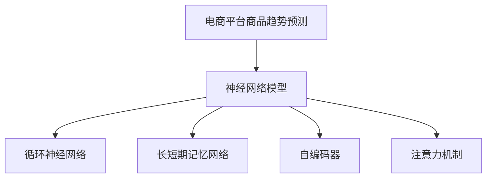

                 

## 1. 背景介绍

### 1.1 问题由来

在当前竞争激烈的电商市场中，商品趋势预测变得尤为重要。通过精准预测商品趋势，电商平台能够有效指导库存管理、营销策划、供应链优化等关键环节，提升运营效率，增加销售额。传统的商品趋势预测方法依赖于统计模型和经验公式，难以适应快速变化的电商市场。

近年来，人工智能技术，尤其是深度学习在电商领域得到了广泛应用。基于深度学习的方法，特别是利用神经网络模型进行预测，已经在电商商品趋势预测中取得了显著成效。这些方法通过分析历史销售数据，利用神经网络模型捕捉数据中的复杂非线性关系，提升预测精度。

### 1.2 问题核心关键点

商品趋势预测的核心在于利用历史数据，借助机器学习模型构建预测模型。关键的流程包括：

1. **数据预处理**：清洗、归一化、特征工程等。
2. **模型构建**：选择合适的模型框架和算法。
3. **模型训练**：利用历史数据训练模型。
4. **模型评估**：在验证集上评估模型性能。
5. **模型部署**：将模型部署到实际应用中。

### 1.3 问题研究意义

商品趋势预测的准确度直接关系到电商平台的运营效率和利润。通过精准预测，电商平台可以：

- **优化库存管理**：预测热门商品需求，合理控制库存，避免过剩或短缺。
- **提升营销效果**：精准预测热门商品，制定高效的市场推广策略。
- **优化供应链**：预测商品趋势，指导供应链优化，提升供应链效率。

商品趋势预测不仅能显著提升电商平台竞争力，还能为消费者提供更好的购物体验，创造更多商业价值。

## 2. 核心概念与联系

### 2.1 核心概念概述

为更好地理解基于深度学习的电商平台商品趋势预测方法，本节将介绍几个密切相关的核心概念：

- **电商平台商品趋势预测**：利用历史销售数据和用户行为数据，通过机器学习模型预测未来商品销售趋势。
- **神经网络模型**：一种通过多层非线性变换进行数据分析和建模的深度学习模型。
- **循环神经网络(RNN)**：一种能够处理序列数据的神经网络，适用于时间序列预测。
- **长短期记忆网络(LSTM)**：RNN的一种变体，能够有效地捕捉长期依赖关系。
- **自编码器(Encoder-Decoder)**：一种能够学习数据压缩和解压缩的神经网络，适用于序列数据生成。
- **注意力机制(Attention Mechanism)**：一种增强神经网络处理序列数据能力的技术。

这些核心概念之间的逻辑关系可以通过以下Mermaid流程图来展示：



这个流程图展示了几大核心概念及其之间的关系：

1. 电商平台商品趋势预测目标基于神经网络模型。
2. 神经网络模型可以采用多种形式，如循环神经网络、长短期记忆网络、自编码器、注意力机制等。
3. 不同的神经网络模型适用于不同的预测任务，通过选择合适的模型，可以提升预测精度。

这些概念共同构成了电商平台商品趋势预测的核心框架，使其能够在各种场景下发挥强大的预测能力。

## 3. 核心算法原理 & 具体操作步骤

### 3.1 算法原理概述

基于深度学习的电商平台商品趋势预测，本质上是利用神经网络模型对历史销售数据进行建模，从而预测未来趋势。其核心思想是：

1. **数据准备**：收集和清洗历史销售数据、用户行为数据等。
2. **特征工程**：选择合适的特征，并进行预处理和编码。
3. **模型构建**：选择合适的神经网络模型，并设计相应的损失函数。
4. **模型训练**：利用历史数据训练模型，调整模型参数。
5. **模型评估**：在验证集上评估模型性能，选择最优模型。
6. **模型部署**：将模型应用到实际预测中。

### 3.2 算法步骤详解

#### 3.2.1 数据准备

1. **数据收集**：从电商平台的数据仓库或API获取历史销售数据、用户行为数据、市场趋势数据等。
2. **数据清洗**：处理缺失值、异常值，进行数据归一化。
3. **数据划分**：将数据划分为训练集、验证集和测试集。

#### 3.2.2 特征工程

1. **特征选择**：选择对预测有用的特征，如销售量、价格、用户行为特征、市场趋势等。
2. **特征编码**：将分类特征（如用户性别、商品类别）转换为数值型特征。
3. **特征工程**：对数值型特征进行归一化、编码等处理。

#### 3.2.3 模型构建

1. **选择模型**：选择合适的神经网络模型，如循环神经网络(LSTM)、长短期记忆网络、自编码器、注意力机制等。
2. **设计损失函数**：根据预测任务设计相应的损失函数，如均方误差、交叉熵等。

#### 3.2.4 模型训练

1. **设置超参数**：设置学习率、批量大小、迭代次数等。
2. **模型训练**：利用训练集数据训练模型，优化模型参数。
3. **评估模型**：在验证集上评估模型性能，选择最优模型。

#### 3.2.5 模型部署

1. **模型保存**：将训练好的模型保存为文件或数据库。
2. **应用预测**：将模型应用到实际预测中，输出预测结果。

### 3.3 算法优缺点

基于深度学习的电商平台商品趋势预测方法具有以下优点：

1. **预测精度高**：神经网络模型能够捕捉数据中的复杂非线性关系，提升预测精度。
2. **自动特征提取**：神经网络模型能够自动从数据中提取有用的特征，减少人工干预。
3. **灵活性高**：不同的神经网络模型适用于不同的预测任务，具有较高的灵活性。

同时，该方法也存在一定的局限性：

1. **数据依赖性强**：模型预测性能依赖于历史数据的丰富性和质量。
2. **模型复杂度高**：神经网络模型参数较多，训练复杂度较高。
3. **过拟合风险**：神经网络模型容易过拟合，需要采取正则化技术。

尽管存在这些局限性，但就目前而言，基于深度学习的商品趋势预测方法仍是大数据时代下电商平台不可或缺的工具。

### 3.4 算法应用领域

基于深度学习的电商平台商品趋势预测方法，已经在电商平台的库存管理、营销策划、供应链优化等多个领域得到了广泛应用：

1. **库存管理**：利用预测结果指导库存优化，避免过剩或短缺。
2. **营销策划**：精准预测热门商品，制定高效的市场推广策略。
3. **供应链优化**：预测商品趋势，指导供应链优化，提升供应链效率。
4. **个性化推荐**：利用预测结果推荐热门商品，提升用户体验。
5. **用户行为分析**：分析用户行为数据，预测未来行为趋势，提升用户满意度。

这些应用场景展示了深度学习在电商平台商品趋势预测中的强大潜力，未来还有更多的应用场景等待挖掘。

## 4. 数学模型和公式 & 详细讲解 & 举例说明

### 4.1 数学模型构建

基于深度学习的电商平台商品趋势预测，核心是利用神经网络模型对历史数据进行建模。假设历史销售数据为 $(x_1, x_2, ..., x_t)$，其中 $x_t$ 表示商品在第 $t$ 个时间点的销售量。利用循环神经网络模型，可以建立如下预测模型：

$$
y_t = f(x_{t-1}, x_{t-2}, ..., x_1; \theta)
$$

其中 $f$ 表示神经网络模型，$\theta$ 为模型参数。模型的目标是最小化预测误差，即：

$$
\min_{\theta} \sum_{t=1}^{T} (y_t - f(x_{t-1}, x_{t-2}, ..., x_1; \theta))^2
$$

### 4.2 公式推导过程

以LSTM模型为例，其预测公式为：

$$
h_t = \tanh(W_{hh} h_{t-1} + W_{hx} x_t + b_h)
$$

$$
i_t = \sigma(W_{hi} h_{t-1} + W_{hi} x_t + b_i)
$$

$$
f_t = \sigma(W_{hf} h_{t-1} + W_{hx} x_t + b_f)
$$

$$
o_t = \sigma(W_{ho} h_{t-1} + W_{hx} x_t + b_o)
$$

$$
c_t = f_t \odot c_{t-1} + i_t \odot \tanh(h_t)
$$

$$
h_t = o_t \odot \tanh(c_t)
$$

其中 $h_t$ 表示LSTM模型在第 $t$ 个时间步的隐状态，$c_t$ 表示LSTM模型在第 $t$ 个时间步的记忆状态，$W$ 和 $b$ 为模型参数。

### 4.3 案例分析与讲解

假设我们有一个电商平台，历史销售数据如表所示：

| 时间 | 商品ID | 销售量 |
| ---- | ------ | ------ |
| 1    | 1      | 10     |
| 2    | 1      | 15     |
| 3    | 1      | 20     |
| 4    | 1      | 25     |
| 5    | 1      | 30     |
| 6    | 2      | 5      |
| 7    | 2      | 7      |
| 8    | 2      | 10     |
| 9    | 2      | 12     |
| 10   | 2      | 15     |
| ...  | ...    | ...    |

我们可以使用LSTM模型进行销售预测。首先，将历史数据按照时间顺序排列，输入到LSTM模型中，训练模型预测未来销售量。训练过程中，模型自动学习历史数据中的复杂关系，捕捉商品的销售趋势。训练完成后，利用训练好的模型预测未来销售量，并根据预测结果指导库存管理、营销策划等。

## 5. 项目实践：代码实例和详细解释说明

### 5.1 开发环境搭建

在进行商品趋势预测实践前，我们需要准备好开发环境。以下是使用Python进行Keras开发的环境配置流程：

1. 安装Anaconda：从官网下载并安装Anaconda，用于创建独立的Python环境。

2. 创建并激活虚拟环境：
```bash
conda create -n pyenv python=3.7 
conda activate pyenv
```

3. 安装Keras：
```bash
conda install keras tensorflow numpy pandas scikit-learn matplotlib
```

4. 安装TensorFlow：
```bash
pip install tensorflow==2.0
```

5. 安装相关库：
```bash
pip install pandas matplotlib sklearn
```

完成上述步骤后，即可在`pyenv`环境中开始商品趋势预测实践。

### 5.2 源代码详细实现

下面以LSTM模型为例，给出使用Keras对电商平台商品进行趋势预测的Python代码实现。

```python
from keras.models import Sequential
from keras.layers import LSTM, Dense, Dropout
from keras.optimizers import Adam
from keras.losses import mean_squared_error
from keras.metrics import mean_squared_error
import pandas as pd
import numpy as np

# 加载数据
train_data = pd.read_csv('train.csv', index_col='时间', parse_dates=True)
test_data = pd.read_csv('test.csv', index_col='时间', parse_dates=True)

# 数据预处理
def create_dataset(dataset, time_steps=1):
    dataX, dataY = [], []
    for i in range(len(dataset) - time_steps):
        a = dataset[i:(i + time_steps), 0]
        dataX.append(a)
        dataY.append(dataset[i + time_steps, 0])
    return np.array(dataX), np.array(dataY)

time_steps = 1
X_train, y_train = create_dataset(train_data, time_steps)
X_test, y_test = create_dataset(test_data, time_steps)

# 数据归一化
from sklearn.preprocessing import MinMaxScaler
scaler = MinMaxScaler(feature_range=(0, 1))
X_train = scaler.fit_transform(X_train)
X_test = scaler.transform(X_test)

# 定义模型
model = Sequential()
model.add(LSTM(50, input_shape=(time_steps, 1)))
model.add(Dense(1))
model.compile(loss='mean_squared_error', optimizer=Adam(lr=0.01))

# 训练模型
model.fit(X_train, y_train, epochs=100, batch_size=32, validation_data=(X_test, y_test))

# 预测
yhat = model.predict(X_test)
```

### 5.3 代码解读与分析

让我们再详细解读一下关键代码的实现细节：

**数据预处理函数**：
- `create_dataset`函数：将历史数据按照时间步长进行处理，生成输入和输出序列。
- `MinMaxScaler`：对数据进行归一化处理，将数据缩放到0到1之间。

**模型定义**：
- `Sequential`模型：使用Keras的序列模型，方便添加多层神经网络。
- `LSTM`层：定义LSTM模型层，用于处理序列数据。
- `Dense`层：定义全连接层，用于输出预测结果。
- `Adam`优化器：定义优化器，设置学习率。
- `mean_squared_error`损失函数：定义损失函数，用于评估模型性能。

**模型训练**：
- `fit`方法：利用训练数据训练模型，设置迭代次数和批次大小。
- `validation_data`参数：设置验证集，用于评估模型性能。

**预测**：
- `predict`方法：利用训练好的模型进行预测，输出预测结果。

可以看到，Keras的深度学习框架使得商品趋势预测的代码实现变得简洁高效。开发者可以将更多精力放在数据处理、模型改进等高层逻辑上，而不必过多关注底层的实现细节。

当然，工业级的系统实现还需考虑更多因素，如模型的保存和部署、超参数的自动搜索、更灵活的任务适配层等。但核心的预测流程基本与此类似。

## 6. 实际应用场景

### 6.1 电商平台库存管理

商品趋势预测在电商平台库存管理中具有重要应用价值。通过精准预测热门商品需求，电商平台可以合理控制库存，避免过剩或短缺，提升库存周转率和资金利用效率。

具体实现时，利用历史销售数据和用户行为数据，训练LSTM等深度学习模型，预测未来商品销售趋势。根据预测结果，制定库存策略，调整采购计划，优化库存结构。这不仅能提升用户体验，还能降低运营成本，增加利润空间。

### 6.2 市场趋势分析

商品趋势预测在市场趋势分析中也具有重要应用价值。通过分析历史销售数据和市场趋势数据，电商平台可以掌握市场动态，洞察市场机会，制定有效的市场策略。

具体实现时，利用历史销售数据和市场趋势数据，训练LSTM等深度学习模型，预测未来销售趋势。根据预测结果，调整市场推广策略，优化商品定价，提升市场竞争力。这不仅能增加销售额，还能提升品牌知名度，增强用户粘性。

### 6.3 个性化推荐

商品趋势预测在个性化推荐中具有重要应用价值。通过预测用户对不同商品的需求趋势，电商平台可以推荐热门商品，提升用户满意度和转化率。

具体实现时，利用用户行为数据和商品销售数据，训练LSTM等深度学习模型，预测用户对不同商品的需求趋势。根据预测结果，推荐热门商品，个性化推荐，提升用户体验和转化率。这不仅能增加销售额，还能提升用户满意度，增强平台黏性。

### 6.4 未来应用展望

随着深度学习技术的发展，基于深度学习的电商平台商品趋势预测方法将不断完善，应用范围将不断扩大。

未来，大语言模型将被广泛应用于电商平台商品趋势预测，利用自然语言处理技术，从更多的数据源获取信息，提升预测准确度。同时，结合时序分析、迁移学习等前沿技术，提升预测模型的泛化能力和迁移能力，适应更多领域的应用需求。

## 7. 工具和资源推荐

### 7.1 学习资源推荐

为了帮助开发者系统掌握基于深度学习的电商平台商品趋势预测的理论基础和实践技巧，这里推荐一些优质的学习资源：

1. 《深度学习》课程：斯坦福大学Andrew Ng教授开设的深度学习入门课程，内容全面，讲解详尽。
2. Kaggle竞赛：Kaggle上各类电商商品预测竞赛，提供丰富的实战案例和数据集。
3. TensorFlow官方文档：TensorFlow的官方文档，提供了丰富的代码示例和教程。
4. 《Python深度学习》书籍：Francois Chollet著，系统讲解深度学习在电商领域的应用。
5. Coursera深度学习课程：Coursera上各类深度学习课程，涵盖基础和应用。

通过对这些资源的学习实践，相信你一定能够快速掌握基于深度学习的电商平台商品趋势预测的精髓，并用于解决实际的电商问题。

### 7.2 开发工具推荐

高效的开发离不开优秀的工具支持。以下是几款用于深度学习模型开发的常用工具：

1. Keras：谷歌开源的深度学习框架，易于上手，适合快速迭代研究。
2. TensorFlow：谷歌主导的深度学习框架，功能强大，适合大规模工程应用。
3. PyTorch：Facebook开源的深度学习框架，灵活高效，适合学术研究和工业应用。
4. Weights & Biases：模型训练的实验跟踪工具，可以记录和可视化模型训练过程中的各项指标，方便对比和调优。
5. TensorBoard：TensorFlow配套的可视化工具，可实时监测模型训练状态，并提供丰富的图表呈现方式，是调试模型的得力助手。

合理利用这些工具，可以显著提升深度学习模型开发的效率，加快创新迭代的步伐。

### 7.3 相关论文推荐

深度学习在电商平台商品趋势预测领域的发展，源于学界的持续研究。以下是几篇奠基性的相关论文，推荐阅读：

1. RNN for Multivariate Time Series Forecasting：提出循环神经网络应用于时间序列预测，提升预测精度。
2. LSTM for Time Series Forecasting：提出长短期记忆网络应用于时间序列预测，提升预测能力。
3. Attention-based Neural Network for Traffic Forecasting：提出注意力机制应用于交通预测，提升模型泛化能力。
4. CNN and LSTM for Sales Forecasting：提出卷积神经网络和循环神经网络结合的方法，提升预测效果。
5. Deep Learning for E-commerce Sales Forecasting：提出深度学习应用于电商销售预测，提升预测准确度。

这些论文代表了大语言模型在电商平台商品趋势预测领域的发展脉络。通过学习这些前沿成果，可以帮助研究者把握学科前进方向，激发更多的创新灵感。

## 8. 总结：未来发展趋势与挑战

### 8.1 总结

本文对基于深度学习的电商平台商品趋势预测方法进行了全面系统的介绍。首先阐述了电商商品趋势预测的研究背景和意义，明确了预测模型在库存管理、市场分析、个性化推荐等关键环节的应用价值。其次，从原理到实践，详细讲解了深度学习模型的数学原理和关键步骤，给出了预测任务开发的完整代码实例。同时，本文还广泛探讨了预测模型在电商平台中的应用前景，展示了深度学习在电商平台商品趋势预测中的强大潜力。未来，伴随深度学习技术的发展和应用，基于深度学习的电商平台商品趋势预测方法将不断完善，进一步提升电商平台的运营效率和市场竞争力。

### 8.2 未来发展趋势

展望未来，基于深度学习的电商平台商品趋势预测方法将呈现以下几个发展趋势：

1. **模型复杂度提升**：随着深度学习技术的不断发展，未来将涌现更多复杂高效的神经网络模型，提升预测精度。
2. **数据多样性增加**：未来将引入更多数据源，如社交媒体数据、气象数据等，提升预测准确度。
3. **实时预测能力增强**：结合流数据处理技术，实现实时预测，提升决策效率。
4. **多模态融合**：结合图像、视频等多模态数据，提升预测模型的综合能力。
5. **可解释性提升**：通过可解释性技术，提升预测模型的透明度和可解释性。

这些趋势展示了深度学习在电商平台商品趋势预测领域的广阔前景。未来的研究将更多关注模型复杂度的提升、数据多样性的增加、实时预测能力的增强、多模态融合和可解释性的提升，进一步拓展预测模型的应用边界，提升预测精度和泛化能力。

### 8.3 面临的挑战

尽管基于深度学习的电商平台商品趋势预测方法已经取得了显著成效，但在迈向更加智能化、普适化应用的过程中，仍面临诸多挑战：

1. **数据质量问题**：电商数据存在噪声、缺失等问题，影响模型训练和预测效果。
2. **模型泛化能力不足**：深度学习模型容易过拟合，泛化能力有待提升。
3. **计算资源消耗大**：深度学习模型计算复杂度较高，对计算资源消耗较大。
4. **实时性问题**：实时预测需要高效的模型和算法支持，目前仍存在一定挑战。
5. **可解释性不足**：深度学习模型往往被视为"黑盒"，预测结果缺乏可解释性。

尽管存在这些挑战，但随着深度学习技术的不断发展，预测模型的性能和效率将不断提升，未来的应用前景值得期待。

### 8.4 研究展望

面对电商商品趋势预测所面临的挑战，未来的研究需要在以下几个方面寻求新的突破：

1. **数据增强技术**：通过数据增强技术，提升数据质量，减少数据噪声和缺失。
2. **模型正则化技术**：引入正则化技术，提升模型的泛化能力和鲁棒性。
3. **实时预测算法**：结合流数据处理技术，实现高效的实时预测算法。
4. **可解释性技术**：通过可解释性技术，提升模型的透明度和可解释性。
5. **跨模态融合技术**：结合图像、视频等多模态数据，提升预测模型的综合能力。

这些研究方向的探索，将进一步提升深度学习在电商平台商品趋势预测中的应用水平，为电商平台的智能化转型提供强大的技术支撑。

## 9. 附录：常见问题与解答

**Q1：电商商品趋势预测是否适用于所有电商平台？**

A: 电商商品趋势预测方法适用于各类电商平台，包括B2B、B2C等。但不同类型电商平台的业务特点不同，预测模型需要根据平台特点进行优化。

**Q2：如何选择合适的深度学习模型？**

A: 根据预测任务的不同，可以选择不同的深度学习模型。对于时间序列预测任务，可以选择RNN、LSTM等模型；对于分类任务，可以选择CNN、DNN等模型。

**Q3：预测模型训练过程中需要注意哪些问题？**

A: 预测模型训练过程中需要注意过拟合、数据噪声、模型泛化能力等问题。可以通过正则化技术、数据增强技术、交叉验证等方法解决这些问题。

**Q4：预测模型的可解释性如何提升？**

A: 提升预测模型的可解释性可以通过多种方法，如使用可解释性技术（如LIME、SHAP）、可视化技术（如t-SNE、LDA）等。这些技术可以帮助理解模型的内部工作机制和决策逻辑。

**Q5：预测模型如何实时应用？**

A: 实现预测模型的实时应用需要高效的模型和算法支持。可以使用流数据处理技术，如Apache Kafka、Apache Flink等，实现实时数据的处理和预测。

**Q6：预测模型的性能如何评估？**

A: 预测模型的性能可以通过多种指标进行评估，如均方误差、均方根误差、准确率等。在训练过程中，可以使用验证集评估模型性能，选择最优模型。在实际应用中，可以使用测试集评估模型泛化能力。

**Q7：预测模型如何应用到实际场景中？**

A: 预测模型应用到实际场景中需要考虑模型裁剪、量化加速、服务化封装、弹性伸缩、监控告警等问题。可以通过模型压缩、量化加速等技术优化模型，提高推理速度和资源利用效率。

这些问题的回答展示了深度学习在电商平台商品趋势预测中的应用前景和挑战，希望能为读者提供有价值的参考。

---

作者：禅与计算机程序设计艺术 / Zen and the Art of Computer Programming

