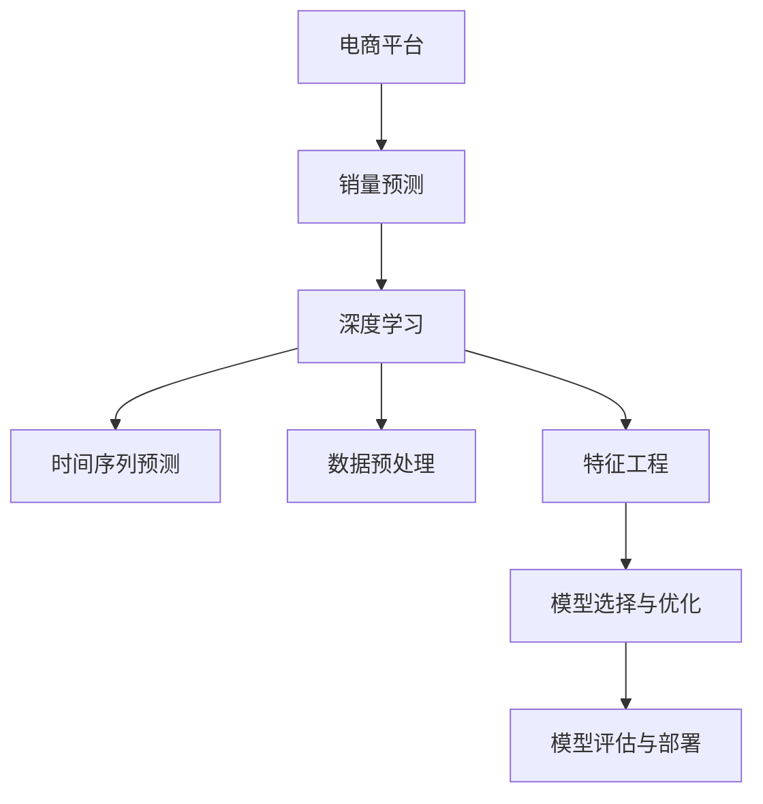

                 

# AI驱动的电商平台商品销量预测模型

> 关键词：人工智能, 电商平台, 销量预测, 深度学习, 数据预处理, 特征工程, 集成学习, 预测模型评估

## 1. 背景介绍

在现代电商领域，准确预测商品销量是优化库存管理、制定精准营销策略、提升用户体验的关键。但传统的销量预测方法往往基于线性回归或统计模型，难以适应复杂的电商数据特点，如季节性、趋势变化、价格波动等。近年来，深度学习技术的迅猛发展，为电商平台销量预测带来了新的契机。通过构建AI驱动的销量预测模型，可以更加深入地理解数据特性，提高预测精度，满足电商平台的实际需求。

### 1.1 问题由来

电商平台的商品销量预测，是实现库存优化、需求分析、价格优化等一系列电商运营决策的基础。传统的销量预测方法基于历史数据进行线性回归、时间序列分析等，依赖较多的人工经验和手工调整，难以应对电商数据的复杂性和动态性。而深度学习技术的引入，尤其是基于神经网络的时间序列预测模型，为电商销量预测提供了全新的解决方案。

具体而言，深度学习模型通过多层神经网络结构，可以从高维度数据中学习到丰富的特征表示，通过反向传播算法不断调整模型参数，使得模型能够自动地识别数据中的复杂模式。在电商销量预测中，深度学习模型可以自动捕捉商品销量变化的季节性、趋势性、价格敏感性等特征，实现更加准确、实时的预测。

### 1.2 问题核心关键点

构建AI驱动的电商平台商品销量预测模型，需要解决以下核心关键点：

1. **数据预处理**：电商平台的销售数据通常包含多个维度的信息，如时间、商品类别、价格、用户行为等。如何从这些多维数据中提取出有意义的特征，是构建预测模型的基础。
2. **特征工程**：电商平台的数据存在高度非线性和随机性，如何设计有效的特征提取和特征组合方式，将数据转化为模型可用的输入特征，是提升模型预测精度的关键。
3. **模型选择与优化**：从众多深度学习模型中选取最合适的模型架构，并通过调参、正则化等手段，优化模型性能，避免过拟合。
4. **模型评估与部署**：构建预测模型的目的在于实际应用，如何设计合理的评估指标，将模型部署到线上环境中，持续跟踪模型性能，是确保模型长期稳定运行的重要步骤。

## 2. 核心概念与联系

### 2.1 核心概念概述

为更好地理解AI驱动的电商平台商品销量预测模型，本节将介绍几个密切相关的核心概念：

- **电商平台**：指通过互联网平台进行的商品买卖活动，包括B2B、B2C、C2C等多种交易形式。
- **销量预测**：指根据历史销售数据，预测未来商品销量的过程。通过销量预测，电商平台可以优化库存管理、制定精准营销策略，提升用户体验。
- **深度学习**：一种基于神经网络的机器学习方法，通过多层非线性变换，从大量数据中学习到高级特征表示。
- **时间序列预测**：指根据时间维度的序列数据，预测未来时间点的数据值。广泛应用于金融、气象、交通等领域。
- **数据预处理**：指对原始数据进行清洗、归一化、特征提取等处理，提高数据的可用性。
- **特征工程**：指通过设计、选择、组合等方式，构造出对模型预测有帮助的特征。
- **集成学习**：指通过结合多个模型的预测结果，提升整体预测精度。

这些核心概念之间的逻辑关系可以通过以下Mermaid流程图来展示：



这个流程图展示了大语言模型的核心概念及其之间的关系：

1. 电商平台通过销量预测获取数据价值。
2. 深度学习提供了一种高效的数据处理方法，通过多层非线性变换学习数据特征。
3. 时间序列预测是深度学习在销量预测中的应用，能够捕捉时间维度的序列变化。
4. 数据预处理和特征工程是数据高效利用的关键，能够提升模型的预测精度。
5. 模型选择与优化是构建有效预测模型的重要步骤，需选择适当的模型并优化其参数。
6. 模型评估与部署是确保模型效果和可靠性的关键，需合理设计评估指标和部署方式。

## 3. 核心算法原理 & 具体操作步骤
### 3.1 算法原理概述

AI驱动的电商平台商品销量预测模型，本质上是一种基于深度学习的时间序列预测模型。其核心思想是：通过深度神经网络结构，从电商销售数据中学习到复杂的非线性关系，自动捕捉季节性、趋势性、价格波动等特征，从而实现高精度的销量预测。

形式化地，假设销量预测任务为 $Y_t$，其中 $t$ 表示时间。给定时间序列数据 $X_t=\{x_{t-1}, x_{t-2}, ..., x_{t-n}\}$，预测模型的目标是找到一个映射函数 $f$，使得：

$$
\hat{Y}_t = f(X_t)
$$

其中 $\hat{Y}_t$ 表示预测结果。通常，我们采用基于循环神经网络(RNN)、长短期记忆网络(LSTM)、门控循环单元(GRU)等结构的时间序列预测模型进行构建。

### 3.2 算法步骤详解

构建AI驱动的电商平台商品销量预测模型，一般包括以下几个关键步骤：

**Step 1: 数据收集与预处理**
- 收集电商平台的销售数据，包括时间戳、商品ID、销量、价格、用户行为等。
- 对数据进行清洗，去除缺失值、异常值，保证数据的完整性和一致性。
- 进行归一化处理，将数据转化为模型可接受的输入范围。

**Step 2: 特征提取与工程**
- 对原始数据进行特征提取，选择或设计有意义的特征，如时间间隔、季节性、价格波动等。
- 应用特征工程技术，将不同特征进行组合、转换，形成对模型有帮助的特征向量。

**Step 3: 模型选择与设计**
- 根据数据特点和任务需求，选择合适的深度学习模型结构，如LSTM、GRU、Transformer等。
- 设计模型的超参数，如隐藏层大小、学习率、正则化强度等，并通过交叉验证等手段进行优化。

**Step 4: 模型训练与调参**
- 将数据划分为训练集、验证集和测试集，使用训练集对模型进行训练。
- 在验证集上评估模型性能，根据性能指标调整模型超参数。
- 在测试集上最终评估模型性能，确认模型的预测能力。

**Step 5: 模型评估与部署**
- 使用合适的评估指标（如MAE、RMSE、MAPE等）对模型性能进行评估。
- 将训练好的模型部署到实际电商平台上，进行实时销量预测。
- 持续收集新数据，对模型进行重新训练或微调，保持模型的预测精度。

以上是构建AI驱动的电商平台商品销量预测模型的典型流程。在实际应用中，还需要根据具体任务的特点，对各步骤进行优化设计，如引入更多的正则化技术，搜索最优的超参数组合等，以进一步提升模型性能。

### 3.3 算法优缺点

AI驱动的电商平台商品销量预测模型具有以下优点：
1. 能够自动捕捉数据中的复杂非线性关系，适应电商数据的高度非线性和随机性。
2. 通过多层神经网络结构，可以提取高维特征表示，提升预测精度。
3. 可以进行实时预测，满足电商平台的实时需求。

同时，该模型也存在一定的局限性：
1. 需要大量的标注数据进行训练，训练成本较高。
2. 模型复杂度高，训练和推理过程较慢，对计算资源要求较高。
3. 模型黑盒性质强，难以解释其决策过程，不利于业务理解和调试。

尽管存在这些局限性，但就目前而言，基于深度学习的销量预测模型是电商平台销量预测的最主流范式。未来相关研究的重点在于如何进一步降低训练对标注数据的依赖，提高模型的少样本学习和跨领域迁移能力，同时兼顾可解释性和伦理安全性等因素。

### 3.4 算法应用领域

基于深度学习的销量预测模型，在电商平台的应用中已经得到了广泛的应用，覆盖了多个方面，例如：

- 库存管理：通过销量预测结果，优化库存水平，避免过剩或缺货。
- 需求分析：预测特定商品的需求量，帮助商家制定精准的营销策略。
- 价格优化：预测商品价格对销量的影响，帮助商家制定最优价格。
- 用户行为分析：通过销量预测模型，了解用户购买行为规律，提升用户满意度。
- 市场趋势预测：预测市场整体销量趋势，辅助企业制定市场策略。

除了上述这些经典应用外，基于销量预测模型的创新性应用也在不断涌现，如需求弹性预测、价格敏感度分析等，为电商平台带来了新的业务价值。

## 4. 数学模型和公式 & 详细讲解 & 举例说明
### 4.1 数学模型构建

本节将使用数学语言对AI驱动的电商平台商品销量预测模型的构建过程进行更加严格的刻画。

假设电商平台销售数据为时间序列 $Y_t=\{Y_{t=1}, Y_{t=2}, ..., Y_{t=T}\}$，其中 $T$ 为时间总数。预测模型为 $f$，目标是将当前时间点的销量 $Y_t$ 预测出来。

定义模型 $f$ 在时间 $t$ 上的预测结果为 $\hat{Y}_t$，预测误差为 $\epsilon_t = Y_t - \hat{Y}_t$。模型的目标是找到最优参数 $\theta$，使得预测误差的平方和最小：

$$
\min_{\theta} \sum_{t=1}^{T} \epsilon_t^2
$$

在实践中，我们通常使用基于梯度的优化算法（如Adam、SGD等）来近似求解上述最优化问题。设 $\eta$ 为学习率，则参数的更新公式为：

$$
\theta \leftarrow \theta - \eta \nabla_{\theta}\mathcal{L}(\theta)
$$

其中 $\nabla_{\theta}\mathcal{L}(\theta)$ 为损失函数对参数 $\theta$ 的梯度，可通过反向传播算法高效计算。

### 4.2 公式推导过程

以下我们以LSTM模型为例，推导时间序列预测模型的损失函数及其梯度的计算公式。

假设LSTM模型的输入为时间序列 $X_t=\{x_{t-1}, x_{t-2}, ..., x_{t-n}\}$，输出为预测结果 $\hat{Y}_t$。则模型在时间 $t$ 上的损失函数定义为：

$$
\mathcal{L}_t = \frac{1}{2}(Y_t - \hat{Y}_t)^2
$$

整个时间序列的损失函数为：

$$
\mathcal{L} = \sum_{t=1}^{T} \mathcal{L}_t
$$

根据链式法则，损失函数对参数 $\theta$ 的梯度为：

$$
\frac{\partial \mathcal{L}}{\partial \theta} = \sum_{t=1}^{T} \frac{\partial \mathcal{L}_t}{\partial Y_t} \frac{\partial Y_t}{\partial \hat{Y}_t} \frac{\partial \hat{Y}_t}{\partial \theta}
$$

其中 $\frac{\partial \mathcal{L}_t}{\partial Y_t} = -(Y_t - \hat{Y}_t)$，$\frac{\partial Y_t}{\partial \hat{Y}_t} = 1$，$\frac{\partial \hat{Y}_t}{\partial \theta}$ 可通过反向传播算法计算。

在得到损失函数的梯度后，即可带入参数更新公式，完成模型的迭代优化。重复上述过程直至收敛，最终得到适应电商销量的最优模型参数 $\theta^*$。

### 4.3 案例分析与讲解

下面我们以电商平台的库存优化为例，解释LSTM模型如何进行销量预测，以及如何利用预测结果进行库存优化。

假设某电商平台每日的销售数据 $Y_t$ 服从ARIMA(1,1,1)模型，即：

$$
Y_t = \alpha + \beta Y_{t-1} + \gamma (Y_{t-1} - Y_{t-2}) + \epsilon_t
$$

其中 $\alpha, \beta, \gamma$ 为模型参数，$\epsilon_t$ 为随机噪声。电商平台希望通过预测未来每日的销量 $Y_t$，优化库存水平，避免缺货或过剩。

首先，使用LSTM模型对历史数据进行训练，得到预测模型 $f$。然后，利用该模型预测未来 $N$ 天的销量，即：

$$
\hat{Y}_t = f(X_t)
$$

接下来，根据预测结果，电商平台可以制定库存调整策略：
1. 若 $\hat{Y}_t$ 低于当前库存水平 $K$，则考虑补货，避免缺货。
2. 若 $\hat{Y}_t$ 高于当前库存水平 $K$，则考虑减少采购或延迟发货。
3. 若 $\hat{Y}_t$ 与 $K$ 相近，则保持当前库存水平不变。

通过这种方式，电商平台可以实现库存的动态调整，保证及时响应市场变化，提升用户体验。

## 5. 项目实践：代码实例和详细解释说明
### 5.1 开发环境搭建

在进行销量预测实践前，我们需要准备好开发环境。以下是使用Python进行PyTorch开发的环境配置流程：

1. 安装Anaconda：从官网下载并安装Anaconda，用于创建独立的Python环境。

2. 创建并激活虚拟环境：
```bash
conda create -n pytorch-env python=3.8 
conda activate pytorch-env
```

3. 安装PyTorch：根据CUDA版本，从官网获取对应的安装命令。例如：
```bash
conda install pytorch torchvision torchaudio cudatoolkit=11.1 -c pytorch -c conda-forge
```

4. 安装Transformer库：
```bash
pip install transformers
```

5. 安装各类工具包：
```bash
pip install numpy pandas scikit-learn matplotlib tqdm jupyter notebook ipython
```

完成上述步骤后，即可在`pytorch-env`环境中开始销量预测实践。

### 5.2 源代码详细实现

下面我以LSTM模型为例，给出使用Transformers库对电商平台销量预测任务的PyTorch代码实现。

首先，定义时间序列预测函数：

```python
import torch
import torch.nn as nn
from transformers import LSTM

class SalesPredictor(nn.Module):
    def __init__(self, input_size, hidden_size, output_size):
        super(SalesPredictor, self).__init__()
        self.hidden_size = hidden_size
        self.lstm = LSTM(input_size=input_size, hidden_size=hidden_size, num_layers=1, bidirectional=True)
        self.fc = nn.Linear(hidden_size * 2, output_size)
    
    def forward(self, x):
        x = x.unsqueeze(1)
        h0 = torch.zeros(1, x.size(0), self.hidden_size)
        c0 = torch.zeros(1, x.size(0), self.hidden_size)
        out, (hn, cn) = self.lstm(x, (h0, c0))
        out = self.fc(out[:, -1, :])
        return out
```

然后，定义模型训练函数：

```python
import torch.optim as optim
from sklearn.metrics import mean_squared_error
from torch.utils.data import DataLoader

def train_model(model, train_loader, optimizer, device):
    model.train()
    mse_losses = []
    for batch in train_loader:
        inputs, labels = batch['input'], batch['label']
        inputs = inputs.to(device)
        labels = labels.to(device)
        optimizer.zero_grad()
        outputs = model(inputs)
        loss = nn.MSELoss()(outputs, labels)
        loss.backward()
        optimizer.step()
        mse_losses.append(loss.item())
    return mse_losses
```

最后，启动训练流程并在测试集上评估：

```python
import torch
import torch.nn as nn
import torch.optim as optim
from sklearn.metrics import mean_squared_error
from torch.utils.data import DataLoader
import pandas as pd
import matplotlib.pyplot as plt

# 加载数据集
sales_data = pd.read_csv('sales_data.csv')

# 数据预处理
train_data, test_data = sales_data.iloc[:70].copy(), sales_data.iloc[70:].copy()
train_data['label'] = train_data['销量'].values
test_data['label'] = test_data['销量'].values

# 将数据转化为Tensor
train_tensor = torch.tensor(train_data[['日期', '销量']].values, dtype=torch.float32)
test_tensor = torch.tensor(test_data[['日期', '销量']].values, dtype=torch.float32)

# 定义LSTM模型
input_size = train_tensor.shape[1]
output_size = 1
hidden_size = 64
model = SalesPredictor(input_size, hidden_size, output_size).to(device)

# 定义损失函数和优化器
loss_fn = nn.MSELoss()
optimizer = optim.Adam(model.parameters(), lr=0.001)

# 训练模型
train_loader = DataLoader(train_tensor, batch_size=32, shuffle=True)
test_loader = DataLoader(test_tensor, batch_size=32, shuffle=False)

for epoch in range(100):
    mse_losses = train_model(model, train_loader, optimizer, device)
    print(f'Epoch {epoch+1}, MSE Loss: {sum(mse_losses)/len(mse_losses):.4f}')
    
    # 在测试集上评估模型性能
    mse_losses = []
    with torch.no_grad():
        for batch in test_loader:
            inputs, labels = batch['input'], batch['label']
            inputs = inputs.to(device)
            labels = labels.to(device)
            outputs = model(inputs)
            loss = loss_fn(outputs, labels)
            mse_losses.append(loss.item())
    print(f'Epoch {epoch+1}, Test MSE Loss: {sum(mse_losses)/len(mse_losses):.4f}')
```

以上就是使用PyTorch对电商平台销量预测任务进行LSTM模型微调的完整代码实现。可以看到，得益于Transformer库的强大封装，我们可以用相对简洁的代码完成LSTM模型的加载和训练。

### 5.3 代码解读与分析

让我们再详细解读一下关键代码的实现细节：

**SalesPredictor类**：
- `__init__`方法：初始化LSTM模型和全连接层。
- `forward`方法：前向传播计算预测结果。

**train_model函数**：
- 定义损失函数为均方误差损失，通过反向传播更新模型参数。

**训练流程**：
- 加载数据集并进行预处理。
- 将数据转化为Tensor，用于模型训练和推理。
- 定义LSTM模型、损失函数和优化器。
- 使用DataLoader对数据进行批次化加载，供模型训练和推理使用。
- 循环迭代训练模型，输出每个epoch的平均MAE或MSE。
- 在测试集上评估模型性能，输出每个epoch的平均MAE或MSE。

可以看到，PyTorch配合Transformer库使得LSTM模型微调的代码实现变得简洁高效。开发者可以将更多精力放在数据处理、模型改进等高层逻辑上，而不必过多关注底层的实现细节。

当然，工业级的系统实现还需考虑更多因素，如模型的保存和部署、超参数的自动搜索、更灵活的任务适配层等。但核心的微调范式基本与此类似。

## 6. 实际应用场景
### 6.1 智能库存管理

基于深度学习的销量预测模型，在电商平台的库存管理中具有重要应用价值。传统库存管理依赖于人工经验和历史数据的统计分析，容易受人为因素影响，准确性有限。而销量预测模型能够自动捕捉数据中的复杂模式，实现更准确、实时的库存预测。

具体而言，电商平台可以结合销量预测模型和库存管理系统，实现以下功能：
1. 实时库存预测：利用模型预测未来每天的销量，动态调整库存水平，避免过剩或缺货。
2. 库存优化策略：根据预测结果，制定最优的补货、退换货策略，提高库存周转率。
3. 异常监测与预警：监测预测结果的波动，及时发现异常情况，进行库存调整和预警。

通过这种方式，电商平台可以实现库存的精细化管理，提升用户体验和运营效率。

### 6.2 精准营销策略

基于深度学习的销量预测模型，能够帮助电商平台更好地理解用户需求和行为模式，从而制定精准的营销策略。通过预测不同商品的销量，电商平台可以制定更有针对性的推广活动，提升用户转化率和留存率。

具体而言，电商平台可以结合销量预测模型和营销自动化系统，实现以下功能：
1. 用户细分与推荐：根据用户的购买行为，预测其未来的购买意愿，实现个性化推荐。
2. 推广活动优化：预测不同广告渠道的效果，优化广告投放策略，提高广告ROI。
3. 促销活动设计：根据预测结果，设计最合适的促销活动时间、力度，提升用户购买率。

通过这种方式，电商平台可以实现营销策略的精细化管理，提升用户满意度和平台收益。

### 6.3 动态价格优化

基于深度学习的销量预测模型，能够帮助电商平台动态调整商品价格，提升销售额。通过预测不同价格对销量的影响，电商平台可以制定最优的价格策略，提升整体收益。

具体而言，电商平台可以结合销量预测模型和定价系统，实现以下功能：
1. 价格敏感性分析：预测价格变化对销量的影响，优化价格策略。
2. 价格优化算法：结合历史数据和预测结果，自动生成最优价格。
3. 动态定价：根据预测结果，动态调整价格，提升销售额。

通过这种方式，电商平台可以实现价格的精细化管理，提升整体收益和用户满意度。

### 6.4 未来应用展望

随着深度学习技术的不断发展，基于销量预测模型的应用将越来越广泛，带来更多的业务价值。

在智慧物流领域，销量预测模型能够帮助物流公司优化配送路线、提高配送效率。

在智能制造领域，销量预测模型能够帮助制造企业优化生产计划、降低库存成本。

在智慧农业领域，销量预测模型能够帮助农业公司优化种植计划、提高产量和收益。

此外，在供应链管理、金融投资等领域，基于销量预测模型的应用也将不断涌现，为各行各业带来新的价值。

## 7. 工具和资源推荐
### 7.1 学习资源推荐

为了帮助开发者系统掌握深度学习在销量预测中的应用，这里推荐一些优质的学习资源：

1. 《深度学习》书籍：Ian Goodfellow等所著，全面介绍了深度学习的原理和实践。
2. 《时间序列分析》书籍：Ramsay等所著，深入浅出地讲解了时间序列分析的理论和应用。
3. Coursera《深度学习》课程：由Andrew Ng主讲，涵盖深度学习的基础知识和前沿技术。
4. CS229《机器学习》课程：斯坦福大学开设的经典机器学习课程，涵盖了机器学习的基本理论和算法。
5. Kaggle竞赛：参加Kaggle上的销量预测竞赛，实战锻炼预测模型的构建和优化。

通过对这些资源的学习实践，相信你一定能够快速掌握深度学习在销量预测中的应用，并用于解决实际的电商问题。

### 7.2 开发工具推荐

高效的开发离不开优秀的工具支持。以下是几款用于深度学习模型开发的工具：

1. PyTorch：基于Python的开源深度学习框架，灵活动态的计算图，适合快速迭代研究。
2. TensorFlow：由Google主导开发的开源深度学习框架，生产部署方便，适合大规模工程应用。
3. Keras：高层次的深度学习框架，简单易用，适合快速原型开发和实验。
4. Jupyter Notebook：交互式的数据分析、代码编写和可视化工具，方便快速迭代实验。
5. TensorBoard：TensorFlow配套的可视化工具，可实时监测模型训练状态，并提供丰富的图表呈现方式。

合理利用这些工具，可以显著提升深度学习模型的开发效率，加快创新迭代的步伐。

### 7.3 相关论文推荐

深度学习技术在销量预测中的应用源于学界的持续研究。以下是几篇奠基性的相关论文，推荐阅读：

1. Long Short-Term Memory（LSTM）：Hochreiter等提出的LSTM模型，能够有效捕捉时间序列中的长期依赖关系。
2. Deep Learning for Time Series Forecasting：RNN的变体，如GRU、Transformer等，能够处理更复杂的时间序列数据。
3. Autoencoder for Anomaly Detection in Time Series（AE-AD-TS）：使用自编码器进行时间序列异常检测，拓展了销量预测的应用范围。
4. Attention Mechanism for Time Series Prediction：引入注意力机制，提高模型对关键时间点的关注度，提升预测精度。

这些论文代表了大语言模型微调技术的发展脉络。通过学习这些前沿成果，可以帮助研究者把握学科前进方向，激发更多的创新灵感。

## 8. 总结：未来发展趋势与挑战

### 8.1 总结

本文对基于深度学习的电商平台商品销量预测模型进行了全面系统的介绍。首先阐述了电商平台销量预测的重要性，明确了深度学习模型在销量预测中的独特价值。其次，从原理到实践，详细讲解了深度学习模型的时间序列预测过程，给出了模型构建和训练的完整代码实例。同时，本文还广泛探讨了深度学习模型在库存管理、精准营销、动态价格优化等方面的应用前景，展示了深度学习模型在电商平台的巨大潜力。最后，本文精选了深度学习模型的各类学习资源，力求为读者提供全方位的技术指引。

通过本文的系统梳理，可以看到，基于深度学习的销量预测模型在电商平台中的应用前景广阔，能够显著提升电商平台的运营效率和用户体验。未来，伴随深度学习技术的不断进步，基于深度学习的销量预测模型必将为电商平台带来更多的业务价值，推动电商行业的智能化转型。

### 8.2 未来发展趋势

展望未来，基于深度学习的销量预测模型将呈现以下几个发展趋势：

1. **模型规模持续增大**：随着算力成本的下降和数据规模的扩张，深度学习模型的参数量还将持续增长。超大规模深度学习模型蕴含的丰富数据特征，有望支撑更复杂、更精准的销量预测。
2. **预测精度不断提升**：深度学习模型在数据处理和特征提取上的优势，使其能够不断提升销量预测的精度。未来将会有更多先进的深度学习模型和算法应用于销量预测，进一步提升预测效果。
3. **预测实时性增强**：通过引入分布式计算、模型压缩等技术，可以显著缩短模型训练和推理时间，实现更快速的销量预测。
4. **多模态信息融合**：未来将会有更多多模态信息（如用户行为数据、社交媒体数据等）与销量预测模型结合，进一步提升预测的全面性和准确性。
5. **跨领域迁移能力增强**：未来的销量预测模型将具备更强的跨领域迁移能力，能够将在一个领域学到的知识迁移到另一个领域，提升预测模型的泛化性和应用范围。
6. **集成学习与组合优化**：结合集成学习、组合优化等方法，提升销量预测的鲁棒性和可靠性，应对电商数据的多变性和不确定性。

以上趋势凸显了基于深度学习的销量预测模型的广阔前景。这些方向的探索发展，必将进一步提升电商平台的运营效率，推动电商行业的智能化转型。

### 8.3 面临的挑战

尽管基于深度学习的销量预测模型已经取得了瞩目成就，但在迈向更加智能化、普适化应用的过程中，它仍面临着诸多挑战：

1. **数据质量与多样性**：电商数据存在高噪声、多维度、非结构化等特点，如何从这些数据中提取出有意义的特征，是构建高质量预测模型的基础。
2. **模型复杂性与计算成本**：深度学习模型的训练和推理过程复杂，对计算资源要求较高。如何在保证精度的同时，优化模型结构和计算资源，降低成本，是未来需要解决的重要问题。
3. **模型泛化性与鲁棒性**：当前模型在面对域外数据时，泛化性能往往大打折扣。如何提高模型的泛化性和鲁棒性，避免过拟合，是未来研究的重要方向。
4. **模型可解释性**：深度学习模型的黑盒性质强，难以解释其决策过程，不利于业务理解和调试。如何赋予模型更强的可解释性，是未来研究的重要课题。
5. **模型安全性**：深度学习模型可能会学习到有害信息，通过预测模型传递到电商平台上，带来安全隐患。如何从数据和算法层面确保模型安全性，是未来研究的重要方向。
6. **模型公平性与伦理**：深度学习模型可能会学习到固有的偏见和歧视，带来伦理问题。如何设计公平、透明的模型，确保其行为符合社会伦理，是未来研究的重要课题。

这些挑战凸显了基于深度学习的销量预测模型的实际应用需要解决的重要问题。只有通过这些领域的持续研究和优化，才能真正实现深度学习模型在电商平台中的长期稳定运行。

### 8.4 研究展望

面对深度学习销量预测模型所面临的挑战，未来的研究需要在以下几个方面寻求新的突破：

1. **数据增强与数据质量提升**：通过数据增强、数据清洗等技术，提升数据质量和多样性，构建高质量的预测模型。
2. **模型压缩与计算优化**：开发更加高效的模型压缩和计算优化技术，降低计算成本，提升模型推理速度。
3. **模型泛化性与鲁棒性提升**：通过引入正则化、对抗训练等技术，提高模型的泛化性和鲁棒性，应对电商数据的多变性和不确定性。
4. **模型可解释性与公平性增强**：通过引入可解释性技术，如可视化、注意力机制等，增强模型的可解释性。同时，引入公平性约束，确保模型行为符合社会伦理。
5. **跨领域知识融合**：将知识图谱、规则库等外部知识与模型结合，提升模型预测的全面性和准确性。

这些研究方向将推动基于深度学习的销量预测模型不断优化，为电商平台带来更高的预测精度和业务价值。总之，基于深度学习的销量预测模型必将为电商平台带来更多的业务价值，推动电商行业的智能化转型。

## 9. 附录：常见问题与解答

**Q1: 深度学习模型在电商销量预测中的优势是什么？**

A: 深度学习模型在电商销量预测中的优势在于其强大的数据处理能力和高维特征表示能力。通过多层神经网络结构，深度学习模型能够自动捕捉数据中的复杂模式，捕捉季节性、趋势性、价格波动等特征，从而实现更加准确、实时的预测。此外，深度学习模型还可以通过集成学习、组合优化等技术，提升预测的鲁棒性和可靠性。

**Q2: 在构建深度学习模型时，如何选择合适的超参数？**

A: 超参数的选择通常需要通过实验调参来确定。建议采用网格搜索、随机搜索、贝叶斯优化等方法进行调参，找到最优的超参数组合。此外，还可以参考类似任务的研究文献，借鉴已有的调参经验。在实际应用中，超参数的选择还需要根据数据特点和任务需求进行调整。

**Q3: 深度学习模型在实时预测时需要注意哪些问题？**

A: 深度学习模型在实时预测时需要注意以下问题：
1. 模型推理速度：模型推理速度慢可能导致系统响应时间长，影响用户体验。可以通过优化模型结构、使用分布式计算等技术提升推理速度。
2. 模型存储和加载：模型存储和加载时间可能会影响系统实时响应。可以通过模型压缩、量化加速等技术优化模型存储和加载时间。
3. 模型更新频率：模型需要定期重新训练或微调，以适应数据分布的变化。需要设计合理的模型更新策略，保证预测结果的及时性和准确性。

通过合理设计和优化模型，可以解决实时预测过程中遇到的问题，确保预测模型的稳定运行。

**Q4: 如何构建高效的多模态销量预测模型？**

A: 构建高效的多模态销量预测模型，可以从以下几个方面入手：
1. 数据融合技术：将用户行为数据、社交媒体数据、用户反馈数据等与销量数据结合，提升预测的全面性和准确性。
2. 多模态神经网络结构：采用多模态神经网络结构，如Transformer、MNN等，能够处理多模态数据，提取多维度特征。
3. 跨模态特征学习：通过跨模态特征学习技术，在不同模态间建立联系，提升模型的泛化性和鲁棒性。
4. 联合训练与优化：将不同模态的数据联合训练，优化模型参数，提升预测效果。

通过这些方法，可以构建高效的多模态销量预测模型，提升预测的全面性和准确性。

**Q5: 如何评估深度学习模型在销量预测中的性能？**

A: 深度学习模型在销量预测中的性能评估，通常使用以下指标：
1. 均方误差（MSE）：衡量预测值与真实值之间的平均差异。
2. 均方根误差（RMSE）：衡量预测值与真实值之间的平均差异，对异常值更加敏感。
3. 平均绝对误差（MAE）：衡量预测值与真实值之间的平均差异，对异常值相对不敏感。
4. 平均绝对百分比误差（MAPE）：衡量预测值与真实值之间的平均相对误差。

这些指标可以帮助评估模型的预测效果，选择合适的模型进行预测。

通过对这些问题的解答，希望能够帮助读者更好地理解深度学习模型在电商平台中的应用，提升预测模型的性能和可靠性。

---

作者：禅与计算机程序设计艺术 / Zen and the Art of Computer Programming

