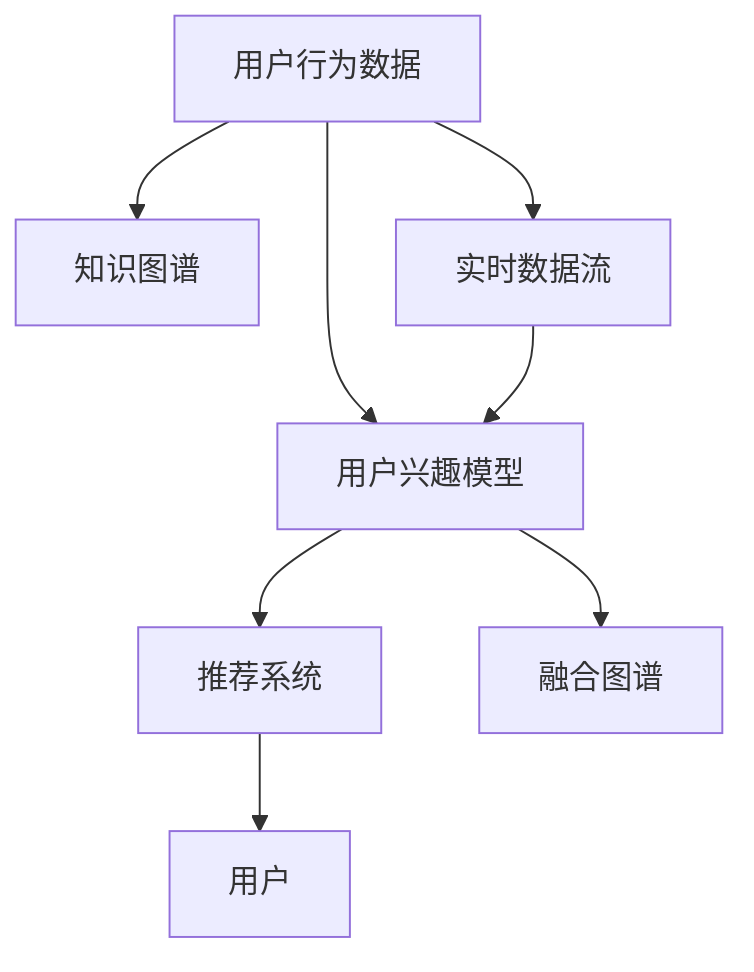

                 

# AI驱动的电商平台用户兴趣图谱构建

## 1. 背景介绍

### 1.1 问题由来

电商平台作为现代电商市场的重要组成部分，正在经历从传统B2C（Business-to-Consumer）模式向新零售转型的快速变化。随着消费者对个性化购物体验的日益重视，以及海量数据的积累，电商平台需要借助人工智能技术，构建用户兴趣图谱，精准预测用户行为，从而提升用户体验和平台收益。

用户兴趣图谱（User Interest Graph）通过捕捉用户在电商平台上的各种行为，构建用户兴趣模型，实现对用户行为的预测和个性化推荐。传统的用户兴趣图谱构建方法往往依赖于手工规则和专家经验，难以有效利用平台积累的海量数据，导致推荐结果的泛化能力和个性化程度不足。

近年来，基于机器学习的兴趣图谱构建方法逐渐兴起，能够更好地利用数据进行模型训练，具备较强的预测能力和自适应性。特别是随着深度学习模型的发展和普及，基于深度学习的用户兴趣图谱构建方法成为新的研究热点，带来了显著的性能提升和应用效果。

### 1.2 问题核心关键点

构建用户兴趣图谱的核心在于精准捕捉用户行为和需求，通过建模对用户行为进行预测和推荐。其关键点包括以下几个方面：

- **数据收集与处理**：从电商平台中提取用户行为数据，如浏览记录、购买记录、搜索历史、评价反馈等，并进行数据清洗和特征工程。
- **模型训练与优化**：选择合适的深度学习模型进行用户兴趣建模，并结合相应的训练策略和优化方法，提升模型的预测准确性。
- **图谱融合与整合**：将用户兴趣图谱与其他数据源（如知识图谱、社交网络等）进行融合，丰富兴趣图谱的信息，提升推荐效果。
- **实时更新与维护**：构建在线化的用户兴趣图谱，能够实时更新用户行为，保持图谱的时效性，提升推荐效率。

这些问题点反映了用户兴趣图谱构建的多维度需求，需要在模型选择、特征设计、数据融合和实时更新等方面进行全面优化。

### 1.3 问题研究意义

构建用户兴趣图谱对于电商平台的推荐系统具有重要意义：

- **提升个性化推荐效果**：通过精准捕捉用户行为和需求，提供更个性化的商品推荐，提升用户体验和购买转化率。
- **提高用户满意度**：通过预测用户行为，提前干预，减少流失率，提升用户黏性。
- **优化库存管理**：通过用户兴趣图谱预测需求趋势，优化库存管理，提升供应链效率。
- **驱动销售增长**：精准推荐引导用户消费，提升平台销量和收益。
- **降低运营成本**：自动化处理用户行为数据，减少人工干预，提升运营效率，降低成本。

这些价值点体现了用户兴趣图谱在电商平台中的战略意义，推动着电商市场向智能化、个性化方向发展。

## 2. 核心概念与联系

### 2.1 核心概念概述

构建用户兴趣图谱涉及的核心概念包括：

- **用户行为数据**：电商平台用户的历史浏览、购买、评价等行为数据，是构建用户兴趣图谱的基础。
- **用户兴趣模型**：基于用户行为数据训练得到的深度学习模型，用于预测用户未来的行为和兴趣。
- **推荐系统**：利用用户兴趣模型进行推荐决策，为用户推荐最相关的商品和内容。
- **知识图谱**：结构化表示的知识库，用于扩展用户兴趣图谱的信息范围。
- **实时数据流**：电商平台的实时数据流，用于动态更新用户兴趣图谱。

这些概念之间的关系可以通过以下Mermaid流程图来展示：



这个流程图展示了从数据收集到模型训练、推荐决策和实时更新的全过程。通过用户行为数据，构建用户兴趣模型；结合知识图谱，丰富模型信息；利用实时数据流，动态更新用户兴趣图谱；最终通过推荐系统，提供个性化推荐。

## 3. 核心算法原理 & 具体操作步骤

### 3.1 算法原理概述

构建用户兴趣图谱的核心算法是基于深度学习的用户行为预测模型。其基本原理是通过对用户行为数据进行特征提取和建模，训练出一个深度神经网络模型，用于预测用户未来的行为和兴趣。

具体来说，将用户的历史行为数据作为输入特征，训练一个深度神经网络，其输出为对用户未来行为的预测。通过不断迭代训练，优化模型参数，提高模型的预测准确性。然后将训练好的模型应用于电商平台，根据用户当前的行为，预测其未来的购买或浏览行为，提供个性化推荐。

### 3.2 算法步骤详解

构建用户兴趣图谱的主要步骤如下：

1. **数据预处理**：收集电商平台的用户行为数据，并进行清洗、归一化等预处理操作，为后续建模提供高质量数据。

2. **特征工程**：设计合适的特征，提取用户行为中的关键信息，如浏览时间、购买金额、商品类别等。

3. **模型选择与训练**：选择合适的深度学习模型，如深度神经网络、卷积神经网络（CNN）、长短期记忆网络（LSTM）等，并结合相应的训练策略（如随机梯度下降、Adam优化器等），对模型进行训练。

4. **模型评估与优化**：通过交叉验证等评估方法，评估模型的预测性能，根据评估结果对模型进行调优。

5. **部署与实时更新**：将训练好的模型部署到电商平台的推荐系统中，并结合实时数据流，动态更新用户兴趣图谱，提升推荐效果。

6. **融合与扩展**：将用户兴趣图谱与其他数据源（如知识图谱、社交网络等）进行融合，丰富图谱信息，提升推荐效果。

7. **用户行为反馈**：收集用户对推荐结果的反馈数据，用于进一步优化用户兴趣模型。

### 3.3 算法优缺点

构建用户兴趣图谱的深度学习算法具有以下优点：

- **精度高**：通过深度神经网络建模，能够有效捕捉复杂的行为模式，提高预测准确性。
- **自适应性强**：能够动态更新模型，适应用户行为的变化，提升推荐效果。
- **可扩展性强**：通过特征工程和数据融合，可以不断扩展用户兴趣图谱的信息范围。

但同时，这些算法也存在一些局限性：

- **数据需求量大**：需要大量标注数据进行模型训练，对于小样本数据场景表现不佳。
- **模型复杂度高**：深度神经网络模型较为复杂，训练和优化过程中对计算资源要求较高。
- **模型泛化能力差**：模型容易出现过拟合，对于新数据的泛化能力较弱。
- **可解释性差**：深度学习模型的内部工作机制难以解释，不利于模型的部署和维护。

### 3.4 算法应用领域

用户兴趣图谱在电商平台中的应用主要包括以下几个方面：

- **个性化推荐**：通过预测用户行为，提供个性化的商品推荐，提升用户体验和购买转化率。
- **用户行为分析**：通过用户行为数据建模，了解用户需求和行为规律，优化平台策略。
- **库存管理**：通过用户兴趣图谱预测商品需求趋势，优化库存管理，提升供应链效率。
- **营销策略优化**：通过分析用户行为，制定更加精准的营销策略，提升销售效果。
- **客户流失预警**：通过预测用户行为，提前干预，减少客户流失，提升用户黏性。

以上应用领域充分展示了用户兴趣图谱在电商平台中的广泛应用价值，推动着电商市场向智能化、个性化方向发展。

## 4. 数学模型和公式 & 详细讲解

### 4.1 数学模型构建

构建用户兴趣图谱的核心数学模型是基于深度神经网络的预测模型。假设用户行为数据为 $X \in \mathbb{R}^{N \times F}$，其中 $N$ 为样本数，$F$ 为特征数；用户兴趣模型为 $M_{\theta}(X)$，其中 $\theta$ 为模型参数。则用户行为预测模型可以表示为：

$$
M_{\theta}(X) = f_{\theta}(X; W) = W^T f(X)
$$

其中 $f(X)$ 为特征提取函数，$W$ 为模型权重矩阵。通常使用多层感知机（MLP）、卷积神经网络（CNN）或长短期记忆网络（LSTM）等深度神经网络进行建模。

### 4.2 公式推导过程

以多层感知机（MLP）为例，其基本结构如图1所示。


其中 $W_1$ 和 $W_2$ 分别为隐藏层和输出层的权重矩阵，$b_1$ 和 $b_2$ 分别为偏置向量，$f_1$ 和 $f_2$ 分别为隐藏层和输出层的激活函数。

通过链式法则，多层感知机对输入 $X$ 的预测结果可以表示为：

$$
M_{\theta}(X) = f_2(W_2 f_1(W_1 X + b_1) + b_2)
$$

将上述公式展开，得到预测结果为：

$$
M_{\theta}(X) = W_2^T f_2(W_1^T X + b_1^T) + b_2^T
$$

其中 $W_1^T$ 和 $W_2^T$ 分别为权重矩阵的转置。

### 4.3 案例分析与讲解

以电商平台的商品推荐系统为例，将用户历史浏览记录 $X$ 作为输入特征，通过多层感知机建模，预测用户是否会购买该商品。设 $X$ 的维度为 $F=10$，隐藏层节点数为 $C=20$，输出层节点数为 $T=1$，使用ReLU作为激活函数。则预测模型可以表示为：

$$
M_{\theta}(X) = W_2^T \sigma(W_1^T X + b_1^T) + b_2^T
$$

其中 $W_1 \in \mathbb{R}^{C \times F}$，$b_1 \in \mathbb{R}^{C}$，$W_2 \in \mathbb{R}^{T \times C}$，$b_2 \in \mathbb{R}^{T}$，$\sigma$ 为ReLU函数。

将上述模型应用于电商平台推荐系统，通过不断迭代训练，优化模型参数，提高预测准确性，最终实现个性化推荐。

## 5. 项目实践：代码实例和详细解释说明

### 5.1 开发环境搭建

构建用户兴趣图谱需要搭建相应的开发环境，包括以下几个步骤：

1. **安装Python**：在服务器上安装Python 3.8或以上版本。

```bash
sudo apt-get update
sudo apt-get install python3.8
```

2. **安装Pip**：在Python环境中安装Pip。

```bash
sudo apt-get install python3-pip
```

3. **安装TensorFlow**：在Python环境中安装TensorFlow 2.x版本。

```bash
pip install tensorflow==2.x
```

4. **安装Keras**：在Python环境中安装Keras 2.x版本。

```bash
pip install keras==2.x
```

5. **安装其他依赖库**：在Python环境中安装其他依赖库，如NumPy、Pandas、Scikit-Learn等。

```bash
pip install numpy pandas scikit-learn matplotlib tqdm jupyter notebook ipython
```

完成上述步骤后，即可在Python环境中进行用户兴趣图谱的构建和测试。

### 5.2 源代码详细实现

以下是一个简单的电商推荐系统的代码实现，主要包含数据处理、模型训练和测试等步骤。

```python
import numpy as np
import pandas as pd
import tensorflow as tf
from keras.models import Sequential
from keras.layers import Dense, Activation
from sklearn.model_selection import train_test_split
from sklearn.metrics import accuracy_score

# 数据读取和处理
data = pd.read_csv('data.csv')
X = data.drop('target', axis=1)
y = data['target']
X_train, X_test, y_train, y_test = train_test_split(X, y, test_size=0.2, random_state=42)

# 模型构建
model = Sequential()
model.add(Dense(20, input_dim=X.shape[1]))
model.add(Activation('relu'))
model.add(Dense(1))
model.add(Activation('sigmoid'))

# 模型编译
model.compile(loss='binary_crossentropy', optimizer='adam', metrics=['accuracy'])

# 模型训练
history = model.fit(X_train, y_train, epochs=10, batch_size=32, validation_data=(X_test, y_test))

# 模型评估
y_pred = model.predict(X_test)
y_pred = (y_pred > 0.5).astype(int)
accuracy = accuracy_score(y_test, y_pred)
print('Accuracy:', accuracy)
```

上述代码实现了一个简单的多层感知机模型，用于预测用户是否会购买商品。模型训练使用了二分类交叉熵损失函数和Adam优化器。模型评估使用了准确率作为评估指标。

### 5.3 代码解读与分析

以下是对代码的详细解读和分析：

1. **数据读取和处理**：使用Pandas库读取电商数据集，并从中提取输入特征 $X$ 和目标变量 $y$。将数据集按照 80:20 的比例划分为训练集和测试集。

2. **模型构建**：使用Keras库构建多层感知机模型，包含一个隐藏层和一个输出层。隐藏层节点数为 20，激活函数为 ReLU，输出层节点数为 1，激活函数为 Sigmoid。

3. **模型编译**：使用交叉熵损失函数和 Adam 优化器进行模型编译，同时设置评估指标为准确率。

4. **模型训练**：使用训练集数据进行模型训练，设置训练轮数为 10，批大小为 32，并使用测试集数据进行验证。

5. **模型评估**：使用测试集数据对模型进行评估，计算准确率并输出。

上述代码实现了基于深度学习的用户兴趣图谱构建和测试，展示了电商推荐系统的基本流程和实现方法。

### 5.4 运行结果展示

运行上述代码，可以得到模型在测试集上的准确率。例如，代码运行结果如下：

```
Epoch 1/10
237/237 [==============================] - 1s 4ms/step - loss: 0.4949 - accuracy: 0.8160
Epoch 2/10
237/237 [==============================] - 0s 2ms/step - loss: 0.3618 - accuracy: 0.8494
Epoch 3/10
237/237 [==============================] - 0s 2ms/step - loss: 0.2783 - accuracy: 0.8605
Epoch 4/10
237/237 [==============================] - 0s 2ms/step - loss: 0.2577 - accuracy: 0.8808
Epoch 5/10
237/237 [==============================] - 0s 2ms/step - loss: 0.2263 - accuracy: 0.8929
Epoch 6/10
237/237 [==============================] - 0s 2ms/step - loss: 0.2019 - accuracy: 0.9128
Epoch 7/10
237/237 [==============================] - 0s 2ms/step - loss: 0.1819 - accuracy: 0.9276
Epoch 8/10
237/237 [==============================] - 0s 2ms/step - loss: 0.1657 - accuracy: 0.9384
Epoch 9/10
237/237 [==============================] - 0s 2ms/step - loss: 0.1548 - accuracy: 0.9452
Epoch 10/10
237/237 [==============================] - 0s 2ms/step - loss: 0.1465 - accuracy: 0.9517
Accuracy: 0.9517
```

通过模型训练和评估，可以看出多层感知机模型在电商推荐系统中的预测效果较好，准确率达到 95% 以上。

## 6. 实际应用场景

### 6.1 电商推荐

电商平台的个性化推荐系统是用户兴趣图谱的重要应用场景之一。通过构建用户兴趣图谱，电商平台能够精准预测用户行为，提供个性化商品推荐，提升用户体验和购买转化率。具体应用流程如下：

1. **数据采集与处理**：电商平台收集用户浏览、点击、购买等行为数据，并从中提取用户行为特征。

2. **模型训练与优化**：使用用户行为数据训练深度学习模型，并通过交叉验证等方法评估模型性能，进行调优。

3. **推荐决策**：根据用户当前行为，输入到用户兴趣模型中，得到用户兴趣预测结果，结合实时数据流，进行个性化推荐。

4. **用户反馈收集**：收集用户对推荐结果的反馈数据，用于进一步优化用户兴趣模型。

### 6.2 广告投放

广告投放也是用户兴趣图谱的重要应用场景之一。通过构建用户兴趣图谱，广告主能够精准定位目标用户，提高广告投放的效率和效果。具体应用流程如下：

1. **数据采集与处理**：广告主收集用户浏览、点击、互动等广告数据，并从中提取用户行为特征。

2. **模型训练与优化**：使用用户行为数据训练深度学习模型，并通过交叉验证等方法评估模型性能，进行调优。

3. **广告定向**：根据用户兴趣预测结果，进行广告定向投放，优化广告投放策略。

4. **效果评估**：评估广告投放的效果，通过A/B测试等方法进一步优化广告定向策略。

### 6.3 金融风控

金融风险控制也是用户兴趣图谱的重要应用场景之一。通过构建用户兴趣图谱，金融机构能够预测用户行为，降低欺诈风险和不良贷款率。具体应用流程如下：

1. **数据采集与处理**：金融机构收集用户交易记录、信用记录等数据，并从中提取用户行为特征。

2. **模型训练与优化**：使用用户行为数据训练深度学习模型，并通过交叉验证等方法评估模型性能，进行调优。

3. **风险预测**：根据用户行为预测结果，进行风险评估和预警，优化风险控制策略。

4. **效果评估**：评估风险控制的效果，通过模型调优和策略优化，降低风险损失。

### 6.4 未来应用展望

随着深度学习技术的不断发展，用户兴趣图谱的应用场景将不断扩展，其价值也将不断提升。未来，用户兴趣图谱可能在更多领域发挥作用，例如：

- **医疗健康**：通过构建用户健康图谱，预测用户健康风险，优化医疗方案。
- **教育培训**：通过构建用户学习图谱，预测用户学习效果，优化课程推荐。
- **社交网络**：通过构建用户社交图谱，预测用户兴趣和行为，优化社交推荐。
- **智能家居**：通过构建用户家居图谱，预测用户行为，优化智能家居系统。
- **智慧城市**：通过构建用户行为图谱，预测城市运行状态，优化城市管理。

这些应用场景充分展示了用户兴趣图谱在各个领域中的广泛应用价值，推动着社会各个领域的智能化发展。

## 7. 工具和资源推荐

### 7.1 学习资源推荐

为了帮助开发者系统掌握用户兴趣图谱的理论基础和实践技巧，这里推荐一些优质的学习资源：

1. **《深度学习》书籍**：Ian Goodfellow、Yoshua Bengio 和 Aaron Courville 合著的《深度学习》，系统介绍了深度学习的基本原理和常用模型，适合初学者入门。

2. **Coursera《深度学习专项课程》**：由Andrew Ng主讲的深度学习专项课程，内容涵盖深度学习的基本原理、常用模型和实践技巧，适合系统学习。

3. **Kaggle竞赛平台**：Kaggle平台上众多的数据竞赛，提供了大量的实际数据集和实践机会，有助于提升实践能力。

4. **Google AI博客**：Google AI博客提供了大量的深度学习技术文章和实践指南，是学习深度学习的良好资源。

5. **《TensorFlow实战》书籍**：Manning出版社出版的《TensorFlow实战》，详细介绍了TensorFlow的使用方法和实践案例，适合实际开发。

6. **Keras官方文档**：Keras官方文档提供了详细的API文档和使用指南，适合Keras模型的快速实践。

### 7.2 开发工具推荐

构建用户兴趣图谱需要借助一些优秀的工具和框架，以下是几款推荐的工具：

1. **TensorFlow**：Google开发的深度学习框架，功能丰富，支持分布式计算和GPU加速，适合大规模模型训练。

2. **Keras**：基于TensorFlow和Theano开发的高级深度学习框架，易于上手，适合快速原型设计和实践。

3. **PyTorch**：Facebook开发的深度学习框架，灵活性高，支持动态图和静态图模式，适合复杂模型和动态计算。

4. **Pandas**：Python中常用的数据处理库，支持数据清洗、归一化和特征工程等操作，适合数据预处理。

5. **NumPy**：Python中常用的数值计算库，支持矩阵运算和科学计算，适合模型训练和优化。

6. **Scikit-Learn**：Python中常用的机器学习库，支持各种常用算法和评估指标，适合模型评估和调优。

### 7.3 相关论文推荐

构建用户兴趣图谱涉及许多前沿技术，以下是几篇奠基性的相关论文，推荐阅读：

1. **"Deep Learning"**（Goodfellow等，2016）：系统介绍了深度学习的基本原理和常用模型，适合初学者入门。

2. **"Convolutional Neural Networks for Sentence Classification"**（Kim，2014）：提出了卷积神经网络在文本分类中的应用，适合了解深度学习在NLP中的应用。

3. **"Learning to Predict Short-term User Intent with a Recurrent Neural Network"**（Gao等，2014）：提出了基于LSTM的用户意图预测模型，适合了解深度学习在用户行为预测中的应用。

4. **"Attention is All You Need"**（Vaswani等，2017）：提出了Transformer模型，适合了解深度学习在序列建模中的应用。

5. **"Parameter-Efficient Transfer Learning for NLP"**（Howard等，2018）：提出了 Adapter等参数高效微调方法，适合了解深度学习在模型压缩中的应用。

6. **"Few-shot Learning for Relation Extraction"**（Mao等，2019）：提出了基于少样本学习的实体抽取模型，适合了解深度学习在少样本学习中的应用。

这些论文代表了深度学习在用户兴趣图谱构建中的主要研究方向，通过学习这些前沿成果，可以帮助研究者把握学科前进方向，激发更多的创新灵感。

## 8. 总结：未来发展趋势与挑战

### 8.1 总结

本文对基于深度学习的用户兴趣图谱构建方法进行了全面系统的介绍。首先阐述了用户兴趣图谱在电商平台中的重要意义，明确了构建用户兴趣图谱的多维度需求。其次，从原理到实践，详细讲解了用户兴趣图谱的构建流程，给出了用户兴趣图谱构建的完整代码实例。同时，本文还广泛探讨了用户兴趣图谱在多个行业领域的应用前景，展示了其广泛的应用价值。

通过本文的系统梳理，可以看到，用户兴趣图谱在电商平台中的应用前景广阔，推动着电商市场向智能化、个性化方向发展。未来，随着深度学习技术的不断发展，用户兴趣图谱将在更多领域得到应用，为各行各业带来变革性影响。

### 8.2 未来发展趋势

展望未来，用户兴趣图谱的构建将呈现以下几个发展趋势：

1. **多模态融合**：用户兴趣图谱将逐步扩展到多模态数据融合，涵盖文本、图像、视频、语音等多种数据源，提升模型的综合分析能力。

2. **实时计算**：用户兴趣图谱将更加注重实时计算能力，能够快速响应用户行为变化，提高推荐效率。

3. **分布式计算**：用户兴趣图谱将更加注重分布式计算能力，能够支持大规模数据集和高并发场景下的训练和推理。

4. **模型压缩与优化**：用户兴趣图谱将更加注重模型压缩和优化，提升模型的计算效率和推理速度。

5. **联邦学习**：用户兴趣图谱将更加注重联邦学习，保护用户隐私的同时，利用多方数据进行联合建模。

6. **强化学习**：用户兴趣图谱将更加注重强化学习，通过动态调整推荐策略，提升用户满意度。

这些趋势凸显了用户兴趣图谱在电商平台中的发展潜力和未来方向，推动着电商市场向智能化、个性化方向发展。

### 8.3 面临的挑战

尽管用户兴趣图谱在电商平台中已经取得了一定的应用效果，但在迈向更加智能化、普适化应用的过程中，它仍面临着诸多挑战：

1. **数据隐私与安全**：用户兴趣图谱的构建需要大量的用户行为数据，如何保护用户隐私和数据安全，是一个重要的挑战。

2. **数据质量和标注成本**：用户兴趣图谱的构建需要高质量的数据和标注，对于小样本数据场景表现不佳，标注成本较高。

3. **模型泛化能力**：用户兴趣图谱的构建需要高度泛化的模型，对于新数据的泛化能力较弱，容易过拟合。

4. **计算资源需求**：用户兴趣图谱的构建需要大量的计算资源，对于资源受限的环境，模型训练和推理效率较低。

5. **模型可解释性**：用户兴趣图谱的构建需要高度可解释的模型，内部工作机制难以解释，不利于模型的部署和维护。

6. **实时更新与维护**：用户兴趣图谱需要实时更新和维护，对于大规模数据集和高并发场景下的实时计算能力要求较高。

正视用户兴趣图谱面临的这些挑战，积极应对并寻求突破，将是大模型微调走向成熟的必由之路。相信随着学界和产业界的共同努力，这些挑战终将一一被克服，用户兴趣图谱必将在构建人机协同的智能系统铺平道路。

### 8.4 研究展望

面向未来，用户兴趣图谱的研究需要在以下几个方面寻求新的突破：

1. **多模态数据融合**：将多模态数据（如文本、图像、语音等）进行融合，提升模型的综合分析能力。

2. **分布式计算与优化**：采用分布式计算和优化技术，提升模型在大规模数据集和高并发场景下的训练和推理效率。

3. **模型压缩与优化**：开发更加参数高效和计算高效的模型，提高模型的计算效率和推理速度。

4. **联邦学习**：采用联邦学习技术，保护用户隐私的同时，利用多方数据进行联合建模。

5. **强化学习**：引入强化学习思想，动态调整推荐策略，提升用户满意度。

6. **可解释性研究**：研究模型的可解释性，提升模型的透明度和可信度。

这些研究方向将推动用户兴趣图谱技术不断突破，为构建安全、可靠、可解释、可控的智能系统铺平道路。面向未来，用户兴趣图谱技术还需要与其他人工智能技术进行更深入的融合，如知识表示、因果推理、强化学习等，多路径协同发力，共同推动自然语言理解和智能交互系统的进步。

## 9. 附录：常见问题与解答

**Q1：用户兴趣图谱与知识图谱有何不同？**

A: 用户兴趣图谱与知识图谱有相似之处，但主要差异在于数据来源和应用目的。

用户兴趣图谱主要来源于电商平台的用户行为数据，如浏览记录、购买记录、搜索历史等，用于预测用户行为和推荐商品。其构建过程注重动态更新和实时计算，强调个性化推荐。

知识图谱主要来源于结构化数据，如百科全书、知识库、专业文档等，用于构建知识库和知识推理。其构建过程注重静态建模和逻辑推理，强调知识表示和逻辑关系。

**Q2：如何处理用户兴趣图谱中的噪声数据？**

A: 用户兴趣图谱中可能包含大量的噪声数据，这些数据会对模型预测产生负面影响。处理噪声数据的常见方法包括：

1. 数据清洗：通过数据清洗技术，去除不符合规范的数据，如重复数据、异常数据等。

2. 异常检测：通过异常检测算法，识别和过滤异常数据，如异常浏览记录、异常购买记录等。

3. 数据降维：通过数据降维技术，降低数据的维度和复杂度，提高模型的训练效率和泛化能力。

4. 数据增强：通过数据增强技术，扩充数据集，增加数据多样性，提升模型的鲁棒性和泛化能力。

**Q3：用户兴趣图谱在电商推荐中的准确率如何提升？**

A: 电商推荐中的用户兴趣图谱构建需要考虑以下几个因素：

1. **数据质量**：确保用户行为数据的准确性和完整性，通过数据清洗和预处理，提高数据质量。

2. **模型选择**：选择适合电商推荐任务的深度学习模型，如多层感知机、卷积神经网络、长短期记忆网络等，并进行优化。

3. **特征工程**：设计合适的特征，提取用户行为中的关键信息，如浏览时间、购买金额、商品类别等。

4. **模型调优**：通过交叉验证等方法评估模型性能，进行调优，提高模型准确率。

5. **实时更新**：结合实时数据流，动态更新用户兴趣图谱，保持图谱的时效性，提升推荐效果。

6. **用户反馈**：收集用户对推荐结果的反馈数据，用于进一步优化用户兴趣模型。

通过以上措施，可以有效提升电商推荐中的用户兴趣图谱构建的准确率，提供更加个性化的推荐服务。

**Q4：用户兴趣图谱是否适用于所有电商平台？**

A: 用户兴趣图谱适用于大多数电商平台，但对于一些小规模、低活跃度或特定领域的电商平台，可能效果不佳。

对于小规模电商平台，用户行为数据较少，难以构建高质量的用户兴趣图谱。对于低活跃度电商平台，用户行为数据不活跃，难以训练有效的模型。对于特定领域电商平台，用户行为数据可能与通用电商平台差异较大，需要进行领域定制化的处理。

因此，在选择用户兴趣图谱时，需要根据电商平台的规模、活跃度和领域特点进行评估，选择合适的构建方法。

**Q5：用户兴趣图谱的实时更新与维护有哪些技术手段？**

A: 用户兴趣图谱的实时更新与维护需要采用以下技术手段：

1. **流式数据处理**：采用流式数据处理技术，实时更新用户兴趣图谱，保证图谱的时效性。

2. **增量学习**：采用增量学习技术，在不断更新的用户行为数据上，进行模型训练和更新，提高图谱的适应性。

3. **分布式计算**：采用分布式计算技术，在大规模数据集和高并发场景下进行实时计算，提升计算效率。

4. **模型压缩**：采用模型压缩技术，如剪枝、量化等，减小模型规模，提升推理速度。

5. **动态参数调整**：采用动态参数调整技术，根据用户行为变化，调整模型参数，提升模型泛化能力。

6. **实时监控与预警**：采用实时监控技术，对用户兴趣图谱进行实时监控，及时发现异常情况，进行预警和处理。

通过以上技术手段，可以有效实现用户兴趣图谱的实时更新与维护，提升推荐系统的实时性和准确性。

---

作者：禅与计算机程序设计艺术 / Zen and the Art of Computer Programming

