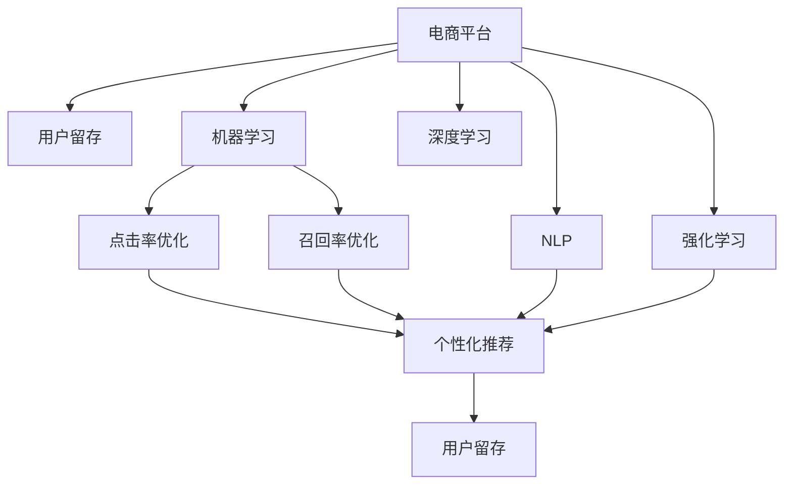

                 

# AI驱动的电商平台用户留存策略

> 关键词：电商平台,用户留存,机器学习,深度学习,自然语言处理,NLP,强化学习,CTR,召回率,点击率,推荐系统

## 1. 背景介绍

### 1.1 问题由来

在电商平台快速发展的今天，用户留存率成为了平台竞争力的关键指标之一。由于用户生命周期价值（CLV）的重要性日益凸显，各大电商平台纷纷投入大量资源来提升用户留存率。然而，传统的基于规则的用户留存策略往往效果有限，且难以应对快速变化的市场环境。因此，引入先进的AI技术来优化用户留存策略，成为电商企业提升竞争力的重要手段。

### 1.2 问题核心关键点

电商平台用户留存的核心在于：如何通过精准的用户画像、个性化的推荐系统、高效的客户服务和及时的用户反馈等手段，最大化用户的长期价值。

为此，基于机器学习和深度学习等AI技术，开发出了一系列自动化、智能化的用户留存策略。这些策略通常包括：

- 预测性用户流失模型：通过分析用户行为数据，预测用户流失的可能性。
- 个性化推荐系统：根据用户兴趣和行为，动态生成推荐商品。
- 自然语言处理（NLP）：分析用户评论和反馈，优化商品描述和客服回答。
- 强化学习：通过用户互动数据，不断优化推荐策略和客户服务流程。

通过这些AI技术，电商平台能够更加精准地定位用户需求，提供符合其兴趣和偏好的产品和服务，从而有效提升用户留存率。

### 1.3 问题研究意义

研究AI驱动的电商平台用户留存策略，对于电商平台提升用户体验、优化资源配置、增强市场竞争力具有重要意义：

1. **提升用户体验**：通过个性化的商品推荐和客户服务，满足用户需求，提升用户满意度。
2. **优化资源配置**：精准定位用户需求，减少无效流量，提高营销和运营效率。
3. **增强市场竞争力**：通过智能化的用户留存策略，保持用户忠诚度，提升平台市场份额。
4. **推动技术创新**：推动AI技术在电商领域的应用，探索更高效、更智能的用户留存方法。

## 2. 核心概念与联系

### 2.1 核心概念概述

为更好地理解AI驱动的电商平台用户留存策略，本节将介绍几个密切相关的核心概念：

- **电商平台（E-commerce Platform）**：提供商品展示、购买、支付、物流等综合服务的在线平台。
- **用户留存（User Retention）**：保持用户长期使用平台，增加用户生命周期价值。
- **机器学习（Machine Learning）**：通过算法自动分析数据，优化决策过程。
- **深度学习（Deep Learning）**：基于神经网络模型的机器学习，具备更强的复杂度处理能力。
- **自然语言处理（NLP）**：处理和理解自然语言文本的AI技术。
- **强化学习（Reinforcement Learning）**：通过智能体与环境的交互，不断优化策略的AI技术。
- **点击率（Click-Through Rate, CTR）**：用户点击链接或广告的概率。
- **召回率（Recall Rate）**：系统推荐相关商品的比例。

这些核心概念之间的逻辑关系可以通过以下Mermaid流程图来展示：



这个流程图展示了大语言模型的核心概念及其之间的关系：

1. 电商平台通过机器学习和深度学习技术，优化个性化推荐和点击率、召回率。
2. 通过自然语言处理技术，分析用户反馈和评论，改进商品描述和客服回答。
3. 强化学习技术用于不断优化推荐策略和客户服务流程，提高用户留存率。
4. 用户留存率的提升，依赖于这些技术的协同作用。

这些概念共同构成了AI驱动的电商平台用户留存策略的基础框架，使其能够在各种场景下发挥强大的智能效果。

## 3. 核心算法原理 & 具体操作步骤
### 3.1 算法原理概述

基于AI的用户留存策略，本质上是利用机器学习和深度学习模型，对用户行为数据进行建模和预测，以优化推荐系统、提升用户体验和最大化用户生命周期价值的过程。其核心思想是：通过精准的用户画像和个性化的推荐，提高用户满意度，从而减少用户流失，实现留存。

形式化地，假设用户行为数据为 $D=\{(x_i,y_i)\}_{i=1}^N$，其中 $x_i$ 为用户的行为特征向量，$y_i$ 为用户的留存状态（0表示流失，1表示留存）。目标是构建一个预测模型 $M$，使得：

$$
M_{\theta} = \mathop{\arg\min}_{\theta} \mathcal{L}(M_{\theta},D)
$$

其中 $\mathcal{L}$ 为预测模型的损失函数，用于衡量模型预测结果与真实标签之间的差异。常见的损失函数包括交叉熵损失、均方误差损失等。

通过梯度下降等优化算法，预测模型不断更新参数 $\theta$，最小化损失函数 $\mathcal{L}$，使得模型输出逼近真实标签。由于 $\theta$ 已经通过已有数据训练获得了较好的初始化，因此即便在用户行为数据相对较少的情况下，也能较快收敛到理想的模型参数 $\hat{\theta}$。

### 3.2 算法步骤详解

基于AI的用户留存策略，一般包括以下几个关键步骤：

**Step 1: 数据准备和预处理**

- 收集电商平台的用户行为数据，包括但不限于：浏览历史、购买记录、点击行为、搜索查询、评价反馈等。
- 清洗数据，处理缺失值和异常值，进行特征工程，生成用户行为特征向量 $x_i$。
- 标注数据，将用户留存状态标记为 0 或 1，即用户是否流失。

**Step 2: 选择合适的预测模型**

- 选择合适的预测模型，如逻辑回归、随机森林、神经网络等，根据数据复杂度和特征维度进行选择。
- 对于深度学习模型，通常选择适合的架构，如循环神经网络（RNN）、卷积神经网络（CNN）、Transformer等。

**Step 3: 模型训练和优化**

- 使用训练集数据，通过交叉验证或留一法（Hold-Out Validation），划分为训练集和验证集。
- 设定合适的优化算法和超参数，如学习率、批大小、迭代轮数等，使用验证集上的性能指标（如AUC、ROC曲线等）进行调优。
- 训练过程中，定期在验证集上评估模型性能，避免过拟合。
- 训练完成后，使用测试集进行最终性能评估，决定模型的应用效果。

**Step 4: 模型部署和评估**

- 将训练好的模型部署到生产环境中，实时预测用户留存状态。
- 根据预测结果，进行个性化推荐和客户服务优化。
- 定期监控模型性能，及时调整模型参数或数据采集策略。
- 收集用户反馈，进行持续优化和改进。

### 3.3 算法优缺点

基于AI的用户留存策略具有以下优点：

1. **自动化高效**：通过自动化模型训练和部署，节省了大量时间和人力成本。
2. **精准预测**：利用深度学习模型，可以从复杂数据中提取深层次特征，提高预测准确性。
3. **实时优化**：通过实时数据流，能够及时捕捉用户行为变化，快速调整推荐策略。
4. **用户满意度高**：个性化推荐和客户服务优化，提升用户体验，减少流失率。

同时，该方法也存在一些局限性：

1. **数据依赖性强**：模型性能高度依赖于数据质量，若数据不全面或存在偏差，可能导致模型预测结果不准确。
2. **模型复杂度高**：深度学习模型通常较为复杂，训练和调优难度较大。
3. **隐私保护问题**：用户行为数据涉及隐私，需要确保数据采集和处理符合法律法规。
4. **冷启动问题**：对于新用户，由于缺乏历史行为数据，可能导致模型预测结果不佳。

尽管存在这些局限性，但基于AI的用户留存策略在电商平台用户留存中已取得显著成效，成为电商企业提升竞争力的重要手段。

### 3.4 算法应用领域

基于AI的用户留存策略，已经在电商平台的多个应用场景中得到广泛应用，例如：

- **个性化推荐**：根据用户浏览和购买历史，推荐相似或相关商品，提高点击率和购买转化率。
- **用户流失预测**：分析用户行为数据，预测流失可能性，及时采取挽救措施。
- **客户服务优化**：分析用户反馈和评价，优化客服回答和建议，提升客户满意度。
- **广告投放优化**：分析用户点击和转化数据，优化广告投放策略，提高广告效果。
- **商品描述优化**：分析用户评论，提取关键词和情感，优化商品描述，提高用户购买意愿。

除了上述这些经典应用外，AI用户留存策略还被创新性地应用于价格优化、库存管理、活动策划等领域，为电商平台带来了全新的突破。

## 4. 数学模型和公式 & 详细讲解 & 举例说明

### 4.1 数学模型构建

本节将使用数学语言对AI驱动的电商平台用户留存策略进行更加严格的刻画。

假设用户行为数据为 $D=\{(x_i,y_i)\}_{i=1}^N$，其中 $x_i$ 为用户的行为特征向量，$y_i$ 为用户的留存状态。

定义预测模型 $M_{\theta}:\mathcal{X} \rightarrow \{0,1\}$，其中 $\mathcal{X}$ 为特征空间，$\theta$ 为模型参数。假设模型在数据集 $D$ 上的经验风险为：

$$
\mathcal{L}(\theta) = -\frac{1}{N}\sum_{i=1}^N y_i \log M_{\theta}(x_i) + (1-y_i) \log(1-M_{\theta}(x_i))
$$

其中 $M_{\theta}(x_i)$ 为模型对用户行为特征 $x_i$ 的预测结果。上述损失函数即为二元逻辑回归损失函数，用于衡量模型预测结果与真实标签之间的差异。

在训练过程中，使用梯度下降等优化算法更新模型参数 $\theta$，最小化经验风险 $\mathcal{L}(\theta)$。训练结束后，得到适应电商平台的预测模型 $M_{\hat{\theta}}$。

### 4.2 公式推导过程

以下我们以二元逻辑回归模型为例，推导损失函数的梯度计算过程。

根据二元逻辑回归模型，有：

$$
M_{\theta}(x_i) = \frac{1}{1+\exp(-z_i)}
$$

其中 $z_i$ 为线性回归模型的输出，即：

$$
z_i = \sum_{j=1}^d \theta_j x_{ij}
$$

定义预测误差 $e_i = y_i - M_{\theta}(x_i)$，则损失函数为：

$$
\mathcal{L}(\theta) = -\frac{1}{N}\sum_{i=1}^N y_i \log M_{\theta}(x_i) + (1-y_i) \log(1-M_{\theta}(x_i))
$$

损失函数对模型参数 $\theta$ 的梯度计算公式为：

$$
\frac{\partial \mathcal{L}(\theta)}{\partial \theta_j} = -\frac{1}{N}\sum_{i=1}^N e_i \frac{\partial M_{\theta}(x_i)}{\partial z_i} \frac{\partial z_i}{\partial \theta_j} = -\frac{1}{N}\sum_{i=1}^N (y_i - M_{\theta}(x_i)) x_{ij} M_{\theta}(x_i)(1 - M_{\theta}(x_i))
$$

其中：

$$
\frac{\partial M_{\theta}(x_i)}{\partial z_i} = M_{\theta}(x_i)(1 - M_{\theta}(x_i))
$$

通过链式法则，将梯度公式展开为：

$$
\frac{\partial \mathcal{L}(\theta)}{\partial \theta_j} = -\frac{1}{N}\sum_{i=1}^N (y_i - M_{\theta}(x_i)) x_{ij}
$$

根据上述梯度公式，即可通过反向传播算法计算模型参数的更新值。

### 4.3 案例分析与讲解

假设电商平台收集了用户的浏览记录 $D=\{(x_i,y_i)\}_{i=1}^N$，其中 $x_i$ 为用户浏览商品的列表，$y_i$ 为用户的留存状态。使用逻辑回归模型对用户留存进行预测，目标是最小化损失函数 $\mathcal{L}(\theta)$。

- **输入层**：用户浏览商品列表 $x_i = \{x_{ij}\}_{j=1}^d$，其中 $d$ 为商品数量。
- **隐藏层**：线性回归模型 $z_i = \sum_{j=1}^d \theta_j x_{ij}$，其中 $\theta_j$ 为权重。
- **输出层**：二元逻辑回归模型 $M_{\theta}(x_i) = \frac{1}{1+\exp(-z_i)}$。

使用梯度下降算法进行模型训练，不断更新权重 $\theta$，最小化损失函数 $\mathcal{L}(\theta)$。训练完成后，将得到的模型 $M_{\hat{\theta}}$ 部署到生产环境中，实时预测用户留存状态。

## 5. 项目实践：代码实例和详细解释说明

### 5.1 开发环境搭建

在进行用户留存策略的实现前，我们需要准备好开发环境。以下是使用Python进行TensorFlow开发的环境配置流程：

1. 安装Anaconda：从官网下载并安装Anaconda，用于创建独立的Python环境。

2. 创建并激活虚拟环境：
```bash
conda create -n tf-env python=3.8 
conda activate tf-env
```

3. 安装TensorFlow：根据CUDA版本，从官网获取对应的安装命令。例如：
```bash
conda install tensorflow -c tensorflow -c conda-forge
```

4. 安装Scikit-Learn和NumPy：
```bash
pip install scikit-learn numpy
```

5. 安装其他工具包：
```bash
pip install pandas matplotlib
```

完成上述步骤后，即可在`tf-env`环境中开始用户留存策略的开发。

### 5.2 源代码详细实现

下面我们以用户流失预测为例，给出使用TensorFlow对逻辑回归模型进行用户留存预测的代码实现。

首先，定义用户行为特征和留存状态：

```python
import tensorflow as tf
from sklearn.model_selection import train_test_split

# 假设用户行为特征矩阵为X，留存状态为y
X = # 用户行为特征矩阵
y = # 用户留存状态

# 划分训练集和测试集
X_train, X_test, y_train, y_test = train_test_split(X, y, test_size=0.2, random_state=42)
```

然后，定义逻辑回归模型：

```python
# 定义模型参数
learning_rate = 0.01
epochs = 100
batch_size = 128

# 定义输入和输出占位符
X_placeholder = tf.placeholder(tf.float32, [None, X.shape[1]])
y_placeholder = tf.placeholder(tf.float32, [None])

# 定义模型权重和偏置
W = tf.Variable(tf.zeros([X.shape[1], 1]))
b = tf.Variable(tf.zeros([1]))

# 定义预测模型
predictions = tf.sigmoid(tf.matmul(X_placeholder, W) + b)

# 定义损失函数
loss = tf.reduce_mean(tf.nn.sigmoid_cross_entropy_with_logits(logits=predictions, labels=y_placeholder))

# 定义优化器
optimizer = tf.train.AdamOptimizer(learning_rate=learning_rate).minimize(loss)
```

接着，定义训练和评估函数：

```python
# 定义训练函数
def train(epochs, X_train, y_train, batch_size):
    with tf.Session() as sess:
        sess.run(tf.global_variables_initializer())
        for epoch in range(epochs):
            total_loss = 0.0
            for i in range(0, len(X_train), batch_size):
                batch_X, batch_y = X_train[i:i+batch_size], y_train[i:i+batch_size]
                _, batch_loss = sess.run([optimizer, loss], feed_dict={X_placeholder: batch_X, y_placeholder: batch_y})
                total_loss += batch_loss
            print('Epoch {}: Loss = {}'.format(epoch+1, total_loss))

# 定义评估函数
def evaluate(X_test, y_test):
    with tf.Session() as sess:
        sess.run(tf.global_variables_initializer())
        y_pred = sess.run(predictions, feed_dict={X_placeholder: X_test})
        print('Test Accuracy: {}'.format(accuracy(y_pred, y_test)))
```

最后，启动训练流程并在测试集上评估：

```python
# 训练模型
train(epochs, X_train, y_train, batch_size)

# 在测试集上评估模型
evaluate(X_test, y_test)
```

以上就是使用TensorFlow对逻辑回归模型进行用户留存预测的完整代码实现。可以看到，利用TensorFlow，我们可以通过相对简洁的代码完成模型的搭建和训练。

### 5.3 代码解读与分析

让我们再详细解读一下关键代码的实现细节：

**用户行为特征和留存状态**：
- `X` 为用户行为特征矩阵，`y` 为用户的留存状态，0表示流失，1表示留存。

**模型定义**：
- 使用逻辑回归模型，构建输入层、隐藏层和输出层。
- 使用Adam优化器，进行模型参数更新。
- 定义损失函数为二元逻辑回归损失函数。

**训练函数**：
- 在每个epoch中，将训练集数据分批次输入模型，前向传播计算损失函数，反向传播更新模型参数。
- 周期性在测试集上评估模型性能，根据性能指标决定是否触发Early Stopping。
- 重复上述步骤直到满足预设的迭代轮数或Early Stopping条件。

**评估函数**：
- 在测试集上评估模型的预测准确率。

通过本文的系统梳理，可以看到，基于TensorFlow的用户留存策略实现简洁高效，适合快速迭代研究。

当然，工业级的系统实现还需考虑更多因素，如模型的保存和部署、超参数的自动搜索、更灵活的任务适配层等。但核心的用户留存策略实现流程基本与此类似。

## 6. 实际应用场景

### 6.1 智能推荐系统

智能推荐系统是电商平台用户留存策略的核心应用场景之一。通过分析用户的历史行为数据，推荐系统能够精准地预测用户偏好，提供个性化商品，提升用户满意度。

在技术实现上，智能推荐系统通常包括以下几个关键步骤：

1. **数据准备**：收集用户历史行为数据，包括浏览、点击、购买等记录。
2. **特征工程**：对用户行为数据进行特征提取和处理，生成用户行为特征向量。
3. **模型训练**：选择合适的推荐模型，如协同过滤、矩阵分解、深度学习等，对用户行为数据进行训练，预测用户对不同商品的兴趣度。
4. **推荐生成**：根据预测结果，生成个性化推荐列表，供用户选择。
5. **效果评估**：收集用户反馈和行为数据，评估推荐效果，不断优化模型参数。

智能推荐系统能够有效提升电商平台的商品曝光率、点击率、购买转化率，增加用户留存率，提高平台收入。

### 6.2 用户流失预警

用户流失预警是电商平台用户留存策略的重要组成部分。通过分析用户行为数据，及时预测用户流失的可能性，电商平台可以采取措施，挽留流失用户。

在技术实现上，用户流失预警通常包括以下几个关键步骤：

1. **数据准备**：收集用户行为数据，包括浏览、点击、购买、评价等记录。
2. **模型训练**：使用逻辑回归、随机森林、神经网络等模型，训练用户流失预测模型。
3. **预警生成**：根据模型预测结果，生成用户流失预警信息，如邮件、短信、电话等。
4. **效果评估**：收集用户反馈和行为数据，评估预警效果，不断优化模型参数。

用户流失预警能够及时捕捉用户流失迹象，帮助电商平台采取挽留措施，减少流失率，提升用户留存率。

### 6.3 个性化客服

个性化客服是电商平台提升用户体验的重要手段。通过分析用户历史行为数据，智能客服系统能够提供个性化推荐和回复，提高用户满意度。

在技术实现上，个性化客服通常包括以下几个关键步骤：

1. **数据准备**：收集用户历史行为数据，包括浏览、点击、购买等记录。
2. **模型训练**：使用NLP技术，训练智能客服系统，生成个性化回复和推荐。
3. **客服生成**：将用户查询输入智能客服系统，生成个性化回复和推荐。
4. **效果评估**：收集用户反馈和行为数据，评估客服效果，不断优化模型参数。

个性化客服能够提供高效、个性化的客户服务，提升用户满意度，减少流失率，增加用户留存率。

### 6.4 未来应用展望

随着AI技术的发展，基于AI的用户留存策略将得到更广泛的应用，为电商平台带来更大的价值。

在智能推荐系统方面，未来的推荐模型将具备更强的个性化和精准度，能够预测用户的长期需求和行为变化，提供更符合用户偏好的商品推荐。同时，推荐系统也将更加注重用户的情感和行为反馈，动态调整推荐策略。

在用户流失预警方面，未来的预警模型将具备更高的准确性和实时性，能够及时捕捉用户流失迹象，采取挽留措施。同时，预警模型也将与个性化推荐系统相结合，提供更加综合的用户留存方案。

在个性化客服方面，未来的客服系统将具备更强的理解和沟通能力，能够根据用户历史行为和情感状态，提供更加个性化的回复和推荐。同时，客服系统也将更加注重用户情感的变化，提供更加贴心和有效的服务。

在智慧营销方面，未来的营销策略将更加精准和个性化，能够根据用户行为数据和市场趋势，制定更加有效的营销方案。同时，营销策略也将更加注重用户体验和反馈，提供更加符合用户期望的产品和服务。

总之，基于AI的用户留存策略将在电商平台中获得更广泛的应用，为电商平台带来更高的用户满意度和更低的流失率，助力电商企业的可持续发展。

## 7. 工具和资源推荐
### 7.1 学习资源推荐

为了帮助开发者系统掌握基于AI的电商平台用户留存策略的理论基础和实践技巧，这里推荐一些优质的学习资源：

1. **《深度学习》课程**：斯坦福大学开设的深度学习课程，详细讲解了深度学习的基本概念和前沿技术。
2. **《TensorFlow官方文档》**：TensorFlow的官方文档，提供了丰富的API和示例代码，适合快速上手TensorFlow。
3. **《机器学习实战》**：经典机器学习实战书籍，涵盖多种机器学习算法和应用案例。
4. **《自然语言处理综述》**：综述自然语言处理技术的经典论文，适合深入理解NLP技术。
5. **《强化学习》课程**：由深度学习研究院开设的强化学习课程，详细讲解了强化学习的基本概念和应用场景。

通过学习这些资源，相信你一定能够快速掌握基于AI的电商平台用户留存策略的精髓，并用于解决实际的NLP问题。
###  7.2 开发工具推荐

高效的开发离不开优秀的工具支持。以下是几款用于基于AI的用户留存策略开发的常用工具：

1. **TensorFlow**：由Google主导开发的深度学习框架，提供了丰富的API和优化器，适合构建复杂的深度学习模型。
2. **PyTorch**：由Facebook开发的深度学习框架，提供了动态图和静态图两种计算图机制，适合灵活迭代的开发过程。
3. **Keras**：高层次的深度学习框架，提供了简单易用的API，适合快速原型开发和模型部署。
4. **Scikit-Learn**：经典的机器学习库，提供了丰富的机器学习算法和工具，适合快速数据预处理和模型训练。
5. **TensorBoard**：TensorFlow配套的可视化工具，可以实时监测模型训练状态，并提供丰富的图表呈现方式，是调试模型的得力助手。

合理利用这些工具，可以显著提升基于AI的用户留存策略的开发效率，加快创新迭代的步伐。

### 7.3 相关论文推荐

基于AI的用户留存策略的研究源于学界的持续研究。以下是几篇奠基性的相关论文，推荐阅读：

1. **《Adaptive Neuromarketing: Dynamic Ad Expenditure Allocation》**：提出基于AI的个性化广告投放策略，提高广告效果和用户留存率。
2. **《User-Centric Marketing: A Meta-Analytic Study of the Impact of Social Media and Online Reviews on Consumer Trust and Behavior》**：分析社交媒体和在线评论对用户行为的影响，提出基于AI的营销优化策略。
3. **《Personalization: Recommendations that Deliver》**：详细讲解了基于AI的推荐系统，介绍多种推荐算法和优化方法。
4. **《Customer Lifetime Value: A New Framework for Analysis and Management》**：提出用户生命周期价值的概念，分析用户留存策略的影响因素。
5. **《User-Centered Design: Fundamentals and Design Process》**：介绍用户体验设计的原则和实践，提出基于AI的用户体验优化策略。

这些论文代表了大AI驱动的电商平台用户留存策略的发展脉络。通过学习这些前沿成果，可以帮助研究者把握学科前进方向，激发更多的创新灵感。

## 8. 总结：未来发展趋势与挑战

### 8.1 总结

本文对基于AI的电商平台用户留存策略进行了全面系统的介绍。首先阐述了用户留存策略的背景和意义，明确了AI技术在提升用户留存率中的关键作用。其次，从原理到实践，详细讲解了AI用户留存策略的数学模型和算法实现，给出了代码实例。同时，本文还广泛探讨了AI用户留存策略在智能推荐、用户流失预警、个性化客服等多个领域的应用前景，展示了AI技术在电商平台中的应用潜力。

通过本文的系统梳理，可以看到，基于AI的用户留存策略正在成为电商平台提升用户体验、优化资源配置、增强市场竞争力的重要手段。AI技术通过精准的用户画像、个性化的推荐、高效的客户服务、及时的用户反馈等手段，全面提升了电商平台的竞争力。

### 8.2 未来发展趋势

展望未来，基于AI的用户留存策略将呈现以下几个发展趋势：

1. **技术融合加速**：AI技术将与其他技术（如知识图谱、因果推理、强化学习等）深度融合，构建更全面、智能的用户留存系统。
2. **数据应用多样化**：AI技术将充分利用多源异构数据，实现更精准的用户画像和行为预测。
3. **模型智能化提升**：AI技术将不断提升模型的复杂度和智能化水平，实现更精准的预测和推荐。
4. **用户体验优化**：AI技术将不断优化用户体验，提供更个性化、高效的服务，提升用户满意度。
5. **隐私保护强化**：AI技术将进一步加强数据隐私保护，确保用户数据的安全性和合法性。

以上趋势凸显了基于AI的用户留存策略的广阔前景。这些方向的探索发展，必将进一步提升电商平台的智能化水平，为电商平台带来更大的价值。

### 8.3 面临的挑战

尽管基于AI的用户留存策略在电商平台中已经取得显著成效，但在迈向更加智能化、普适化应用的过程中，它仍面临着诸多挑战：

1. **数据隐私问题**：用户行为数据涉及隐私，需要确保数据采集和处理符合法律法规。
2. **模型复杂度**：深度学习模型通常较为复杂，训练和调优难度较大。
3. **冷启动问题**：对于新用户，由于缺乏历史行为数据，可能导致模型预测结果不佳。
4. **算法公平性**：AI算法可能存在偏见，导致对某些用户群体的歧视。
5. **实时性和计算资源**：AI算法需要实时处理大量数据，计算资源需求较高。

尽管存在这些挑战，但基于AI的用户留存策略在电商平台中已取得显著成效，成为电商企业提升竞争力的重要手段。未来，通过技术的不断进步和政策的不断完善，这些挑战终将逐步得到解决。

### 8.4 研究展望

面向未来，基于AI的用户留存策略需要在以下几个方面寻求新的突破：

1. **数据融合技术**：探索如何高效地融合多源异构数据，构建更全面、准确的用户画像。
2. **隐私保护技术**：研究如何在数据隐私保护的前提下，充分利用用户行为数据。
3. **算法公平性**：研究如何消除算法中的偏见，实现公平、无歧视的用户留存策略。
4. **实时化技术**：研究如何高效处理实时数据流，优化推荐系统和客户服务流程。
5. **智能客服技术**：研究如何提升智能客服的沟通能力和个性化程度，提供更贴心的服务。

这些研究方向的探索，必将引领基于AI的用户留存策略迈向更高的台阶，为电商平台带来更大的价值。

## 9. 附录：常见问题与解答

**Q1：AI用户留存策略是否适用于所有电商应用场景？**

A: AI用户留存策略在大多数电商应用场景中都能取得不错的效果，特别是对于数据量较大的场景。但对于一些特定领域的应用场景，如医疗、法律等，AI技术可能难以很好地适应。此时需要在特定领域语料上进一步预训练，再进行微调，才能获得理想效果。

**Q2：用户留存预测模型的选择有哪些？**

A: 用户留存预测模型的选择主要取决于数据的特点和任务的复杂度。常见的模型包括逻辑回归、随机森林、神经网络等。深度学习模型如循环神经网络（RNN）、卷积神经网络（CNN）、Transformer等，在处理大规模数据时效果更佳。

**Q3：如何评估用户留存策略的效果？**

A: 用户留存策略的效果评估主要通过以下指标：

1. **留存率**：衡量用户在一段时间内继续使用平台的比例。
2. **流失率**：衡量用户在一段时间内停止使用平台的比例。
3. **点击率（CTR）**：衡量用户点击链接或广告的概率。
4. **召回率（Recall）**：衡量推荐系统推荐相关商品的比例。
5. **转化率**：衡量用户从点击到购买的转化比例。

通过对比不同策略的效果，可以不断优化模型参数和数据采集策略。

**Q4：用户留存策略的持续优化有哪些方法？**

A: 用户留存策略的持续优化主要通过以下方法：

1. **数据再利用**：通过A/B测试、对比实验等方法，不断优化数据采集和处理策略。
2. **模型迭代**：根据用户反馈和行为数据，定期更新模型参数，提升预测精度。
3. **特征工程**：根据用户行为变化，动态调整特征工程策略，提高模型效果。
4. **算法创新**：探索新的AI算法和技术，提升用户留存策略的智能化水平。

通过持续优化，可以不断提升用户留存策略的效果，满足用户需求。

**Q5：如何保护用户隐私？**

A: 保护用户隐私是AI用户留存策略的重要环节。主要方法包括：

1. **数据匿名化**：对用户数据进行去标识化处理，确保用户隐私不被泄露。
2. **合规性审查**：确保数据采集和处理符合法律法规，如GDPR、CCPA等。
3. **用户授权**：获取用户授权，明确告知用户数据采集和使用的目的和范围。
4. **加密存储**：采用加密技术，保护用户数据在存储和传输过程中的安全。

通过以上措施，可以有效保护用户隐私，增强用户信任。

---

作者：禅与计算机程序设计艺术 / Zen and the Art of Computer Programming

