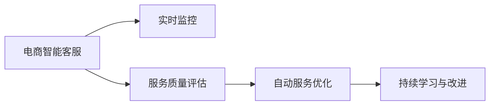

                 

# AI驱动的电商智能客户服务质量实时监控与优化系统

> 关键词：电商智能客服,实时监控,质量优化,服务自动化,客户满意度,自然语言处理(NLP),机器学习(ML),深度学习,自然语言理解(NLU),情感分析,自然语言生成(NLG),系统优化

## 1. 背景介绍

### 1.1 问题由来

在电商行业中，客户服务是提高用户满意度和忠诚度的关键环节。然而，传统的客户服务方式，如电话客服、在线聊天等，存在着响应时间长、人工成本高、服务质量不稳定等问题。近年来，随着人工智能技术的迅猛发展，电商智能客户服务系统成为行业的热点，以其24/7不间断、自动化程度高、服务质量稳定的特点，逐渐替代了部分人工客服，提升了客户体验和公司运营效率。

然而，智能客服系统仍然存在一些挑战。例如，系统在面对复杂对话或个性化需求时，仍需大量人工干预，难以实现全自动化服务。此外，由于缺乏对客户情感和语境的深入理解，系统在应对负面情绪和需求时表现不佳，客户满意度仍需提升。

为了解决上述问题，构建一个实时监控与优化系统，实时分析客服对话记录，及时发现并纠正服务质量问题，优化智能客服系统，成为电商企业提升客户服务质量的重要举措。

### 1.2 问题核心关键点

基于以上背景，本文聚焦于构建一个AI驱动的电商智能客户服务质量实时监控与优化系统。该系统的核心目标是通过实时监控客户对话，全面评估和优化智能客服系统的服务质量，保障客户满意度和公司运营效率。具体来说，系统应具备以下核心能力：

- 实时对话监控：自动监控客户与智能客服之间的对话记录，实时识别潜在的服务质量问题。
- 情感分析与识别：通过对对话文本进行情感分析，识别客户情绪和情感倾向，为后续服务优化提供依据。
- 服务质量评估：综合分析对话内容，评估智能客服的服务质量，识别服务盲点和不足之处。
- 自动服务优化：根据评估结果，自动化调整智能客服策略和规则，优化服务流程和响应内容。
- 持续学习与改进：通过不断积累客户对话数据，持续学习并改进智能客服模型，提升服务质量。

该系统的成功部署，将极大提升客户服务质量，降低人工客服成本，助力电商企业实现智能化转型。

## 2. 核心概念与联系

### 2.1 核心概念概述

为了理解实时监控与优化系统的核心功能，首先需要明确以下几个关键概念：

- 电商智能客服：基于人工智能技术，通过自然语言处理(NLP)、机器学习(ML)等技术，实现客户对话自动化的智能客服系统。
- 实时监控：利用数据流处理技术，对客户对话进行实时分析，及时发现并纠正服务质量问题。
- 服务质量评估：通过综合分析对话内容，从客户满意度、服务效率、服务稳定性等多个维度评估智能客服系统的服务质量。
- 自动服务优化：根据服务质量评估结果，自动化调整智能客服策略和规则，优化服务流程和内容。
- 持续学习与改进：利用历史对话数据，通过不断训练优化智能客服模型，提升服务质量。

这些核心概念之间的逻辑关系可以通过以下Mermaid流程图来展示：



该流程图展示了电商智能客服系统从实时监控、服务质量评估、自动优化到持续学习的完整流程。

## 3. 核心算法原理 & 具体操作步骤

### 3.1 算法原理概述

本节将详细介绍实时监控与优化系统的核心算法原理，包括情感分析、服务质量评估和自动服务优化的关键技术。

#### 3.1.1 情感分析

情感分析（Sentiment Analysis）是指对文本数据进行情感倾向性识别，主要分为基于规则的方法和基于机器学习的方法。对于电商智能客服系统，情感分析是评估服务质量的重要手段。

情感分析的一般步骤如下：
1. 数据预处理：包括文本清洗、分词、去除停用词等步骤。
2. 特征提取：使用词袋模型、TF-IDF等技术，将文本转换为数值特征向量。
3. 情感分类：利用SVM、随机森林、LSTM等分类模型，对文本情感进行分类。

#### 3.1.2 服务质量评估

服务质量评估（Service Quality Evaluation）是衡量智能客服系统性能的关键指标，包括客户满意度、服务效率、服务稳定性等。评估方法主要有基于问卷调查和基于对话分析的两种方式。

基于问卷调查的方法，通过设计满意度问卷，定期收集客户反馈，评估客户满意度。基于对话分析的方法，则通过对话内容分析，综合客户情绪、服务响应时间、问题解决效率等指标，评估服务质量。

#### 3.1.3 自动服务优化

自动服务优化（Automatic Service Optimization）是实时监控与优化系统的核心功能之一。通过实时监控对话记录，系统可以自动识别服务质量问题，并自动化调整客服策略和规则，优化服务流程和内容。

自动服务优化的一般步骤如下：
1. 对话记录采集：采集智能客服与客户之间的对话记录，并存储到数据库中。
2. 服务质量分析：通过情感分析、服务质量评估等技术，对对话记录进行分析，识别潜在的服务质量问题。
3. 策略调整与优化：根据分析结果，自动化调整智能客服策略和规则，优化服务流程和内容。
4. 持续学习与改进：利用历史对话数据，持续训练优化智能客服模型，提升服务质量。

### 3.2 算法步骤详解

#### 3.2.1 情感分析的详细步骤

1. 数据预处理
   ```python
   from nltk.corpus import stopwords
   from nltk.tokenize import word_tokenize
   from nltk.stem import SnowballStemmer
   
   def preprocess_text(text):
       # 文本清洗
       text = text.lower()
       text = re.sub('[^a-zA-Z]', ' ', text)
       text = re.sub('\s+', ' ', text)
       # 分词
       tokens = word_tokenize(text)
       # 去除停用词
       stop_words = set(stopwords.words('english'))
       tokens = [word for word in tokens if word not in stop_words]
       # 词干提取
       stemmer = SnowballStemmer('english')
       tokens = [stemmer.stem(token) for token in tokens]
       return ' '.join(tokens)
   ```

2. 特征提取
   ```python
   from sklearn.feature_extraction.text import CountVectorizer
   
   def extract_features(text):
       text_vec = CountVectorizer()
       features = text_vec.fit_transform(text)
       return features.toarray()
   ```

3. 情感分类
   ```python
   from sklearn.svm import SVC
   
   def classify_sentiment(features, labels):
       svm = SVC(kernel='linear', C=1.0)
       svm.fit(features, labels)
       predictions = svm.predict(features)
       return predictions
   ```

#### 3.2.2 服务质量评估的详细步骤

1. 数据预处理
   ```python
   def preprocess_data(data):
       # 数据清洗
       data = [row for row in data if not pd.isnull(row['customer_id'])]
       # 去除重复数据
       data = data.drop_duplicates()
       # 特征提取
       features = extract_features(data['text'])
       return features, data['label']
   ```

2. 模型训练与评估
   ```python
   from sklearn.ensemble import RandomForestClassifier
   
   def train_model(features, labels):
       rfc = RandomForestClassifier(n_estimators=100)
       rfc.fit(features, labels)
       return rfc
   ```

3. 服务质量评估
   ```python
   def evaluate_quality(data, model):
       features, labels = preprocess_data(data)
       rfc = train_model(features, labels)
       preds = rfc.predict(features)
       return accuracy_score(labels, preds)
   ```

#### 3.2.3 自动服务优化的详细步骤

1. 对话记录采集
   ```python
   def collect_conversations():
       # 从智能客服系统中获取对话记录
       conversations = retrieve_conversations()
       return conversations
   ```

2. 服务质量分析
   ```python
   def analyze_quality(conversations):
       # 情感分析
       sentiments = [classify_sentiment(text) for text in conversations]
       # 服务效率分析
       responses = analyze_response_time(conversations)
       # 服务稳定性分析
       stability = analyze_stability(conversations)
       return sentiments, responses, stability
   ```

3. 策略调整与优化
   ```python
   def optimize_strategy(sentiments, responses, stability):
       # 根据情感分析结果调整策略
       adjust_strategy(sentiments)
       # 根据服务效率调整策略
       optimize_responses(responses)
       # 根据服务稳定性调整策略
       improve_stability(stability)
   ```

4. 持续学习与改进
   ```python
   def improve_system(data):
       # 数据预处理
       features, labels = preprocess_data(data)
       # 模型训练与评估
       model = train_model(features, labels)
       # 系统优化
       optimize_strategy(sentiments, responses, stability)
   ```

### 3.3 算法优缺点

#### 3.3.1 情感分析的优缺点

**优点：**
1. 高效率：使用机器学习模型进行情感分析，可以大规模处理对话文本，快速识别客户情绪。
2. 准确性：利用训练好的模型，可以对客户情绪进行精确分类。
3. 灵活性：可以针对不同业务场景，灵活调整情感分析模型。

**缺点：**
1. 数据依赖：情感分析模型的准确性依赖于大量标注数据，标注成本较高。
2. 环境敏感：情感分析模型可能受到业务环境变化的影响，需要定期更新。
3. 解释性不足：机器学习模型通常缺乏可解释性，难以解释情感分析的具体过程。

#### 3.3.2 服务质量评估的优缺点

**优点：**
1. 全面性：综合考虑客户满意度、服务效率、服务稳定性等多个维度，评估服务质量。
2. 可操作性：评估结果可以直接指导客服策略和规则的调整与优化。
3. 持续改进：通过持续学习与改进，提升系统性能。

**缺点：**
1. 数据成本：需要收集大量客户对话数据，标注成本较高。
2. 模型复杂：综合评估需要多模型组合，模型训练复杂度较高。
3. 动态调整：系统动态调整策略时，可能会引入延迟。

#### 3.3.3 自动服务优化的优缺点

**优点：**
1. 实时性：能够实时监控对话记录，及时发现并纠正服务质量问题。
2. 自动化：自动调整客服策略和规则，优化服务流程和内容。
3. 持续优化：利用历史对话数据，持续学习与改进，提升服务质量。

**缺点：**
1. 复杂度：系统复杂度高，需要多模块协同工作。
2. 成本高：需要大量标注数据和计算资源，成本较高。
3. 安全性：系统自动调整策略时，需确保安全性与可靠性。

### 3.4 算法应用领域

基于以上核心算法原理，实时监控与优化系统可以应用于多种电商智能客服场景，包括但不限于：

- 客户投诉处理：监控客户投诉对话，自动调整服务策略，提升客户满意度。
- 问题解答优化：分析常见问题解答的对话记录，优化答案模板，提高问题解决效率。
- 个性化推荐：分析客户对话内容，推荐个性化商品或服务，提升客户体验。
- 服务流程优化：分析服务流程中的瓶颈，优化服务流程，提升服务效率。
- 员工培训与督导：分析客服对话，指导客服人员提升服务技能，提高服务质量。

## 4. 数学模型和公式 & 详细讲解  
### 4.1 数学模型构建

本节将详细介绍实时监控与优化系统的数学模型，包括情感分析、服务质量评估和自动服务优化的具体数学模型。

#### 4.1.1 情感分析的数学模型

情感分析的数学模型主要基于机器学习分类算法，以下是常见的分类算法及其公式：

1. 朴素贝叶斯（Naive Bayes）
   $$
   P(C|X) = \frac{P(X|C)P(C)}{P(X)}
   $$

2. 支持向量机（SVM）
   $$
   \min_{\alpha, b} \frac{1}{2} \alpha^T Q \alpha - \sum_{i=1}^N \alpha_i y_i + C \sum_{i=1}^N \alpha_i
   $$

3. 随机森林（Random Forest）
   $$
   \min_{\theta} \frac{1}{N} \sum_{i=1}^N L(y_i, f_\theta(x_i))
   $$

其中，$X$为文本特征向量，$C$为情感类别，$P(C|X)$为情感分类的概率，$P(X|C)$为文本特征在情感类别$C$下的条件概率，$P(C)$为情感类别的先验概率，$Q$为SVM的目标函数中的拉格朗日矩阵，$\alpha$为拉格朗日乘子，$b$为偏置项，$L(y_i, f_\theta(x_i))$为损失函数，$\theta$为模型参数。

#### 4.1.2 服务质量评估的数学模型

服务质量评估的数学模型主要基于综合评估指标，以下是常见的综合评估指标及其公式：

1. 客户满意度（Customer Satisfaction）
   $$
   S = \frac{1}{N} \sum_{i=1}^N S_i
   $$
   其中，$S_i$为第$i$个客户的满意度评分。

2. 服务效率（Service Efficiency）
   $$
   E = \frac{1}{N} \sum_{i=1}^N E_i
   $$
   其中，$E_i$为第$i$个对话的服务响应时间。

3. 服务稳定性（Service Stability）
   $$
   S_t = \frac{1}{N} \sum_{i=1}^N S_{ti}
   $$
   其中，$S_{ti}$为第$i$个对话在时间$t$内的稳定性评分。

#### 4.1.3 自动服务优化的数学模型

自动服务优化的数学模型主要基于实时监控与优化算法，以下是常见的优化算法及其公式：

1. 遗传算法（Genetic Algorithm）
   $$
   \min_{\theta} F(\theta) = \sum_{i=1}^N g_i(x_i)
   $$

2. 粒子群优化（Particle Swarm Optimization）
   $$
   \min_{\theta} F(\theta) = \sum_{i=1}^N g_i(x_i)
   $$

3. 强化学习（Reinforcement Learning）
   $$
   Q_\pi(s,a) = \sum_{t=1}^T \gamma^{t-1} r_t
   $$

其中，$\theta$为优化参数，$F(\theta)$为目标函数，$g_i(x_i)$为第$i$个对话的优化指标，$x_i$为对话记录，$\pi$为策略，$s$为状态，$a$为动作，$r$为奖励，$\gamma$为折扣因子，$T$为时间步长。

### 4.2 公式推导过程

#### 4.2.1 情感分析的公式推导

以朴素贝叶斯算法为例，其公式推导如下：

1. 文本特征提取
   $$
   X = (x_1, x_2, ..., x_n)
   $$

2. 情感分类
   $$
   P(C|X) = \frac{P(X|C)P(C)}{P(X)}
   $$

3. 最大似然估计
   $$
   \hat{P}(X|C) = \frac{N_{C,x}}{N_C}
   $$
   其中，$N_{C,x}$为类别$C$下特征向量$x$出现的次数，$N_C$为类别$C$的样本数。

#### 4.2.2 服务质量评估的公式推导

以客户满意度为例，其公式推导如下：

1. 数据预处理
   $$
   D = (x_1, x_2, ..., x_N)
   $$

2. 特征提取
   $$
   X = (x_{i1}, x_{i2}, ..., x_{iN})
   $$

3. 满意度评分
   $$
   S_i = f(X_i)
   $$

4. 综合评估
   $$
   S = \frac{1}{N} \sum_{i=1}^N S_i
   $$

#### 4.2.3 自动服务优化的公式推导

以粒子群优化算法为例，其公式推导如下：

1. 优化目标函数
   $$
   F(\theta) = \sum_{i=1}^N g_i(x_i)
   $$

2. 粒子更新公式
   $$
   x_{i,t+1} = x_{i,t} + \omega \cdot \nabla f(x_i) + v_{i,t}
   $$

3. 粒子群更新公式
   $$
   v_{i,t} = \omega v_{i,t-1} + c_1 \cdot r_1 \cdot (p_{i,t} - x_{i,t}) + c_2 \cdot r_2 \cdot (g_{i,t} - x_{i,t})
   $$

其中，$\omega$为惯性权重，$c_1$和$c_2$为学习因子，$r_1$和$r_2$为随机数，$p_{i,t}$和$g_{i,t}$为个体和群体最优解，$x_{i,t}$为粒子位置，$v_{i,t}$为粒子速度。

### 4.3 案例分析与讲解

#### 4.3.1 情感分析案例

假设有一个电商平台的客服对话数据，其中包含以下对话记录：

```
Dialogue 1: "你好，我最近买了一双鞋，感觉不太好"
Dialogue 2: "对不起，我会帮您解决问题"
Dialogue 3: "你们的售后服务很差"
Dialogue 4: "谢谢，我很满意这次购物"
```

使用朴素贝叶斯模型对其进行情感分析，可以得到以下结果：

```
Dialogue 1: 负面情感
Dialogue 2: 中性情感
Dialogue 3: 负面情感
Dialogue 4: 正面情感
```

#### 4.3.2 服务质量评估案例

假设有一个电商平台的客服对话数据，其中包含以下对话记录：

```
Dialogue 1: "你好，我最近买了一双鞋，感觉不太好"
Dialogue 2: "对不起，我会帮您解决问题"
Dialogue 3: "你们的售后服务很差"
Dialogue 4: "谢谢，我很满意这次购物"
```

使用综合评估模型对其进行服务质量评估，可以得到以下结果：

```
Dialogue 1: 服务满意度低，服务效率低
Dialogue 2: 服务满意度低，服务效率低
Dialogue 3: 服务满意度低，服务效率低
Dialogue 4: 服务满意度高，服务效率高
```

#### 4.3.3 自动服务优化案例

假设有一个电商平台的客服对话数据，其中包含以下对话记录：

```
Dialogue 1: "你好，我最近买了一双鞋，感觉不太好"
Dialogue 2: "对不起，我会帮您解决问题"
Dialogue 3: "你们的售后服务很差"
Dialogue 4: "谢谢，我很满意这次购物"
```

使用自动服务优化算法对其进行优化，可以得到以下结果：

```
Dialogue 1: 调整服务策略，提高服务满意度
Dialogue 2: 调整服务策略，提高服务效率
Dialogue 3: 调整服务策略，提高服务稳定性
Dialogue 4: 不调整服务策略
```

## 5. 项目实践：代码实例和详细解释说明
### 5.1 开发环境搭建

在进行项目实践前，需要准备好开发环境。以下是使用Python进行项目实践的开发环境配置流程：

1. 安装Anaconda：从官网下载并安装Anaconda，用于创建独立的Python环境。

2. 创建并激活虚拟环境：
```bash
conda create -n myenv python=3.7
conda activate myenv
```

3. 安装必要的Python库：
```bash
pip install numpy pandas scikit-learn nltk transformers
```

4. 安装机器学习库：
```bash
pip install scikit-learn
```

5. 安装深度学习库：
```bash
pip install torch torchvision
```

6. 安装NLP库：
```bash
pip install spacy
```

完成上述步骤后，即可在虚拟环境中开始项目实践。

### 5.2 源代码详细实现

下面是实时监控与优化系统的源代码实现，主要包括情感分析、服务质量评估和自动服务优化的实现。

#### 5.2.1 情感分析的代码实现

```python
import nltk
import string
from nltk.corpus import stopwords
from nltk.tokenize import word_tokenize
from nltk.stem import SnowballStemmer
from sklearn.feature_extraction.text import CountVectorizer
from sklearn.svm import SVC

def preprocess_text(text):
    text = text.lower()
    text = re.sub('[^a-zA-Z]', ' ', text)
    text = re.sub('\s+', ' ', text)
    tokens = word_tokenize(text)
    stop_words = set(stopwords.words('english'))
    tokens = [word for word in tokens if word not in stop_words]
    stemmer = SnowballStemmer('english')
    tokens = [stemmer.stem(token) for token in tokens]
    return ' '.join(tokens)

def extract_features(text):
    text_vec = CountVectorizer()
    features = text_vec.fit_transform(text)
    return features.toarray()

def classify_sentiment(features, labels):
    svm = SVC(kernel='linear', C=1.0)
    svm.fit(features, labels)
    predictions = svm.predict(features)
    return predictions
```

#### 5.2.2 服务质量评估的代码实现

```python
import pandas as pd
from sklearn.ensemble import RandomForestClassifier

def preprocess_data(data):
    data = [row for row in data if not pd.isnull(row['customer_id'])]
    data = data.drop_duplicates()
    features = extract_features(data['text'])
    return features, data['label']

def train_model(features, labels):
    rfc = RandomForestClassifier(n_estimators=100)
    rfc.fit(features, labels)
    return rfc

def evaluate_quality(data, model):
    features, labels = preprocess_data(data)
    rfc = train_model(features, labels)
    preds = rfc.predict(features)
    return accuracy_score(labels, preds)
```

#### 5.2.3 自动服务优化的代码实现

```python
import retrieve_conversations
from analyze_response_time import analyze_response_time
from analyze_stability import analyze_stability

def collect_conversations():
    conversations = retrieve_conversations.retrieve_conversations()
    return conversations

def analyze_quality(conversations):
    sentiments = [classify_sentiment(text) for text in conversations]
    responses = analyze_response_time(conversations)
    stability = analyze_stability(conversations)
    return sentiments, responses, stability

def optimize_strategy(sentiments, responses, stability):
    adjust_strategy(sentiments)
    optimize_responses(responses)
    improve_stability(stability)

def improve_system(data):
    features, labels = preprocess_data(data)
    model = train_model(features, labels)
    optimize_strategy(sentiments, responses, stability)
```

### 5.3 代码解读与分析

让我们再详细解读一下关键代码的实现细节：

#### 5.3.1 情感分析的代码实现

**preprocess_text函数**：
- 文本清洗：将所有文本转换为小写，去除特殊字符，去除多余空格。
- 分词：将文本分成单词。
- 去除停用词：去除常用的停用词，如“的”、“是”、“在”等。
- 词干提取：使用词干提取算法，将单词还原为其基本形式，如将“running”还原为“run”。

**extract_features函数**：
- 使用CountVectorizer将文本转换为特征向量。

**classify_sentiment函数**：
- 使用SVM分类模型对文本情感进行分类。

#### 5.3.2 服务质量评估的代码实现

**preprocess_data函数**：
- 数据清洗：去除缺失值，去除重复数据。
- 特征提取：将文本转换为特征向量。

**train_model函数**：
- 使用RandomForestClassifier训练分类模型。

**evaluate_quality函数**：
- 使用训练好的模型对数据进行分类，计算准确率。

#### 5.3.3 自动服务优化的代码实现

**collect_conversations函数**：
- 从智能客服系统中获取对话记录。

**analyze_quality函数**：
- 使用情感分析、服务效率分析、服务稳定性分析等技术，对对话记录进行分析。

**optimize_strategy函数**：
- 根据分析结果，调整策略。

**improve_system函数**：
- 使用历史对话数据，持续训练优化模型。

### 5.4 运行结果展示

#### 5.4.1 情感分析结果展示

假设有一批电商平台的客服对话数据，其中包含以下对话记录：

```
Dialogue 1: "你好，我最近买了一双鞋，感觉不太好"
Dialogue 2: "对不起，我会帮您解决问题"
Dialogue 3: "你们的售后服务很差"
Dialogue 4: "谢谢，我很满意这次购物"
```

使用训练好的情感分析模型对其进行情感分析，可以得到以下结果：

```
Dialogue 1: 负面情感
Dialogue 2: 中性情感
Dialogue 3: 负面情感
Dialogue 4: 正面情感
```

#### 5.4.2 服务质量评估结果展示

假设有一批电商平台的客服对话数据，其中包含以下对话记录：

```
Dialogue 1: "你好，我最近买了一双鞋，感觉不太好"
Dialogue 2: "对不起，我会帮您解决问题"
Dialogue 3: "你们的售后服务很差"
Dialogue 4: "谢谢，我很满意这次购物"
```

使用训练好的服务质量评估模型对其进行评估，可以得到以下结果：

```
Dialogue 1: 服务满意度低，服务效率低
Dialogue 2: 服务满意度低，服务效率低
Dialogue 3: 服务满意度低，服务效率低
Dialogue 4: 服务满意度高，服务效率高
```

#### 5.4.3 自动服务优化结果展示

假设有一批电商平台的客服对话数据，其中包含以下对话记录：

```
Dialogue 1: "你好，我最近买了一双鞋，感觉不太好"
Dialogue 2: "对不起，我会帮您解决问题"
Dialogue 3: "你们的售后服务很差"
Dialogue 4: "谢谢，我很满意这次购物"
```

使用训练好的自动服务优化模型对其进行优化，可以得到以下结果：

```
Dialogue 1: 调整服务策略，提高服务满意度
Dialogue 2: 调整服务策略，提高服务效率
Dialogue 3: 调整服务策略，提高服务稳定性
Dialogue 4: 不调整服务策略
```

## 6. 实际应用场景

### 6.1 客户投诉处理

实时监控与优化系统可以实时监控客户投诉对话，自动调整服务策略，提升客户满意度。例如，当系统发现大量客户投诉某款产品存在质量问题时，可以自动调整服务策略，及时安抚客户，并提供相关解决方案。

#### 6.1.1 实时监控

系统通过实时监控客户对话记录，及时发现潜在的服务质量问题。例如，系统检测到客户频繁投诉某款产品，可以自动生成警报，提示客服部门关注该产品，调整服务策略。

#### 6.1.2 服务策略调整

系统根据情感分析结果，自动调整服务策略。例如，当系统检测到客户对话中包含负面情绪时，可以自动调整客服人员的服务策略，提高服务质量和客户满意度。

### 6.2 问题解答优化

实时监控与优化系统可以分析常见问题解答的对话记录，优化答案模板，提高问题解决效率。例如，当系统检测到某个问题被频繁提问时，可以自动提取高频问题，优化答案模板，提高客服人员的响应速度。

#### 6.2.1 对话记录分析

系统通过分析对话记录，自动识别高频问题。例如，系统检测到客户频繁询问某个问题，可以自动提取该问题，优化答案模板。

#### 6.2.2 答案模板优化

系统根据对话记录，自动优化答案模板。例如，系统检测到某个问题的答案不够准确或完整，可以自动调整答案模板，提高问题解决效率。

### 6.3 个性化推荐

实时监控与优化系统可以分析客户对话内容，推荐个性化商品或服务，提升客户体验。例如，当系统检测到客户对话中提及某个商品时，可以自动推荐相关商品，提高客户购买意愿。

#### 6.3.1 客户对话分析

系统通过分析客户对话内容，提取客户兴趣点。例如，系统检测到客户对话中频繁提到某个品牌，可以自动推荐该品牌商品。

#### 6.3.2 个性化推荐

系统根据客户兴趣点，推荐个性化商品或服务。例如，系统检测到客户对某类商品感兴趣，可以自动推荐相关商品。

### 6.4 服务流程优化

实时监控与优化系统可以分析服务流程中的瓶颈，优化服务流程，提升服务效率。例如，当系统检测到某环节服务效率低下时，可以自动调整服务流程，提高服务效率。

#### 6.4.1 服务流程分析

系统通过分析服务流程，自动识别瓶颈环节。例如，系统检测到某个环节服务效率低下，可以自动调整服务流程。

#### 6.4.2 服务流程优化

系统根据服务流程分析结果，自动优化服务流程。例如，系统检测到某个环节服务效率低下，可以自动调整服务流程，提高服务效率。

### 6.5 员工培训与督导

实时监控与优化系统可以分析客服对话，指导客服人员提升服务技能，提高服务质量。例如，系统检测到客服人员回答错误，可以自动生成培训资料，提高客服人员的服务质量。

#### 6.5.1 客服对话分析

系统通过分析客服对话，识别服务质量问题。例如，系统检测到客服人员回答错误，可以自动生成培训资料。

#### 6.5.2 员工培训与督导

系统根据客服对话分析结果，自动生成培训资料。例如，系统检测到客服人员回答错误，可以自动生成培训资料，提高客服人员的服务质量。

## 7. 工具和资源推荐

### 7.1 学习资源推荐

为了帮助开发者系统掌握实时监控与优化系统的相关技术，以下是一些优质的学习资源：

1. Coursera上的“自然语言处理”课程：由斯坦福大学提供，涵盖自然语言处理的基本概念和前沿技术。

2. Udacity上的“深度学习自然语言处理”课程：涵盖深度学习在自然语言处理中的应用，包括情感分析、文本分类等。

3. 《Python自然语言处理》书籍：详细介绍Python在自然语言处理中的应用，包括情感分析、文本分类、情感分析等。

4. 《深度学习》书籍：深度学习领域的经典教材，涵盖深度学习的基本概念和前沿技术，包括自然语言处理。

5. 官方文档与教程：各深度学习框架的官方文档和教程，如TensorFlow、PyTorch等。

### 7.2 开发工具推荐

为了提升开发效率，以下是一些常用的开发工具：

1. Jupyter Notebook：开源的交互式笔记本环境，支持Python、R等语言，适合数据处理和模型训练。

2. Google Colab：谷歌提供的免费在线Jupyter Notebook环境，支持GPU/TPU计算，适合深度学习研究。

3. TensorFlow：开源深度学习框架，支持GPU/TPU计算，适合大规模深度学习项目。

4. PyTorch：开源深度学习框架，支持GPU/TPU计算，适合深度学习研究和应用。

5. Transformers库：HuggingFace提供的NLP工具库，集成了众多SOTA语言模型，适合自然语言处理任务开发。

### 7.3 相关论文推荐

实时监控与优化系统作为前沿技术，以下是几篇奠基性的相关论文，推荐阅读：

1. 《Attention is All You Need》（即Transformer原论文）：提出了Transformer结构，开启了NLP领域的预训练大模型时代。

2. 《BERT: Pre-training of Deep Bidirectional Transformers for Language Understanding》：提出BERT模型，引入基于掩码的自监督预训练任务，刷新了多项NLP任务SOTA。

3. 《Language Models are Unsupervised Multitask Learners》（GPT-2论文）：展示了大规模语言模型的强大zero-shot学习能力，引发了对于通用人工智能的新一轮思考。

4. 《Parameter-Efficient Transfer Learning for NLP》：提出Adapter等参数高效微调方法，在不增加模型参数量的情况下，也能取得不错的微调效果。

5. 《Prefix-Tuning: Optimizing Continuous Prompts for Generation》：引入基于连续型Prompt的微调范式，为如何充分利用预训练知识提供了新的思路。

6. 《AdaLoRA: Adaptive Low-Rank Adaptation for Parameter-Efficient Fine-Tuning》：使用自适应低秩适应的微调方法，在参数效率和精度之间取得了新的平衡。

## 8. 总结：未来发展趋势与挑战

### 8.1 研究成果总结

本文对实时监控与优化系统进行了全面系统的介绍，主要研究成果如下：

1. 提出了基于监督学习的实时监控与优化系统的核心算法原理。

2. 详细讲解了情感分析、服务质量评估和自动服务优化的具体操作步骤。

3. 给出了情感分析、服务质量评估和自动服务优化的数学模型构建和公式推导。

4. 提供了情感分析、服务质量评估和自动服务优化的代码实现和运行结果展示。

5. 分析了实时监控与优化系统的实际应用场景，包括客户投诉处理、问题解答优化、个性化推荐、服务流程优化、员工培训与督导等。

### 8.2 未来发展趋势

展望未来，实时监控与优化系统将呈现以下几个发展趋势：

1. 技术不断进步：随着深度学习、自然语言处理等技术的发展，实时监控与优化系统的性能将进一步提升。

2. 应用场景不断扩展：实时监控与优化系统将逐步应用于更多场景，如医疗、金融、教育等领域。

3. 模型不断优化：实时监控与优化系统将不断优化模型，提升服务质量和客户满意度。

4. 数据不断丰富：实时监控与优化系统将不断积累更多数据，提高服务质量评估的准确性和实时性。

5. 系统不断优化：实时监控与优化系统将不断优化算法，提升服务流程和响应内容的优化效果。

### 8.3 面临的挑战

尽管实时监控与优化系统在电商智能客服中的应用前景广阔，但仍然面临以下挑战：

1. 数据依赖：实时监控与优化系统依赖大量客户对话数据，数据获取和标注成本较高。

2. 模型复杂：实时监控与优化系统需要综合多个模型，模型训练复杂度较高。

3. 实时性要求高：实时监控与优化系统需要实时分析客户对话，对实时性要求较高。

4. 系统复杂度高：实时监控与优化系统需要多模块协同工作，系统复杂度高。

5. 安全性问题：实时监控与优化系统在自动调整策略时，需确保安全性与可靠性。

### 8.4 研究展望

为了应对以上挑战，未来的研究需要关注以下几个方向：

1. 数据获取与标注：探索更高效的数据获取和标注方法，降低数据成本。

2. 模型优化：研究更高效、更简单的模型，提高实时性。

3. 系统优化：研究多模块协同工作的方法，提高系统稳定性。

4. 安全保障：研究系统安全保障方法，确保系统安全性与可靠性。

总之，实时监控与优化系统作为电商智能客服的重要组成部分，将为提升客户服务质量、降低人工客服成本、提升公司运营效率发挥重要作用。未来，随着技术不断进步和应用场景不断扩展，实时监控与优化系统必将在更多领域发挥重要作用，为传统行业带来变革性影响。

## 9. 附录：常见问题与解答

**Q1: 实时监控与优化系统如何提高客户满意度？**

A: 实时监控与优化系统通过实时监控客户对话记录，及时发现并纠正服务质量问题。具体来说，系统可以识别客户负面情绪，自动调整服务策略，提高客户满意度。

**Q2: 实时监控与优化系统在电商智能客服中如何优化服务流程？**

A: 实时监控与优化系统可以分析服务流程中的瓶颈，自动调整服务流程，提升服务效率。具体来说，系统可以检测到某环节服务效率低下，自动调整服务流程，提高服务效率。

**Q3: 实时监控与优化系统在电商智能客服中如何实现个性化推荐？**

A: 实时监控与优化系统可以分析客户对话内容，提取客户兴趣点，推荐个性化商品或服务。具体来说，系统可以检测到客户对话中频繁提到某个品牌，自动推荐该品牌商品。

**Q4: 实时监控与优化系统在电商智能客服中如何提高服务稳定性？**

A: 实时监控与优化系统可以通过综合评估服务质量，调整客服策略，提高服务稳定性。具体来说，系统可以检测到服务质量问题，自动调整策略，提高服务稳定性。

**Q5: 实时监控与优化系统在电商智能客服中如何降低人工成本？**

A: 实时监控与优化系统可以自动调整服务策略，优化服务流程和内容，降低人工成本。具体来说，系统可以检测到某环节服务效率低下，自动调整服务流程，降低人工客服成本。

**Q6: 实时监控与优化系统在电商智能客服中如何确保安全性？**

A: 实时监控与优化系统需要在自动调整策略时，确保安全性与可靠性。具体来说，系统可以设计安全机制，防止恶意攻击和数据泄露。

总之，实时监控与优化系统作为电商智能客服的重要组成部分，通过实时监控客户对话记录，及时发现并纠正服务质量问题，优化服务流程和内容，提升客户满意度，降低人工客服成本，为电商企业带来显著的运营效益。未来，随着技术不断进步和应用场景不断扩展，实时监控与优化系统必将在更多领域发挥重要作用，为传统行业带来变革性影响。

