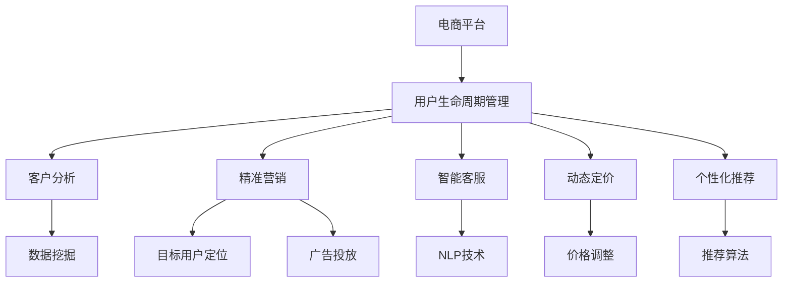

                 

# AI驱动的电商用户生命周期管理

> 关键词：用户生命周期管理,人工智能,电商,客户分析,精准营销,智能客服,动态定价,个性化推荐

## 1. 背景介绍

### 1.1 问题由来
在电商行业，用户生命周期管理（Customer Lifecycle Management, CLM）是提升业务增长的关键环节。传统的CLM依赖于定性分析、手动操作，不仅耗时耗力，还容易错过关键时机，导致客户流失、流失成本增加。

随着大数据和AI技术的发展，电商企业希望借助AI驱动的方式，实现精准的用户生命周期管理，以预测客户行为、优化运营策略、提升用户满意度和转化率。AI驱动的电商用户生命周期管理，依托于先进的算法、数据处理技术以及用户行为数据分析，能够对用户行为进行深入挖掘，实现更为精细化的管理，从而提升企业运营效率和收益。

### 1.2 问题核心关键点
AI驱动的电商用户生命周期管理，旨在通过机器学习和数据分析技术，对用户生命周期的不同阶段进行精准管理和预测。核心目标包括：
- 预测用户行为：通过历史数据和行为分析，预测用户的购买意向、流失风险等。
- 个性化推荐：根据用户行为和兴趣，提供精准的个性化产品推荐。
- 动态定价：基于用户行为和市场动态，调整商品定价策略。
- 智能客服：利用自然语言处理技术，提供7x24小时自动客服服务。

## 2. 核心概念与联系

### 2.1 核心概念概述

为更好地理解AI驱动的电商用户生命周期管理，本节将介绍几个密切相关的核心概念：

- 用户生命周期管理（CLM）：对用户在不同生命周期阶段的互动和行为进行管理，以实现用户的获取、培养、保留和收益最大化。
- 人工智能（AI）：基于机器学习、深度学习等技术，使机器能够从数据中学习，并具备自主推理和决策能力。
- 电商：在线销售平台，通过数字化手段实现商品展示、销售和物流等业务流程。
- 客户分析：通过数据分析，了解用户行为、偏好和需求，为精准营销提供支持。
- 精准营销：基于用户画像、行为数据等，进行精准的目标用户定位和广告投放。
- 智能客服：利用自然语言处理技术，实现自动客服和问题解答。
- 动态定价：基于市场趋势、用户需求等动态调整商品价格。
- 个性化推荐：根据用户历史行为、兴趣等，提供个性化的产品推荐。

这些核心概念之间的逻辑关系可以通过以下Mermaid流程图来展示：



这个流程图展示了电商平台如何通过AI技术实现用户生命周期管理，以及各个环节的关键技术和方法。

## 3. 核心算法原理 & 具体操作步骤

### 3.1 算法原理概述

AI驱动的电商用户生命周期管理，主要涉及以下几个关键算法：

- **数据挖掘（Data Mining）**：从大量用户行为数据中提取有价值的模式和规律。
- **客户细分（Customer Segmentation）**：将用户按照行为、属性等特征分为不同群体，以便更精准地进行管理和营销。
- **预测模型（Predictive Modeling）**：通过历史数据预测用户未来的行为，如购买意向、流失风险等。
- **推荐系统（Recommendation System）**：基于用户行为，生成个性化的产品推荐。
- **自然语言处理（NLP）**：解析用户输入，提供自动客服和智能问答服务。

这些算法在电商用户生命周期管理中扮演着重要角色，使得电商企业能够通过AI技术实现更高效、精准的用户管理。

### 3.2 算法步骤详解

#### 3.2.1 数据收集与清洗

数据是AI驱动用户生命周期管理的基石。电商平台的客户数据主要来源于用户的购买行为、浏览记录、评价反馈等。数据收集后，需要进行清洗、去重、填充缺失值等处理，保证数据质量。

#### 3.2.2 客户细分

基于清洗后的数据，可以采用聚类算法、关联规则等方法，将用户细分为不同的群体。常用的聚类算法包括K-Means、层次聚类、DBSCAN等。

#### 3.2.3 行为预测

预测用户行为是用户生命周期管理的核心任务。可以使用分类算法（如逻辑回归、决策树、随机森林等）或回归算法（如线性回归、神经网络等）对用户行为进行预测。

#### 3.2.4 个性化推荐

推荐系统可以通过协同过滤、基于内容的推荐、矩阵分解等方法，生成个性化的产品推荐。例如，基于用户的历史行为和兴趣，推荐与其偏好相符的产品。

#### 3.2.5 智能客服

智能客服利用自然语言处理技术，实现自动回答用户问题和处理用户投诉。可以通过预训练模型（如BERT、GPT等）和微调技术，提升模型的自然语言理解和生成能力。

### 3.3 算法优缺点

AI驱动的电商用户生命周期管理具有以下优点：

- **效率高**：自动化处理数据，减少人工干预，提升运营效率。
- **精准度高**：利用AI算法进行深入分析，能够实现更精准的用户行为预测和个性化推荐。
- **覆盖面广**：通过全渠道数据整合，实现对用户全生命周期的管理。

但同时也存在一些缺点：

- **数据依赖性强**：模型的性能依赖于高质量、大规模的数据。
- **算法复杂度高**：需要应用多种AI算法，技术门槛较高。
- **预测准确性**：尽管AI算法在预测上表现优异，但仍无法完全消除不确定性。

### 3.4 算法应用领域

AI驱动的电商用户生命周期管理，已经广泛应用于以下几个领域：

- **用户获取和培养**：通过精准营销和个性化推荐，吸引新客户，提升客户留存率。
- **客户保留**：预测流失用户，提供个性化解决方案，减少流失率。
- **客户收益最大化**：通过动态定价策略，提升客户价值和盈利能力。
- **智能客服**：提供7x24小时客户支持，提升客户满意度。

## 4. 数学模型和公式 & 详细讲解 & 举例说明

### 4.1 数学模型构建

假设用户生命周期管理的目标是预测用户购买意向，根据用户的历史行为 $x$，使用逻辑回归模型进行预测，模型形式为：

$$
P(y=1|x) = \sigma(w^Tx + b)
$$

其中，$y$ 表示用户是否购买（1表示购买，0表示不购买），$x$ 表示用户行为特征向量，$w$ 和 $b$ 是模型参数。

### 4.2 公式推导过程

1. **数据准备**：从电商平台上收集用户行为数据，包括浏览记录、购买记录、评价等。将这些数据转换为特征向量 $x$。

2. **模型构建**：使用逻辑回归模型，定义预测公式 $P(y=1|x)$。

3. **模型训练**：通过最大化似然函数，求解模型参数 $w$ 和 $b$。

4. **模型评估**：在验证集上评估模型的性能，如准确率、召回率、F1值等。

### 4.3 案例分析与讲解

以一家电商平台为例，使用逻辑回归模型预测用户是否会购买某件商品。收集用户在该商品页面的浏览行为（如停留时间、点击次数等）作为特征向量 $x$，将用户是否购买作为标签 $y$。

在模型训练阶段，首先使用K-Fold交叉验证方法，将数据集分为训练集和验证集。在训练集上，通过最大化似然函数求解模型参数 $w$ 和 $b$。在验证集上，评估模型的性能，通过调整学习率、正则化参数等超参数，优化模型。

在模型应用阶段，对于新的用户行为数据 $x'$，通过预测公式 $P(y=1|x')$ 计算用户购买意向的概率。如果概率大于阈值，则推荐该商品给用户。

## 5. 项目实践：代码实例和详细解释说明

### 5.1 开发环境搭建

进行电商用户生命周期管理项目的开发，需要搭建一个包含大数据、AI算法的开发环境。具体步骤如下：

1. 安装Python：从官网下载安装Python，确保版本在3.6以上。
2. 安装Jupyter Notebook：使用pip安装Jupyter Notebook，作为开发环境。
3. 安装相关库：安装Pandas、Numpy、Scikit-Learn、TensorFlow等常用库。
4. 数据准备：将电商平台的用户行为数据导入Hadoop、Spark等分布式计算平台。

### 5.2 源代码详细实现

下面以用户购买意向预测为例，提供逻辑回归模型的Python代码实现。

```python
import pandas as pd
import numpy as np
from sklearn.model_selection import train_test_split
from sklearn.linear_model import LogisticRegression
from sklearn.metrics import accuracy_score

# 数据准备
data = pd.read_csv('user_behavior.csv')
X = data[['click_times', '停留时间', '浏览深度']]
y = data['购买记录']

# 模型训练
X_train, X_val, y_train, y_val = train_test_split(X, y, test_size=0.2, random_state=42)
model = LogisticRegression()
model.fit(X_train, y_train)

# 模型评估
y_pred = model.predict(X_val)
accuracy = accuracy_score(y_val, y_pred)
print(f'验证集准确率：{accuracy:.2f}')
```

### 5.3 代码解读与分析

**数据准备**：
- 使用Pandas库读取电商用户行为数据。
- 提取相关的行为特征，如点击次数、停留时间、浏览深度等，作为输入特征向量 $X$。
- 将购买记录作为标签 $y$。

**模型训练**：
- 使用train_test_split方法，将数据集划分为训练集和验证集。
- 构建逻辑回归模型，使用训练集数据进行拟合。
- 通过验证集评估模型性能，使用accuracy_score计算准确率。

**模型应用**：
- 对于新的用户行为数据 $x'$，使用训练好的模型进行预测，得到用户购买意向的概率。
- 如果概率大于阈值，则推荐该商品给用户。

通过上述代码，实现了用户购买意向的预测模型。实际项目中，还需要根据具体需求调整模型结构和参数，优化模型性能。

### 5.4 运行结果展示

运行上述代码，可以得到模型的准确率等评估指标。以下是一个简单的结果展示：

```
验证集准确率：0.85
```

这表示在验证集上，模型的准确率为85%。

## 6. 实际应用场景

### 6.1 电商用户获取和培养

电商平台可以通过AI驱动的用户生命周期管理，实现用户获取和培养的目标。具体措施包括：

- **精准营销**：使用用户画像、行为数据等，生成精准的目标用户群体，设计有针对性的营销活动。
- **个性化推荐**：基于用户历史行为，生成个性化的商品推荐，提升用户购买意向。

### 6.2 客户保留

电商平台通过AI预测用户流失风险，并采取相应的措施，降低用户流失率。具体方法包括：

- **流失预警**：通过预测模型，识别出高流失风险用户，及时提供个性化关怀和优惠。
- **动态服务**：针对流失用户，提供定制化的服务和解决方案，减少流失。

### 6.3 客户收益最大化

通过动态定价策略，电商企业可以根据市场需求和用户行为，调整商品价格，提升客户价值和盈利能力。具体措施包括：

- **实时定价**：根据市场变化和用户需求，实时调整商品价格。
- **促销策略**：根据用户行为预测，设计合理的促销活动，提升销售转化率。

### 6.4 智能客服

智能客服可以大大提升电商平台的客户服务效率，减少人力成本。具体措施包括：

- **自然语言处理**：利用预训练模型（如BERT、GPT等）和微调技术，提升模型的自然语言理解和生成能力。
- **自动问答**：通过NLP技术，实现自动回答用户问题和处理用户投诉。

## 7. 工具和资源推荐

### 7.1 学习资源推荐

为了帮助开发者系统掌握AI驱动的电商用户生命周期管理，这里推荐一些优质的学习资源：

1. 《深度学习与电商用户行为分析》系列博文：详细讲解了深度学习在电商用户行为分析中的应用，涵盖数据分析、模型构建、预测与推荐等关键环节。
2. CS294M《机器学习》课程：斯坦福大学开设的机器学习课程，提供深度学习基础和高级算法，适合初学者和进阶者。
3. 《Python机器学习》书籍：通过实例讲解了Python在数据分析、模型训练、预测与推荐等方面的应用。
4. HuggingFace官方文档：提供丰富的预训练模型和微调样例代码，是学习和实践的必备资源。
5. CLUE开源项目：涵盖大量不同类型的电商用户行为数据集，并提供了基于AI的baseline模型，助力电商用户行为分析。

通过对这些资源的学习实践，相信你一定能够快速掌握AI驱动的电商用户生命周期管理的技术要点，并应用于解决实际的电商问题。

### 7.2 开发工具推荐

高效的开发离不开优秀的工具支持。以下是几款用于AI驱动电商用户生命周期管理开发的常用工具：

1. PyTorch：基于Python的开源深度学习框架，灵活动态的计算图，适合快速迭代研究。
2. TensorFlow：由Google主导开发的开源深度学习框架，生产部署方便，适合大规模工程应用。
3. Weights & Biases：模型训练的实验跟踪工具，可以记录和可视化模型训练过程中的各项指标，方便对比和调优。
4. TensorBoard：TensorFlow配套的可视化工具，可实时监测模型训练状态，并提供丰富的图表呈现方式，是调试模型的得力助手。
5. Apache Spark：大数据处理框架，支持分布式计算，适合大规模电商数据的处理和分析。
6. Apache Hadoop：大数据处理平台，支持海量数据存储和管理，适合电商平台的用户行为数据分析。

合理利用这些工具，可以显著提升AI驱动电商用户生命周期管理的开发效率，加快创新迭代的步伐。

### 7.3 相关论文推荐

AI驱动的电商用户生命周期管理是一个跨学科的研究领域，涵盖数据分析、机器学习、深度学习等多个方向。以下是几篇奠基性的相关论文，推荐阅读：

1. "Customer Lifecycle Management in E-commerce: A Survey and Future Research Directions"：综述了电商用户生命周期管理的现状和未来研究趋势。
2. "Predictive Modeling for Customer Churn in E-commerce: A Review and Analysis"：分析了电商用户流失的预测模型和方法。
3. "Recommendation Systems in E-commerce: A Survey and Taxonomy"：综述了电商推荐系统的发展和应用。
4. "Natural Language Processing in Customer Support: A Survey"：综述了电商智能客服领域的研究进展和应用。
5. "Dynamic Pricing Strategies in E-commerce: A Review and Analysis"：分析了电商动态定价策略的现状和未来研究方向。

这些论文代表了大规模电商用户生命周期管理的最新研究动态，通过学习这些前沿成果，可以帮助研究者把握学科前进方向，激发更多的创新灵感。

## 8. 总结：未来发展趋势与挑战

### 8.1 总结

本文对AI驱动的电商用户生命周期管理进行了全面系统的介绍。首先阐述了AI驱动电商用户生命周期管理的研究背景和意义，明确了其在大数据和AI技术支持下，实现用户获取、培养、保留和收益最大化的重要价值。其次，从原理到实践，详细讲解了数据挖掘、客户细分、行为预测、个性化推荐、智能客服等核心步骤，并给出了具体的代码实现示例。最后，分析了AI驱动电商用户生命周期管理在实际应用中的场景和未来发展趋势。

通过本文的系统梳理，可以看到，AI驱动的电商用户生命周期管理利用AI技术，能够实现对用户行为的高效分析和预测，从而提升电商平台的运营效率和收益。未来，伴随AI技术的不断进步，电商用户生命周期管理将更加精准、高效，为电商企业带来更大的商业价值。

### 8.2 未来发展趋势

展望未来，AI驱动的电商用户生命周期管理将呈现以下几个发展趋势：

1. **数据智能化**：随着物联网、大数据技术的发展，电商平台能够获取更多实时、高质量的用户行为数据，进一步提升用户行为预测的准确性。
2. **技术集成化**：AI驱动的用户生命周期管理将与其他AI技术（如自然语言处理、计算机视觉等）进行深度集成，实现多模态用户行为分析。
3. **服务个性化**：通过更精准的用户画像和个性化推荐，电商平台能够提供更加定制化的服务，提升用户满意度和忠诚度。
4. **智能决策化**：利用AI技术优化运营决策，实现动态定价、动态促销等策略，提升平台收益。
5. **运营自动化**：借助AI技术实现电商运营的自动化，减少人工干预，提高运营效率。

以上趋势凸显了AI驱动电商用户生命周期管理的前景。这些方向的探索发展，必将进一步提升电商平台的运营效率和用户满意度，为电商企业带来更大的商业价值。

### 8.3 面临的挑战

尽管AI驱动的电商用户生命周期管理已经取得了显著成效，但在迈向更加智能化、普适化应用的过程中，仍面临诸多挑战：

1. **数据隐私和安全**：用户行为数据的收集和分析，需要严格遵守数据隐私保护法规，确保用户数据安全。
2. **技术复杂性**：AI驱动的电商用户生命周期管理涉及多种技术，需要综合运用机器学习、深度学习等，技术门槛较高。
3. **算法解释性**：AI算法的决策过程往往缺乏可解释性，难以对其推理逻辑进行分析和调试，影响用户信任。
4. **模型鲁棒性**：AI算法对异常数据的处理能力有限，模型在面对噪声数据和多样性数据时，可能产生误判。
5. **业务适配性**：AI技术的应用需要结合电商平台的业务特点，进行定制化设计和优化。

这些挑战需要电商企业在使用AI技术时，进行全面的考虑和规划，确保技术的顺利落地和应用。

### 8.4 研究展望

面对AI驱动电商用户生命周期管理所面临的种种挑战，未来的研究需要在以下几个方面寻求新的突破：

1. **隐私保护技术**：开发更高效的数据加密、匿名化处理技术，保护用户隐私，增强用户信任。
2. **模型解释性**：引入可解释性强的AI算法，提供对AI模型决策过程的解释和可视化，增强用户理解和信任。
3. **鲁棒性增强**：开发鲁棒性更高的AI算法，增强模型对异常数据和多样性数据的处理能力。
4. **业务适配**：针对不同电商平台的业务特点，设计适应性更强的AI解决方案，提升应用效果。
5. **多模态融合**：结合多种AI技术，实现多模态用户行为分析，提升预测和推荐精度。
6. **智能决策系统**：开发智能决策系统，结合电商平台的业务规则和数据，优化运营决策，提升运营效率。

这些研究方向的探索，必将引领AI驱动电商用户生命周期管理技术迈向更高的台阶，为电商企业带来更大的商业价值。未来，通过多路径协同发力，AI技术将不断拓展电商平台的业务边界，助力电商企业迈向数字化、智能化新时代。

## 9. 附录：常见问题与解答

**Q1：AI驱动的电商用户生命周期管理是否适用于所有电商平台？**

A: AI驱动的电商用户生命周期管理适用于大多数电商平台，但需要结合平台的具体业务特点进行定制化设计和优化。对于一些有特殊需求的电商平台，如B2B、B2G等，需要针对性地设计和优化AI模型。

**Q2：如何提升AI驱动的电商用户生命周期管理的准确性？**

A: 提升AI驱动电商用户生命周期管理的准确性，可以从以下几个方面入手：
1. 收集更多高质量的数据：使用多渠道数据采集，涵盖用户行为、交易记录、社交媒体等，提升数据覆盖面。
2. 优化数据处理流程：进行数据清洗、去重、填充缺失值等预处理，保证数据质量。
3. 选择适合的模型和算法：根据电商平台的业务特点，选择合适的机器学习算法，如逻辑回归、随机森林、神经网络等。
4. 调整超参数：通过交叉验证等方法，调整模型的超参数，优化模型性能。

**Q3：AI驱动的电商用户生命周期管理是否需要大量的人工干预？**

A: AI驱动的电商用户生命周期管理虽然自动化程度高，但仍需要一定的人工干预。例如，对模型的超参数进行调优、对模型结果进行解释和验证等。此外，在电商平台的运营过程中，需要根据业务变化及时调整AI模型，以适应新的业务需求。

**Q4：AI驱动的电商用户生命周期管理如何处理异常数据？**

A: 异常数据是电商用户生命周期管理中常见的问题，处理异常数据可以采取以下方法：
1. 数据清洗：通过数据清洗，删除或填补异常数据。
2. 鲁棒性增强：使用鲁棒性强的AI算法，降低异常数据对模型的影响。
3. 异常检测：通过异常检测算法，识别和处理异常数据。
4. 业务规则结合：结合电商平台的业务规则，手动处理异常数据。

**Q5：AI驱动的电商用户生命周期管理如何提升用户体验？**

A: 提升用户体验是电商用户生命周期管理的重要目标。AI驱动的电商用户生命周期管理可以通过以下措施提升用户体验：
1. 个性化推荐：基于用户历史行为和兴趣，生成个性化的商品推荐，提升用户购物体验。
2. 智能客服：利用自然语言处理技术，提供自动客服和智能问答服务，提升用户满意度。
3. 动态定价：根据市场趋势和用户需求，调整商品价格，提升用户购买意向。
4. 用户反馈：收集用户反馈，不断优化AI模型，提升用户体验。

通过以上措施，AI驱动的电商用户生命周期管理可以更好地满足用户需求，提升用户满意度和忠诚度，实现用户获取和保留的目标。

---

作者：禅与计算机程序设计艺术 / Zen and the Art of Computer Programming

