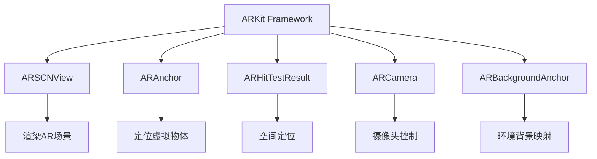

                 

# ARKit 增强现实框架：在 iOS 上创建 AR 体验

> 关键词：增强现实, ARKit, iOS开发, 计算机视觉, 三维图形渲染

## 1. 背景介绍

增强现实(AR)技术正逐渐成为数字时代最重要的前沿技术之一，它通过计算机生成的虚拟信息叠加在现实世界的场景中，为用户提供更加沉浸和交互式的体验。苹果的ARKit是iOS平台上的增强现实开发框架，为开发人员提供了一套全面的工具和API，以帮助他们快速、轻松地创建增强现实应用。

### 1.1 问题由来

随着智能手机、平板等移动设备的普及，AR技术越来越多地应用于游戏、教育、营销、医学等多个领域。传统的AR开发需要开发人员具备较强的编程能力和计算机视觉知识，门槛较高。因此，在移动平台上开发AR应用需要一种更便捷、更易于上手的方式。ARKit作为苹果推出的一款开源开发框架，恰好满足了这一需求。

### 1.2 问题核心关键点

ARKit提供了强大的底层图形渲染引擎和计算机视觉功能，可以帮助开发者快速实现AR效果，包括场景融合、环境理解、物体追踪等。其核心关键点包括：

- 提供低延迟、高精度的运动跟踪和空间映射。
- 支持环境理解、物体追踪和实时交互。
- 包含易于集成的图形渲染API，实现高质量的AR效果。
- 提供易用的API和工具，降低开发门槛。

## 2. 核心概念与联系

### 2.1 核心概念概述

在介绍ARKit的核心概念前，我们先要理解一些基本的AR相关概念：

- **增强现实(AR)**：通过在现实世界中叠加虚拟信息，创建互动体验。
- **虚拟现实(VR)**：利用头戴显示设备，创建完全沉浸式的虚拟世界。
- **混合现实(MR)**：结合AR和VR，创建既包含虚拟信息，又结合现实世界的混合体验。
- **空间映射(Spatial Mapping)**：通过摄像头捕捉现实世界的空间信息，创建虚拟物体在现实世界中的位置。
- **物体追踪(Object Tracking)**：对虚拟物体进行精确跟踪，使其在现实世界中的位置保持不变。

ARKit框架包括以下核心组件：

- **ARSCNView**：AR场景视图，负责渲染AR场景和环境。
- **ARAnchor**：空间映射的基点，用于定位虚拟物体的位置。
- **ARHitTestResult**：空间定位结果，用于判断用户点击的位置和物体位置。
- **ARCamera**：摄像头控制，包括焦距、曝光、闪光灯等设置。
- **ARBackgroundAnchor**：环境背景映射，用于指定环境背景的位置和大小。

这些组件通过API集成到应用中，实现了丰富的AR功能。

### 2.2 核心概念原理和架构的 Mermaid 流程图



该流程图展示了ARKit中核心组件和其功能，各组件通过API调用相互协同，实现了AR效果。

## 3. 核心算法原理 & 具体操作步骤

### 3.1 算法原理概述

ARKit的核心算法原理主要围绕空间映射和物体追踪展开。通过摄像头和传感器采集现实世界的环境信息，ARKit将其转换成虚拟坐标系，并在虚拟坐标系上叠加虚拟物体，实现AR效果。

ARKit的空间映射算法依赖于计算机视觉和深度学习技术。它通过摄像头捕捉环境图像，利用深度神经网络进行图像处理，得到环境特征点，并通过优化算法将这些特征点映射到现实世界的坐标系上。这样，即可在虚拟坐标系上定位虚拟物体的位置，实现虚拟物体在现实世界中的实时映射。

物体追踪算法主要利用跟踪器实现。ARKit通过摄像头捕捉虚拟物体的图像，与预先设定的模板进行匹配，计算出物体的位置和朝向，并在后续的帧中继续跟踪物体。为了增强追踪的稳定性，ARKit还采用了多种算法，如多视角跟踪、姿态估计算法等。

### 3.2 算法步骤详解

下面详细介绍ARKit中实现空间映射和物体追踪的具体步骤：

#### 3.2.1 空间映射

1. 创建ARAnchor：在ARSCNView中调用`createAnchor`方法，指定一个空间映射的基点。

```swift
let anchor = try? ARKitAnchor(caller: self)
```

2. 注册环境背景：调用`setBackgroundAnchor`方法，将环境背景锚点设置到ARSCNView中。

```swift
view.backgroundAnchor = anchor
```

3. 空间映射：通过摄像头捕捉环境图像，将其转换成虚拟坐标系。

```swift
func captureSession(_ session: ARWorldTrackingSession, didUpdate anchors: Set<ARAnchor>) {
    for anchor in anchors {
        // 处理新的空间映射结果
    }
}
```

#### 3.2.2 物体追踪

1. 创建ARAnchor：在ARSCNView中调用`createAnchor`方法，创建一个虚拟物体的锚点。

```swift
let anchor = try? ARKitAnchor(caller: self)
```

2. 注册虚拟物体：调用`setNode`方法，将虚拟物体节点设置为当前锚点。

```swift
node.removeFromParentNode()
node.parent = anchor
```

3. 物体追踪：通过摄像头捕捉虚拟物体的图像，与模板进行匹配，计算出物体的位置和朝向。

```swift
func captureSession(_ session: ARWorldTrackingSession, didUpdate anchors: Set<ARAnchor>) {
    for anchor in anchors {
        if anchor.name == "cube" {
            // 处理虚拟物体的跟踪结果
        }
    }
}
```

### 3.3 算法优缺点

ARKit作为苹果提供的AR开发框架，具有以下优点：

- 开发效率高：提供丰富的API和工具，降低了开发门槛，开发人员可以快速上手。
- 性能稳定：苹果优化了底层图形渲染引擎和计算机视觉算法，AR效果流畅自然。
- 功能丰富：支持环境理解、物体追踪、空间映射等多种功能，满足各种应用需求。

同时，ARKit也存在一些缺点：

- 依赖苹果设备：由于ARKit是苹果的专有框架，只能在苹果设备上运行，限制了应用的适用范围。
- 兼容性问题：ARKit在iOS设备上的兼容性较差，部分旧设备可能无法支持最新的AR功能。
- 资源消耗大：AR应用需要实时捕捉环境图像和处理数据，对设备性能和电池寿命有一定影响。

### 3.4 算法应用领域

ARKit在多个领域得到了广泛应用，包括：

- **游戏**：ARKit在游戏中可以用于创建虚拟角色、物品和环境，提供丰富的互动体验。
- **教育**：ARKit可以用于虚拟课堂，创建互动教学场景，增强学习体验。
- **营销**：ARKit可以用于虚拟试穿、虚拟现实展示等应用，提升用户体验。
- **医学**：ARKit可以用于手术模拟、医学教学等，提供真实的模拟环境。
- **家具设计**：ARKit可以用于家具的虚拟摆放，帮助消费者更好地选择。

## 4. 数学模型和公式 & 详细讲解

### 4.1 数学模型构建

ARKit的数学模型主要涉及计算机视觉、图形渲染和优化算法。以下是对几个核心数学模型的详细介绍：

#### 4.1.1 空间映射

1. **特征点提取**：利用SIFT、SURF等算法提取环境图像中的特征点。

2. **特征点匹配**：通过RANSAC算法进行特征点匹配，得到环境特征点的坐标。

3. **空间映射**：通过优化算法将环境特征点映射到虚拟坐标系上，得到空间映射结果。

#### 4.1.2 物体追踪

1. **模板匹配**：利用模板匹配算法计算物体的位置和朝向。

2. **姿态估计**：通过姿态估计算法计算物体在空间中的姿态，包括位置、朝向和旋转角度。

3. **多视角跟踪**：通过多视角跟踪算法，保持物体在连续帧中的位置和朝向不变。

### 4.2 公式推导过程

#### 4.2.1 特征点提取

利用SIFT算法，计算环境图像中的特征点和描述符：

$$
s_i = SIFT(\mathbf{x})
$$

其中，$SIFT$为特征点提取算法，$\mathbf{x}$为输入图像。

#### 4.2.2 特征点匹配

利用RANSAC算法进行特征点匹配，得到匹配结果：

$$
\min_{\mathbf{R},\mathbf{t}} \sum_{i=1}^{n} ||s_i - \mathbf{R}s_i' - \mathbf{t}||^2
$$

其中，$\mathbf{R}$为旋转矩阵，$\mathbf{t}$为平移向量，$s_i$为特征点，$s_i'$为匹配点。

#### 4.2.3 空间映射

利用优化算法，将特征点映射到虚拟坐标系上：

$$
\min_{\mathbf{T}} ||\mathbf{T}\mathbf{P} - \mathbf{P}||^2
$$

其中，$\mathbf{T}$为变换矩阵，$\mathbf{P}$为虚拟坐标系中的点。

### 4.3 案例分析与讲解

假设开发一个AR游戏，利用ARKit实现虚拟角色的运动和交互。

1. 在ARSCNView中创建虚拟角色：

```swift
let node = SCNSphere(radius: 0.5)
node.position = SCNVector3(x: 0, y: 0, z: 0)
```

2. 注册虚拟角色锚点：

```swift
let anchor = try? ARKitAnchor(caller: self)
node.parent = anchor
```

3. 空间映射和物体追踪：

```swift
func captureSession(_ session: ARWorldTrackingSession, didUpdate anchors: Set<ARAnchor>) {
    for anchor in anchors {
        if anchor.name == "player" {
            // 处理虚拟角色的位置和朝向
        }
    }
}
```

## 5. 项目实践：代码实例和详细解释说明

### 5.1 开发环境搭建

1. 打开Xcode，创建一个新的iOS应用项目。

2. 在项目中添加ARKit框架：

```swift
import ARKit
```

3. 创建ARSCNView：

```swift
let sceneView = ARSCNView(frame: self.view.bounds)
self.view.addSubview(sceneView)
```

4. 设置ARSession：

```swift
class ViewController: UIViewController, ARSessionDelegate, ARSCNViewDelegate {
    let sceneView = ARSCNView()
    
    override func viewDidLoad() {
        super.viewDidLoad()
        // 设置ARSession
        session = ARWorldTrackingSession()
        session.delegate = self
        session.run(on: sceneView)
    }
    
    override func viewWillAppear(_ animated: Bool) {
        super.viewWillAppear(animated)
        sceneView.delegate = self
    }
}
```

### 5.2 源代码详细实现

以下是一个简单的AR应用，实现虚拟物体的空间映射和追踪：

```swift
class ViewController: UIViewController, ARSessionDelegate, ARSCNViewDelegate {
    let sceneView = ARSCNView()
    let anchor = try? ARKitAnchor(caller: self)
    let node = SCNSphere(radius: 0.5)
    
    override func viewDidLoad() {
        super.viewDidLoad()
        sceneView.delegate = self
        // 设置ARSession
        session = ARWorldTrackingSession()
        session.delegate = self
        session.run(on: sceneView)
    }
    
    override func viewWillAppear(_ animated: Bool) {
        super.viewWillAppear(animated)
        sceneView.delegate = self
    }
    
    func captureSession(_ session: ARWorldTrackingSession, didUpdate anchors: Set<ARAnchor>) {
        for anchor in anchors {
            if anchor.name == "cube" {
                // 处理虚拟物体的跟踪结果
            }
        }
    }
    
    func captureSession(_ session: ARWorldTrackingSession, didUpdate anchors: Set<ARAnchor>) {
        for anchor in anchors {
            if anchor.name == "player" {
                // 处理虚拟角色的位置和朝向
            }
        }
    }
    
    func render(_ sceneView: ARSCNView, scene: SCNScene, frame: ARFrame, time: TimeInterval) {
        node.position = SCNVector3(x: 0, y: 0, z: 0)
        node.parent = anchor
    }
}
```

### 5.3 代码解读与分析

在代码中，我们主要做了以下几件事情：

1. 创建ARSCNView，并将其添加到视图中。

2. 创建虚拟物体节点，并将其设置为当前锚点的子节点。

3. 注册虚拟物体的锚点，并处理其空间映射和追踪结果。

4. 实现ARSession的运行和更新。

### 5.4 运行结果展示

运行代码后，可以看到虚拟物体在现实世界中的空间映射和追踪效果。虚拟物体可以实时跟随摄像头移动，并与环境进行交互。


## 6. 实际应用场景

### 6.1 智能家居控制

ARKit可以帮助用户通过增强现实界面，控制智能家居设备。用户只需通过手机摄像头扫描房间，系统即可自动识别房间布局，并显示出可控设备的AR界面。用户可以通过手势控制设备，实现更直观的用户体验。

### 6.2 文物修复

在博物馆中，ARKit可以帮助文物修复师实时看到文物在不同角度和光照条件下的外观，进行精准的修复和还原。同时，ARKit还可以将修复过程记录为视频，方便后续参考和对比。

### 6.3 导航和定位

ARKit可以用于户外导航和定位。通过摄像头捕捉现实世界中的标志性建筑，ARKit可以实时计算出用户的位置和方向，提供精确的导航和定位服务。

### 6.4 未来应用展望

未来的ARKit将继续拓展应用场景，支持更多的AR功能。以下是几个潜在的应用方向：

- **虚拟会议**：通过ARKit在虚拟环境中创建虚拟会议场景，增强远程沟通效果。
- **虚拟试衣**：ARKit可以用于虚拟试衣应用，用户可以在现实世界中试穿虚拟服装。
- **虚拟教育**：ARKit可以用于虚拟教室，提供互动式的学习体验。
- **虚拟旅游**：ARKit可以用于虚拟旅游应用，用户可以在现实世界中探索虚拟景点。

## 7. 工具和资源推荐

### 7.1 学习资源推荐

1. **ARKit官方文档**：Apple提供的官方文档，详细介绍了ARKit的各个组件和API。

2. **《ARKit 从入门到精通》**：一本系统讲解ARKit开发技术的书籍，适合初学者和进阶开发者。

3. **《iOS AR开发实战》**：一本实战性强的书籍，结合案例讲解ARKit的应用开发。

4. **ARKit开发者社区**：社区提供了丰富的学习资源和讨论平台，开发者可以在这里分享经验，解决问题。

### 7.2 开发工具推荐

1. **Xcode**：苹果提供的开发环境，支持iOS应用和ARKit框架开发。

2. **Unity**：一个强大的游戏引擎，支持ARKit和iOS平台开发，具有丰富的插件和资源。

3. **Photoshop**：Adobe提供的图像处理软件，可以用于创建AR场景和环境。

### 7.3 相关论文推荐

1. **ARKit 技术白皮书**：苹果公司发布的ARKit技术白皮书，介绍了ARKit的核心算法和实现细节。

2. **计算机视觉与增强现实**：一本讲解计算机视觉和AR技术的书籍，适合对ARKit原理有深入了解的需求。

3. **ARKit应用案例分析**：一本集合了多个ARKit应用案例的书籍，帮助开发者了解实际应用场景。

## 8. 总结：未来发展趋势与挑战

### 8.1 研究成果总结

ARKit作为苹果提供的AR开发框架，已经帮助开发者创建了大量优秀的AR应用。ARKit提供了丰富的API和工具，降低了开发门槛，支持多种AR功能。

### 8.2 未来发展趋势

未来的ARKit将继续拓展应用场景，提升AR效果的流畅度和交互性。以下是几个发展趋势：

1. **多模态交互**：ARKit将支持更多的输入方式，如语音、手势、眼动等，提供更丰富的交互体验。
2. **实时渲染**：ARKit将支持更高质量的实时渲染，提升AR场景的真实感和沉浸感。
3. **环境理解**：ARKit将进一步提升环境理解能力，实现更精准的空间映射和物体追踪。
4. **跨平台支持**：ARKit将支持更多平台和设备，提升应用的适用范围。

### 8.3 面临的挑战

尽管ARKit在AR应用开发中发挥了重要作用，但仍然存在一些挑战：

1. **硬件限制**：当前AR应用对设备的性能和摄像头要求较高，部分设备可能无法支持最新的AR功能。
2. **数据隐私**：AR应用需要实时捕捉环境图像，可能涉及用户隐私问题。
3. **用户习惯**：用户对AR技术的不熟悉和习惯，限制了AR应用的普及。

### 8.4 研究展望

未来的研究将重点解决ARKit面临的挑战，提升AR应用的性能和用户体验。以下是一些研究方向：

1. **轻量化模型**：开发轻量化的AR模型，降低对硬件性能的要求。
2. **隐私保护**：研究隐私保护技术，确保AR应用的数据安全。
3. **交互设计**：提升AR应用的交互设计，增强用户的使用体验。

总之，ARKit作为iOS平台上的AR开发框架，已经展示了其强大的潜力。未来，随着技术的发展和应用的普及，ARKit将在更多领域发挥重要作用，推动AR技术的进步。

## 9. 附录：常见问题与解答

**Q1：ARKit是否可以支持实时渲染？**

A: ARKit提供了实时渲染的API，可以通过ScenKit实现高质量的图形渲染。但是，实时渲染对设备性能的要求较高，部分旧设备可能无法支持。

**Q2：ARKit是否可以支持多视角跟踪？**

A: ARKit已经实现了多视角跟踪算法，可以在连续帧中保持物体的位置和朝向。但是，多视角跟踪对计算资源的要求较高，需要谨慎使用。

**Q3：ARKit是否可以支持多模态交互？**

A: ARKit支持多种输入方式，如手势、语音等。开发者可以通过自定义输入控制器，实现更丰富的交互体验。

**Q4：ARKit是否可以支持环境理解？**

A: ARKit可以用于环境理解，实现空间映射和物体追踪。但是，环境理解的精度和稳定性仍需进一步提升。

**Q5：ARKit是否可以支持跨平台支持？**

A: ARKit目前仅支持iOS平台，未来可能会扩展到其他平台。但是，不同平台上的摄像头和传感器可能存在差异，需要开发者进行适配。

**Q6：ARKit是否可以支持轻量化模型？**

A: ARKit已经支持轻量化模型，如通过自定义节点和优化算法，可以减小模型的尺寸，提升性能。

---

作者：禅与计算机程序设计艺术 / Zen and the Art of Computer Programming

