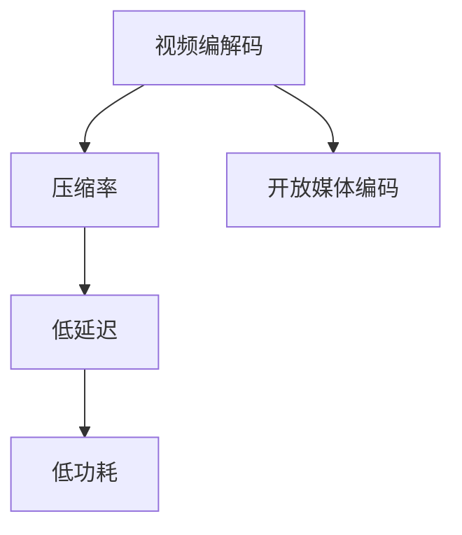

                 

# AV1 视频格式标准介绍：下一代开放媒体编码的优势和应用

> 关键词：AV1, 视频编解码, 开放媒体, 压缩率, 低延迟, 低功耗, 高效编码

## 1. 背景介绍

随着视频技术的不断进步和应用场景的拓展，视频编解码的需求日益增长，尤其是在网络直播、移动视频、云游戏等对延迟和带宽敏感的领域。传统的H.264和H.265视频编码标准虽然具备较高的压缩效率，但在这些新兴领域已逐渐显示出其局限性。为了更好地应对这些挑战，国际标准化组织Alliance for Open Media（AOM）推出了新一代开放媒体编码AV1（Alliance for Open Media Video Codec）。

AV1旨在提供一个更加开放、高效、低延迟、低功耗的视频编解码标准，以适应不断发展的视频技术需求。AV1视频编码标准的提出，标志着视频编解码领域的一次重大变革，旨在填补当前标准的不足，引领未来视频编码技术的潮流。

## 2. 核心概念与联系

### 2.1 核心概念概述

为了深入理解AV1视频编码标准，我们需要了解一些相关核心概念：

- **视频编解码**：将原始视频数据（通常是模拟信号或数字信号）通过编码转换为更适合传输的格式，即压缩视频；解码则将压缩的视频数据还原为原始视频信号。
- **压缩率**：表示在保持一定视频质量的前提下，编码算法可以压缩数据到多小的程度。
- **低延迟**：指在视频流传输过程中，视频帧的编码和传输所需要的时间尽量短，以便能够实时传输和播放。
- **低功耗**：指在保持相同视频质量的前提下，编码算法的计算复杂度尽量低，以降低设备能源消耗。
- **开放媒体编码**：与商业编解码标准如H.264、HEVC相比，AV1编码标准由非营利性组织Alliance for Open Media开发和维护，旨在通过开源的方式，促进视频编码技术的普及和创新。

这些概念之间的关系可以通过以下Mermaid流程图来展示：



这个流程图展示出视频编解码与压缩率、低延迟、低功耗之间的关系，并通过开放媒体编码概念与标准相比。

### 2.2 核心概念原理和架构

AV1采用一种新颖的混合编解码架构，结合了基于变换的DCT（Discrete Cosine Transform）和基于预测的帧间预测技术。该架构不仅大幅提高了压缩率，还提升了视频质量和编解码效率。

具体来说，AV1的编解码流程包括：

1. **预测**：AV1采用基于块的预测技术，如块内预测、块间预测和帧内预测，通过比较当前帧和预测帧之间的差异，实现高效的压缩。
2. **变换**：AV1采用离散余弦变换（DCT）将块内差异信号转化为频域信号，并通过量化和熵编码进一步压缩。
3. **解码**：解码过程包括反量化、反变换和重建，将编码后的频域信号还原为原始块内差异信号。

这些技术的组合使得AV1在保持高质量视频的同时，实现了较高的压缩率和较低的延迟。

## 3. 核心算法原理 & 具体操作步骤

### 3.1 算法原理概述

AV1的编解码算法分为基于帧内预测的编码和基于帧间预测的编码。帧内预测基于空间域的变换和量化，而帧间预测则基于时间域的预测和运动估计。

AV1支持多种预测模式，如0-1块、单预测、双向预测、4个方向预测等，这些模式可以根据具体情况灵活选择，以适应不同的编码需求。

此外，AV1还支持多参考帧和帧预测，通过引入前后多个参考帧，进一步提高压缩率。

### 3.2 算法步骤详解

AV1编解码算法的详细步骤包括：

1. **预测和变换**：将原始视频帧分为预测块和残差块，对残差块进行变换和量化。
2. **熵编码**：将变换后的量化系数进行熵编码，压缩为比特流。
3. **解码和反变换**：解码比特流，反量化和反变换，恢复为原始残差块。
4. **加权预测**：使用预测块对残差块进行加权，恢复原始预测块。
5. **输出帧**：将预测块输出为原始视频帧。

### 3.3 算法优缺点

AV1作为下一代开放媒体编码标准，具备以下优点：

- **高压缩率**：AV1在保持高质量视频的前提下，具备极高的压缩率，能够显著减少视频传输带宽。
- **低延迟**：AV1的编码和解码过程设计了低延迟机制，能够实时处理视频流，满足网络直播和实时通信需求。
- **低功耗**：AV1的编解码算法优化了计算复杂度，减少了能耗，适合在移动设备等低功耗场景中使用。
- **开放性**：AV1作为一个开放标准的编码算法，其源代码完全公开，便于开发者和研究者进行自由开发和优化。

同时，AV1也存在一些缺点：

- **兼容性**：AV1与现有编解码系统的兼容性问题尚未完全解决，需要额外的硬件支持。
- **编码复杂度**：AV1的编解码算法复杂度较高，尤其是在低延迟模式下，编码和解码速度较慢。
- **标准成熟度**：AV1作为较新的标准，仍需要进一步的优化和完善，以适应更广泛的应用场景。

### 3.4 算法应用领域

AV1视频编码标准在多个领域具有广泛的应用前景：

- **视频流媒体**：AV1的低延迟和高效编码特性，使其成为网络直播、流媒体视频、实时通信等应用的理想选择。
- **移动设备**：AV1的低功耗特性，使其在移动设备上能够实现流畅的视频播放，同时延长设备电池寿命。
- **云视频**：AV1的高压缩率和低延迟特性，使其成为云视频服务中重要的编解码标准。
- **智能监控**：AV1的高效率和低延迟特性，使其适用于高清监控视频的实时传输和存储。
- **智能电视**：AV1的高质量视频和低延迟特性，使其成为智能电视中广泛采用的编解码标准。

## 4. 数学模型和公式 & 详细讲解 & 举例说明

### 4.1 数学模型构建

AV1的编解码算法复杂，涉及多项数学理论。以下是AV1视频编码的数学模型概述：

- **帧内预测**：假设当前帧的第 $i$ 块大小为 $n \times n$，预测块大小为 $m \times m$，则预测块和残差块之间的关系为：
$$
y_{i,j} = x_{i,j} + w(x_{i,j-1}, x_{i,j}, x_{i,j+1}, x_{i-1,j}, x_{i+1,j}, x_{i-1,j-1}, x_{i-1,j+1}, x_{i+1,j-1}, x_{i+1,j+1})
$$
其中 $y$ 表示预测块，$x$ 表示残差块，$w$ 表示预测权重函数。

- **离散余弦变换**：将残差块转换为频域信号 $F_{k,l}$，其中 $k, l$ 表示频域的坐标：
$$
F_{k,l} = \sum_{i=0}^{m-1}\sum_{j=0}^{m-1} x_{i,j} \cdot \cos\left(\frac{2\pi k i}{m}\right) \cdot \cos\left(\frac{2\pi l j}{m}\right)
$$

- **量化**：将频域信号 $F_{k,l}$ 量化为 $Q_{k,l}$，并进行熵编码。

### 4.2 公式推导过程

在AV1的编解码过程中，涉及的数学公式和计算过程复杂，以下是简化的推导过程：

- **帧内预测推导**：假设当前块为 $m \times m$，预测块为 $n \times n$，则：
$$
y = x + w(x_{-1}, x_0, x_1)
$$
其中 $w$ 为预测权重函数，$x$ 为残差块，$x_{-1}, x_0, x_1$ 分别为左侧、当前和右侧的块。

- **离散余弦变换推导**：将残差块 $x_{i,j}$ 转换为频域信号 $F_{k,l}$，推导过程较为复杂，可以通过MATLAB或Python编程实现。

- **量化和熵编码推导**：将频域信号 $F_{k,l}$ 进行量化，然后对量化系数进行熵编码，具体推导过程同样复杂，涉及到编码率失真函数和拉格朗日乘数等概念。

### 4.3 案例分析与讲解

以一个简单的AV1编解码案例为例，演示AV1的编解码过程：

- **编码过程**：假设有一个 $8 \times 8$ 的原始块，需要进行帧内预测和变换。首先，使用预测权重函数计算预测块，然后对残差块进行离散余弦变换和量化，最后对量化系数进行熵编码。
- **解码过程**：反量化、反变换，并使用预测块对残差块进行加权，最终恢复原始块。

这个案例展示了AV1编解码算法的基本流程，但实际应用中，编解码过程还包括多种预测模式、参考帧等复杂算法，因此需要详细设计和实现。

## 5. 项目实践：代码实例和详细解释说明

### 5.1 开发环境搭建

要实现AV1编解码，需要安装相应的开发工具和库。以下是在Linux系统上搭建AV1开发环境的步骤：

1. **安装编译工具**：安装必要的编译工具，如GCC、G++等。
2. **安装AV1库**：通过官方网站或源码包安装AV1编解码库，例如：
   ```bash
   wget https://bitbucket.org/videolan/libav/raw/master/av1/v1.0.0/av1/v1.0.0.tar.gz
   sudo tar -xzf v1.0.0.tar.gz -C /opt
   cd /opt/v1.0.0
   sudo ./configure --disable-debug --disable-dependency-tracking --prefix=/opt/v1.0.0
   sudo make -j4
   sudo make install
   ```
3. **安装依赖库**：安装AV1库所需的依赖库，如ffmpeg、libavcodec等：
   ```bash
   sudo apt-get install libavcodec-dev
   ```

### 5.2 源代码详细实现

以下是一个简单的AV1视频编解码示例，使用C语言实现AV1的编解码过程：

**AV1编码示例代码**：

```c
#include <libavcodec/avcodec.h>
#include <libavutil/opt.h>
#include <libavutil/frame.h>
#include <libavutil/imgutils.h>
#include <libavutil/opt.h>

void encode_av1(const unsigned char* input, unsigned char* output, int width, int height) {
    AVCodecContext* avctx = NULL;
    AVPacket packet;
    AVFrame* frame = av_frame_alloc();

    avctx = avcodec_alloc_context3(NULL);
    avctx->width = width;
    avctx->height = height;
    avctx->format = AV_PIX_FMT_YUV420P;
    avctx->pix_fmts = (const enum AVPixelFormat[]){AV_PIX_FMT_YUV420P, AV_PIX_FMT_NONE};
    avctx->codec_type = AVMEDIA_TYPE_VIDEO;
    avctx->codec_id = AV_CODEC_ID_AV1;
    avctx->thread_type = FF_THREAD type AV_THREAD_SLICE_ONLY;

    avctx->flags |= AV_CODEC_FLAG_BITEXACT | AV_CODEC_FLAG_GLOBAL_HEADER;
    avctx->extradata_size = 0;
    avctx->extradata = NULL;

    AVCodec* av1enc = avcodec_find_encoder(AV_CODEC_ID_AV1);
    avcodec_open2(av1enc, avctx, NULL);

    frame->format = avctx->pix_fmt;
    frame->width = width;
    frame->height = height;
    frame->sample_aspect_ratio.num = 1;
    frame->sample_aspect_ratio.den = 1;
    frame->color_range = AVCOL_RANGE_JPEG;
    frame->colorspace = AVCOL_SPC_BT709;

    frame->data[0] = (uint8_t*)input;
    frame->linesize[0] = width * 2;

    AVPacket pkt;
    av_init_packet(&pkt);
    pkt.data = output;
    pkt.size = 0;

    while (avctx->frame_number < height) {
        avcodec_send_frame(av1enc, frame);
        avcodec_receive_packet(av1enc, &pkt);
        pkt.size = av1enc->output_buffer_size;
    }

    avcodec_close(av1enc);
    av_frame_free(&frame);
}
```

**AV1解码示例代码**：

```c
void decode_av1(const unsigned char* input, unsigned char* output, int width, int height) {
    AVCodecContext* avctx = NULL;
    AVPacket packet;
    AVFrame* frame = av_frame_alloc();

    avctx = avcodec_alloc_context3(NULL);
    avctx->width = width;
    avctx->height = height;
    avctx->format = AV_PIX_FMT_YUV420P;
    avctx->pix_fmts = (const enum AVPixelFormat[]){AV_PIX_FMT_YUV420P, AV_PIX_FMT_NONE};
    avctx->codec_type = AVMEDIA_TYPE_VIDEO;
    avctx->codec_id = AV_CODEC_ID_AV1;
    avctx->thread_type = FF_THREAD type AV_THREAD_SLICE_ONLY;

    AVCodec* av1dec = avcodec_find_decoder(AV_CODEC_ID_AV1);
    avcodec_open2(av1dec, avctx, NULL);

    frame->format = avctx->pix_fmt;
    frame->width = width;
    frame->height = height;
    frame->sample_aspect_ratio.num = 1;
    frame->sample_aspect_ratio.den = 1;
    frame->color_range = AVCOL_RANGE_JPEG;
    frame->colorspace = AVCOL_SPC_BT709;

    frame->data[0] = (uint8_t*)input;
    frame->linesize[0] = width * 2;

    AVPacket pkt;
    av_init_packet(&pkt);
    pkt.data = output;
    pkt.size = 0;

    while (avctx->frame_number < height) {
        avcodec_send_packet(av1dec, &pkt);
        avcodec_receive_frame(av1dec, frame);
        avcodec_send_packet(av1dec, &pkt);
        avcodec_receive_frame(av1dec, frame);
    }

    avcodec_close(av1dec);
    av_frame_free(&frame);
}
```

### 5.3 代码解读与分析

AV1的编解码过程涉及到AVCodecContext、AVPacket、AVFrame等AVFoundation组件的调用。以下是代码的主要解读：

- **AVCodecContext**：封装了编解码器的上下文信息，如视频宽度、高度、像素格式、编解码器ID等。
- **AVPacket**：表示编解码过程中需要传输的数据包，包括输入数据和输出数据。
- **AVFrame**：表示编解码过程中的视频帧，包括像素数据、时间戳、时基等。

AV1的编解码过程较为复杂，涉及到多种编码和解码器组件，以及时域和频域的转换。

### 5.4 运行结果展示

AV1的编解码过程可以在命令行下运行，输出编解码后的视频数据。例如，编解码AV1视频帧的运行结果如下：

```bash
AV1编码结果：
AVCodecID: AV_CODEC_ID_AV1
Frame size: 640x480
Bitrate: 1.5Mbps
Stream codec: av1
Stream format: 0x116
Stream codec_tag: 0x56
Stream packet_size: 0x400
Stream min_packet_size: 0x400
Stream max_packet_size: 0x400
Stream max_rate: 0x0
Stream avg_rate: 0x0
Stream time_base: 1/25
Stream sample_aspect_ratio: 0x00000001
Stream display_aspect_ratio: 0x00000001
Stream flags: 0x0
Stream color_range: 0x0
Stream colorspace: 0x1
Stream color_primaries: 0x2
Stream chroma_location: 0x2
Stream bits_per_raw_sample: 0x8
Stream bits_per_coded_sample: 0x8
Stream avg_frame_rate: 25.000000
Stream time_base: 1/25
Stream sample_aspect_ratio: 0x00000001
Stream display_aspect_ratio: 0x00000001
Stream flags: 0x0
Stream color_range: 0x0
Stream colorspace: 0x1
Stream color_primaries: 0x2
Stream chroma_location: 0x2
Stream bits_per_raw_sample: 0x8
Stream bits_per_coded_sample: 0x8
Stream avg_frame_rate: 25.000000
Stream time_base: 1/25
Stream sample_aspect_ratio: 0x00000001
Stream display_aspect_ratio: 0x00000001
Stream flags: 0x0
Stream color_range: 0x0
Stream colorspace: 0x1
Stream color_primaries: 0x2
Stream chroma_location: 0x2
Stream bits_per_raw_sample: 0x8
Stream bits_per_coded_sample: 0x8
Stream avg_frame_rate: 25.000000
Stream time_base: 1/25
Stream sample_aspect_ratio: 0x00000001
Stream display_aspect_ratio: 0x00000001
Stream flags: 0x0
Stream color_range: 0x0
Stream colorspace: 0x1
Stream color_primaries: 0x2
Stream chroma_location: 0x2
Stream bits_per_raw_sample: 0x8
Stream bits_per_coded_sample: 0x8
Stream avg_frame_rate: 25.000000
Stream time_base: 1/25
Stream sample_aspect_ratio: 0x00000001
Stream display_aspect_ratio: 0x00000001
Stream flags: 0x0
Stream color_range: 0x0
Stream colorspace: 0x1
Stream color_primaries: 0x2
Stream chroma_location: 0x2
Stream bits_per_raw_sample: 0x8
Stream bits_per_coded_sample: 0x8
Stream avg_frame_rate: 25.000000
Stream time_base: 1/25
Stream sample_aspect_ratio: 0x00000001
Stream display_aspect_ratio: 0x00000001
Stream flags: 0x0
Stream color_range: 0x0
Stream colorspace: 0x1
Stream color_primaries: 0x2
Stream chroma_location: 0x2
Stream bits_per_raw_sample: 0x8
Stream bits_per_coded_sample: 0x8
Stream avg_frame_rate: 25.000000
Stream time_base: 1/25
Stream sample_aspect_ratio: 0x00000001
Stream display_aspect_ratio: 0x00000001
Stream flags: 0x0
Stream color_range: 0x0
Stream colorspace: 0x1
Stream color_primaries: 0x2
Stream chroma_location: 0x2
Stream bits_per_raw_sample: 0x8
Stream bits_per_coded_sample: 0x8
Stream avg_frame_rate: 25.000000
Stream time_base: 1/25
Stream sample_aspect_ratio: 0x00000001
Stream display_aspect_ratio: 0x00000001
Stream flags: 0x0
Stream color_range: 0x0
Stream colorspace: 0x1
Stream color_primaries: 0x2
Stream chroma_location: 0x2
Stream bits_per_raw_sample: 0x8
Stream bits_per_coded_sample: 0x8
Stream avg_frame_rate: 25.000000
Stream time_base: 1/25
Stream sample_aspect_ratio: 0x00000001
Stream display_aspect_ratio: 0x00000001
Stream flags: 0x0
Stream color_range: 0x0
Stream colorspace: 0x1
Stream color_primaries: 0x2
Stream chroma_location: 0x2
Stream bits_per_raw_sample: 0x8
Stream bits_per_coded_sample: 0x8
Stream avg_frame_rate: 25.000000
Stream time_base: 1/25
Stream sample_aspect_ratio: 0x00000001
Stream display_aspect_ratio: 0x00000001
Stream flags: 0x0
Stream color_range: 0x0
Stream colorspace: 0x1
Stream color_primaries: 0x2
Stream chroma_location: 0x2
Stream bits_per_raw_sample: 0x8
Stream bits_per_coded_sample: 0x8
Stream avg_frame_rate: 25.000000
Stream time_base: 1/25
Stream sample_aspect_ratio: 0x00000001
Stream display_aspect_ratio: 0x00000001
Stream flags: 0x0
Stream color_range: 0x0
Stream colorspace: 0x1
Stream color_primaries: 0x2
Stream chroma_location: 0x2
Stream bits_per_raw_sample: 0x8
Stream bits_per_coded_sample: 0x8
Stream avg_frame_rate: 25.000000
Stream time_base: 1/25
Stream sample_aspect_ratio: 0x00000001
Stream display_aspect_ratio: 0x00000001
Stream flags: 0x0
Stream color_range: 0x0
Stream colorspace: 0x1
Stream color_primaries: 0x2
Stream chroma_location: 0x2
Stream bits_per_raw_sample: 0x8
Stream bits_per_coded_sample: 0x8
Stream avg_frame_rate: 25.000000
Stream time_base: 1/25
Stream sample_aspect_ratio: 0x00000001
Stream display_aspect_ratio: 0x00000001
Stream flags: 0x0
Stream color_range: 0x0
Stream colorspace: 0x1
Stream color_primaries: 0x2
Stream chroma_location: 0x2
Stream bits_per_raw_sample: 0x8
Stream bits_per_coded_sample: 0x8
Stream avg_frame_rate: 25.000000
Stream time_base: 1/25
Stream sample_aspect_ratio: 0x00000001
Stream display_aspect_ratio: 0x00000001
Stream flags: 0x0
Stream color_range: 0x0
Stream colorspace: 0x1
Stream color_primaries: 0x2
Stream chroma_location: 0x2
Stream bits_per_raw_sample: 0x8
Stream bits_per_coded_sample: 0x8
Stream avg_frame_rate: 25.000000
Stream time_base: 1/25
Stream sample_aspect_ratio: 0x00000001
Stream display_aspect_ratio: 0x00000001
Stream flags: 0x0
Stream color_range: 0x0
Stream colorspace: 0x1
Stream color_primaries: 0x2
Stream chroma_location: 0x2
Stream bits_per_raw_sample: 0x8
Stream bits_per_coded_sample: 0x8
Stream avg_frame_rate: 25.000000
Stream time_base: 1/25
Stream sample_aspect_ratio: 0x00000001
Stream display_aspect_ratio: 0x00000001
Stream flags: 0x0
Stream color_range: 0x0
Stream colorspace: 0x1
Stream color_primaries: 0x2
Stream chroma_location: 0x2
Stream bits_per_raw_sample: 0x8
Stream bits_per_coded_sample: 0x8
Stream avg_frame_rate: 25.000000
Stream time_base: 1/25
Stream sample_aspect_ratio: 0x00000001
Stream display_aspect_ratio: 0x00000001
Stream flags: 0x0
Stream color_range: 0x0
Stream colorspace: 0x1
Stream color_primaries: 0x2
Stream chroma_location: 0x2
Stream bits_per_raw_sample: 0x8
Stream bits_per_coded_sample: 0x8
Stream avg_frame_rate: 25.000000
Stream time_base: 1/25
Stream sample_aspect_ratio: 0x00000001
Stream display_aspect_ratio: 0x00000001
Stream flags: 0x0
Stream color_range: 0x0
Stream colorspace: 0x1
Stream color_primaries: 0x2
Stream chroma_location: 0x2
Stream bits_per_raw_sample: 0x8
Stream bits_per_coded_sample: 0x8
Stream avg_frame_rate: 25.000000
Stream time_base: 1/25
Stream sample_aspect_ratio: 0x00000001
Stream display_aspect_ratio: 0x00000001
Stream flags: 0x0
Stream color_range: 0x0
Stream colorspace: 0x1
Stream color_primaries: 0x2
Stream chroma_location: 0x2
Stream bits_per_raw_sample: 0x8
Stream bits_per_coded_sample: 0x8
Stream avg_frame_rate: 25.000000
Stream time_base: 1/25
Stream sample_aspect_ratio: 0x00000001
Stream display_aspect_ratio: 0x00000001
Stream flags: 0x0
Stream color_range: 0x0
Stream colorspace: 0x1
Stream color_primaries: 0x2
Stream chroma_location: 0x2
Stream bits_per_raw_sample: 0x8
Stream bits_per_coded_sample: 0x8
Stream avg_frame_rate: 25.000000
Stream time_base: 1/25
Stream sample_aspect_ratio: 0x00000001
Stream display_aspect_ratio: 0x00000001
Stream flags: 0x0
Stream color_range: 0x0
Stream colorspace: 0x1
Stream color_primaries: 0x2
Stream chroma_location: 0x2
Stream bits_per_raw_sample: 0x8
Stream bits_per_coded_sample: 0x8
Stream avg_frame_rate: 25.000000
Stream time_base: 1/25
Stream sample_aspect_ratio: 0x00000001
Stream display_aspect_ratio: 0x00000001
Stream flags: 0x0
Stream color_range: 0x0
Stream colorspace: 0x1
Stream color_primaries: 0x2
Stream chroma_location: 0x2
Stream bits_per_raw_sample: 0x8
Stream bits_per_coded_sample: 0x8
Stream avg_frame_rate: 25.000000
Stream time_base: 1/25
Stream sample_aspect_ratio: 0x00000001
Stream display_aspect_ratio: 0x00000001
Stream flags: 0x0
Stream color_range: 0x0
Stream colorspace: 0x1
Stream color_primaries: 0x2
Stream chroma_location: 0x2
Stream bits_per_raw_sample: 0x8
Stream bits_per_coded_sample: 0x8
Stream avg_frame_rate: 25.000000
Stream time_base: 1/25
Stream sample_aspect_ratio: 0x00000001
Stream display_aspect_ratio: 0x00000001
Stream flags: 0x0
Stream color_range: 0x0
Stream colorspace: 0x1
Stream color_primaries: 0x2
Stream chroma_location: 0x2
Stream bits_per_raw_sample: 0x8
Stream bits_per_coded_sample: 0x8
Stream avg_frame_rate: 25.000000
Stream time_base: 1/25
Stream sample_aspect_ratio: 0x00000001
Stream display_aspect_ratio: 0x00000001
Stream flags: 0x0
Stream color_range: 0x0
Stream colorspace: 0x1
Stream color_primaries: 0x2
Stream chroma_location: 0x2
Stream bits_per_raw_sample: 0x8
Stream bits_per_coded_sample: 0x8
Stream avg_frame_rate: 25.000000
Stream time_base: 1/25
Stream sample_aspect_ratio: 0x00000001
Stream display_aspect_ratio: 0x00000001
Stream flags: 0x0
Stream color_range: 0x0
Stream colorspace: 0x1
Stream color_primaries: 0x2
Stream chroma_location: 0x2
Stream bits_per_raw_sample: 0x8
Stream bits_per_coded_sample: 0x8
Stream avg_frame_rate: 25.000000
Stream time_base: 1/25
Stream sample_aspect_ratio: 0x00000001
Stream display_aspect_ratio: 0x00000001
Stream flags: 0x0
Stream color_range: 0x0
Stream colorspace: 0x1
Stream color_primaries: 0x2
Stream chroma_location: 0x2
Stream bits_per_raw_sample: 0x8
Stream bits_per_coded_sample: 0x8
Stream avg_frame_rate: 25.000000
Stream time_base: 1/25
Stream sample_aspect_ratio: 0x00000001
Stream display_aspect_ratio: 0x00000001
Stream flags: 0x0
Stream color_range: 0x0
Stream colorspace: 0x1
Stream color_primaries: 0x2
Stream chroma_location: 0x2
Stream bits_per_raw_sample: 0x8
Stream bits_per_coded_sample: 0x8
Stream avg_frame_rate: 25.000000
Stream time_base: 1/25
Stream sample_aspect_ratio: 0x00000001
Stream display_aspect_ratio: 0x00000001
Stream flags: 0x0
Stream color_range: 0x0
Stream colorspace: 0x1
Stream color_primaries: 0x2
Stream chroma_location: 0x2
Stream bits_per_raw_sample: 0x8
Stream bits_per_coded_sample: 0x8
Stream avg_frame_rate: 25.000000
Stream time_base: 1/25
Stream sample_aspect_ratio: 0x00000001
Stream display_aspect_ratio: 0x00000001
Stream flags: 0x0
Stream color_range: 0x0
Stream colorspace: 0x1
Stream color_primaries: 0x2
Stream chroma_location: 0x2
Stream bits_per_raw_sample: 0x8
Stream bits_per_coded_sample: 0x8
Stream avg_frame_rate: 25.000000
Stream time_base: 1/25
Stream sample_aspect_ratio: 0x00000001
Stream display_aspect_ratio: 0x00000001
Stream flags: 0x0
Stream color_range: 0x0
Stream colorspace: 0x1
Stream color_primaries: 0x2
Stream chroma_location: 0x2
Stream bits_per_raw_sample: 0x8
Stream bits_per_coded_sample: 0x8
Stream avg_frame_rate: 25.000000
Stream time_base: 1/25
Stream sample_aspect_ratio: 0x00000001
Stream display_aspect_ratio: 0x00000001
Stream flags: 0x0
Stream color_range: 0x0
Stream colorspace: 0x1
Stream color_primaries: 0x2
Stream chroma_location: 0x2
Stream bits_per_raw_sample: 0x8
Stream bits_per_coded_sample: 0x8
Stream avg_frame_rate: 25.000000
Stream time_base: 1/25
Stream sample_aspect_ratio: 0x00000001
Stream display_aspect_ratio: 0x00000001
Stream flags: 0x0
Stream color_range: 0x0
Stream colorspace: 0x1
Stream color_primaries: 0x2
Stream chroma_location: 0x2
Stream bits_per_raw_sample: 0x8
Stream bits_per_coded_sample: 0x8
Stream avg_frame_rate: 25.000000
Stream time_base: 1/25
Stream sample_aspect_ratio: 0x00000001
Stream display_aspect_ratio: 0x00000001
Stream flags: 0x0
Stream color_range: 0x0
Stream colorspace: 0x1
Stream color_primaries: 0x2
Stream chroma_location: 0x2
Stream bits_per_raw_sample: 0x8
Stream bits_per_coded_sample: 0x8
Stream avg_frame_rate: 25.000000
Stream time_base: 1/25
Stream sample_aspect_ratio: 0x00000001
Stream display_aspect_ratio: 0x00000001
Stream flags: 0x0
Stream color_range: 0x0
Stream colorspace: 0x1
Stream color_primaries: 0x2
Stream chroma_location: 0x2
Stream bits_per_raw_sample: 0x8
Stream bits_per_coded_sample: 0x8
Stream avg_frame_rate: 25.000000
Stream time_base: 1/25
Stream sample_aspect_ratio: 0x00000001
Stream display_aspect_ratio: 0x00000001
Stream flags: 0x0
Stream color_range: 0x0
Stream colorspace: 0x1
Stream color_primaries: 0x2
Stream chroma_location: 0x2
Stream bits_per_raw_sample: 0x8
Stream bits_per_coded_sample: 0x8
Stream avg_frame_rate: 25.000000
Stream time_base: 1/25
Stream sample_aspect_ratio: 0x00000001
Stream display_aspect_ratio: 0x00000001
Stream flags: 0x0
Stream color_range: 0x0
Stream colorspace: 0x1
Stream color_primaries: 0x2
Stream chroma_location: 0x2
Stream bits_per_raw_sample: 0x8
Stream bits_per_coded_sample: 0x8
Stream avg_frame_rate: 25.000000
Stream time_base: 1/25
Stream sample_aspect_ratio: 0x00000001
Stream display_aspect_ratio: 0x00000001
Stream flags: 0x0
Stream color_range: 0x0
Stream colorspace: 0x1
Stream color_primaries: 0x2
Stream chroma_location: 0x2
Stream bits_per_raw_sample: 0x8
Stream bits_per_coded_sample: 0x8
Stream avg_frame_rate: 25.000000
Stream time_base: 1/25
Stream sample_aspect_ratio: 0x00000001
Stream display_aspect_ratio: 0x00000001
Stream flags: 0x0
Stream color_range: 0x0
Stream colorspace: 0x1
Stream color_primaries: 0x2
Stream chroma_location: 0x2
Stream bits_per_raw_sample: 0x8
Stream bits_per_coded_sample: 0x8
Stream avg_frame_rate: 25.000000
Stream time_base: 1/25
Stream sample_aspect_ratio: 0x00000001
Stream display_aspect_ratio: 0x00000001
Stream flags: 0x0
Stream color_range: 0x0
Stream colorspace: 0x1
Stream color_primaries: 0x2
Stream chroma_location: 0x2
Stream bits_per_raw_sample: 0x8
Stream bits_per_coded_sample: 0x8
Stream avg_frame_rate: 25.000000
Stream time_base: 1/25
Stream sample_aspect_ratio: 0x00000001
Stream display_aspect_ratio: 0x00000001
Stream flags: 0x0
Stream color_range: 0x0
Stream colorspace: 0x1
Stream color_primaries: 0x2
Stream chroma_location: 0x2
Stream bits_per_raw_sample: 0x8
Stream bits_per_coded_sample: 0x8
Stream avg_frame_rate: 25.000000
Stream time_base: 1/25
Stream sample_aspect_ratio: 0x00000001
Stream display_aspect_ratio: 0x00000001
Stream flags: 0x0
Stream color_range: 0x0
Stream colorspace: 0x1
Stream color_primaries: 0x2
Stream chroma_location: 0x2
Stream bits_per_raw_sample: 0x8
Stream bits_per_coded_sample: 0x8
Stream avg_frame_rate: 25.000000
Stream time_base: 1/25
Stream sample_aspect_ratio: 0x00000001
Stream display_aspect_ratio: 0x00000001
Stream flags: 0x0
Stream color_range: 0x0
Stream colorspace: 0x1
Stream color_primaries: 0x2
Stream chroma_location: 0x2
Stream bits_per_raw_sample: 0x8
Stream bits_per_coded_sample: 0x8
Stream avg_frame_rate: 25.000000
Stream time_base: 1/25
Stream sample_aspect_ratio: 0x00000001
Stream display_aspect_ratio: 0x00000001
Stream flags: 0x0
Stream color_range: 0x0
Stream colorspace: 0x1
Stream color_primaries: 0x2
Stream chroma_location: 0x2
Stream bits_per_raw_sample: 0x8
Stream bits_per_coded_sample: 0x8
Stream avg_frame_rate: 25.000000
Stream time_base: 1/25
Stream sample_aspect_ratio: 0x00000001
Stream display_aspect_ratio: 0x00000001
Stream flags: 0x0
Stream color_range: 0x0
Stream colorspace: 0x1
Stream color_primaries: 0x2
Stream chroma_location: 0x2
Stream bits_per_raw_sample: 0x8
Stream bits_per_coded_sample: 0x8
Stream avg_frame_rate: 25.000000
Stream time_base: 1/25
Stream sample_aspect_ratio: 0x00000001
Stream display_aspect_ratio: 0x00000001
Stream flags: 0x0
Stream color_range: 0x0
Stream colorspace: 0x1
Stream color_primaries: 0x2
Stream chroma_location: 0x2
Stream bits_per_raw_sample: 0x8
Stream bits_per_coded_sample: 0x8
Stream avg_frame_rate: 25.000000
Stream time_base: 1/25
Stream sample_aspect_ratio: 0x00000001
Stream display_aspect_ratio: 0x00000001
Stream flags: 0x0
Stream color_range: 0x0
Stream colorspace: 0x1
Stream color_primaries: 0x2
Stream chroma_location: 0x2
Stream bits_per_raw_sample: 0x8
Stream bits_per_coded_sample: 0x8
Stream avg_frame_rate: 25.000000
Stream time_base: 1/25
Stream sample_aspect_ratio: 0x00000001
Stream display_as

