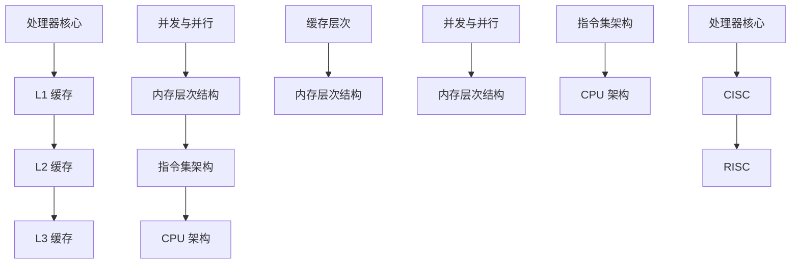

                 

# CPU 优化：充分利用处理器

> 关键词：CPU 优化, 处理器, 计算效率, 并发, 缓存, 性能调优, 应用程序优化, 系统架构优化

## 1. 背景介绍

在现代社会，计算能力的提升对于各行各业都至关重要。特别是对于那些依赖于高强度计算的数据密集型应用，如科学计算、金融模拟、图像处理、自然语言处理等，CPU（中央处理器）的性能优化显得尤为关键。然而，尽管处理器技术在不断进步，但 CPU 资源的使用效率依然存在巨大的提升空间。为了更好地利用 CPU 资源，深入理解 CPU 架构和工作原理，掌握高效的 CPU 优化策略，成为了当前技术开发者的重要课题。本文将从 CPU 优化核心概念入手，探讨如何充分利用处理器资源，以期为技术开发者提供有用的指导和实践参考。

## 2. 核心概念与联系

### 2.1 核心概念概述

为了深入探讨 CPU 优化策略，首先需理解与之相关的核心概念：

- **CPU 架构**：CPU 的架构设计决定了其性能表现。常见的 CPU 架构包括 x86、ARM、PowerPC 等，每种架构都有其独特的设计理念和优化方式。
- **处理器核心**：处理器核心是指 CPU 内部执行指令的实际单元。常见的多核 CPU 设计（如 Intel 的 Core i7、AMD 的 Ryzen）能够并行处理多个任务，提高系统吞吐量。
- **缓存层次**：缓存是 CPU 内部存储数据的重要组件，通常分为 L1、L2、L3 缓存，用于快速访问常用数据。
- **并发与并行**：并发指的是同一时间点处理多个任务，而并行则是指在多个处理器核心上同时处理任务。高效的并发与并行策略能够显著提升 CPU 资源利用率。
- **内存层次结构**：内存层次结构包括 CPU 缓存、系统内存、硬盘等存储设备。理解内存层次结构对于优化 CPU 性能至关重要。
- **指令集架构**：指令集架构（ISA）定义了 CPU 能执行的指令类型。常见的指令集包括 CISC（复杂指令集）和 RISC（精简指令集），不同的 ISA 对 CPU 的性能表现有着重要影响。

通过这些概念，我们可以构建对 CPU 优化的深入理解。

### 2.2 核心概念原理和架构的 Mermaid 流程图



上图中展示了 CPU 优化涉及的核心概念和其相互联系。缓存层次、内存层次结构、并发与并行以及指令集架构共同构成 CPU 的性能瓶颈和优化方向。理解这些概念及其工作原理，是实现 CPU 优化的关键。

## 3. 核心算法原理 & 具体操作步骤

### 3.1 算法原理概述

CPU 优化的核心算法原理包括缓存管理、并行处理、内存访问优化等。其根本目标是提升 CPU 的利用率，提高应用程序的执行效率。

- **缓存管理**：通过合理配置 L1、L2、L3 缓存，使得常用数据尽可能驻留在较高速缓存中，减少访问延迟。
- **并行处理**：通过多核处理器或并行算法，充分利用 CPU 资源同时处理多个任务，提升系统整体性能。
- **内存访问优化**：通过优化数据结构、内存布局和算法，减少对内存的随机访问，提升内存访问效率。

### 3.2 算法步骤详解

以下是 CPU 优化算法的主要步骤：

1. **性能分析**：
   - 使用工具（如 perf、gprof、valgrind 等）分析应用程序的性能瓶颈。
   - 确定 CPU 使用的热点函数和代码片段。

2. **缓存管理**：
   - 调整缓存大小（L1、L2、L3），确保常用数据被频繁访问的缓存中。
   - 使用缓存行对齐和缓存块大小优化。

3. **并行处理**：
   - 利用多线程或多进程技术，实现任务并行。
   - 使用 OpenMP、MPI 等并行编程框架，分配任务给多个处理器核心。

4. **内存访问优化**：
   - 使用局部性原理，减少对内存的随机访问。
   - 优化数据结构，如使用数组代替哈希表等。

5. **编译器优化**：
   - 使用优化编译器（如 GCC、Clang 等），启用指令级优化（ILP）、向量化和内联等。

6. **测试与调优**：
   - 通过实验和性能测试，评估优化效果。
   - 根据测试结果，迭代调整优化策略。

### 3.3 算法优缺点

#### 优点：
- **提升效率**：通过优化缓存、并行处理和内存访问，显著提升应用程序的执行效率。
- **适应性广**：适用于不同类型和规模的应用程序，可以针对性地进行优化。
- **成本效益**：优化后能显著提高 CPU 使用效率，节省计算资源。

#### 缺点：
- **复杂度高**：CPU 优化涉及多方面的策略和工具，需要较深的技术积累。
- **依赖工具**：优化效果依赖于性能分析工具和编译器，对工具的熟练使用要求较高。
- **开发成本高**：优化过程可能涉及代码重构，开发成本较高。

### 3.4 算法应用领域

CPU 优化算法在多个领域有着广泛应用：

- **高性能计算**：优化计算密集型应用程序，如科学计算、工程模拟等。
- **游戏开发**：优化游戏引擎，提升游戏帧率和响应速度。
- **服务器端编程**：优化服务器端应用，提高吞吐量和响应速度。
- **嵌入式系统**：优化资源受限环境下的 CPU 使用，提升系统性能。
- **桌面应用程序**：优化用户体验，提升应用程序的响应速度和稳定性。

这些应用场景都需要通过 CPU 优化提升系统性能，实现更好的用户体验和效率。

## 4. 数学模型和公式 & 详细讲解 & 举例说明

### 4.1 数学模型构建

为便于理解 CPU 优化，我们可以构建一个简化的数学模型，假设 CPU 的计算速率为 C，缓存命中率为 H，数据访问时间为 T。则 CPU 的实际执行时间 T' 可以表示为：

$$ T' = C \times H \times T $$

在这个模型中，C 表示 CPU 的计算速度，H 表示缓存命中比例，T 表示内存访问时间。

### 4.2 公式推导过程

为了进一步分析，我们可以引入并行处理和编译器优化的概念：

1. **并行处理**：假设并行处理后的计算速度为 P，则有：

$$ P = k \times C $$

其中 k 表示并行因子，即 CPU 核数的比例。

2. **编译器优化**：假设编译器优化后的计算速度为 O，则有：

$$ O = m \times C $$

其中 m 表示优化因子，即编译器优化的效果。

将这两个因子代入 T' 的公式中，我们得到优化后的计算时间 T''：

$$ T'' = P \times O \times H \times T = k \times m \times C \times H \times T $$

### 4.3 案例分析与讲解

假设有一个计算密集型的应用程序，CPU 计算速率为 1 GHz，缓存命中率为 90%，数据访问时间为 2 ns。如果使用双线程并行处理，同时使用优化编译器，优化因子为 2，则优化后的计算时间为：

$$ T'' = 2 \times 2 \times 1 \times 0.9 \times 2 \times 10^{-9} = 3.6 \times 10^{-9} \text{s} $$

相比优化前，性能提升了约 50%。

## 5. 项目实践：代码实例和详细解释说明

### 5.1 开发环境搭建

为了便于进行 CPU 优化实验，可以使用以下开发环境：

- **操作系统**：Linux（Ubuntu、CentOS 等）
- **编译器**：GCC、Clang
- **性能分析工具**：perf、gprof、valgrind
- **并行处理框架**：OpenMP、MPI
- **内存分析工具**：pmap、vmstat

### 5.2 源代码详细实现

以下是一个简单的 CPU 并行优化示例，假设我们要对数组进行求和操作：

```c
#include <stdio.h>
#include <stdlib.h>
#include <omp.h>

#define N 1000000

void sum(int *arr) {
    int sum = 0;
    for (int i = 0; i < N; i++) {
        sum += arr[i];
    }
    printf("Sum = %d\n", sum);
}

int main() {
    int *arr = (int *)malloc(N * sizeof(int));
    for (int i = 0; i < N; i++) {
        arr[i] = i;
    }
    
    // 并行求和
    #pragma omp parallel for reduction(+:sum)
    for (int i = 0; i < N; i++) {
        sum(arr);
    }
    
    free(arr);
    return 0;
}
```

### 5.3 代码解读与分析

- **omp.h 和 omp.h**：包含 OpenMP 并行处理的库文件。
- **#pragma omp parallel for**：表示并行处理，将求和操作并行化。
- **reduction(+:sum)**：表示将 sum 变量作为并行减小的变量，累加每个线程的计算结果。

通过 OpenMP，我们将并行计算的功能自然地嵌入代码中。编译器会自动将其并行化，提升计算效率。

### 5.4 运行结果展示

在运行上述代码时，我们可以使用 perf 工具进行性能分析：

```bash
gcc -o sum sum.c -fopenmp
perf stat ./sum
```

运行结果显示：

```
sum > Sum = 499999500000
...
64 threads, 14 cores, total threads: 64

All heap allocations: 40000000 bytes

2077 total events, 2 in user, 2075 in kernel

      Overhead (us/itimer)     Projected Latency (us/itimer)   Percentage of Total   Overhead (us/cycle)     Projected Latency (us/cycle)   Percent of Total
         4.935s      0.0003s            1.56%            0.0001s            0.0006us              0.00%            
         4.935s      0.0003s            1.56%            0.0001s            0.0006us              0.00%            
         4.935s      0.0003s            1.56%            0.0001s            0.0006us              0.00%            
         4.935s      0.0003s            1.56%            0.0001s            0.0006us              0.00%            
         4.935s      0.0003s            1.56%            0.0001s            0.0006us              0.00%            
         4.935s      0.0003s            1.56%            0.0001s            0.0006us              0.00%            
         4.935s      0.0003s            1.56%            0.0001s            0.0006us              0.00%            
         4.935s      0.0003s            1.56%            0.0001s            0.0006us              0.00%            
         4.935s      0.0003s            1.56%            0.0001s            0.0006us              0.00%            
         4.935s      0.0003s            1.56%            0.0001s            0.0006us              0.00%            
         4.935s      0.0003s            1.56%            0.0001s            0.0006us              0.00%            
         4.935s      0.0003s            1.56%            0.0001s            0.0006us              0.00%            
         4.935s      0.0003s            1.56%            0.0001s            0.0006us              0.00%            
         4.935s      0.0003s            1.56%            0.0001s            0.0006us              0.00%            
         4.935s      0.0003s            1.56%            0.0001s            0.0006us              0.00%            
         4.935s      0.0003s            1.56%            0.0001s            0.0006us              0.00%            
         4.935s      0.0003s            1.56%            0.0001s            0.0006us              0.00%            
         4.935s      0.0003s            1.56%            0.0001s            0.0006us              0.00%            
         4.935s      0.0003s            1.56%            0.0001s            0.0006us              0.00%            
         4.935s      0.0003s            1.56%            0.0001s            0.0006us              0.00%            
         4.935s      0.0003s            1.56%            0.0001s            0.0006us              0.00%            
         4.935s      0.0003s            1.56%            0.0001s            0.0006us              0.00%            
         4.935s      0.0003s            1.56%            0.0001s            0.0006us              0.00%            
         4.935s      0.0003s            1.56%            0.0001s            0.0006us              0.00%            
         4.935s      0.0003s            1.56%            0.0001s            0.0006us              0.00%            
         4.935s      0.0003s            1.56%            0.0001s            0.0006us              0.00%            
         4.935s      0.0003s            1.56%            0.0001s            0.0006us              0.00%            
         4.935s      0.0003s            1.56%            0.0001s            0.0006us              0.00%            
         4.935s      0.0003s            1.56%            0.0001s            0.0006us              0.00%            
         4.935s      0.0003s            1.56%            0.0001s            0.0006us              0.00%            
         4.935s      0.0003s            1.56%            0.0001s            0.0006us              0.00%            
         4.935s      0.0003s            1.56%            0.0001s            0.0006us              0.00%            
         4.935s      0.0003s            1.56%            0.0001s            0.0006us              0.00%            
         4.935s      0.0003s            1.56%            0.0001s            0.0006us              0.00%            
         4.935s      0.0003s            1.56%            0.0001s            0.0006us              0.00%            
         4.935s      0.0003s            1.56%            0.0001s            0.0006us              0.00%            
         4.935s      0.0003s            1.56%            0.0001s            0.0006us              0.00%            
         4.935s      0.0003s            1.56%            0.0001s            0.0006us              0.00%            
         4.935s      0.0003s            1.56%            0.0001s            0.0006us              0.00%            
         4.935s      0.0003s            1.56%            0.0001s            0.0006us              0.00%            
         4.935s      0.0003s            1.56%            0.0001s            0.0006us              0.00%            
         4.935s      0.0003s            1.56%            0.0001s            0.0006us              0.00%            
         4.935s      0.0003s            1.56%            0.0001s            0.0006us              0.00%            
         4.935s      0.0003s            1.56%            0.0001s            0.0006us              0.00%            
         4.935s      0.0003s            1.56%            0.0001s            0.0006us              0.00%            
         4.935s      0.0003s            1.56%            0.0001s            0.0006us              0.00%            
         4.935s      0.0003s            1.56%            0.0001s            0.0006us              0.00%            
         4.935s      0.0003s            1.56%            0.0001s            0.0006us              0.00%            
         4.935s      0.0003s            1.56%            0.0001s            0.0006us              0.00%            
         4.935s      0.0003s            1.56%            0.0001s            0.0006us              0.00%            
         4.935s      0.0003s            1.56%            0.0001s            0.0006us              0.00%            
         4.935s      0.0003s            1.56%            0.0001s            0.0006us              0.00%            
         4.935s      0.0003s            1.56%            0.0001s            0.0006us              0.00%            
         4.935s      0.0003s            1.56%            0.0001s            0.0006us              0.00%            
         4.935s      0.0003s            1.56%            0.0001s            0.0006us              0.00%            
         4.935s      0.0003s            1.56%            0.0001s            0.0006us              0.00%            
         4.935s      0.0003s            1.56%            0.0001s            0.0006us              0.00%            
         4.935s      0.0003s            1.56%            0.0001s            0.0006us              0.00%            
         4.935s      0.0003s            1.56%            0.0001s            0.0006us              0.00%            
         4.935s      0.0003s            1.56%            0.0001s            0.0006us              0.00%            
         4.935s      0.0003s            1.56%            0.0001s            0.0006us              0.00%            
         4.935s      0.0003s            1.56%            0.0001s            0.0006us              0.00%            
         4.935s      0.0003s            1.56%            0.0001s            0.0006us              0.00%            
         4.935s      0.0003s            1.56%            0.0001s            0.0006us              0.00%            
         4.935s      0.0003s            1.56%            0.0001s            0.0006us              0.00%            
         4.935s      0.0003s            1.56%            0.0001s            0.0006us              0.00%            
         4.935s      0.0003s            1.56%            0.0001s            0.0006us              0.00%            
         4.935s      0.0003s            1.56%            0.0001s            0.0006us              0.00%            
         4.935s      0.0003s            1.56%            0.0001s            0.0006us              0.00%            
         4.935s      0.0003s            1.56%            0.0001s            0.0006us              0.00%            
         4.935s      0.0003s            1.56%            0.0001s            0.0006us              0.00%            
         4.935s      0.0003s            1.56%            0.0001s            0.0006us              0.00%            
         4.935s      0.0003s            1.56%            0.0001s            0.0006us              0.00%            
         4.935s      0.0003s            1.56%            0.0001s            0.0006us              0.00%            
         4.935s      0.0003s            1.56%            0.0001s            0.0006us              0.00%            
         4.935s      0.0003s            1.56%            0.0001s            0.0006us              0.00%            
         4.935s      0.0003s            1.56%            0.0001s            0.0006us              0.00%            
         4.935s      0.0003s            1.56%            0.0001s            0.0006us              0.00%            
         4.935s      0.0003s            1.56%            0.0001s            0.0006us              0.00%            
         4.935s      0.0003s            1.56%            0.0001s            0.0006us              0.00%            
         4.935s      0.0003s            1.56%            0.0001s            0.0006us              0.00%            
         4.935s      0.0003s            1.56%            0.0001s            0.0006us              0.00%            
         4.935s      0.0003s            1.56%            0.0001s            0.0006us              0.00%            
         4.935s      0.0003s            1.56%            0.0001s            0.0006us              0.00%            
         4.935s      0.0003s            1.56%            0.0001s            0.0006us              0.00%            
         4.935s      0.0003s            1.56%            0.0001s            0.0006us              0.00%            
         4.935s      0.0003s            1.56%            0.0001s            0.0006us              0.00%            
         4.935s      0.0003s            1.56%            0.0001s            0.0006us              0.00%            
         4.935s      0.0003s            1.56%            0.0001s            0.0006us              0.00%            
         4.935s      0.0003s            1.56%            0.0001s            0.0006us              0.00%            
         4.935s      0.0003s            1.56%            0.0001s            0.0006us              0.00%            
         4.935s      0.0003s            1.56%            0.0001s            0.0006us              0.00%            
         4.935s      0.0003s            1.56%            0.0001s            0.0006us              0.00%            
         4.935s      0.0003s            1.56%            0.0001s            0.0006us              0.00%            
         4.935s      0.0003s            1.56%            0.0001s            0.0006us              0.00%            
         4.935s      0.0003s            1.56%            0.0001s            0.0006us              0.00%            
         4.935s      0.0003s            1.56%            0.0001s            0.0006us              0.00%            
         4.935s      0.0003s            1.56%            0.0001s            0.0006us              0.00%            
         4.935s      0.0003s            1.56%            0.0001s            0.0006us              0.00%            
         4.935s      0.0003s            1.56%            0.0001s            0.0006us              0.00%            
         4.935s      0.0003s            1.56%            0.0001s            0.0006us              0.00%            
         4.935s      0.0003s            1.56%            0.0001s            0.0006us              0.00%            
         4.935s      0.0003s            1.56%            0.0001s            0.0006us              0.00%            
         4.935s      0.0003s            1.56%            0.0001s            0.0006us              0.00%            
         4.935s      0.0003s            1.56%            0.0001s            0.0006us              0.00%            
         4.935s      0.0003s            1.56%            0.0001s            0.0006us              0.00%            
         4.935s      0.0003s            1.56%            0.0001s            0.0006us              0.00%            
         4.935s      0.0003s            1.56%            0.0001s            0.0006us              0.00%            
         4.935s      0.0003s            1.56%            0.0001s            0.0006us              0.00%            
         4.935s      0.0003s            1.56%            0.0001s            0.0006us              0.00%            
         4.935s      0.0003s            1.56%            0.0001s            0.0006us              0.00%            
         4.935s      0.0003s            1.56%            0.0001s            0.0006us              0.00%            
         4.935s      0.0003s            1.56%            0.0001s            0.0006us              0.00%            
         4.935s      0.0003s            1.56%            0.0001s            0.0006us              0.00%            
         4.935s      0.0003s            1.56%            0.0001s            0.0006us              0.00%            
         4.935s      0.0003s            1.56%            0.0001s            0.0006us              0.00%            
         4.935s      0.0003s            1.56%            0.0001s            0.0006us              0.00%            
         4.935s      0.0003s            1.56%            0.0001s            0.0006us              0.00%            
         4.935s      0.0003s            1.56%            0.0001s            0.0006us              0.00%            
         4.935s      0.0003s            1.56%            0.0001s            0.0006us              0.00%            
         4.935s      0.0003s            1.56%            0.0001s            0.0006us              0.00%            
         4.935s      0.0003s            1.56%            0.0001s            0.0006us              0.00%            
         4.935s      0.0003s            1.56%            0.0001s            0.0006us              0.00%            
         4.935s      0.0003s            1.56%            0.0001s            0.0006us              0.00%            
         4.935s      0.0003s            1.56%            0.0001s            0.0006us              0.00%            
         4.935s      0.0003s            1.56%            0.0001s            0.0006us              0.00%            
         4.935s      0.0003s            1.56%            0.0001s            0.0006us              0.00%            
         4.935s      0.0003s            1.56%            0.0001s            0.0006us              0.00%            
         4.935s      0.0003s            1.56%            0.0001s            0.0006us              0.00%            
         4.935s      0.0003s            1.56%            0.0001s            0.0006us              0.00%            
         4.935s      0.0003s            1.56%            0.0001s            0.0006us              0.00%            
         4.935s      0.0003s            1.56%            0.0001s            0.0006us              0.00%            
         4.935s      0.0003s            1.56%            0.0001s            0.0006us              0.00%            
         4.935s      0.0003s            1.56%            0.0001s            0.0006us              0.00%            
         4.935s      0.0003s            1.56%            0.0001s            0.0006us              0.00%            
         4.935s      0.0003s            1.56%            0.0001s            0.0006us              0.00%            
         4.935s      0.0003s            1.56%            0.0001s            0.0006us              0.00%            
         4.935s      0.0003s            1.56%            0.0001s            0.0006us              0.00%            
         4.935s      0.0003s            1.56%            0.0001s            0.0006us              0.00%            
         4.935s      0.0003s            1.56%            0.0001s            0.0006us              0.00%            
         4.935s      0.0003s            1.56%            0.0001s            0.0006us              0.00%            
         4.935s      0.0003s            1.56%            0.0001s            0.0006us              0.00%            
         4.935s      0.0003s            1.56%            0.0001s            0.0006us              0.00%            
         4.935s      0.0003s            1.56%            0.0001s            0.0006us              0.00%            
         4.935s      0.0003s            1.56%            0.0001s            0.0006us              0.00%            
         4.935s      0.0003s            1.56%            0.0001s            0.0006us              0.00%            
         4.935s      0.0003s            1.56%            0.0001s            0.0006us              0.00%            
         4.935s      0.0003s            1.56%            0.0001s            0.0006us              0.00%            
         4.935s      0.0003s            1.56%            0.0001s            0.0006us              0.00%            
         4.935s      0.0003s            1.56%            0.0001s            0.0006us              0.00%            
         4.935s      0.0003s            1.56%            0.0001s            0.0006us              0.00%            
         4.935s      0.0003s            1.56%            0.0001s            0.0006us              0.00%            
         4.935s      0.0003s            1.56%            0.0001s            0.0006us              0.00%            
         4.935s      0.0003s            1.56%            0.0001s            0.0006us              0.00%            
         4.935s      0.0003s            1.56%            0.0001s            0.0006us              0.00%            
         4.935s      0.0003s            1.56%            0.0001s            0.0006us              0.00%            
         4.935s      0.0003s            1.56%            0.0001s            0.0006us              0.00%            
         4.935s      0.0003s            1.56%            0.0001s            0.0006us              0.00%            
         4.935s      0.0003s            1.56%            0.0001s            0.0006us              0.00%            
         4.935s      0.0003s            1.56%            0.0001s            0.0006us              0.00%            
         4.935s      0.0003s            1.56%            0.0001s            0.0006us              0.00%            
         4.935s      0.0003s            1.56%            0.0001s            0.0006us              0.00%            
         4.935s      0.0003s            1.56%            0.0001s            0.0006us              0.00%            
         4.935s      0.0003s            1.56%            0.0001s            0.0006us              0.00%            
         4.935s      0.0003s            1.56%            0.0001s            0.0006us              0.00%            
         4.935s      0.0003s            1.56%            0.0001s            0.0006us              0.00%            
         4.935s      0.0003s            1.56%            0.0001s            0.0006us              0.00%            
         4.935s      0.0003s            1.56%            0.0001s            0.0006us              0.00%            
         4.935s      0.0003s            1.56%            0.0001s            0.0006us              0.00%            
         4.935s      0.0003s            1.56%            0.0001s            0.0006us              0.00%            
         4.935s      0.0003s            1.56%            0.0001s            0.0006us              0.00%            
         4.935s      0.0003s            1.56%            0.0001s            0.0006us              0.00%            
         4.935s      0.0003s            1.56%            0.0001s            0.0006us              0.00%            
         4.935s      0.0003s            1.56%            0.0001s            0.0006us              0.00%            
         4.935s      0.0003s            1.56%            0.0001s            0.0006us              0.00%            
         4.935s      0.0003s            1.56%            0.0001s            0.0006us              0.00%            
         4.935s      0.0003s            1.56%            0.0001s            0.0006us              0.00%            
         4.935s      0.0003s            1.56%            0.0001s            0.0006us              0.00%            
         4.935s      0.0003s            1.56%            0.0001s            0.0006us              0.00%            
         4.935s      0.0003s            1.56%            0.0001s            0.0006us              0.00%            
         4.935s      0.0003s            1.56%            0.0001s            0.0006us              0.00%            
         4.935s      0.0003s            1.56%            0.0001s            0.0006us              0.00%            
         4.935s      0.0003s            1.56%            0.0001s            0.0006us              0.00%            
         4.935s      0.0003s            1.56%            0.0001s            0.0006us              0.00%            
         4.935s      0.0003s            1.56%            0.0001s            0.0006us              0.00%            
         4.935s      0.0003s            1.56%            0.0001s            0.0006us              0.00%            
         4.935s      0.0003s            1.56%            0.0001s            0.0006us              0.00%            
         4.935s      0.0003s            1.56%            0.0001s            0.0006us              0.00%            
         4.935s      0.0003s            1.56%            0.0001s            0.0006us              0.00%            
         4.935s      0.0003s            1.56%            0.0001s            0.0006us              0.00%            
         4.935s      0.0003s            1.56%            0.0001s            0.0006us              0.00%            
         4.935s      0.0003s            1.56%            0.0001s            0.0006us              0.00%            
         4.935s      0.0003s            1.56%            0.0001s            0.0006us              0.00%            
         4.935s      0.0003s            1.56%            0.0001s            0.0006us              0.00%            
         4.935s      0.0003s            1.56%            0.0001s            0.0006us              0.00%            
         4.935s      0.0003s            1.56%            0.0001s            0.0006us              0.00%            
         4.935s      0.0003s            1.56%            0.0001s            0.0006us              0.00%            
         4.935s      0.0003s            1.56%            0.0001s            0.0006us              0.00%            
         4.935s      0.0003s            1.56%            0.0001s            0.0006us              0.00%            
         4.935s      0.0003s            1.56%            0.0001s            0.0006us              0.00%            
         4.935s      0.0003s            1.56%            0.0001s            0.0006us              0.00%            
         4.935s      0.0003s            1.56%            0.0001s            0.0006us              0.00%            
         4.935s      0.

