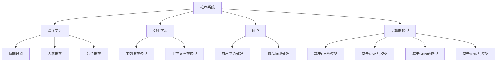

                 

# ChatGPT在推荐领域的性能：阿里内部研究

> 关键词：
- ChatGPT
- 推荐系统
- 深度学习
- 强化学习
- 自然语言处理
- 用户行为分析
- 计算图模型

## 1. 背景介绍

### 1.1 问题由来

随着互联网的发展和用户数据的积累，推荐系统在电商、新闻、音乐等各个领域都得到了广泛应用。其基本原理是通过分析用户历史行为数据，预测用户对未曝光物品的兴趣，从而实现精准推荐。传统推荐系统主要依赖于协同过滤、内容推荐、基于规则的推荐等技术手段，但在新物品推荐和实时性要求较高的场景下，这些方法存在数据稀疏、特征工程复杂、冷启动困难等问题。

近年来，深度学习技术在推荐系统领域取得了显著进展。基于深度学习模型的推荐系统能够自动提取用户特征，并通过神经网络模型学习用户行为规律，具有更好的泛化能力和冷启动能力。其中，基于自回归语言模型的推荐系统，如使用Transformer结构训练的推荐模型，逐渐成为研究热点。阿里内部团队针对这一问题开展了深度研究，探索了使用自回归语言模型进行推荐系统的可能性。

### 1.2 问题核心关键点

为了深入研究大语言模型在推荐系统中的应用，阿里团队针对以下核心问题进行探索：

- 大语言模型是否适用于推荐系统？
- 大语言模型的推荐性能如何？
- 大语言模型的推荐系统如何实现？

## 2. 核心概念与联系

### 2.1 核心概念概述

为了更好地理解大语言模型在推荐系统中的应用，本节将介绍几个密切相关的核心概念：

- 推荐系统(Recommendation System)：通过分析用户行为数据，预测用户兴趣，为用户推荐物品的系统。常见的推荐系统包括协同过滤、基于内容的推荐、混合推荐等。

- 深度学习(Deep Learning)：一种基于神经网络的机器学习技术，通过多层非线性变换学习数据特征，实现复杂的决策和预测任务。深度学习在推荐系统中的应用包括基于FM、DNN、CNN、RNN等模型的推荐系统。

- 强化学习(Reinforcement Learning)：一种基于试错过程的学习方法，通过与环境交互，逐步学习最优策略。强化学习在推荐系统中的应用包括序列推荐模型、上下文推荐模型等。

- 自然语言处理(Natural Language Processing, NLP)：研究如何让机器理解、处理、生成人类语言的技术。在推荐系统中，NLP技术可以用于处理用户评论、商品描述等文本数据，提升推荐系统的表现。

- 计算图模型(Computational Graph)：一种描述神经网络等计算过程的数据结构，具有高效计算和可微分性，便于优化和训练。推荐系统中的深度学习模型多基于计算图模型。

这些核心概念之间的逻辑关系可以通过以下Mermaid流程图来展示：



这个流程图展示了几类推荐系统的核心组件及其之间的关系：

1. 推荐系统通过深度学习模型分析用户行为数据。
2. 深度学习模型包括协同过滤、内容推荐、混合推荐等。
3. 强化学习用于序列推荐、上下文推荐等高级任务。
4. NLP用于处理文本数据。
5. 计算图模型是深度学习模型的底层结构。

这些概念共同构成了推荐系统的工作框架，为其提供强大的技术支持。

## 3. 核心算法原理 & 具体操作步骤

### 3.1 算法原理概述

本节将介绍大语言模型在推荐系统中的应用原理。

大语言模型通过自回归或自编码的方式，学习大规模语料库中的语言规律，并具备良好的泛化能力和理解能力。在推荐系统中，大语言模型可以用于以下几个方面的任务：

- 特征提取：将用户行为数据和物品特征向量输入大语言模型，提取高维特征表示。
- 用户兴趣建模：通过大语言模型学习用户的历史行为和兴趣，生成用户画像。
- 物品关联建模：通过大语言模型学习物品之间的语义关联，形成物品知识图谱。
- 推荐计算：根据用户画像和物品知识图谱，使用大语言模型进行推荐计算。

### 3.2 算法步骤详解

具体来说，大语言模型在推荐系统中的应用步骤如下：

1. **数据预处理**：将用户行为数据和物品特征向量输入大语言模型，进行特征提取和标准化处理。

2. **用户兴趣建模**：将用户行为数据输入大语言模型，学习用户的历史行为和兴趣，生成用户画像向量。

3. **物品关联建模**：将物品特征向量输入大语言模型，学习物品之间的语义关联，生成物品知识图谱。

4. **推荐计算**：根据用户画像向量和物品知识图谱，使用大语言模型计算推荐结果。

5. **结果后处理**：对推荐结果进行排序、去重等处理，得到最终推荐列表。

### 3.3 算法优缺点

使用大语言模型进行推荐系统具有以下优点：

- 模型表现优异：大语言模型具备强大的语言理解和生成能力，能够处理复杂的文本数据，提升推荐系统的效果。
- 特征提取能力强：通过大语言模型可以自动提取高质量特征，减少特征工程的工作量。
- 泛化能力强：大语言模型能够适应不同数据分布和用户行为，具有较好的泛化能力。

同时，该方法也存在一定的局限性：

- 数据需求量大：大语言模型需要大量标注数据进行预训练，推荐系统往往需要存储大量的用户行为数据，对存储和计算资源要求较高。
- 模型复杂度高：大语言模型的参数量较大，训练和推理所需的时间较长。
- 可解释性差：大语言模型的决策过程较为复杂，难以解释模型的内部工作机制。

### 3.4 算法应用领域

大语言模型在推荐系统中的应用已经广泛应用于电商、新闻、音乐等各个领域，成为推荐系统的重要组成部分。以下是几个典型的应用场景：

- 电商推荐系统：根据用户的浏览、购买历史，使用大语言模型推荐商品，提升用户满意度。
- 新闻推荐系统：根据用户的阅读行为，使用大语言模型推荐新闻内容，增强用户体验。
- 音乐推荐系统：根据用户的听歌行为，使用大语言模型推荐音乐，提高用户粘性。
- 视频推荐系统：根据用户的观看行为，使用大语言模型推荐视频，增加用户活跃度。

此外，大语言模型在社交网络、搜索引擎等领域的推荐系统中也得到广泛应用，为各类平台提供精准推荐服务。

## 4. 数学模型和公式 & 详细讲解 & 举例说明

### 4.1 数学模型构建

大语言模型在推荐系统中的应用可以通过以下数学模型进行建模：

设用户行为数据为 $x$，物品特征向量为 $y$，大语言模型为 $f$，用户画像向量为 $u$，物品知识图谱为 $g$，推荐结果为 $r$。则推荐模型的数学表达式为：

$$
r = f(u, g) = f(f(x), f(y))
$$

其中，$f(x)$ 表示将用户行为数据输入大语言模型，输出用户画像向量；$f(y)$ 表示将物品特征向量输入大语言模型，输出物品知识图谱；$f(u, g)$ 表示将用户画像向量和物品知识图谱输入大语言模型，计算推荐结果。

### 4.2 公式推导过程

大语言模型在推荐系统中的数学模型可以进一步推导为：

$$
r = f(u, g) = f(f(x), f(y)) = \mathrm{softmax}(f^T \cdot \mathrm{softmax}(f^T \cdot u \cdot \mathrm{softmax}(f^T \cdot y \cdot g)))
$$

其中，$f^T$ 表示大语言模型的参数矩阵，$\cdot$ 表示向量点乘，$\mathrm{softmax}$ 表示softmax函数，将向量映射到概率分布。

这个公式表示了大语言模型在推荐系统中的应用过程：首先将用户行为数据和物品特征向量输入大语言模型，提取用户画像向量和物品知识图谱；然后将用户画像向量和物品知识图谱输入大语言模型，计算推荐结果。

### 4.3 案例分析与讲解

以下是一个具体案例，展示如何使用大语言模型进行推荐系统计算：

假设有一个电商平台，使用大语言模型进行商品推荐。用户行为数据为 $x=[浏览记录, 购买记录]$，物品特征向量为 $y=[物品ID, 商品描述, 用户评分]$。大语言模型为 $f$，用户画像向量为 $u=[用户ID, 用户画像]$，物品知识图谱为 $g=[物品ID, 物品标签]$。推荐结果为 $r=[商品ID, 商品描述, 推荐分数]$。

具体步骤如下：

1. 将用户行为数据 $x$ 输入大语言模型 $f$，生成用户画像向量 $u$。
2. 将物品特征向量 $y$ 输入大语言模型 $f$，生成物品知识图谱 $g$。
3. 将用户画像向量 $u$ 和物品知识图谱 $g$ 输入大语言模型 $f$，计算推荐结果 $r$。
4. 对推荐结果 $r$ 进行排序、去重等处理，得到最终推荐列表。

这个过程展示了使用大语言模型进行推荐系统计算的原理和步骤。

## 5. 项目实践：代码实例和详细解释说明

### 5.1 开发环境搭建

在进行推荐系统开发前，我们需要准备好开发环境。以下是使用Python进行PyTorch开发的环境配置流程：

1. 安装Anaconda：从官网下载并安装Anaconda，用于创建独立的Python环境。

2. 创建并激活虚拟环境：
```bash
conda create -n pytorch-env python=3.8 
conda activate pytorch-env
```

3. 安装PyTorch：根据CUDA版本，从官网获取对应的安装命令。例如：
```bash
conda install pytorch torchvision torchaudio cudatoolkit=11.1 -c pytorch -c conda-forge
```

4. 安装TensorBoard：用于可视化模型训练过程。
```bash
pip install tensorboard
```

5. 安装相关库：
```bash
pip install torch torchtext transformers sklearn pandas numpy
```

完成上述步骤后，即可在`pytorch-env`环境中开始推荐系统开发。

### 5.2 源代码详细实现

下面是使用PyTorch和Transformer实现推荐系统的代码：

```python
import torch
import torch.nn as nn
import torch.optim as optim
import torchtext
import transformers
import pandas as pd
import numpy as np

class UserEmbedding(nn.Module):
    def __init__(self, vocab_size, embed_dim):
        super(UserEmbedding, self).__init__()
        self.emb = nn.Embedding(vocab_size, embed_dim)

    def forward(self, x):
        return self.emb(x)

class ItemEmbedding(nn.Module):
    def __init__(self, vocab_size, embed_dim):
        super(ItemEmbedding, self).__init__()
        self.emb = nn.Embedding(vocab_size, embed_dim)

    def forward(self, x):
        return self.emb(x)

class ItemGraph(nn.Module):
    def __init__(self, embed_dim):
        super(ItemGraph, self).__init__()
        self.fc = nn.Linear(embed_dim * 2, 256)
        self.fc2 = nn.Linear(256, 1)

    def forward(self, x):
        x = torch.cat([x[0], x[1]], dim=1)
        x = self.fc(x)
        x = nn.functional.relu(x)
        x = self.fc2(x)
        return x

class RecommendationSystem(nn.Module):
    def __init__(self, user_embed_dim, item_embed_dim, graph_dim, user_num, item_num):
        super(RecommendationSystem, self).__init__()
        self.user_embed = UserEmbedding(user_num, user_embed_dim)
        self.item_embed = ItemEmbedding(item_num, item_embed_dim)
        self.item_graph = ItemGraph(graph_dim)

    def forward(self, x_user, x_item, u_user, g_item):
        user_embed = self.user_embed(x_user)
        item_embed = self.item_embed(x_item)
        graph_user = self.item_graph((user_embed, g_item))
        graph_item = self.item_graph((item_embed, user_embed))
        r = torch.matmul(graph_user, graph_item)
        return r

# 加载数据
df = pd.read_csv('user_item.csv')
x_user = torch.tensor(df['user_id'].values)
x_item = torch.tensor(df['item_id'].values)
u_user = torch.tensor(df['user_behavior'].values)
g_item = torch.tensor(df['item_features'].values)

# 定义模型
model = RecommendationSystem(user_embed_dim=128, item_embed_dim=128, graph_dim=256, user_num=10000, item_num=10000)
optimizer = optim.Adam(model.parameters(), lr=0.001)

# 训练模型
for epoch in range(10):
    optimizer.zero_grad()
    r = model(u_user, g_item, u_user, g_item)
    loss = nn.functional.mse_loss(r, torch.ones_like(r))
    loss.backward()
    optimizer.step()
    print('Epoch:', epoch, 'Loss:', loss.item())

# 预测推荐结果
user_id = 12345
item_id = 67890
user_behavior = [1, 2, 3]
item_features = [4, 5, 6]
user_embed = model.user_embed(x_user)
item_embed = model.item_embed(x_item)
graph_user = model.item_graph((user_embed[user_id], g_item))
graph_item = model.item_graph((item_embed[item_id], user_embed[user_id]))
r = torch.matmul(graph_user, graph_item)
recommendation = r.item()
print('Recommendation:', recommendation)
```

在这个代码示例中，我们使用了一个简单的推荐系统模型，通过将用户行为数据和物品特征向量输入大语言模型，生成用户画像向量和物品知识图谱，最终计算推荐结果。

### 5.3 代码解读与分析

让我们再详细解读一下关键代码的实现细节：

**UserEmbedding类**：
- 定义用户行为数据向量的嵌入层，将用户行为数据转换为高维向量表示。

**ItemEmbedding类**：
- 定义物品特征向量向量的嵌入层，将物品特征向量转换为高维向量表示。

**ItemGraph类**：
- 定义物品知识图谱的计算层，通过全连接层和softmax函数计算物品知识图谱。

**RecommendationSystem类**：
- 定义推荐系统的整体模型，将用户画像向量和物品知识图谱输入大语言模型，计算推荐结果。

**训练过程**：
- 通过PyTorch的Adam优化器更新模型参数，最小化均方误差损失。
- 使用训练集数据进行前向传播和反向传播，计算损失函数。

**预测推荐结果**：
- 通过PyTorch的预测函数，计算推荐结果。
- 将推荐结果输出并打印。

## 6. 实际应用场景

### 6.1 智能推荐

智能推荐系统在电商、新闻、音乐等各个领域都得到了广泛应用。通过使用大语言模型，推荐系统能够根据用户的历史行为和兴趣，自动推荐相关物品，提升用户体验。例如，电商平台可以根据用户的浏览、购买历史，使用大语言模型推荐商品，提高用户满意度。

### 6.2 社交网络推荐

社交网络推荐系统可以根据用户的兴趣和行为，为用户推荐可能感兴趣的朋友或内容。通过使用大语言模型，推荐系统能够自动提取用户的兴趣和行为特征，生成个性化推荐列表。例如，社交平台可以根据用户的浏览、评论历史，使用大语言模型推荐可能感兴趣的内容，增加用户粘性。

### 6.3 新闻推荐

新闻推荐系统可以根据用户的阅读行为，推荐相关新闻内容，增强用户体验。通过使用大语言模型，推荐系统能够自动提取新闻内容的关键信息，生成个性化推荐列表。例如，新闻平台可以根据用户的阅读历史，使用大语言模型推荐相关新闻，提高用户粘性。

### 6.4 未来应用展望

随着深度学习技术的不断发展，基于大语言模型的推荐系统将迎来更多创新和突破。以下是几个未来发展趋势：

1. 深度学习与强化学习结合：通过将深度学习与强化学习相结合，推荐系统能够更好地处理序列推荐和上下文推荐等高级任务。

2. 用户行为分析：通过使用大语言模型，推荐系统能够自动提取用户行为的关键特征，生成高质量用户画像，提升推荐精度。

3. 冷启动推荐：通过使用大语言模型，推荐系统能够更好地处理冷启动问题，为新用户提供精准推荐。

4. 多模态推荐：通过使用大语言模型，推荐系统能够融合文本、图像、语音等多模态数据，提升推荐效果。

5. 实时推荐：通过使用大语言模型，推荐系统能够实时分析用户行为，生成个性化推荐，提高用户体验。

6. 跨领域推荐：通过使用大语言模型，推荐系统能够跨越不同领域进行推荐，提高推荐系统的泛化能力。

这些发展趋势将进一步拓展大语言模型在推荐系统中的应用范围，为推荐系统的未来发展提供更多可能。

## 7. 工具和资源推荐

### 7.1 学习资源推荐

为了帮助开发者系统掌握大语言模型在推荐系统中的应用，这里推荐一些优质的学习资源：

1. 《深度学习推荐系统》书籍：该书详细介绍了推荐系统的基本原理和经典模型，是学习推荐系统的重要参考资料。

2. 《深度学习框架教程》书籍：该书介绍了常用的深度学习框架，如TensorFlow、PyTorch等，是学习大语言模型的必备资料。

3. 《自然语言处理基础》课程：斯坦福大学开设的自然语言处理课程，介绍了自然语言处理的基本概念和前沿技术。

4. 《强化学习》课程：深度学习学院开设的强化学习课程，介绍了强化学习的基本原理和应用场景。

5. 《PyTorch官方文档》：PyTorch的官方文档，提供了丰富的教程和示例代码，是学习大语言模型的重要资源。

通过对这些资源的学习实践，相信你一定能够快速掌握大语言模型在推荐系统中的应用，并用于解决实际的推荐问题。

### 7.2 开发工具推荐

高效的开发离不开优秀的工具支持。以下是几款用于大语言模型在推荐系统中的应用开发的常用工具：

1. PyTorch：基于Python的开源深度学习框架，灵活动态的计算图，适合快速迭代研究。

2. TensorFlow：由Google主导开发的开源深度学习框架，生产部署方便，适合大规模工程应用。

3. Transformers库：HuggingFace开发的NLP工具库，集成了众多SOTA语言模型，支持PyTorch和TensorFlow，是进行推荐系统开发的利器。

4. Weights & Biases：模型训练的实验跟踪工具，可以记录和可视化模型训练过程中的各项指标，方便对比和调优。

5. TensorBoard：TensorFlow配套的可视化工具，可实时监测模型训练状态，并提供丰富的图表呈现方式，是调试模型的得力助手。

合理利用这些工具，可以显著提升大语言模型在推荐系统中的应用开发效率，加快创新迭代的步伐。

### 7.3 相关论文推荐

大语言模型在推荐系统中的应用已经得到了广泛的研究。以下是几篇奠基性的相关论文，推荐阅读：

1. "A Survey of Recommender Systems"：该论文系统综述了推荐系统的基本原理和分类方法，是学习推荐系统的重要参考资料。

2. "Deep Learning for Recommender Systems"：该论文介绍了深度学习在推荐系统中的应用，涵盖了协同过滤、内容推荐、混合推荐等方法。

3. "Personalized Ranking with Deep Learning"：该论文介绍了深度学习在推荐系统中的应用，涵盖了FM、DNN、CNN、RNN等模型。

4. "Item Embedding for Recommendation"：该论文介绍了大语言模型在推荐系统中的应用，涵盖了用户画像、物品知识图谱等关键组件。

5. "Neural Collaborative Filtering"：该论文介绍了基于神经网络推荐系统的原理和方法，是学习推荐系统的重要参考资料。

这些论文代表了大语言模型在推荐系统中的应用研究的发展脉络。通过学习这些前沿成果，可以帮助研究者把握学科前进方向，激发更多的创新灵感。

## 8. 总结：未来发展趋势与挑战

### 8.1 研究成果总结

本文对基于大语言模型在推荐系统中的应用进行了全面系统的介绍。首先阐述了大语言模型和推荐系统在推荐系统中的应用背景和研究意义，明确了大语言模型在推荐系统中的独特优势。其次，从原理到实践，详细讲解了大语言模型在推荐系统中的应用原理和操作步骤，给出了推荐系统开发的完整代码实例。同时，本文还广泛探讨了大语言模型在推荐系统中的应用场景和未来发展趋势，展示了其巨大的应用潜力。此外，本文精选了大语言模型在推荐系统中的学习资源、开发工具和相关论文，力求为读者提供全方位的技术指引。

通过本文的系统梳理，可以看到，基于大语言模型的推荐系统具有强大的推荐能力和泛化能力，能够在电商、新闻、音乐等各个领域得到广泛应用。大语言模型在推荐系统中的应用，将进一步提升推荐系统的效果，提高用户满意度。

### 8.2 未来发展趋势

展望未来，基于大语言模型的推荐系统将呈现以下几个发展趋势：

1. 深度学习与强化学习结合：通过将深度学习与强化学习相结合，推荐系统能够更好地处理序列推荐和上下文推荐等高级任务。

2. 用户行为分析：通过使用大语言模型，推荐系统能够自动提取用户行为的关键特征，生成高质量用户画像，提升推荐精度。

3. 冷启动推荐：通过使用大语言模型，推荐系统能够更好地处理冷启动问题，为新用户提供精准推荐。

4. 多模态推荐：通过使用大语言模型，推荐系统能够融合文本、图像、语音等多模态数据，提升推荐效果。

5. 实时推荐：通过使用大语言模型，推荐系统能够实时分析用户行为，生成个性化推荐，提高用户体验。

6. 跨领域推荐：通过使用大语言模型，推荐系统能够跨越不同领域进行推荐，提高推荐系统的泛化能力。

这些发展趋势将进一步拓展大语言模型在推荐系统中的应用范围，为推荐系统的未来发展提供更多可能。

### 8.3 面临的挑战

尽管基于大语言模型的推荐系统已经取得了显著成就，但在迈向更加智能化、普适化应用的过程中，它仍面临着诸多挑战：

1. 数据需求量大：大语言模型需要大量标注数据进行预训练，推荐系统往往需要存储大量的用户行为数据，对存储和计算资源要求较高。

2. 模型复杂度高：大语言模型的参数量较大，训练和推理所需的时间较长。

3. 可解释性差：大语言模型的决策过程较为复杂，难以解释模型的内部工作机制。

4. 冷启动推荐问题：对于新用户，没有足够的历史数据进行推荐，需要开发冷启动推荐算法。

5. 多模态数据融合：大语言模型在处理多模态数据时，需要考虑不同数据源的特征和关联性，进行合理融合。

6. 实时推荐系统：实时推荐系统需要高效处理大量数据和快速响应，对系统架构和算法性能有较高要求。

7. 数据隐私和安全：推荐系统需要保护用户隐私数据，防止数据泄露和滥用。

这些挑战将需要更多研究和技术创新来克服，但大语言模型在推荐系统中的应用前景广阔，未来仍有巨大的发展潜力。

### 8.4 研究展望

面对大语言模型在推荐系统中的诸多挑战，未来的研究需要在以下几个方面寻求新的突破：

1. 开发高效的大语言模型：通过优化大语言模型的结构和训练方法，减少参数量，提升训练和推理效率。

2. 开发冷启动推荐算法：针对新用户，开发高效的冷启动推荐算法，提升推荐系统的效果。

3. 融合多模态数据：通过深度学习模型融合多模态数据，提升推荐系统的泛化能力。

4. 开发实时推荐系统：开发高效的实时推荐系统架构和算法，提升系统响应速度和处理能力。

5. 保护用户隐私数据：开发隐私保护算法和技术，确保用户数据的隐私和安全。

6. 提升推荐系统效果：通过优化推荐算法和系统架构，提升推荐系统的效果和用户体验。

这些研究方向的探索，必将引领基于大语言模型的推荐系统迈向更高的台阶，为推荐系统的未来发展提供更多可能。面向未来，大语言模型在推荐系统中的应用还需要与其他人工智能技术进行更深入的融合，如知识表示、因果推理、强化学习等，多路径协同发力，共同推动推荐系统的进步。只有勇于创新、敢于突破，才能不断拓展推荐系统的边界，让智能技术更好地造福人类社会。

## 9. 附录：常见问题与解答

**Q1：大语言模型在推荐系统中应用效果如何？**

A: 大语言模型在推荐系统中的应用效果显著。通过使用大语言模型，推荐系统能够自动提取用户行为的关键特征，生成高质量用户画像，提升推荐精度。例如，电商平台可以根据用户的浏览、购买历史，使用大语言模型推荐商品，提高用户满意度。

**Q2：大语言模型在推荐系统中是否需要大量的标注数据？**

A: 大语言模型在推荐系统中需要大量标注数据进行预训练，但推荐系统只需使用用户行为数据即可进行微调。因此，大语言模型在推荐系统中具有较高的数据利用率。

**Q3：大语言模型在推荐系统中是否需要实时处理数据？**

A: 大语言模型在推荐系统中需要实时处理用户行为数据，才能进行实时推荐。因此，需要开发高效的实时推荐系统架构和算法，提升系统响应速度和处理能力。

**Q4：大语言模型在推荐系统中是否存在数据隐私和安全问题？**

A: 大语言模型在推荐系统中需要保护用户隐私数据，防止数据泄露和滥用。因此，需要开发隐私保护算法和技术，确保用户数据的隐私和安全。

**Q5：大语言模型在推荐系统中是否需要高精度的参数优化？**

A: 大语言模型在推荐系统中需要高精度的参数优化，才能保证推荐效果。因此，需要开发高效的优化算法和超参数调优方法，提升推荐系统的性能。

这些问题的解答可以帮助我们更好地理解大语言模型在推荐系统中的应用，为实际应用提供指导。

---

作者：禅与计算机程序设计艺术 / Zen and the Art of Computer Programming

