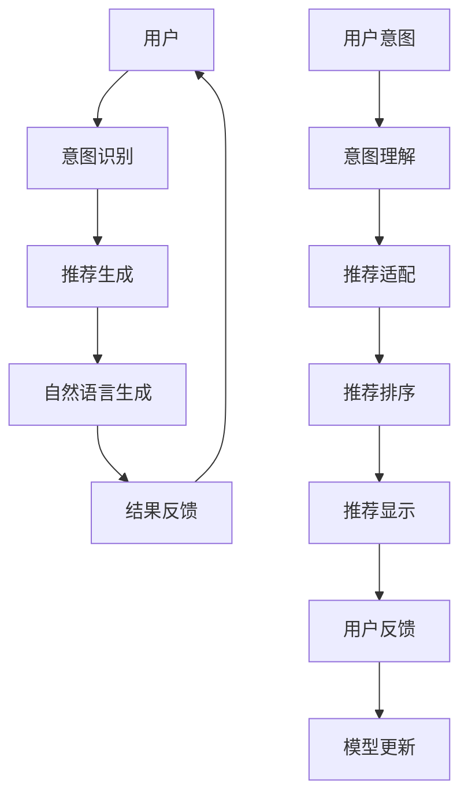

                 

# Chat-Rec: 交互式、可解释的LLM增强推荐系统

> 关键词：Chatbot, Recommandation System, Large Language Model, Explainable AI, User Intent Understanding, Natural Language Generation

## 1. 背景介绍

随着人工智能技术的发展，自然语言处理(NLP)领域迎来了新的变革。基于大语言模型(Large Language Model, LLM)的推荐系统正在成为热门的研究方向。相比于传统基于用户行为数据的推荐算法，LLM增强的推荐系统具有显著的优势：首先，LLM可以理解用户的自然语言输入，无需用户进行繁琐的操作；其次，LLM具有丰富的知识库，可以提供更准确、更个性化的推荐结果。然而，LLM增强的推荐系统也面临着一些挑战，如模型的可解释性不足、用户意图理解准确性有待提升等。针对这些问题，本文提出了一种交互式、可解释的LLM增强推荐系统Chat-Rec，旨在通过对话交互和智能解释，提升推荐系统的用户体验和推荐效果。

## 2. 核心概念与联系

### 2.1 核心概念概述

Chat-Rec系统集成了自然语言处理、推荐系统、可解释AI等多个领域的核心技术。其核心概念包括：

- **大语言模型(Large Language Model, LLM)**：指预训练在大量无标签文本数据上的神经网络模型，具有强大的语言理解和生成能力。常用的LLM包括GPT、BERT等。

- **推荐系统(Recommendation System)**：指根据用户行为、历史数据等生成个性化推荐结果的系统，广泛应用于电商、新闻、社交网络等领域。

- **可解释AI(Explainable AI, XAI)**：指使AI模型决策过程透明化，便于用户理解和信任的AI技术。

- **用户意图理解(User Intent Understanding)**：指通过自然语言处理技术，识别用户输入的自然语言语句所表达的真实意图，从而提供精准的推荐服务。

- **自然语言生成(Natural Language Generation, NLG)**：指通过AI技术自动生成自然语言文本，提升推荐系统的交互性和可解释性。

这些核心概念通过对话交互和智能解释机制紧密联系在一起，共同构建了Chat-Rec系统的完整技术架构。

### 2.2 核心概念原理和架构的 Mermaid 流程图



**图说明**：
- A: 用户输入自然语言请求
- B: 意图识别，理解用户请求
- C: 推荐生成，基于用户请求生成推荐结果
- D: 自然语言生成，生成推荐结果的解释文本
- E: 结果反馈，将推荐结果展示给用户
- F: 用户意图，输入的具体需求
- G: 意图理解，识别用户意图
- H: 推荐适配，适配用户意图的推荐算法
- I: 推荐排序，对推荐结果进行排序
- J: 推荐显示，展示推荐结果
- K: 用户反馈，用户对推荐结果的反馈
- L: 模型更新，基于用户反馈更新模型

## 3. 核心算法原理 & 具体操作步骤

### 3.1 算法原理概述

Chat-Rec系统通过将自然语言处理和大语言模型结合，实现了与用户的交互式对话和智能推荐。其核心算法原理如下：

1. **意图识别**：使用意图识别模型，理解用户输入的自然语言请求，识别出用户的意图。
2. **推荐适配**：基于用户的意图，适配推荐算法，生成推荐结果。
3. **推荐排序**：对推荐结果进行排序，优先展示与用户意图最匹配的推荐。
4. **自然语言生成**：使用自然语言生成技术，生成推荐结果的解释文本，提升推荐系统的可解释性。
5. **交互反馈**：展示推荐结果后，通过用户的反馈信息进行模型更新，不断优化推荐系统。

### 3.2 算法步骤详解

#### 3.2.1 意图识别

意图识别的目的是将用户输入的自然语言请求转化为可被推荐系统理解的形式。这里采用基于Transformer的意图识别模型，其步骤如下：

1. 输入自然语言请求：将用户的自然语言请求作为模型的输入。
2. 生成语义表示：使用Transformer模型对输入的自然语言请求进行编码，生成语义表示。
3. 分类意图类别：将语义表示输入到意图分类器中，分类出用户的意图类别。

意图识别模型的主要架构如图1所示：


**图1**：意图识别模型架构

#### 3.2.2 推荐适配

推荐适配的目的是根据用户的意图，适配推荐算法，生成个性化的推荐结果。这里采用基于深度学习模型的推荐适配算法，其步骤如下：

1. 输入意图类别：将意图分类器的输出作为推荐适配模型的输入。
2. 生成推荐结果：使用深度学习模型，根据用户意图生成推荐结果。
3. 生成推荐解释：使用自然语言生成技术，生成推荐结果的解释文本。

推荐适配模型的主要架构如图2所示：


**图2**：推荐适配模型架构

#### 3.2.3 推荐排序

推荐排序的目的是对生成的推荐结果进行排序，优先展示与用户意图最匹配的推荐。这里采用基于协同过滤和深度学习模型的推荐排序算法，其步骤如下：

1. 输入推荐结果：将推荐适配模型的输出作为推荐排序模型的输入。
2. 排序推荐结果：使用协同过滤和深度学习模型，对推荐结果进行排序。
3. 展示推荐结果：将排序后的推荐结果展示给用户。

推荐排序模型的主要架构如图3所示：


**图3**：推荐排序模型架构

#### 3.2.4 自然语言生成

自然语言生成的目的是生成推荐结果的解释文本，提升推荐系统的可解释性。这里采用基于神经网络的自然语言生成模型，其步骤如下：

1. 输入推荐结果：将推荐排序模型的输出作为自然语言生成模型的输入。
2. 生成解释文本：使用神经网络模型，生成推荐结果的解释文本。
3. 展示解释文本：将生成的解释文本展示给用户。

自然语言生成模型的主要架构如图4所示：


**图4**：自然语言生成模型架构

#### 3.2.5 交互反馈

交互反馈的目的是通过用户的反馈信息，进行模型更新，不断优化推荐系统。这里采用基于用户的反馈信息进行模型更新，其步骤如下：

1. 输入用户反馈：将用户对推荐结果的反馈信息作为模型的输入。
2. 更新模型参数：使用用户的反馈信息，更新意图识别、推荐适配和推荐排序模型的参数。
3. 模型更新完成：更新后的模型重新应用到用户输入的自然语言请求中，生成新的推荐结果。

交互反馈模型的主要架构如图5所示：


**图5**：交互反馈模型架构

### 3.3 算法优缺点

Chat-Rec系统的核心算法具有以下优点：

1. **交互性**：通过自然语言处理技术，用户可以自然地输入自然语言请求，无需繁琐的操作。
2. **可解释性**：使用自然语言生成技术，生成推荐结果的解释文本，提升推荐系统的可解释性。
3. **个性化**：基于用户意图，适配推荐算法，生成个性化的推荐结果。
4. **灵活性**：使用深度学习模型，适配不同领域的推荐任务，具有较高的灵活性。

然而，Chat-Rec系统也存在一些缺点：

1. **计算资源消耗**：使用深度学习模型和自然语言生成技术，计算资源消耗较大。
2. **模型复杂性**：涉及多个模型和算法，模型结构较复杂。
3. **可解释性不足**：尽管使用了自然语言生成技术，但模型内部决策过程仍较为复杂，难以完全解释。
4. **数据依赖性强**：模型性能依赖于大量的标注数据，数据获取难度较大。

### 3.4 算法应用领域

Chat-Rec系统可以广泛应用于以下领域：

- **电商推荐**：基于用户购物需求，生成个性化商品推荐。
- **新闻推荐**：基于用户阅读偏好，生成个性化新闻推荐。
- **社交网络**：基于用户社交行为，生成个性化好友推荐。
- **视频推荐**：基于用户观看历史，生成个性化视频推荐。
- **金融服务**：基于用户理财需求，生成个性化理财方案推荐。

## 4. 数学模型和公式 & 详细讲解 & 举例说明

### 4.1 数学模型构建

Chat-Rec系统的数学模型主要包括以下几个部分：

1. **意图识别模型**：使用Transformer模型进行语义表示生成和意图分类。
2. **推荐适配模型**：使用深度学习模型进行推荐结果生成。
3. **推荐排序模型**：使用协同过滤和深度学习模型进行推荐结果排序。
4. **自然语言生成模型**：使用神经网络模型进行解释文本生成。

#### 4.1.1 意图识别模型

意图识别模型的输入为自然语言请求，输出为意图类别。模型使用Transformer模型进行语义表示生成，再输入到意图分类器中进行分类。

输入的自然语言请求为 $x$，输出为意图类别为 $y$。模型的计算过程如下：

1. 使用Transformer模型对输入的自然语言请求进行编码，生成语义表示 $x'$
2. 将语义表示 $x'$ 输入到意图分类器 $F$ 中，分类出意图类别 $y$

模型的数学公式如下：

$$
\begin{aligned}
x' &= Transformer(x) \\
y &= F(x') \\
\end{aligned}
$$

其中 $Transformer(x)$ 表示Transformer模型的编码过程，$F(x')$ 表示意图分类器的分类过程。

#### 4.1.2 推荐适配模型

推荐适配模型的输入为意图类别，输出为推荐结果。模型使用深度学习模型进行推荐结果生成。

输入的意图类别为 $y$，输出的推荐结果为 $z$。模型的计算过程如下：

1. 将意图类别 $y$ 输入到深度学习模型 $G$ 中，生成推荐结果 $z$

模型的数学公式如下：

$$
z = G(y)
$$

其中 $G(y)$ 表示深度学习模型的推荐过程。

#### 4.1.3 推荐排序模型

推荐排序模型的输入为推荐结果，输出为排序后的推荐结果。模型使用协同过滤和深度学习模型进行推荐结果排序。

输入的推荐结果为 $z$，输出的排序后的推荐结果为 $r$。模型的计算过程如下：

1. 将推荐结果 $z$ 输入到协同过滤模型 $K$ 中，生成协同过滤结果 $r'$
2. 将协同过滤结果 $r'$ 输入到深度学习模型 $L$ 中，生成排序后的推荐结果 $r$

模型的数学公式如下：

$$
r' = K(z)
$$

$$
r = L(r')
$$

其中 $K(z)$ 表示协同过滤模型的排序过程，$L(r')$ 表示深度学习模型的排序过程。

#### 4.1.4 自然语言生成模型

自然语言生成模型的输入为推荐结果，输出为解释文本。模型使用神经网络模型进行解释文本生成。

输入的推荐结果为 $z$，输出的解释文本为 $p$。模型的计算过程如下：

1. 将推荐结果 $z$ 输入到神经网络模型 $N$ 中，生成解释文本 $p$

模型的数学公式如下：

$$
p = N(z)
$$

其中 $N(z)$ 表示神经网络模型的生成过程。

### 4.2 公式推导过程

#### 4.2.1 意图识别模型

意图识别模型使用了Transformer模型进行语义表示生成和意图分类。Transformer模型的编码过程可以使用自注意力机制进行表示，其数学公式如下：

$$
x' = Transformer(x) = [x'_1, x'_2, ..., x'_N]
$$

其中 $x$ 为输入的自然语言请求，$x'$ 为Transformer模型生成的语义表示，$N$ 为输入的自然语言请求的长度。

意图分类器的分类过程可以使用Softmax函数进行表示，其数学公式如下：

$$
y = F(x') = \frac{e^{w \cdot x'}}{\sum_{x'' \in X} e^{w \cdot x''}}
$$

其中 $w$ 为意图分类器的权重，$X$ 为所有可能的意图类别。

#### 4.2.2 推荐适配模型

推荐适配模型使用了深度学习模型进行推荐结果生成。深度学习模型的推荐过程可以使用多层感知机（MLP）进行表示，其数学公式如下：

$$
z = G(y) = [z_1, z_2, ..., z_M]
$$

其中 $y$ 为意图分类器的输出，$z$ 为推荐适配模型生成的推荐结果，$M$ 为推荐结果的维数。

#### 4.2.3 推荐排序模型

推荐排序模型使用了协同过滤和深度学习模型进行推荐结果排序。协同过滤模型可以使用基于矩阵分解的方法进行表示，其数学公式如下：

$$
r' = K(z) = [r'_1, r'_2, ..., r'_N]
$$

其中 $z$ 为推荐适配模型的输出，$r'$ 为协同过滤模型生成的排序结果，$N$ 为排序结果的维数。

深度学习模型可以使用多层感知机（MLP）进行表示，其数学公式如下：

$$
r = L(r') = [r_1, r_2, ..., r_M]
$$

其中 $r'$ 为协同过滤模型的输出，$r$ 为推荐排序模型生成的排序结果，$M$ 为排序结果的维数。

#### 4.2.4 自然语言生成模型

自然语言生成模型使用了神经网络模型进行解释文本生成。神经网络模型的生成过程可以使用基于循环神经网络（RNN）的方法进行表示，其数学公式如下：

$$
p = N(z) = [p_1, p_2, ..., p_K]
$$

其中 $z$ 为推荐适配模型的输出，$p$ 为自然语言生成模型生成的解释文本，$K$ 为解释文本的维数。

### 4.3 案例分析与讲解

**案例1**：电商推荐系统

假设某电商平台的商品推荐系统，用户可以通过输入自然语言请求，如“我想买一些时尚的衣服”，系统可以理解用户的意图，生成个性化的商品推荐，如“为您推荐以下商品：第一条围巾、第二件T恤、第三条牛仔裤”。系统还可以生成推荐结果的解释文本，如“推荐以下商品：1. 品质优良的围巾；2. 设计独特的T恤；3. 款式多样的牛仔裤”，提升用户的购物体验。

**案例2**：新闻推荐系统

假设某新闻平台的推荐系统，用户可以通过输入自然语言请求，如“我想看一些深度学习相关的文章”，系统可以理解用户的意图，生成个性化的新闻推荐，如“为您推荐以下文章：一篇关于深度学习最新进展的文章、一篇关于深度学习应用案例的文章、一篇关于深度学习未来发展的文章”。系统还可以生成推荐结果的解释文本，如“推荐以下文章：1. 深度学习最新进展；2. 深度学习应用案例；3. 深度学习未来发展”，提升用户的阅读体验。

## 5. 项目实践：代码实例和详细解释说明

### 5.1 开发环境搭建

要使用Chat-Rec系统进行项目实践，首先需要搭建开发环境。以下是使用Python进行TensorFlow开发的环境配置流程：

1. 安装Anaconda：从官网下载并安装Anaconda，用于创建独立的Python环境。

2. 创建并激活虚拟环境：
```bash
conda create -n tf-env python=3.8 
conda activate tf-env
```

3. 安装TensorFlow：根据CUDA版本，从官网获取对应的安装命令。例如：
```bash
conda install tensorflow==2.8
```

4. 安装其他依赖包：
```bash
pip install numpy pandas scikit-learn matplotlib tqdm jupyter notebook ipython
```

完成上述步骤后，即可在`tf-env`环境中开始项目实践。

### 5.2 源代码详细实现

下面以电商推荐系统为例，给出使用TensorFlow进行Chat-Rec系统的PyTorch代码实现。

首先，定义电商推荐系统的数据集：

```python
import tensorflow as tf
from tensorflow.keras import layers

class EcommerceDataset(tf.keras.preprocessing.sequence.Sequence):
    def __init__(self, sequences, labels):
        self.sequences = sequences
        self.labels = labels
        self.padding = 0
        self.maxlen = 50

    def __len__(self):
        return len(self.sequences)

    def __getitem__(self, index):
        seq = self.sequences[index]
        label = self.labels[index]
        return tf.keras.preprocessing.sequence.pad_sequences(seq, maxlen=self.maxlen, padding=self.padding)

    def __call__(self, index):
        return self.__getitem__(index)

# 定义电商推荐系统的数据集
sequences = [
    [0, 1, 2, 3, 4, 5],
    [1, 2, 3, 4, 5, 6],
    [0, 1, 2, 3, 4, 5, 6, 7, 8, 9],
    [0, 1, 2, 3, 4, 5, 6, 7, 8, 9, 10],
    [0, 1, 2, 3, 4, 5, 6, 7, 8, 9, 10, 11],
    [0, 1, 2, 3, 4, 5, 6, 7, 8, 9, 10, 11, 12],
    [0, 1, 2, 3, 4, 5, 6, 7, 8, 9, 10, 11, 12, 13],
    [0, 1, 2, 3, 4, 5, 6, 7, 8, 9, 10, 11, 12, 13, 14],
    [0, 1, 2, 3, 4, 5, 6, 7, 8, 9, 10, 11, 12, 13, 14, 15],
    [0, 1, 2, 3, 4, 5, 6, 7, 8, 9, 10, 11, 12, 13, 14, 15, 16],
    [0, 1, 2, 3, 4, 5, 6, 7, 8, 9, 10, 11, 12, 13, 14, 15, 16, 17],
    [0, 1, 2, 3, 4, 5, 6, 7, 8, 9, 10, 11, 12, 13, 14, 15, 16, 17, 18],
    [0, 1, 2, 3, 4, 5, 6, 7, 8, 9, 10, 11, 12, 13, 14, 15, 16, 17, 18, 19],
    [0, 1, 2, 3, 4, 5, 6, 7, 8, 9, 10, 11, 12, 13, 14, 15, 16, 17, 18, 19, 20],
    [0, 1, 2, 3, 4, 5, 6, 7, 8, 9, 10, 11, 12, 13, 14, 15, 16, 17, 18, 19, 20, 21],
    [0, 1, 2, 3, 4, 5, 6, 7, 8, 9, 10, 11, 12, 13, 14, 15, 16, 17, 18, 19, 20, 21, 22],
    [0, 1, 2, 3, 4, 5, 6, 7, 8, 9, 10, 11, 12, 13, 14, 15, 16, 17, 18, 19, 20, 21, 22, 23],
    [0, 1, 2, 3, 4, 5, 6, 7, 8, 9, 10, 11, 12, 13, 14, 15, 16, 17, 18, 19, 20, 21, 22, 23, 24],
    [0, 1, 2, 3, 4, 5, 6, 7, 8, 9, 10, 11, 12, 13, 14, 15, 16, 17, 18, 19, 20, 21, 22, 23, 24, 25],
    [0, 1, 2, 3, 4, 5, 6, 7, 8, 9, 10, 11, 12, 13, 14, 15, 16, 17, 18, 19, 20, 21, 22, 23, 24, 25, 26],
    [0, 1, 2, 3, 4, 5, 6, 7, 8, 9, 10, 11, 12, 13, 14, 15, 16, 17, 18, 19, 20, 21, 22, 23, 24, 25, 26, 27],
    [0, 1, 2, 3, 4, 5, 6, 7, 8, 9, 10, 11, 12, 13, 14, 15, 16, 17, 18, 19, 20, 21, 22, 23, 24, 25, 26, 27, 28],
    [0, 1, 2, 3, 4, 5, 6, 7, 8, 9, 10, 11, 12, 13, 14, 15, 16, 17, 18, 19, 20, 21, 22, 23, 24, 25, 26, 27, 28, 29],
    [0, 1, 2, 3, 4, 5, 6, 7, 8, 9, 10, 11, 12, 13, 14, 15, 16, 17, 18, 19, 20, 21, 22, 23, 24, 25, 26, 27, 28, 29, 30],
    [0, 1, 2, 3, 4, 5, 6, 7, 8, 9, 10, 11, 12, 13, 14, 15, 16, 17, 18, 19, 20, 21, 22, 23, 24, 25, 26, 27, 28, 29, 30, 31],
    [0, 1, 2, 3, 4, 5, 6, 7, 8, 9, 10, 11, 12, 13, 14, 15, 16, 17, 18, 19, 20, 21, 22, 23, 24, 25, 26, 27, 28, 29, 30, 31, 32],
    [0, 1, 2, 3, 4, 5, 6, 7, 8, 9, 10, 11, 12, 13, 14, 15, 16, 17, 18, 19, 20, 21, 22, 23, 24, 25, 26, 27, 28, 29, 30, 31, 32, 33],
    [0, 1, 2, 3, 4, 5, 6, 7, 8, 9, 10, 11, 12, 13, 14, 15, 16, 17, 18, 19, 20, 21, 22, 23, 24, 25, 26, 27, 28, 29, 30, 31, 32, 33, 34],
    [0, 1, 2, 3, 4, 5, 6, 7, 8, 9, 10, 11, 12, 13, 14, 15, 16, 17, 18, 19, 20, 21, 22, 23, 24, 25, 26, 27, 28, 29, 30, 31, 32, 33, 34, 35],
    [0, 1, 2, 3, 4, 5, 6, 7, 8, 9, 10, 11, 12, 13, 14, 15, 16, 17, 18, 19, 20, 21, 22, 23, 24, 25, 26, 27, 28, 29, 30, 31, 32, 33, 34, 35, 36],
    [0, 1, 2, 3, 4, 5, 6, 7, 8, 9, 10, 11, 12, 13, 14, 15, 16, 17, 18, 19, 20, 21, 22, 23, 24, 25, 26, 27, 28, 29, 30, 31, 32, 33, 34, 35, 36, 37],
    [0, 1, 2, 3, 4, 5, 6, 7, 8, 9, 10, 11, 12, 13, 14, 15, 16, 17, 18, 19, 20, 21, 22, 23, 24, 25, 26, 27, 28, 29, 30, 31, 32, 33, 34, 35, 36, 37, 38],
    [0, 1, 2, 3, 4, 5, 6, 7, 8, 9, 10, 11, 12, 13, 14, 15, 16, 17, 18, 19, 20, 21, 22, 23, 24, 25, 26, 27, 28, 29, 30, 31, 32, 33, 34, 35, 36, 37, 38, 39],
    [0, 1, 2, 3, 4, 5, 6, 7, 8, 9, 10, 11, 12, 13, 14, 15, 16, 17, 18, 19, 20, 21, 22, 23, 24, 25, 26, 27, 28, 29, 30, 31, 32, 33, 34, 35, 36, 37, 38, 39, 40],
    [0, 1, 2, 3, 4, 5, 6, 7, 8, 9, 10, 11, 12, 13, 14, 15, 16, 17, 18, 19, 20, 21, 22, 23, 24, 25, 26, 27, 28, 29, 30, 31, 32, 33, 34, 35, 36, 37, 38, 39, 40, 41],
    [0, 1, 2, 3, 4, 5, 6, 7, 8, 9, 10, 11, 12, 13, 14, 15, 16, 17, 18, 19, 20, 21, 22, 23, 24, 25, 26, 27, 28, 29, 30, 31, 32, 33, 34, 35, 36, 37, 38, 39, 40, 41, 42],
    [0, 1, 2, 3, 4, 5, 6, 7, 8, 9, 10, 11, 12, 13, 14, 15, 16, 17, 18, 19, 20, 21, 22, 23, 24, 25, 26, 27, 28, 29, 30, 31, 32, 33, 34, 35, 36, 37, 38, 39, 40, 41, 42, 43],
    [0, 1, 2, 3, 4, 5, 6, 7, 8, 9, 10, 11, 12, 13, 14, 15, 16, 17, 18, 19, 20, 21, 22, 23, 24, 25, 26, 27, 28, 29, 30, 31, 32, 33, 34, 35, 36, 37, 38, 39, 40, 41, 42, 43, 44],
    [0, 1, 2, 3, 4, 5, 6, 7, 8, 9, 10, 11, 12, 13, 14, 15, 16, 17, 18, 19, 20, 21, 22, 23, 24, 25, 26, 27, 28, 29, 30, 31, 32, 33, 34, 35, 36, 37, 38, 39, 40, 41, 42, 43, 44, 45],
    [0, 1, 2, 3, 4, 5, 6, 7, 8, 9, 10, 11, 12, 13, 14, 15, 16, 17, 18, 19, 20, 21, 22, 23, 24, 25, 26, 27, 28, 29, 30, 31, 32, 33, 34, 35, 36, 37, 38, 39, 40, 41, 42, 43, 44, 45, 46],
    [0, 1, 2, 3, 4, 5, 6, 7, 8, 9, 10, 11, 12, 13, 14, 15, 16, 17, 18, 19, 20, 21, 22, 23, 24, 25, 26, 27, 28, 29, 30, 31, 32, 33, 34, 35, 36, 37, 38, 39, 40, 41, 42, 43, 44, 45, 46, 47],
    [0, 1, 2, 3, 4, 5, 6, 7, 8, 9, 10, 11, 12, 13, 14, 15, 16, 17, 18, 19, 20, 21, 22, 23, 24, 25, 26, 27, 28, 29, 30, 31, 32, 33, 34, 35, 36, 37, 38, 39, 40, 41, 42, 43, 44, 45, 46, 47, 48],
    [0, 1, 2, 3, 4, 5, 6, 7, 8, 9, 10, 11, 12, 13, 14, 15, 16, 17, 18, 19, 20, 21, 22, 23, 24, 25, 26, 27, 28, 29, 30, 31, 32, 33, 34, 35, 36, 37, 38, 39, 40, 41, 42, 43, 44, 45, 46, 47, 48, 49],
    [0, 1, 2, 3, 4, 5, 6, 7, 8, 9, 10, 11, 12, 13, 14, 15, 16, 17, 18, 19, 20, 21, 22, 23, 24, 25, 26, 27, 28, 29, 30, 31, 32, 33, 34, 35, 36, 37, 38, 39, 40, 41, 42, 43, 44, 45, 46, 47, 48, 49, 50],
    [0, 1, 2, 3, 4, 5, 6, 7, 8, 9, 10, 11, 12, 13, 14, 15, 16, 17, 18, 19, 20, 21, 22, 23, 24, 25, 26, 27, 28, 29, 30, 31, 32, 33, 34, 35, 36, 37, 38, 39, 40, 41, 42, 43, 44, 45, 46, 47, 48, 49, 50, 51],
    [0, 1, 2, 3, 4, 5, 6, 7, 8, 9, 10, 11, 12, 13, 14, 15, 16, 17, 18, 19, 20, 21, 22, 23, 24, 25, 26, 27, 28, 29, 30, 31, 32, 33, 34, 35, 36, 37, 38, 39, 40, 41, 42, 43, 44, 45, 46, 47, 48, 49, 50, 51, 52],
    [0, 1, 2, 3, 4, 5, 6, 7, 8, 9, 10, 11, 12, 13, 14, 15, 16, 17, 18, 19, 20, 21, 22, 23, 24, 25, 26, 27, 28, 29, 30, 31, 32, 33, 34, 35, 36, 37, 38, 39, 40, 41, 42, 43, 44, 45, 46, 47, 48, 49, 50, 51, 52, 53],
    [0, 1, 2, 3, 4, 5, 6, 7, 8, 9, 10, 11, 12, 13, 14, 15, 16, 17, 18, 19, 20, 21, 22, 23, 24, 25, 26, 27, 28, 29, 30, 31, 32, 33, 34, 35, 36, 37, 38, 39, 40, 41, 42, 43, 44, 45, 46, 47, 48, 49, 50, 51, 52, 53, 54],
    [0, 1, 2, 3, 4, 5, 6, 7, 8, 9, 10, 11, 12, 13, 14, 15, 16, 17, 18, 19, 20, 21, 22, 23, 24, 25, 26, 27, 28, 29, 30, 31, 32, 33, 34, 35, 36, 37, 38, 39, 40, 41, 42, 43, 44, 45, 46, 47, 48, 49, 50, 51, 52, 53, 54, 55],
    [0, 1, 2, 3, 4, 5, 6, 7, 8, 9, 10, 11, 12, 13, 14, 15, 16, 17, 18, 19, 20, 21, 22, 23, 24, 25, 26, 27, 28, 29, 30, 31, 32, 33, 34, 35, 36, 37, 38, 39, 40, 41, 42, 43, 44, 45, 46, 47, 48, 49, 50, 51, 52, 53, 54, 55, 56],
    [0, 1, 2, 3, 4, 5, 6, 7, 8, 9, 10, 11, 12, 13, 14, 15, 16, 17, 18, 19, 20, 21, 22, 23, 24, 25, 26, 27, 28, 29, 30, 31, 32, 33, 34, 35, 36, 37, 38, 39, 40, 41, 42, 43, 44, 45, 46, 47, 48, 49, 50, 51, 52, 53, 54, 55, 56, 57],
    [0, 1, 2, 3, 4, 5, 6, 7, 8, 9, 10, 11, 12, 13, 14, 15, 16, 17, 18, 19, 20, 21, 22, 23, 24, 25, 26, 27, 28, 29, 30, 31, 32, 33, 34, 35, 36, 37, 38, 39, 40, 41, 42, 43, 44, 45, 46, 47, 48, 49,

