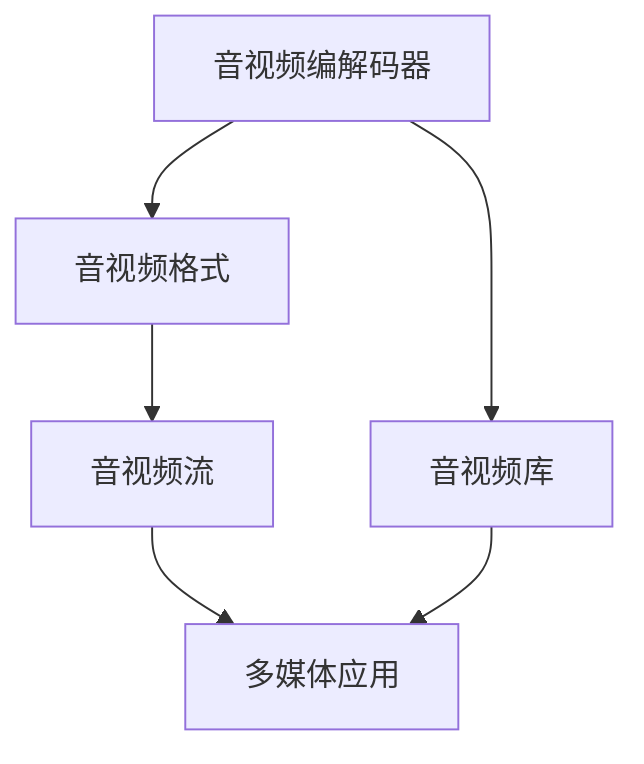

                 

# FFmpeg音视频处理入门

> 关键词：FFmpeg,音视频处理,编码器,解码器,音视频格式,编解码器,音视频格式转换,音视频流,音视频库,多媒体应用

## 1. 背景介绍

### 1.1 问题由来

在当今数字化时代，音视频已成为人们日常工作与生活的重要组成部分。从电影、音乐到实时会议、在线教育，音视频的需求无处不在。然而，面对不同格式的音视频文件和流媒体，如何高效地进行转换、编解码和处理，成为业界普遍关注的焦点。

FFmpeg作为开源且功能强大的音视频处理工具，以其高效、灵活和多平台兼容性著称。它的核心理念是通过构建强大的音视频编解码器，提供一站式的音视频处理解决方案，满足各类应用场景的需求。

### 1.2 问题核心关键点

FFmpeg的核心问题在于如何高效、灵活地处理各种音视频格式和流媒体，同时保证编解码的稳定性和性能。其核心技术包括：

- 音视频编解码器：FFmpeg内置多种编解码器，支持H.264、H.265、MP3、AAC等主流音视频格式。
- 音视频格式转换：FFmpeg支持从一种格式转换到另一种格式，如MP3到WAV、MKV到MP4等。
- 音视频流处理：FFmpeg能够对音视频流进行实时编码、解码、复用和分包，支持多种传输协议和标准。
- 音视频库支持：FFmpeg提供跨平台的音视频库，适应多种操作系统和设备环境。

FFmpeg通过这些核心技术的结合，不仅能够处理音视频格式，还支持多媒体应用的深度开发，如直播、录播、转码等。

## 2. 核心概念与联系

### 2.1 核心概念概述

为了更好地理解FFmpeg的核心技术及其应用，我们首先介绍几个关键概念：

- 音视频编解码器(Codec)：将模拟信号或数字信号转换为数字信号或模拟信号的硬件或软件。音视频编解码器主要分为编码器(Encoder)和解码器(Decoder)。
- 音视频格式：指音视频文件的编码格式，如AVI、MP4、WAV、MP3等。
- 音视频流：指音视频数据在网络或设备上连续传输的形式，分为实时流和文件流。
- 音视频库：提供音视频处理的底层库，如FFmpeg、GStreamer、VLC等。

这些概念之间的联系和依赖关系如图1所示：



FFmpeg通过编解码器将音视频格式转换为音视频流，再通过音视频库支持多媒体应用。其中，音视频库是FFmpeg的核心组件，负责提供编解码和处理的底层支持。

## 3. 核心算法原理 & 具体操作步骤

### 3.1 算法原理概述

FFmpeg的核心算法原理基于音视频编解码器的设计。编解码器主要包括编码器和解码器两大部分。

编码器负责将原始音视频数据压缩为适合网络传输的格式，主要包括：

- 采样：将连续的模拟信号采样为离散的数字信号。
- 量化：将采样后的数字信号转换为更小的整数值，以减少存储空间。
- 熵编码：对量化后的数字信号进行压缩，如霍夫曼编码、算术编码等。

解码器负责将压缩后的音视频数据解压为原始的音视频数据，主要包括：

- 熵解码：将压缩后的数字信号解压为量化后的数字信号。
- 反量化：将量化后的数字信号还原为采样后的数字信号。
- 重采样：将采样后的数字信号重采样为不同的采样率。

FFmpeg通过内置多种编解码器，支持H.264、H.265、MP3、AAC等主流音视频格式，实现高效、灵活的音视频处理。

### 3.2 算法步骤详解

下面以MP3格式的音视频处理为例，详细介绍FFmpeg的核心操作步骤：

**步骤1: 安装FFmpeg**

首先，需要在系统上安装FFmpeg。可以通过以下命令获取FFmpeg的最新版本：

```bash
wget https://ffmpeg.org/releases/ffmpeg-<version>.tar.xz
tar -xf ffmpeg-<version>.tar.xz
cd ffmpeg-<version>
./configure
make -j4
sudo make install
```

**步骤2: 音视频格式转换**

假设需要将MP3格式转换为WAV格式，可以使用以下命令：

```bash
ffmpeg -i input.mp3 output.wav
```

- `-i`: 输入文件路径。
- `-o`: 输出文件路径。

该命令将读取`input.mp3`文件，并生成`output.wav`文件。

**步骤3: 音视频编解码**

假设需要将MP4格式的音视频流解码为YUV格式的视频流，可以使用以下命令：

```bash
ffmpeg -i input.mp4 -c:v rawvideo output.yuv
```

- `-c:v`: 指定编解码器。
- `rawvideo`: 指定编码为生码。

该命令将读取`input.mp4`文件，并生成`output.yuv`文件。

### 3.3 算法优缺点

FFmpeg的主要优点包括：

- 高效：FFmpeg内置多种编解码器，支持多种音视频格式，具有高效的编解码能力。
- 灵活：FFmpeg提供丰富的命令行工具，支持音视频格式转换、编解码、复用等多种操作。
- 开源：FFmpeg是一款开源工具，免费提供，适用于多种操作系统和设备环境。

同时，FFmpeg也存在一些缺点：

- 学习曲线较陡：FFmpeg的命令行工具较为复杂，需要一定的学习成本。
- 功能丰富，可能导致性能损失：FFmpeg的多种功能和格式支持可能导致性能损失，特别是在实时应用场景中。
- 兼容性问题：由于FFmpeg支持多种格式，可能存在兼容性问题，如编码器无法处理某些特定格式的视频。

### 3.4 算法应用领域

FFmpeg在音视频处理领域具有广泛的应用，包括但不限于：

- 音视频转换：将不同格式的音视频文件进行格式转换，如MP3到WAV、MKV到MP4等。
- 音视频编解码：对音视频流进行实时编码、解码、复用和分包，支持多种传输协议和标准。
- 音视频库：提供跨平台的音视频库，适应多种操作系统和设备环境。
- 多媒体应用：支持直播、录播、转码等多媒体应用，适应各种应用场景。

## 4. 数学模型和公式 & 详细讲解 & 举例说明

### 4.1 数学模型构建

FFmpeg的音视频编解码过程主要涉及以下数学模型：

- 采样定理：将模拟信号转换为数字信号时，采样频率必须大于信号的最高频率的两倍。
- 熵编码：对量化后的数字信号进行压缩，如霍夫曼编码、算术编码等。

### 4.2 公式推导过程

以霍夫曼编码为例，推导其基本原理：

- 设信号集合为$S=\{s_1,s_2,...,s_n\}$，其中$s_i$表示第$i$个信号。
- 计算信号集合$S$中每个信号的出现次数$n_i$。
- 计算每个信号的概率$p_i$。
- 构建霍夫曼树，其中每个叶节点表示一个信号，每个内节点表示一个编码器。
- 将信号集合$S$中每个信号编码为二进制串，其长度等于从根节点到该信号节点的路径长度。

**示例：**

假设信号集合为$S=\{s_1,s_2,s_3,s_4\}$，其中$s_1,s_2$出现次数为3，$s_3,s_4$出现次数为1，计算其霍夫曼编码。

1. 计算每个信号的概率$p_i$：

$$
p_1 = \frac{3}{4} = 0.75, \quad p_2 = \frac{3}{4} = 0.75, \quad p_3 = \frac{1}{4} = 0.25, \quad p_4 = \frac{1}{4} = 0.25
$$

2. 构建霍夫曼树：

```
            +--+
            |0|
            +--+
          /    \
        +---+   +---+
        | 1 |   | 2 |
        +---+   +---+
          /    \
        +--+   +--+
        | 3 |   | 4 |
        +--+   +--+
```

3. 计算每个信号的编码：

- $s_1$编码为110
- $s_2$编码为101
- $s_3$编码为001
- $s_4$编码为100

### 4.3 案例分析与讲解

假设需要将H.264格式的音视频流编码为MP4格式，可以使用以下命令：

```bash
ffmpeg -i input.h264 output.mp4
```

- `-i`: 输入文件路径。
- `-o`: 输出文件路径。

该命令将读取`input.h264`文件，并生成`output.mp4`文件。FFmpeg内部使用H.264编码器将H.264格式的音视频流编码为MP4格式，并采用MPEG-4 AVC编码标准进行压缩。

## 5. 项目实践：代码实例和详细解释说明

### 5.1 开发环境搭建

在进行FFmpeg的音视频处理实践前，我们需要准备好开发环境。以下是使用Linux系统安装FFmpeg的过程：

1. 安装依赖包：

```bash
sudo apt-get update
sudo apt-get install build-essential cmake libavcodec-dev libavformat-dev libswscale-dev
```

2. 下载FFmpeg源码：

```bash
wget https://ffmpeg.org/releases/ffmpeg-<version>.tar.xz
```

3. 解压和配置：

```bash
tar -xf ffmpeg-<version>.tar.xz
cd ffmpeg-<version>
./configure --prefix=/usr/local
make -j4
sudo make install
```

### 5.2 源代码详细实现

以下是一个FFmpeg的音视频格式转换示例代码：

```python
import subprocess

# 音视频格式转换命令
cmd = 'ffmpeg -i input.mp3 output.wav'

# 执行命令
subprocess.run(cmd, shell=True)
```

### 5.3 代码解读与分析

代码中使用了`subprocess`模块执行FFmpeg的音视频格式转换命令。通过调用`subprocess.run()`函数，可以轻松地执行FFmpeg的命令行操作。

在实际开发中，可以根据具体需求进行更多的参数配置，如指定编解码器、设置输出参数等。

### 5.4 运行结果展示

运行以上代码后，可以在当前目录下找到转换后的`output.wav`文件。

## 6. 实际应用场景

### 6.1 视频编辑

FFmpeg在视频编辑领域得到了广泛应用。视频编辑需要对视频进行剪辑、合并、转换等多种操作。FFmpeg提供丰富的命令行工具，支持多种音视频格式和编解码器，能够高效处理视频编辑任务。

### 6.2 直播

直播需要对实时音视频流进行编解码和复用，确保流媒体的稳定传输。FFmpeg提供多种编解码器，支持H.264、H.265等主流编码标准，能够高效处理直播流媒体。

### 6.3 音视频流媒体

音视频流媒体需要在网络或设备上连续传输音视频数据，FFmpeg支持多种传输协议和标准，如RTP、RTSP、HLS等，能够高效处理音视频流媒体。

### 6.4 未来应用展望

FFmpeg在音视频处理领域的应用前景非常广阔。随着5G和物联网技术的普及，音视频的应用场景将更加多样化。

- 5G时代的音视频直播：5G网络的高带宽、低时延特性，将带来更高质量的音视频直播体验。
- 物联网设备的音视频处理：物联网设备将大量增加，FFmpeg可以应用于这些设备的音视频处理。
- 音视频融合应用：音视频处理与人工智能、物联网、区块链等技术的结合，将带来新的应用场景。

## 7. 工具和资源推荐

### 7.1 学习资源推荐

为了帮助开发者系统掌握FFmpeg的音视频处理技术，这里推荐一些优质的学习资源：

1. FFmpeg官方文档：FFmpeg提供详细的官方文档，包含音视频编解码、格式转换等基础知识。
2. FFmpeg User Guide：FFmpeg User Guide提供了丰富的音视频处理案例和实践指南。
3. Video Editor's Guide：Video Editor's Guide介绍了视频编辑工具的基本操作和技巧。
4. Online Tutorial：在线教程和课程如Linux Academy、Coursera等提供了FFmpeg的音视频处理教程。

### 7.2 开发工具推荐

FFmpeg的音视频处理开发需要依赖多种工具和平台。以下是几款常用的开发工具：

1. Linux系统：FFmpeg在Linux系统上运行最为稳定，支持多种平台，如Ubuntu、CentOS等。
2. Windows系统：FFmpeg也支持Windows系统，可以在Windows Command Prompt下执行。
3. MacOS系统：FFmpeg在MacOS系统上运行也较为稳定，支持多种平台。
4. Visual Studio：在Windows系统下，可以使用Visual Studio进行FFmpeg的开发和调试。

### 7.3 相关论文推荐

FFmpeg的音视频处理技术源于学界的持续研究。以下是几篇奠基性的相关论文，推荐阅读：

1. H.264/AVC视频编码标准：H.264/AVC视频编码标准详细介绍了H.264编码器的设计原理和实现方法。
2. AAC音频编码标准：AAC音频编码标准详细介绍了AAC编码器的设计原理和实现方法。
3. MP4格式规范：MP4格式规范详细介绍了MP4格式的技术细节和实现方法。
4. H.265/HEVC视频编码标准：H.265/HEVC视频编码标准详细介绍了H.265编码器的设计原理和实现方法。

这些论文代表FFmpeg的音视频处理技术的发展脉络。通过学习这些前沿成果，可以帮助研究者把握学科前进方向，激发更多的创新灵感。

## 8. 总结：未来发展趋势与挑战

### 8.1 总结

本文对FFmpeg的音视频处理技术进行了全面系统的介绍。首先阐述了FFmpeg的历史背景和核心问题，明确了音视频编解码、格式转换等关键技术。其次，从原理到实践，详细讲解了FFmpeg的音视频处理操作，给出了详细的代码实现和运行结果展示。同时，本文还广泛探讨了FFmpeg在视频编辑、直播、音视频流媒体等实际应用场景中的表现，展示了FFmpeg的强大应用能力。

通过对FFmpeg的学习实践，相信开发者能够快速掌握音视频处理的关键技术，并应用于各类实际场景。

### 8.2 未来发展趋势

展望未来，FFmpeg的音视频处理技术将呈现以下几个发展趋势：

1. 编码器性能提升：随着算法和硬件的不断进步，编码器的性能将持续提升，支持更高质量、更高效的视频编解码。
2. 格式转换优化：FFmpeg将不断优化音视频格式转换算法，提升转换速度和质量，支持更多音视频格式。
3. 跨平台支持：FFmpeg将继续提升跨平台支持能力，适应更多操作系统和设备环境。
4. 多媒体应用拓展：FFmpeg将不断拓展多媒体应用场景，支持更多领域的多媒体处理需求。
5. 音视频融合：FFmpeg将与其他音视频处理技术进行更深入的融合，如音视频融合、多模态处理等，提升音视频处理能力。

以上趋势凸显了FFmpeg的音视频处理技术的广阔前景。这些方向的探索发展，必将进一步提升FFmpeg的性能和应用范围，为音视频处理带来新的突破。

### 8.3 面临的挑战

尽管FFmpeg的音视频处理技术已经取得了显著成就，但在迈向更加智能化、普适化应用的过程中，仍面临诸多挑战：

1. 兼容性问题：不同平台、不同格式之间可能存在兼容性问题，需要持续优化和调整。
2. 性能瓶颈：在处理大规模音视频数据时，可能存在性能瓶颈，需要优化算法和硬件支持。
3. 安全性和隐私：FFmpeg在处理音视频数据时，需要考虑数据安全和隐私问题，避免数据泄露和滥用。
4. 跨平台支持：不同平台、不同设备的音视频处理需求可能存在差异，需要提供更灵活的支持。
5. 用户体验：音视频处理操作较为复杂，需要提供更友好的用户体验，降低使用门槛。

### 8.4 研究展望

面对FFmpeg音视频处理技术面临的挑战，未来的研究需要在以下几个方面寻求新的突破：

1. 提升兼容性：持续优化音视频格式和编解码器的兼容性，支持更多平台和格式。
2. 提升性能：优化算法和硬件支持，提升FFmpeg的性能和处理能力。
3. 增强安全性：加强数据安全和隐私保护，避免数据泄露和滥用。
4. 拓展应用场景：拓展FFmpeg在音视频处理中的应用场景，支持更多领域的多媒体处理需求。
5. 提升用户体验：提供更友好的用户体验，降低使用门槛，提升用户满意度。

这些研究方向将引领FFmpeg的音视频处理技术迈向更高的台阶，为音视频处理带来新的突破。相信通过不断创新和优化，FFmpeg将成为音视频处理领域的重要工具，进一步推动音视频技术的普及和发展。

## 9. 附录：常见问题与解答

**Q1：FFmpeg是如何实现音视频格式转换的？**

A: FFmpeg通过内置的编解码器实现音视频格式转换。具体步骤如下：

1. 将输入文件解码为内部格式，如H264、AAC等。
2. 将解码后的内部格式转换为输出格式，如MP3、MP4等。
3. 将输出格式编码成目标格式，如wav、mp4等。

FFmpeg内置多种编解码器，支持H.264、H.265、MP3、AAC等主流音视频格式，能够高效处理音视频格式转换。

**Q2：FFmpeg支持哪些音视频格式？**

A: FFmpeg支持广泛的音视频格式，包括但不限于：

- 音视频格式：MP4、AVI、WMV、MP3、WAV、WMA、AAC、OGG、FLAC等。
- 实时流协议：RTP、RTSP、HLS、RTMP等。

FFmpeg支持多种音视频格式，能够高效处理音视频流的编解码和复用。

**Q3：FFmpeg的音视频编解码器是如何工作的？**

A: FFmpeg的音视频编解码器主要分为编码器和解码器两部分。

编码器负责将原始音视频数据压缩为适合网络传输的格式，主要包括采样、量化、熵编码等步骤。

解码器负责将压缩后的音视频数据解压为原始的音视频数据，主要包括熵解码、反量化、重采样等步骤。

FFmpeg内置多种编解码器，支持H.264、H.265、MP3、AAC等主流音视频格式，能够高效处理音视频数据的编解码。

---

作者：禅与计算机程序设计艺术 / Zen and the Art of Computer Programming

