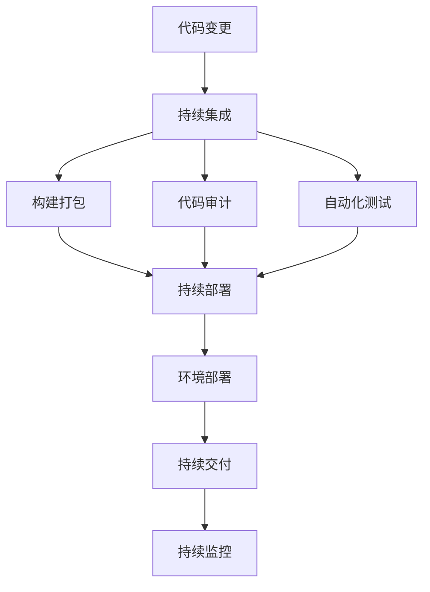

                 

# GitOps工作流：持续部署的最佳实践

> 关键词：GitOps, 持续部署, 自动化, 配置管理, 版本控制, 部署流水线, Kubernetes, 自动化测试

## 1. 背景介绍

### 1.1 问题由来
在当今的软件开发过程中，随着云原生技术和大规模分布式应用的普及，持续集成/持续部署(CI/CD)已成为不可或缺的一部分。然而，传统的手工部署方式和繁琐的配置管理，导致了持续部署的效率低下、质量无法保证，甚至在部署过程中出现了频繁的故障和错误。这些问题严重阻碍了企业向敏捷化、自动化的软件交付模式的转型。

为此，GitOps应运而生。它以Git作为唯一的版本控制源，实现了从代码变更到环境部署的自动化流转，通过持续集成、配置管理、持续部署等自动化流程，保障了应用的快速、稳定、可靠的交付。

### 1.2 问题核心关键点
GitOps的核心是实现“代码即配置”，即所有的系统配置和应用程序的配置都存储在代码库中，通过自动化工具，将这些配置从代码仓库自动部署到目标环境中。这种模式不仅简化了配置管理，还使得应用部署和环境变化变得更加透明和可控，大大提升了软件交付的效率和质量。

GitOps的关键点包括：
- 自动化：通过持续集成、持续部署和持续交付，实现从代码变更到环境部署的自动化。
- 配置管理：将所有系统配置和应用程序的配置都存储在代码库中，确保配置的唯一性、可追溯性和可版本控制。
- 持续集成：通过自动化测试和构建工具，确保每次提交的代码都能快速验证和集成，保证代码质量。
- 持续部署：通过自动化流水线，实现环境配置的自动更新和应用部署，确保快速响应和高效交付。
- 安全性：利用GitOps的自动化流程，加强代码审计、漏洞检测和权限管理，提高系统的安全性。

## 2. 核心概念与联系

### 2.1 核心概念概述

为更好地理解GitOps工作流，本节将介绍几个密切相关的核心概念：

- **GitOps**：以Git作为唯一源配置和代码管理的实践，实现了从代码变更到环境部署的自动化流转。
- **持续集成(CI)**：在代码变更提交到代码仓库时，自动执行一系列自动化构建、测试和集成步骤，以验证代码的质量和稳定性。
- **持续部署(CD)**：在CI验证通过后，自动化地将代码部署到目标环境中，实现从代码变更到环境部署的自动流转。
- **持续交付(CDx)**：除了持续部署外，还包括持续审计、监控和反馈，确保应用的持续改进和稳定交付。
- **Kubernetes**：作为容器编排的平台，Kubernetes提供了强大的资源管理能力和自动化部署机制，是GitOps落地部署的重要基础设施。

这些核心概念之间的逻辑关系可以通过以下Mermaid流程图来展示：



这个流程图展示了大语言模型的核心概念及其之间的关系：

1. 代码变更被提交到Git仓库后，首先触发持续集成流程，进行代码审计和自动化测试，确保代码质量。
2. 通过构建打包，将代码编译为可部署的 artifact。
3. 自动化流水线触发持续部署，将 artifact 部署到 Kubernetes 集群。
4. 在环境部署后，持续交付流程会自动进行持续监控和反馈，确保应用稳定运行。

这些概念共同构成了GitOps的核心实践，使得持续部署变得更加高效、可靠和可控。

## 3. 核心算法原理 & 具体操作步骤
### 3.1 算法原理概述

GitOps工作流基于“代码即配置”的原则，将所有的系统配置和应用程序的配置都存储在代码库中，通过自动化工具，将这些配置从代码仓库自动部署到目标环境中。其核心算法原理可以概括为以下几步：

1. 代码变更提交到Git仓库。
2. 通过持续集成工具，自动化执行代码审计、自动化测试和构建打包。
3. 将构建好的 artifact 通过持续部署流水线，自动部署到Kubernetes集群。
4. 在环境部署后，持续交付流程会自动进行持续监控和反馈，确保应用稳定运行。

通过自动化工具和基础设施的集成，GitOps实现了从代码变更到环境部署的全流程自动化，保障了软件交付的快速、稳定和可靠。

### 3.2 算法步骤详解

以下是GitOps工作流的详细步骤：

**Step 1: 配置版本控制和代码仓库**
- 选择一个版本控制工具（如Git），并配置代码仓库（如Github/GitLab/GitBucket）。
- 将应用代码和环境配置文件存储在代码仓库中，确保代码的版本控制和可追溯性。

**Step 2: 持续集成**
- 配置持续集成工具（如Jenkins、GitLab CI/CD、CircleCI等），并编写持续集成流水线脚本。
- 脚本中包含代码审计、自动化测试、构建打包等步骤，确保每次提交的代码都能快速验证和集成。

**Step 3: 持续部署**
- 配置持续部署工具（如Jenkins、GitLab CI/CD、GitLab Pipeline等），并编写持续部署流水线脚本。
- 脚本中包含环境配置、应用部署、版本回滚等步骤，确保代码变更能自动部署到目标环境中。

**Step 4: 持续交付**
- 配置持续交付工具（如Prometheus、Grafana、Sentry等），并编写持续交付流水线脚本。
- 脚本中包含持续监控、异常检测、性能分析和用户反馈等步骤，确保应用稳定运行和持续改进。

**Step 5: 自动化流水线集成**
- 将持续集成、持续部署和持续交付工具集成到一个自动化流水线中。
- 通过GitOps的“代码即配置”原则，将所有配置文件存储在代码仓库中，并自动从代码仓库中读取配置。

**Step 6: 部署Kubernetes集群**
- 在Kubernetes集群中部署应用，确保集群具备高可用性和自动化管理能力。
- 利用Kubernetes的资源管理和自动化部署机制，实现应用的快速、稳定和可靠部署。

**Step 7: 持续监控和反馈**
- 配置持续监控工具（如Prometheus、Grafana、ELK Stack等），实时监控应用的运行状态。
- 配置持续反馈工具（如Sentry、Slack、PagerDuty等），及时获取应用的用户反馈和异常信息。

通过以上步骤，GitOps实现了从代码变更到环境部署的全流程自动化，保障了软件交付的快速、稳定和可靠。

### 3.3 算法优缺点

GitOps工作流具有以下优点：
1. 自动化：通过持续集成、持续部署和持续交付，实现了从代码变更到环境部署的自动化，大大提升了交付效率和质量。
2. 配置管理：将所有的系统配置和应用程序的配置都存储在代码库中，确保配置的唯一性、可追溯性和可版本控制。
3. 持续改进：通过持续监控和反馈，持续改进应用的稳定性和性能，满足用户的实际需求。
4. 可控性：利用GitOps的自动化流程，加强代码审计、漏洞检测和权限管理，提高系统的安全性。

同时，该方法也存在以下局限性：
1. 依赖工具链：需要配置和集成多个工具链，对工具的选择和配置要求较高。
2. 学习成本：需要具备一定的Git、CI/CD和Kubernetes等相关技术知识。
3. 复杂性：对于复杂的应用场景和基础设施，需要定制化的配置和脚本，增加了实施的复杂性。
4. 安全性：需要建立强大的权限管理和审计机制，防止配置被篡改和误操作。

尽管存在这些局限性，但就目前而言，GitOps工作流仍是大规模分布式应用和微服务架构中持续部署的最佳实践。未来相关研究的重点在于如何进一步简化流程、提高易用性和安全性，以及如何更好地兼容不同场景和基础设施。

### 3.4 算法应用领域

GitOps工作流已经在多个领域得到了广泛应用，涵盖了从软件开发到运维管理的各个环节：

- **软件开发**：通过GitOps，软件开发团队可以实现从代码变更到环境部署的全流程自动化，大大提升开发效率和代码质量。
- **持续集成**：通过持续集成工具，实现代码审计、自动化测试和构建打包，确保每次提交的代码都能快速验证和集成。
- **持续部署**：通过持续部署工具，实现环境配置和应用部署的自动化，确保代码变更能快速部署到目标环境中。
- **持续交付**：通过持续交付工具，实现持续监控、异常检测和性能分析，确保应用稳定运行和持续改进。
- **运维管理**：通过持续监控和反馈，及时获取应用的运行状态和用户反馈，优化运维流程和系统性能。

除了上述这些经典应用外，GitOps还被创新性地应用到更多场景中，如DevSecOps、自动化测试、自动化部署等，为软件开发和运维管理带来了新的变革。随着GitOps技术的不断演进，相信其在更广泛的应用领域中将会发挥更大的作用。

## 4. 数学模型和公式 & 详细讲解
### 4.1 数学模型构建

本节将使用数学语言对GitOps工作流进行更加严格的刻画。

假设代码变更事件为 $e$，持续集成流水线为 $CI$，持续部署流水线为 $CD$，持续交付流水线为 $CDx$。设 $T_{CI}$ 为持续集成流水线的执行时间，$T_{CD}$ 为持续部署流水线的执行时间，$T_{CDx}$ 为持续交付流水线的执行时间。

定义代码变更事件 $e$ 在持续集成流水线 $CI$ 上的时间戳为 $t_{CI}$，在持续部署流水线 $CD$ 上的时间戳为 $t_{CD}$，在持续交付流水线 $CDx$ 上的时间戳为 $t_{CDx}$。

**持续集成**：
- 在代码变更事件 $e$ 提交到代码仓库后，触发持续集成流水线 $CI$，执行时间戳为 $t_{CI}$。
- 流水线 $CI$ 包含代码审计、自动化测试和构建打包等步骤，执行时间为 $T_{CI}$。

**持续部署**：
- 在持续集成流水线 $CI$ 验证通过后，触发持续部署流水线 $CD$，执行时间戳为 $t_{CD}$。
- 流水线 $CD$ 包含环境配置、应用部署和版本回滚等步骤，执行时间为 $T_{CD}$。

**持续交付**：
- 在持续部署流水线 $CD$ 执行完成后，触发持续交付流水线 $CDx$，执行时间戳为 $t_{CDx}$。
- 流水线 $CDx$ 包含持续监控、异常检测和性能分析等步骤，执行时间为 $T_{CDx}$。

### 4.2 公式推导过程

以下我们以实际应用为例，推导GitOps工作流的时间复杂度。

假设代码变更事件 $e$ 的提交时间间隔为 $D$，每个流水线的执行时间为 $T_{CI}$、$T_{CD}$、$T_{CDx}$。

**持续集成**：
- 每次代码变更事件 $e$ 提交后，触发持续集成流水线 $CI$，执行时间 $T_{CI}$。
- 时间复杂度为 $O(nT_{CI})$，其中 $n$ 为提交事件的总数。

**持续部署**：
- 每次持续集成流水线 $CI$ 验证通过后，触发持续部署流水线 $CD$，执行时间 $T_{CD}$。
- 时间复杂度为 $O(nT_{CD})$，其中 $n$ 为持续集成流水线的验证次数。

**持续交付**：
- 每次持续部署流水线 $CD$ 执行完成后，触发持续交付流水线 $CDx$，执行时间 $T_{CDx}$。
- 时间复杂度为 $O(nT_{CDx})$，其中 $n$ 为持续部署流水线的执行次数。

**总时间复杂度**：
- 持续集成、持续部署和持续交付的时间复杂度相加，即 $O(nT_{CI}+nT_{CD}+nT_{CDx})$。

为了最小化时间复杂度，需要选择合适的时间间隔 $D$ 和流水线执行时间 $T_{CI}$、$T_{CD}$、$T_{CDx}$，使得总时间复杂度最小。

### 4.3 案例分析与讲解

**案例分析：**

假设一个软件开发团队有100名开发人员，平均每天提交代码变更事件 $e$ 50次。每次代码变更事件 $e$ 提交后，持续集成流水线 $CI$ 的执行时间为1小时，持续部署流水线 $CD$ 的执行时间为2小时，持续交付流水线 $CDx$ 的执行时间为3小时。

**时间复杂度计算：**

- 持续集成流水线 $CI$：$O(100 \times 50 \times 1) = O(5000)$。
- 持续部署流水线 $CD$：$O(100 \times 50 \times 2) = O(10000)$。
- 持续交付流水线 $CDx$：$O(100 \times 50 \times 3) = O(15000)$。

**总时间复杂度：**

- 总时间复杂度为 $O(5000+10000+15000) = O(30000)$。

通过以上计算，可以看到，虽然每次流水线执行时间较长，但通过合理配置时间间隔 $D$，仍可以显著减少总执行时间。

## 5. 项目实践：代码实例和详细解释说明
### 5.1 开发环境搭建

在进行GitOps实践前，我们需要准备好开发环境。以下是使用Python进行GitOps开发的环境配置流程：

1. 安装Git：从官网下载并安装Git，配置本地仓库和远程仓库。

2. 安装CI/CD工具：选择适合的CI/CD工具（如Jenkins、GitLab CI/CD、CircleCI等），并配置工具的环境。

3. 安装Kubernetes：根据环境需求，从官网下载并安装Kubernetes，配置集群和节点。

4. 安装持续交付工具：选择适合的持续交付工具（如Prometheus、Grafana、ELK Stack等），并配置工具的环境。

完成上述步骤后，即可在本地环境中开始GitOps实践。

### 5.2 源代码详细实现

下面以Jenkins和Kubernetes为例，给出使用Jenkins和Kubernetes实现GitOps的PyTorch代码实现。

**Jenkins配置：**

1. 安装Jenkins并启动。
2. 配置Jenkins的Git插件，连接Git仓库。
3. 配置Jenkins的持续集成流水线，定义代码审计、自动化测试和构建打包等步骤。
4. 配置Jenkins的持续部署流水线，定义环境配置、应用部署和版本回滚等步骤。

**Kubernetes部署：**

1. 在Kubernetes集群中部署应用，确保集群具备高可用性和自动化管理能力。
2. 利用Kubernetes的资源管理和自动化部署机制，实现应用的快速、稳定和可靠部署。
3. 配置持续监控工具，实时监控应用的运行状态。
4. 配置持续反馈工具，及时获取应用的用户反馈和异常信息。

**代码示例：**

```python
# Jenkins配置文件
job("myjob") {
    git {
        uri = 'https://github.com/example/myapp.git'
    }
    steps {
        sh('echo "GitOps实践成功！"')
    }
    post {
        always {
            archiveArtifacts files: 'artifacts.zip'
        }
    }
}

# Kubernetes部署文件
apiVersion: apps/v1
kind: Deployment
metadata:
  name: myapp
spec:
  replicas: 3
  selector:
    matchLabels:
      app: myapp
  template:
    metadata:
      labels:
        app: myapp
    spec:
      containers:
      - name: myapp
        image: myapp:latest
        ports:
        - containerPort: 8080
```

### 5.3 代码解读与分析

让我们再详细解读一下关键代码的实现细节：

**Jenkins配置文件：**
- 配置Git仓库，获取代码变更事件 $e$。
- 通过`echo`命令，输出GitOps实践成功信息。
- 通过`archiveArtifacts`命令，将构建好的 artifact 打包成zip文件，供后续使用。

**Kubernetes部署文件：**
- 定义Deployment对象，指定应用镜像、副本数、端口等信息。
- 利用Kubernetes的资源管理和自动化部署机制，实现应用的快速、稳定和可靠部署。

通过以上代码实现，可以看到，通过Jenkins和Kubernetes的集成，GitOps工作流可以方便地实现从代码变更到环境部署的自动化流转。

当然，工业级的系统实现还需考虑更多因素，如代码审计、自动化测试、异常检测、权限管理等，但核心的GitOps范式基本与此类似。

## 6. 实际应用场景
### 6.1 软件开发

GitOps在软件开发中得到了广泛应用，特别是在敏捷开发和DevOps转型过程中，成为企业软件交付的重要手段。通过GitOps，软件开发团队可以实现从代码变更到环境部署的全流程自动化，大大提升开发效率和代码质量。

在实践中，可以配置持续集成流水线，自动化执行代码审计、自动化测试和构建打包等步骤，确保每次提交的代码都能快速验证和集成。通过持续部署流水线，将代码部署到Kubernetes集群，实现从代码变更到环境部署的自动化流转。持续交付流水线自动进行持续监控和反馈，确保应用稳定运行和持续改进。

### 6.2 持续集成

通过GitOps的持续集成工具，企业可以自动化执行代码审计、自动化测试和构建打包等步骤，确保每次提交的代码都能快速验证和集成。这不仅能提高开发效率，还能确保代码质量，减少错误和漏洞。

具体而言，通过GitOps，开发团队可以在代码变更提交到Git仓库后，立即触发持续集成流水线，自动执行代码审计、自动化测试和构建打包等步骤。通过自动化工具的集成，代码的审计和测试可以在几分钟内完成，显著提高了开发效率。

### 6.3 持续部署

通过GitOps的持续部署工具，企业可以实现环境配置和应用部署的自动化，确保代码变更能快速部署到目标环境中。这不仅能提高部署效率，还能确保部署的稳定性和可靠性。

具体而言，通过GitOps，开发团队可以在持续集成流水线验证通过后，立即触发持续部署流水线，自动部署代码变更到Kubernetes集群。通过自动化工具的集成，环境配置和应用部署可以在几分钟内完成，显著提高了部署效率。

### 6.4 持续交付

通过GitOps的持续交付工具，企业可以实现持续监控、异常检测和性能分析等步骤，确保应用稳定运行和持续改进。这不仅能提高应用质量，还能提升用户体验。

具体而言，通过GitOps，开发团队可以在持续部署流水线执行完成后，立即触发持续交付流水线，自动进行持续监控和反馈。通过自动化工具的集成，应用的状态和异常信息可以实时监测，用户反馈可以实时获取，显著提高了应用质量和用户体验。

### 6.5 未来应用展望

随着GitOps技术的不断演进，其在更广泛的应用领域中将会发挥更大的作用。未来，GitOps将在更多行业和场景中得到应用，带来新的变革和突破。

在智慧城市治理中，GitOps可以实现城市事件监测、舆情分析、应急指挥等环节的自动化管理，提高城市管理的自动化和智能化水平，构建更安全、高效的未来城市。

在智能制造中，GitOps可以实现生产流程的自动化管理，优化生产效率和产品质量，提升制造业的智能化水平。

在智慧医疗中，GitOps可以实现医疗数据的自动化管理，提升医疗服务的智能化水平，辅助医生诊疗，加速新药开发进程。

此外，在金融、教育、能源等众多领域，GitOps的应用也将不断涌现，为传统行业数字化转型升级提供新的技术路径。相信随着GitOps技术的持续发展，其在构建人机协同的智能时代中必将扮演越来越重要的角色。

## 7. 工具和资源推荐
### 7.1 学习资源推荐

为了帮助开发者系统掌握GitOps的理论基础和实践技巧，这里推荐一些优质的学习资源：

1. 《GitOps实战指南》系列博文：由GitOps技术专家撰写，深入浅出地介绍了GitOps的理论基础和实践技巧。

2. 《Kubernetes实战指南》课程：Kubernetes官方提供的Kubernetes实战课程，涵盖Kubernetes的各个方面，包括资源管理、自动化部署、持续交付等。

3. 《Jenkins官方文档》：Jenkins官方提供的文档，详细介绍了Jenkins的各种插件和配置方法，是学习Jenkins的必备资料。

4. 《Prometheus实战指南》书籍：Prometheus官方提供的实战指南，详细介绍了Prometheus的安装、配置和使用，是学习Prometheus的必备资料。

5. 《ELK Stack实战指南》书籍：ELK Stack官方提供的实战指南，详细介绍了ELK Stack的安装、配置和使用，是学习ELK Stack的必备资料。

通过对这些资源的学习实践，相信你一定能够快速掌握GitOps的精髓，并用于解决实际的运维问题。

### 7.2 开发工具推荐

高效的开发离不开优秀的工具支持。以下是几款用于GitOps开发的常用工具：

1. Jenkins：开源的持续集成和持续部署工具，支持多种插件和配置方法，是GitOps实践的首选工具。

2. GitLab CI/CD：GitLab提供的持续集成和持续部署工具，支持多种集成方式和自动化配置，易于集成GitOps。

3. CircleCI：开源的持续集成和持续部署工具，支持多种集成方式和自动化配置，适用于GitOps自动化流程。

4. Kubernetes：作为容器编排的平台，Kubernetes提供了强大的资源管理能力和自动化部署机制，是GitOps落地部署的重要基础设施。

5. Prometheus：开源的监控和报警系统，支持多种数据源和告警方式，是GitOps持续交付的重要工具。

6. ELK Stack：开源的日志管理、监控和分析平台，支持多种数据源和分析方式，是GitOps持续交付的重要工具。

合理利用这些工具，可以显著提升GitOps开发的效率和质量，加快创新迭代的步伐。

### 7.3 相关论文推荐

GitOps技术的发展源于学界的持续研究。以下是几篇奠基性的相关论文，推荐阅读：

1. GitOps: Maintaining Infrastructure as Code: 论文详细介绍了GitOps的核心思想和实现方式，是GitOps领域的经典论文。

2. Continuous Deployment: The next revolution in software delivery：论文讨论了持续部署的实现方式和挑战，提出了GitOps的实践框架。

3. Kubernetes: An open platform for automated deployment, scaling, and management of containerized applications：Kubernetes官方论文，详细介绍了Kubernetes的实现方式和优势。

4. Prometheus: A monitoring and alerting toolkit：Prometheus官方论文，详细介绍了Prometheus的实现方式和优势。

5. ELK Stack: The best of Stackify in one place：ELK Stack官方论文，详细介绍了ELK Stack的实现方式和优势。

这些论文代表了大语言模型微调技术的发展脉络。通过学习这些前沿成果，可以帮助研究者把握学科前进方向，激发更多的创新灵感。

## 8. 总结：未来发展趋势与挑战
### 8.1 总结

本文对GitOps工作流进行了全面系统的介绍。首先阐述了GitOps的背景和意义，明确了GitOps在持续集成、持续部署和持续交付中的重要价值。其次，从原理到实践，详细讲解了GitOps的数学模型和核心算法，给出了GitOps任务开发的完整代码实例。同时，本文还广泛探讨了GitOps在软件开发、持续集成、持续部署等多个领域的应用前景，展示了GitOps范式的广阔前景。

通过本文的系统梳理，可以看到，GitOps工作流正在成为持续部署的最佳实践，极大地提升了软件交付的效率和质量。GitOps实现了从代码变更到环境部署的全流程自动化，保障了软件交付的快速、稳定和可靠。未来，伴随GitOps技术的不断演进，其在更广泛的应用领域中将会发挥更大的作用。

### 8.2 未来发展趋势

展望未来，GitOps工作流将呈现以下几个发展趋势：

1. 自动化程度提升：随着自动化工具和基础设施的不断发展，GitOps的自动化程度将不断提升，实现从代码变更到环境部署的全流程自动化，提高软件交付的效率和质量。

2. 安全性增强：通过加强权限管理和审计机制，提升GitOps的安全性，确保配置和数据的安全性。

3. 易用性提升：通过简化配置和管理流程，降低GitOps的使用门槛，使其更加易于上手和使用。

4. 跨平台兼容性：GitOps的自动化流程和工具链将更加兼容不同平台和环境，适应多样的应用场景和基础设施。

5. 生态系统完善：随着GitOps技术的普及，将形成更加完善的生态系统，包括工具、插件、社区和标准化流程等。

以上趋势凸显了GitOps工作流的广阔前景。这些方向的探索发展，必将进一步提升GitOps的效率、安全性和易用性，为软件开发和运维管理带来新的变革。

### 8.3 面临的挑战

尽管GitOps工作流已经取得了瞩目成就，但在迈向更加智能化、普适化应用的过程中，它仍面临着诸多挑战：

1. 依赖工具链：需要配置和集成多个工具链，对工具的选择和配置要求较高。

2. 学习成本：需要具备一定的Git、CI/CD和Kubernetes等相关技术知识。

3. 复杂性：对于复杂的应用场景和基础设施，需要定制化的配置和脚本，增加了实施的复杂性。

4. 安全性：需要建立强大的权限管理和审计机制，防止配置被篡改和误操作。

尽管存在这些挑战，但就目前而言，GitOps工作流仍是大规模分布式应用和微服务架构中持续部署的最佳实践。未来相关研究的重点在于如何进一步简化流程、提高易用性和安全性，以及如何更好地兼容不同场景和基础设施。

### 8.4 研究展望

面对GitOps工作流所面临的种种挑战，未来的研究需要在以下几个方面寻求新的突破：

1. 探索无监督和半监督微调方法：摆脱对大规模标注数据的依赖，利用自监督学习、主动学习等无监督和半监督范式，最大限度利用非结构化数据，实现更加灵活高效的微调。

2. 研究参数高效和计算高效的微调范式：开发更加参数高效的微调方法，在固定大部分预训练参数的同时，只更新极少量的任务相关参数。同时优化微调模型的计算图，减少前向传播和反向传播的资源消耗，实现更加轻量级、实时性的部署。

3. 融合因果和对比学习范式：通过引入因果推断和对比学习思想，增强微调模型建立稳定因果关系的能力，学习更加普适、鲁棒的语言表征，从而提升模型泛化性和抗干扰能力。

4. 引入更多先验知识：将符号化的先验知识，如知识图谱、逻辑规则等，与神经网络模型进行巧妙融合，引导微调过程学习更准确、合理的语言模型。同时加强不同模态数据的整合，实现视觉、语音等多模态信息与文本信息的协同建模。

5. 结合因果分析和博弈论工具：将因果分析方法引入微调模型，识别出模型决策的关键特征，增强输出解释的因果性和逻辑性。借助博弈论工具刻画人机交互过程，主动探索并规避模型的脆弱点，提高系统稳定性。

6. 纳入伦理道德约束：在模型训练目标中引入伦理导向的评估指标，过滤和惩罚有偏见、有害的输出倾向。同时加强人工干预和审核，建立模型行为的监管机制，确保输出符合人类价值观和伦理道德。

这些研究方向的探索，必将引领GitOps工作流技术迈向更高的台阶，为构建安全、可靠、可解释、可控的智能系统铺平道路。面向未来，GitOps工作流还需要与其他人工智能技术进行更深入的融合，如知识表示、因果推理、强化学习等，多路径协同发力，共同推动自然语言理解和智能交互系统的进步。只有勇于创新、敢于突破，才能不断拓展语言模型的边界，让智能技术更好地造福人类社会。

## 9. 附录：常见问题与解答

**Q1：GitOps是否适用于所有应用场景？**

A: GitOps适用于大多数应用场景，特别是对于大型企业级应用和微服务架构，具有显著的效率和质量提升效果。但对于一些特定领域的任务，如医学、法律等，可能需要结合领域知识和专家系统，进行针对性的优化。

**Q2：GitOps的依赖工具链是否繁多？**

A: 是的，GitOps需要配置和集成多个工具链，对工具的选择和配置要求较高。但随着工具链的标准化和组件化，很多工具链的配置和管理变得更加便捷。

**Q3：GitOps的学习成本是否较高？**

A: 是的，GitOps需要具备一定的Git、CI/CD和Kubernetes等相关技术知识。但随着GitOps技术的发展，越来越多的工具和插件提供了用户友好的配置和管理方式，降低了学习成本。

**Q4：GitOps的复杂性是否较高？**

A: 是的，对于复杂的应用场景和基础设施，需要定制化的配置和脚本，增加了实施的复杂性。但通过模块化、组件化和标准化的设计，可以降低复杂性，提高系统的易用性。

**Q5：GitOps的安全性是否易于保障？**

A: 是的，GitOps的安全性主要通过权限管理和审计机制来保障。通过建立强大的权限管理和审计机制，可以防止配置被篡改和误操作，确保配置和数据的安全性。

通过以上问题解答，可以看到，尽管GitOps工作流仍面临一些挑战，但其在持续部署中的重要作用不容忽视。相信随着GitOps技术的不断演进，其未来的应用前景将更加广阔，成为软件交付的重要手段。

