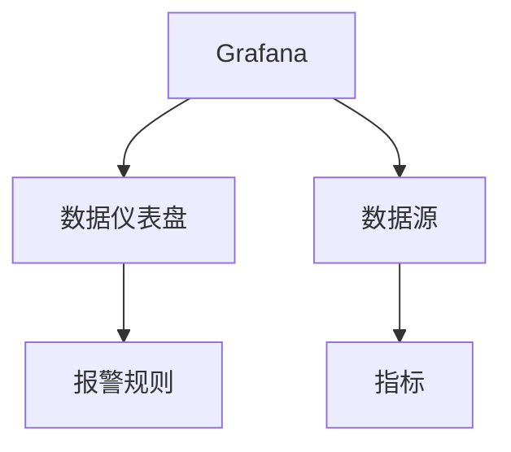

                 

# Grafana可视化监控面板设计

> 关键词：Grafana, 可视化监控, 数据仪表盘, 报警规则, 数据源, 用户定制, 交互式图表

## 1. 背景介绍

### 1.1 问题由来
在当今数字化、网络化的时代，企业IT架构日益复杂，监控任务也变得越来越繁重。如何在海量数据中快速定位问题、进行趋势分析和预警，成为了IT运维人员的主要挑战。传统的监控工具往往只能提供孤立的指标展示，难以实现全面、深入的监测。

Grafana作为一款开源的可视化工具，以其灵活性、扩展性和可定制性著称，已成为行业内广泛使用的监控系统。通过集成丰富的数据源和可定制的图表组件，Grafana帮助企业构建强大、灵活的数据仪表盘，实现全方位、深层次的监控需求。本文将详细介绍如何使用Grafana设计和优化数据仪表盘，以提供最佳的监控体验。

### 1.2 问题核心关键点
Grafana的数据仪表盘设计主要包括如下关键点：
1. 数据源集成：选择和配置数据源，以支持多种数据类型和采集方式。
2. 指标展示：选择合适的图表类型和布局，清晰展示数据趋势和异常情况。
3. 用户交互：通过可定制的交互功能，增强用户对监控数据的理解和操作能力。
4. 报警机制：设计灵活的报警规则，及时识别和通知问题。
5. 多维数据融合：将不同数据源、不同维度的数据进行综合展示和分析。

## 2. 核心概念与联系

### 2.1 核心概念概述

为更好地理解Grafana的数据仪表盘设计，我们首先需要介绍几个核心概念：

- Grafana：一款开源的Web监控工具，支持丰富的数据源和强大的图表展示功能，广泛应用于企业IT监控。
- 数据仪表盘：基于Grafana构建的自定义监控页面，通过灵活的图表组件和配置项，实时展示数据变化。
- 数据源：用于采集数据的来源，包括Prometheus、MySQL、Elasticsearch等。
- 指标：代表数据变化的量度，如CPU利用率、内存使用、网络流量等。
- 报警规则：根据预设条件，自动触发警报的通知机制。

这些核心概念之间的逻辑关系可以通过以下Mermaid流程图来展示：



这个流程图展示了一个典型的Grafana数据仪表盘设计流程：

1. 使用Grafana构建监控页面（数据仪表盘）。
2. 通过数据源接口（Prometheus、MySQL、Elasticsearch等）采集数据。
3. 通过指标展示数据变化。
4. 设计报警规则，自动通知相关人员。

## 3. 核心算法原理 & 具体操作步骤
### 3.1 算法原理概述

Grafana的数据仪表盘设计本质上是数据可视化方法学的具体应用。其核心原理如下：

1. **数据源集成**：通过标准的API接口，Grafana支持多种数据源，如Prometheus、MySQL、Elasticsearch等。数据源集成模块负责将不同数据源的数据采集到Grafana平台。

2. **指标展示**：Grafana支持多种图表类型，如线图、柱状图、饼图等，可以直观展示数据的变化趋势和分布情况。图表的展示方式包括单面板、多面板、仪表盘等，可根据实际需求灵活配置。

3. **用户交互**：Grafana提供了丰富的用户交互功能，如滑动条、范围选择器、面板分组等，帮助用户更深入地理解和操作数据。用户还可以通过动态查询、条件筛选等方式，快速定位问题。

4. **报警机制**：Grafana提供了灵活的报警规则，支持自定义条件和通知方式。报警规则可以根据阈值、时间段、异常检测等多种条件触发，并通过邮件、短信、钉钉等方式进行通知。

### 3.2 算法步骤详解

以下我们详细介绍Grafana数据仪表盘设计的详细步骤：

**Step 1: 准备数据源和指标**

1. 选择合适的数据源。Grafana支持多种数据源，如Prometheus、MySQL、Elasticsearch等。根据实际需求选择合适的数据源，并进行相应的配置。

2. 定义监控指标。监控指标应根据业务需求，选择重要的性能指标、错误率、事件等。定义好指标后，进行采集和展示。

**Step 2: 设计数据仪表盘**

1. 设计仪表盘布局。使用Grafana的面板布局功能，灵活调整面板的排列和大小。常用的布局方式包括上下布局、左右布局、矩阵布局等。

2. 添加图表组件。在仪表盘上添加需要的图表类型，如线图、柱状图、饼图等。设置相应的图表选项，如轴标签、图例、颜色等，使图表更美观、易读。

3. 配置交互功能。使用Grafana的交互功能，如滑动条、范围选择器、面板分组等，增强用户对数据的理解和操作能力。

**Step 3: 配置报警规则**

1. 定义报警条件。设置报警的阈值、时间段、异常检测条件等，确保报警规则的合理性和准确性。

2. 配置报警通知方式。选择合适的报警通知方式，如邮件、短信、钉钉等，确保报警信息能够及时传达。

**Step 4: 测试和优化**

1. 测试仪表盘效果。在测试环境中，运行仪表盘，检查数据展示和报警机制是否正常。

2. 优化仪表盘设计。根据测试结果，优化图表布局、调整报警条件、改进交互功能等，提升仪表盘的可用性和易用性。

**Step 5: 部署和监控**

1. 部署仪表盘。将设计好的仪表盘发布到Grafana服务器，使其能够实时展示数据和报警信息。

2. 监控仪表盘运行情况。定期检查仪表盘的运行状态，确保数据的实时性、准确性和稳定性。

### 3.3 算法优缺点

Grafana的数据仪表盘设计方法具有以下优点：
1. 灵活性高。支持多种数据源和图表类型，满足不同业务场景的监控需求。
2. 可定制性强。用户可以通过自定义面板布局、图表选项、交互功能等，灵活设计和优化仪表盘。
3. 可视化效果好。多种图表类型和丰富的交互功能，使数据展示更加直观、易读。
4. 报警机制完善。灵活的报警规则和多种通知方式，确保问题能够及时被发现和处理。

同时，该方法也存在一些局限性：
1. 学习曲线较陡。对于初学者，需要一定时间掌握Grafana的各种配置和交互功能。
2. 数据源配置复杂。需要根据不同数据源，进行相应的配置和调试，有时需要一定的技术背景。
3. 报警条件设置复杂。需要综合考虑多种因素，才能设计出合理的报警规则。

尽管存在这些局限性，但Grafana仍是大数据监控领域的主流工具之一，以其强大的数据可视化能力和灵活的配置选项，帮助企业实现高效、实时的监控需求。

### 3.4 算法应用领域

Grafana的数据仪表盘设计方法广泛应用于以下领域：

1. IT监控：监控服务器的CPU利用率、内存使用、网络流量等性能指标，确保服务器的稳定运行。

2. 安全监控：监控网络流量、日志文件等数据，及时发现和防范安全威胁。

3. 业务监控：监控网站访问量、用户行为等数据，评估业务系统的性能和用户体验。

4. 性能优化：通过监控系统的响应时间、错误率等指标，优化系统的性能和稳定性。

5. 运维自动化：将监控数据集成到自动化运维平台，实现自动化报警和问题处理。

6. 数据可视化：将企业内部的各类数据进行综合展示，提供决策支持。

## 4. 数学模型和公式 & 详细讲解 & 举例说明
### 4.1 数学模型构建

Grafana的数据仪表盘设计主要依赖于统计学和数据可视化的基本原理，下面我们将详细介绍相关的数学模型构建。

### 4.2 公式推导过程

**数据采集模型**：

假设有 $N$ 个数据点 $(x_i, y_i)$，$i=1,2,\ldots,N$，其中 $x_i$ 表示时间戳，$y_i$ 表示在该时间戳的指标值。数据采集模型可以表示为：

$$
y_i = f(x_i) + \epsilon_i
$$

其中，$f(x_i)$ 是数据生成函数，$\epsilon_i$ 是随机噪声。

**时间序列模型**：

假设有 $M$ 个时间点 $x_{i,j}$，$i=1,2,\ldots,M$，$j=1,2,\ldots,N$。时间序列模型可以表示为：

$$
y_{i,j} = \sum_{k=1}^{K} \alpha_k x_{i,j} + \epsilon_{i,j}
$$

其中，$\alpha_k$ 是线性回归系数，$K$ 是模型阶数，$\epsilon_{i,j}$ 是随机噪声。

**统计指标模型**：

假设有 $M$ 个统计指标 $y_{i,j}$，$i=1,2,\ldots,M$，$j=1,2,\ldots,N$。统计指标模型可以表示为：

$$
y_{i,j} = \frac{1}{M} \sum_{k=1}^{M} y_{k,j}
$$

### 4.3 案例分析与讲解

假设我们有一个监控系统，需要实时展示服务器的CPU利用率、内存使用情况和网络流量。

**数据采集**：

1. 使用Prometheus采集服务器的性能指标，每5分钟生成一个数据点。

2. 将采集到的数据通过API接口发送到Grafana。

**数据展示**：

1. 在Grafana仪表盘上添加三个线图，分别展示CPU利用率、内存使用和网络流量。

2. 设置时间范围、轴标签、图例、颜色等选项，使图表更加美观易读。

**报警规则**：

1. 定义CPU利用率报警规则，当CPU利用率超过80%时，发送报警通知。

2. 定义内存使用报警规则，当内存使用超过50%时，发送报警通知。

3. 定义网络流量报警规则，当网络流量超过1Gbps时，发送报警通知。

**测试和优化**：

1. 在测试环境中运行仪表盘，检查数据展示和报警机制是否正常。

2. 优化面板布局和报警条件，使仪表盘更加符合业务需求。

## 5. 项目实践：代码实例和详细解释说明
### 5.1 开发环境搭建

在进行Grafana数据仪表盘设计实践前，我们需要准备好开发环境。以下是使用Python进行Grafana配置的环境配置流程：

1. 安装Anaconda：从官网下载并安装Anaconda，用于创建独立的Python环境。

2. 创建并激活虚拟环境：
```bash
conda create -n grafana-env python=3.8 
conda activate grafana-env
```

3. 安装Prometheus和Grafana：根据CUDA版本，从官网获取对应的安装命令。例如：
```bash
conda install prometheus grafana -c prometheus -c conda-forge
```

4. 安装Transformers库：
```bash
pip install transformers
```

5. 安装各类工具包：
```bash
pip install numpy pandas scikit-learn matplotlib tqdm jupyter notebook ipython
```

完成上述步骤后，即可在`grafana-env`环境中开始Grafana的配置和设计。

### 5.2 源代码详细实现

下面我们将详细介绍如何使用Python和Grafana构建一个数据仪表盘，实现对服务器的监控。

首先，定义监控系统的配置文件，用于设置数据源、指标和报警规则：

```python
import os
import prometheus_client

# 定义监控指标
prometheus_client.register.collectors()

def configure监控指标():
    # 定义CPU利用率指标
    cpu_usage = prometheus_client.Gauge('cpu_usage', 'CPU利用率')
    
    # 定义内存使用指标
    memory_usage = prometheus_client.Gauge('memory_usage', '内存使用率')
    
    # 定义网络流量指标
    network_usage = prometheus_client.Counter('network_usage', '网络流量')
    
    # 启动数据采集
    prometheus_client.start_client_socket()
    
    while True:
        # 获取CPU利用率
        cpu_util = os.popen('top -b -n 1 | grep "Cpu(s)" | awk "/^[0-9.]*% idle,0.0% user,0.0% system/"').read().strip().split(' ')[1]
        cpu_usage.set(float(cpu_util))
        
        # 获取内存使用情况
        mem_util = os.popen('free -m | grep mem | awk -F ' " ' '{print $3/$2*100}'').read().strip()
        memory_usage.set(float(mem_util))
        
        # 获取网络流量
        net_util = os.popen('netstat -s | grep ' '{net}'').read().strip().split(' ')[1]
        network_usage.inc(float(net_util))
        
        prometheus_client.collect()
```

然后，在Grafana仪表盘上定义数据源和指标：

1. 登录Grafana，创建仪表盘。

2. 添加数据源。选择Prometheus数据源，配置相应的URL和认证信息。

3. 添加监控指标。选择CPU利用率、内存使用和网络流量指标，并将其添加到仪表盘面板。

4. 设置报警规则。定义CPU利用率、内存使用和网络流量的报警规则，并设置相应的通知方式。

5. 保存仪表盘并发布。

### 5.3 代码解读与分析

让我们再详细解读一下关键代码的实现细节：

**配置文件**：
- 使用Prometheus库定义了CPU利用率、内存使用和网络流量的指标。
- 使用Prometheus库启动数据采集循环，实时更新指标值。

**Grafana仪表盘**：
- 通过Grafana的Web界面，添加Prometheus数据源和监控指标。
- 在仪表盘上设置报警规则，定义触发报警的条件和通知方式。

**测试和优化**：
- 在测试环境中运行仪表盘，检查数据展示和报警机制是否正常。
- 根据实际需求，优化面板布局、调整报警条件，提升仪表盘的可用性和易用性。

## 6. 实际应用场景
### 6.1 智能运维中心

Grafana的数据仪表盘设计方法在智能运维中心得到了广泛应用。传统运维工作依赖人工排查和分析，效率低且容易出错。使用Grafana，运维人员可以实时监控服务器性能、网络流量、日志文件等数据，自动发现和处理问题。

在技术实现上，可以部署Prometheus采集各类性能指标，使用Grafana构建数据仪表盘。运维人员可以根据仪表盘展示的数据，快速定位故障原因，进行问题处理。此外，还可以将报警信息集成到运维系统，实现自动化问题通知和处理。

### 6.2 业务性能监控

Grafana在业务性能监控中也得到了广泛应用。业务系统的运行状态直接影响用户体验和业务效果。通过Grafana构建监控仪表盘，可以实时展示业务指标、请求响应时间、错误率等数据，及时发现和解决性能问题。

在技术实现上，可以使用Prometheus采集业务系统各项指标，通过Grafana仪表盘展示和分析。业务系统管理员可以根据仪表盘展示的性能数据，优化系统配置和资源分配，提升系统性能。

### 6.3 安全事件监控

Grafana在安全事件监控中也发挥着重要作用。安全事件监控需要实时监测网络流量、日志文件等数据，及时发现和防范安全威胁。使用Grafana构建监控仪表盘，可以实时展示安全事件数据，自动生成报警信息。

在技术实现上，可以使用Elasticsearch采集和存储日志文件，通过Grafana仪表盘展示和分析。安全管理员可以根据仪表盘展示的安全事件数据，及时发现和处理安全威胁，保障系统安全。

## 7. 工具和资源推荐
### 7.1 学习资源推荐

为了帮助开发者系统掌握Grafana的数据仪表盘设计理论基础和实践技巧，这里推荐一些优质的学习资源：

1. Grafana官方文档：提供了详细的API接口和配置指南，是上手实践的必备资料。

2. Prometheus官方文档：详细介绍了Prometheus的监控功能和数据采集方式，是Grafana数据源配置的重要参考。

3. 《Grafana官方教程》：由官方提供的官方教程，从基础到高级，逐步介绍Grafana的各项功能。

4. 《Grafana实战》书籍：讲解了Grafana在企业IT监控中的应用案例，帮助读者掌握实战技巧。

5. Grafana社区：提供了丰富的社区资源，包括案例、插件、教程等，是学习Grafana的好去处。

通过对这些资源的学习实践，相信你一定能够快速掌握Grafana的数据仪表盘设计精髓，并用于解决实际的监控问题。

### 7.2 开发工具推荐

高效的开发离不开优秀的工具支持。以下是几款用于Grafana数据仪表盘设计的常用工具：

1. Grafana：一款开源的Web监控工具，提供了丰富的数据源和图表展示功能，支持自定义仪表盘设计。

2. Prometheus：一款开源的时间序列数据库，支持高性能的数据采集和存储，是Grafana常用的数据源之一。

3. ELK Stack：包括Elasticsearch、Logstash和Kibana，用于日志收集、处理和展示，是Grafana常用的数据源之一。

4. Weights & Biases：模型训练的实验跟踪工具，可以记录和可视化模型训练过程中的各项指标，方便调试和优化。

5. TensorBoard：TensorFlow配套的可视化工具，可实时监测模型训练状态，提供丰富的图表呈现方式。

6. Google Colab：谷歌推出的在线Jupyter Notebook环境，免费提供GPU/TPU算力，方便快速实验和分享。

合理利用这些工具，可以显著提升Grafana数据仪表盘设计的开发效率，加快创新迭代的步伐。

### 7.3 相关论文推荐

Grafana的数据仪表盘设计技术发展源于学界的持续研究。以下是几篇奠基性的相关论文，推荐阅读：

1. 《Grafana: A highly interactive web-based dashboarding tool》：Grafana的官方白皮书，介绍了Grafana的架构设计和关键特性。

2. 《Prometheus: Monitoring and alerting at scale》：Prometheus的官方文档，详细介绍了Prometheus的监控功能和数据采集方式。

3. 《Elasticsearch: An information retrieval library and search server》：ELK Stack中Elasticsearch的官方文档，详细介绍了Elasticsearch的功能和应用场景。

4. 《Data Visualization with Grafana》：讲解了如何使用Grafana进行数据可视化，提供丰富的案例和示例。

5. 《Real-time monitoring and alerting with Prometheus and Grafana》：讲解了使用Prometheus和Grafana进行实时监控和报警，提供详细的配置和实践指南。

这些论文代表了大数据监控领域的发展脉络。通过学习这些前沿成果，可以帮助研究者把握学科前进方向，激发更多的创新灵感。

## 8. 总结：未来发展趋势与挑战
### 8.1 总结

本文对Grafana的数据仪表盘设计方法进行了全面系统的介绍。首先阐述了Grafana在监控领域的应用背景和意义，明确了数据仪表盘设计在提升监控效率、发现问题、实时预警方面的独特价值。其次，从原理到实践，详细讲解了Grafana的数据源集成、指标展示、用户交互、报警机制等核心步骤，给出了数据仪表盘设计的完整代码实例。同时，本文还广泛探讨了Grafana在IT监控、业务监控、安全事件监控等多个领域的应用前景，展示了Grafana的强大功能和广泛适用性。此外，本文精选了Grafana的学习资源、开发工具和相关论文，力求为读者提供全方位的技术指引。

通过本文的系统梳理，可以看到，Grafana的数据仪表盘设计方法正在成为企业监控领域的重要范式，极大地提升了监控系统的实时性、准确性和可靠性。未来，伴随Grafana和Prometheus等工具的进一步发展和优化，相信数据监控技术将在更多领域大放异彩，成为企业数字化转型的重要保障。

### 8.2 未来发展趋势

展望未来，Grafana的数据仪表盘设计技术将呈现以下几个发展趋势：

1. 数据源扩展。随着监控场景的不断扩展，Grafana将支持更多的数据源和数据类型，满足不同业务需求。

2. 可视化增强。Grafana将进一步提升图表展示效果，支持更多的交互功能和动态展示方式，使数据更加直观、易读。

3. 预警机制完善。Grafana将引入更多预警技术，如异常检测、预测分析等，提升预警的准确性和及时性。

4. 自动化部署。Grafana将提供更多的自动化部署工具和插件，简化仪表盘的设计和发布过程。

5. 多平台支持。Grafana将支持更多的操作系统和硬件平台，实现跨平台部署和运行。

6. 用户交互优化。Grafana将进一步提升用户交互体验，增强仪表盘的易用性和操作效率。

以上趋势凸显了Grafana数据仪表盘设计的广阔前景。这些方向的探索发展，必将进一步提升Grafana的监控能力，帮助企业实现高效、实时的数据管理。

### 8.3 面临的挑战

尽管Grafana的数据仪表盘设计技术已经取得了瞩目成就，但在迈向更加智能化、普适化应用的过程中，它仍面临诸多挑战：

1. 学习曲线陡峭。Grafana的学习曲线较陡，初学者需要一定时间掌握各项配置和交互功能。

2. 数据源配置复杂。需要根据不同数据源，进行相应的配置和调试，有时需要一定的技术背景。

3. 预警条件设置复杂。需要综合考虑多种因素，才能设计出合理的预警规则。

4. 数据展示复杂。需要根据不同数据类型，选择合适的图表类型和展示方式，有时需要一定的经验和技巧。

尽管存在这些挑战，但Grafana仍是大数据监控领域的主流工具之一，以其强大的数据可视化能力和灵活的配置选项，帮助企业实现高效、实时的监控需求。

### 8.4 研究展望

面对Grafana数据仪表盘设计所面临的挑战，未来的研究需要在以下几个方面寻求新的突破：

1. 探索智能化的预警技术。通过引入机器学习、人工智能技术，自动分析和预测数据变化趋势，提高预警的准确性和及时性。

2. 引入数据挖掘和可视化技术。通过数据挖掘技术提取数据特征，结合可视化技术展示关键信息，提升数据洞察能力。

3. 提供更多的自动化功能。开发更多自动化工具和插件，简化仪表盘的设计和部署过程，降低用户使用门槛。

4. 融合多种数据源和数据类型。支持多种数据源和数据类型，实现多维度数据的综合展示和分析，提升数据监控的全面性和深入性。

5. 引入增强现实和虚拟现实技术。通过增强现实和虚拟现实技术，提供更沉浸式的数据展示和交互方式，提升用户的使用体验。

这些研究方向将推动Grafana数据仪表盘设计技术的不断进步，帮助企业实现更高效、更深入的数据监控和管理。总之，Grafana需要在数据源、数据展示、预警机制、用户交互等多个方面进行优化和改进，才能更好地满足企业数字化转型的需求。

## 9. 附录：常见问题与解答

**Q1：Grafana支持哪些数据源？**

A: Grafana支持多种数据源，如Prometheus、MySQL、Elasticsearch、InfluxDB等。具体支持的数据源可在Grafana官网和文档中查看。

**Q2：如何自定义Grafana面板？**

A: 在Grafana仪表盘中，可以通过拖放操作自定义面板布局，添加、删除、修改面板组件。面板组件包括线图、柱状图、饼图、仪表盘等，可根据实际需求灵活配置。

**Q3：如何设置Grafana报警规则？**

A: 在Grafana仪表盘中，可以通过设置报警阈值、时间段、异常检测条件等，定义报警规则。报警规则可以自动触发邮件、短信、钉钉等通知方式。

**Q4：Grafana在IT监控中的应用场景有哪些？**

A: Grafana在IT监控中的应用场景包括服务器性能监控、网络流量监控、应用性能监控、日志文件监控等。通过Grafana，IT运维人员可以实时监控系统状态，及时发现和处理问题。

**Q5：如何优化Grafana仪表盘设计？**

A: 在优化Grafana仪表盘设计时，需要根据实际需求选择合适的图表类型、设置合理的面板布局、优化报警条件等。同时，还需要定期测试和优化仪表盘性能，确保数据的实时性和准确性。

---

作者：禅与计算机程序设计艺术 / Zen and the Art of Computer Programming

