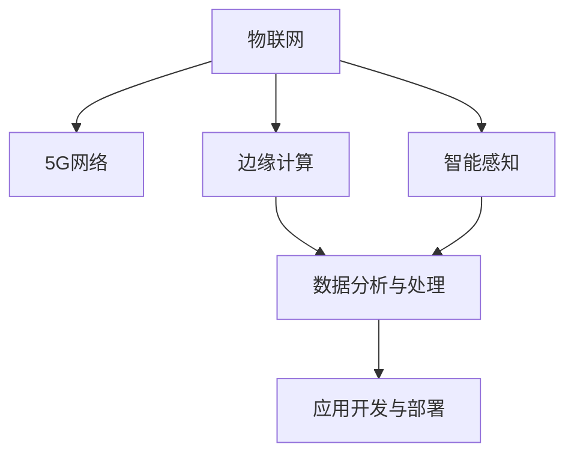

                 

## 1. 背景介绍

### 1.1 问题由来
随着5G技术的普及，物联网（IoT）正以前所未有的速度和规模发展。物联网作为一个多维、交叉的技术生态系统，从智能传感器、无线通信设备到云计算平台，涉及众多硬件和软件组件，开发复杂度非常高。同时，物联网涉及海量数据的采集、存储、处理和分析，对网络带宽和延迟有极高的要求。5G网络的高速度、大容量、低延迟的特性，为物联网的应用提供了强有力的支撑。

### 1.2 问题核心关键点
物联网的开发和应用涉及数据感知、传输、处理、应用等关键环节，需要通过多层次、多维度的技术手段实现。5G技术的发展，为物联网提供了更高效、更可靠、更智能的基础设施。物联网开发人员需要掌握前沿技术，开发高性能、低延迟、高可靠性的物联网应用。

## 2. 核心概念与联系

### 2.1 核心概念概述

为更好地理解5G时代物联网应用开发，本节将介绍几个密切相关的核心概念：

- 物联网(IoT)：将各种物理设备通过互联网连接在一起，进行数据交换和通信，实现物与物、人与物的智能化交互。
- 5G网络：新一代移动通信技术，具有更高的带宽、更低的延迟和更广的覆盖范围，能支持更多设备的连接和数据传输。
- 边缘计算(Edge Computing)：将计算能力部署到靠近数据源的边缘设备上，减少数据传输的延迟和带宽消耗，提高数据处理效率。
- 智能感知(Smart Perception)：通过传感器等硬件设备，实时采集环境数据，实现对物体的智能感知和状态监测。
- 数据分析与处理(Analysis & Processing)：将采集到的海量数据进行处理和分析，提取有用信息，指导决策和控制。
- 应用开发与部署(Application Development & Deployment)：将分析结果应用于实际业务场景，开发各类智能应用，并进行部署和维护。

这些核心概念之间的逻辑关系可以通过以下Mermaid流程图来展示：



这个流程图展示出物联网从数据采集到应用部署的各个环节，以及5G网络和边缘计算在其中扮演的重要角色。

## 3. 核心算法原理 & 具体操作步骤
### 3.1 算法原理概述

5G时代物联网应用开发的核心算法原理，在于充分利用5G网络的低延迟和高带宽特性，结合边缘计算的优势，实现高效、智能的数据处理和应用开发。具体包括以下几个关键点：

1. **数据感知与传输**：通过智能感知设备采集环境数据，并利用5G网络的高速传输能力，实现数据的实时采集和传输。
2. **边缘计算与处理**：将计算能力部署到靠近数据源的边缘设备上，通过边缘计算实现数据的高效处理和分析。
3. **智能应用开发**：基于边缘计算处理后的数据，开发各类智能应用，提供决策支持和控制指令。
4. **多源数据融合**：将来自不同设备和传感器的数据进行融合，提高数据准确性和完整性。

### 3.2 算法步骤详解

基于5G网络的物联网应用开发一般包括以下几个关键步骤：

**Step 1: 数据采集与预处理**
- 使用智能传感器等设备采集环境数据，进行预处理，如滤波、降噪、数据格式转换等。
- 利用5G网络的高速传输特性，将预处理后的数据实时传输到边缘设备。

**Step 2: 边缘计算与数据分析**
- 在边缘设备上，通过编程实现数据分析算法，如信号处理、模式识别、异常检测等。
- 利用边缘计算的高效性，将数据处理任务分散到多个边缘设备上，减少延迟和资源消耗。

**Step 3: 智能应用开发**
- 根据边缘计算处理后的数据，开发各类智能应用，如智能家居控制、智慧城市管理、智能交通等。
- 应用开发过程中，需要考虑用户需求、系统性能、安全性和可扩展性等因素。

**Step 4: 应用部署与测试**
- 将开发好的应用部署到物联网平台或云端服务器上。
- 在实际环境中进行测试，评估应用的性能和可靠性。
- 根据测试结果进行调整和优化。

**Step 5: 持续优化与迭代**
- 收集应用的使用数据和反馈，进行持续优化和迭代。
- 定期更新模型和算法，提升应用的效果和用户体验。

### 3.3 算法优缺点

基于5G网络的物联网应用开发方法具有以下优点：

1. **实时性强**：利用5G网络的低延迟特性，能够实现数据的实时采集和处理，满足各类实时性要求高的应用需求。
2. **计算高效**：通过边缘计算，将数据处理任务分散到边缘设备上，减少对中心服务器的依赖，提高数据处理效率。
3. **数据安全**：将数据处理和存储部署在本地设备上，降低了数据泄露的风险，提高了数据安全性。
4. **扩展性强**：通过模块化设计和分布式架构，可以方便地扩展应用规模和功能。

同时，该方法也存在一定的局限性：

1. **设备成本高**：智能传感器和边缘计算设备需要较高的初始投资，增加了开发和部署成本。
2. **数据传输瓶颈**：5G网络的高带宽虽然可以处理大量数据，但在设备密度较高或数据量特别大时，仍可能出现传输瓶颈。
3. **算法复杂性**：数据分析和应用开发的算法需要较高的技术门槛，对开发人员的技术水平提出了更高的要求。
4. **维护困难**：分散在多个边缘设备上的应用系统，增加了维护和管理的复杂性。

尽管存在这些局限性，但就目前而言，基于5G网络的物联网应用开发仍然是大规模、高复杂度应用的首选范式。未来相关研究的重点在于如何进一步降低设备成本，优化数据传输机制，提高算法效率，同时兼顾系统维护和安全性等因素。

### 3.4 算法应用领域

基于5G网络的物联网应用开发，已经在多个领域得到了广泛的应用，例如：

- **智能家居**：通过智能传感器和边缘计算设备，实现家庭环境监控、设备控制、智能推荐等功能，提升家居生活品质。
- **智慧城市**：将各类城市管理数据（如交通、环境、公共安全等）通过5G网络传输到边缘设备，进行实时分析和智能决策，提高城市管理效率和水平。
- **智能制造**：利用物联网设备和传感器，采集生产过程中的实时数据，结合5G网络和边缘计算，进行智能调度、质量监控和预测性维护，提升生产效率和设备利用率。
- **智能交通**：通过智能传感器和边缘计算设备，采集交通流量、路况信息，结合5G网络进行实时分析和智能调度，优化交通管理和驾驶体验。
- **智慧农业**：利用传感器和边缘计算设备，采集土壤、气象、作物等数据，结合5G网络进行实时分析和决策支持，提高农业生产效率和产量。

除了上述这些经典应用外，5G网络在医疗、环保、能源等众多领域也有着广泛的应用前景，为各行各业带来了数字化转型的新机遇。

## 4. 数学模型和公式 & 详细讲解 & 举例说明

### 4.1 数学模型构建

本节将使用数学语言对5G时代物联网应用开发的算法流程进行更加严格的刻画。

记智能感知设备采集到的环境数据为 $x$，其信号处理后的数据为 $y$。假设边缘计算设备对 $y$ 进行处理的算法为 $f$，则处理的输出数据为 $z$。智能应用开发和部署的算法为 $g$，最终应用的输出结果为 $u$。数学模型可以表示为：

$$
u = g(f(x))
$$

其中 $x$ 为输入的原始数据，$f(x)$ 表示数据处理过程，$z$ 为处理后的中间数据，$g(z)$ 表示应用开发过程，$u$ 为最终的应用输出结果。

### 4.2 公式推导过程

以智能家居为例，假设智能传感器采集到的环境数据为 $x$，包括温度、湿度、光照等。通过信号处理算法 $f$，将 $x$ 转换为 $y$，进行实时分析和处理。假设 $y$ 包含温度、湿度、光照等数据，则边缘计算设备可以将其转化为用户友好格式，如舒适度评分。

设边缘计算设备的处理算法为 $f$，则有：

$$
y = f(x) = w_1x_1 + w_2x_2 + \ldots + w_nx_n + b
$$

其中 $w_i$ 为处理算法的权重，$b$ 为偏置项。

假设处理后的数据 $z$ 为舒适度评分，则应用开发过程 $g$ 可以表示为：

$$
z = g(y) = w_1y_1 + w_2y_2 + \ldots + w_ny_n + b
$$

其中 $w_i$ 和 $b$ 为应用开发过程中的权重和偏置项。

最终应用的输出结果 $u$ 可以为用户推荐空调、加湿器等设备的使用建议，或调节室内灯光亮度、温度等，具体形式取决于实际需求。

### 4.3 案例分析与讲解

以智慧交通为例，假设城市中的交通监控摄像头采集到的视频数据为 $x$，包括车辆位置、速度、轨迹等信息。通过边缘计算设备进行实时处理，提取交通流量、路况信息等关键数据，结合5G网络进行实时分析和智能调度。

设视频数据 $x$ 包含 $m$ 帧图像，每帧图像包含 $n$ 个车辆位置信息，则处理后的数据 $y$ 可以表示为：

$$
y = f(x) = \frac{1}{m}\sum_{i=1}^m \sum_{j=1}^n x_{ij}
$$

其中 $f(x)$ 表示视频处理算法，将 $m$ 帧图像的数据进行加权平均，得到每辆车的平均位置信息。

边缘计算设备可以根据处理后的数据 $y$ 实时分析和调度，例如：

1. 计算每条道路的车辆密度，判断是否存在拥堵情况。
2. 根据当前路况，动态调整交通信号灯的开关时间和周期，优化交通流量。
3. 实时监控异常情况，如交通事故、车辆故障等，及时通知相关部门进行处理。

最终，应用的输出结果 $u$ 可以包括交通信号灯的控制指令、路线推荐、事故预警等，通过智能应用开发和部署算法 $g$ 实现。

## 5. 项目实践：代码实例和详细解释说明
### 5.1 开发环境搭建

在进行物联网应用开发前，我们需要准备好开发环境。以下是使用Python进行PyTorch开发的环境配置流程：

1. 安装Anaconda：从官网下载并安装Anaconda，用于创建独立的Python环境。

2. 创建并激活虚拟环境：
```bash
conda create -n pytorch-env python=3.8 
conda activate pytorch-env
```

3. 安装PyTorch：根据CUDA版本，从官网获取对应的安装命令。例如：
```bash
conda install pytorch torchvision torchaudio cudatoolkit=11.1 -c pytorch -c conda-forge
```

4. 安装各类工具包：
```bash
pip install numpy pandas scikit-learn matplotlib tqdm jupyter notebook ipython
```

完成上述步骤后，即可在`pytorch-env`环境中开始应用开发。

### 5.2 源代码详细实现

下面我们以智慧交通为例，给出使用PyTorch对视频数据进行实时处理的PyTorch代码实现。

首先，定义视频处理函数：

```python
from torch.utils.data import Dataset, DataLoader
import torch
import torchvision.transforms as transforms
import cv2

class VideoDataset(Dataset):
    def __init__(self, video_paths, frames_per_second=30, transform=None):
        self.video_paths = video_paths
        self.frames_per_second = frames_per_second
        self.transform = transform
        
    def __len__(self):
        return len(self.video_paths)
    
    def __getitem__(self, item):
        video_path = self.video_paths[item]
        cap = cv2.VideoCapture(video_path)
        frames = []
        
        while cap.isOpened():
            ret, frame = cap.read()
            if not ret:
                break
            frame = cv2.cvtColor(frame, cv2.COLOR_BGR2RGB)
            if self.transform:
                frame = self.transform(frame)
            frames.append(frame)
            
        cap.release()
        return torch.stack(frames, dim=0)

# 定义视频处理变换
transform = transforms.Compose([
    transforms.ToTensor(),
    transforms.Resize((256, 256))
])
```

然后，定义模型和优化器：

```python
from torchvision import models

# 使用预训练的ResNet模型
model = models.resnet18(pretrained=True)

# 冻结所有层的权重
for param in model.parameters():
    param.requires_grad = False

# 替换顶层的全连接层
num_features = model.fc.in_features
model.fc = torch.nn.Linear(num_features, 1)

# 使用AdamW优化器
optimizer = torch.optim.AdamW(model.parameters(), lr=1e-3)
```

接着，定义训练和评估函数：

```python
import numpy as np

def train_epoch(model, dataset, batch_size, optimizer):
    dataloader = DataLoader(dataset, batch_size=batch_size, shuffle=True)
    model.train()
    epoch_loss = 0
    for batch in tqdm(dataloader, desc='Training'):
        inputs = batch
        labels = torch.ones(batch.size(0), 1, device='cuda')
        
        model.zero_grad()
        outputs = model(inputs)
        loss = torch.nn.BCEWithLogitsLoss()(outputs, labels)
        epoch_loss += loss.item()
        loss.backward()
        optimizer.step()
    return epoch_loss / len(dataloader)

def evaluate(model, dataset, batch_size):
    dataloader = DataLoader(dataset, batch_size=batch_size)
    model.eval()
    preds, labels = [], []
    with torch.no_grad():
        for batch in tqdm(dataloader, desc='Evaluating'):
            inputs = batch
            labels = torch.ones(batch.size(0), 1, device='cuda')
            outputs = model(inputs)
            preds.append(outputs.sigmoid().to('cpu').tolist())
            labels.append(labels.to('cpu').tolist())
            
    print('Confusion Matrix:')
    print(np.crosstab(np.round(preds), labels))
```

最后，启动训练流程并在测试集上评估：

```python
epochs = 10
batch_size = 16

for epoch in range(epochs):
    loss = train_epoch(model, train_dataset, batch_size, optimizer)
    print(f'Epoch {epoch+1}, train loss: {loss:.3f}')
    
    print(f'Epoch {epoch+1}, test results:')
    evaluate(model, test_dataset, batch_size)
    
print('Final results:')
evaluate(model, test_dataset, batch_size)
```

以上就是使用PyTorch对视频数据进行实时处理的完整代码实现。可以看到，得益于PyTorch的强大封装，我们可以用相对简洁的代码实现视频数据的处理和分析。

### 5.3 代码解读与分析

让我们再详细解读一下关键代码的实现细节：

**VideoDataset类**：
- `__init__`方法：初始化视频文件路径、帧率等参数，并定义视频处理变换。
- `__len__`方法：返回数据集大小。
- `__getitem__`方法：对单个视频文件进行处理，提取帧数据并应用变换。

**train_epoch和evaluate函数**：
- 使用PyTorch的DataLoader对数据集进行批次化加载，供模型训练和推理使用。
- 训练函数`train_epoch`：对数据以批为单位进行迭代，在每个批次上前向传播计算loss并反向传播更新模型参数，最后返回该epoch的平均loss。
- 评估函数`evaluate`：与训练类似，不同点在于不更新模型参数，并在每个batch结束后将预测和标签结果存储下来，最后使用numpy计算混淆矩阵，评估模型性能。

**训练流程**：
- 定义总的epoch数和batch size，开始循环迭代
- 每个epoch内，先在训练集上训练，输出平均loss
- 在验证集上评估，输出混淆矩阵
- 所有epoch结束后，在测试集上评估，给出最终测试结果

可以看到，PyTorch配合视频处理工具包，使得视频数据处理和分析的代码实现变得简洁高效。开发者可以将更多精力放在模型改进、数据增强等高层逻辑上，而不必过多关注底层的实现细节。

当然，工业级的系统实现还需考虑更多因素，如模型的保存和部署、超参数的自动搜索、更灵活的任务适配层等。但核心的微调范式基本与此类似。

## 6. 实际应用场景
### 6.1 智能家居

基于5G网络的物联网应用开发，可以广泛应用于智能家居系统的构建。智能家居系统通过各类传感器和智能设备，实时采集环境数据，进行智能化处理，提高生活质量。

在技术实现上，可以收集家居设备的运行数据，如温度、湿度、光照等，将数据实时传输到边缘设备上，通过边缘计算进行分析和处理。微调后的模型可以根据环境数据智能推荐空调、加湿器等设备的使用建议，调节室内灯光亮度、温度等，实现家庭环境的智能化管理。

### 6.2 智慧城市

5G网络的高速度、大容量、低延迟特性，为智慧城市提供了高效的数据采集和传输能力。通过物联网设备和传感器，智慧城市能够实时采集交通流量、环境质量、公共安全等数据，进行实时分析和智能决策。

具体而言，智慧城市可以基于边缘计算设备，实时处理各类传感器数据，如交通监控摄像头、环境监测设备、公共安全系统等。微调后的模型可以根据实时数据智能调度交通信号灯、优化垃圾处理、预测自然灾害等，提升城市管理效率和水平。

### 6.3 智能制造

物联网在智能制造领域也有着广泛的应用。通过智能传感器和边缘计算设备，实时采集生产过程中的各项数据，结合5G网络进行实时分析和决策支持，提高生产效率和设备利用率。

具体而言，智能制造可以通过物联网设备和传感器，实时采集生产过程中的各项数据，如设备运行状态、温度、压力、振动等。微调后的模型可以根据实时数据进行智能调度、质量监控和预测性维护，提升生产效率和设备利用率。例如，预测性维护模型可以根据设备运行状态预测故障发生，提前进行维护，减少生产中断。

### 6.4 未来应用展望

随着5G技术的发展和物联网应用的不断深化，基于5G网络的物联网开发将呈现以下几个发展趋势：

1. **边缘计算的普及**：边缘计算的计算能力和部署灵活性，将进一步降低对中心服务器的依赖，提升数据处理效率和系统可靠性。
2. **数据融合与分析**：多源数据融合和深度学习等技术的应用，将提升数据处理的准确性和完整性，提供更智能的决策支持。
3. **智能应用的泛化**：基于边缘计算和智能感知设备的广泛应用，各类智能应用将从工业制造、智慧城市、智能家居等领域拓展到更多垂直行业。
4. **安全与隐私保护**：随着物联网设备数量的增加，数据安全与隐私保护将变得更加重要，未来的系统将更加注重数据加密、匿名化等技术的应用。
5. **AI与IoT的深度融合**：AI技术在物联网应用中的深度融合，将进一步提升系统智能化水平，推动新一轮技术创新和产业发展。

## 7. 工具和资源推荐
### 7.1 学习资源推荐

为了帮助开发者系统掌握5G时代物联网应用开发的知识，这里推荐一些优质的学习资源：

1. **《5G网络技术及应用》课程**：由顶尖高校和研究机构开设的课程，涵盖5G网络基础、边缘计算、物联网应用开发等多个方面。
2. **《智能感知与数据分析》书籍**：系统介绍智能感知设备的原理和应用，以及数据分析和处理的方法。
3. **《IoT平台搭建与开发》课程**：介绍物联网平台搭建和开发的关键技术和工具，涵盖边缘计算、数据管理、应用开发等多个方面。
4. **《Python与TensorFlow实战》书籍**：通过实战案例，系统介绍Python和TensorFlow在物联网开发中的应用，涵盖模型训练、数据处理、应用开发等多个环节。
5. **《IoT安全与隐私保护》书籍**：详细介绍物联网设备的安全与隐私保护技术，提供实用的安全开发指南和最佳实践。

通过对这些资源的学习实践，相信你一定能够快速掌握5G时代物联网应用开发的知识，并用于解决实际的NLP问题。
###  7.2 开发工具推荐

高效的开发离不开优秀的工具支持。以下是几款用于5G时代物联网应用开发的常用工具：

1. **PyTorch**：基于Python的开源深度学习框架，灵活动态的计算图，适合快速迭代研究。
2. **TensorFlow**：由Google主导开发的开源深度学习框架，生产部署方便，适合大规模工程应用。
3. **TensorFlow Lite**：针对移动设备的优化版TensorFlow，支持边缘计算和移动设备的深度学习应用开发。
4. **IoT开发平台**：如ThingWorx、ThingWorx Device Cloud等，提供完整的物联网开发环境和工具链，支持从设备管理到应用部署的全流程开发。
5. **Kubernetes**：开源的容器编排系统，支持大规模分布式应用的部署和管理，适合物联网系统的云化部署。
6. **Google Cloud IoT**：Google提供的物联网云平台，支持设备管理、数据存储、应用开发等全栈服务。

合理利用这些工具，可以显著提升5G时代物联网应用开发的效率，加快创新迭代的步伐。

### 7.3 相关论文推荐

5G时代物联网开发涉及的技术领域非常广泛，相关的研究成果也非常丰富。以下是几篇奠基性的相关论文，推荐阅读：

1. **"Edge Computing: A Computational Paradigm for Smart Cities"**：介绍边缘计算在智慧城市中的应用，探讨了其对城市管理的影响。
2. **"Smart Manufacturing with IoT and AI: An Overview"**：介绍物联网和AI在智能制造中的应用，探讨了其对生产效率和设备利用率的影响。
3. **"Real-Time Traffic Management Using IoT and Machine Learning"**：介绍基于物联网和机器学习的实时交通管理技术，探讨了其在智慧交通中的应用。
4. **"Edge Computing: A Survey"**：综述了边缘计算的技术现状和应用前景，为未来的研究方向提供了参考。
5. **"IoT Security and Privacy"**：综述了物联网设备和数据的安全与隐私保护技术，提供了实用的安全开发指南和最佳实践。

这些论文代表了5G时代物联网开发领域的研究进展，通过学习这些前沿成果，可以帮助研究者把握学科前进方向，激发更多的创新灵感。

## 8. 总结：未来发展趋势与挑战
### 8.1 总结

本文对5G时代物联网应用开发的技术原理和实现方法进行了全面系统的介绍。首先阐述了5G技术的发展对物联网开发的重要影响，明确了物联网开发的技术需求和挑战。其次，从原理到实践，详细讲解了物联网开发的核心算法流程和关键步骤，给出了完整的代码实例。同时，本文还广泛探讨了5G时代物联网应用开发在智能家居、智慧城市、智能制造等多个领域的应用前景，展示了5G网络在推动数字化转型方面的巨大潜力。此外，本文精选了物联网开发的学习资源、开发工具和相关论文，力求为读者提供全方位的技术指引。

通过本文的系统梳理，可以看到，基于5G网络的物联网开发技术正在快速发展，为各行各业提供了高效、智能、可靠的基础设施。5G网络和边缘计算的普及，将使得物联网系统能够处理更多复杂的应用场景，提升数据处理的实时性和准确性。未来，随着技术的不断演进，物联网开发将迎来更多的创新应用和广阔发展空间。

### 8.2 未来发展趋势

展望未来，5G时代物联网应用开发将呈现以下几个发展趋势：

1. **边缘计算的广泛应用**：边缘计算的高效性和灵活性，将使得更多的物联网应用能够就近处理，减少数据传输的延迟和带宽消耗，提升数据处理效率和系统可靠性。
2. **多源数据融合与深度学习**：通过多源数据融合和深度学习等技术，提升数据处理的准确性和完整性，提供更智能的决策支持。
3. **AI与IoT的深度融合**：AI技术在物联网应用中的深度融合，将进一步提升系统智能化水平，推动新一轮技术创新和产业发展。
4. **数据安全与隐私保护**：随着物联网设备数量的增加，数据安全与隐私保护将变得更加重要，未来的系统将更加注重数据加密、匿名化等技术的应用。
5. **行业应用的多样化**：物联网开发将从工业制造、智慧城市、智能家居等领域拓展到更多垂直行业，如医疗、农业、环保等，推动各行业的数字化转型升级。

以上趋势凸显了5G时代物联网开发技术的广阔前景。这些方向的探索发展，必将进一步提升物联网系统的性能和应用范围，为经济社会发展带来新的动力。

### 8.3 面临的挑战

尽管5G时代物联网开发技术已经取得了显著进展，但在迈向更加智能化、普适化应用的过程中，它仍面临诸多挑战：

1. **设备成本高**：智能传感器和边缘计算设备需要较高的初始投资，增加了开发和部署成本。如何降低设备成本，提升设备标准化和模块化程度，将是一个重要问题。
2. **数据传输瓶颈**：5G网络的高带宽虽然可以处理大量数据，但在设备密度较高或数据量特别大时，仍可能出现传输瓶颈。如何优化数据传输机制，提升数据传输效率，将是一个关键挑战。
3. **算法复杂性高**：物联网数据处理和应用开发的算法需要较高的技术门槛，对开发人员的技术水平提出了更高的要求。如何降低算法复杂性，提升开发者效率，将是一个重要研究方向。
4. **系统维护困难**：分散在多个边缘设备上的应用系统，增加了维护和管理的复杂性。如何提升系统可维护性和可扩展性，将是一个重要问题。
5. **数据安全与隐私保护**：随着物联网设备数量的增加，数据安全与隐私保护将变得更加重要，未来的系统将更加注重数据加密、匿名化等技术的应用。

尽管存在这些挑战，但通过技术创新和政策支持，相信5G时代物联网开发技术必将不断突破，推动数字化转型的深入发展。

### 8.4 研究展望

面向未来，5G时代物联网开发技术还需要在其他领域寻求新的突破：

1. **数据融合与分析**：如何通过多源数据融合和深度学习等技术，提升数据处理的准确性和完整性，提供更智能的决策支持，是未来的一个重要研究方向。
2. **智能应用的泛化**：基于边缘计算和智能感知设备的广泛应用，各类智能应用将从工业制造、智慧城市、智能家居等领域拓展到更多垂直行业，如何提升智能应用的泛化能力和应用覆盖范围，将是一个重要的研究方向。
3. **数据安全与隐私保护**：随着物联网设备数量的增加，数据安全与隐私保护将变得更加重要，未来的系统将更加注重数据加密、匿名化等技术的应用，如何提升数据安全与隐私保护水平，是未来的一个重要研究方向。
4. **AI与IoT的深度融合**：AI技术在物联网应用中的深度融合，将进一步提升系统智能化水平，推动新一轮技术创新和产业发展，如何实现AI与IoT的深度融合，是未来的一个重要研究方向。

这些研究方向将推动5G时代物联网开发技术的进一步发展，为各行业带来更多的创新应用和广阔发展空间。

## 9. 附录：常见问题与解答

**Q1：5G网络对物联网开发有哪些影响？**

A: 5G网络对物联网开发有以下几个主要影响：
1. **高速度**：5G网络的高速度可以大幅提升数据传输效率，使得物联网应用能够实时处理大量数据。
2. **大容量**：5G网络的大容量可以支持更多的设备连接和数据传输，使得物联网系统能够处理更大规模的数据。
3. **低延迟**：5G网络的低延迟可以提升数据处理的实时性和可靠性，使得物联网应用能够及时响应用户需求。

**Q2：物联网开发中常用的数据处理算法有哪些？**

A: 物联网开发中常用的数据处理算法包括：
1. **信号处理算法**：如傅里叶变换、小波变换等，用于处理传感器采集的数据信号。
2. **模式识别算法**：如支持向量机、神经网络等，用于识别物体的状态和特征。
3. **异常检测算法**：如统计学方法、深度学习等，用于检测数据中的异常情况。
4. **数据融合算法**：如加权平均、卡尔曼滤波等，用于将多源数据进行融合，提升数据处理的准确性和完整性。

**Q3：如何进行边缘计算设备的数据处理？**

A: 进行边缘计算设备的数据处理，可以按照以下步骤进行：
1. **数据采集**：通过传感器等设备采集环境数据，并进行预处理，如滤波、降噪、数据格式转换等。
2. **模型训练**：在边缘设备上，使用机器学习算法对数据进行训练，得到模型参数。
3. **数据处理**：将训练好的模型部署到边缘设备上，实时处理数据，得到处理结果。

**Q4：如何降低物联网应用开发成本？**

A: 降低物联网应用开发成本可以从以下几个方面入手：
1. **设备标准化**：使用标准化、模块化的设备，减少定制设备的开发成本。
2. **数据预处理**：通过数据预处理技术，如压缩、加密等，减少数据传输的带宽消耗。
3. **模型压缩**：使用模型压缩技术，如量化、剪枝等，减少模型的大小和计算资源消耗。
4. **云计算**：利用云计算平台，将部分数据处理任务委托到云端服务器，减少本地设备的计算负担。

**Q5：如何提升物联网应用的可维护性和可扩展性？**

A: 提升物联网应用的可维护性和可扩展性可以从以下几个方面入手：
1. **模块化设计**：采用模块化设计，将系统分为多个独立的模块，方便维护和扩展。
2. **统一接口**：设计统一的API接口，方便不同模块之间的通信和协作。
3. **日志记录**：记录应用运行过程中的日志，方便问题定位和性能优化。
4. **版本管理**：采用版本管理工具，方便回滚和更新，保障系统的稳定性和可靠性。

---

作者：禅与计算机程序设计艺术 / Zen and the Art of Computer Programming

