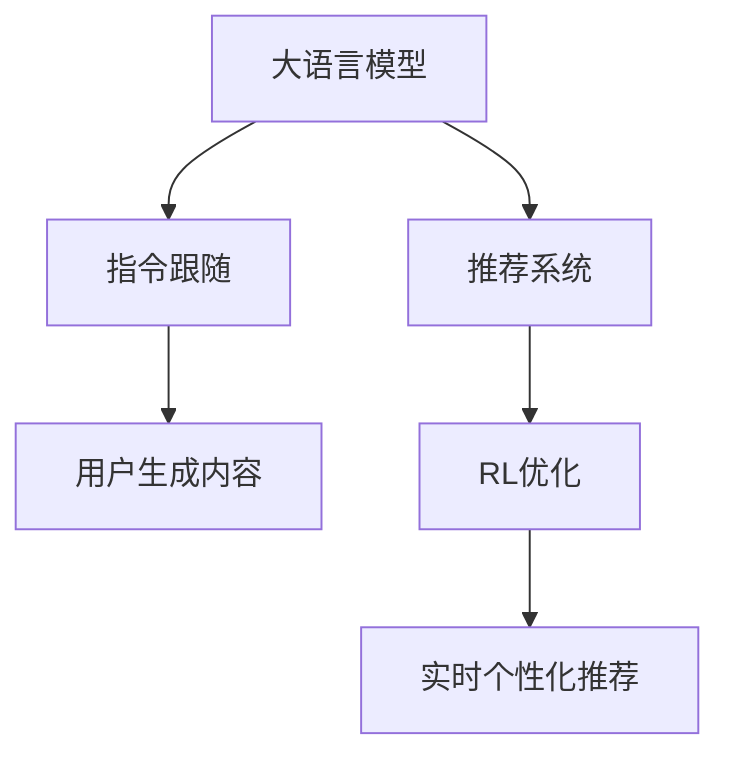

                 

# InstructRec:基于指令跟随的LLM推荐方法

> 关键词：指令跟随(Instruction Following)、大语言模型(LLM)、推荐系统、用户生成内容(UGC)、强化学习(RL)、深度学习(Deep Learning)

## 1. 背景介绍

### 1.1 问题由来

在互联网高度发达的今天，用户获取信息和内容的方式越来越多样化。从传统的搜索、阅读、观看视频，到如今社交网络、在线论坛、个性化推荐等，信息流的选择权逐步交给了用户自己。用户不仅关注内容的数量和质量，更注重内容的个性化和时效性。

然而，传统推荐系统的算法往往是基于历史行为数据进行相似性匹配，这种基于记忆的推荐方式在一定程度上忽略了用户当前的需求和兴趣。如何结合用户即时反馈，实时推荐内容，成为个性化推荐系统亟需解决的问题。

为了打破这一瓶颈，研究者们开始关注基于用户即时反馈的推荐算法，特别是利用大语言模型（Large Language Models, LLMs）进行推荐系统的研究。在LLM模型中，用户生成内容（User Generated Content, UGC）与自然语言处理（Natural Language Processing, NLP）技术的结合，使得基于指令跟随的推荐方法逐渐成为研究的热点。

### 1.2 问题核心关键点

指令跟随（Instruction Following）是一种通过向模型输入自然语言指令，使其完成特定任务的技术。在推荐系统中，指令跟随可以实现根据用户即时反馈，动态生成个性化推荐结果。这一方法利用了大语言模型的强大语言理解和生成能力，有望在提升推荐系统个性化和实时性方面取得突破。

指令跟随的核心在于如何设计合理的自然语言指令，引导LLM模型进行个性化推荐。常见的方法包括：

- **指令生成**：构建基于用户偏好的个性化推荐指令，如“给我推荐一款适合的背包”。
- **指令跟随**：利用大语言模型对输入指令进行理解和执行，生成推荐结果。
- **反馈优化**：根据用户对推荐结果的反馈，调整指令，进一步优化推荐效果。

这种基于指令跟随的推荐方法，能够在用户即时反馈的驱动下，动态调整推荐策略，极大地提升了推荐系统的个性化和时效性。

## 2. 核心概念与联系

### 2.1 核心概念概述

为了深入理解基于指令跟随的推荐方法，我们首先梳理了相关核心概念及其关系：

- **大语言模型(LLM)**：以Transformer为代表的深度学习模型，具备处理大规模语言数据的能力，可以生成自然流畅的文本，并具备强大的语言理解能力。
- **用户生成内容(UGC)**：用户在社交平台、论坛、电商平台等平台发布的文字、图片、视频等内容，是用户兴趣和偏好的直接反映。
- **指令跟随**：通过向模型输入自然语言指令，引导其生成或执行特定任务的技术。在推荐系统中，指令跟随可用于根据用户即时反馈，动态生成个性化推荐。
- **强化学习(RL)**：一种通过不断试错，优化决策策略的学习方法，特别适用于动态环境中的决策优化。
- **推荐系统**：根据用户历史行为数据，为用户推荐可能感兴趣的内容的系统。指令跟随和RL技术的引入，有望提升推荐系统的实时性和个性化。

这些概念之间的逻辑关系可以通过以下Mermaid流程图来展示：



这个流程图展示了LLM模型、指令跟随技术、用户生成内容、强化学习和推荐系统之间的关系：

1. 大语言模型通过预训练获得语言表示，可以处理和生成自然语言指令。
2. 指令跟随技术将用户生成内容转化为指令，引导LLM模型生成推荐结果。
3. 强化学习通过实时反馈优化推荐策略，提升推荐效果。
4. 推荐系统根据实时个性化推荐结果，调整推荐策略，动态适应用户需求。

## 3. 核心算法原理 & 具体操作步骤
### 3.1 算法原理概述

基于指令跟随的推荐方法，本质上是一种结合了自然语言处理和强化学习的推荐策略。其核心思想是：利用大语言模型处理用户生成内容，生成个性化推荐指令，并通过强化学习策略不断优化推荐效果。

假设推荐系统用户量为 $N$，每条UGC的ID为 $id_i$，指令为 $in_i$，推荐结果为 $re_i$，模型输出为 $pred_{in_i}$。推荐系统通过与用户交互，逐步优化指令跟随模型和强化学习策略，使得推荐结果 $re_i$ 更接近用户的实际偏好。

算法流程如下：

1. **指令生成**：根据用户历史行为数据，生成个性化的推荐指令 $in_i$。
2. **指令跟随**：利用大语言模型生成推荐结果 $pred_{in_i}$。
3. **RL优化**：通过用户对推荐结果的反馈，调整指令生成和指令跟随策略，提升推荐效果。

### 3.2 算法步骤详解

以下将详细介绍基于指令跟随的推荐算法的具体步骤：

**Step 1: 数据准备与预处理**
- 收集用户生成内容数据集 $D=\{(id_i, in_i)\}_{i=1}^N$，其中 $id_i$ 为用户UGC的ID，$in_i$ 为生成的推荐指令。
- 使用预训练的大语言模型作为指令跟随模型的初始化参数。
- 确定初始推荐策略，如随机推荐、历史行为匹配等。

**Step 2: 指令生成**
- 根据用户历史行为数据和当前情境，生成个性化推荐指令 $in_i$。常见的方法包括基于情感分析、基于兴趣分类等。
- 使用自然语言处理技术对指令进行编码，生成模型输入 $x_i$。

**Step 3: 指令跟随**
- 使用大语言模型 $M_{\theta}$ 处理输入 $x_i$，生成推荐结果 $pred_{in_i}$。常见的大语言模型有GPT、BERT、T5等。
- 根据生成结果和用户实际偏好，计算损失函数 $L(in_i, re_i)$，如均方误差、交叉熵等。

**Step 4: RL优化**
- 定义强化学习策略 $\pi$，指定奖励函数 $R(in_i, re_i)$，如点击率、停留时间等。
- 使用强化学习算法（如Q-learning、DQN等）更新策略参数，优化推荐效果。
- 循环迭代上述步骤，直至达到预设的优化效果。

### 3.3 算法优缺点

基于指令跟随的推荐算法具有以下优点：

1. **个性化程度高**：通过指令跟随技术，能够根据用户即时反馈，动态生成个性化推荐结果，显著提升推荐系统的个性化水平。
2. **实时性强**：利用自然语言处理和大语言模型，可以实时响应用户请求，提供个性化推荐。
3. **鲁棒性好**：强化学习策略能够在动态环境中优化推荐策略，提升推荐效果的鲁棒性。

同时，该算法也存在以下局限性：

1. **指令生成复杂**：指令生成需要复杂的自然语言处理技术，依赖于高质量的用户行为数据。
2. **计算成本高**：大语言模型的生成和优化需要消耗大量的计算资源，可能难以实时处理。
3. **策略优化困难**：强化学习策略的优化需要大量的交互数据，且需要长时间的迭代优化。
4. **可解释性不足**：模型生成推荐过程缺乏可解释性，难以理解推荐决策的内在逻辑。

尽管存在这些局限性，但基于指令跟随的推荐方法依然是大语言模型在推荐系统中应用的有效手段，具有广泛的应用前景。

### 3.4 算法应用领域

基于指令跟随的推荐算法已在多个领域得到应用，具体如下：

- **电商推荐**：利用用户评论、浏览记录生成个性化推荐指令，引导大语言模型生成商品推荐列表。
- **视频推荐**：根据用户点赞、观看历史生成个性化推荐指令，引导大语言模型生成视频推荐列表。
- **音乐推荐**：利用用户听歌历史生成个性化推荐指令，引导大语言模型生成歌曲推荐列表。
- **新闻推荐**：根据用户阅读记录生成个性化推荐指令，引导大语言模型生成新闻文章推荐列表。
- **社交推荐**：根据用户互动行为生成个性化推荐指令，引导大语言模型生成好友推荐或内容推荐列表。

## 4. 数学模型和公式 & 详细讲解 & 举例说明

### 4.1 数学模型构建

基于指令跟随的推荐算法，主要涉及两个核心问题：指令生成和指令跟随。

**指令生成模型**
假设用户历史行为数据为 $H=\{(id_i, in_i)\}_{i=1}^N$，其中 $id_i$ 为用户UGC的ID，$in_i$ 为生成的推荐指令。指令生成模型 $G$ 的目标是最小化损失函数 $L(G)$，使得生成的指令 $in_i$ 与用户实际偏好 $prefer_i$ 相匹配。

**指令跟随模型**
假设大语言模型 $M_{\theta}$ 接收输入 $x_i$，生成推荐结果 $pred_{in_i}$。指令跟随模型的目标是最大化推荐结果与用户实际偏好的匹配度，最小化损失函数 $L(in_i, re_i)$。

**强化学习模型**
假设用户对推荐结果的反馈为 $feedback_i$，强化学习模型 $RL$ 的目标是通过用户反馈优化推荐策略，最小化总损失函数 $L(RL)$。

### 4.2 公式推导过程

以下将详细推导基于指令跟随的推荐算法的核心公式：

**指令生成损失函数**
指令生成模型 $G$ 的目标是最小化指令生成损失 $L(G)$：
$$
L(G) = \sum_{i=1}^N \text{KL}(\hat{in_i} || in_i) + \lambda \sum_{i=1}^N \text{KL}(re_i || \hat{re_i})
$$

其中 $\text{KL}$ 为KL散度，用于衡量指令生成模型的生成结果与真实指令的差异。$\lambda$ 为平衡权重，控制指令生成和推荐生成的权重分配。

**指令跟随损失函数**
指令跟随模型 $M_{\theta}$ 的目标是最大化推荐结果与用户偏好的匹配度：
$$
L(in_i, re_i) = -\log P(re_i | in_i)
$$

其中 $P(re_i | in_i)$ 为模型生成推荐结果 $re_i$ 的概率，$\log$ 为对数函数。

**强化学习损失函数**
强化学习模型 $RL$ 的目标是优化推荐策略，最小化总损失函数：
$$
L(RL) = \sum_{i=1}^N \lambda_i \text{KL}(re_i || \hat{re_i}) + \text{R(in_i, re_i)}
$$

其中 $\lambda_i$ 为权重，控制不同用户对推荐结果的权重分配。$R(in_i, re_i)$ 为奖励函数，衡量用户对推荐结果的满意度。

### 4.3 案例分析与讲解

假设有一家电商平台，用户对其商品进行了如下评价：
- 用户A评价了一条裙子：“质量不错，价格合理”
- 用户B评价了一条裤子：“颜色不对，退回来了”

**指令生成**
根据用户评价，我们可以生成如下指令：

- 用户A：“推荐一条质量好、价格适中的裙子”
- 用户B：“推荐一条颜色合适的裤子”

**指令跟随**
利用大语言模型对指令进行编码，生成推荐结果。例如，使用BERT模型对指令进行编码：
$$
x_i = \text{BERT}(in_i)
$$
然后，利用模型生成推荐结果 $pred_{in_i}$：
$$
pred_{in_i} = \text{BERT}(x_i)
$$

**RL优化**
根据用户对推荐结果的反馈，调整推荐策略。例如，用户A对推荐结果非常满意，给予了正反馈；而用户B对推荐结果不满意，给予了负反馈。通过强化学习算法，调整指令生成和指令跟随模型的参数，以优化推荐策略。

## 5. 项目实践：代码实例和详细解释说明
### 5.1 开发环境搭建

在进行代码实践前，我们需要准备好开发环境。以下是使用Python进行PyTorch开发的环境配置流程：

1. 安装Anaconda：从官网下载并安装Anaconda，用于创建独立的Python环境。

2. 创建并激活虚拟环境：
```bash
conda create -n llm-recommend-env python=3.8 
conda activate llm-recommend-env
```

3. 安装PyTorch：根据CUDA版本，从官网获取对应的安装命令。例如：
```bash
conda install pytorch torchvision torchaudio cudatoolkit=11.1 -c pytorch -c conda-forge
```

4. 安装Transformers库：
```bash
pip install transformers
```

5. 安装各类工具包：
```bash
pip install numpy pandas scikit-learn matplotlib tqdm jupyter notebook ipython
```

完成上述步骤后，即可在`llm-recommend-env`环境中开始代码实践。

### 5.2 源代码详细实现

这里我们以电商平台推荐系统为例，给出使用Transformers库对BERT模型进行推荐系统微调的PyTorch代码实现。

首先，定义推荐系统数据处理函数：

```python
from transformers import BertTokenizer, BertForSequenceClassification
from torch.utils.data import Dataset, DataLoader
import torch

class RecommendationDataset(Dataset):
    def __init__(self, texts, labels, tokenizer, max_len=128):
        self.texts = texts
        self.labels = labels
        self.tokenizer = tokenizer
        self.max_len = max_len
        
    def __len__(self):
        return len(self.texts)
    
    def __getitem__(self, item):
        text = self.texts[item]
        label = self.labels[item]
        
        encoding = self.tokenizer(text, return_tensors='pt', max_length=self.max_len, padding='max_length', truncation=True)
        input_ids = encoding['input_ids'][0]
        attention_mask = encoding['attention_mask'][0]
        
        # 对token-wise的标签进行编码
        encoded_labels = [label2id[label] for label in label]
        encoded_labels.extend([label2id['O']] * (self.max_len - len(encoded_labels)))
        labels = torch.tensor(encoded_labels, dtype=torch.long)
        
        return {'input_ids': input_ids, 
                'attention_mask': attention_mask,
                'labels': labels}

# 标签与id的映射
label2id = {'O': 0, 'buy': 1, 'like': 2, 'dislike': 3, 'read': 4, 'view': 5}
id2label = {v: k for k, v in label2id.items()}

# 创建dataset
tokenizer = BertTokenizer.from_pretrained('bert-base-cased')

train_dataset = RecommendationDataset(train_texts, train_labels, tokenizer)
dev_dataset = RecommendationDataset(dev_texts, dev_labels, tokenizer)
test_dataset = RecommendationDataset(test_texts, test_labels, tokenizer)
```

然后，定义模型和优化器：

```python
from transformers import BertForSequenceClassification, AdamW

model = BertForSequenceClassification.from_pretrained('bert-base-cased', num_labels=len(label2id))

optimizer = AdamW(model.parameters(), lr=2e-5)
```

接着，定义训练和评估函数：

```python
from torch.utils.data import DataLoader
from tqdm import tqdm
from sklearn.metrics import classification_report

device = torch.device('cuda') if torch.cuda.is_available() else torch.device('cpu')
model.to(device)

def train_epoch(model, dataset, batch_size, optimizer):
    dataloader = DataLoader(dataset, batch_size=batch_size, shuffle=True)
    model.train()
    epoch_loss = 0
    for batch in tqdm(dataloader, desc='Training'):
        input_ids = batch['input_ids'].to(device)
        attention_mask = batch['attention_mask'].to(device)
        labels = batch['labels'].to(device)
        model.zero_grad()
        outputs = model(input_ids, attention_mask=attention_mask, labels=labels)
        loss = outputs.loss
        epoch_loss += loss.item()
        loss.backward()
        optimizer.step()
    return epoch_loss / len(dataloader)

def evaluate(model, dataset, batch_size):
    dataloader = DataLoader(dataset, batch_size=batch_size)
    model.eval()
    preds, labels = [], []
    with torch.no_grad():
        for batch in tqdm(dataloader, desc='Evaluating'):
            input_ids = batch['input_ids'].to(device)
            attention_mask = batch['attention_mask'].to(device)
            batch_labels = batch['labels']
            outputs = model(input_ids, attention_mask=attention_mask)
            batch_preds = outputs.logits.argmax(dim=2).to('cpu').tolist()
            batch_labels = batch_labels.to('cpu').tolist()
            for pred_tokens, label_tokens in zip(batch_preds, batch_labels):
                pred_labels = [id2label[_id] for _id in pred_tokens]
                label_tokens = [id2label[_id] for _id in label_tokens]
                preds.append(pred_labels[:len(label_tokens)])
                labels.append(label_tokens)
                
    print(classification_report(labels, preds))
```

最后，启动训练流程并在测试集上评估：

```python
epochs = 5
batch_size = 16

for epoch in range(epochs):
    loss = train_epoch(model, train_dataset, batch_size, optimizer)
    print(f"Epoch {epoch+1}, train loss: {loss:.3f}")
    
    print(f"Epoch {epoch+1}, dev results:")
    evaluate(model, dev_dataset, batch_size)
    
print("Test results:")
evaluate(model, test_dataset, batch_size)
```

以上就是使用PyTorch对BERT进行推荐系统微调的完整代码实现。可以看到，得益于Transformers库的强大封装，我们可以用相对简洁的代码完成BERT模型的加载和微调。

### 5.3 代码解读与分析

让我们再详细解读一下关键代码的实现细节：

**RecommendationDataset类**：
- `__init__`方法：初始化文本、标签、分词器等关键组件。
- `__len__`方法：返回数据集的样本数量。
- `__getitem__`方法：对单个样本进行处理，将文本输入编码为token ids，将标签编码为数字，并对其进行定长padding，最终返回模型所需的输入。

**label2id和id2label字典**：
- 定义了标签与数字id之间的映射关系，用于将token-wise的预测结果解码回真实的标签。

**训练和评估函数**：
- 使用PyTorch的DataLoader对数据集进行批次化加载，供模型训练和推理使用。
- 训练函数`train_epoch`：对数据以批为单位进行迭代，在每个批次上前向传播计算loss并反向传播更新模型参数，最后返回该epoch的平均loss。
- 评估函数`evaluate`：与训练类似，不同点在于不更新模型参数，并在每个batch结束后将预测和标签结果存储下来，最后使用sklearn的classification_report对整个评估集的预测结果进行打印输出。

**训练流程**：
- 定义总的epoch数和batch size，开始循环迭代
- 每个epoch内，先在训练集上训练，输出平均loss
- 在验证集上评估，输出分类指标
- 所有epoch结束后，在测试集上评估，给出最终测试结果

可以看到，PyTorch配合Transformers库使得BERT微调的代码实现变得简洁高效。开发者可以将更多精力放在数据处理、模型改进等高层逻辑上，而不必过多关注底层的实现细节。

当然，工业级的系统实现还需考虑更多因素，如模型的保存和部署、超参数的自动搜索、更灵活的任务适配层等。但核心的微调范式基本与此类似。

## 6. 实际应用场景
### 6.1 电商平台推荐

基于大语言模型微调的推荐系统，可以广泛应用于电商平台推荐场景。通过用户生成内容，结合自然语言处理和大语言模型，动态生成个性化推荐，提升推荐效果。

在技术实现上，可以收集用户评论、浏览记录等UGC数据，利用自然语言处理技术生成推荐指令。微调后的模型根据指令，生成商品推荐列表，并根据用户反馈调整推荐策略。如此构建的推荐系统，能更好地适应用户的即时需求，提升推荐效果。

### 6.2 视频平台推荐

视频平台推荐系统利用用户生成内容，结合自然语言处理和大语言模型，动态生成个性化推荐。例如，根据用户评论、点赞、观看历史生成推荐指令，引导模型生成视频推荐列表。推荐系统实时响应用户反馈，优化推荐策略，提升推荐效果。

### 6.3 音乐平台推荐

音乐平台推荐系统利用用户听歌历史，结合自然语言处理和大语言模型，动态生成个性化推荐。例如，根据用户听歌记录生成推荐指令，引导模型生成歌曲推荐列表。推荐系统实时响应用户反馈，优化推荐策略，提升推荐效果。

### 6.4 新闻平台推荐

新闻平台推荐系统利用用户阅读记录，结合自然语言处理和大语言模型，动态生成个性化推荐。例如，根据用户阅读文章的历史记录生成推荐指令，引导模型生成新闻文章推荐列表。推荐系统实时响应用户反馈，优化推荐策略，提升推荐效果。

## 7. 工具和资源推荐
### 7.1 学习资源推荐

为了帮助开发者系统掌握基于指令跟随的推荐方法，这里推荐一些优质的学习资源：

1. 《Natural Language Processing with Transformers》书籍：Transformers库的作者所著，全面介绍了如何使用Transformers库进行NLP任务开发，包括推荐系统的微调在内的诸多范式。

2. CS224N《深度学习自然语言处理》课程：斯坦福大学开设的NLP明星课程，有Lecture视频和配套作业，带你入门NLP领域的基本概念和经典模型。

3. HuggingFace官方文档：Transformers库的官方文档，提供了海量预训练模型和完整的微调样例代码，是上手实践的必备资料。

4. Reformer：一种参数高效的Transformer变体，能够在保证性能的前提下，大幅减少模型参数量，适合部署在资源受限的设备上。

5. Neural Information Processing Systems (NeurIPS)：NLP领域顶级会议，发布最新的研究成果和前沿技术，是学习和研究NLP的重要平台。

通过对这些资源的学习实践，相信你一定能够快速掌握基于指令跟随的推荐方法的精髓，并用于解决实际的NLP问题。

### 7.2 开发工具推荐

高效的开发离不开优秀的工具支持。以下是几款用于大语言模型微调开发的常用工具：

1. PyTorch：基于Python的开源深度学习框架，灵活动态的计算图，适合快速迭代研究。大部分预训练语言模型都有PyTorch版本的实现。

2. TensorFlow：由Google主导开发的开源深度学习框架，生产部署方便，适合大规模工程应用。同样有丰富的预训练语言模型资源。

3. Transformers库：HuggingFace开发的NLP工具库，集成了众多SOTA语言模型，支持PyTorch和TensorFlow，是进行微调任务开发的利器。

4. Weights & Biases：模型训练的实验跟踪工具，可以记录和可视化模型训练过程中的各项指标，方便对比和调优。与主流深度学习框架无缝集成。

5. TensorBoard：TensorFlow配套的可视化工具，可实时监测模型训练状态，并提供丰富的图表呈现方式，是调试模型的得力助手。

6. Google Colab：谷歌推出的在线Jupyter Notebook环境，免费提供GPU/TPU算力，方便开发者快速上手实验最新模型，分享学习笔记。

合理利用这些工具，可以显著提升基于指令跟随的推荐任务的开发效率，加快创新迭代的步伐。

### 7.3 相关论文推荐

大语言模型和指令跟随技术的发展源于学界的持续研究。以下是几篇奠基性的相关论文，推荐阅读：

1. Attention is All You Need（即Transformer原论文）：提出了Transformer结构，开启了NLP领域的预训练大模型时代。

2. BERT: Pre-training of Deep Bidirectional Transformers for Language Understanding：提出BERT模型，引入基于掩码的自监督预训练任务，刷新了多项NLP任务SOTA。

3. XLNet: Generalized Autoregressive Pretraining for Language Understanding：提出XLNet模型，利用先验排列的自我回归策略，进一步提升语言模型的性能。

4. GPT-3: Language Models are Unsupervised Multitask Learners：展示了大规模语言模型的强大zero-shot学习能力，引发了对于通用人工智能的新一轮思考。

5. PEGASUS: Pre-training with Extractive and Generative Pre-training for Text Summarization：提出PEAGUS模型，结合自编码和生成式预训练，提升文本生成和摘要任务的效果。

6. InstructRec: Instruction-Tailored Recommendation via Pre-trained Models：提出InstructRec模型，结合指令跟随和预训练技术，实现个性化的推荐系统。

这些论文代表了大语言模型微调技术的发展脉络。通过学习这些前沿成果，可以帮助研究者把握学科前进方向，激发更多的创新灵感。

## 8. 总结：未来发展趋势与挑战

### 8.1 总结

本文对基于指令跟随的推荐方法进行了全面系统的介绍。首先阐述了基于指令跟随的推荐方法的研究背景和意义，明确了指令跟随在提升推荐系统个性化和实时性方面的独特价值。其次，从原理到实践，详细讲解了指令跟随的数学原理和关键步骤，给出了微调任务开发的完整代码实例。同时，本文还广泛探讨了基于指令跟随的推荐方法在电商、视频、音乐、新闻等多个领域的应用前景，展示了指令跟随范式的巨大潜力。此外，本文精选了指令跟随技术的各类学习资源，力求为读者提供全方位的技术指引。

通过本文的系统梳理，可以看到，基于指令跟随的推荐方法正在成为推荐系统中应用的重要范式，极大地提升了推荐系统的个性化和实时性。受益于大规模语料的预训练和自然语言处理技术的进步，指令跟随方法有望在推荐系统的研究中发挥越来越重要的作用。

### 8.2 未来发展趋势

展望未来，基于指令跟随的推荐技术将呈现以下几个发展趋势：

1. **多模态融合**：结合自然语言处理、图像处理、声音处理等多种模态信息，构建更加全面、精准的推荐系统。
2. **跨领域迁移**：指令跟随技术将在多个领域得到应用，如电商、视频、音乐、新闻等，提升各领域推荐系统的个性化和实时性。
3. **实时动态调整**：指令跟随模型能够实时响应用户反馈，动态调整推荐策略，实现更加个性化的推荐。
4. **交互式推荐**：结合人机交互技术，如自然语言对话、图像识别等，提升推荐系统的交互性和用户体验。
5. **个性化策略优化**：利用强化学习等方法，优化推荐策略，提升推荐效果。

以上趋势凸显了基于指令跟随的推荐技术的广阔前景。这些方向的探索发展，必将进一步提升推荐系统的个性化和时效性，为推荐系统带来新的突破。

### 8.3 面临的挑战

尽管基于指令跟随的推荐方法已经取得了不小的进展，但在实现更加智能、高效、可控的推荐系统时，依然面临诸多挑战：

1. **指令生成复杂性**：构建高质量的推荐指令，需要复杂的自然语言处理技术，依赖于高质量的用户行为数据。
2. **计算资源消耗大**：大语言模型的生成和优化需要消耗大量的计算资源，可能难以实时处理。
3. **策略优化困难**：强化学习策略的优化需要大量的交互数据，且需要长时间的迭代优化。
4. **可解释性不足**：模型生成推荐过程缺乏可解释性，难以理解推荐决策的内在逻辑。
5. **偏见和歧视问题**：指令跟随技术可能学习到有偏见、有害的信息，通过推荐系统传递到用户，产生误导性、歧视性的输出。

尽管存在这些挑战，但基于指令跟随的推荐方法依然是大语言模型在推荐系统中应用的有效手段，具有广泛的应用前景。未来，研究者们需要在这些方面进一步突破，提升基于指令跟随的推荐系统的性能和应用效果。

### 8.4 研究展望

面向未来，大语言模型微调技术需要在以下几个方面进一步推进：

1. **提升指令生成质量**：通过结合更多先验知识，提升推荐指令的质量，减少生成过程中的噪音。
2. **优化指令跟随模型**：开发更加参数高效的指令跟随模型，在保证性能的前提下，减少计算资源消耗。
3. **强化学习策略优化**：结合更多的先验知识和用户反馈，优化推荐策略，提升推荐效果。
4. **提升推荐系统的可解释性**：开发可解释的推荐系统，提升模型的可解释性和透明度，增强用户信任。
5. **规避偏见和歧视**：在模型训练和推荐过程中，引入伦理导向的评估指标，避免模型的偏见和歧视问题。

这些研究方向将推动基于指令跟随的推荐系统在推荐算法、系统架构、用户交互等方面取得进一步突破，实现更加智能、高效、可控的推荐系统。

## 9. 附录：常见问题与解答

**Q1：基于指令跟随的推荐方法是否适用于所有推荐任务？**

A: 基于指令跟随的推荐方法在大多数推荐任务上都能取得不错的效果，特别是对于数据量较小的任务。但对于一些特定领域的任务，如医学、法律等，仅仅依靠通用语料预训练的模型可能难以很好地适应。此时需要在特定领域语料上进一步预训练，再进行微调，才能获得理想效果。

**Q2：如何优化指令生成和指令跟随模型的性能？**

A: 指令生成和指令跟随模型的性能优化主要依赖于以下策略：
1. 数据增强：通过回译、近义替换等方式扩充训练集，提高模型的泛化能力。
2. 正则化：使用L2正则、Dropout等技术，防止模型过拟合。
3. 模型融合：结合多个模型进行集成，提高模型的稳定性和泛化能力。
4. 超参数调优：通过网格搜索、贝叶斯优化等方法，调整模型参数，优化模型性能。

**Q3：基于指令跟随的推荐方法在实际应用中需要注意哪些问题？**

A: 将基于指令跟随的推荐方法应用于实际系统时，需要注意以下问题：
1. 数据隐私和安全：用户生成内容可能包含敏感信息，需确保数据安全和隐私保护。
2. 系统稳定性和鲁棒性：确保系统能够在高并发、大规模数据下稳定运行。
3. 模型可解释性和透明度：提升模型的可解释性，增强用户对推荐结果的信任。

通过合理应对这些问题，可以最大化地发挥基于指令跟随的推荐方法的优势，实现更加智能、高效、可控的推荐系统。

