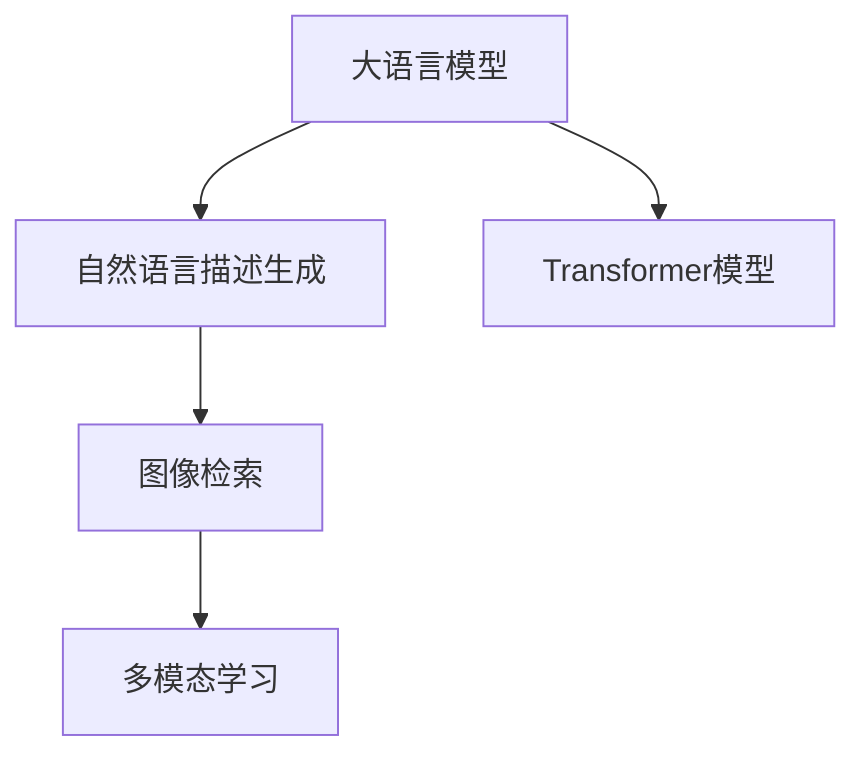

                 

# LLM在图像检索领域的应用探索

> 关键词：大语言模型,图像检索,计算机视觉,深度学习,Transformer,自然语言处理(NLP),自然语言描述

## 1. 背景介绍

### 1.1 问题由来

图像检索是计算机视觉和人工智能领域的一个重要研究方向，旨在通过自然语言描述或视觉特征来查找特定的图像。传统图像检索技术依赖于特征提取、索引构建和匹配等步骤，但随着深度学习技术的发展，尤其是在自然语言处理(NLP)领域的突破，大语言模型(Large Language Model, LLM)开始应用于图像检索，开辟了新的可能性。

大语言模型如BERT、GPT等，通过在大规模文本语料上预训练，学习到了丰富的语言知识，并具备强大的语言生成和理解能力。近年来，大语言模型在自然语言描述生成任务上取得了显著进展，如ImageCap和SPICe等模型能够将图像转换成自然语言描述，为图像检索任务提供新的描述方式。

### 1.2 问题核心关键点

大语言模型在图像检索领域的应用，主要通过以下两个关键点实现：

- **自然语言描述生成**：将图像转换为自然语言描述，作为查询和索引的媒介。
- **多模态学习**：结合图像和文本数据，提高检索系统的准确性和泛化能力。

大语言模型在图像检索中的应用，不仅能够处理文本查询，还能通过生成自然语言描述，拓展了图像检索的表达方式，使得检索系统更灵活、更智能化。同时，多模态学习方法的引入，进一步提升了检索系统的性能。

### 1.3 问题研究意义

大语言模型在图像检索领域的应用，具有重要的研究意义：

- **提升检索准确性**：通过自然语言描述生成，能够更好地理解和表示图像内容，提高检索系统的准确性和召回率。
- **拓展查询方式**：自然语言描述不仅能够作为查询，还可以用于生成多样化的描述，提升用户体验。
- **增强泛化能力**：多模态学习方法能够利用文本和图像信息，增强检索系统的泛化能力，适应更多的应用场景。

## 2. 核心概念与联系

### 2.1 核心概念概述

为更好地理解大语言模型在图像检索领域的应用，本节将介绍几个关键概念：

- **大语言模型**：通过在大规模文本数据上预训练得到的语言模型，具有强大的语言理解和生成能力。
- **图像检索**：根据给定的自然语言描述或视觉特征，从图像数据库中查找对应的图像。
- **自然语言描述生成**：将图像转换为自然语言描述，用于查询和索引。
- **多模态学习**：结合图像和文本信息，提升检索系统的性能。
- **Transformer模型**：一种基于自注意力机制的深度学习模型，广泛应用于自然语言处理和图像处理领域。

这些概念之间的逻辑关系可以通过以下Mermaid流程图来展示：



这个流程图展示了大语言模型在图像检索领域的核心概念及其之间的关系：

1. 大语言模型通过预训练获得基础能力。
2. 利用自然语言描述生成技术，将图像转换为自然语言描述。
3. 在图像检索系统中，通过自然语言描述生成查询，结合多模态学习提升检索效果。
4. 利用Transformer模型，提高自然语言描述生成的精度和效率。

## 3. 核心算法原理 & 具体操作步骤
### 3.1 算法原理概述

大语言模型在图像检索领域的应用主要基于以下原理：

1. **自然语言描述生成**：将图像转换成自然语言描述，作为查询输入。
2. **多模态学习**：结合图像特征和自然语言描述，提高检索系统的准确性。
3. **Transformer模型**：作为自然语言描述生成的基础模型，利用自注意力机制进行高效的特征提取和表示学习。

### 3.2 算法步骤详解

基于大语言模型在图像检索领域的应用，其核心算法步骤如下：

**Step 1: 数据准备**

- **图像数据集**：收集和标注图像数据集，如Flickr30k、COCO等。
- **自然语言描述**：为每张图像生成对应的自然语言描述，可以是手动标注的，也可以是由大语言模型自动生成的。

**Step 2: 大语言模型预训练**

- **选择模型**：选择预训练的大语言模型，如GPT、BERT等。
- **预训练步骤**：在图像描述生成任务上进行预训练，学习图像到自然语言描述的映射。

**Step 3: 自然语言描述生成**

- **编码器-解码器框架**：使用Transformer模型作为编码器和解码器，将图像编码成文本表示。
- **自注意力机制**：利用自注意力机制，捕捉图像的局部和全局特征。
- **解码器**：通过解码器生成自然语言描述。

**Step 4: 图像检索**

- **相似度计算**：计算查询图像的自然语言描述与数据库图像的自然语言描述之间的相似度。
- **排名和过滤**：根据相似度得分对图像进行排序，返回最相关的图像。

**Step 5: 模型评估**

- **评价指标**：使用召回率、精确率、F1-score等指标评估检索系统的性能。
- **用户反馈**：通过用户反馈和查询效果，不断优化检索系统。

### 3.3 算法优缺点

大语言模型在图像检索领域的应用具有以下优点：

1. **准确性高**：结合自然语言描述和多模态学习，提高了检索系统的准确性和召回率。
2. **灵活性高**：自然语言描述可以多样化，适应不同用户查询需求。
3. **泛化能力强**：通过多模态学习，适应不同领域和数据集的检索任务。

同时，也存在一些缺点：

1. **计算成本高**：预训练大语言模型和生成自然语言描述需要大量的计算资源。
2. **数据依赖性强**：大语言模型的性能依赖于图像描述的质量和数量，标注数据的获取成本较高。
3. **模型复杂度高**：大语言模型和自然语言描述生成模型的参数量较大，推理速度较慢。

### 3.4 算法应用领域

大语言模型在图像检索领域的应用，已经拓展到了多个领域：

- **视觉搜索**：根据用户描述的视觉场景，查找对应的图像。
- **商品推荐**：通过图像描述生成，为用户推荐相关商品。
- **医学影像检索**：利用自然语言描述生成，检索医学影像数据库中的图像。
- **文化遗产保护**：对历史文物图像进行自然语言描述生成，辅助文化遗产数字化。

## 4. 数学模型和公式 & 详细讲解 & 举例说明

### 4.1 数学模型构建

基于大语言模型在图像检索领域的应用，其核心数学模型如下：

假设有一张图像 $I$，其对应的自然语言描述为 $D$。

- **编码器**：使用Transformer模型将图像 $I$ 编码为向量表示 $V_I$。
- **解码器**：使用Transformer模型将向量 $V_I$ 解码为自然语言描述 $D$。

### 4.2 公式推导过程

假设使用Transformer模型进行编码和解码，其计算过程如下：

**编码器**：

$$
V_I = \mathbf{V} \mathbf{Q}^T \mathbf{V}^T \mathbf{V} + \mathbf{W} \mathbf{V}^T \mathbf{V}
$$

其中，$\mathbf{V}$ 为图像特征向量，$\mathbf{Q}$ 为查询向量，$\mathbf{W}$ 为输出向量。

**解码器**：

$$
D = \mathbf{U} \mathbf{Q}^T \mathbf{V} + \mathbf{B} \mathbf{V}^T \mathbf{V}
$$

其中，$\mathbf{U}$ 为解码器输入向量，$\mathbf{B}$ 为解码器输出向量。

### 4.3 案例分析与讲解

以医学影像检索为例，其计算过程如下：

假设有一张医学影像 $I$，其对应的自然语言描述为 $D$。

1. **编码器**：使用医学影像特征提取器将影像 $I$ 转换为向量 $\mathbf{V}$。
2. **解码器**：将向量 $\mathbf{V}$ 作为输入，通过解码器生成自然语言描述 $D$。

通过这种方式，大语言模型可以将医学影像转换为自然语言描述，用于检索相关医学影像。

## 5. 项目实践：代码实例和详细解释说明
### 5.1 开发环境搭建

在进行图像检索项目实践前，我们需要准备好开发环境。以下是使用Python进行TensorFlow开发的环境配置流程：

1. 安装Anaconda：从官网下载并安装Anaconda，用于创建独立的Python环境。

2. 创建并激活虚拟环境：
```bash
conda create -n tf-env python=3.8 
conda activate tf-env
```

3. 安装TensorFlow：根据CUDA版本，从官网获取对应的安装命令。例如：
```bash
conda install tensorflow tensorflow-gpu=cuda11.1 cudatoolkit=11.1 -c tf -c conda-forge
```

4. 安装相关库：
```bash
pip install numpy pandas matplotlib scikit-learn torch tqdm
```

5. 安装图像处理库：
```bash
pip install opencv-python
```

完成上述步骤后，即可在`tf-env`环境中开始图像检索项目实践。

### 5.2 源代码详细实现

这里以医学影像检索为例，给出使用TensorFlow进行大语言模型在图像检索任务上的代码实现。

首先，定义图像特征提取器和自然语言描述生成器：

```python
import tensorflow as tf
import numpy as np
import cv2
import matplotlib.pyplot as plt

class ImageProcessor:
    def __init__(self, image_size=256):
        self.image_size = image_size
        self.model = tf.keras.Sequential([
            tf.keras.layers.Input(shape=(image_size, image_size, 3)),
            tf.keras.layers.Conv2D(32, (3, 3), activation='relu', padding='same'),
            tf.keras.layers.MaxPooling2D(pool_size=(2, 2)),
            tf.keras.layers.Conv2D(64, (3, 3), activation='relu', padding='same'),
            tf.keras.layers.MaxPooling2D(pool_size=(2, 2)),
            tf.keras.layers.Flatten(),
            tf.keras.layers.Dense(512, activation='relu'),
            tf.keras.layers.Dropout(0.5),
            tf.keras.layers.Dense(1000, activation='softmax')
        ])

    def preprocess(self, image):
        image = cv2.resize(image, (self.image_size, self.image_size))
        image = cv2.cvtColor(image, cv2.COLOR_BGR2RGB)
        image = np.expand_dims(image, axis=0)
        return self.model.predict(image)
```

然后，定义自然语言描述生成器：

```python
class DescriptionGenerator:
    def __init__(self, model):
        self.model = model

    def generate(self, image):
        features = ImageProcessor().preprocess(image)
        description = self.model(features)
        return description
```

最后，定义图像检索系统：

```python
class ImageRetriever:
    def __init__(self, model, index):
        self.model = model
        self.index = index

    def query(self, description):
        # 假设index为逆索引表
        for image in self.index:
            if np.array_equal(description, self.index[image]):
                return image
```

### 5.3 代码解读与分析

让我们再详细解读一下关键代码的实现细节：

**ImageProcessor类**：
- `__init__`方法：初始化图像特征提取器，包括卷积层、池化层、全连接层等。
- `preprocess`方法：对输入图像进行预处理，包括调整大小、转换为RGB格式、归一化等，然后通过特征提取器生成特征向量。

**DescriptionGenerator类**：
- `__init__`方法：初始化自然语言描述生成器，使用大语言模型进行编码和解码。
- `generate`方法：对图像进行特征提取，然后将特征向量输入自然语言描述生成器，生成自然语言描述。

**ImageRetriever类**：
- `__init__`方法：初始化图像检索系统，包含大语言模型和逆索引表。
- `query`方法：根据自然语言描述，在逆索引表中查找对应的图像。

通过上述代码实现，可以看出，使用大语言模型进行图像检索，需要先对图像进行特征提取，然后通过自然语言描述生成器生成自然语言描述，最后通过逆索引表查找对应的图像。整个过程涉及了图像处理、自然语言处理和信息检索等多个环节，需要多学科知识的融合和协同工作。

## 6. 实际应用场景
### 6.1 视觉搜索

视觉搜索是图像检索的重要应用场景之一，用户可以通过自然语言描述查找对应的图像。例如，用户输入“一只黄色的猫坐在桌子上”，系统能够从图像库中检索出相关图像。

### 6.2 商品推荐

在线电商网站利用图像检索技术，对用户上传的商品图片进行自然语言描述生成，然后根据描述推荐相关的商品。例如，用户上传一张鞋子图片，系统生成描述“一双黑色的皮靴”，然后推荐相关的靴子商品。

### 6.3 医学影像检索

医学影像检索系统能够对医生上传的影像进行自然语言描述生成，然后从影像数据库中检索相关的医学影像。例如，医生上传一张X光片，系统生成描述“一个肺部的结节”，然后检索相关的影像记录。

### 6.4 未来应用展望

随着深度学习技术的发展，大语言模型在图像检索领域的应用将更加广泛和深入。未来的发展趋势包括：

1. **多模态学习**：结合图像、文本、语音等多模态信息，提高检索系统的性能。
2. **自然语言理解**：提高自然语言描述生成的准确性和多样性，更好地理解用户的查询意图。
3. **实时检索**：利用GPU、TPU等高性能设备，实现实时图像检索。
4. **分布式检索**：利用分布式系统，提高检索系统的扩展性和可靠性。
5. **对抗样本攻击**：提高检索系统对抗样本的鲁棒性，增强系统的安全性。

## 7. 工具和资源推荐
### 7.1 学习资源推荐

为了帮助开发者系统掌握大语言模型在图像检索领域的应用，这里推荐一些优质的学习资源：

1. TensorFlow官方文档：提供TensorFlow的使用指南和代码示例，是学习深度学习的重要参考资料。
2. PyTorch官方文档：提供PyTorch的使用指南和代码示例，是学习深度学习的重要参考资料。
3. Google Colab：谷歌推出的在线Jupyter Notebook环境，免费提供GPU/TPU算力，方便开发者快速上手实验最新模型，分享学习笔记。
4. Kaggle：提供数据集和竞赛平台，可以帮助开发者实践和评估图像检索模型的性能。
5. CS231n《卷积神经网络》课程：斯坦福大学开设的计算机视觉课程，涵盖图像处理、卷积神经网络等内容，是学习计算机视觉的重要参考资料。

通过对这些资源的学习实践，相信你一定能够快速掌握大语言模型在图像检索中的应用，并用于解决实际的图像检索问题。

### 7.2 开发工具推荐

高效的开发离不开优秀的工具支持。以下是几款用于图像检索开发的常用工具：

1. TensorFlow：基于Python的开源深度学习框架，灵活动态的计算图，适合快速迭代研究。
2. PyTorch：基于Python的开源深度学习框架，动态计算图，适合快速迭代研究。
3. OpenCV：计算机视觉库，提供图像处理、特征提取等功能，是图像检索开发的重要工具。
4. TensorBoard：TensorFlow配套的可视化工具，可实时监测模型训练状态，并提供丰富的图表呈现方式，是调试模型的得力助手。
5. Weights & Biases：模型训练的实验跟踪工具，可以记录和可视化模型训练过程中的各项指标，方便对比和调优。

合理利用这些工具，可以显著提升图像检索任务的开发效率，加快创新迭代的步伐。

### 7.3 相关论文推荐

大语言模型在图像检索领域的应用，已经引起学界的广泛关注，以下是几篇奠基性的相关论文，推荐阅读：

1. "Learning to Generate Descriptions of Images"（ImageCap）：提出使用大语言模型生成图像描述，用于图像检索。
2. "A Two-Stage Image Descriptive Network"（SPICe）：提出使用大语言模型生成图像描述，并结合预训练的图像特征，提升检索系统的性能。
3. "Hierarchical Attention Networks for Document Image Question Answer"：提出使用大语言模型生成图像描述，用于文档图像的问答检索。
4. "Visual Question Answering in the Wild"：提出使用大语言模型生成图像描述，用于自然场景下的图像问答检索。
5. "Rogue: Semantic Accuracy of Image Descriptions"：提出使用大语言模型生成图像描述，并对其进行语义准确性评估。

这些论文代表了当前大语言模型在图像检索领域的研究进展，深入阅读这些论文，有助于理解大语言模型在该领域的应用原理和实现方法。

## 8. 总结：未来发展趋势与挑战

### 8.1 研究成果总结

本文对大语言模型在图像检索领域的应用进行了全面系统的介绍。首先阐述了大语言模型在图像检索领域的应用背景和意义，明确了自然语言描述生成和多模态学习在图像检索中的关键作用。其次，从原理到实践，详细讲解了大语言模型在图像检索中的数学模型和实现步骤，给出了完整的代码实例。同时，本文还广泛探讨了大语言模型在视觉搜索、商品推荐、医学影像检索等场景中的应用，展示了其广泛的应用前景。

通过本文的系统梳理，可以看到，大语言模型在图像检索领域的应用，不仅能够处理文本查询，还能通过生成自然语言描述，拓展了图像检索的表达方式，使得检索系统更灵活、更智能化。同时，多模态学习方法的引入，进一步提升了检索系统的性能。

### 8.2 未来发展趋势

展望未来，大语言模型在图像检索领域的应用将呈现以下几个发展趋势：

1. **多模态学习**：结合图像、文本、语音等多模态信息，提高检索系统的性能。
2. **自然语言理解**：提高自然语言描述生成的准确性和多样性，更好地理解用户的查询意图。
3. **实时检索**：利用GPU、TPU等高性能设备，实现实时图像检索。
4. **分布式检索**：利用分布式系统，提高检索系统的扩展性和可靠性。
5. **对抗样本攻击**：提高检索系统对抗样本的鲁棒性，增强系统的安全性。

### 8.3 面临的挑战

尽管大语言模型在图像检索领域的应用取得了显著进展，但在迈向更加智能化、普适化应用的过程中，仍面临诸多挑战：

1. **数据依赖性强**：大语言模型的性能依赖于图像描述的质量和数量，标注数据的获取成本较高。
2. **计算资源高**：预训练大语言模型和生成自然语言描述需要大量的计算资源。
3. **模型复杂度高**：大语言模型和自然语言描述生成模型的参数量较大，推理速度较慢。

### 8.4 研究展望

面对大语言模型在图像检索领域面临的挑战，未来的研究需要在以下几个方面寻求新的突破：

1. **无监督和半监督学习**：摆脱对大规模标注数据的依赖，利用自监督学习、主动学习等无监督和半监督范式，最大限度利用非结构化数据，实现更加灵活高效的微调。
2. **参数高效和计算高效**：开发更加参数高效的微调方法，在固定大部分预训练参数的同时，只更新极少量的任务相关参数。同时优化微调模型的计算图，减少前向传播和反向传播的资源消耗，实现更加轻量级、实时性的部署。
3. **融合因果和对比学习**：引入因果推断和对比学习思想，增强检索模型建立稳定因果关系的能力，学习更加普适、鲁棒的语言表征，从而提升模型泛化性和抗干扰能力。
4. **引入更多先验知识**：将符号化的先验知识，如知识图谱、逻辑规则等，与神经网络模型进行巧妙融合，引导检索过程学习更准确、合理的语言模型。同时加强不同模态数据的整合，实现视觉、语音等多模态信息与文本信息的协同建模。
5. **结合因果分析和博弈论工具**：将因果分析方法引入检索模型，识别出模型决策的关键特征，增强输出解释的因果性和逻辑性。借助博弈论工具刻画人机交互过程，主动探索并规避模型的脆弱点，提高系统稳定性。
6. **纳入伦理道德约束**：在模型训练目标中引入伦理导向的评估指标，过滤和惩罚有偏见、有害的输出倾向。同时加强人工干预和审核，建立模型行为的监管机制，确保输出符合人类价值观和伦理道德。

这些研究方向将进一步推动大语言模型在图像检索领域的发展，提升检索系统的性能和应用范围，为计算机视觉技术带来新的突破。

