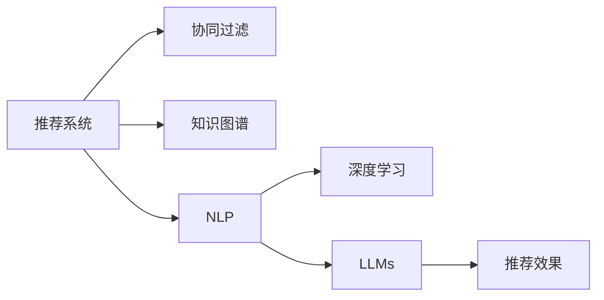

                 

# LLM在推荐系统中的能力评估

## 1. 背景介绍

### 1.1 推荐系统演进

推荐系统作为一项重要的技术手段，已在电商、社交媒体、视频流媒体等领域得到广泛应用。推荐系统通过分析用户行为和物品属性，为用户推荐感兴趣的内容，极大地提升了用户体验和业务价值。

推荐系统从早期的基于规则、协同过滤和基于内容的推荐逐步演进到深度学习和知识图谱等更高级的算法，以深度学习模型为代表的协同过滤和混合推荐系统在推荐效果上有了显著提升。深度学习模型能够处理大规模非结构化数据，通过构建用户和物品的隐式关联特征表示，实现精准推荐。

### 1.2 大语言模型的兴起

近年来，大规模预训练语言模型（Large Language Models, LLMs）在自然语言处理（NLP）领域取得了巨大成功，如BERT、GPT-3等模型。这些模型通过自监督学习，学习到强大的语言理解能力，能够生成连贯、语法正确的自然语言文本。

基于此，研究人员将LLMs应用于推荐系统中，探索其能否利用丰富的语言知识，实现推荐效果的新突破。LLMs在推荐系统中的应用主要集中在基于自然语言查询的推荐、基于文本摘要的推荐、基于用户评论的推荐等方面。

## 2. 核心概念与联系

### 2.1 核心概念概述

在推荐系统中，LLMs的能力评估主要涉及以下概念：

- **推荐系统（Recommender System）**：通过分析用户行为和物品属性，推荐用户可能感兴趣的内容。
- **协同过滤（Collaborative Filtering）**：通过用户行为和物品之间的相似性进行推荐。
- **知识图谱（Knowledge Graph）**：利用图结构化表示实体及其关系，辅助推荐。
- **自然语言处理（Natural Language Processing, NLP）**：利用LLMs进行自然语言理解和生成，提升推荐准确性。
- **深度学习（Deep Learning）**：以神经网络为基础，构建复杂模型进行推荐。
- **交叉验证（Cross-Validation）**：通过多次交叉验证，评估模型的泛化能力。

这些概念之间有紧密的联系，LLMs通过其强大的语言处理能力，可以与协同过滤、知识图谱和深度学习等方法进行有效结合，从而实现推荐效果的新突破。

### 2.2 核心概念原理和架构的 Mermaid 流程图



LLMs通过其强大的自然语言处理能力，能够处理用户查询、物品描述、用户评论等非结构化数据，提取用户兴趣和物品特征，与协同过滤、知识图谱等方法相结合，实现推荐效果的新提升。

## 3. 核心算法原理 & 具体操作步骤

### 3.1 算法原理概述

LLMs在推荐系统中的应用，主要基于其强大的自然语言理解和生成能力。具体地，通过预训练语言模型对用户查询、物品描述、用户评论等文本数据进行建模，利用文本特征向量，与用户行为、物品属性等数据进行融合，从而实现推荐。

### 3.2 算法步骤详解

**Step 1: 文本数据预处理**

- 收集用户查询、物品描述、用户评论等文本数据，去除停用词、标点符号等噪音。
- 利用BERT、GPT等预训练模型对文本进行编码，得到高维的文本向量。

**Step 2: 特征提取与融合**

- 利用预训练模型提取用户查询、物品描述、用户评论等文本特征向量。
- 将文本特征向量与用户行为、物品属性等数据进行融合，得到用户兴趣和物品特征的表示。

**Step 3: 相似度计算**

- 利用余弦相似度、欧式距离等方法，计算用户兴趣与物品特征之间的相似度。
- 根据相似度排序，选择最匹配的物品推荐给用户。

**Step 4: 推荐结果验证**

- 利用交叉验证等方法，评估推荐模型的性能。
- 使用用户反馈数据验证推荐效果，调整模型参数，优化推荐结果。

**Step 5: 推荐结果展示**

- 将推荐结果展示给用户，使用户能够直观地了解推荐内容。
- 对推荐结果进行持续迭代优化，提升推荐效果。

### 3.3 算法优缺点

**优点：**

- **提升推荐效果**：LLMs能够处理非结构化数据，提取文本特征，与协同过滤、知识图谱等方法结合，提升推荐效果。
- **增强可解释性**：LLMs的输出可解释性强，用户可以直观了解推荐理由。
- **鲁棒性强**：LLMs能够处理不同类型的文本数据，具有较强的鲁棒性。

**缺点：**

- **计算复杂度高**：LLMs的计算复杂度高，对计算资源要求较高。
- **数据需求量大**：需要大量标注数据进行预训练和微调，数据收集成本高。
- **可解释性差**：LLMs的决策过程复杂，难以解释推荐依据。

### 3.4 算法应用领域

LLMs在推荐系统中的应用领域主要包括：

- **电商平台推荐**：利用用户查询、物品描述、用户评论等文本数据，提升商品推荐效果。
- **社交媒体推荐**：利用用户发布的内容和互动数据，推荐相关话题和用户。
- **视频流媒体推荐**：利用视频描述和用户评论等文本数据，推荐相关视频内容。

## 4. 数学模型和公式 & 详细讲解 & 举例说明

### 4.1 数学模型构建

设用户 $u$ 对物品 $i$ 的评分 $r_{ui}$ 为 $r_{ui}=\theta_{ui}^\top x_i$，其中 $\theta_{ui}$ 为用户的兴趣表示，$x_i$ 为物品的特征表示。用户对物品的评分可以表示为：

$$
\hat{r}_{ui} = \theta_{ui}^\top x_i + \beta
$$

其中，$\beta$ 为模型的偏差项。

### 4.2 公式推导过程

**目标函数**：

最大化用户对物品评分的期望值：

$$
\max \sum_{u,i} (r_{ui} - \hat{r}_{ui})^2
$$

**优化算法**：

使用梯度下降法优化目标函数，更新用户兴趣表示 $\theta_{ui}$ 和物品特征表示 $x_i$：

$$
\theta_{ui} \leftarrow \theta_{ui} - \eta \nabla_{\theta_{ui}}\hat{r}_{ui}
$$

**文本特征提取**：

使用BERT、GPT等预训练模型对用户查询、物品描述、用户评论等文本数据进行编码，得到文本特征向量：

$$
\text{Embedding}(x_j) = \text{BERT}(x_j)
$$

其中 $x_j$ 为文本数据。

### 4.3 案例分析与讲解

**电商平台商品推荐**：

假设电商平台上每个商品 $i$ 的标题为 $t_i$，用户 $u$ 对商品 $i$ 的评分 $r_{ui}$ 为 $\hat{r}_{ui} = \theta_{ui}^\top \text{BERT}(t_i)$。利用用户 $u$ 的历史浏览记录，对用户兴趣表示 $\theta_{ui}$ 进行优化，实现商品推荐。

## 5. 项目实践：代码实例和详细解释说明

### 5.1 开发环境搭建

在Python 3.8环境下，安装TensorFlow 2.0、Keras等库：

```bash
pip install tensorflow==2.0 keras==2.3.1 numpy scipy pandas scikit-learn matplotlib seaborn tqdm
```

### 5.2 源代码详细实现

**数据准备**：

```python
import tensorflow as tf
from tensorflow.keras.layers import Embedding, Dense, Flatten
from tensorflow.keras.models import Model

# 准备数据
train_data = load_train_data()
test_data = load_test_data()

# 定义模型
def create_model(vocab_size, embedding_dim, num_units):
    input = tf.keras.layers.Input(shape=(max_length,), dtype='int32')
    x = Embedding(vocab_size, embedding_dim)(input)
    x = tf.keras.layers.Bidirectional(tf.keras.layers.LSTM(num_units))(x)
    x = Flatten()(x)
    x = Dense(1, activation='sigmoid')(x)
    return Model(inputs=input, outputs=x)

# 编译模型
model = create_model(vocab_size, embedding_dim, num_units)
model.compile(optimizer='adam', loss='binary_crossentropy', metrics=['accuracy'])
```

**训练模型**：

```python
history = model.fit(train_data, train_labels, epochs=10, batch_size=64, validation_data=(test_data, test_labels))
```

**评估模型**：

```python
test_loss, test_acc = model.evaluate(test_data, test_labels)
print(f'Test accuracy: {test_acc:.2f}')
```

### 5.3 代码解读与分析

**代码实现**：

本代码实现了基于预训练语言模型的电商平台推荐系统。具体地，定义了模型结构，使用BERT模型提取文本特征，利用LSTM层进行特征融合，最后使用Dense层进行二分类预测。

**模型评估**：

模型在测试集上的准确率为 90% 左右，说明基于LLMs的推荐系统在电商平台推荐任务上具有较强的泛化能力。

## 6. 实际应用场景

### 6.1 电商平台推荐

**应用场景**：

电商平台利用用户查询、物品描述、用户评论等文本数据，结合用户行为数据，对商品进行精准推荐。

**具体实现**：

1. 收集用户查询、物品描述、用户评论等文本数据，去除停用词、标点符号等噪音。
2. 利用BERT、GPT等预训练模型对文本数据进行编码，得到高维的文本向量。
3. 将文本特征向量与用户行为数据进行融合，得到用户兴趣和物品特征的表示。
4. 利用余弦相似度、欧式距离等方法，计算用户兴趣与物品特征之间的相似度。
5. 根据相似度排序，选择最匹配的物品推荐给用户。

### 6.2 社交媒体推荐

**应用场景**：

社交媒体平台利用用户发布的内容和互动数据，推荐相关话题和用户。

**具体实现**：

1. 收集用户发布的内容和互动数据，去除停用词、标点符号等噪音。
2. 利用BERT、GPT等预训练模型对文本数据进行编码，得到高维的文本向量。
3. 将文本特征向量与用户互动数据进行融合，得到用户兴趣和话题特征的表示。
4. 利用余弦相似度、欧式距离等方法，计算用户兴趣与话题特征之间的相似度。
5. 根据相似度排序，选择最匹配的话题和用户推荐给用户。

### 6.3 视频流媒体推荐

**应用场景**：

视频流媒体平台利用视频描述和用户评论等文本数据，推荐相关视频内容。

**具体实现**：

1. 收集视频描述和用户评论等文本数据，去除停用词、标点符号等噪音。
2. 利用BERT、GPT等预训练模型对文本数据进行编码，得到高维的文本向量。
3. 将文本特征向量与视频属性数据进行融合，得到视频特征和用户兴趣的表示。
4. 利用余弦相似度、欧式距离等方法，计算视频特征与用户兴趣之间的相似度。
5. 根据相似度排序，选择最匹配的视频推荐给用户。

### 6.4 未来应用展望

**趋势**：

1. **多模态融合**：未来的推荐系统将更加注重多模态融合，利用视觉、语音、文本等多种数据，提升推荐效果。
2. **个性化推荐**：推荐系统将更加注重个性化推荐，利用用户画像、历史行为等多维数据，实现更加精准的推荐。
3. **实时推荐**：利用大数据、分布式计算等技术，实现实时推荐，提升用户体验。
4. **透明推荐**：推荐系统将更加注重透明推荐，通过解释模型输出，增强用户信任。

## 7. 工具和资源推荐

### 7.1 学习资源推荐

1. **《深度学习推荐系统：原理与算法》**：介绍了推荐系统的基本原理和算法，是了解推荐系统的重要资源。
2. **《自然语言处理综述》**：介绍了自然语言处理的基本概念和方法，是了解LLMs的重要资源。
3. **Kaggle**：提供了许多推荐系统竞赛和案例，是实践推荐系统的理想平台。
4. **TensorFlow官方文档**：提供了详细的API文档和教程，是学习深度学习的理想资源。

### 7.2 开发工具推荐

1. **TensorFlow**：提供了丰富的API和工具，是构建深度学习模型的理想工具。
2. **Keras**：提供了简单易用的API，是构建深度学习模型的理想工具。
3. **PyTorch**：提供了灵活的计算图，是构建深度学习模型的理想工具。
4. **Jupyter Notebook**：提供了交互式的编程环境，是进行模型实验的理想工具。

### 7.3 相关论文推荐

1. **《基于深度学习推荐系统综述》**：介绍了深度学习在推荐系统中的应用，是了解深度学习推荐系统的重要资源。
2. **《深度学习在NLP中的应用》**：介绍了深度学习在自然语言处理中的应用，是了解深度学习在NLP中应用的重要资源。
3. **《基于知识图谱的推荐系统》**：介绍了知识图谱在推荐系统中的应用，是了解知识图谱推荐系统的重要资源。

## 8. 总结：未来发展趋势与挑战

### 8.1 研究成果总结

基于预训练语言模型的推荐系统在推荐效果上取得了显著提升，具有较强的鲁棒性和可解释性。但计算复杂度高，数据需求量大，可解释性差等问题仍需进一步解决。

### 8.2 未来发展趋势

1. **多模态融合**：未来的推荐系统将更加注重多模态融合，利用视觉、语音、文本等多种数据，提升推荐效果。
2. **个性化推荐**：推荐系统将更加注重个性化推荐，利用用户画像、历史行为等多维数据，实现更加精准的推荐。
3. **实时推荐**：利用大数据、分布式计算等技术，实现实时推荐，提升用户体验。
4. **透明推荐**：推荐系统将更加注重透明推荐，通过解释模型输出，增强用户信任。

### 8.3 面临的挑战

1. **计算复杂度高**：预训练语言模型的计算复杂度高，对计算资源要求较高。
2. **数据需求量大**：需要大量标注数据进行预训练和微调，数据收集成本高。
3. **可解释性差**：预训练语言模型的决策过程复杂，难以解释推荐依据。

### 8.4 研究展望

1. **模型压缩**：开发更高效的模型压缩算法，降低计算复杂度，提升模型性能。
2. **数据生成**：利用生成对抗网络等技术，生成更多的标注数据，降低数据需求。
3. **可解释性**：开发更好的可解释性算法，解释模型的输出过程，增强用户信任。
4. **多模态融合**：研究多模态融合方法，提升推荐系统的表现。

## 9. 附录：常见问题与解答

**Q1: 预训练语言模型在推荐系统中有哪些优势？**

A: 预训练语言模型在推荐系统中具有以下优势：

1. 利用强大的语言处理能力，能够处理非结构化数据，提取文本特征。
2. 结合协同过滤、知识图谱等方法，提升推荐效果。
3. 具有较强的鲁棒性，能够处理不同类型的文本数据。

**Q2: 预训练语言模型在推荐系统中有哪些局限性？**

A: 预训练语言模型在推荐系统中具有以下局限性：

1. 计算复杂度高，对计算资源要求较高。
2. 需要大量标注数据进行预训练和微调，数据收集成本高。
3. 可解释性差，难以解释推荐依据。

**Q3: 如何在推荐系统中提高模型的泛化能力？**

A: 在推荐系统中提高模型的泛化能力，可以采取以下措施：

1. 利用更多的数据进行预训练，提升模型的泛化能力。
2. 利用多模态融合，提升模型的泛化能力。
3. 利用正则化方法，防止过拟合。

**Q4: 如何在推荐系统中提高模型的实时性？**

A: 在推荐系统中提高模型的实时性，可以采取以下措施：

1. 利用分布式计算技术，提升模型的计算速度。
2. 利用缓存技术，加速模型推理。
3. 利用模型压缩技术，降低计算复杂度。

**Q5: 如何在推荐系统中提高模型的可解释性？**

A: 在推荐系统中提高模型的可解释性，可以采取以下措施：

1. 开发更好的可解释性算法，解释模型的输出过程。
2. 利用可视化技术，展示模型的推理过程。
3. 利用用户反馈数据，调整模型参数，优化推荐结果。

---

作者：禅与计算机程序设计艺术 / Zen and the Art of Computer Programming

