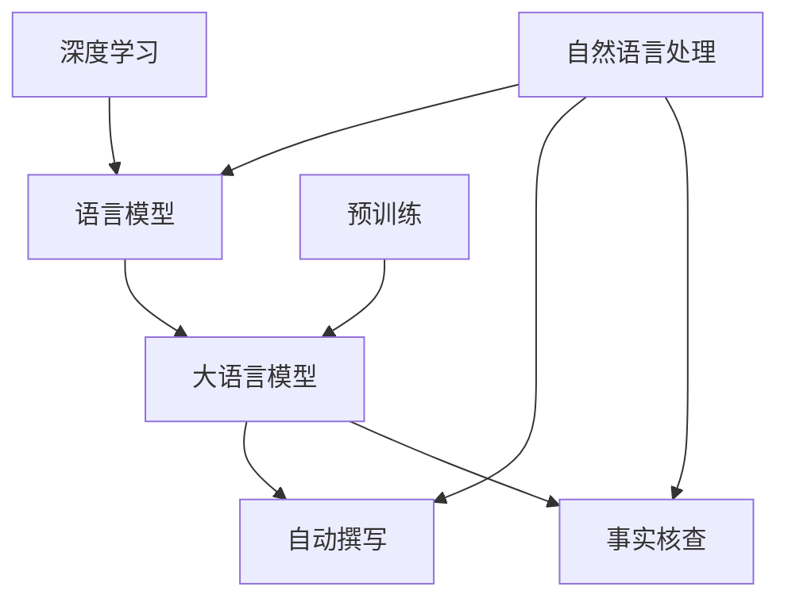

                 

# LLM在新闻业中的应用：自动撰写和事实核查

> 关键词：自然语言处理,深度学习,新闻业,自动撰写,事实核查

## 1. 背景介绍

### 1.1 问题由来
随着数字媒体的快速发展，新闻业面临着前所未有的挑战。一方面，读者对新闻内容的需求日益增加，期望新闻能迅速、准确地提供最新信息。另一方面，高质量的原创内容制作成本高、耗时长，人力物力投入巨大，难以满足不断增长的发布频率需求。因此，探索自动化技术在新闻业中的应用，以提升内容生产效率和质量，成为亟待解决的问题。

### 1.2 问题核心关键点
大语言模型（LLM）在新闻业中的应用，主要体现在两个方面：

- **自动撰写**：利用预训练的语言模型，在有限的人类干预下，自动生成新闻文章。自动撰写能够快速生成大量新闻稿件，显著降低新闻制作成本，并提高内容发布的速度和频率。
- **事实核查**：利用大语言模型的语言理解能力，自动检测新闻文章中可能存在的事实错误和信息偏差。事实核查能够提高新闻的真实性和可信度，降低谣言和假新闻的传播风险。

这两个应用场景对新闻业的数字化转型具有重要意义，可以大幅度提升新闻机构的运营效率和内容质量。

## 2. 核心概念与联系

### 2.1 核心概念概述

为了更好地理解大语言模型在新闻业中的应用，本节将介绍几个关键概念：

- **自然语言处理（NLP）**：专注于计算机与人类语言交互的领域，涵盖文本预处理、语言模型、文本分类、命名实体识别、文本生成等任务。NLP技术是自动撰写和事实核查的核心技术基础。

- **深度学习**：一种基于人工神经网络的机器学习技术，能够处理大规模、高维度数据。深度学习在大语言模型中的应用，使得模型能够理解复杂的语言结构和语义信息，从而进行自动撰写和事实核查。

- **大语言模型（LLM）**：指通过大规模无标签数据预训练得到的语言模型，如GPT、BERT等。LLM具有强大的语言理解和生成能力，能够理解和生成自然语言，适用于自动撰写和事实核查任务。

- **自动撰写（Automatic Writing）**：利用大语言模型自动生成新闻稿件的过程。自动撰写能够提高新闻的生产效率，降低人力成本。

- **事实核查（Fact Checking）**：利用大语言模型自动检测新闻文章中可能存在的事实错误和信息偏差的过程。事实核查能够提高新闻的真实性和可信度，降低谣言和假新闻的传播风险。

- **语言模型（Language Model）**：指能够预测下一个词汇或字符的统计模型，如n-gram模型、RNN、Transformer等。语言模型是自动撰写和事实核查的基础。

- **预训练（Pre-training）**：指在大规模无标签数据上训练语言模型的过程，如BERT、GPT等。预训练使得模型能够学习通用的语言表示，适用于各种NLP任务。

这些核心概念之间的逻辑关系可以通过以下Mermaid流程图来展示：



这个流程图展示了大语言模型在新闻业中的核心概念及其之间的关系：

1. 自然语言处理和大语言模型共同构成了NLP的基础。
2. 深度学习技术为大语言模型的预训练提供了重要支持。
3. 自动撰写和事实核查是LLM在新闻业中的两个主要应用场景。
4. 预训练过程为自动撰写和事实核查任务提供了通用的语言表示。

这些概念共同构成了大语言模型在新闻业中的应用框架，使得LLM能够有效应对自动化和信息准确性的双重挑战。

## 3. 核心算法原理 & 具体操作步骤
### 3.1 算法原理概述

基于大语言模型的自动撰写和事实核查方法，其核心思想是利用大语言模型强大的语言理解和生成能力，通过有监督学习进行任务特定的优化，从而实现自动化撰写和事实核查。

具体而言，假设预训练语言模型为 $M_{\theta}$，其中 $\theta$ 为预训练得到的模型参数。给定新闻文章 $A$ 和对应的文章摘要 $S$，自动撰写的目标是最小化语言模型的输出与摘要之间的差异，即：

$$
\hat{\theta}=\mathop{\arg\min}_{\theta} \mathcal{L}(M_{\theta}(A),S)
$$

其中 $\mathcal{L}$ 为损失函数，通常采用交叉熵损失。

事实核查的任务是检测文章中可能存在的事实错误和信息偏差。假设文章中存在 $n$ 个可能的事实错误，记为 $E_1, E_2, \ldots, E_n$。事实核查的目标是最小化模型对事实错误的预测误差，即：

$$
\hat{\theta}=\mathop{\arg\min}_{\theta} \sum_{i=1}^n \mathcal{L}_{fact}(E_i)
$$

其中 $\mathcal{L}_{fact}$ 为事实错误的损失函数，可以采用分类损失等。

### 3.2 算法步骤详解

基于大语言模型的自动撰写和事实核查方法，一般包括以下几个关键步骤：

**Step 1: 准备预训练模型和数据集**
- 选择合适的预训练语言模型 $M_{\theta}$ 作为初始化参数，如 GPT、BERT 等。
- 准备新闻文章的摘要和事实错误的数据集 $D=\{(S_i,A_i)\}_{i=1}^N$，其中 $S_i$ 为文章摘要，$A_i$ 为文章，$E_i$ 为可能的事实错误。

**Step 2: 添加任务适配层**
- 对于自动撰写任务，在预训练模型顶层设计合适的生成器，并使用交叉熵损失函数。
- 对于事实核查任务，在预训练模型顶层设计事实错误分类器，并使用分类损失函数。

**Step 3: 设置微调超参数**
- 选择合适的优化算法及其参数，如 Adam、SGD 等，设置学习率、批大小、迭代轮数等。
- 设置正则化技术及强度，包括权重衰减、Dropout、Early Stopping 等。
- 确定冻结预训练参数的策略，如仅微调顶层，或全部参数都参与微调。

**Step 4: 执行梯度训练**
- 将训练集数据分批次输入模型，前向传播计算损失函数。
- 反向传播计算参数梯度，根据设定的优化算法和学习率更新模型参数。
- 周期性在验证集上评估模型性能，根据性能指标决定是否触发 Early Stopping。
- 重复上述步骤直到满足预设的迭代轮数或 Early Stopping 条件。

**Step 5: 测试和部署**
- 在测试集上评估自动撰写或事实核查后模型 $M_{\hat{\theta}}$ 的性能，对比微调前后的精度提升。
- 使用微调后的模型对新文章进行自动撰写或事实核查，集成到实际的应用系统中。
- 持续收集新的文章和事实错误数据，定期重新微调模型，以适应数据分布的变化。

以上是基于大语言模型的自动撰写和事实核查的一般流程。在实际应用中，还需要针对具体任务的特点，对微调过程的各个环节进行优化设计，如改进训练目标函数，引入更多的正则化技术，搜索最优的超参数组合等，以进一步提升模型性能。

### 3.3 算法优缺点

基于大语言模型的自动撰写和事实核查方法具有以下优点：
1. 自动化程度高。利用预训练语言模型的强大语言理解能力，能够自动完成新闻撰写和事实核查，大幅减少人力投入。
2. 适应性强。预训练语言模型可以在各种新闻文章上应用，无需从头训练，适应不同领域的文本数据。
3. 精度高。利用大语言模型的深度学习模型，能够处理复杂的语言结构和语义信息，提高自动撰写和事实核查的准确性。
4. 更新速度快。大语言模型能够迅速适应新数据和新任务，快速更新自动撰写和事实核查模型。

同时，该方法也存在一定的局限性：
1. 依赖标注数据。自动撰写和事实核查的效果很大程度上取决于标注数据的质量和数量，获取高质量标注数据的成本较高。
2. 迁移能力有限。当目标任务与预训练数据的分布差异较大时，自动撰写和事实核查的性能提升有限。
3. 可解释性不足。大语言模型决策过程缺乏可解释性，难以对其推理逻辑进行分析和调试。

尽管存在这些局限性，但就目前而言，基于大语言模型的自动撰写和事实核查方法仍是最主流范式。未来相关研究的重点在于如何进一步降低自动撰写和事实核查对标注数据的依赖，提高模型的少样本学习和跨领域迁移能力，同时兼顾可解释性和伦理安全性等因素。

### 3.4 算法应用领域

基于大语言模型的自动撰写和事实核查方法，在新闻业中已经得到了广泛的应用，涵盖了以下领域：

- **自动撰写**：自动生成新闻稿件、文章摘要、新闻标题等。适用于新闻机构内的新闻编辑和记者辅助工作，提高新闻制作效率。
- **事实核查**：检测新闻文章中的事实错误和信息偏差，提高新闻的真实性和可信度。适用于新闻机构的编辑和审核流程，减少谣言和假新闻的传播。
- **新闻推荐**：根据用户的历史浏览记录和兴趣偏好，推荐相关新闻文章。适用于新闻聚合平台和个性化新闻订阅服务。
- **情感分析**：分析用户对新闻事件的情感倾向，辅助新闻机构的舆情监测和受众分析。适用于新闻机构的社交媒体监测和舆论分析系统。
- **多语言翻译**：自动将新闻文章翻译成多种语言，扩大新闻的传播范围和覆盖面。适用于国际新闻机构和全球化媒体平台。

除了上述这些经典应用外，基于大语言模型的自动撰写和事实核查方法还被创新性地应用到更多场景中，如可控文本生成、常识推理、代码生成、数据增强等，为新闻业的发展带来了新的突破。

## 4. 数学模型和公式 & 详细讲解  
### 4.1 数学模型构建

本节将使用数学语言对基于大语言模型的自动撰写和事实核查过程进行更加严格的刻画。

记预训练语言模型为 $M_{\theta}$，其中 $\theta$ 为模型参数。假设自动撰写的训练集为 $D_{w}=\{(S_i,A_i)\}_{i=1}^N$，其中 $S_i$ 为文章摘要，$A_i$ 为文章。假设事实核查的训练集为 $D_{f}=\{(A_i,E_i)\}_{i=1}^N$，其中 $A_i$ 为文章，$E_i$ 为可能的事实错误。

定义模型 $M_{\theta}$ 在数据样本 $(x,y)$ 上的损失函数为 $\ell(M_{\theta}(x),y)$，则在数据集 $D$ 上的经验风险为：

$$
\mathcal{L}(\theta) = \frac{1}{N} \sum_{i=1}^N \ell(M_{\theta}(S_i),A_i)
$$

对于事实核查任务，定义模型 $M_{\theta}$ 在数据样本 $(x,y)$ 上的损失函数为 $\ell_{fact}(M_{\theta}(x),y)$，则在数据集 $D$ 上的经验风险为：

$$
\mathcal{L}_{fact}(\theta) = \frac{1}{N} \sum_{i=1}^N \ell_{fact}(M_{\theta}(A_i),E_i)
$$

微调的优化目标是最小化经验风险，即找到最优参数：

$$
\theta^* = \mathop{\arg\min}_{\theta} \mathcal{L}(\theta)
$$

在实践中，我们通常使用基于梯度的优化算法（如SGD、Adam等）来近似求解上述最优化问题。设 $\eta$ 为学习率，$\lambda$ 为正则化系数，则参数的更新公式为：

$$
\theta \leftarrow \theta - \eta \nabla_{\theta}\mathcal{L}(\theta) - \eta\lambda\theta
$$

其中 $\nabla_{\theta}\mathcal{L}(\theta)$ 为损失函数对参数 $\theta$ 的梯度，可通过反向传播算法高效计算。

### 4.2 公式推导过程

以下我们以事实核查任务为例，推导分类损失函数的计算公式。

假设文章 $A_i$ 中的 $n$ 个事实错误被标注为 $E_{i1}, E_{i2}, \ldots, E_{in}$，模型对每个事实错误的预测结果为 $p_1, p_2, \ldots, p_n$。则事实核查的损失函数可以定义为：

$$
\ell_{fact}(M_{\theta}(A_i),E_i) = -\sum_{j=1}^n [y_j\log p_j + (1-y_j)\log (1-p_j)]
$$

其中 $y_j$ 为 $E_{ij}$ 是否为事实错误的二元标签，$p_j$ 为模型预测 $E_{ij}$ 为事实错误的概率。

将事实核查损失函数代入经验风险公式，得：

$$
\mathcal{L}_{fact}(\theta) = -\frac{1}{N}\sum_{i=1}^N \sum_{j=1}^n [y_j\log p_j + (1-y_j)\log (1-p_j)]
$$

根据链式法则，损失函数对参数 $\theta_k$ 的梯度为：

$$
\frac{\partial \mathcal{L}_{fact}(\theta)}{\partial \theta_k} = -\frac{1}{N}\sum_{i=1}^N \sum_{j=1}^n \left(\frac{y_j}{p_j} - \frac{1-y_j}{1-p_j}\right) \frac{\partial M_{\theta}(A_i)}{\partial \theta_k}
$$

其中 $\frac{\partial M_{\theta}(A_i)}{\partial \theta_k}$ 可进一步递归展开，利用自动微分技术完成计算。

在得到事实核查任务的损失函数梯度后，即可带入参数更新公式，完成模型的迭代优化。重复上述过程直至收敛，最终得到适应事实核查任务的最优模型参数 $\theta^*$。

## 5. 项目实践：代码实例和详细解释说明
### 5.1 开发环境搭建

在进行微调实践前，我们需要准备好开发环境。以下是使用Python进行PyTorch开发的环境配置流程：

1. 安装Anaconda：从官网下载并安装Anaconda，用于创建独立的Python环境。

2. 创建并激活虚拟环境：
```bash
conda create -n pytorch-env python=3.8 
conda activate pytorch-env
```

3. 安装PyTorch：根据CUDA版本，从官网获取对应的安装命令。例如：
```bash
conda install pytorch torchvision torchaudio cudatoolkit=11.1 -c pytorch -c conda-forge
```

4. 安装Transformers库：
```bash
pip install transformers
```

5. 安装各类工具包：
```bash
pip install numpy pandas scikit-learn matplotlib tqdm jupyter notebook ipython
```

完成上述步骤后，即可在`pytorch-env`环境中开始微调实践。

### 5.2 源代码详细实现

这里我们以事实核查任务为例，给出使用Transformers库对BERT模型进行微调的PyTorch代码实现。

首先，定义事实核查任务的数据处理函数：

```python
from transformers import BertTokenizer
from torch.utils.data import Dataset
import torch

class FactCheckDataset(Dataset):
    def __init__(self, texts, labels, tokenizer, max_len=128):
        self.texts = texts
        self.labels = labels
        self.tokenizer = tokenizer
        self.max_len = max_len
        
    def __len__(self):
        return len(self.texts)
    
    def __getitem__(self, item):
        text = self.texts[item]
        label = self.labels[item]
        
        encoding = self.tokenizer(text, return_tensors='pt', max_length=self.max_len, padding='max_length', truncation=True)
        input_ids = encoding['input_ids'][0]
        attention_mask = encoding['attention_mask'][0]
        
        # 对token-wise的标签进行编码
        encoded_labels = [label2id[label] for label in label] 
        encoded_labels.extend([label2id['O']] * (self.max_len - len(encoded_labels)))
        labels = torch.tensor(encoded_labels, dtype=torch.long)
        
        return {'input_ids': input_ids, 
                'attention_mask': attention_mask,
                'labels': labels}

# 标签与id的映射
label2id = {'O': 0, 'B': 1, 'I': 2}
id2label = {v: k for k, v in label2id.items()}

# 创建dataset
tokenizer = BertTokenizer.from_pretrained('bert-base-cased')

train_dataset = FactCheckDataset(train_texts, train_labels, tokenizer)
dev_dataset = FactCheckDataset(dev_texts, dev_labels, tokenizer)
test_dataset = FactCheckDataset(test_texts, test_labels, tokenizer)
```

然后，定义模型和优化器：

```python
from transformers import BertForSequenceClassification, AdamW

model = BertForSequenceClassification.from_pretrained('bert-base-cased', num_labels=len(label2id))

optimizer = AdamW(model.parameters(), lr=2e-5)
```

接着，定义训练和评估函数：

```python
from torch.utils.data import DataLoader
from tqdm import tqdm
from sklearn.metrics import classification_report

device = torch.device('cuda') if torch.cuda.is_available() else torch.device('cpu')
model.to(device)

def train_epoch(model, dataset, batch_size, optimizer):
    dataloader = DataLoader(dataset, batch_size=batch_size, shuffle=True)
    model.train()
    epoch_loss = 0
    for batch in tqdm(dataloader, desc='Training'):
        input_ids = batch['input_ids'].to(device)
        attention_mask = batch['attention_mask'].to(device)
        labels = batch['labels'].to(device)
        model.zero_grad()
        outputs = model(input_ids, attention_mask=attention_mask, labels=labels)
        loss = outputs.loss
        epoch_loss += loss.item()
        loss.backward()
        optimizer.step()
    return epoch_loss / len(dataloader)

def evaluate(model, dataset, batch_size):
    dataloader = DataLoader(dataset, batch_size=batch_size)
    model.eval()
    preds, labels = [], []
    with torch.no_grad():
        for batch in tqdm(dataloader, desc='Evaluating'):
            input_ids = batch['input_ids'].to(device)
            attention_mask = batch['attention_mask'].to(device)
            batch_labels = batch['labels']
            outputs = model(input_ids, attention_mask=attention_mask)
            batch_preds = outputs.logits.argmax(dim=2).to('cpu').tolist()
            batch_labels = batch_labels.to('cpu').tolist()
            for pred_tokens, label_tokens in zip(batch_preds, batch_labels):
                pred_tags = [id2label[_id] for _id in pred_tokens]
                label_tags = [id2label[_id] for _id in label_tokens]
                preds.append(pred_tags[:len(label_tokens)])
                labels.append(label_tags)
                
    print(classification_report(labels, preds))
```

最后，启动训练流程并在测试集上评估：

```python
epochs = 5
batch_size = 16

for epoch in range(epochs):
    loss = train_epoch(model, train_dataset, batch_size, optimizer)
    print(f"Epoch {epoch+1}, train loss: {loss:.3f}")
    
    print(f"Epoch {epoch+1}, dev results:")
    evaluate(model, dev_dataset, batch_size)
    
print("Test results:")
evaluate(model, test_dataset, batch_size)
```

以上就是使用PyTorch对BERT进行事实核查任务微调的完整代码实现。可以看到，得益于Transformers库的强大封装，我们可以用相对简洁的代码完成BERT模型的加载和微调。

### 5.3 代码解读与分析

让我们再详细解读一下关键代码的实现细节：

**FactCheckDataset类**：
- `__init__`方法：初始化文本、标签、分词器等关键组件。
- `__len__`方法：返回数据集的样本数量。
- `__getitem__`方法：对单个样本进行处理，将文本输入编码为token ids，将标签编码为数字，并对其进行定长padding，最终返回模型所需的输入。

**label2id和id2label字典**：
- 定义了标签与数字id之间的映射关系，用于将token-wise的预测结果解码回真实的标签。

**训练和评估函数**：
- 使用PyTorch的DataLoader对数据集进行批次化加载，供模型训练和推理使用。
- 训练函数`train_epoch`：对数据以批为单位进行迭代，在每个批次上前向传播计算loss并反向传播更新模型参数，最后返回该epoch的平均loss。
- 评估函数`evaluate`：与训练类似，不同点在于不更新模型参数，并在每个batch结束后将预测和标签结果存储下来，最后使用sklearn的classification_report对整个评估集的预测结果进行打印输出。

**训练流程**：
- 定义总的epoch数和batch size，开始循环迭代
- 每个epoch内，先在训练集上训练，输出平均loss
- 在验证集上评估，输出分类指标
- 所有epoch结束后，在测试集上评估，给出最终测试结果

可以看到，PyTorch配合Transformers库使得BERT微调的代码实现变得简洁高效。开发者可以将更多精力放在数据处理、模型改进等高层逻辑上，而不必过多关注底层的实现细节。

当然，工业级的系统实现还需考虑更多因素，如模型的保存和部署、超参数的自动搜索、更灵活的任务适配层等。但核心的微调范式基本与此类似。

## 6. 实际应用场景
### 6.1 新闻机构内的新闻编辑和记者辅助工作

在大规模新闻机构中，新闻编辑和记者需要处理大量的新闻稿件，工作量巨大，效率低下。利用基于大语言模型的自动撰写技术，可以显著提升新闻制作效率。具体实现方式如下：

1. 对历史新闻进行数据标注，构建训练集和测试集。
2. 使用预训练语言模型进行微调，训练自动撰写模型。
3. 将新的新闻主题和相关关键词输入模型，自动生成新闻稿件。
4. 人工编辑对自动生成的稿件进行审核，确保信息的准确性和可读性。
5. 持续收集新主题和关键词，定期更新训练集，优化自动撰写模型。

通过这种方式，新闻机构可以大幅减少手动撰写工作量，提升新闻制作效率。自动撰写技术可以覆盖从标题、导语到正文的各个环节，使得新闻编辑和记者能够专注于更有创意和价值的工作。

### 6.2 新闻机构的编辑和审核流程

新闻机构需要对海量的新闻稿件进行审核和筛选，以确保新闻的真实性和准确性。利用基于大语言模型的事实核查技术，可以大幅提高新闻审核效率和准确性。具体实现方式如下：

1. 对历史新闻和事实错误进行数据标注，构建训练集和测试集。
2. 使用预训练语言模型进行微调，训练事实核查模型。
3. 将新发布的新闻文章输入模型，自动检测可能的事实错误。
4. 人工编辑对模型的检测结果进行审核，确认是否存在事实错误。
5. 持续收集新文章和事实错误，定期更新训练集，优化事实核查模型。

通过这种方式，新闻机构可以显著减少人工审核工作量，提升新闻审核效率。事实核查技术可以覆盖多个领域和主题，使得新闻机构能够应对各类复杂的新闻内容，保障新闻的真实性和可信度。

### 6.3 新闻聚合平台和个性化新闻订阅服务

新闻聚合平台需要根据用户的历史浏览记录和兴趣偏好，推荐相关新闻文章。利用基于大语言模型的自动撰写和事实核查技术，可以构建个性化的新闻推荐系统，提升用户阅读体验。具体实现方式如下：

1. 对历史新闻和用户行为进行数据标注，构建训练集和测试集。
2. 使用预训练语言模型进行微调，训练自动撰写和事实核查模型。
3. 将用户的历史浏览记录和兴趣偏好输入模型，自动生成个性化新闻推荐。
4. 人工编辑对自动生成的推荐结果进行审核，确保推荐的准确性和多样性。
5. 持续收集新文章和用户行为，定期更新训练集，优化自动撰写和事实核查模型。

通过这种方式，新闻聚合平台可以提供更加精准、个性化的新闻推荐服务，满足用户多样化的阅读需求。自动撰写和事实核查技术可以保证新闻内容的质量和真实性，提升用户阅读体验和信任度。

### 6.4 新闻机构的舆情监测和舆论分析系统

新闻机构需要对社交媒体上的舆情进行实时监测和分析，以把握舆情趋势和公众情绪。利用基于大语言模型的情感分析技术，可以构建舆情监测和舆论分析系统，提升舆情分析的效率和准确性。具体实现方式如下：

1. 对历史新闻和社交媒体数据进行数据标注，构建训练集和测试集。
2. 使用预训练语言模型进行微调，训练情感分析模型。
3. 对实时社交媒体数据进行情感分析，检测公众情绪的变化。
4. 人工编辑对模型的检测结果进行审核，确认舆情趋势。
5. 持续收集新文章和社交媒体数据，定期更新训练集，优化情感分析模型。

通过这种方式，新闻机构可以实时监测社交媒体舆情，把握公众情绪的变化趋势。情感分析技术可以覆盖多个领域和主题，使得新闻机构能够应对各类复杂舆情，提升舆情分析的效率和准确性。

## 7. 工具和资源推荐
### 7.1 学习资源推荐

为了帮助开发者系统掌握大语言模型在新闻业中的应用，这里推荐一些优质的学习资源：

1. 《Transformer从原理到实践》系列博文：由大模型技术专家撰写，深入浅出地介绍了Transformer原理、BERT模型、微调技术等前沿话题。

2. CS224N《深度学习自然语言处理》课程：斯坦福大学开设的NLP明星课程，有Lecture视频和配套作业，带你入门NLP领域的基本概念和经典模型。

3. 《Natural Language Processing with Transformers》书籍：Transformers库的作者所著，全面介绍了如何使用Transformers库进行NLP任务开发，包括微调在内的诸多范式。

4. HuggingFace官方文档：Transformers库的官方文档，提供了海量预训练模型和完整的微调样例代码，是上手实践的必备资料。

5. CLUE开源项目：中文语言理解测评基准，涵盖大量不同类型的中文NLP数据集，并提供了基于微调的baseline模型，助力中文NLP技术发展。

通过对这些资源的学习实践，相信你一定能够快速掌握大语言模型在新闻业中的应用技巧，并用于解决实际的NLP问题。
###  7.2 开发工具推荐

高效的开发离不开优秀的工具支持。以下是几款用于大语言模型在新闻业中应用开发的常用工具：

1. PyTorch：基于Python的开源深度学习框架，灵活动态的计算图，适合快速迭代研究。大部分预训练语言模型都有PyTorch版本的实现。

2. TensorFlow：由Google主导开发的开源深度学习框架，生产部署方便，适合大规模工程应用。同样有丰富的预训练语言模型资源。

3. Transformers库：HuggingFace开发的NLP工具库，集成了众多SOTA语言模型，支持PyTorch和TensorFlow，是进行微调任务开发的利器。

4. Weights & Biases：模型训练的实验跟踪工具，可以记录和可视化模型训练过程中的各项指标，方便对比和调优。与主流深度学习框架无缝集成。

5. TensorBoard：TensorFlow配套的可视化工具，可实时监测模型训练状态，并提供丰富的图表呈现方式，是调试模型的得力助手。

6. Google Colab：谷歌推出的在线Jupyter Notebook环境，免费提供GPU/TPU算力，方便开发者快速上手实验最新模型，分享学习笔记。

合理利用这些工具，可以显著提升大语言模型在新闻业中的应用开发效率，加快创新迭代的步伐。

### 7.3 相关论文推荐

大语言模型在新闻业中的应用源于学界的持续研究。以下是几篇奠基性的相关论文，推荐阅读：

1. Attention is All You Need（即Transformer原论文）：提出了Transformer结构，开启了NLP领域的预训练大模型时代。

2. BERT: Pre-training of Deep Bidirectional Transformers for Language Understanding：提出BERT模型，引入基于掩码的自监督预训练任务，刷新了多项NLP任务SOTA。

3. Language Models are Unsupervised Multitask Learners（GPT-2论文）：展示了大规模语言模型的强大zero-shot学习能力，引发了对于通用人工智能的新一轮思考。

4. Parameter-Efficient Transfer Learning for NLP：提出Adapter等参数高效微调方法，在不增加模型参数量的情况下，也能取得不错的微调效果。

5. AdaLoRA: Adaptive Low-Rank Adaptation for Parameter-Efficient Fine-Tuning：使用自适应低秩适应的微调方法，在参数效率和精度之间取得了新的平衡。

这些论文代表了大语言模型在新闻业中的应用发展脉络。通过学习这些前沿成果，可以帮助研究者把握学科前进方向，激发更多的创新灵感。

## 8. 总结：未来发展趋势与挑战

### 8.1 总结

本文对基于大语言模型的自动撰写和事实核查方法进行了全面系统的介绍。首先阐述了大语言模型在新闻业中的应用背景和意义，明确了自动撰写和事实核查的重要作用。其次，从原理到实践，详细讲解了自动撰写和事实核查的数学原理和关键步骤，给出了微调任务开发的完整代码实例。同时，本文还广泛探讨了自动撰写和事实核查方法在新闻业中的应用前景，展示了自动撰写和事实核查技术的强大潜力。最后，本文精选了自动撰写和事实核查技术的各类学习资源，力求为开发者提供全方位的技术指引。

通过本文的系统梳理，可以看到，基于大语言模型的自动撰写和事实核查技术在新闻业中的应用前景广阔，能够显著提升新闻机构的工作效率和新闻质量。未来，伴随大语言模型和微调方法的持续演进，自动撰写和事实核查技术必将在新闻业中得到更广泛的应用，为新闻业的数字化转型和智能化升级带来新的突破。

### 8.2 未来发展趋势

展望未来，基于大语言模型的自动撰写和事实核查技术将呈现以下几个发展趋势：

1. 模型规模持续增大。随着算力成本的下降和数据规模的扩张，预训练语言模型的参数量还将持续增长。超大规模语言模型蕴含的丰富语言知识，有望支撑更加复杂多变的自动撰写和事实核查任务。

2. 微调方法日趋多样。除了传统的全参数微调外，未来会涌现更多参数高效的微调方法，如Prefix-Tuning、LoRA等，在节省计算资源的同时也能保证自动撰写和事实核查的精度。

3. 持续学习成为常态。随着数据分布的不断变化，自动撰写和事实核查模型也需要持续学习新知识以保持性能。如何在不遗忘原有知识的同时，高效吸收新样本信息，将成为重要的研究课题。

4. 标注样本需求降低。受启发于提示学习(Prompt-based Learning)的思路，未来的自动撰写和事实核查方法将更好地利用大模型的语言理解能力，通过更加巧妙的任务描述，在更少的标注样本上也能实现理想的微调效果。

5. 模型通用性增强。经过海量数据的预训练和多领域任务的微调，自动撰写和事实核查模型将具备更强大的常识推理和跨领域迁移能力，逐步迈向通用人工智能(AGI)的目标。

以上趋势凸显了基于大语言模型的自动撰写和事实核查技术的广阔前景。这些方向的探索发展，必将进一步提升新闻业的运营效率和内容质量，为新闻业的数字化转型和智能化升级提供新的技术支持。

### 8.3 面临的挑战

尽管基于大语言模型的自动撰写和事实核查技术已经取得了瞩目成就，但在迈向更加智能化、普适化应用的过程中，它仍面临着诸多挑战：

1. 标注成本瓶颈。尽管自动撰写和事实核查对标注样本的需求相对较低，但对于长尾应用场景，难以获得充足的高质量标注数据，成为制约自动撰写和事实核查性能的瓶颈。如何进一步降低自动撰写和事实核查对标注样本的依赖，将是一大难题。

2. 模型鲁棒性不足。当前自动撰写和事实核查模型面对域外数据时，泛化性能往往大打折扣。对于测试样本的微小扰动，模型容易出现预测波动。如何提高自动撰写和事实核查模型的鲁棒性，避免灾难性遗忘，还需要更多理论和实践的积累。

3. 推理效率有待提高。大规模语言模型虽然精度高，但在实际部署时往往面临推理速度慢、内存占用大等效率问题。如何在保证性能的同时，简化模型结构，提升推理速度，优化资源占用，将是重要的优化方向。

4. 可解释性亟需加强。当前自动撰写和事实核查模型缺乏可解释性，难以对其推理逻辑进行分析和调试。对于新闻机构等高风险应用，算法的可解释性和可审计性尤为重要。如何赋予自动撰写和事实核查模型更强的可解释性，将是亟待攻克的难题。

5. 安全性有待保障。预训练语言模型难免会学习到有偏见、有害的信息，通过自动撰写和事实核查传递到新闻稿件中，可能产生误导性、歧视性的输出，给实际应用带来安全隐患。如何从数据和算法层面消除模型偏见，避免恶意用途，确保输出的安全性，也将是重要的研究课题。

6. 知识整合能力不足。现有的自动撰写和事实核查模型往往局限于任务内数据，难以灵活吸收和运用更广泛的先验知识。如何让自动撰写和事实核查过程更好地与外部知识库、规则库等专家知识结合，形成更加全面、准确的信息整合能力，还有很大的想象空间。

正视自动撰写和事实核查面临的这些挑战，积极应对并寻求突破，将是大语言模型在新闻业中应用走向成熟的必由之路。相信随着学界和产业界的共同努力，这些挑战终将一一被克服，自动撰写和事实核查技术必将在新闻业中得到更广泛的应用，为新闻业的数字化转型和智能化升级带来新的突破。

### 8.4 研究展望

面对自动撰写和事实核查所面临的种种挑战，未来的研究需要在以下几个方面寻求新的突破：

1. 探索无监督和半监督自动撰写方法。摆脱对大规模标注数据的依赖，利用自监督学习、主动学习等无监督和半监督范式，最大限度利用非结构化数据，实现更加灵活高效的自动撰写。

2. 研究参数高效和计算高效的自动撰写范式。开发更加参数高效的自动撰写方法，在固定大部分预训练参数的同时，只更新极少量的任务相关参数。同时优化自动撰写模型的计算图，减少前向传播和反向传播的资源消耗，实现更加轻量级、实时性的部署。

3. 融合因果和对比学习范式。通过引入因果推断和对比学习思想，增强自动撰写模型建立稳定因果关系的能力，学习更加普适、鲁棒的语言表征，从而提升自动撰写模型的泛化性和抗干扰能力。

4. 引入更多先验知识。将符号化的先验知识，如知识图谱、逻辑规则等，与神经网络模型进行巧妙融合，引导自动撰写过程学习更准确、合理的语言模型。同时加强不同模态数据的整合，实现视觉、语音等多模态信息与文本信息的协同建模。

5. 结合因果分析和博弈论工具。将因果分析方法引入自动撰写模型，识别出模型决策的关键特征，增强输出解释的因果性和逻辑性。借助博弈论工具刻画人机交互过程，主动探索并规避模型的脆弱点，提高系统稳定性。

6. 纳入伦理道德约束。在模型训练目标中引入伦理导向的评估指标，过滤和惩罚有偏见、有害的输出倾向。同时加强人工干预和审核，建立模型行为的监管机制，确保输出符合人类价值观和伦理道德。

这些研究方向的探索，必将引领自动撰写和事实核查技术迈向更高的台阶，为新闻业的数字化转型和智能化升级提供新的技术支持。面向未来，自动撰写和事实核查技术还需要与其他人工智能技术进行更深入的融合，如知识表示、因果推理、强化学习等，多路径协同发力，共同推动新闻业的数字化转型和智能化升级。只有勇于创新、敢于突破，才能不断拓展语言模型的边界，让智能技术更好地造福人类社会。

## 9. 附录：常见问题与解答

**Q1：大语言模型在自动撰写中的应用是否适用于所有新闻机构？**

A: 大语言模型在自动撰写中的应用，虽然可以显著提升新闻机构的运营效率，但并非适用于所有新闻机构。对于需要深度定制、高度专业化的新闻机构，如学术机构、法律机构等，自动撰写技术可能无法完全满足需求。此外，对于新闻机构内的人文关怀、情感表达等任务，自动撰写技术也存在一定的局限性。因此，新闻机构应根据自身特点和需求，合理选择自动撰写技术的应用场景。

**Q2：自动撰写技术在实际应用中需要注意哪些问题？**

A: 自动撰写技术在实际应用中需要注意以下几个问题：
1. 数据标注质量。自动撰写的效果很大程度上取决于数据标注的质量和数量，因此需要保证标注数据的准确性和多样性。
2. 模型参数量。大规模语言模型的参数量较大，可能面临推理速度慢、内存占用大等效率问题，因此需要优化模型结构和参数量。
3. 模型可解释性。自动撰写模型缺乏可解释性，难以对其推理逻辑进行分析和调试，因此需要引入可解释性技术，提高模型的透明度。
4. 模型鲁棒性。自动撰写模型在面对域外数据时，泛化性能往往大打折扣，因此需要增强模型的鲁棒性，避免灾难性遗忘。
5. 数据隐私和安全。自动撰写模型需要处理大量的文本数据，可能涉及用户隐私和数据安全问题，因此需要采取相应的保护措施。

这些问题的解决需要新闻机构在应用自动撰写技术时，进行全面的技术评估和风险控制，确保技术应用的可行性和安全性。

**Q3：事实核查技术在实际应用中需要注意哪些问题？**

A: 事实核查技术在实际应用中需要注意以下几个问题：
1. 标注数据质量。事实核查的效果很大程度上取决于标注数据的质量和数量，因此需要保证标注数据的准确性和多样性。
2. 模型鲁棒性。事实核查模型在面对域外数据时，泛化性能往往大打折扣，因此需要增强模型的鲁棒性，避免灾难性遗忘。
3. 数据隐私和安全。事实核查模型需要处理大量的文本数据，可能涉及用户隐私和数据安全问题，因此需要采取相应的保护措施。
4. 模型可解释性。事实核查模型缺乏可解释性，难以对其推理逻辑进行分析和调试，因此需要引入可解释性技术，提高模型的透明度。
5. 模型更新频率。新闻领域的知识和信息变化较快，因此需要定期更新事实核查模型，以适应数据分布的变化。

这些问题的解决需要新闻机构在应用事实核查技术时，进行全面的技术评估和风险控制，确保技术应用的可行性和安全性。

**Q4：大语言模型在新闻业中的应用如何处理数据隐私问题？**

A: 大语言模型在新闻业中的应用涉及大量的文本数据，可能涉及用户隐私和数据安全问题。为确保数据隐私，可以采取以下措施：
1. 数据匿名化。对用户的个人信息进行脱敏处理，确保数据匿名化。
2. 访问控制。对新闻机构内部的人员和系统进行严格的访问控制，确保数据访问的合法性和安全性。
3. 数据加密。对存储和传输的数据进行加密处理，确保数据在传输过程中的安全性。
4. 合规性审查。遵循相关的法律法规和行业标准，确保数据处理的合规性和透明性。
5. 定期审计。对数据处理过程进行定期审计，确保数据隐私和安全。

通过以上措施，可以有效地保护用户的隐私和数据安全，确保大语言模型在新闻业中的应用不会带来隐私和安全风险。

**Q5：大语言模型在新闻业中的应用如何确保内容质量？**

A: 大语言模型在新闻业中的应用需要确保内容质量，可以采取以下措施：
1. 人工审核。对自动生成的文章和推荐结果进行人工审核，确保内容的准确性和可信度。
2. 数据标注。对历史新闻和用户行为进行数据标注，构建训练集和测试集，提升自动撰写和事实核查模型的性能。
3. 模型优化。对自动撰写和事实核查模型进行优化，提升模型的精度和鲁棒性。
4. 知识整合。将符号化的先验知识与神经网络模型进行融合，提升模型的常识推理和跨领域迁移能力。
5. 可解释性。引入可解释性技术，提高模型的透明度，确保

