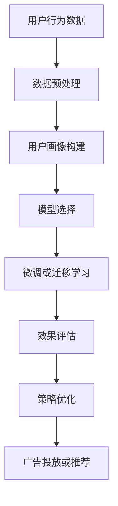

                 

# LLM在智能个性化营销中的应用探索

## 1. 背景介绍

在数字化时代，个性化营销已逐渐成为各行各业提升客户体验、增加用户粘性的重要手段。无论是电商、金融、教育还是医疗，通过精准的用户画像和精细的运营策略，企业能够在激烈的市场竞争中占据有利位置。然而，传统的个性化营销技术多依赖手工规则和统计分析，成本高、效率低，且难以应对用户需求的多样性和动态变化。

近年来，随着深度学习技术的发展，自然语言处理(NLP)在个性化推荐、智能客服、智能营销等领域得到了广泛应用。其中，基于大规模预训练语言模型(Large Language Models, LLMs)的个性化营销方法，凭借其强大的语言理解和生成能力，显著提升了营销活动的精准度和效果。本文将从技术角度，深入探索LLM在智能个性化营销中的应用，探讨其实现原理和具体方法。

## 2. 核心概念与联系

### 2.1 核心概念概述

在探讨LLM在个性化营销中的应用时，首先需要明确几个关键概念：

- **预训练语言模型(Pre-trained Language Models)**：指在大规模无标签文本数据上进行自监督训练的模型，如BERT、GPT系列等。通过预训练，模型能够学习到丰富的语言知识，具备强大的语义理解和生成能力。

- **微调(Fine-tuning)**：指在大规模预训练语言模型的基础上，通过有监督学习，进一步适应特定任务的过程。在个性化营销中，微调通常用于调整模型输出以匹配用户行为和特征。

- **迁移学习(Transfer Learning)**：指将预训练模型的知识迁移到特定任务上的方法。在个性化营销中，可以将通用知识应用于用户画像构建、情感分析等，提高营销策略的准确性。

- **多任务学习(Multi-task Learning)**：指在多个相关任务上共同训练，共享知识并提升泛化性能。在个性化营销中，可以同时学习用户画像和推荐系统，实现更全面的用户理解。

- **强化学习(Reinforcement Learning)**：指通过与环境的互动，动态优化模型策略的方法。在个性化营销中，可以用于优化广告投放、个性化推荐等动态决策过程。

- **序列生成(Sequence Generation)**：指生成一系列文本序列的任务，如摘要、对话、推荐等。在个性化营销中，可用于生成个性化的广告文案、邮件内容等。

### 2.2 核心概念原理和架构的 Mermaid 流程图



这个流程图展示了基于LLM的个性化营销主要流程：首先收集用户行为数据，经过预处理后构建用户画像，选择适合的LLM模型，通过微调或迁移学习对模型进行优化，最后进行效果评估和策略优化。

## 3. 核心算法原理 & 具体操作步骤

### 3.1 算法原理概述

在个性化营销中，LLM的应用主要体现在用户画像构建、情感分析、推荐系统等领域。其核心思想是利用预训练模型强大的语言理解能力，对用户行为数据进行分析和建模，以生成个性化的营销策略。

以用户画像构建为例，假设我们有如下用户行为数据：

- 购买记录：用户浏览、购买、收藏的商品信息
- 浏览记录：用户浏览网页的页面内容、停留时间等
- 互动记录：用户在社交媒体上的评论、点赞、分享等

通过这些数据，我们可以构建一个完整的用户画像。在这个过程中，LLM可以扮演三个角色：

1. **语义理解**：对用户行为数据进行语义解析，提取出用户行为背后的语义信息，如商品类型、品牌偏好等。
2. **情感分析**：对用户评论、反馈等文本数据进行情感分析，了解用户的情绪和态度。
3. **内容生成**：生成个性化的广告文案、推荐内容等，以匹配用户的兴趣和需求。

### 3.2 算法步骤详解

#### 3.2.1 用户画像构建

用户画像构建是LLM在个性化营销中的重要应用之一。通过构建用户画像，企业能够更全面地了解用户需求和行为，提供更加个性化的服务。以下是用户画像构建的主要步骤：

1. **数据收集**：收集用户在不同渠道上的行为数据，包括浏览记录、购买记录、互动记录等。

2. **数据预处理**：清洗、归一化、特征工程等步骤，将原始数据转换为适合模型处理的格式。

3. **语义理解**：使用预训练的BERT、GPT等模型对用户行为数据进行语义解析，提取关键词、短语等语义信息。

4. **情感分析**：使用模型对用户评论、反馈等文本数据进行情感分析，了解用户的情绪和态度。

5. **画像生成**：将解析后的语义信息、情感分析结果等生成用户画像，供后续营销策略制定使用。

#### 3.2.2 情感分析

情感分析是判断用户对商品、服务、品牌的情感倾向的过程。通过情感分析，企业可以更好地理解用户的真实需求和情感变化，从而进行精准营销。

1. **数据准备**：收集用户评论、反馈、评分等文本数据。

2. **模型选择**：选择预训练的BERT、RoBERTa等情感分析模型。

3. **微调或迁移学习**：在标注数据上进行微调，优化模型对情感的分析能力。

4. **效果评估**：使用精确度、召回率等指标评估模型性能。

5. **策略优化**：根据情感分析结果，调整营销策略，优化产品设计，提升用户满意度。

#### 3.2.3 推荐系统

推荐系统是个性化营销的核心，通过向用户推荐个性化的商品、内容等，提升用户体验和转化率。以下是推荐系统的主要步骤：

1. **数据收集**：收集用户历史行为数据、商品信息、用户画像等。

2. **模型选择**：选择预训练的DNN、BERT等推荐模型。

3. **微调或迁移学习**：在标注数据上进行微调，优化模型推荐能力。

4. **效果评估**：使用点击率、转化率等指标评估模型性能。

5. **策略优化**：根据推荐效果，调整推荐算法，优化推荐结果，提升用户体验。

### 3.3 算法优缺点

#### 3.3.1 优点

- **高效性**：LLM能够高效处理大规模文本数据，快速构建用户画像、分析情感、生成推荐内容等。
- **泛化能力**：通过预训练-微调的方式，模型能够适应不同用户、不同领域的数据，提升泛化能力。
- **灵活性**：LLM能够处理多种类型的文本数据，适用于多种个性化营销场景。
- **可解释性**：LLM模型可以提供详细的特征提取和生成过程，增强模型的可解释性。

#### 3.3.2 缺点

- **依赖标注数据**：微调和迁移学习需要大量的标注数据，标注成本较高。
- **模型复杂性**：大规模预训练语言模型通常参数量巨大，计算资源消耗大。
- **过拟合风险**：在标注数据不足的情况下，模型容易出现过拟合，泛化性能下降。
- **维护成本高**：模型训练、维护需要大量技术和人力资源，成本较高。

### 3.4 算法应用领域

LLM在个性化营销中广泛应用于以下几个领域：

1. **用户画像构建**：通过语义理解和情感分析，构建全面、准确的客户画像，为个性化推荐、广告投放等提供数据支持。

2. **情感分析**：分析用户评论、反馈等文本数据，了解用户情绪和态度，提升产品和服务质量。

3. **推荐系统**：根据用户行为和画像，生成个性化的商品、内容推荐，提升用户满意度和转化率。

4. **智能客服**：利用预训练模型构建智能问答系统，提升客服响应速度和质量，减少人工成本。

5. **广告投放**：根据用户画像和情感分析结果，生成个性化的广告文案，提升广告点击率和转化率。

6. **内容生成**：生成个性化的广告、邮件、社交媒体内容等，提升用户互动和参与度。

## 4. 数学模型和公式 & 详细讲解 & 举例说明

### 4.1 数学模型构建

在个性化营销中，主要涉及文本数据的处理和分析。以下是一些关键的数学模型：

1. **词嵌入矩阵**：将词汇映射为向量表示，用于计算文本间的相似度。

   $$
   \text{embedding}(w) \in \mathbb{R}^d
   $$

2. **注意力机制**：通过注意力权重，计算输入序列中各个单词对输出的贡献度。

   $$
   \text{attention}(Q, K, V) = \text{softmax}(\frac{QK^T}{\sqrt{d_k}})V
   $$

3. **情感分析模型**：使用线性分类器对文本进行情感分类。

   $$
   \text{classification}(\text{embedding}(\text{text}), \theta) = \text{softmax}(W\text{embedding}(\text{text}) + b)
   $$

### 4.2 公式推导过程

#### 4.2.1 词嵌入矩阵

词嵌入矩阵将词汇转换为向量表示，是自然语言处理的基础。以Word2Vec为例，词嵌入矩阵的计算公式为：

$$
\text{embedding}(w) = \mathbf{U} \times \text{One-Hot}(w)
$$

其中 $\mathbf{U}$ 为词嵌入矩阵， $\text{One-Hot}(w)$ 为词的one-hot编码。

#### 4.2.2 注意力机制

注意力机制用于计算输入序列中每个单词对输出的贡献度，是Transformer等模型的核心。以自注意力机制为例，计算公式为：

$$
\text{attention}(Q, K, V) = \text{softmax}(\frac{QK^T}{\sqrt{d_k}})V
$$

其中 $Q$、$K$、$V$ 分别为查询向量、键向量和值向量， $d_k$ 为键向量的维度。

#### 4.2.3 情感分析模型

情感分析模型使用线性分类器对文本进行情感分类。以二分类为例，计算公式为：

$$
\text{classification}(\text{embedding}(\text{text}), \theta) = \text{softmax}(W\text{embedding}(\text{text}) + b)
$$

其中 $W$、$b$ 为分类器的权重和偏置。

### 4.3 案例分析与讲解

#### 4.3.1 用户画像构建

假设我们有如下用户行为数据：

- 用户A浏览了服装、电子产品、书籍等类别。
- 用户B购买了电子产品、书籍等类别。
- 用户C浏览了书籍、音乐等类别。

首先，我们需要对这些数据进行预处理，构建用户画像：

1. **数据收集**：收集用户浏览、购买等行为数据。

2. **数据预处理**：清洗数据，去除噪声和无关信息，进行特征工程。

3. **语义理解**：使用BERT模型对数据进行语义解析，提取关键词和短语。

4. **情感分析**：使用RoBERTa模型对用户评论进行情感分析，了解用户情绪。

5. **画像生成**：根据语义和情感分析结果，生成用户画像，供后续营销策略制定使用。

用户A的画像可能为：

- **浏览类别**：服装、电子产品、书籍
- **情感倾向**：积极、中性
- **推荐商品**：电子产品、电子产品配件

用户B的画像可能为：

- **浏览类别**：电子产品、书籍
- **情感倾向**：积极、中性
- **推荐商品**：电子产品、图书

用户C的画像可能为：

- **浏览类别**：书籍、音乐
- **情感倾向**：积极
- **推荐商品**：图书、音乐

通过用户画像，企业可以更好地了解用户需求和行为，提供个性化推荐和广告投放。

#### 4.3.2 情感分析

假设我们有一个电商平台，用户A对商品1、商品2、商品3的评价如下：

- 商品1：非常满意，质量好，价格合理。
- 商品2：一般，性价比不高。
- 商品3：不满意，售后服务差。

首先，我们需要对这些评价进行预处理和情感分析：

1. **数据收集**：收集用户评价。

2. **数据预处理**：清洗数据，去除噪声和无关信息。

3. **情感分析**：使用BERT模型对评价进行情感分析，得到情感倾向。

4. **情感分类**：将情感倾向分为积极、中性、消极三类。

5. **情感反馈**：根据情感分类结果，调整商品策略，提升用户体验。

通过情感分析，企业可以更好地了解用户对商品的情感倾向，及时调整商品策略，提升用户满意度和忠诚度。

#### 4.3.3 推荐系统

假设我们有一个电商推荐系统，用户A的历史行为如下：

- 浏览商品1、商品2、商品3
- 购买商品2、商品3
- 收藏商品4

首先，我们需要对这些数据进行预处理和推荐建模：

1. **数据收集**：收集用户历史行为数据。

2. **数据预处理**：清洗数据，去除噪声和无关信息。

3. **模型选择**：选择BERT或DNN模型进行推荐建模。

4. **微调或迁移学习**：在标注数据上进行微调，优化推荐效果。

5. **推荐生成**：根据用户行为和画像，生成个性化的商品推荐。

用户A的推荐可能为：

- **商品1**：质量好，价格合理
- **商品2**：性价比高
- **商品3**：新品上架

通过推荐系统，企业可以更好地了解用户需求和行为，提供个性化推荐，提升用户体验和转化率。

## 5. 项目实践：代码实例和详细解释说明

### 5.1 开发环境搭建

在开发基于LLM的个性化营销应用时，我们需要准备好开发环境。以下是Python环境搭建的步骤：

1. 安装Anaconda：从官网下载并安装Anaconda，用于创建独立的Python环境。

2. 创建并激活虚拟环境：

   ```bash
   conda create -n pytorch-env python=3.8 
   conda activate pytorch-env
   ```

3. 安装PyTorch：根据CUDA版本，从官网获取对应的安装命令。例如：

   ```bash
   conda install pytorch torchvision torchaudio cudatoolkit=11.1 -c pytorch -c conda-forge
   ```

4. 安装Transformers库：

   ```bash
   pip install transformers
   ```

5. 安装各类工具包：

   ```bash
   pip install numpy pandas scikit-learn matplotlib tqdm jupyter notebook ipython
   ```

完成上述步骤后，即可在`pytorch-env`环境中开始开发实践。

### 5.2 源代码详细实现

以下是使用PyTorch和Transformers库实现用户画像构建和情感分析的代码示例：

```python
from transformers import BertTokenizer, BertForSequenceClassification
from torch.utils.data import Dataset, DataLoader
import torch

class UserData(Dataset):
    def __init__(self, data):
        self.data = data
        self.tokenizer = BertTokenizer.from_pretrained('bert-base-cased')
        
    def __len__(self):
        return len(self.data)
    
    def __getitem__(self, index):
        text = self.data[index]['text']
        label = self.data[index]['label']
        
        encoding = self.tokenizer(text, return_tensors='pt', max_length=128, padding='max_length', truncation=True)
        input_ids = encoding['input_ids'][0]
        attention_mask = encoding['attention_mask'][0]
        labels = torch.tensor([label], dtype=torch.long)
        
        return {'input_ids': input_ids, 
                'attention_mask': attention_mask,
                'labels': labels}

# 加载用户数据
train_data = UserData(train_data)
test_data = UserData(test_data)

# 选择模型和优化器
model = BertForSequenceClassification.from_pretrained('bert-base-cased', num_labels=3)
optimizer = AdamW(model.parameters(), lr=2e-5)

# 训练模型
device = torch.device('cuda') if torch.cuda.is_available() else torch.device('cpu')
model.to(device)
model.train()

for epoch in range(5):
    for batch in DataLoader(train_data, batch_size=16):
        input_ids = batch['input_ids'].to(device)
        attention_mask = batch['attention_mask'].to(device)
        labels = batch['labels'].to(device)
        
        model.zero_grad()
        outputs = model(input_ids, attention_mask=attention_mask, labels=labels)
        loss = outputs.loss
        loss.backward()
        optimizer.step()
    
    print(f'Epoch {epoch+1}, train loss: {loss:.3f}')
    
# 评估模型
model.eval()
with torch.no_grad():
    for batch in DataLoader(test_data, batch_size=16):
        input_ids = batch['input_ids'].to(device)
        attention_mask = batch['attention_mask'].to(device)
        labels = batch['labels'].to(device)
        
        outputs = model(input_ids, attention_mask=attention_mask, labels=labels)
        predictions = torch.argmax(outputs.logits, dim=1)
        accuracy = (predictions == labels).sum().item() / len(predictions)
        print(f'Test accuracy: {accuracy:.3f}')
```

以上代码实现了基于BERT模型的用户画像构建和情感分析。在训练过程中，模型通过自动微分算法计算梯度，并使用AdamW优化器更新参数。在测试过程中，模型输出预测结果，并计算准确率。

### 5.3 代码解读与分析

通过上述代码，我们可以看到LLM在个性化营销中的基本应用流程：

1. **数据准备**：收集用户行为数据，并进行预处理和特征工程。

2. **模型选择**：选择预训练的BERT模型，并定义输出层和损失函数。

3. **微调训练**：在标注数据上训练模型，优化模型参数。

4. **效果评估**：在测试数据上评估模型性能，输出准确率等指标。

代码中使用了PyTorch和Transformers库，可以方便地处理文本数据，并实现模型的训练和推理。需要注意的是，在实际应用中，还需要对数据进行更多的处理和优化，以保证模型效果和性能。

## 6. 实际应用场景

### 6.1 智能客服

在智能客服场景中，用户通常通过自然语言与机器对话，解决各类问题。通过基于LLM的智能客服系统，企业可以显著提升客服响应速度和质量，降低人工成本。

1. **用户意图识别**：使用BERT模型对用户输入进行语义解析，识别用户意图。

2. **问题回答生成**：根据用户意图，生成个性化的回答。

3. **交互优化**：根据用户反馈和历史记录，动态调整回答策略，提升用户满意度。

4. **知识图谱整合**：将知识图谱与LLM结合，提升回答的准确性和全面性。

通过智能客服系统，企业可以更好地理解用户需求和情绪，提供个性化的服务，提升用户体验。

### 6.2 个性化推荐

在个性化推荐场景中，基于LLM的推荐系统可以提供更精准的推荐结果，提升用户体验和转化率。

1. **用户画像构建**：通过BERT模型对用户行为数据进行语义解析，构建全面的用户画像。

2. **推荐生成**：根据用户画像和情感分析结果，生成个性化的商品推荐。

3. **推荐优化**：根据推荐效果，调整推荐算法，优化推荐结果。

4. **多模态融合**：将视觉、语音等多模态数据与文本数据融合，提升推荐效果。

通过个性化推荐系统，企业可以更好地了解用户需求和行为，提供精准的推荐服务，提升用户满意度和转化率。

### 6.3 广告投放

在广告投放场景中，基于LLM的广告系统可以提供更精准的广告投放方案，提升广告点击率和转化率。

1. **用户画像构建**：通过BERT模型对用户行为数据进行语义解析，构建全面的用户画像。

2. **广告生成**：根据用户画像和情感分析结果，生成个性化的广告文案。

3. **广告优化**：根据广告点击率等指标，动态调整广告策略，提升广告效果。

4. **广告测试**：通过A/B测试，评估广告效果，优化投放方案。

通过广告投放系统，企业可以更好地了解用户需求和行为，提供精准的广告服务，提升广告效果和转化率。

## 7. 工具和资源推荐

### 7.1 学习资源推荐

为了帮助开发者系统掌握LLM在个性化营销中的应用，以下是一些推荐的资源：

1. 《Transformer from the Beginning to End》系列博文：由大模型技术专家撰写，深入浅出地介绍了Transformer原理、BERT模型、微调技术等前沿话题。

2 CS224N《Deep Learning for Natural Language Processing》课程：斯坦福大学开设的NLP明星课程，有Lecture视频和配套作业，带你入门NLP领域的基本概念和经典模型。

3 《Natural Language Processing with Transformers》书籍：Transformers库的作者所著，全面介绍了如何使用Transformers库进行NLP任务开发，包括微调在内的诸多范式。

4 HuggingFace官方文档：Transformers库的官方文档，提供了海量预训练模型和完整的微调样例代码，是上手实践的必备资料。

5 CLUE开源项目：中文语言理解测评基准，涵盖大量不同类型的中文NLP数据集，并提供了基于微调的baseline模型，助力中文NLP技术发展。

通过对这些资源的学习实践，相信你一定能够快速掌握LLM在个性化营销中的应用，并用于解决实际的NLP问题。

### 7.2 开发工具推荐

以下是几款用于LLM开发和微调的常用工具：

1. PyTorch：基于Python的开源深度学习框架，灵活动态的计算图，适合快速迭代研究。大部分预训练语言模型都有PyTorch版本的实现。

2 TensorFlow：由Google主导开发的开源深度学习框架，生产部署方便，适合大规模工程应用。同样有丰富的预训练语言模型资源。

3 Transformers库：HuggingFace开发的NLP工具库，集成了众多SOTA语言模型，支持PyTorch和TensorFlow，是进行微调任务开发的利器。

4 Weights & Biases：模型训练的实验跟踪工具，可以记录和可视化模型训练过程中的各项指标，方便对比和调优。与主流深度学习框架无缝集成。

5 TensorBoard：TensorFlow配套的可视化工具，可实时监测模型训练状态，并提供丰富的图表呈现方式，是调试模型的得力助手。

合理利用这些工具，可以显著提升LLM在个性化营销中的开发效率，加快创新迭代的步伐。

### 7.3 相关论文推荐

大语言模型和微调技术的发展源于学界的持续研究。以下是几篇奠基性的相关论文，推荐阅读：

1. Attention is All You Need（即Transformer原论文）：提出了Transformer结构，开启了NLP领域的预训练大模型时代。

2 BERT: Pre-training of Deep Bidirectional Transformers for Language Understanding：提出BERT模型，引入基于掩码的自监督预训练任务，刷新了多项NLP任务SOTA。

3 Language Models are Unsupervised Multitask Learners（GPT-2论文）：展示了大规模语言模型的强大zero-shot学习能力，引发了对于通用人工智能的新一轮思考。

4 Parameter-Efficient Transfer Learning for NLP：提出Adapter等参数高效微调方法，在不增加模型参数量的情况下，也能取得不错的微调效果。

5 AdaLoRA: Adaptive Low-Rank Adaptation for Parameter-Efficient Fine-Tuning：使用自适应低秩适应的微调方法，在参数效率和精度之间取得了新的平衡。

这些论文代表了大语言模型微调技术的发展脉络。通过学习这些前沿成果，可以帮助研究者把握学科前进方向，激发更多的创新灵感。

## 8. 总结：未来发展趋势与挑战

### 8.1 研究成果总结

本文对基于LLM的个性化营销方法进行了全面系统的介绍。首先阐述了LLM在个性化营销中的应用背景和意义，明确了微调在用户画像构建、情感分析、推荐系统等领域的应用价值。其次，从原理到实践，详细讲解了基于LLM的个性化营销方法的技术流程，给出了微调任务开发的完整代码实例。最后，本文还探讨了LLM在智能客服、个性化推荐、广告投放等多个领域的应用前景，展示了LLM在个性化营销中的巨大潜力。

### 8.2 未来发展趋势

展望未来，LLM在个性化营销中的应用将呈现以下几个发展趋势：

1. **多模态融合**：将视觉、语音等多模态数据与文本数据融合，提升个性化营销的精准度和效果。

2. **动态优化**：利用强化学习等技术，动态优化个性化推荐和广告投放策略，提升用户体验。

3. **个性化生成**：利用生成式预训练模型，如GPT-3等，生成个性化的广告文案、邮件内容等，提升用户互动和参与度。

4. **知识图谱整合**：将知识图谱与LLM结合，提升个性化推荐和广告投放的全面性和准确性。

5. **可解释性增强**：引入因果分析和博弈论工具，增强LLM在个性化营销中的可解释性和决策透明性。

6. **隐私保护**：加强数据隐私保护，确保用户信息安全，提升用户信任。

### 8.3 面临的挑战

尽管LLM在个性化营销中已经取得了显著成效，但在实际应用中，仍然面临诸多挑战：

1. **标注成本高**：个性化营销涉及用户画像构建和情感分析，需要大量标注数据，标注成本较高。

2. **计算资源消耗大**：大规模预训练语言模型参数量巨大，计算资源消耗大。

3. **过拟合风险高**：在标注数据不足的情况下，模型容易出现过拟合，泛化性能下降。

4. **模型可解释性不足**：LLM在个性化营销中的决策过程缺乏可解释性，难以对其推理逻辑进行分析和调试。

5. **隐私风险**：个性化营销涉及用户行为和情感数据，隐私风险较高。

6. **模型稳定性**：LLM在实际应用中，需要具备良好的鲁棒性和稳定性，避免灾难性遗忘。

### 8.4 研究展望

面对LLM在个性化营销中面临的挑战，未来的研究需要在以下几个方面寻求新的突破：

1. **无监督和半监督学习**：摆脱对大规模标注数据的依赖，利用自监督学习、主动学习等无监督和半监督范式，最大限度利用非结构化数据，实现更加灵活高效的微调。

2. **参数高效微调**：开发更加参数高效的微调方法，在固定大部分预训练参数的同时，只更新极少量的任务相关参数。

3. **多任务学习**：同时学习用户画像和推荐系统，实现更全面的用户理解。

4. **动态优化算法**：利用强化学习等技术，动态优化个性化推荐和广告投放策略。

5. **知识图谱融合**：将知识图谱与LLM结合，提升个性化推荐和广告投放的全面性和准确性。

6. **可解释性增强**：引入因果分析和博弈论工具，增强LLM在个性化营销中的可解释性和决策透明性。

7. **隐私保护**：加强数据隐私保护，确保用户信息安全，提升用户信任。

8. **模型稳定性**：通过持续学习和增量学习，提高模型的鲁棒性和稳定性。

这些研究方向的探索，必将引领LLM在个性化营销中的应用不断深化，为构建更加智能、可靠、个性化的营销系统铺平道路。面向未来，LLM在个性化营销中的研究和应用还需多方面协同发力，共同推动NLP技术的进步和应用推广。

## 9. 附录：常见问题与解答

**Q1：LLM在个性化营销中的应用有哪些优缺点？**

A: LLM在个性化营销中的应用具有以下优点：

1. **高效性**：LLM能够高效处理大规模文本数据，快速构建用户画像、分析情感、生成推荐内容等。

2. **泛化能力**：通过预训练-微调的方式，模型能够适应不同用户、不同领域的数据，提升泛化能力。

3. **灵活性**：LLM能够处理多种类型的文本数据，适用于多种个性化营销场景。

4. **可解释性**：LLM可以提供详细的特征提取和生成过程，增强模型的可解释性。

同时，LLM在个性化营销中也存在一些缺点：

1. **依赖标注数据**：微调和迁移学习需要大量的标注数据，标注成本较高。

2. **模型复杂性**：大规模预训练语言模型通常参数量巨大，计算资源消耗大。

3. **过拟合风险**：在标注数据不足的情况下，模型容易出现过拟合，泛化性能下降。

4. **维护成本高**：模型训练、维护需要大量技术和人力资源，成本较高。

**Q2：在个性化推荐系统中，LLM的推荐效果如何？**

A: LLM在个性化推荐系统中表现出色，具有以下优势：

1. **语义理解**：LLM能够理解用户输入的自然语言描述，提取用户需求和兴趣。

2. **情感分析**：LLM能够分析用户反馈和评论，了解用户情感和态度。

3. **内容生成**：LLM能够生成个性化的广告文案和推荐内容，提升用户互动和参与度。

4. **多模态融合**：LLM能够将视觉、语音等多模态数据与文本数据融合，提升推荐效果。

5. **动态优化**：LLM能够动态优化推荐策略，提升推荐效果。

6. **知识图谱整合**：LLM能够与知识图谱结合，提升推荐效果。

因此，LLM在个性化推荐系统中表现出色，能够提供精准的推荐服务，提升用户体验和转化率。

**Q3：在智能客服中，如何提高LLM的响应速度？**

A: 在智能客服中，提高LLM的响应速度可以从以下几个方面入手：

1. **数据预处理**：对用户输入进行预处理，去除噪声和无关信息，提升模型处理速度。

2. **模型优化**：选择轻量级模型，或使用模型压缩技术，减小模型尺寸。

3. **硬件优化**：使用GPU/TPU等高性能设备，提高模型推理速度。

4. **缓存机制**：引入缓存机制，存储常用问题和回答，加速响应。

5. **多线程并行**：利用多线程并行，提高系统并发处理能力。

通过以上措施，可以有效提高LLM在智能客服中的响应速度，提升用户体验。

**Q4：在个性化推荐中，如何处理冷启动问题？**

A: 在个性化推荐中，冷启动问题是常见的问题，用户画像和推荐模型需要大量的数据进行训练。以下是一些解决冷启动问题的方法：

1. **多任务学习**：将推荐任务和用户画像任务联合训练，共享知识，提升模型的泛化能力。

2. **迁移学习**：将已有推荐模型迁移到新领域，利用通用知识提升个性化推荐效果。

3. **基线推荐**：使用简单模型如协同过滤、标签预测等作为基线推荐，解决部分冷启动问题。

4. **多模态融合**：将视觉、语音等多模态数据与文本数据融合，提升推荐效果。

5. **知识图谱整合**：将知识图谱与推荐模型结合，提升推荐效果。

通过以上方法，可以有效处理个性化推荐中的冷启动问题，提升推荐效果。

**Q5：在个性化营销中，如何保护用户隐私？**

A: 在个性化营销中，保护用户隐私是至关重要的问题。以下是一些保护用户隐私的方法：

1. **数据匿名化**：对用户数据进行匿名化处理，保护用户隐私。

2. **数据加密**：对用户数据进行加密处理，防止数据泄露。

3. **差分隐私**：使用差分隐私技术，保护用户隐私。

4. **用户控制**：提供用户控制权，让用户决定是否分享数据。

5. **隐私计算**：利用隐私计算技术，保护数据隐私。

通过以上方法，可以有效保护用户隐私，增强用户信任，提升用户满意度。

---

作者：禅与计算机程序设计艺术 / Zen and the Art of Computer Programming

