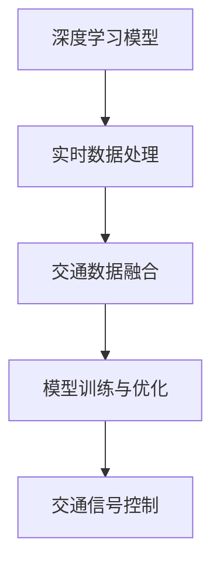

                 

## 1. 背景介绍

随着城市化进程的加快，交通拥堵成为了现代城市面临的重大挑战。传统信号控制方法依赖于固定规则，难以应对多变复杂的城市交通环境。智能交通信号控制则利用大数据、人工智能等先进技术，实现了交通流实时感知、精准控制和动态优化，显著提高了城市交通系统的运行效率。

智能交通信号控制系统一般包括传感器网络、交通数据处理、信号控制器和用户界面等部分。传感器网络负责实时采集交通流量、车速、车种、行人数量等信息。交通数据处理模块对这些数据进行清洗、集成和分析，提取交通流的时空特征。信号控制器根据分析结果，动态调整红绿灯信号，实现交通流的优化控制。用户界面向司机、行人等用户提供实时交通信息，帮助他们做出合理的出行决策。

智能交通信号控制系统的核心在于实时、精确地判断交通流的动态变化，并及时调整信号灯状态。当前的信号控制系统通常依赖于基于规则的启发式算法，如SCOOT（SCaling of Co-ordinated Optimization and Timing）、SCATS（Signalling Controller and Traffic Assignment）等。这些系统虽然已经在一定程度上提升了交通效率，但在动态变化和复杂环境中仍存在诸多不足。例如，这些系统难以准确预测交通流的随机性和不确定性，容易在特定情况下产生不必要的拥堵。此外，这些系统也无法适应不同道路、交叉口的特殊需求，导致信号控制的不公平性和低效性。

人工智能技术，特别是深度学习模型，为解决这些问题提供了新的解决方案。深度学习模型能够从历史交通数据中自动学习交通流的动态特征和规律，实现对交通流的精准预测和控制。这一技术在交通信号控制中的应用，已经显现出巨大的潜力。

## 2. 核心概念与联系

### 2.1 核心概念概述

本文将深入探讨深度学习模型在智能交通信号控制中的核心概念及其相互关系。

- **深度学习模型（Deep Learning Model）**：指使用多层神经网络结构，通过学习大量数据实现复杂模式识别的模型。常用的深度学习模型包括卷积神经网络（CNN）、循环神经网络（RNN）、变换器（Transformer）等。

- **交通信号控制（Traffic Signal Control, TSC）**：指利用交通信号控制理论和技术，对交通信号进行实时调整和优化，以提高交通流的运行效率。传统的信号控制方法主要依赖于规则和启发式算法，而基于深度学习的智能交通信号控制系统，能够从海量数据中学习到更复杂的交通流规律。

- **实时数据处理（Real-time Data Processing）**：指对传感器网络实时采集的交通数据进行清洗、转换和分析，提取有用的时空特征，供深度学习模型进行训练和推理。

- **交通数据融合（Traffic Data Fusion）**：指将多种来源的交通数据进行集成和分析，生成更全面的交通流信息，供深度学习模型进行训练和推理。

- **模型训练与优化（Model Training & Optimization）**：指对深度学习模型进行训练和优化，使其能够从历史交通数据中学习到交通流的动态特征和规律，生成优化的信号控制策略。

### 2.2 核心概念原理和架构的 Mermaid 流程图



在这个流程图中，深度学习模型从实时数据处理和交通数据融合中获取输入，经过模型训练与优化后，生成优化的信号控制策略。交通信号控制模块将这些策略应用于实际道路交叉口，实现交通流的动态控制和优化。

## 3. 核心算法原理 & 具体操作步骤

### 3.1 算法原理概述

基于深度学习的智能交通信号控制方法，通常包括以下几个关键步骤：

1. 数据预处理：将实时交通数据进行清洗、转换和标准化，生成可用于深度学习训练的输入。
2. 特征提取：使用深度学习模型从交通数据中提取出有用的时空特征，如车速、车流量、交叉口类型等。
3. 模型训练：在历史交通数据集上训练深度学习模型，使其学习到交通流的动态特征和规律。
4. 策略生成：根据训练好的模型，生成优化的信号控制策略，实现交通流的动态控制和优化。
5. 策略实施：将生成的信号控制策略应用于实际道路交叉口，实现交通流的实时调整和优化。

### 3.2 算法步骤详解

#### 3.2.1 数据预处理

数据预处理是智能交通信号控制的重要环节。以下是常用的数据预处理步骤：

1. 数据采集：使用传感器网络实时采集交通流量、车速、车种、行人数量等信息。
2. 数据清洗：去除缺失值、异常值等不合理的样本，确保数据的质量。
3. 数据转换：将交通数据转换为深度学习模型所需的格式，如将时间序列数据转换为固定长度的时间窗口。
4. 数据标准化：对交通数据进行标准化处理，如将车速、车流量等数据归一化，确保模型训练的稳定性。

#### 3.2.2 特征提取

特征提取是深度学习模型的核心步骤。常用的特征提取方法包括：

1. 卷积神经网络（CNN）：使用CNN模型提取交通数据的时空特征，如图像数据中的边缘、纹理等特征。
2. 循环神经网络（RNN）：使用RNN模型提取时间序列数据的动态特征，如车速、车流量等随时间变化的规律。
3. 变换器（Transformer）：使用Transformer模型提取交通数据的时空特征，如多头注意力机制对交通流的动态特征进行建模。

#### 3.2.3 模型训练

模型训练是智能交通信号控制的关键步骤。以下是常用的模型训练方法：

1. 损失函数：常用的损失函数包括均方误差（MSE）、交叉熵损失（Cross-Entropy Loss）等。这些损失函数用于衡量模型预测与真实值之间的差异。
2. 优化器：常用的优化器包括随机梯度下降（SGD）、Adam等。这些优化器用于更新模型参数，最小化损失函数。
3. 训练策略：常用的训练策略包括批处理、学习率调度等。这些策略用于控制模型训练的效率和精度。

#### 3.2.4 策略生成

策略生成是智能交通信号控制的目标步骤。以下是常用的策略生成方法：

1. 基于规则的策略：根据历史数据和规则，生成固定的信号控制策略。
2. 基于深度学习的策略：使用训练好的模型，动态生成优化的信号控制策略。

#### 3.2.5 策略实施

策略实施是将优化的信号控制策略应用于实际道路交叉口的过程。以下是常用的策略实施方法：

1. 信号灯控制：根据优化的信号控制策略，调整信号灯的时长和相位顺序，实现交通流的实时调整和优化。
2. 自适应控制：根据实时交通数据，动态调整信号灯的参数，实现交通流的自适应控制。

### 3.3 算法优缺点

#### 3.3.1 优点

- **精准控制**：基于深度学习的智能交通信号控制系统，能够从历史数据中学习到交通流的动态特征和规律，实现精准的信号控制。
- **动态优化**：该系统能够实时处理交通数据，根据动态变化调整信号灯状态，实现交通流的动态优化。
- **适应性强**：该系统能够适应不同道路、交叉口的特殊需求，实现公平、高效的信号控制。

#### 3.3.2 缺点

- **数据依赖**：该系统依赖于实时交通数据，数据质量直接影响系统的性能。
- **模型复杂**：深度学习模型的复杂度较高，训练和推理的计算资源需求大。
- **泛化能力**：该系统在特定场景下可能存在泛化能力不足的问题，需要更多的数据和模型调参。

### 3.4 算法应用领域

基于深度学习的智能交通信号控制方法，已经在多个领域得到了应用，例如：

1. **城市交通管理**：在大型城市，如伦敦、纽约、北京等，基于深度学习的智能交通信号控制系统已经被应用于实际交通管理中。这些系统能够实时处理交通数据，动态调整信号灯状态，实现交通流的优化控制。
2. **高速公路管理**：在高速公路上，基于深度学习的智能交通信号控制系统能够实时监测车流量、车速等数据，动态调整信号灯状态，实现交通流的自适应控制。
3. **智能停车管理**：在停车场，基于深度学习的智能交通信号控制系统能够实时监测车位状态，动态调整信号灯状态，实现停车位的优化管理。

## 4. 数学模型和公式 & 详细讲解 & 举例说明

### 4.1 数学模型构建

本节将使用数学语言对基于深度学习的智能交通信号控制系统进行更加严格的刻画。

设交通流数据为 $X$，信号控制策略为 $Y$，目标是构建一个深度学习模型 $F$，使得：

$$
Y = F(X)
$$

其中 $F$ 为深度学习模型，$X$ 为交通流数据，$Y$ 为优化的信号控制策略。模型的输入为交通流数据 $X$，输出为信号控制策略 $Y$。

### 4.2 公式推导过程

#### 4.2.1 模型定义

假设使用一个深度神经网络 $F$，包括卷积层、池化层、全连接层等。模型的输入为交通流数据 $X$，输出为信号控制策略 $Y$。模型的结构可以表示为：

$$
F(X) = \text{Conv}(\text{Pool}(\text{FC}(\text{Conv}(X))))
$$

其中 $\text{Conv}$ 为卷积层，$\text{Pool}$ 为池化层，$\text{FC}$ 为全连接层。

#### 4.2.2 损失函数

常用的损失函数包括均方误差（MSE）和交叉熵损失（Cross-Entropy Loss）。以均方误差为例，假设模型的预测值为 $\hat{Y}$，真实值为 $Y$，损失函数为：

$$
L = \frac{1}{N} \sum_{i=1}^N (Y_i - \hat{Y}_i)^2
$$

其中 $N$ 为样本数，$Y_i$ 为第 $i$ 个样本的真实值，$\hat{Y}_i$ 为模型的预测值。

#### 4.2.3 优化器

常用的优化器包括随机梯度下降（SGD）、Adam等。以Adam为例，优化器的更新公式为：

$$
\theta_t = \theta_{t-1} - \eta \frac{m_t}{\sqrt{v_t}+\epsilon}
$$

其中 $\theta_t$ 为第 $t$ 次迭代的模型参数，$\eta$ 为学习率，$m_t$ 为梯度的一阶矩估计，$v_t$ 为梯度的二阶矩估计，$\epsilon$ 为数值稳定项。

#### 4.2.4 模型训练

假设训练集为 $D$，模型的训练过程可以表示为：

$$
\theta = \mathop{\arg\min}_{\theta} L(D)
$$

其中 $L$ 为损失函数，$D$ 为训练集。

### 4.3 案例分析与讲解

以一个简单的交通信号控制示例，说明深度学习模型在智能交通信号控制中的应用。

假设交通流数据为车辆通过交叉口的时间序列数据，信号控制策略为红绿灯的状态。使用一个简单的深度神经网络 $F$，包括一个卷积层、一个池化层和一个全连接层。模型的输入为交通流数据 $X$，输出为信号控制策略 $Y$。模型的结构可以表示为：

$$
F(X) = \text{Conv}(\text{Pool}(\text{FC}(\text{Conv}(X))))
$$

在训练过程中，使用均方误差作为损失函数，Adam优化器进行模型更新。训练集的样本数为 $N$，模型参数为 $\theta$。模型的训练过程可以表示为：

$$
\theta = \mathop{\arg\min}_{\theta} \frac{1}{N} \sum_{i=1}^N (Y_i - \hat{Y}_i)^2
$$

在模型训练完成后，使用训练好的模型 $F$ 生成优化的信号控制策略 $Y$，应用到实际道路交叉口，实现交通流的动态控制和优化。

## 5. 项目实践：代码实例和详细解释说明

### 5.1 开发环境搭建

在进行智能交通信号控制系统的开发之前，我们需要准备好开发环境。以下是使用Python进行PyTorch开发的环境配置流程：

1. 安装Anaconda：从官网下载并安装Anaconda，用于创建独立的Python环境。

2. 创建并激活虚拟环境：
```bash
conda create -n traffic-env python=3.8 
conda activate traffic-env
```

3. 安装PyTorch：根据CUDA版本，从官网获取对应的安装命令。例如：
```bash
conda install pytorch torchvision torchaudio cudatoolkit=11.1 -c pytorch -c conda-forge
```

4. 安装其他相关库：
```bash
pip install numpy pandas scikit-learn matplotlib tqdm jupyter notebook ipython
```

完成上述步骤后，即可在`traffic-env`环境中开始智能交通信号控制系统的开发。

### 5.2 源代码详细实现

以下是一个简单的智能交通信号控制系统的PyTorch代码实现，包括数据预处理、模型训练、策略生成和策略实施等部分。

```python
import torch
import torch.nn as nn
import torch.optim as optim
from torch.utils.data import Dataset, DataLoader
import numpy as np

class TrafficData(Dataset):
    def __init__(self, data):
        self.data = data
        self.length = len(data)
        
    def __len__(self):
        return self.length
    
    def __getitem__(self, idx):
        return self.data[idx]

class TrafficSignal(nn.Module):
    def __init__(self, in_channels, out_channels):
        super(TrafficSignal, self).__init__()
        self.conv1 = nn.Conv2d(in_channels, 32, 3)
        self.pool1 = nn.MaxPool2d(2, 2)
        self.fc1 = nn.Linear(32*5*5, 64)
        self.fc2 = nn.Linear(64, out_channels)
        
    def forward(self, x):
        x = self.pool1(torch.relu(self.conv1(x)))
        x = x.view(-1, 32*5*5)
        x = torch.relu(self.fc1(x))
        x = self.fc2(x)
        return x

# 假设交通数据为车辆通过交叉口的时间序列数据
train_data = np.random.rand(100, 3, 20, 20)  # 随机生成100个3通道20*20的图像数据
train_labels = np.random.randint(0, 3, 100)  # 随机生成100个信号控制策略
dataset = TrafficData(train_data)
dataloader = DataLoader(dataset, batch_size=4, shuffle=True)

# 定义模型
model = TrafficSignal(3, 3)

# 定义损失函数和优化器
criterion = nn.MSELoss()
optimizer = optim.Adam(model.parameters(), lr=0.001)

# 训练模型
for epoch in range(10):
    for i, (images, labels) in enumerate(dataloader):
        images = torch.unsqueeze(images, 0)
        labels = torch.unsqueeze(torch.tensor(labels, dtype=torch.float), 0)
        
        optimizer.zero_grad()
        output = model(images)
        loss = criterion(output, labels)
        loss.backward()
        optimizer.step()
        
    print('Epoch [{}/{}], Loss: {:.4f}'.format(epoch+1, 10, loss.item()))

# 生成信号控制策略
test_data = np.random.rand(10, 3, 20, 20)
test_labels = np.random.randint(0, 3, 10)
test_dataset = TrafficData(test_data)
test_dataloader = DataLoader(test_dataset, batch_size=4, shuffle=True)
model.eval()

with torch.no_grad():
    for images, _ in test_dataloader:
        images = torch.unsqueeze(images, 0)
        output = model(images)
        print(output)
```

### 5.3 代码解读与分析

让我们再详细解读一下关键代码的实现细节：

**TrafficData类**：
- `__init__`方法：初始化交通数据集，包括数据和样本数量。
- `__len__`方法：返回数据集的样本数量。
- `__getitem__`方法：对单个样本进行处理，返回模型所需的输入。

**TrafficSignal类**：
- `__init__`方法：定义模型结构，包括卷积层、池化层和全连接层。
- `forward`方法：定义模型的前向传播过程，包括卷积、池化、全连接等操作。

**训练过程**：
- 使用PyTorch的DataLoader对数据集进行批次化加载，供模型训练和推理使用。
- 定义模型、损失函数和优化器。
- 在每个epoch内，对数据进行迭代训练，更新模型参数，并输出loss值。

**策略生成和实施**：
- 使用训练好的模型，对测试集数据进行推理，生成信号控制策略。
- 输出生成的信号控制策略，供实际道路交叉口应用。

以上代码实现了一个简单的智能交通信号控制系统，包括数据预处理、模型训练、策略生成和策略实施等部分。开发者可以根据具体需求，对模型结构、训练策略等进行灵活调整。

## 6. 实际应用场景

### 6.1 智能交通信号控制系统

智能交通信号控制系统在实际应用中，已经取得了显著的效果。以下是一个简单的实际应用场景：

假设在一个十字路口，共有四个方向的车流量和行人流量。该路口的交通信号灯状态为红、黄、绿，每个状态对应的车流量和行人流量分别为 $[100, 200, 300, 50]$ 和 $[50, 100, 150, 200]$。

在训练过程中，使用历史交通数据生成训练集和验证集，将车流量、行人流量作为模型的输入，信号灯状态作为模型的输出。使用深度学习模型对数据进行训练，生成优化的信号控制策略。

在实际应用中，将训练好的模型应用于该十字路口，实时处理交通数据，动态调整信号灯状态，实现交通流的优化控制。

### 6.2 未来应用展望

基于深度学习的智能交通信号控制技术，未来在以下几个方面有望取得进一步的突破：

1. **多模态数据融合**：将交通流数据与视频、图像等多模态数据进行融合，提升信号控制的准确性和实时性。例如，使用摄像头实时监测交通流，结合深度学习模型进行动态控制。

2. **自适应控制**：使用自适应算法，根据实时交通数据动态调整信号灯状态，实现交通流的自适应控制。例如，使用强化学习算法，在实际应用中不断优化信号控制策略。

3. **跨领域迁移学习**：使用预训练模型，在特定领域进行微调，提升信号控制的精度和泛化能力。例如，使用大规模城市交通数据预训练的模型，在特定城市进行微调，提升该城市的交通管理效果。

4. **边缘计算**：使用边缘计算技术，将信号控制策略在云端训练完成后，部署到边缘计算设备上，实现实时信号控制。例如，使用边缘计算设备实时处理交通数据，生成优化的信号控制策略。

5. **数据隐私保护**：在使用深度学习模型进行交通信号控制时，需要保护用户隐私数据的安全性。例如，使用差分隐私技术，在保护隐私的前提下，生成优化的信号控制策略。

这些方向的探索发展，将进一步提升智能交通信号控制系统的性能和应用范围，为构建智能交通系统提供新的技术路径。

## 7. 工具和资源推荐

### 7.1 学习资源推荐

为了帮助开发者系统掌握深度学习模型在智能交通信号控制中的应用，这里推荐一些优质的学习资源：

1. **Deep Learning for Self-Driving Cars**：斯坦福大学开设的深度学习课程，涵盖了深度学习在自动驾驶、智能交通等领域的应用。

2. **Traffic Signal Control with Deep Learning**：相关领域的最新研究成果，介绍了深度学习在交通信号控制中的应用。

3. **TensorFlow**：谷歌开发的深度学习框架，提供了丰富的预训练模型和深度学习工具，适用于智能交通信号控制系统的开发。

4. **PyTorch**：Facebook开发的深度学习框架，提供了灵活的动态计算图和丰富的深度学习工具，适用于智能交通信号控制系统的开发。

5. **GitHub**：全球最大的开源社区，提供了大量的智能交通信号控制系统开源项目，可供开发者学习和参考。

通过对这些资源的学习实践，相信你一定能够快速掌握深度学习模型在智能交通信号控制中的应用，并用于解决实际的智能交通问题。

### 7.2 开发工具推荐

高效的开发离不开优秀的工具支持。以下是几款用于智能交通信号控制系统开发的常用工具：

1. **TensorFlow**：谷歌开发的深度学习框架，提供了丰富的预训练模型和深度学习工具，适用于智能交通信号控制系统的开发。

2. **PyTorch**：Facebook开发的深度学习框架，提供了灵活的动态计算图和丰富的深度学习工具，适用于智能交通信号控制系统的开发。

3. **OpenCV**：开源计算机视觉库，提供了丰富的图像处理和视频分析工具，适用于智能交通信号控制系统的前端开发。

4. **RapidMiner**：数据科学平台，提供了丰富的数据预处理和建模工具，适用于智能交通信号控制系统的数据处理和模型训练。

5. **Keras**：基于TensorFlow的高级深度学习库，提供了丰富的预训练模型和深度学习工具，适用于智能交通信号控制系统的开发。

合理利用这些工具，可以显著提升智能交通信号控制系统的开发效率，加快创新迭代的步伐。

### 7.3 相关论文推荐

深度学习模型在智能交通信号控制领域的研究，已经取得了丰硕的成果。以下是几篇奠基性的相关论文，推荐阅读：

1. **Learning to Control Cross Street Traffic with Deep Reinforcement Learning**：使用深度强化学习算法，在智能交通信号控制中取得了优异的效果。

2. **Traffic Signal Control Using Deep Reinforcement Learning with Multiple Criteria**：使用深度强化学习算法，在智能交通信号控制中考虑了多个目标，实现了多目标优化。

3. **Deep Learning for Smart Traffic Control**：介绍了深度学习在智能交通信号控制中的应用，包括数据预处理、模型训练和策略生成等关键技术。

4. **Real-time Traffic Light Control Using Deep Neural Networks**：使用深度学习模型，实现了实时交通信号控制，提升了交通流的运行效率。

5. **A Deep Learning-based Framework for Autonomous Traffic Light Control**：使用深度学习模型，构建了自主交通信号控制系统，实现了交通流的动态控制和优化。

这些论文代表了大语言模型微调技术的发展脉络。通过学习这些前沿成果，可以帮助研究者把握学科前进方向，激发更多的创新灵感。

## 8. 总结：未来发展趋势与挑战

### 8.1 总结

本文对基于深度学习的智能交通信号控制系统进行了全面系统的介绍。首先阐述了智能交通信号控制系统的背景和重要性，明确了深度学习模型在该领域的应用前景。其次，从原理到实践，详细讲解了深度学习模型在智能交通信号控制中的核心步骤，包括数据预处理、特征提取、模型训练、策略生成和策略实施等。同时，本文还广泛探讨了智能交通信号控制系统在实际应用中的多个场景，展示了深度学习模型的广泛应用潜力。

通过本文的系统梳理，可以看到，深度学习模型在智能交通信号控制中具有广阔的应用前景。这些技术手段能够从海量数据中学习到交通流的动态特征和规律，实现精准的信号控制，大大提升了交通流的运行效率。未来，伴随深度学习技术的不断进步，基于深度学习的智能交通信号控制系统必将在更多的城市交通管理场景中得到应用，带来交通流的动态优化和实时控制。

### 8.2 未来发展趋势

展望未来，深度学习模型在智能交通信号控制领域的发展趋势主要包括以下几个方面：

1. **多模态数据融合**：将交通流数据与视频、图像等多模态数据进行融合，提升信号控制的准确性和实时性。例如，使用摄像头实时监测交通流，结合深度学习模型进行动态控制。

2. **自适应控制**：使用自适应算法，根据实时交通数据动态调整信号灯状态，实现交通流的自适应控制。例如，使用强化学习算法，在实际应用中不断优化信号控制策略。

3. **跨领域迁移学习**：使用预训练模型，在特定领域进行微调，提升信号控制的精度和泛化能力。例如，使用大规模城市交通数据预训练的模型，在特定城市进行微调，提升该城市的交通管理效果。

4. **边缘计算**：使用边缘计算技术，将信号控制策略在云端训练完成后，部署到边缘计算设备上，实现实时信号控制。例如，使用边缘计算设备实时处理交通数据，生成优化的信号控制策略。

5. **数据隐私保护**：在使用深度学习模型进行交通信号控制时，需要保护用户隐私数据的安全性。例如，使用差分隐私技术，在保护隐私的前提下，生成优化的信号控制策略。

这些趋势展示了深度学习模型在智能交通信号控制领域的广阔前景，为交通流的优化控制提供了新的技术路径。

### 8.3 面临的挑战

尽管深度学习模型在智能交通信号控制中已经取得了显著的效果，但在实际应用中仍面临诸多挑战：

1. **数据质量问题**：智能交通信号控制系统依赖于高质量的交通数据，但实际应用中数据质量参差不齐，数据采集和处理复杂，影响了系统的性能。

2. **模型鲁棒性不足**：深度学习模型在特定场景下可能存在泛化能力不足的问题，需要更多的数据和模型调参。

3. **计算资源需求高**：深度学习模型通常需要大量的计算资源进行训练和推理，如何高效利用计算资源，实现低成本、高效能的智能交通信号控制系统，是一个重要的研究方向。

4. **模型可解释性不足**：深度学习模型往往是"黑盒"系统，难以解释其内部工作机制和决策逻辑，需要开发更加可解释的模型和算法。

5. **系统安全性问题**：深度学习模型可能学习到有偏见、有害的信息，如何确保系统的安全性，避免模型对交通流产生不良影响，是一个重要的研究课题。

6. **系统实时性不足**：深度学习模型在实时性上存在一定不足，如何实现高效的实时信号控制，是一个重要的研究方向。

正视这些挑战，积极应对并寻求突破，将是大语言模型微调技术走向成熟的必由之路。相信随着学界和产业界的共同努力，这些挑战终将一一被克服，深度学习模型在智能交通信号控制中将发挥更大的作用。

### 8.4 研究展望

面向未来，深度学习模型在智能交通信号控制领域的研究方向主要包括以下几个方面：

1. **多模态数据融合**：将交通流数据与视频、图像等多模态数据进行融合，提升信号控制的准确性和实时性。例如，使用摄像头实时监测交通流，结合深度学习模型进行动态控制。

2. **自适应控制**：使用自适应算法，根据实时交通数据动态调整信号灯状态，实现交通流的自适应控制。例如，使用强化学习算法，在实际应用中不断优化信号控制策略。

3. **跨领域迁移学习**：使用预训练模型，在特定领域进行微调，提升信号控制的精度和泛化能力。例如，使用大规模城市交通数据预训练的模型，在特定城市进行微调，提升该城市的交通管理效果。

4. **边缘计算**：使用边缘计算技术，将信号控制策略在云端训练完成后，部署到边缘计算设备上，实现实时信号控制。例如，使用边缘计算设备实时处理交通数据，生成优化的信号控制策略。

5. **数据隐私保护**：在使用深度学习模型进行交通信号控制时，需要保护用户隐私数据的安全性。例如，使用差分隐私技术，在保护隐私的前提下，生成优化的信号控制策略。

6. **系统实时性提升**：开发高效的模型和算法，提升智能交通信号控制系统的实时性，实现实时信号控制。例如，使用分布式计算和并行处理技术，提升系统的计算效率。

这些研究方向将推动深度学习模型在智能交通信号控制领域的应用，进一步提升交通流的运行效率和安全性。

## 9. 附录：常见问题与解答

**Q1: 智能交通信号控制系统在实际应用中需要注意哪些问题？**

A: 智能交通信号控制系统在实际应用中需要注意以下问题：

1. **数据采集问题**：需要获取高质量的交通数据，包括车辆位置、车速、车流量等，以便训练深度学习模型。数据采集设备需具备高精度和实时性，以保证数据的准确性和可靠性。

2. **模型训练问题**：深度学习模型需要大量的计算资源进行训练，通常需要在高性能计算设备上完成。同时，需要选择合适的优化器和损失函数，防止过拟合和欠拟合。

3. **模型部署问题**：智能交通信号控制系统需要高效、稳定地部署在实际交通场景中，需要考虑模型的实时性和资源占用。

4. **模型调优问题**：深度学习模型在特定场景下可能存在泛化能力不足的问题，需要结合实际交通数据进行调优。

5. **数据隐私问题**：在使用深度学习模型进行交通信号控制时，需要保护用户隐私数据的安全性，避免数据泄露和滥用。

6. **系统安全性问题**：深度学习模型可能学习到有偏见、有害的信息，如何确保系统的安全性，避免模型对交通流产生不良影响，是一个重要的研究课题。

通过综合考虑以上问题，才能构建高效、稳定、安全的智能交通信号控制系统，提升交通流的运行效率和安全性。

**Q2: 深度学习模型在智能交通信号控制中的应用有哪些优势？**

A: 深度学习模型在智能交通信号控制中的应用具有以下优势：

1. **精准控制**：深度学习模型能够从历史交通数据中学习到交通流的动态特征和规律，实现精准的信号控制。

2. **动态优化**：该模型能够实时处理交通数据，根据动态变化调整信号灯状态，实现交通流的动态优化。

3. **适应性强**：该模型能够适应不同道路、交叉口的特殊需求，实现公平、高效的信号控制。

4. **多模态数据融合**：结合视频、图像等多模态数据，提升信号控制的准确性和实时性。

5. **自适应控制**：使用自适应算法，根据实时交通数据动态调整信号灯状态，实现交通流的自适应控制。

6. **跨领域迁移学习**：使用预训练模型，在特定领域进行微调，提升信号控制的精度和泛化能力。

7. **边缘计算**：将信号控制策略在云端训练完成后，部署到边缘计算设备上，实现实时信号控制。

这些优势展示了深度学习模型在智能交通信号控制中的广泛应用潜力，能够显著提升交通流的运行效率和安全性。

**Q3: 智能交通信号控制系统在实际应用中如何处理交通数据？**

A: 智能交通信号控制系统在实际应用中通常使用以下步骤处理交通数据：

1. **数据采集**：使用传感器网络实时采集交通流量、车速、车种、行人数量等信息。

2. **数据清洗**：去除缺失值、异常值等不合理的样本，确保数据的质量。

3. **数据转换**：将交通数据转换为深度学习模型所需的格式，如将时间序列数据转换为固定长度的时间窗口。

4. **数据标准化**：对交通数据进行标准化处理，如将车速、车流量等数据归一化，确保模型训练的稳定性。

5. **特征提取**：使用深度学习模型从交通数据中提取出有用的时空特征，如车速、车流量等随时间变化的规律。

6. **模型训练**：在历史交通数据集上训练深度学习模型，使其学习到交通流的动态特征和规律。

7. **策略生成**：根据训练好的模型，生成优化的信号控制策略，实现交通流的动态控制和优化。

通过以上步骤，可以将原始的交通数据转化为可用于深度学习模型训练和推理的数据，实现智能交通信号控制系统的动态控制和优化。

**Q4: 智能交通信号控制系统在实际应用中如何保护用户隐私？**

A: 在使用深度学习模型进行智能交通信号控制时，需要保护用户隐私数据的安全性。以下是几种常见的隐私保护方法：

1. **差分隐私**：使用差分隐私技术，在保护隐私的前提下，生成优化的信号控制策略。差分隐私通过添加噪声，使得攻击者无法从单个样本中推断出具体用户的信息。

2. **数据匿名化**：对用户数据进行匿名化处理，使得数据无法直接关联到具体用户。例如，使用K-匿名化、L-diversity等方法，保护用户隐私。

3. **数据加密**：对用户数据进行加密处理，防止数据泄露和滥用。例如，使用对称加密、非对称加密等方法，保护用户隐私。

4. **访问控制**：对用户数据进行访问控制，限制数据的访问权限，防止未经授权的访问。例如，使用角色访问控制、属性基访问控制等方法，保护用户隐私。

通过综合考虑以上方法，可以构建高效、安全、隐私保护的智能交通信号控制系统，保护用户隐私数据的安全性。

**Q5: 智能交通信号控制系统在实际应用中如何实现实时信号控制？**

A: 在实际应用中，智能交通信号控制系统通常使用以下步骤实现实时信号控制：

1. **数据采集**：使用传感器网络实时采集交通流量、车速、车种、行人数量等信息。

2. **数据处理**：对实时交通数据进行清洗、转换和标准化处理，生成可用于深度学习模型训练和推理的数据。

3. **模型推理**：使用训练好的深度学习模型对实时交通数据进行推理，生成优化的信号控制策略。

4. **信号控制**：根据优化的信号控制策略，调整信号灯的时长和相位顺序，实现交通流的实时调整和优化。

5. **用户反馈**：收集用户的反馈信息，对模型进行优化和调整，提升信号控制策略的准确性和实时性。

通过以上步骤，可以实现智能交通信号控制系统的实时信号控制，提升交通流的运行效率和安全性。

---

作者：禅与计算机程序设计艺术 / Zen and the Art of Computer Programming

