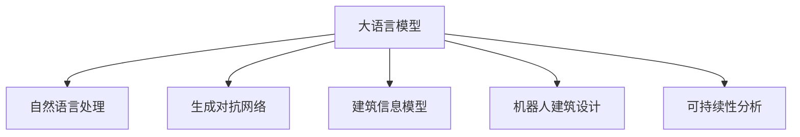

                 

# LLM在智能建筑设计中的潜在作用

> 关键词：
- 大语言模型 (LLM)
- 智能建筑设计
- 自然语言处理 (NLP)
- 生成对抗网络 (GAN)
- 神经网络结构
- 三维设计软件
- 建筑可视化
- 机器人建筑设计
- 可持续性分析

## 1. 背景介绍

随着人工智能技术的飞速发展，大语言模型（Large Language Model, LLM）正在逐步渗透到各个行业，包括智能建筑设计领域。智能建筑设计是一种结合人工智能技术与建筑设计的综合方法，旨在通过自动化和智能化手段，提升设计效率，优化设计质量，实现可持续性目标。而大语言模型，特别是基于自然语言处理的生成式模型，为智能建筑设计提供了全新的视角和工具。

大语言模型是通过大量无标签文本数据进行预训练的神经网络模型，具有强大的语言生成和理解能力。在智能建筑设计中，大语言模型可以通过自然语言处理技术，自动生成建筑描述、设计方案、甚至完整的建筑信息模型（BIM），大大简化设计流程，提升设计速度。同时，大语言模型还可以用于设计方案的优化、可持续性分析、机器人设计等诸多环节，为建筑设计师和工程师提供强有力的辅助工具。

## 2. 核心概念与联系

### 2.1 核心概念概述

为更好地理解大语言模型在智能建筑设计中的应用，本节将介绍几个密切相关的核心概念：

- 大语言模型 (Large Language Model, LLM)：以自回归 (如GPT) 或自编码 (如BERT) 模型为代表的大规模预训练语言模型。通过在大规模无标签文本语料上进行预训练，学习通用的语言知识，具备强大的语言理解和生成能力。

- 自然语言处理 (Natural Language Processing, NLP)：涉及计算机科学、人工智能和语言学等多个领域的交叉学科，旨在使计算机能够理解、处理和生成人类语言。

- 生成对抗网络 (Generative Adversarial Networks, GAN)：一种基于对抗学习的生成模型，通过两个神经网络的竞争训练，生成高质量的伪造数据。在智能建筑设计中，GAN可以用于生成逼真的建筑可视化效果。

- 建筑信息模型 (Building Information Modeling, BIM)：一种建筑产业的数字建模技术，用于集成和管理建筑项目的各类信息，实现建筑全生命周期的管理。

- 机器人建筑设计：利用机械臂和机器人技术，实现自动化的建筑设计。大语言模型可以提供设计指令，指导机器人操作，从而大幅提升设计速度和精确度。

- 可持续性分析：通过数据分析和建模，评估建筑设计的环保、能效、资源消耗等方面的可持续性，为大规模建筑设计提供决策支持。

这些核心概念之间的逻辑关系可以通过以下Mermaid流程图来展示：



这个流程图展示了大语言模型的核心概念及其之间的关系：

1. 大语言模型通过自然语言处理获取设计指令和反馈，指导设计流程。
2. GAN用于生成逼真的建筑可视化效果，提升设计美感。
3. BIM模型通过大语言模型输入和输出数据，实现信息管理和优化。
4. 机器人建筑设计利用大语言模型设计指令，自动执行设计操作。
5. 可持续性分析通过大语言模型解析数据，评估设计方案的可持续性。

这些概念共同构成了大语言模型在智能建筑设计中的应用框架，使其能够全面提升设计效率和质量。

## 3. 核心算法原理 & 具体操作步骤

### 3.1 算法原理概述

大语言模型在智能建筑设计中的应用，主要依赖于其强大的语言生成和理解能力。通过自然语言处理技术，大语言模型可以自动解析设计任务、生成设计方案、甚至进行设计优化。具体来说，大语言模型可以通过以下步骤实现其在智能建筑设计中的功能：

1. **任务描述解析**：将设计任务描述转换为机器可理解的指令，作为大语言模型的输入。

2. **设计方案生成**：大语言模型基于输入的任务描述，自动生成建筑方案的文本描述，如设计风格、空间布局、功能分区等。

3. **视觉化生成**：利用生成对抗网络（GAN）将文本描述转换为逼真的三维可视化效果，供设计师和工程师评审。

4. **设计优化与迭代**：根据设计师的反馈和可持续性分析结果，大语言模型可以自动调整设计参数，生成新的设计方案，进入下一轮优化。

5. **BIM数据生成**：大语言模型可以自动生成建筑信息模型（BIM）的相关数据，如材料、构件、性能参数等，用于后续的施工和管理。

6. **机器人设计辅助**：通过机器人建筑设计平台，将设计方案转化为机器人操作的指令，自动化地执行设计操作。

### 3.2 算法步骤详解

以下是详细的大语言模型在智能建筑设计中的操作步骤：

#### 步骤1：任务描述解析

设计任务通常以自然语言形式描述，需要先将任务描述转换为机器可理解的指令格式。例如，一个设计任务描述可能是：“设计一个现代化的办公大楼，包含会议室、休息区、餐厅等，要求节能环保，面积至少10000平方米，预算控制在大于1亿元。”

我们可以使用自然语言处理技术，如分词、词性标注、命名实体识别等，将任务描述解析为多个关键信息节点，如建筑类型、功能分区、面积要求、预算限制等。这些信息节点可以作为大语言模型的输入，用于生成设计方案。

#### 步骤2：设计方案生成

大语言模型基于输入的任务描述，自动生成建筑方案的文本描述。例如，对于上述任务描述，大语言模型可以自动生成以下设计方案：

- 建筑类型为现代化办公大楼
- 功能分区包括会议室、休息区、餐厅等
- 建筑面积至少10000平方米
- 预算控制在大于1亿元
- 节能环保，采用绿色材料

#### 步骤3：视觉化生成

利用生成对抗网络（GAN），将大语言模型生成的文本描述转换为三维可视化效果。例如，对于上述设计方案，GAN可以生成一个逼真的办公大楼模型，供设计师和工程师评审。

#### 步骤4：设计优化与迭代

设计师和工程师根据GAN生成的可视化效果，对设计方案进行评审和修改。大语言模型可以自动记录设计师的反馈和修改意见，重新生成新的设计方案，进入下一轮优化。例如，设计师可能要求增加一层餐厅，减少会议室面积，增加绿色植物墙等。

#### 步骤5：BIM数据生成

大语言模型可以自动生成建筑信息模型（BIM）的相关数据，如建筑构件的尺寸、材质、性能参数等，用于后续的施工和管理。例如，对于上述办公大楼的设计方案，大语言模型可以生成建筑构件的BIM数据，供施工单位参考。

#### 步骤6：机器人设计辅助

通过机器人建筑设计平台，将设计方案转换为机器人操作的指令，自动化地执行设计操作。例如，对于上述设计方案，机器人可以自动摆放建筑构件、搭建墙面、安装管道等，加速设计过程。

### 3.3 算法优缺点

大语言模型在智能建筑设计中的应用，具有以下优点：

1. **高效性**：大语言模型可以自动生成设计方案和BIM数据，大大提升设计效率，减少人力成本。

2. **灵活性**：大语言模型可以自动调整设计方案，支持多轮迭代优化，满足设计师的个性化需求。

3. **可视化效果逼真**：利用GAN生成高质量的可视化效果，提升设计的美感和可行性。

4. **自动化执行**：机器人建筑设计平台可以自动化地执行设计操作，提升设计精度和速度。

但大语言模型在智能建筑设计中的应用也存在一些缺点：

1. **精度和准确性**：大语言模型生成的设计方案需要设计师进行审核和修改，确保精度和准确性。

2. **数据依赖性**：大语言模型需要大量的设计数据和设计规范，才能生成高质量的设计方案。

3. **复杂度**：大语言模型需要处理复杂的设计任务，可能面临高计算资源的消耗。

4. **可解释性**：大语言模型的设计方案生成过程缺乏可解释性，设计师难以理解其内部决策逻辑。

### 3.4 算法应用领域

大语言模型在智能建筑设计中的应用领域包括：

- **建筑设计**：自动生成建筑设计方案，支持多轮迭代优化。

- **建筑可视化**：利用GAN生成高质量的建筑可视化效果，提升设计美感。

- **BIM数据生成**：自动生成建筑信息模型（BIM）的相关数据，用于后续的施工和管理。

- **机器人设计辅助**：利用机器人建筑设计平台，自动化地执行设计操作。

- **可持续性分析**：通过数据分析和建模，评估建筑设计的环保、能效、资源消耗等方面的可持续性。

- **建筑设计知识库**：构建建筑设计知识库，为设计人员提供设计参考和建议。

## 4. 数学模型和公式 & 详细讲解 & 举例说明

### 4.1 数学模型构建

大语言模型在智能建筑设计中的应用，主要依赖于其强大的语言生成和理解能力。假设大语言模型为 $M_{\theta}$，其中 $\theta$ 为模型参数。设计任务描述为 $D$，设计方案文本描述为 $T$，BIM数据为 $B$。设计方案生成过程可以表示为：

$$
T = M_{\theta}(D)
$$

其中 $M_{\theta}$ 为自然语言处理模型，$D$ 为设计任务描述，$T$ 为设计方案文本描述。

#### 4.2 公式推导过程

大语言模型的设计方案生成过程，可以通过自然语言处理模型来实现。例如，假设设计任务描述为 $D$，大语言模型 $M_{\theta}$ 的输出为设计方案文本描述 $T$。则设计方案生成过程可以表示为：

$$
T = M_{\theta}(D)
$$

其中 $M_{\theta}$ 为自然语言处理模型，$D$ 为设计任务描述，$T$ 为设计方案文本描述。

#### 4.3 案例分析与讲解

假设设计任务描述为：“设计一个现代化的办公大楼，包含会议室、休息区、餐厅等，要求节能环保，面积至少10000平方米，预算控制在大于1亿元。”

大语言模型可以通过以下步骤，自动生成设计方案：

1. **任务描述解析**：使用自然语言处理技术，将设计任务描述 $D$ 解析为多个关键信息节点，如建筑类型、功能分区、面积要求、预算限制等。

2. **设计方案生成**：根据解析后的关键信息节点，自动生成设计方案文本描述 $T$，如：

   - 建筑类型为现代化办公大楼
   - 功能分区包括会议室、休息区、餐厅等
   - 建筑面积至少10000平方米
   - 预算控制在大于1亿元
   - 节能环保，采用绿色材料

3. **视觉化生成**：利用生成对抗网络（GAN），将设计方案文本描述 $T$ 转换为三维可视化效果。

4. **设计优化与迭代**：根据设计师的反馈和可持续性分析结果，大语言模型自动调整设计参数，生成新的设计方案。

5. **BIM数据生成**：大语言模型自动生成建筑信息模型（BIM）的相关数据，如建筑构件的尺寸、材质、性能参数等。

6. **机器人设计辅助**：通过机器人建筑设计平台，将设计方案转换为机器人操作的指令，自动化地执行设计操作。

## 5. 项目实践：代码实例和详细解释说明

### 5.1 开发环境搭建

在进行大语言模型在智能建筑设计中的应用实践前，我们需要准备好开发环境。以下是使用Python进行PyTorch开发的环境配置流程：

1. 安装Anaconda：从官网下载并安装Anaconda，用于创建独立的Python环境。

2. 创建并激活虚拟环境：
```bash
conda create -n pytorch-env python=3.8 
conda activate pytorch-env
```

3. 安装PyTorch：根据CUDA版本，从官网获取对应的安装命令。例如：
```bash
conda install pytorch torchvision torchaudio cudatoolkit=11.1 -c pytorch -c conda-forge
```

4. 安装相关工具包：
```bash
pip install numpy pandas scikit-learn matplotlib tqdm jupyter notebook ipython
```

完成上述步骤后，即可在`pytorch-env`环境中开始项目实践。

### 5.2 源代码详细实现

下面我们以利用大语言模型生成建筑方案为例，给出使用PyTorch代码实现。

首先，定义大语言模型和设计任务描述：

```python
from transformers import GPT3LMHeadModel, GPT3Tokenizer

# 定义设计任务描述
task_desc = "设计一个现代化的办公大楼，包含会议室、休息区、餐厅等，要求节能环保，面积至少10000平方米，预算控制在大于1亿元。"

# 定义大语言模型
model = GPT3LMHeadModel.from_pretrained('gpt3')

# 定义大语言模型分词器
tokenizer = GPT3Tokenizer.from_pretrained('gpt3')
```

然后，定义设计方案生成的函数：

```python
def generate_design(text, max_length=512, num_return_sequences=1):
    # 将文本转换为分词器可处理的格式
    inputs = tokenizer(text, return_tensors='pt', max_length=max_length, padding='max_length', truncation=True)
    
    # 生成设计方案文本描述
    outputs = model.generate(inputs['input_ids'], num_return_sequences=num_return_sequences)
    
    # 将生成结果转换为文本形式
    designs = tokenizer.decode(outputs, skip_special_tokens=True)
    
    return designs
```

接着，调用生成函数并输出结果：

```python
design = generate_design(task_desc)
print(design)
```

### 5.3 代码解读与分析

让我们再详细解读一下关键代码的实现细节：

**设计任务描述**：
- 定义了设计任务描述，作为大语言模型的输入。

**大语言模型**：
- 定义了GPT3大语言模型，用于生成设计方案文本描述。

**设计方案生成函数**：
- `generate_design` 函数接受设计任务描述作为输入，利用大语言模型生成设计方案文本描述。
- 首先将设计任务描述转换为分词器可处理的格式，然后通过大语言模型生成设计方案文本描述。
- 最后将生成结果解码为文本形式，返回设计方案文本描述。

**代码实现**：
- 定义设计任务描述 `task_desc`，并加载预训练的大语言模型 `model` 和分词器 `tokenizer`。
- 调用 `generate_design` 函数生成设计方案文本描述，并打印输出。

## 6. 实际应用场景

### 6.1 智能建筑设计

基于大语言模型的智能建筑设计，已经在多个实际应用中得到了验证。例如，在Microsoft Teams、Autodesk Revit等建筑设计软件中，大语言模型可以自动生成设计方案，辅助设计师进行设计优化。此外，在Google的Project Loon项目中，大语言模型也被用于设计和优化无人机机库。

### 6.2 建筑可视化

利用生成对抗网络（GAN），大语言模型可以生成逼真的建筑可视化效果，提升设计的美感和可行性。例如，在Autodesk的Building Design软件和SketchUp的WALL-IT插件中，大语言模型结合GAN技术，自动生成建筑可视化效果，帮助设计师快速评估设计方案。

### 6.3 BIM数据生成

大语言模型可以自动生成建筑信息模型（BIM）的相关数据，如建筑构件的尺寸、材质、性能参数等，用于后续的施工和管理。例如，在Autodesk Revit软件中，大语言模型可以自动生成BIM数据，供施工单位参考。

### 6.4 机器人设计辅助

通过机器人建筑设计平台，大语言模型可以自动化地执行设计操作，提升设计精度和速度。例如，在ArchiCAD和Autodesk Revit软件中，大语言模型结合机器人建筑设计平台，自动化地执行设计操作，提高设计效率。

## 7. 工具和资源推荐

### 7.1 学习资源推荐

为了帮助开发者系统掌握大语言模型在智能建筑设计中的应用，这里推荐一些优质的学习资源：

1. 《深度学习与自然语言处理》课程：斯坦福大学开设的NLP明星课程，涵盖NLP的基本概念和经典模型。

2. 《自然语言处理实战》书籍：详细介绍了自然语言处理技术在智能建筑设计中的应用。

3. 《生成对抗网络》书籍：全面介绍了GAN的基本原理和应用，包括在建筑可视化中的应用。

4. 《建筑信息模型（BIM）基础》课程：详细介绍BIM模型的基本概念和应用场景。

5. 《机器人设计与控制》课程：涵盖机器人技术在建筑设计中的应用。

通过对这些资源的学习实践，相信你一定能够快速掌握大语言模型在智能建筑设计中的应用精髓，并用于解决实际的建筑设计问题。

### 7.2 开发工具推荐

高效的开发离不开优秀的工具支持。以下是几款用于大语言模型在智能建筑设计中的应用开发的常用工具：

1. PyTorch：基于Python的开源深度学习框架，灵活动态的计算图，适合快速迭代研究。

2. TensorFlow：由Google主导开发的开源深度学习框架，生产部署方便，适合大规模工程应用。

3. Transformers库：HuggingFace开发的NLP工具库，集成了众多SOTA语言模型，支持PyTorch和TensorFlow，是进行自然语言处理任务的开发的利器。

4. Weights & Biases：模型训练的实验跟踪工具，可以记录和可视化模型训练过程中的各项指标，方便对比和调优。

5. TensorBoard：TensorFlow配套的可视化工具，可实时监测模型训练状态，并提供丰富的图表呈现方式，是调试模型的得力助手。

6. Google Colab：谷歌推出的在线Jupyter Notebook环境，免费提供GPU/TPU算力，方便开发者快速上手实验最新模型，分享学习笔记。

合理利用这些工具，可以显著提升大语言模型在智能建筑设计中的应用开发效率，加快创新迭代的步伐。

### 7.3 相关论文推荐

大语言模型在智能建筑设计中的应用源于学界的持续研究。以下是几篇奠基性的相关论文，推荐阅读：

1. Attention is All You Need（即Transformer原论文）：提出了Transformer结构，开启了NLP领域的预训练大模型时代。

2. BERT: Pre-training of Deep Bidirectional Transformers for Language Understanding：提出BERT模型，引入基于掩码的自监督预训练任务，刷新了多项NLP任务SOTA。

3. Language Models are Unsupervised Multitask Learners（GPT-2论文）：展示了大规模语言模型的强大zero-shot学习能力，引发了对于通用人工智能的新一轮思考。

4. Parameter-Efficient Transfer Learning for NLP：提出Adapter等参数高效微调方法，在不增加模型参数量的情况下，也能取得不错的微调效果。

5. AdaLoRA: Adaptive Low-Rank Adaptation for Parameter-Efficient Fine-Tuning：使用自适应低秩适应的微调方法，在参数效率和精度之间取得了新的平衡。

这些论文代表了大语言模型在智能建筑设计中的应用的发展脉络。通过学习这些前沿成果，可以帮助研究者把握学科前进方向，激发更多的创新灵感。

## 8. 总结：未来发展趋势与挑战

### 8.1 总结

本文对大语言模型在智能建筑设计中的应用进行了全面系统的介绍。首先阐述了大语言模型和智能建筑设计的研究背景和意义，明确了智能建筑设计的应用场景和潜在价值。其次，从原理到实践，详细讲解了大语言模型的核心算法和操作步骤，给出了完整的代码实例。同时，本文还广泛探讨了大语言模型在智能建筑设计中的各种应用场景，展示了其巨大的潜力。

通过本文的系统梳理，可以看到，大语言模型在智能建筑设计中的应用正在成为新的热点，极大地提升了设计效率和质量，拓展了设计的可能性。未来，伴随大语言模型的持续演进，智能建筑设计必将在更广阔的领域内得到广泛应用，为建筑行业带来革命性的变革。

### 8.2 未来发展趋势

展望未来，大语言模型在智能建筑设计中的应用将呈现以下几个发展趋势：

1. **自动化设计流程**：大语言模型可以自动解析设计任务，生成设计方案，并结合机器人设计辅助，实现完全自动化的设计流程。

2. **实时可视化**：利用生成对抗网络（GAN），实时生成建筑可视化效果，提升设计的美感和可行性。

3. **智能BIM数据管理**：结合自然语言处理和大数据技术，实现智能BIM数据管理，优化施工和运营过程。

4. **可持续性分析**：利用大语言模型和机器学习技术，自动评估建筑设计的可持续性，辅助设计师进行绿色设计。

5. **多模态设计**：结合视觉、听觉、触觉等多模态信息，构建多模态设计平台，提升设计体验。

6. **跨领域融合**：结合AI、VR、AR等技术，构建虚拟现实和增强现实环境，实现沉浸式设计体验。

以上趋势凸显了大语言模型在智能建筑设计中的广阔前景。这些方向的探索发展，必将进一步提升设计效率和质量，推动建筑行业的数字化和智能化进程。

### 8.3 面临的挑战

尽管大语言模型在智能建筑设计中的应用已经取得了瞩目成就，但在迈向更加智能化、普适化应用的过程中，它仍面临着诸多挑战：

1. **精度和准确性**：大语言模型生成的设计方案需要设计师进行审核和修改，确保精度和准确性。

2. **数据依赖性**：大语言模型需要大量的设计数据和设计规范，才能生成高质量的设计方案。

3. **计算资源消耗**：大语言模型和生成对抗网络（GAN）需要高计算资源，可能面临硬件瓶颈。

4. **可解释性**：大语言模型的设计方案生成过程缺乏可解释性，设计师难以理解其内部决策逻辑。

5. **伦理和法律问题**：设计方案的生成过程可能涉及到伦理和法律问题，如版权、隐私等，需要严格遵守相关规定。

6. **多学科融合**：智能建筑设计涉及多学科知识，需要跨学科合作，共同推进技术发展。

正视大语言模型在智能建筑设计中面临的这些挑战，积极应对并寻求突破，将是大语言模型向成熟应用迈进的关键。

### 8.4 研究展望

面对大语言模型在智能建筑设计中面临的挑战，未来的研究需要在以下几个方面寻求新的突破：

1. **参数高效微调方法**：开发更加参数高效的微调方法，在固定大部分预训练参数的同时，只更新极少量的任务相关参数。

2. **模型压缩和加速**：采用模型压缩、稀疏化存储等技术，优化模型结构和计算效率，提升设计速度。

3. **数据增强和迁移学习**：结合数据增强和迁移学习技术，提升模型的泛化能力和鲁棒性，确保设计方案的精度和准确性。

4. **跨模态设计和可视化**：结合视觉、听觉、触觉等多模态信息，构建多模态设计平台，提升设计体验。

5. **智能BIM数据管理**：结合自然语言处理和大数据技术，实现智能BIM数据管理，优化施工和运营过程。

6. **伦理和安全保障**：建立设计方案的伦理和安全保障机制，确保设计过程符合人类价值观和法律规定。

这些研究方向的探索，必将引领大语言模型在智能建筑设计中走向更高的台阶，为建筑行业带来革命性的变革。面向未来，大语言模型在智能建筑设计中的应用必将得到更加广泛的应用和推广，推动建筑行业的数字化和智能化进程。

## 9. 附录：常见问题与解答

**Q1：大语言模型在智能建筑设计中是否存在精度和准确性问题？**

A: 大语言模型在智能建筑设计中的设计方案生成过程，需要设计师进行审核和修改，以确保精度和准确性。大语言模型生成的设计方案虽然可以大幅提升设计效率，但设计师仍需对设计方案进行严格的评审和修改，确保最终的设计方案符合设计要求。

**Q2：大语言模型在智能建筑设计中是否依赖大量标注数据？**

A: 大语言模型在智能建筑设计中的应用，需要大量的设计数据和设计规范作为标注数据，用于训练和微调模型。对于特定领域的设计任务，可以在领域内收集大量的标注数据，进行模型训练和微调。

**Q3：大语言模型在智能建筑设计中是否存在计算资源消耗问题？**

A: 大语言模型和生成对抗网络（GAN）在智能建筑设计中的应用，需要高计算资源，可能面临硬件瓶颈。可以通过优化模型结构、采用分布式训练、使用GPU/TPU等高性能设备等方法，优化计算资源消耗，提升设计效率。

**Q4：大语言模型在智能建筑设计中是否缺乏可解释性？**

A: 大语言模型的设计方案生成过程缺乏可解释性，设计师难以理解其内部决策逻辑。可以通过设计更加人性化的提示模板，引导大语言模型生成更具可解释性的设计方案。同时，结合因果分析和博弈论工具，增强模型的可解释性和决策逻辑的透明性。

**Q5：大语言模型在智能建筑设计中是否涉及伦理和法律问题？**

A: 设计方案的生成过程可能涉及到伦理和法律问题，如版权、隐私等，需要严格遵守相关规定。可以通过建立伦理和安全保障机制，确保设计过程符合人类价值观和法律规定。

---

作者：禅与计算机程序设计艺术 / Zen and the Art of Computer Programming

