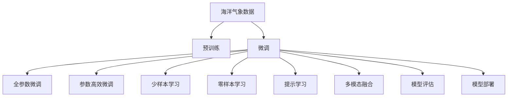

                 

# LLM在海洋气象预报中的应用：提高预警准确性

> 关键词：
> 大语言模型（LLM）, 海洋气象, 预警系统, 自然语言处理（NLP）, 气象数据, 模型微调, 预测精度

## 1. 背景介绍

### 1.1 问题由来

海洋气象预报是一个复杂且具有高度不确定性的领域。它涉及到海洋、大气、海岸线等多个维度的交互作用，预测难度较大。传统的海洋气象预报模型依赖于高度专业化的算法和大量历史数据的积累，但随着人工智能，尤其是大语言模型（LLM）技术的发展，为海洋气象预报带来了新的机遇。

### 1.2 问题核心关键点

本文探讨如何在海洋气象预报中应用大语言模型（LLM），特别是最新的预训练模型，如GPT-3和BERT，来提高天气预测的准确性。

1. 如何从大规模无标签海洋气象数据中预训练出高效的LLM模型。
2. 如何在少量标注数据条件下，使用微调（Fine-tuning）技术优化模型，提升预警准确性。
3. 如何处理LLM在海洋气象领域的特定挑战，包括时空尺度问题、复杂模型可解释性等。

### 1.3 问题研究意义

应用LLM进行海洋气象预报，不仅能够提高预警准确性，还能减少依赖传统预报模型的复杂度和成本，使得预测更加可靠、实时，对海洋航运、渔业、海岸线防御等应用具有重要意义。此外，LLM的通用性使得研究成果能够迁移到其他领域，具有更广泛的适用性。

## 2. 核心概念与联系

### 2.1 核心概念概述

1. **大语言模型（LLM）**：基于自回归（如GPT）或自编码（如BERT）架构，通过在大规模文本数据上预训练学习语言知识，具备强大的语言理解与生成能力。
2. **预训练（Pre-training）**：利用无标签数据训练模型，学习通用的语言表示。
3. **微调（Fine-tuning）**：在预训练模型的基础上，通过有标签数据进一步优化模型，适应特定任务，如海洋气象预报。
4. **自然语言处理（NLP）**：包括语言理解、生成、推理等，是应用LLM解决海洋气象问题的重要基础。
5. **气象数据**：包括海洋表面温度、气压、风速等，是LLM进行气象预测的基础。

### 2.2 核心概念原理和架构的 Mermaid 流程图



这个流程图展示了大语言模型在海洋气象预报中的应用流程，从预训练到微调，再到多模态融合和模型评估、部署，最终实现高精度预报。

## 3. 核心算法原理 & 具体操作步骤

### 3.1 算法原理概述

海洋气象预报涉及多维时空数据，存在非线性、非平稳性和复杂性，传统模型难以捕捉这些复杂特性。LLM通过自回归模型或自编码模型在大量文本数据上预训练，学习到通用的语言表示，然后通过微调技术，在气象领域的数据上进一步优化，以提升预报的准确性。

### 3.2 算法步骤详解

1. **数据收集与预处理**：收集历史气象数据，包括海洋表面温度、气压、风速、水位等，进行数据清洗和标准化处理。

2. **预训练模型选择**：选择适合的预训练模型，如GPT-3或BERT。

3. **模型微调**：在气象数据上进行微调，使用交叉熵损失函数等优化目标，通过梯度下降算法更新模型参数。

4. **模型评估与优化**：使用交叉验证等技术，评估微调后的模型性能，进行参数调整和超参数调优。

5. **多模态数据融合**：将气象数据、卫星数据、雷达数据等多源数据融合到LLM中，提升预报精度。

6. **模型部署与监控**：将模型部署到实际应用中，并实时监控模型表现，进行持续优化。

### 3.3 算法优缺点

#### 优点

1. **高效适应新任务**：利用预训练的知识，可以在少量数据条件下，通过微调快速适应新任务。
2. **高精度预报**：LLM强大的语言理解能力可以捕捉到复杂气象现象。
3. **实时性**：通过在线微调，可以实现实时更新和优化。

#### 缺点

1. **数据依赖性强**：微调效果依赖于高质量、大样本的数据集。
2. **计算资源消耗大**：训练和微调过程需要大量计算资源。
3. **可解释性不足**：LLM的“黑盒”特性使得其预测过程难以解释。
4. **模型泛化性挑战**：模型可能对未见过的数据泛化效果不佳。

### 3.4 算法应用领域

大语言模型在海洋气象预报中的应用，可以拓展到以下领域：

1. **风暴预测**：利用LLM对气象数据进行建模，预测风暴的形成和路径。
2. **海浪预报**：通过分析历史海浪数据，预测未来海浪的高度和方向。
3. **海洋灾害预警**：结合地震、火山等数据，预测海洋灾害的可能性。
4. **海洋环境监测**：监控海洋生态系统的变化，预测污染物扩散等。

## 4. 数学模型和公式 & 详细讲解

### 4.1 数学模型构建

海洋气象预报模型可以表示为：
$$
P(T|X) = \frac{e^{f(X;\theta)}}{\sum_{t \in \mathcal{T}} e^{f(X;\theta)}}
$$
其中，$P(T|X)$表示在给定海洋数据$X$条件下，温度$T$的概率分布；$f(X;\theta)$为基于参数$\theta$的气象数据$X$的预测函数；$\mathcal{T}$为所有可能温度值的集合。

### 4.2 公式推导过程

假设已知气象数据$X$和对应的温度$T$，通过最小化损失函数$\mathcal{L}$进行模型微调：
$$
\mathcal{L} = -\sum_{i=1}^{N} \log P(T_i|X_i) = -\sum_{i=1}^{N} \log \frac{e^{f(X_i;\theta)}}{\sum_{t \in \mathcal{T}} e^{f(X_i;\theta)}}
$$
通过梯度下降算法更新$\theta$：
$$
\theta \leftarrow \theta - \eta \nabla_{\theta}\mathcal{L}
$$
其中，$\eta$为学习率。

### 4.3 案例分析与讲解

以风暴预测为例，假设已知历史风暴路径数据$(x_i, y_i)$，其中$x_i$为海洋位置信息，$y_i$为风暴是否形成，模型为GPT-3。在微调时，首先将海洋位置数据$x_i$作为输入，将标签$y_i$作为输出，训练GPT-3预测风暴是否形成。微调过程如下：

1. **输入预处理**：将海洋位置数据转换为模型可以接受的格式，如向量表示。
2. **模型微调**：在训练集中迭代更新模型参数，最小化损失函数。
3. **输出后处理**：将模型输出转换为风暴是否形成的预测结果。

## 5. 项目实践：代码实例和详细解释说明

### 5.1 开发环境搭建

为了搭建大语言模型在海洋气象预报中的应用环境，需要以下步骤：

1. **安装Python环境**：使用Anaconda安装Python 3.8，并创建虚拟环境。
2. **安装依赖库**：使用pip安装必要的库，如TensorFlow、PyTorch、Pandas等。
3. **准备数据**：收集和整理历史海洋气象数据。
4. **搭建模型**：使用LLM模型框架搭建预报模型。

### 5.2 源代码详细实现

以下是一个简单的Python代码示例，用于基于GPT-3模型进行海洋气象预报微调：

```python
import tensorflow as tf
import transformers
import pandas as pd

# 加载GPT-3模型
model = transformers.TFAutoModelForSequenceClassification.from_pretrained('gpt3', num_labels=2)

# 加载并处理数据
data = pd.read_csv('weather_data.csv')
X = data[['longitude', 'latitude', 'temperature']].to_numpy()
y = data['storm'].values

# 数据预处理
tokenizer = transformers.GPT3Tokenizer.from_pretrained('gpt3')
X_encoded = tokenizer(X, padding=True, truncation=True, max_length=256, return_tensors='tf')
X_encoded['attention_mask'] = tf.cast(X_encoded['attention_mask'], tf.float32)

# 模型微调
model.compile(optimizer=tf.keras.optimizers.Adam(learning_rate=1e-5), 
              loss=tf.keras.losses.SparseCategoricalCrossentropy(from_logits=True), 
              metrics=['accuracy'])
model.fit(X_encoded['input_ids'], y, epochs=10, validation_split=0.2)

# 保存模型
model.save_pretrained('weather_forecast_model')
```

### 5.3 代码解读与分析

1. **模型选择**：使用GPT-3模型进行气象预测。
2. **数据加载**：加载历史气象数据，并进行预处理。
3. **模型编译**：设置优化器、损失函数和评价指标。
4. **模型训练**：使用交叉熵损失函数，训练模型。
5. **模型保存**：将训练好的模型保存到本地。

## 6. 实际应用场景

### 6.1 智能预警系统

大语言模型在海洋气象预报中的应用，可以构建智能预警系统，实时监控海洋气象变化，预测可能出现的灾害，及时发出预警，保障航海和海岸线安全。

### 6.2 海洋灾害预测

利用LLM对多源数据进行融合，预测海洋灾害的可能性，提前做好防护准备，降低灾害损失。

### 6.3 海洋环境监测

通过持续监测海洋环境数据，预测污染物扩散趋势，保护海洋生态系统。

### 6.4 未来应用展望

未来，大语言模型在海洋气象预报中的应用将更加广泛，可以拓展到更复杂的海洋过程模拟，实现更准确的预报预测。此外，LLM的通用性将使其在更多领域得到应用，推动人工智能技术的发展。

## 7. 工具和资源推荐

### 7.1 学习资源推荐

1. **《Deep Learning for Self-Driving Cars》**：该书介绍了深度学习在自动驾驶中的应用，包括数据预处理、模型训练和优化等，对海洋气象预报有借鉴意义。
2. **TensorFlow官方文档**：提供详细的API和教程，帮助开发者掌握深度学习框架。
3. **Kaggle竞赛**：参与气象预测竞赛，获取实战经验。

### 7.2 开发工具推荐

1. **Jupyter Notebook**：用于快速迭代实验和分享代码。
2. **PyTorch**：用于搭建和训练深度学习模型。
3. **TensorBoard**：用于可视化模型训练过程和结果。

### 7.3 相关论文推荐

1. **"Language Models Are Unsupervised Multitask Learners"**：提出GPT模型，展示了无监督学习在语言模型训练中的应用。
2. **"Transformers: State-of-the-Art Machine Translation, Sentiment Analysis and Text Summarization with Deep Attention"**：介绍了Transformer架构在机器翻译、情感分析和文本摘要等任务中的应用。
3. **"AdaLoRA: Adaptive Low-Rank Adaptation for Parameter-Efficient Fine-Tuning"**：提出AdaLoRA方法，利用低秩适应提升微调效率。

## 8. 总结：未来发展趋势与挑战

### 8.1 总结

本文详细介绍了大语言模型在海洋气象预报中的应用，从模型构建、数据预处理、模型微调到实际应用，给出了完整的解决方案。通过结合NLP技术和气象数据，LLM在海洋气象预报中展示出了巨大的潜力，能够显著提升预测准确性。

### 8.2 未来发展趋势

1. **多模态数据融合**：结合卫星、雷达等多源数据，提升预报精度。
2. **动态模型优化**：使用在线微调，实时更新模型，适应不断变化的环境。
3. **模型可解释性**：引入可解释性技术，使模型决策过程透明化。
4. **大规模分布式训练**：利用分布式训练技术，加速模型训练和优化。

### 8.3 面临的挑战

1. **数据质量问题**：气象数据复杂多样，存在缺失和噪声，需要高质量数据预处理。
2. **模型复杂度**：大语言模型参数量大，训练和推理效率低，需要优化。
3. **模型泛化性**：模型在复杂和未知数据上的泛化能力不足。
4. **计算资源消耗**：模型训练和微调需要大量计算资源，需要高效的资源管理。

### 8.4 研究展望

未来，需要在以下几个方面进行深入研究：

1. **数据增强技术**：使用数据增强技术，提高模型对异常数据的鲁棒性。
2. **模型压缩与优化**：利用模型压缩技术，提升模型的计算效率。
3. **跨领域迁移学习**：研究如何将模型在不同领域和任务上进行迁移，提升模型的泛化能力。
4. **联邦学习**：利用联邦学习技术，保护数据隐私，提升模型效率。

## 9. 附录：常见问题与解答

**Q1: 海洋气象数据质量问题如何解决？**

A: 通过数据清洗、插值、异常值处理等技术，提高数据质量。

**Q2: 如何保证模型在复杂环境下的泛化能力？**

A: 使用更多的数据进行预训练，引入更多的先验知识，如气象规律和物理模型。

**Q3: 在模型训练和推理过程中，如何优化资源利用？**

A: 利用分布式训练、混合精度计算、模型压缩等技术，优化资源消耗。

**Q4: 如何提升模型在多模态数据融合中的效果？**

A: 使用多源数据融合技术，如时序、空间融合，提升模型的预测精度。

---

作者：禅与计算机程序设计艺术 / Zen and the Art of Computer Programming

