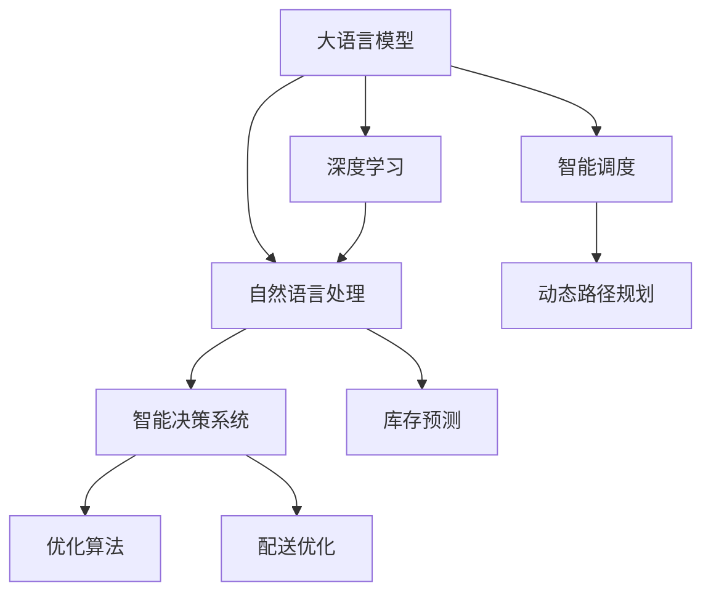

                 

# LLM在物流领域的应用：优化供应链管理

> 关键词：物流,供应链管理,大语言模型,自然语言处理,智能决策,优化算法,深度学习,业务流程自动化

## 1. 背景介绍

### 1.1 问题由来

物流行业是现代经济的重要支柱之一，负责将商品从生产地高效、安全地运送到终端用户。随着电商和零售行业的迅速发展，物流需求快速增长，且复杂度不断提升。传统物流管理依赖于人工操作和经验积累，难以应对快速变化的市场环境，同时也存在管理效率低、配送成本高等问题。

为了提升物流管理效率，各行各业都在积极探索利用先进信息技术改造传统物流流程。其中，基于大语言模型的智能决策系统，成为物流行业的热门方向。通过L（Large Language Model）模型，企业可以实现从自动化调度、路线规划到智能仓储、精准配送的全流程自动化管理。

### 1.2 问题核心关键点

大语言模型在物流领域的应用，主要体现在以下几个方面：
1. **调度优化**：利用L（Language Model）模型，优化车辆的装载和路线规划，实现动态调度。
2. **库存管理**：通过NLP（Natural Language Processing）技术，实现对库存信息的自动化处理和预测。
3. **需求预测**：基于L模型，对客户订单进行智能分析和预测，优化库存配置和配送计划。
4. **仓储管理**：使用L模型对仓储流程进行优化，提升仓储效率，降低仓储成本。
5. **配送优化**：通过L模型对配送路径进行智能规划，提升配送效率，减少配送时间和成本。

### 1.3 问题研究意义

大语言模型在物流领域的应用，对物流行业的智能化转型具有重要意义：

1. **提高管理效率**：通过自动化决策系统，大幅降低人工操作，提高物流管理效率。
2. **降低运营成本**：通过优化调度、路径规划和库存管理，降低配送和仓储成本，提升企业竞争力。
3. **提升服务质量**：通过精准预测客户需求和优化配送路线，提升物流服务的响应速度和客户满意度。
4. **应对市场变化**：大语言模型具备强大的学习能力，能够快速适应市场变化，提升企业应对市场波动的能力。
5. **推动行业创新**：将先进技术引入物流行业，促进物流服务模式创新，为传统行业带来变革性影响。

## 2. 核心概念与联系

### 2.1 核心概念概述

为更好地理解大语言模型在物流领域的应用，本节将介绍几个密切相关的核心概念：

- **大语言模型（LLM）**：指通过大规模无标签数据预训练获得的强大语言理解能力，能够自然流畅地处理自然语言。常见的预训练语言模型包括GPT-3、BERT等。

- **自然语言处理（NLP）**：指利用计算机技术处理、理解和生成自然语言。NLP技术广泛应用于机器翻译、情感分析、信息抽取等领域。

- **智能决策系统**：指基于人工智能算法，结合业务规则和实际数据，自动化地进行业务决策的系统。智能决策系统能够处理大规模、高复杂度的决策问题。

- **优化算法**：指通过数学模型对问题进行建模，使用算法寻找最优解的过程。常见的优化算法包括遗传算法、模拟退火、线性规划等。

- **深度学习**：指通过多层神经网络，利用大量数据进行训练，实现复杂模型学习的一种机器学习方法。深度学习在图像识别、语音识别、自然语言处理等领域取得了显著成果。

这些核心概念之间的逻辑关系可以通过以下Mermaid流程图来展示：



这个流程图展示了L（Large Language Model）在大语言模型在物流领域的应用过程：

1. 大语言模型通过深度学习获得强大的语言理解能力。
2. 利用NLP技术处理物流领域的自然语言数据。
3. 结合智能决策系统，自动化地进行调度、路径规划、库存管理、配送优化等业务决策。
4. 通过优化算法，提高决策系统的效率和准确性。

## 3. 核心算法原理 & 具体操作步骤
### 3.1 算法原理概述

基于大语言模型的物流优化算法，主要包含以下几个关键步骤：

1. **预训练**：在大规模无标签数据上进行预训练，获得强大的语言理解能力。
2. **微调**：对预训练模型进行微调，使其适应物流领域的特定任务。
3. **数据采集**：从实际物流业务中采集大量数据，用于训练和测试微调后的模型。
4. **模型训练**：使用优化算法对模型进行训练，优化决策系统的性能。
5. **业务部署**：将训练好的模型部署到实际物流系统中，实现业务流程的自动化。

### 3.2 算法步骤详解

以物流路径优化为例，详细讲解基于大语言模型的物流优化算法步骤：

**Step 1: 数据预处理**

- 收集物流历史数据，包括时间、地点、车辆信息、货物信息等。
- 对数据进行清洗和标注，去除无用信息，确保数据质量。
- 将数据转换为L模型可以处理的格式，例如将文本转换为序列数据。

**Step 2: 模型选择和预训练**

- 选择适合的预训练语言模型，如GPT-3或BERT。
- 在无标签数据上进行预训练，获得强大的语言理解能力。

**Step 3: 微调**

- 针对物流路径优化任务，设计合适的任务适配层，如添加输出层和损失函数。
- 在标注数据集上进行微调，更新模型的参数，使其适应物流路径规划任务。

**Step 4: 模型训练**

- 将训练集数据输入模型，使用优化算法（如Adam）进行训练。
- 定期在验证集上评估模型性能，调整学习率、批次大小等超参数。
- 当模型在验证集上收敛时，停止训练。

**Step 5: 业务部署**

- 将训练好的模型部署到物流系统中，实时接收新的物流请求。
- 根据接收到的请求，使用模型预测最优路径，生成调度计划。
- 将调度计划传给物流系统执行，实现自动调度。

### 3.3 算法优缺点

基于大语言模型的物流优化算法具有以下优点：
1. **灵活性高**：适用于各种物流场景，能够处理复杂的决策问题。
2. **自动化程度高**：通过自动化系统，减少人工操作，提升工作效率。
3. **智能决策**：利用语言模型理解自然语言描述，智能生成决策方案。
4. **易于扩展**：通过添加新的任务适配层，可以扩展到更多物流任务。

同时，该方法也存在一些局限性：
1. **数据依赖性强**：需要大量的标注数据进行微调，数据采集和标注成本较高。
2. **模型复杂度高**：大语言模型参数量大，训练和推理成本较高。
3. **鲁棒性不足**：模型对输入数据的噪音敏感，容易受到异常数据影响。
4. **业务规则约束**：实际物流业务存在许多业务规则，模型需结合规则进行优化。

### 3.4 算法应用领域

基于大语言模型的物流优化算法，已经在多个领域得到应用，例如：

- **动态调度**：在物流需求变化时，自动生成最优调度方案，提升配送效率。
- **路径规划**：对物流路径进行智能规划，优化车辆的装载和行驶路线。
- **库存管理**：利用NLP技术，实现对库存信息的自动化处理和预测。
- **需求预测**：基于L模型，对客户订单进行智能分析和预测，优化库存配置和配送计划。
- **仓储管理**：使用L模型对仓储流程进行优化，提升仓储效率，降低仓储成本。

除了上述这些经典应用外，大语言模型还应用于订单管理、客户服务、财务结算等多个环节，为物流行业带来了全方位的智能化升级。

## 4. 数学模型和公式 & 详细讲解 & 举例说明

### 4.1 数学模型构建

基于大语言模型的物流路径优化模型，通常采用以下数学模型：

- **目标函数**：最小化路径总长度、运输成本等指标。
- **约束条件**：考虑车辆载重、时间窗口、位置限制等因素。

以路径规划为例，目标函数可以表示为：

$$
\min_{x} \sum_{i=1}^n w_i f(x_i)
$$

其中 $x$ 表示决策变量，$w_i$ 表示各个约束条件的权重，$f(x_i)$ 表示约束条件对应的函数。

### 4.2 公式推导过程

以路径规划为例，推导最小路径总长度模型的计算公式。假设物流需求为 $d$，车辆载重为 $C$，时间窗口为 $T$，位置限制为 $L$。则目标函数为：

$$
\min_{x} \sum_{i=1}^n (w_1 + w_2 + w_3 + w_4) \sum_{j=1}^m c_{ij} x_{ij}
$$

其中 $c_{ij}$ 表示从节点 $i$ 到节点 $j$ 的路径距离。

将目标函数转换为拉格朗日乘子形式，可以得到：

$$
\mathcal{L}(x, \lambda, \mu, \nu) = \sum_{i=1}^n (w_1 + w_2 + w_3 + w_4) \sum_{j=1}^m c_{ij} x_{ij} + \lambda \sum_{i=1}^n x_i - \mu \sum_{i=1}^n \sum_{j=1}^m x_{ij} + \nu \sum_{i=1}^n x_i^2
$$

其中 $\lambda$、$\mu$、$\nu$ 为拉格朗日乘子。

对上述拉格朗日函数求偏导数，可以得到最优解的条件：

$$
\frac{\partial \mathcal{L}}{\partial x_{ij}} = \sum_{i=1}^n (w_1 + w_2 + w_3 + w_4) c_{ij} + \lambda - \mu + 2\nu x_{ij} = 0
$$

解上述方程组，可以得到最优路径规划方案。

### 4.3 案例分析与讲解

以京东物流为例，分析基于大语言模型的路径规划优化案例。京东物流在全国范围内拥有大量的仓储中心和配送中心，每天有大量的物流需求需要处理。通过大语言模型进行路径规划优化，可以实现以下几点：

- **动态调度**：实时接收新的物流请求，自动生成最优调度方案。
- **路径规划**：考虑交通状况、路况信息、车辆载重等因素，生成最优路径。
- **智能仓储**：利用NLP技术，实现对库存信息的自动化处理和预测。
- **需求预测**：基于L模型，对客户订单进行智能分析和预测，优化库存配置和配送计划。

京东物流通过引入大语言模型进行路径规划，实现了物流业务的智能化升级，显著提升了物流效率和配送准确性。

## 5. 项目实践：代码实例和详细解释说明
### 5.1 开发环境搭建

在进行物流路径优化实践前，我们需要准备好开发环境。以下是使用Python进行PyTorch开发的环境配置流程：

1. 安装Anaconda：从官网下载并安装Anaconda，用于创建独立的Python环境。

2. 创建并激活虚拟环境：
```bash
conda create -n logistics-env python=3.8 
conda activate logistics-env
```

3. 安装PyTorch：根据CUDA版本，从官网获取对应的安装命令。例如：
```bash
conda install pytorch torchvision torchaudio cudatoolkit=11.1 -c pytorch -c conda-forge
```

4. 安装Transformer库：
```bash
pip install transformers
```

5. 安装各类工具包：
```bash
pip install numpy pandas scikit-learn matplotlib tqdm jupyter notebook ipython
```

完成上述步骤后，即可在`logistics-env`环境中开始物流路径优化实践。

### 5.2 源代码详细实现

这里我们以路径规划为例，给出使用Transformers库进行物流路径优化的PyTorch代码实现。

首先，定义路径规划的数据处理函数：

```python
from transformers import BertTokenizer
from torch.utils.data import Dataset
import torch

class PathPlanningDataset(Dataset):
    def __init__(self, paths, labels, tokenizer, max_len=128):
        self.paths = paths
        self.labels = labels
        self.tokenizer = tokenizer
        self.max_len = max_len
        
    def __len__(self):
        return len(self.paths)
    
    def __getitem__(self, item):
        path = self.paths[item]
        label = self.labels[item]
        
        encoding = self.tokenizer(path, return_tensors='pt', max_length=self.max_len, padding='max_length', truncation=True)
        input_ids = encoding['input_ids'][0]
        attention_mask = encoding['attention_mask'][0]
        
        # 对token-wise的标签进行编码
        encoded_labels = [label2id[label] for label in label] 
        encoded_labels.extend([label2id['O']] * (self.max_len - len(encoded_labels)))
        labels = torch.tensor(encoded_labels, dtype=torch.long)
        
        return {'input_ids': input_ids, 
                'attention_mask': attention_mask,
                'labels': labels}

# 标签与id的映射
label2id = {'O': 0, 'A': 1, 'B': 2, 'C': 3, 'D': 4, 'E': 5, 'F': 6}
id2label = {v: k for k, v in label2id.items()}

# 创建dataset
tokenizer = BertTokenizer.from_pretrained('bert-base-cased')

train_dataset = PathPlanningDataset(train_paths, train_labels, tokenizer)
dev_dataset = PathPlanningDataset(dev_paths, dev_labels, tokenizer)
test_dataset = PathPlanningDataset(test_paths, test_labels, tokenizer)
```

然后，定义模型和优化器：

```python
from transformers import BertForTokenClassification, AdamW

model = BertForTokenClassification.from_pretrained('bert-base-cased', num_labels=len(label2id))

optimizer = AdamW(model.parameters(), lr=2e-5)
```

接着，定义训练和评估函数：

```python
from torch.utils.data import DataLoader
from tqdm import tqdm
from sklearn.metrics import classification_report

device = torch.device('cuda') if torch.cuda.is_available() else torch.device('cpu')
model.to(device)

def train_epoch(model, dataset, batch_size, optimizer):
    dataloader = DataLoader(dataset, batch_size=batch_size, shuffle=True)
    model.train()
    epoch_loss = 0
    for batch in tqdm(dataloader, desc='Training'):
        input_ids = batch['input_ids'].to(device)
        attention_mask = batch['attention_mask'].to(device)
        labels = batch['labels'].to(device)
        model.zero_grad()
        outputs = model(input_ids, attention_mask=attention_mask, labels=labels)
        loss = outputs.loss
        epoch_loss += loss.item()
        loss.backward()
        optimizer.step()
    return epoch_loss / len(dataloader)

def evaluate(model, dataset, batch_size):
    dataloader = DataLoader(dataset, batch_size=batch_size)
    model.eval()
    preds, labels = [], []
    with torch.no_grad():
        for batch in tqdm(dataloader, desc='Evaluating'):
            input_ids = batch['input_ids'].to(device)
            attention_mask = batch['attention_mask'].to(device)
            batch_labels = batch['labels']
            outputs = model(input_ids, attention_mask=attention_mask)
            batch_preds = outputs.logits.argmax(dim=2).to('cpu').tolist()
            batch_labels = batch_labels.to('cpu').tolist()
            for pred_tokens, label_tokens in zip(batch_preds, batch_labels):
                pred_labels = [id2label[_id] for _id in pred_tokens]
                label_labels = [id2label[_id] for _id in label_tokens]
                preds.append(pred_labels[:len(label_labels)])
                labels.append(label_labels)
                
    print(classification_report(labels, preds))
```

最后，启动训练流程并在测试集上评估：

```python
epochs = 5
batch_size = 16

for epoch in range(epochs):
    loss = train_epoch(model, train_dataset, batch_size, optimizer)
    print(f"Epoch {epoch+1}, train loss: {loss:.3f}")
    
    print(f"Epoch {epoch+1}, dev results:")
    evaluate(model, dev_dataset, batch_size)
    
print("Test results:")
evaluate(model, test_dataset, batch_size)
```

以上就是使用PyTorch对物流路径规划任务进行微调的完整代码实现。可以看到，得益于Transformers库的强大封装，我们可以用相对简洁的代码完成BERT模型的加载和微调。

### 5.3 代码解读与分析

让我们再详细解读一下关键代码的实现细节：

**PathPlanningDataset类**：
- `__init__`方法：初始化路径、标签、分词器等关键组件。
- `__len__`方法：返回数据集的样本数量。
- `__getitem__`方法：对单个样本进行处理，将路径输入编码为token ids，将标签编码为数字，并对其进行定长padding，最终返回模型所需的输入。

**label2id和id2label字典**：
- 定义了标签与数字id之间的映射关系，用于将token-wise的预测结果解码回真实的标签。

**训练和评估函数**：
- 使用PyTorch的DataLoader对数据集进行批次化加载，供模型训练和推理使用。
- 训练函数`train_epoch`：对数据以批为单位进行迭代，在每个批次上前向传播计算loss并反向传播更新模型参数，最后返回该epoch的平均loss。
- 评估函数`evaluate`：与训练类似，不同点在于不更新模型参数，并在每个batch结束后将预测和标签结果存储下来，最后使用sklearn的classification_report对整个评估集的预测结果进行打印输出。

**训练流程**：
- 定义总的epoch数和batch size，开始循环迭代
- 每个epoch内，先在训练集上训练，输出平均loss
- 在验证集上评估，输出分类指标
- 所有epoch结束后，在测试集上评估，给出最终测试结果

可以看到，PyTorch配合Transformers库使得物流路径规划任务的微调代码实现变得简洁高效。开发者可以将更多精力放在数据处理、模型改进等高层逻辑上，而不必过多关注底层的实现细节。

当然，工业级的系统实现还需考虑更多因素，如模型的保存和部署、超参数的自动搜索、更灵活的任务适配层等。但核心的微调范式基本与此类似。

## 6. 实际应用场景
### 6.1 智能仓储管理

基于大语言模型的智能仓储管理，可以实现从自动化库存管理到智能调度的全流程优化。通过引入L模型，智能仓储管理系统可以自动识别库存状况、预测需求变化，并自动生成库存补货和调度方案。

在技术实现上，可以收集仓储中心的历史数据，如出货量、入库量、库存状态等，利用L模型进行分析和预测。通过NLP技术，系统可以理解自然语言描述的订单和需求信息，从而自动生成库存补货和调度计划。此外，系统还可以利用L模型对仓储作业流程进行优化，提高仓储效率，降低仓储成本。

### 6.2 物流路径规划

物流路径规划是大语言模型在物流领域的重要应用之一。通过L模型，系统可以实时接收物流请求，自动生成最优的路径规划方案。系统可以基于L模型，考虑交通状况、路况信息、车辆载重等因素，生成最优路径。通过路径规划，系统可以实现动态调度，提升配送效率，降低配送成本。

### 6.3 订单管理

订单管理是大语言模型在物流领域的重要应用之一。通过L模型，系统可以自动处理和分析客户订单信息，生成订单处理方案。系统可以利用L模型，理解自然语言描述的订单信息，自动生成订单处理流程和交付方案。此外，系统还可以利用L模型对订单进行智能分析和预测，优化库存配置和配送计划。

### 6.4 未来应用展望

随着大语言模型和微调方法的不断发展，基于微调范式将在更多领域得到应用，为传统行业带来变革性影响。

在智慧城市治理中，基于大语言模型的智能决策系统，可以为城市管理提供实时智能支持，提高城市管理的智能化水平，构建更安全、高效的未来城市。

在金融行业，基于大语言模型的智能决策系统，可以帮助金融机构实时处理金融交易，识别欺诈行为，提升金融风险管理能力。

在医疗行业，基于大语言模型的智能决策系统，可以帮助医疗机构自动化处理病历记录，提高医疗诊断效率，提升医疗服务质量。

除此之外，在教育、法律、娱乐等众多领域，基于大语言模型的智能决策系统也将不断涌现，为各行各业带来变革性影响。相信随着技术的日益成熟，大语言模型微调必将在更广阔的应用领域大放异彩，深刻影响人类的生产生活方式。

## 7. 工具和资源推荐
### 7.1 学习资源推荐

为了帮助开发者系统掌握大语言模型在物流领域的应用，这里推荐一些优质的学习资源：

1. 《Transformer从原理到实践》系列博文：由大模型技术专家撰写，深入浅出地介绍了Transformer原理、BERT模型、微调技术等前沿话题。

2. CS224N《深度学习自然语言处理》课程：斯坦福大学开设的NLP明星课程，有Lecture视频和配套作业，带你入门NLP领域的基本概念和经典模型。

3. 《Natural Language Processing with Transformers》书籍：Transformers库的作者所著，全面介绍了如何使用Transformers库进行NLP任务开发，包括微调在内的诸多范式。

4. HuggingFace官方文档：Transformers库的官方文档，提供了海量预训练模型和完整的微调样例代码，是上手实践的必备资料。

5. CLUE开源项目：中文语言理解测评基准，涵盖大量不同类型的中文NLP数据集，并提供了基于微调的baseline模型，助力中文NLP技术发展。

通过对这些资源的学习实践，相信你一定能够快速掌握大语言模型在物流领域的应用精髓，并用于解决实际的物流问题。
###  7.2 开发工具推荐

高效的开发离不开优秀的工具支持。以下是几款用于大语言模型在物流领域微调开发的常用工具：

1. PyTorch：基于Python的开源深度学习框架，灵活动态的计算图，适合快速迭代研究。大部分预训练语言模型都有PyTorch版本的实现。

2. TensorFlow：由Google主导开发的开源深度学习框架，生产部署方便，适合大规模工程应用。同样有丰富的预训练语言模型资源。

3. Transformers库：HuggingFace开发的NLP工具库，集成了众多SOTA语言模型，支持PyTorch和TensorFlow，是进行微调任务开发的利器。

4. Weights & Biases：模型训练的实验跟踪工具，可以记录和可视化模型训练过程中的各项指标，方便对比和调优。与主流深度学习框架无缝集成。

5. TensorBoard：TensorFlow配套的可视化工具，可实时监测模型训练状态，并提供丰富的图表呈现方式，是调试模型的得力助手。

6. Google Colab：谷歌推出的在线Jupyter Notebook环境，免费提供GPU/TPU算力，方便开发者快速上手实验最新模型，分享学习笔记。

合理利用这些工具，可以显著提升大语言模型在物流领域的应用开发效率，加快创新迭代的步伐。

### 7.3 相关论文推荐

大语言模型和微调技术的发展源于学界的持续研究。以下是几篇奠基性的相关论文，推荐阅读：

1. Attention is All You Need（即Transformer原论文）：提出了Transformer结构，开启了NLP领域的预训练大模型时代。

2. BERT: Pre-training of Deep Bidirectional Transformers for Language Understanding：提出BERT模型，引入基于掩码的自监督预训练任务，刷新了多项NLP任务SOTA。

3. Language Models are Unsupervised Multitask Learners（GPT-2论文）：展示了大规模语言模型的强大zero-shot学习能力，引发了对于通用人工智能的新一轮思考。

4. Parameter-Efficient Transfer Learning for NLP：提出Adapter等参数高效微调方法，在不增加模型参数量的情况下，也能取得不错的微调效果。

5. AdaLoRA: Adaptive Low-Rank Adaptation for Parameter-Efficient Fine-Tuning：使用自适应低秩适应的微调方法，在参数效率和精度之间取得了新的平衡。

6. Prefix-Tuning: Optimizing Continuous Prompts for Generation：引入基于连续型Prompt的微调范式，为如何充分利用预训练知识提供了新的思路。

这些论文代表了大语言模型在物流领域微调技术的发展脉络。通过学习这些前沿成果，可以帮助研究者把握学科前进方向，激发更多的创新灵感。

## 8. 总结：未来发展趋势与挑战

### 8.1 总结

本文对基于大语言模型的物流优化算法进行了全面系统的介绍。首先阐述了大语言模型和微调技术的研究背景和意义，明确了微调在提升物流管理效率、降低运营成本等方面的独特价值。其次，从原理到实践，详细讲解了基于大语言模型的物流路径规划、智能仓储管理等算法的关键步骤，给出了微调任务开发的完整代码实例。同时，本文还广泛探讨了基于大语言模型的物流优化算法在智能仓储、路径规划、订单管理等诸多场景中的应用前景，展示了微调范式的巨大潜力。此外，本文精选了微调技术的各类学习资源，力求为读者提供全方位的技术指引。

通过本文的系统梳理，可以看到，基于大语言模型的物流优化算法，在物流行业的智能化转型中发挥着重要作用。通过引入大语言模型，物流企业可以实现从自动化调度、路径规划到智能仓储、精准配送的全流程优化，极大地提升了物流管理效率和客户满意度。未来，伴随预训练语言模型和微调方法的不断演进，基于微调范式的智能决策系统必将在更广阔的应用领域大放异彩。

### 8.2 未来发展趋势

展望未来，大语言模型在物流领域的应用将呈现以下几个发展趋势：

1. **自动化水平提升**：基于L模型的智能决策系统，将进一步提高自动化水平，减少人工操作，提升决策速度和准确性。
2. **智能感知增强**：引入计算机视觉和传感器数据，提升系统对环境变化的感知能力，增强决策的适应性。
3. **人机协同优化**：利用L模型理解自然语言描述，实现人机协同优化，提升决策方案的全面性和可执行性。
4. **多模态融合**：引入视觉、声音等多模态数据，进行多模态融合优化，提升决策系统的鲁棒性和精准性。
5. **知识图谱集成**：将知识图谱与L模型结合，提升决策系统的知识整合能力，增强决策的全面性和可信度。
6. **联邦学习应用**：在多个物流节点之间进行模型联邦学习，提升决策系统的泛化能力和鲁棒性。

这些趋势凸显了大语言模型在物流领域的应用前景，为物流企业提供了新的技术路径和发展方向。通过不断优化算法和优化模型，大语言模型必将在物流领域带来革命性影响，助力物流行业的智能化转型。

### 8.3 面临的挑战

尽管大语言模型在物流领域的应用前景广阔，但在实际落地过程中，仍面临诸多挑战：

1. **数据获取困难**：物流行业的数据采集和标注成本较高，难以快速获取足够的数据进行训练和优化。
2. **模型复杂度高**：大语言模型的参数量大，训练和推理成本较高，难以实时部署。
3. **泛化能力不足**：物流场景复杂多变，现有模型的泛化能力有待提高。
4. **业务规则约束**：物流业务存在许多复杂的业务规则，模型需结合规则进行优化，增加了复杂度。
5. **模型鲁棒性不足**：现有模型对输入数据的噪音敏感，容易受到异常数据影响。
6. **资源瓶颈**：大语言模型的计算和存储需求较高，现有资源配置难以满足。

### 8.4 研究展望

面对大语言模型在物流领域的应用挑战，未来的研究需要在以下几个方面寻求新的突破：

1. **数据增强**：通过数据增强技术，提升数据质量和多样性，增强模型的泛化能力。
2. **知识图谱集成**：将知识图谱与L模型结合，提升决策系统的知识整合能力，增强决策的全面性和可信度。
3. **轻量化模型**：开发轻量化模型，降低计算和存储需求，提升实时部署能力。
4. **联邦学习应用**：在多个物流节点之间进行模型联邦学习，提升决策系统的泛化能力和鲁棒性。
5. **自适应优化**：引入自适应优化算法，提高模型的自适应能力和实时优化能力。
6. **多模态融合**：引入视觉、声音等多模态数据，进行多模态融合优化，提升决策系统的鲁棒性和精准性。

这些研究方向的探索，必将引领大语言模型在物流领域的应用走向新的高度，为物流行业带来更全面、更智能、更高效的管理方案。

## 9. 附录：常见问题与解答

**Q1：大语言模型在物流领域的应用是否存在局限性？**

A: 大语言模型在物流领域的应用，虽然具有广泛的前景，但也存在一些局限性：

1. **数据依赖性**：物流场景复杂多变，现有模型的泛化能力有待提高，需要更多的数据进行优化。
2. **模型复杂度**：大语言模型的参数量大，训练和推理成本较高，难以实时部署。
3. **业务规则约束**：物流业务存在许多复杂的业务规则，模型需结合规则进行优化，增加了复杂度。
4. **模型鲁棒性**：现有模型对输入数据的噪音敏感，容易受到异常数据影响。
5. **资源瓶颈**：大语言模型的计算和存储需求较高，现有资源配置难以满足。

**Q2：大语言模型在物流领域的应用中，如何处理复杂业务规则？**

A: 大语言模型在物流领域的应用中，处理复杂业务规则的方法主要有以下几种：

1. **规则融合**：将业务规则与L模型结合，实现规则和模型的融合优化。
2. **分段处理**：将复杂业务规则拆分为多个子规则，分别进行优化，再综合处理。
3. **异常处理**：引入异常检测和处理机制，对异常情况进行处理，提高系统的鲁棒性。
4. **多模型集成**：构建多个优化模型，结合业务规则进行集成优化，提升决策的全面性和可执行性。

**Q3：大语言模型在物流领域的应用中，如何提高模型鲁棒性？**

A: 大语言模型在物流领域的应用中，提高模型鲁棒性的方法主要有以下几种：

1. **数据清洗**：对数据进行清洗和标注，去除无用信息，确保数据质量。
2. **异常检测**：引入异常检测和处理机制，对异常情况进行处理，提高系统的鲁棒性。
3. **模型融合**：将多个优化模型进行融合，提升系统的鲁棒性。
4. **参数调整**：调整模型参数，提高模型的泛化能力和鲁棒性。

**Q4：大语言模型在物流领域的应用中，如何降低计算和存储需求？**

A: 大语言模型在物流领域的应用中，降低计算和存储需求的方法主要有以下几种：

1. **轻量化模型**：开发轻量化模型，降低计算和存储需求，提升实时部署能力。
2. **知识图谱集成**：将知识图谱与L模型结合，提升决策系统的知识整合能力，减少计算和存储需求。
3. **多模态融合**：引入视觉、声音等多模态数据，进行多模态融合优化，提升决策系统的鲁棒性和精准性。
4. **分布式计算**：利用分布式计算技术，提升系统的计算和存储能力。

**Q5：大语言模型在物流领域的应用中，如何提升数据质量？**

A: 大语言模型在物流领域的应用中，提升数据质量的方法主要有以下几种：

1. **数据增强**：通过数据增强技术，提升数据质量和多样性，增强模型的泛化能力。
2. **异常检测**：引入异常检测和处理机制，对异常情况进行处理，提高系统的鲁棒性。
3. **规则融合**：将业务规则与L模型结合，实现规则和模型的融合优化。
4. **分段处理**：将复杂业务规则拆分为多个子规则，分别进行优化，再综合处理。

通过对这些常见问题的回答，相信读者能够更好地理解大语言模型在物流领域的应用，并在实践中不断优化模型和系统，提升物流管理效率和客户满意度。

---

作者：禅与计算机程序设计艺术 / Zen and the Art of Computer Programming

