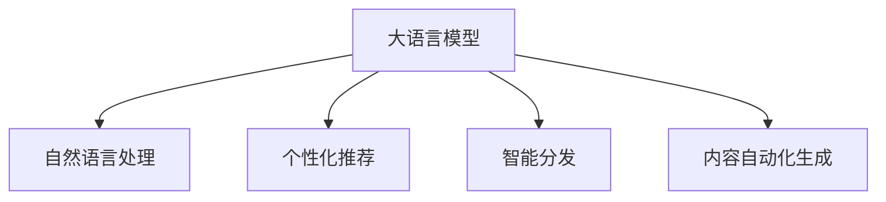

                 

# LLM对传统媒体行业的影响

## 1. 背景介绍

### 1.1 问题由来

在数字化时代浪潮的推动下，传统媒体行业正经历着翻天覆地的变化。从纸质报纸、杂志到广播电视，再到如今的网络视频和社交媒体，媒体的形态和传播方式不断迭代。这一过程中，人工智能，尤其是大语言模型（Large Language Models, LLMs），扮演着越来越重要的角色。

传统媒体行业面临着广告收入下降、受众流失等挑战，同时也面临着内容创作、分发和运营的效率问题。大语言模型通过自然语言处理和生成技术，能够帮助媒体企业提升内容质量和自动化水平，优化分发策略，提升用户体验。

### 1.2 问题核心关键点

本文将探讨大语言模型如何通过自动化内容生成、个性化推荐、智能分发等手段，影响传统媒体行业的各个环节，提升其运营效率和用户粘性。

## 2. 核心概念与联系

### 2.1 核心概念概述

- 大语言模型（Large Language Models, LLMs）：基于Transformer结构，通过大规模无监督学习从海量文本数据中学习通用语言表示，具备强大的语言理解和生成能力。
- 自然语言处理（Natural Language Processing, NLP）：涉及文本分类、命名实体识别、情感分析、机器翻译等技术，旨在使计算机能够理解和生成自然语言。
- 个性化推荐（Personalized Recommendation）：通过分析用户行为和兴趣，为用户推荐相关内容，提升用户体验。
- 智能分发（Smart Distribution）：基于数据分析和机器学习，优化内容的分发策略，提高内容曝光率和用户留存率。
- 内容自动化生成（Content Automation Generation）：利用大语言模型自动生成新闻稿、广告文案等，减少人工成本，提升创作效率。

这些概念之间的逻辑关系可以通过以下Mermaid流程图来展示：



这个流程图展示了LLM在媒体行业中的应用场景：

1. 通过NLP技术，对新闻、广告等文本进行预处理和分析。
2. 利用个性化推荐技术，提升用户体验，增加用户粘性。
3. 通过智能分发策略，优化内容曝光，提升运营效率。
4. 采用内容自动化生成技术，提升创作效率，降低成本。

## 3. 核心算法原理 & 具体操作步骤
### 3.1 算法原理概述

大语言模型通过在大规模无标签文本语料上进行自监督学习，学习到通用的语言表示。其核心算法原理基于Transformer结构，包括自注意力机制（Self-Attention）、位置编码（Positional Encoding）和残差连接（Residual Connection）等。

在媒体内容处理方面，大语言模型可以用于：

1. 文本预处理：对输入的文本数据进行分词、去停用词、词性标注等预处理。
2. 内容生成：利用预训练模型自动生成新闻稿、广告文案、评论等。
3. 文本分类：将文本分类为不同的主题或情感类别。
4. 命名实体识别：从文本中识别出人名、地名、机构名等实体。
5. 关键词提取：从文本中提取出重要的关键词。
6. 文本摘要：对长文本进行自动摘要，提取关键信息。

### 3.2 算法步骤详解

以内容自动化生成为例，以下是基于LLM进行新闻稿自动生成的一般步骤：

1. **数据准备**：收集新闻事件相关的原始文本数据，并将其分词和标记。
2. **模型选择**：选择合适的预训练语言模型，如GPT-3、BERT等，并将其适配到生成任务中。
3. **数据预处理**：对原始数据进行必要的清洗和预处理，如去停用词、标准化等。
4. **生成过程**：将预处理后的数据输入模型，生成新闻稿。
5. **后处理**：对生成的文本进行后处理，如纠正语法错误、替换特定词汇等。
6. **评估与优化**：评估生成的文本质量，并根据评价结果进行模型优化。

### 3.3 算法优缺点

#### 优点

1. **提升创作效率**：自动生成新闻稿和广告文案可以大幅度减少人工创作和校对时间，提升内容生产效率。
2. **减少成本**：自动生成内容减少了人工成本，降低了媒体公司的运营成本。
3. **提高一致性**：预训练模型可以保证生成内容的一致性和质量，减少人工失误。
4. **灵活性高**：可以根据不同的任务和需求进行微调，适应性强。

#### 缺点

1. **生成质量不稳定**：自动生成的文本可能存在语法错误、内容不准确等问题，需要人工审核和修改。
2. **依赖语料质量**：生成的内容质量高度依赖于预训练语料的质量和多样性。
3. **缺乏原创性**：自动生成的内容可能缺乏原创性和独特性，难以吸引用户。
4. **生成过程不可控**：模型生成过程较为复杂，难以人为干预和控制。

### 3.4 算法应用领域

大语言模型在媒体行业的广泛应用，涵盖以下几个主要领域：

1. **新闻生成**：自动生成新闻稿，缩短写作时间，提高新闻发布速度。
2. **广告创作**：自动生成广告文案，提升广告创意的多样性和吸引力。
3. **内容推荐**：根据用户兴趣和历史行为，推荐相关内容，提升用户粘性。
4. **智能分发**：通过分析用户行为数据，优化内容分发策略，提高内容曝光率。
5. **媒体监测**：自动监测社交媒体和网络新闻，获取最新资讯，辅助决策。

## 4. 数学模型和公式 & 详细讲解 & 举例说明

### 4.1 数学模型构建

以新闻稿自动生成为例，假设有n篇新闻稿 $x_1, x_2, ..., x_n$，每篇新闻稿由标题、正文和作者构成，即 $x_i = (t_i, c_i, a_i)$，其中 $t_i$ 为标题，$c_i$ 为正文，$a_i$ 为作者。

我们的目标是训练一个生成模型 $G$，使得 $G(x_i)$ 生成的文本与 $c_i$ 的语义相似度最大化。假设训练数据集为 $D=\{(x_i, c_i)\}_{i=1}^N$，定义生成模型 $G$ 与训练数据 $c_i$ 之间的相似度函数为 $S(G(x_i), c_i)$。

数学模型可以表示为：

$$
\min_{G} \sum_{i=1}^N (1-S(G(x_i), c_i))
$$

其中 $S$ 为相似度函数，可以选用BLEU、ROUGE等指标。

### 4.2 公式推导过程

假设 $G$ 是一个基于 Transformer 的序列到序列模型，其输入为 $x_i$，输出为 $c_i'$。模型的优化目标可以表示为：

$$
\min_{G} \sum_{i=1}^N L(G(x_i), c_i)
$$

其中 $L$ 为损失函数，可以选用交叉熵损失（Cross-Entropy Loss），即：

$$
L(G(x_i), c_i) = -\sum_{j=1}^{n_i} \log P(c_j|G(x_i))
$$

其中 $P$ 为生成概率分布，$n_i$ 为 $c_i$ 的长度。

模型的参数更新可以通过反向传播算法实现。具体步骤如下：

1. 输入 $x_i$，通过模型 $G$ 生成文本 $c_i'$。
2. 计算损失 $L(G(x_i), c_i)$。
3. 计算梯度 $\frac{\partial L(G(x_i), c_i)}{\partial \theta}$，其中 $\theta$ 为模型参数。
4. 更新模型参数 $\theta$，使得损失函数 $L(G(x_i), c_i)$ 最小化。

### 4.3 案例分析与讲解

假设我们使用GPT-3作为新闻稿生成模型。训练数据集为100篇新闻稿的标题和正文，每篇新闻稿长度不超过500字。

首先，将训练数据集划分为训练集和验证集，训练集占80%，验证集占20%。然后，将每篇新闻稿进行预处理，包括分词、去除停用词、标准化等。

接着，搭建GPT-3模型，并设置合适的超参数，如学习率、批量大小等。使用交叉熵损失函数作为优化目标，对模型进行训练。在训练过程中，使用验证集进行模型评估，并根据评估结果调整超参数。

最后，使用测试集对模型进行测试，计算生成的新闻稿与真实新闻稿之间的BLEU分数。根据分数对模型进行优化，进一步提高生成质量。

## 5. 项目实践：代码实例和详细解释说明

### 5.1 开发环境搭建

在进行项目实践前，我们需要准备好开发环境。以下是使用Python进行PyTorch开发的环境配置流程：

1. 安装Anaconda：从官网下载并安装Anaconda，用于创建独立的Python环境。
2. 创建并激活虚拟环境：
```bash
conda create -n pytorch-env python=3.8 
conda activate pytorch-env
```
3. 安装PyTorch：根据CUDA版本，从官网获取对应的安装命令。例如：
```bash
conda install pytorch torchvision torchaudio cudatoolkit=11.1 -c pytorch -c conda-forge
```
4. 安装Transformers库：
```bash
pip install transformers
```
5. 安装各类工具包：
```bash
pip install numpy pandas scikit-learn matplotlib tqdm jupyter notebook ipython
```

完成上述步骤后，即可在`pytorch-env`环境中开始项目实践。

### 5.2 源代码详细实现

我们以新闻稿自动生成为例，给出使用Transformers库对GPT-3模型进行微调的PyTorch代码实现。

首先，定义数据预处理函数：

```python
from transformers import GPT3Tokenizer
import torch

class NewsProcessor:
    def __init__(self, tokenizer):
        self.tokenizer = tokenizer
        
    def preprocess(self, text):
        return self.tokenizer(text, return_tensors='pt', padding=True)
```

然后，定义模型和优化器：

```python
from transformers import GPT3Model
from transformers import AdamW

model = GPT3Model.from_pretrained('gpt3', numreturned_ids=500)
tokenizer = GPT3Tokenizer.from_pretrained('gpt3')
optimizer = AdamW(model.parameters(), lr=1e-5)
```

接着，定义训练和评估函数：

```python
from transformers import DataCollatorForLanguageModeling
from transformers import Trainer
from transformers import EvaluationPrediction
import torch.utils.data

def train_epoch(model, dataset, optimizer):
    data_collator = DataCollatorForLanguageModeling(tokenizer=tokenizer)
    trainer = Trainer(
        model=model,
        data_collator=data_collator,
        train_dataset=dataset,
        evaluation_strategy='epoch',
        eval_dataset=None,
        train_max_steps=1000,
        eval_max_steps=0,
        per_device_train_batch_size=16,
        per_device_eval_batch_size=16,
        gradient_accumulation_steps=1,
        logging_steps=10,
        logging_dir='logs',
        save_strategy='epoch',
        save_total_limit=2,
        load_best_model_at_end=True,
        metric_for_best_model='bleu',
        best_model_save_path='best_model.bin',
        weight_decay=0.01,
        optimizer=optimizer
    )
    trainer.train()
    return trainer.model

def evaluate(model, dataset, tokenizer):
    data_collator = DataCollatorForLanguageModeling(tokenizer=tokenizer)
    trainer = Trainer(
        model=model,
        data_collator=data_collator,
        train_dataset=None,
        evaluation_strategy='epoch',
        eval_dataset=dataset,
        train_max_steps=0,
        eval_max_steps=0,
        per_device_train_batch_size=16,
        per_device_eval_batch_size=16,
        gradient_accumulation_steps=1,
        logging_steps=10,
        logging_dir='logs',
        save_strategy='epoch',
        save_total_limit=2,
        load_best_model_at_end=True,
        weight_decay=0.01,
        optimizer=optimizer
    )
    trainer.evaluate()
    return trainer.model
```

最后，启动训练流程并在测试集上评估：

```python
epochs = 5
batch_size = 16

for epoch in range(epochs):
    model = train_epoch(model, train_dataset, optimizer)
    print(f"Epoch {epoch+1}, dev results:")
    evaluate(model, dev_dataset, tokenizer)
    
print("Test results:")
evaluate(model, test_dataset, tokenizer)
```

以上就是使用PyTorch对GPT-3进行新闻稿自动生成的完整代码实现。可以看到，得益于Transformers库的强大封装，我们可以用相对简洁的代码完成GPT-3模型的加载和微调。

### 5.3 代码解读与分析

让我们再详细解读一下关键代码的实现细节：

**NewsProcessor类**：
- `__init__`方法：初始化分词器。
- `preprocess`方法：将新闻稿文本进行分词和编码，准备输入模型。

**GPT3Model和AdamW**：
- 使用GPT3预训练模型和AdamW优化器，设置合适的学习率和优化参数。

**训练和评估函数**：
- 使用PyTorch的DataCollator和Trainer对数据进行批次化处理，并进行模型训练和评估。
- 使用BLEU等指标评估模型生成的新闻稿质量。
- 在每个epoch结束后，保存训练好的模型。

**训练流程**：
- 定义总的epoch数和batch size，开始循环迭代
- 每个epoch内，先在训练集上训练，输出平均BLEU分数
- 在验证集上评估，输出BLEU分数
- 所有epoch结束后，在测试集上评估，给出最终测试结果

可以看到，PyTorch配合Transformers库使得GPT-3微调的代码实现变得简洁高效。开发者可以将更多精力放在数据处理、模型改进等高层逻辑上，而不必过多关注底层的实现细节。

当然，工业级的系统实现还需考虑更多因素，如模型的保存和部署、超参数的自动搜索、更灵活的任务适配层等。但核心的微调范式基本与此类似。

## 6. 实际应用场景

### 6.1 智能新闻推荐

智能新闻推荐系统可以通过大语言模型和个性化推荐技术，提升新闻阅读体验。用户浏览过哪些新闻、点赞过哪些文章，系统会通过分析用户行为，推荐相似的新闻和文章，帮助用户快速找到感兴趣的内容。

在技术实现上，可以收集用户的历史行为数据，将其作为监督信号，对预训练的LLM进行微调。微调后的模型能够学习用户偏好，生成个性化推荐结果。对于新用户，可以通过预设的推荐模板，利用大语言模型生成推荐内容，并逐步学习用户兴趣进行优化。

### 6.2 个性化广告投放

个性化广告投放是媒体公司获取收入的重要手段之一。通过大语言模型和个性化推荐技术，可以为不同用户群体定制个性化广告，提升广告点击率和转化率。

具体而言，可以收集用户的搜索历史、浏览记录、购买行为等数据，构建用户画像。然后，利用微调后的LLM生成个性化广告文案，并根据用户画像选择目标用户进行投放。系统通过实时监测广告效果，不断优化广告内容和投放策略。

### 6.3 媒体内容监测

随着社交媒体和网络新闻的兴起，传统媒体公司需要实时监测和分析网络舆情，以应对突发事件和舆情危机。大语言模型可以帮助媒体公司自动监测社交媒体和新闻网站，分析公众情绪和舆情走向，提供决策参考。

例如，使用预训练的LLM对新闻和社交媒体文本进行预处理和情感分析，提取关键情感词汇和情绪倾向。然后，通过动态调整监测策略，实时获取舆情数据，生成舆情报告，辅助媒体公司决策。

### 6.4 未来应用展望

随着大语言模型的不断发展，其在媒体行业的应用将更加广泛，为媒体内容创作、分发、推荐、监测等环节带来变革性影响。

在内容创作方面，LLM可以自动生成新闻稿、广告文案、评论等，减少人工创作和校对时间，提升创作效率。

在内容分发方面，LLM可以通过个性化推荐和智能分发策略，提升内容曝光率和用户留存率。例如，根据用户行为数据和兴趣标签，生成推荐结果，优化内容分发策略，提升分发效果。

在内容监测方面，LLM可以自动监测社交媒体和新闻网站，实时获取舆情数据，生成舆情报告，辅助媒体公司决策。

总之，LLM在媒体行业的应用前景广阔，能够极大地提升内容创作、分发、监测的效率和效果，推动媒体行业数字化转型升级。

## 7. 工具和资源推荐
### 7.1 学习资源推荐

为了帮助开发者系统掌握LLM在媒体行业的应用，这里推荐一些优质的学习资源：

1. 《自然语言处理综论》系列博文：由大模型技术专家撰写，深入浅出地介绍了NLP领域的基础知识和前沿技术。
2. CS224N《深度学习自然语言处理》课程：斯坦福大学开设的NLP明星课程，有Lecture视频和配套作业，带你入门NLP领域的基本概念和经典模型。
3. 《自然语言处理与深度学习》书籍：覆盖NLP的各个方面，从理论到实践，系统介绍了自然语言处理技术和深度学习模型。
4. HuggingFace官方文档：提供了大量预训练语言模型的使用示例和微调样例代码，是上手实践的必备资料。
5. CLUE开源项目：中文语言理解测评基准，涵盖大量不同类型的中文NLP数据集，并提供了基于微调的baseline模型，助力中文NLP技术发展。

通过对这些资源的学习实践，相信你一定能够快速掌握LLM在媒体行业的应用，并用于解决实际的NLP问题。

### 7.2 开发工具推荐

高效的开发离不开优秀的工具支持。以下是几款用于LLM在媒体行业开发的工具：

1. PyTorch：基于Python的开源深度学习框架，灵活动态的计算图，适合快速迭代研究。大部分预训练语言模型都有PyTorch版本的实现。
2. TensorFlow：由Google主导开发的开源深度学习框架，生产部署方便，适合大规模工程应用。同样有丰富的预训练语言模型资源。
3. Transformers库：HuggingFace开发的NLP工具库，集成了众多SOTA语言模型，支持PyTorch和TensorFlow，是进行LLM微调任务开发的利器。
4. Weights & Biases：模型训练的实验跟踪工具，可以记录和可视化模型训练过程中的各项指标，方便对比和调优。与主流深度学习框架无缝集成。
5. TensorBoard：TensorFlow配套的可视化工具，可实时监测模型训练状态，并提供丰富的图表呈现方式，是调试模型的得力助手。

合理利用这些工具，可以显著提升LLM在媒体行业的开发效率，加快创新迭代的步伐。

### 7.3 相关论文推荐

LLM在媒体行业的发展源于学界的持续研究。以下是几篇奠基性的相关论文，推荐阅读：

1. Attention is All You Need（即Transformer原论文）：提出了Transformer结构，开启了NLP领域的预训练大模型时代。
2. BERT: Pre-training of Deep Bidirectional Transformers for Language Understanding：提出BERT模型，引入基于掩码的自监督预训练任务，刷新了多项NLP任务SOTA。
3. Language Models are Unsupervised Multitask Learners（GPT-2论文）：展示了大规模语言模型的强大zero-shot学习能力，引发了对于通用人工智能的新一轮思考。
4. Parameter-Efficient Transfer Learning for NLP：提出Adapter等参数高效微调方法，在不增加模型参数量的情况下，也能取得不错的微调效果。
5. Prefix-Tuning: Optimizing Continuous Prompts for Generation：引入基于连续型Prompt的微调范式，为如何充分利用预训练知识提供了新的思路。
6. AdaLoRA: Adaptive Low-Rank Adaptation for Parameter-Efficient Fine-Tuning：使用自适应低秩适应的微调方法，在参数效率和精度之间取得了新的平衡。

这些论文代表了大语言模型在媒体行业的发展脉络。通过学习这些前沿成果，可以帮助研究者把握学科前进方向，激发更多的创新灵感。

## 8. 总结：未来发展趋势与挑战

### 8.1 研究成果总结

本文对大语言模型在媒体行业的应用进行了全面系统的介绍。首先阐述了LLM在媒体内容创作、分发、监测等方面的应用，明确了LLM在提升运营效率和用户体验方面的独特价值。其次，从原理到实践，详细讲解了LLM在媒体行业中的核心算法原理和具体操作步骤，给出了微调任务开发的完整代码实例。同时，本文还广泛探讨了LLM在智能新闻推荐、个性化广告投放、媒体内容监测等多个领域的应用前景，展示了LLM在媒体行业中的巨大潜力。最后，本文精选了LLM的相关学习资源，力求为开发者提供全方位的技术指引。

通过本文的系统梳理，可以看到，LLM在媒体行业的应用前景广阔，能够极大地提升内容创作、分发、监测的效率和效果，推动媒体行业数字化转型升级。

### 8.2 未来发展趋势

展望未来，LLM在媒体行业的应用将呈现以下几个发展趋势：

1. 技术融合不断深化。LLM将与自然语言生成、语音识别、视觉识别等技术进行更深入的融合，实现更加全面的智能媒体解决方案。
2. 个性化推荐系统更加精准。通过深度学习和增强学习技术，LLM能够更好地理解用户行为，提供更精准的个性化推荐内容。
3. 智能分发策略更加高效。通过分析用户行为数据和内容特性，LLM能够生成更优的内容分发策略，提升内容曝光率。
4. 内容创作自动化程度提高。LLM能够自动生成高质量的新闻稿、广告文案、评论等，减少人工创作和校对时间，提升创作效率。
5. 媒体内容监测更加智能化。LLM能够实时监测社交媒体和新闻网站，自动生成舆情报告，辅助媒体公司决策。
6. 多模态媒体内容生成。LLM能够融合文本、图像、语音等多模态信息，生成更丰富、更吸引人的媒体内容。

以上趋势凸显了LLM在媒体行业的应用前景。这些方向的探索发展，必将进一步提升媒体内容创作、分发、监测的效率和效果，推动媒体行业数字化转型升级。

### 8.3 面临的挑战

尽管大语言模型在媒体行业的应用前景广阔，但在迈向更加智能化、普适化应用的过程中，仍面临诸多挑战：

1. 标注成本瓶颈。虽然LLM能够自动生成部分内容，但高质量标注数据的获取仍需耗费大量时间和成本。如何进一步降低微调对标注样本的依赖，将是一大难题。
2. 模型鲁棒性不足。LLM面对域外数据时，泛化性能往往大打折扣。对于测试样本的微小扰动，LLM的预测也容易发生波动。如何提高LLM的鲁棒性，避免灾难性遗忘，还需要更多理论和实践的积累。
3. 推理效率有待提高。LLM的计算复杂度高，推理速度慢，内存占用大，难以满足实时性要求。如何优化推理过程，提高计算效率，降低资源消耗，将是重要的优化方向。
4. 可解释性亟需加强。LLM的生成过程复杂，难以解释其内部工作机制和决策逻辑。对于医疗、金融等高风险应用，算法的可解释性和可审计性尤为重要。如何赋予LLM更强的可解释性，将是亟待攻克的难题。
5. 安全性有待保障。预训练语言模型难免会学习到有偏见、有害的信息，通过LLM传递到下游任务，产生误导性、歧视性的输出，给实际应用带来安全隐患。如何从数据和算法层面消除模型偏见，避免恶意用途，确保输出的安全性，也将是重要的研究课题。
6. 知识整合能力不足。现有的LLM往往局限于任务内数据，难以灵活吸收和运用更广泛的先验知识。如何让LLM更好地与外部知识库、规则库等专家知识结合，形成更加全面、准确的信息整合能力，还有很大的想象空间。

正视LLM面临的这些挑战，积极应对并寻求突破，将是大语言模型在媒体行业迈向成熟的必由之路。

### 8.4 研究展望

面对大语言模型在媒体行业面临的挑战，未来的研究需要在以下几个方面寻求新的突破：

1. 探索无监督和半监督微调方法。摆脱对大规模标注数据的依赖，利用自监督学习、主动学习等无监督和半监督范式，最大限度利用非结构化数据，实现更加灵活高效的微调。
2. 研究参数高效和计算高效的微调范式。开发更加参数高效的微调方法，在固定大部分预训练参数的同时，只更新极少量的任务相关参数。同时优化微调模型的计算图，减少前向传播和反向传播的资源消耗，实现更加轻量级、实时性的部署。
3. 融合因果和对比学习范式。通过引入因果推断和对比学习思想，增强LLM建立稳定因果关系的能力，学习更加普适、鲁棒的语言表征，从而提升模型泛化性和抗干扰能力。
4. 引入更多先验知识。将符号化的先验知识，如知识图谱、逻辑规则等，与神经网络模型进行巧妙融合，引导LLM学习更准确、合理的语言模型。同时加强不同模态数据的整合，实现视觉、语音等多模态信息与文本信息的协同建模。
5. 结合因果分析和博弈论工具。将因果分析方法引入LLM，识别出模型决策的关键特征，增强输出解释的因果性和逻辑性。借助博弈论工具刻画人机交互过程，主动探索并规避模型的脆弱点，提高系统稳定性。
6. 纳入伦理道德约束。在模型训练目标中引入伦理导向的评估指标，过滤和惩罚有偏见、有害的输出倾向。同时加强人工干预和审核，建立模型行为的监管机制，确保输出符合人类价值观和伦理道德。

这些研究方向的探索，必将引领大语言模型在媒体行业迈向更高的台阶，为构建安全、可靠、可解释、可控的智能系统铺平道路。面向未来，大语言模型在媒体行业还需要与其他人工智能技术进行更深入的融合，如知识表示、因果推理、强化学习等，多路径协同发力，共同推动自然语言理解和智能交互系统的进步。只有勇于创新、敢于突破，才能不断拓展语言模型的边界，让智能技术更好地造福人类社会。

## 9. 附录：常见问题与解答

**Q1：大语言模型在媒体行业的应用范围有哪些？**

A: 大语言模型在媒体行业的应用范围非常广泛，涵盖新闻创作、广告投放、内容推荐、内容监测等多个环节。具体应用包括：
1. 自动生成新闻稿、广告文案、评论等，提升创作效率。
2. 个性化推荐新闻和广告，提升用户体验。
3. 智能分发新闻和广告，优化内容曝光。
4. 实时监测和分析社交媒体和新闻网站，辅助决策。

**Q2：大语言模型在媒体行业中的主要优势是什么？**

A: 大语言模型在媒体行业中的主要优势包括：
1. 提升创作效率。自动生成内容可以大幅度减少人工创作和校对时间。
2. 降低成本。自动生成内容减少了人工成本，降低运营成本。
3. 提升一致性。预训练模型可以保证生成内容的一致性和质量。
4. 提高灵活性。可以根据不同的任务和需求进行微调，适应性强。

**Q3：大语言模型在媒体行业中的主要挑战是什么？**

A: 大语言模型在媒体行业中的主要挑战包括：
1. 标注成本高。高质量标注数据的获取仍需耗费大量时间和成本。
2. 模型鲁棒性不足。泛化性能差，容易受到域外数据和微小扰动的干扰。
3. 推理效率低。计算复杂度高，推理速度慢，内存占用大。
4. 可解释性差。生成过程复杂，难以解释其内部工作机制和决策逻辑。
5. 安全性问题。可能学习到有偏见、有害的信息，输出误导性、歧视性的内容。
6. 知识整合能力不足。难以灵活吸收和运用更广泛的先验知识。

**Q4：如何应对大语言模型在媒体行业中的挑战？**

A: 应对大语言模型在媒体行业中的挑战，可以从以下几个方面入手：
1. 降低对标注数据的依赖。利用自监督学习、主动学习等无监督和半监督范式，最大限度利用非结构化数据，实现更加灵活高效的微调。
2. 提高模型鲁棒性。通过增强学习、正则化等技术，提高模型泛化性能，避免灾难性遗忘。
3. 优化推理过程。采用梯度累积、混合精度训练、模型并行等技术，提高推理效率，降低资源消耗。
4. 增强可解释性。引入因果分析和博弈论工具，提高输出解释的因果性和逻辑性。
5. 保障模型安全性。从数据和算法层面消除模型偏见，确保输出的安全性。
6. 加强知识整合能力。将符号化的先验知识与神经网络模型进行融合，形成更加全面、准确的信息整合能力。

这些策略需要结合具体的业务场景和实际需求，进行灵活设计和实施。通过不断迭代和优化模型、数据和算法，才能最大化大语言模型在媒体行业的价值。

---

作者：禅与计算机程序设计艺术 / Zen and the Art of Computer Programming

