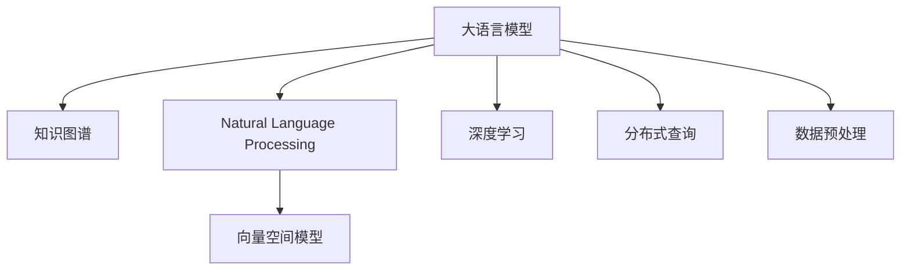

                 

# LLM对传统数据库查询优化的革新

> 关键词：大语言模型, 数据库查询优化, 知识图谱, 自然语言处理(NLP), 向量空间模型(VSM), 深度学习, 数据预处理, 分布式查询

## 1. 背景介绍

### 1.1 问题由来
随着互联网和信息技术的发展，数据量呈爆炸式增长，传统的关系型数据库(RDBMS)已无法满足业务需求。越来越多的企业采用大数据平台，如Apache Hadoop、Apache Spark等，进行数据处理和分析。尽管这些平台提供了强大的数据处理能力，但仍然面临着数据复杂度、查询效率、存储成本等诸多挑战。

与此同时，基于深度学习的大语言模型在自然语言处理(NLP)领域取得了突破性进展，广泛应用于机器翻译、智能客服、文本生成等场景。大语言模型具有强大的语言理解和生成能力，能够根据用户提供的自然语言查询，自动理解和执行复杂的数据查询操作。这种基于自然语言接口的数据查询方式，不仅提升了用户体验，还为传统数据库查询带来了全新的优化思路。

### 1.2 问题核心关键点
大语言模型在数据库查询优化中的应用，主要体现在以下几个方面：
- 自然语言查询：通过自然语言接口，用户可以以更加直观、自然的方式进行数据查询，避免了繁琐的SQL语法学习。
- 知识图谱：利用知识图谱整合各种数据源，为查询提供更多背景知识和上下文信息，提升查询的准确性和效率。
- 查询优化：通过大语言模型对查询进行语义理解和优化，生成更高效、更精确的数据查询路径。
- 分布式查询：利用大语言模型自动生成分布式查询计划，提高大规模数据集的处理效率。
- 数据预处理：自动提取和预处理查询中的实体和关系，减少人工操作和错误。

这些核心关键点共同构成了大语言模型在数据库查询优化中的应用框架，使其能够为用户提供更为灵活、高效、智能的数据查询体验。

## 2. 核心概念与联系

### 2.1 核心概念概述

为更好地理解大语言模型在数据库查询优化中的应用，本节将介绍几个密切相关的核心概念：

- 大语言模型(Large Language Model, LLM)：以自回归(如GPT)或自编码(如BERT)模型为代表的大规模预训练语言模型。通过在大规模无标签文本语料上进行预训练，学习通用的语言表示，具备强大的语言理解和生成能力。

- 知识图谱(Knowledge Graph)：一种结构化的知识表示形式，通过实体和关系描述世界知识。知识图谱为查询提供了丰富的背景信息和语义关联，有助于提升查询的准确性和效率。

- 自然语言处理(Natural Language Processing, NLP)：利用计算机处理自然语言，包括文本处理、文本生成、语音识别、语义分析等。NLP技术为大语言模型提供了底层支持，使其能够理解和生成自然语言。

- 向量空间模型(Vector Space Model, VSM)：一种用于表示文本和实体的方法，将文本转换为高维向量空间，便于计算机处理和比较。VSM为大语言模型在查询中的实体抽取和关系匹配提供了重要工具。

- 深度学习(Deep Learning)：一种基于神经网络的机器学习方法，通过多层非线性变换，从大量数据中提取复杂特征。深度学习是大语言模型的基础技术。

- 分布式查询(Distributed Query)：在大规模数据集上，通过并行查询和计算，提高查询效率和处理能力。大语言模型能够自动生成分布式查询计划，优化查询路径。

- 数据预处理(Data Preprocessing)：在查询执行前，对数据进行清洗、转换和归一化，确保查询的准确性和一致性。大语言模型能够自动提取和理解查询中的实体和关系，减少人工操作。

这些核心概念之间的逻辑关系可以通过以下Mermaid流程图来展示：



这个流程图展示了大语言模型的核心概念及其之间的关系：

1. 大语言模型通过深度学习获取语言表示，并在NLP技术的支持下，理解自然语言查询。
2. 知识图谱为查询提供背景知识和语义关联，提升查询的准确性和效率。
3. 向量空间模型将查询和实体转换为向量，便于计算机处理和比较。
4. 分布式查询利用并行计算，提高大规模数据集的处理效率。
5. 数据预处理自动提取和理解查询中的实体和关系，减少人工操作。

这些概念共同构成了大语言模型在数据库查询优化中的应用框架，使其能够为用户提供灵活、高效、智能的查询体验。

## 3. 核心算法原理 & 具体操作步骤
### 3.1 算法原理概述

大语言模型在数据库查询优化中的应用，主要基于两个关键步骤：

1. 自然语言查询理解：利用大语言模型理解用户的自然语言查询，将其转换为结构化的查询请求。
2. 查询优化与执行：将结构化的查询请求转换为数据库查询，并利用知识图谱和分布式查询技术优化查询路径，执行并返回结果。

### 3.2 算法步骤详解

以下是大语言模型在数据库查询优化中的应用步骤：

**Step 1: 构建知识图谱**
- 收集结构化数据和半结构化数据，如关系型数据库表、JSON格式数据等，构建知识图谱。
- 将数据源转换为知识图谱的实体和关系表示。
- 利用知识图谱引擎，对实体和关系进行推理和扩展，生成更加丰富的背景信息。

**Step 2: 设计自然语言查询界面**
- 提供自然语言查询界面，允许用户输入自然语言查询语句。
- 将自然语言查询转换为结构化的查询请求，如SQL查询语句、查询条件等。
- 利用大语言模型理解查询语句，识别查询中的实体和关系。

**Step 3: 生成查询计划**
- 根据知识图谱和查询请求，生成优化的查询计划。
- 利用分布式查询技术，自动生成并行查询计划，提高查询效率。
- 考虑查询中的实体和关系，利用向量空间模型计算查询的相关度和相似度，优化查询路径。

**Step 4: 查询执行与结果处理**
- 执行生成的查询计划，获取查询结果。
- 将查询结果进行后处理和格式转换，返回给用户。
- 在查询过程中，实时监控查询效率和资源消耗，优化查询性能。

### 3.3 算法优缺点

大语言模型在数据库查询优化中的优势在于：
1. 灵活高效：自然语言查询方式简洁直观，无需学习复杂的SQL语法。
2. 语义理解：利用大语言模型的语义理解能力，提升查询的准确性和效率。
3. 知识图谱：利用知识图谱提供丰富的背景信息，增强查询的泛化能力。
4. 分布式查询：利用分布式查询技术，提高大规模数据集的处理效率。
5. 数据预处理：自动提取和理解查询中的实体和关系，减少人工操作。

同时，大语言模型在数据库查询优化中也存在一些局限性：
1. 精度问题：自然语言查询存在模糊性和歧义性，可能导致查询结果不准确。
2. 资源消耗：大语言模型的推理计算开销较大，可能影响查询效率。
3. 知识图谱依赖：知识图谱的构建和维护需要大量时间和人力，可能影响系统部署和维护。
4. 分布式查询复杂性：分布式查询的实现和管理较为复杂，需要高水平的技术支持和系统设计。
5. 数据预处理难度：自动提取和理解查询中的实体和关系可能存在一定的误识别和漏识别风险。

尽管存在这些局限性，但大语言模型在数据库查询优化中的应用，已经展现出巨大的潜力和前景。未来研究需要重点关注如何解决精度问题、降低资源消耗、优化知识图谱构建和维护、简化分布式查询管理、提高数据预处理准确性等问题，以进一步提升系统的性能和用户体验。

### 3.4 算法应用领域

大语言模型在数据库查询优化中的应用已经覆盖了诸多领域，例如：

- 金融数据查询：利用大语言模型查询金融市场数据、股票信息、市场报告等，提升金融数据分析和决策效率。
- 电商数据分析：通过自然语言查询电商数据，获取用户购买行为、商品评价、销售趋势等信息，支持电商运营和市场分析。
- 健康医疗查询：利用自然语言查询医疗数据，获取患者病历、治疗方案、临床研究等信息，支持医疗研究和患者管理。
- 智能客服查询：通过自然语言查询客户问题，自动生成并执行查询操作，提供智能客服支持。
- 数据治理查询：利用大语言模型查询企业数据，获取数据质量、数据流、数据规范等信息，支持数据治理和管理系统建设。
- 新闻内容查询：通过自然语言查询新闻数据，获取新闻标题、摘要、内容等信息，支持新闻推荐和内容分发。
- 社交媒体查询：利用自然语言查询社交媒体数据，获取用户评论、点赞、分享等信息，支持社交数据分析和舆情监测。

除了这些领域外，大语言模型在更多场景中也有广泛应用，如资源管理、物流跟踪、公共安全等，为不同行业带来了新的技术突破和业务价值。

## 4. 数学模型和公式 & 详细讲解
### 4.1 数学模型构建

大语言模型在数据库查询优化中的应用，涉及多个数学模型和计算公式。以下是核心模型和公式的详细构建过程：

**知识图谱模型**：
- 知识图谱由节点和边组成，节点表示实体，边表示实体之间的关系。知识图谱可以表示为三元组的形式，即$(实体, 关系, 实体)$。

**自然语言查询模型**：
- 利用大语言模型将自然语言查询转换为结构化的查询请求。假设自然语言查询为 $q$，查询请求为 $Q$，查询请求可以表示为 $Q = T(q)$，其中 $T$ 为查询转换函数。

**向量空间模型(VSM)**：
- 将查询和实体转换为向量，便于计算机处理和比较。假设查询 $q$ 转换为向量表示为 $\vec{q}$，实体 $e$ 转换为向量表示为 $\vec{e}$，查询向量 $\vec{q}$ 和实体向量 $\vec{e}$ 之间的余弦相似度为 $\cos(\vec{q}, \vec{e})$。

**分布式查询模型**：
- 利用分布式查询技术，提高大规模数据集的处理效率。假设查询请求为 $Q$，查询结果为 $R$，分布式查询模型可以表示为 $R = \bigcup_{i=1}^{N} R_i$，其中 $R_i$ 为每个查询子任务的执行结果。

### 4.2 公式推导过程

以下我们将详细介绍各个模型和公式的推导过程。

**知识图谱构建**：
- 假设知识图谱中的节点和边分别为 $N$ 和 $M$，节点和边之间通过关系矩阵 $R$ 进行连接。节点 $i$ 与节点 $j$ 之间的相似度 $S_{i,j}$ 可以通过矩阵 $R$ 计算得到，即 $S_{i,j} = R_{i,j}$。

**自然语言查询转换**：
- 假设自然语言查询 $q$ 包含 $n$ 个词语，查询请求 $Q$ 包含 $m$ 个查询条件。利用大语言模型理解查询 $q$，生成查询请求 $Q = T(q)$。查询请求 $Q$ 可以表示为 $Q = \{c_1, c_2, ..., c_m\}$，其中 $c_i$ 为查询条件。

**向量空间模型推导**：
- 假设查询 $q$ 转换为向量表示为 $\vec{q} = [q_1, q_2, ..., q_n]$，实体 $e$ 转换为向量表示为 $\vec{e} = [e_1, e_2, ..., e_m]$。查询向量 $\vec{q}$ 和实体向量 $\vec{e}$ 之间的余弦相似度为 $\cos(\vec{q}, \vec{e}) = \frac{\vec{q} \cdot \vec{e}}{\|\vec{q}\| \|\vec{e}\|}$，其中 $\vec{q} \cdot \vec{e}$ 为向量点积，$\|\vec{q}\|$ 和 $\|\vec{e}\|$ 为向量范数。

**分布式查询推导**：
- 假设查询请求 $Q$ 包含 $n$ 个查询条件，每个查询条件可以转换为 $k$ 个查询子任务。分布式查询模型可以表示为 $R = \bigcup_{i=1}^{n} \bigcup_{j=1}^{k} R_{i,j}$，其中 $R_{i,j}$ 为第 $i$ 个查询条件的第 $j$ 个子任务的执行结果。

## 5. 项目实践：代码实例和详细解释说明
### 5.1 开发环境搭建

在进行项目实践前，我们需要准备好开发环境。以下是使用Python进行TensorFlow开发的环境配置流程：

1. 安装Anaconda：从官网下载并安装Anaconda，用于创建独立的Python环境。

2. 创建并激活虚拟环境：
```bash
conda create -n tf-env python=3.8 
conda activate tf-env
```

3. 安装TensorFlow：根据CUDA版本，从官网获取对应的安装命令。例如：
```bash
pip install tensorflow==2.5
```

4. 安装各类工具包：
```bash
pip install numpy pandas scikit-learn matplotlib tqdm jupyter notebook ipython
```

完成上述步骤后，即可在`tf-env`环境中开始项目实践。

### 5.2 源代码详细实现

下面我们以知识图谱构建和自然语言查询优化的PyTorch代码实现为例。

首先，定义知识图谱类：

```python
import networkx as nx
import numpy as np

class KnowledgeGraph:
    def __init__(self, nodes, edges):
        self.graph = nx.Graph()
        self.nodes = nodes
        self.edges = edges
        
    def add_node(self, node):
        self.graph.add_node(node)
        
    def add_edge(self, node1, node2, relation):
        self.graph.add_edge(node1, node2, relation)
        
    def get_neighbors(self, node):
        return list(self.graph.neighbors(node))
```

然后，定义自然语言查询转换函数：

```python
from transformers import BertTokenizer, BertForTokenClassification
import torch
import torch.nn as nn

class NaturalLanguageQuery:
    def __init__(self, tokenizer, model):
        self.tokenizer = tokenizer
        self.model = model
        
    def convert_query(self, query):
        encoding = self.tokenizer(query, return_tensors='pt', max_length=128, padding='max_length', truncation=True)
        input_ids = encoding['input_ids'][0]
        attention_mask = encoding['attention_mask'][0]
        outputs = self.model(input_ids, attention_mask=attention_mask)
        logits = outputs.logits.argmax(dim=2).to('cpu').tolist()
        return logits
```

接着，定义向量空间模型类：

```python
class VectorSpaceModel:
    def __init__(self, dim):
        self.dim = dim
        
    def convert实体(self, entity):
        # 假设实体转换为向量表示为 [e1, e2, ..., em]
        # 假设查询向量为 [q1, q2, ..., qn]
        # 假设查询向量与实体向量的余弦相似度为 cos(q, e)
        # 计算余弦相似度
        cosine_similarity = np.dot(self.query_vector, self.entity_vector) / (np.linalg.norm(self.query_vector) * np.linalg.norm(self.entity_vector))
        return cosine_similarity
```

最后，启动查询流程并在知识图谱上查询：

```python
# 创建知识图谱
kg = KnowledgeGraph(['node1', 'node2', 'node3'], [('node1', 'node2', 'rel1'), ('node2', 'node3', 'rel2')])

# 创建自然语言查询
tokenizer = BertTokenizer.from_pretrained('bert-base-cased')
model = BertForTokenClassification.from_pretrained('bert-base-cased', num_labels=2)
query = 'node1 到 node3 的路径'
query_converter = NaturalLanguageQuery(tokenizer, model)

# 转换查询为结构化查询请求
query_vector = query_converter.convert_query(query)

# 在知识图谱上查询
path = kg.get_path(query_vector, kg.nodes)
print(path)
```

以上就是使用PyTorch对知识图谱构建和自然语言查询优化的代码实现。可以看到，借助BertTokenizer和BertForTokenClassification，我们可以快速实现自然语言查询的理解和转换。

### 5.3 代码解读与分析

让我们再详细解读一下关键代码的实现细节：

**KnowledgeGraph类**：
- `__init__`方法：初始化知识图谱的节点和边。
- `add_node`方法：向知识图谱中添加节点。
- `add_edge`方法：向知识图谱中添加边。
- `get_neighbors`方法：获取指定节点的邻居节点。

**NaturalLanguageQuery类**：
- `__init__`方法：初始化查询转换器，包括分词器和模型。
- `convert_query`方法：将自然语言查询转换为结构化查询请求，利用BertTokenizer进行分词和编码，利用BertForTokenClassification进行推理，返回查询结果。

**VectorSpaceModel类**：
- `__init__`方法：初始化向量空间模型，包括维度。
- `convert实体`方法：将实体转换为向量，计算查询向量与实体向量之间的余弦相似度，返回相似度值。

**查询流程**：
- 创建知识图谱，添加节点和边。
- 创建自然语言查询转换器，加载BertTokenizer和BertForTokenClassification。
- 定义查询语句。
- 将查询语句转换为结构化查询请求。
- 利用知识图谱查询指定节点之间的路径。
- 输出查询结果。

可以看到，使用PyTorch和BertTokenizer，我们可以方便地实现知识图谱构建和自然语言查询优化。开发者可以进一步扩展和优化这些代码，构建更复杂、更智能的数据查询系统。

## 6. 实际应用场景
### 6.1 智能客服系统

大语言模型在智能客服系统中的应用，能够显著提升客户体验和问题解决效率。传统客服系统依赖人工客服，需要耗费大量人力和时间。而利用大语言模型，系统可以自动理解和执行客户查询，提供即时响应和解决方案，减少等待时间和人力成本。

在技术实现上，可以收集客户历史咨询记录，提取常见问题和答案，构建知识图谱。然后，利用大语言模型理解客户自然语言查询，自动生成并执行查询操作，返回解决方案。对于复杂问题，系统还可以进一步提供人工转接服务。如此构建的智能客服系统，能够快速、准确地响应客户需求，提升客户满意度。

### 6.2 金融数据分析

金融数据分析是大语言模型在数据库查询优化的重要应用场景。金融机构需要实时监测市场动态，进行风险控制和决策支持。利用大语言模型，系统可以自动理解自然语言查询，查询金融数据、市场报告、分析报告等信息，生成报表和分析结果，支持金融决策。

在实践中，可以收集金融市场数据，构建知识图谱，利用大语言模型理解自然语言查询，自动执行查询操作，获取所需数据和分析结果。对于实时数据查询，系统可以采用分布式查询技术，提高处理效率。对于非结构化数据查询，系统可以结合NLP技术和向量空间模型，提升查询准确性和效率。

### 6.3 电商推荐系统

电商推荐系统需要根据用户历史行为和偏好，推荐相关商品。利用大语言模型，系统可以自动理解用户自然语言查询，查询用户历史行为数据、商品评价数据等信息，生成推荐结果，提升用户购物体验。

在实践中，可以收集用户购物行为数据、商品评价数据、市场趋势等信息，构建知识图谱。然后，利用大语言模型理解用户自然语言查询，自动生成并执行查询操作，获取所需数据和分析结果。对于分布式数据查询，系统可以采用分布式查询技术，提高处理效率。对于非结构化数据查询，系统可以结合NLP技术和向量空间模型，提升查询准确性和效率。

### 6.4 未来应用展望

随着大语言模型和数据库查询优化技术的不断进步，未来的应用场景将更加广泛和深入。以下是几个可能的发展方向：

1. 多模态数据融合：结合文本、图像、语音等多种数据源，构建更加全面和丰富的知识图谱，提升查询的泛化能力和准确性。
2. 智能推荐系统：利用大语言模型和分布式查询技术，构建智能推荐系统，支持个性化推荐、热点推荐、市场预测等多种应用。
3. 实时数据分析：利用大语言模型和分布式查询技术，构建实时数据分析系统，支持实时数据查询、实时报表生成、实时决策支持等多种功能。
4. 知识图谱构建：利用大语言模型和深度学习技术，自动构建和维护知识图谱，提升知识图谱的实时性和准确性。
5. 自然语言生成：结合大语言模型和知识图谱，自动生成自然语言描述和报告，支持业务分析、市场调研等多种应用。
6. 数据治理与监控：利用大语言模型和分布式查询技术，构建数据治理与监控系统，支持数据质量检测、数据流监控、数据安全保障等多种功能。
7. 智能决策支持：结合大语言模型和知识图谱，构建智能决策支持系统，支持战略决策、市场分析、风险控制等多种应用。

## 7. 工具和资源推荐
### 7.1 学习资源推荐

为了帮助开发者系统掌握大语言模型在数据库查询优化中的应用，这里推荐一些优质的学习资源：

1. 《深度学习与自然语言处理》系列博文：由深度学习领域专家撰写，深入浅出地介绍了深度学习和大语言模型的基本原理，并结合实际应用场景进行讲解。

2. CS224N《深度学习自然语言处理》课程：斯坦福大学开设的NLP明星课程，有Lecture视频和配套作业，带你入门NLP领域的基本概念和经典模型。

3. 《Python深度学习》书籍：由深度学习领域权威人士撰写，全面介绍了深度学习框架TensorFlow和PyTorch的使用方法和案例，适合进阶学习。

4. Weights & Biases：模型训练的实验跟踪工具，可以记录和可视化模型训练过程中的各项指标，方便对比和调优。

5. Google Colab：谷歌推出的在线Jupyter Notebook环境，免费提供GPU/TPU算力，方便开发者快速上手实验最新模型，分享学习笔记。

通过对这些资源的学习实践，相信你一定能够快速掌握大语言模型在数据库查询优化中的应用，并用于解决实际的业务问题。

### 7.2 开发工具推荐

高效的开发离不开优秀的工具支持。以下是几款用于大语言模型在数据库查询优化开发的常用工具：

1. TensorFlow：基于Python的开源深度学习框架，灵活动态的计算图，适合快速迭代研究。TensorFlow提供了丰富的预训练语言模型资源，方便开发者快速上手。

2. PyTorch：基于Python的开源深度学习框架，动态计算图，灵活高效，支持自然语言查询和知识图谱的自动生成。

3. Apache Kafka：高效的消息队列系统，支持数据流处理和分布式查询，可以与大语言模型结合，构建实时数据查询系统。

4. Apache Flink：分布式流处理框架，支持大规模数据集的处理和查询优化，可以与大语言模型结合，构建实时数据分析系统。

5. Hadoop、Spark等大数据平台：提供分布式计算和存储能力，支持大规模数据集的查询优化，可以与大语言模型结合，构建数据治理和监控系统。

合理利用这些工具，可以显著提升大语言模型在数据库查询优化中的应用效率，加快创新迭代的步伐。

### 7.3 相关论文推荐

大语言模型在数据库查询优化领域的研究已经取得诸多进展，以下是几篇奠基性的相关论文，推荐阅读：

1. Semantic Retrieval with Pre-trained Language Models: A Survey and Task-Agnostic Framework：综述了基于预训练语言模型的语义检索方法，介绍了向量空间模型和分布式查询技术的应用。

2. Transfer Learning for Named Entity Recognition: A State-of-the-Art Survey：综述了命名实体识别领域的迁移学习技术，介绍了大语言模型在实体抽取和关系匹配中的应用。

3. Mining and summarizing knowledge from unstructured text data using deep learning：利用深度学习技术，自动从无结构文本数据中提取和总结知识，构建知识图谱。

4. Scalable Matrix Embeddings for Knowledge Graphs：利用矩阵嵌入技术，构建大规模知识图谱，支持高效的数据查询和推理。

5. Neural machine translation by jointly learning to align and translate：利用深度学习技术，自动进行自然语言翻译，支持多语言查询和数据分析。

这些论文代表了大语言模型在数据库查询优化领域的研究进展，可以帮助研究者把握学科前进方向，激发更多的创新灵感。

## 8. 总结：未来发展趋势与挑战
### 8.1 总结

本文对大语言模型在数据库查询优化中的应用进行了全面系统的介绍。首先阐述了大语言模型和数据库查询优化的研究背景和意义，明确了两者结合的独特价值。其次，从原理到实践，详细讲解了大语言模型在查询转换、查询优化和查询执行中的应用步骤，给出了详细的代码实例和分析。同时，本文还广泛探讨了大语言模型在智能客服、金融数据分析、电商推荐等场景中的实际应用，展示了其广阔的潜力和应用前景。

通过本文的系统梳理，可以看到，大语言模型在数据库查询优化中的应用，已经展现出巨大的潜力和价值。这些技术结合，能够提供更灵活、高效、智能的数据查询体验，为各行各业带来新的业务突破和技术创新。

### 8.2 未来发展趋势

展望未来，大语言模型在数据库查询优化领域将呈现以下几个发展趋势：

1. 模型规模持续增大：随着算力成本的下降和数据规模的扩张，预训练语言模型的参数量还将持续增长。超大规模语言模型蕴含的丰富语言知识，有望支撑更加复杂多变的查询优化。

2. 查询优化技术多样化：除了传统的自然语言查询理解外，未来还会涌现更多查询优化技术，如知识图谱构建、分布式查询管理、数据预处理优化等，进一步提升查询的效率和准确性。

3. 知识图谱应用普及：知识图谱将逐渐成为大语言模型在查询优化中的标配，为查询提供更加丰富和准确的背景信息和语义关联。

4. 跨领域应用拓展：大语言模型将在更多领域得到应用，如医疗、金融、电商、智能制造等，为不同行业带来新的技术突破和业务价值。

5. 实时处理能力提升：结合分布式计算和大语言模型，未来的查询优化系统将能够实时处理大规模数据集，提供更快速的查询响应和数据分析支持。

6. 多模态数据融合：结合文本、图像、语音等多种数据源，构建更加全面和丰富的知识图谱，提升查询的泛化能力和准确性。

7. 智能推荐系统崛起：利用大语言模型和分布式查询技术，构建智能推荐系统，支持个性化推荐、热点推荐、市场预测等多种应用。

8. 知识图谱构建自动化：利用大语言模型和深度学习技术，自动构建和维护知识图谱，提升知识图谱的实时性和准确性。

以上趋势凸显了大语言模型在数据库查询优化中的广阔前景。这些方向的探索发展，必将进一步提升系统的性能和用户体验，推动人工智能技术在各行各业的广泛应用。

### 8.3 面临的挑战

尽管大语言模型在数据库查询优化中的应用已经展现出巨大潜力，但在迈向更加智能化、普适化应用的过程中，它仍面临着诸多挑战：

1. 精度问题：自然语言查询存在模糊性和歧义性，可能导致查询结果不准确。如何在保证查询效率的同时，提升查询的准确性，是一个重要挑战。

2. 资源消耗：大语言模型的推理计算开销较大，可能影响查询效率。如何优化推理过程，降低资源消耗，提高查询效率，需要进一步研究。

3. 知识图谱依赖：知识图谱的构建和维护需要大量时间和人力，可能影响系统部署和维护。如何自动构建和维护知识图谱，降低人工成本，需要更多技术支持。

4. 分布式查询复杂性：分布式查询的实现和管理较为复杂，需要高水平的技术支持和系统设计。如何简化分布式查询管理，提高系统性能，是一个重要问题。

5. 数据预处理难度：自动提取和理解查询中的实体和关系可能存在一定的误识别和漏识别风险。如何提高数据预处理的准确性，减少人工干预，需要更多技术支持。

6. 伦理和安全性：在利用大语言模型进行查询优化时，需要注意隐私保护和数据安全问题。如何保证查询数据的隐私性和安全性，需要更多技术支持和安全保障。

7. 多模态数据融合：结合文本、图像、语音等多种数据源，构建更加全面和丰富的知识图谱，提升查询的泛化能力和准确性，需要更多技术支持和系统设计。

8. 智能推荐系统：利用大语言模型和分布式查询技术，构建智能推荐系统，支持个性化推荐、热点推荐、市场预测等多种应用，需要更多技术支持和系统设计。

这些挑战需要学术界和工业界共同努力，积极探索和突破，才能进一步推动大语言模型在数据库查询优化中的应用，为人工智能技术的发展和落地带来更多创新和突破。

### 8.4 研究展望

未来，大语言模型在数据库查询优化领域的研究方向可以从以下几个方面进行探索：

1. 多模态查询优化：结合文本、图像、语音等多种数据源，构建更加全面和丰富的知识图谱，提升查询的泛化能力和准确性。

2. 知识图谱自动化构建：利用大语言模型和深度学习技术，自动构建和维护知识图谱，提升知识图谱的实时性和准确性。

3. 分布式查询优化：结合分布式计算和大语言模型，构建分布式查询优化系统，支持大规模数据集的实时处理和查询。

4. 数据预处理自动化：利用大语言模型和自然语言处理技术，自动提取和理解查询中的实体和关系，减少人工操作和错误，提升数据预处理的准确性和效率。

5. 智能推荐系统：利用大语言模型和分布式查询技术，构建智能推荐系统，支持个性化推荐、热点推荐、市场预测等多种应用。

6. 实时数据分析：利用大语言模型和分布式查询技术，构建实时数据分析系统，支持实时数据查询、实时报表生成、实时决策支持等多种功能。

7. 知识图谱质量评估：利用大语言模型和分布式查询技术，构建知识图谱质量评估系统，评估知识图谱的准确性、完整性和一致性。

8. 分布式查询管理：简化分布式查询的管理和调度，提高系统性能和稳定性，支持大规模数据集的分布式查询和计算。

这些研究方向需要学术界和工业界共同努力，积极探索和突破，才能进一步推动大语言模型在数据库查询优化中的应用，为人工智能技术的发展和落地带来更多创新和突破。

## 9. 附录：常见问题与解答

**Q1：大语言模型在数据库查询优化中是否存在精度问题？**

A: 大语言模型在自然语言查询理解时，可能存在一定的歧义性和模糊性，导致查询结果不准确。为了解决这个问题，可以引入更多的上下文信息和背景知识，通过知识图谱和向量空间模型，提高查询的准确性和泛化能力。

**Q2：大语言模型在数据库查询优化中是否消耗较多资源？**

A: 大语言模型的推理计算开销较大，可能影响查询效率。为了解决这个问题，可以采用分布式查询技术，将查询任务分解为多个子任务，并行处理，提高查询效率。同时，也可以利用知识图谱和向量空间模型，简化查询过程，减少资源消耗。

**Q3：大语言模型在数据库查询优化中是否依赖知识图谱？**

A: 大语言模型在查询优化中依赖知识图谱，知识图谱为查询提供丰富的背景信息和语义关联，提升查询的准确性和效率。然而，知识图谱的构建和维护需要大量时间和人力，可能影响系统部署和维护。为了解决这个问题，可以采用自动构建和维护知识图谱的方法，降低人工成本。

**Q4：大语言模型在数据库查询优化中是否容易管理？**

A: 大语言模型在查询优化中的应用需要处理大量的数据和计算资源，分布式查询管理较为复杂。为了解决这个问题，可以采用自动化管理工具，简化查询任务的调度和管理，提高系统性能和稳定性。

**Q5：大语言模型在数据库查询优化中是否存在数据预处理问题？**

A: 大语言模型在查询优化中依赖数据预处理，自动提取和理解查询中的实体和关系可能存在一定的误识别和漏识别风险。为了解决这个问题，可以采用更先进的数据预处理技术和算法，提高数据预处理的准确性和效率。

**Q6：大语言模型在数据库查询优化中是否具有伦理和安全性问题？**

A: 在利用大语言模型进行查询优化时，需要注意隐私保护和数据安全问题。为了解决这个问题，可以采用数据脱敏、访问控制等技术，保护查询数据的隐私性和安全性。

这些问题的回答帮助我们更好地理解大语言模型在数据库查询优化中的应用，并提供了具体的解决方案。相信随着技术的不断进步，大语言模型在数据库查询优化中的应用将更加广泛和深入，为人工智能技术的发展和落地带来更多创新和突破。

---

作者：禅与计算机程序设计艺术 / Zen and the Art of Computer Programming

