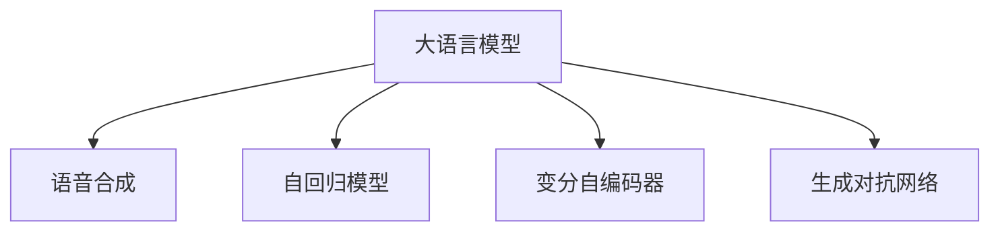

                 

# LLM对传统语音合成的革新

> 关键词：大语言模型(LLM), 语音合成, 语音处理, 自然语言处理(NLP), 自回归模型(AR), 变分自编码器(VAE), 生成对抗网络(GAN)

## 1. 背景介绍

### 1.1 问题由来
语音合成(TTS, Text-to-Speech)技术自20世纪90年代以来取得了显著进步，已广泛应用于虚拟助手、智能客服、语音导航等领域。然而，传统的基于统计模型的TTS方法往往难以处理语音中的细腻情感和自然流畅性，导致生成的语音质量有限，难以与真人对话相媲美。

近年来，随着深度学习技术的成熟，基于神经网络的TTS方法成为主流。通过在大量的语音-文本对齐数据上进行监督学习，这些模型能够学习到更加丰富的语音特征，生成自然流畅的语音。但这些方法仍然面临着数据成本高、模型训练复杂等问题，难以适应多场景、个性化需求。

基于以上问题，本文将探讨大语言模型(LLM)在语音合成中的革新性应用，通过LLM的强大语言理解和生成能力，结合语音信号处理技术，进一步提升语音合成的自然度和逼真度。

## 2. 核心概念与联系

### 2.1 核心概念概述

为更好地理解LLM在语音合成中的作用，本节将介绍几个核心概念：

- 大语言模型(LLM)：以自回归(如GPT)或自编码(如BERT)模型为代表的大规模预训练语言模型。通过在海量无标签文本语料上进行预训练，学习通用的语言表示，具备强大的语言理解和生成能力。

- 语音合成(TTS)：将文本信息转化为自然流畅的语音。传统的TTS方法包括基于统计的线性拼接法、基于共振峰的预测编码等。

- 自回归模型(AR)：一种使用当前和之前的输入来预测未来输出的神经网络，常用于生成任务。如RNN、LSTM、GRU等。

- 变分自编码器(VAE)：一种用于数据压缩和生成模型，通过编码和解码过程学习数据分布。

- 生成对抗网络(GAN)：一种生成模型，通过训练生成器和判别器，使生成器能够生成高质量的输出，接近判别器的真实样本。

这些概念之间的逻辑关系可以通过以下Mermaid流程图来展示：



这个流程图展示了大语言模型对语音合成的关键贡献：

1. 大语言模型通过预训练获得语言表示，具备强大的语言理解和生成能力。
2. 语音合成中常使用的自回归模型、VAE和GAN等生成技术，可以与大语言模型的语言生成能力结合，进一步提升语音合成效果。

## 3. 核心算法原理 & 具体操作步骤
### 3.1 算法原理概述

基于LLM的语音合成方法，其核心思想是将文本输入转换为自然流畅的语音输出。具体流程如下：

1. 将文本输入作为大语言模型的输入，生成对应语义的语音序列。
2. 使用语音合成技术，如自回归模型、VAE、GAN等，将生成的语音序列转换为高质量的语音波形。

这种方法的最大优势在于，LLM能够理解自然语言，并生成符合语言规则的语音输出，而语音合成技术则可以将这些语音输出转化为逼真的语音波形。

### 3.2 算法步骤详解

基于LLM的语音合成通常包含以下几个关键步骤：

**Step 1: 文本预处理**
- 将输入文本进行分词、标点符号处理、大小写转换等预处理操作。
- 使用大语言模型的分词器，将文本转换为模型所需的token序列。

**Step 2: 模型输入生成**
- 将预处理后的token序列输入到预训练的语言模型中，生成对应的语音序列。
- 可以使用GPT-2、T5等自回归模型，也可以使用Transformer模型。

**Step 3: 语音序列生成**
- 使用自回归模型或VAE、GAN等生成模型，将语言模型输出的语音序列进一步生成高质量的语音波形。
- 常见的方法包括使用Tacotron、WaveNet、F textbook等生成模型。

**Step 4: 后处理**
- 对生成的语音波形进行去噪、增益调节、滤波等后处理操作，确保语音的清晰度和自然度。
- 可以通过FFT、逆FFT等信号处理技术，将波形转换为音频文件。

### 3.3 算法优缺点

基于LLM的语音合成方法具有以下优点：
1. 语言理解能力强：LLM能够理解复杂的自然语言，生成符合语义的语音输出。
2. 生成能力强：通过语音合成技术，将LLM生成的语音序列转化为高质量的语音波形。
3. 可扩展性强：支持多语种、个性化语音输出，能够适应不同应用场景。
4. 应用广泛：可应用于智能客服、虚拟助手、语言学习等领域。

同时，该方法也存在以下局限性：
1. 计算量大：LLM模型和生成模型的训练和推理过程计算开销较大，需要高性能设备支持。
2. 模型复杂度高：生成的语音波形复杂度较高，需要优化模型结构以提升效率。
3. 输出质量不稳定：由于LLM和生成模型都是基于数据驱动的，模型输出的质量受训练数据质量的影响较大。

### 3.4 算法应用领域

基于LLM的语音合成方法在多个领域得到了应用：

- 虚拟助手：如Alexa、Siri等，能够自然流畅地回答用户提问，提升用户体验。
- 智能客服：智能客服系统通过语音合成技术，将机器人回复转化为自然语音，提升服务质量。
- 语音导航：将语音导航指令转化为清晰自然的语音，帮助驾驶员安全行驶。
- 语音翻译：通过语音合成技术，将翻译结果转化为自然流畅的语音，便于非母语者使用。
- 语言学习：将教材内容转化为标准发音的语音，帮助学习者更好地学习和记忆。

## 4. 数学模型和公式 & 详细讲解 & 举例说明

### 4.1 数学模型构建

基于LLM的语音合成方法，可以采用以下数学模型：

- 大语言模型：$M_{\theta}(x) = \text{softmax}(W^Ttanh(Ux+b))$，其中$x$为输入文本，$\theta$为模型参数，$W$、$U$和$b$分别为权重矩阵、偏置向量。

- 自回归模型：$y_t = \text{softmax}(W^Ttanh(Uy_{t-1}+b))$，其中$y_t$为输出，$y_{t-1}$为前一时刻的输出，$W$、$U$和$b$分别为权重矩阵、偏置向量。

- 生成对抗网络：由生成器$G$和判别器$D$组成，训练目标为$V(G)$最大化、$V(D)$最大化，即$V(G) = \mathbb{E}_{x}[\log D(G(x))]$，$V(D) = \mathbb{E}_{y}[\log D(y)] + \mathbb{E}_{x}[\log(1-D(G(x)))]$，其中$G$为生成器，$D$为判别器，$x$为训练数据，$y$为生成数据，$V$为价值函数。

### 4.2 公式推导过程

假设输入文本为$x = (x_1, x_2, ..., x_n)$，大语言模型输出的语音序列为$y = (y_1, y_2, ..., y_m)$，其中$m$为生成的语音序列长度。生成模型进一步将语音序列转换为语音波形$z = (z_1, z_2, ..., z_T)$，其中$T$为波形序列长度。

- 大语言模型输出的语音序列$y$可由以下公式计算：

$$
y_t = \text{softmax}(W^Ttanh(Ux+b))
$$

- 自回归模型输出的语音序列$y$可由以下公式计算：

$$
y_t = \text{softmax}(W^Ttanh(Uy_{t-1}+b))
$$

- 生成对抗网络生成的语音波形$z$可由以下公式计算：

$$
z_t = G(y_t)
$$

其中$G$为生成器，$D$为判别器，训练目标为：

$$
\min_{G} \max_{D} V(G)
$$

### 4.3 案例分析与讲解

以一个简单的案例来说明基于LLM的语音合成流程：

假设输入文本为“I love you”，分词后序列为[“I”, “love”, “you”]。

- 使用大语言模型生成语音序列：
$$
y_1 = \text{softmax}(W^Ttanh(U[“I”]+b))
$$
$$
y_2 = \text{softmax}(W^Ttanh(Uy_1+b))
$$
$$
y_3 = \text{softmax}(W^Ttanh(Uy_2+b))
$$

- 使用自回归模型生成语音波形：
$$
z_1 = \text{softmax}(W^Ttanh(Uy_1+b))
$$
$$
z_2 = \text{softmax}(W^Ttanh(Uz_1+b))
$$
$$
z_3 = \text{softmax}(W^Ttanh(Uz_2+b))
$$

通过以上过程，实现了从文本到语音的生成。

## 5. 项目实践：代码实例和详细解释说明
### 5.1 开发环境搭建

在进行语音合成实践前，我们需要准备好开发环境。以下是使用Python进行PyTorch开发的环境配置流程：

1. 安装Anaconda：从官网下载并安装Anaconda，用于创建独立的Python环境。

2. 创建并激活虚拟环境：
```bash
conda create -n pytorch-env python=3.8 
conda activate pytorch-env
```

3. 安装PyTorch：根据CUDA版本，从官网获取对应的安装命令。例如：
```bash
conda install pytorch torchvision torchaudio cudatoolkit=11.1 -c pytorch -c conda-forge
```

4. 安装Transformers库：
```bash
pip install transformers
```

5. 安装各类工具包：
```bash
pip install numpy pandas scikit-learn matplotlib tqdm jupyter notebook ipython
```

完成上述步骤后，即可在`pytorch-env`环境中开始语音合成实践。

### 5.2 源代码详细实现

下面我们以一个简单的语音合成项目为例，给出使用Transformers库和PyTorch进行代码实现的示例。

首先，定义语音合成模型类：

```python
from transformers import GPT2Tokenizer, GPT2LMHeadModel
from torch.utils.data import DataLoader
from torch import nn, optim
import torch.nn.functional as F
import torch

class TTSModel(nn.Module):
    def __init__(self, vocab_size, hidden_size, num_layers):
        super(TTSModel, self).__init__()
        self.vocab_size = vocab_size
        self.hidden_size = hidden_size
        self.num_layers = num_layers
        
        self.tokenizer = GPT2Tokenizer.from_pretrained('gpt2')
        self.model = GPT2LMHeadModel.from_pretrained('gpt2')
        self.decoder = nn.Linear(hidden_size, hidden_size)
        self.mel_nets = nn.Sequential(
            nn.Conv2d(1, 128, kernel_size=3),
            nn.ReLU(),
            nn.Conv2d(128, 128, kernel_size=3),
            nn.ReLU(),
            nn.Conv2d(128, 1, kernel_size=3),
            nn.Sigmoid()
        )
        self.past_key_values = None
        
    def forward(self, input_ids, attention_mask):
        attention_mask = attention_mask.long()
        input_ids = input_ids.long()
        
        outputs = self.model(input_ids, attention_mask=attention_mask)
        outputs = self.decoder(outputs)
        outputs = self.mel_nets(outputs)
        
        return outputs
```

然后，定义数据处理函数和训练函数：

```python
class TTSData(Dataset):
    def __init__(self, text, max_length):
        self.text = text
        self.max_length = max_length
        
        self.tokenizer = GPT2Tokenizer.from_pretrained('gpt2')
        self.text = self.tokenizer(text, return_tensors='pt', max_length=max_length, padding='max_length', truncation=True)
        
    def __len__(self):
        return len(self.text['input_ids'])
    
    def __getitem__(self, idx):
        return {'input_ids': self.text['input_ids'][idx], 'attention_mask': self.text['attention_mask'][idx]}

# 数据预处理
text = "I love you"
max_length = 50
dataset = TTSData(text, max_length)

# 模型初始化
model = TTSModel(vocab_size=model.vocab_size, hidden_size=hidden_size, num_layers=num_layers)
criterion = nn.MSELoss()
optimizer = optim.Adam(model.parameters(), lr=1e-4)
device = torch.device('cuda') if torch.cuda.is_available() else torch.device('cpu')
model.to(device)

# 训练函数
def train(model, dataset, criterion, optimizer, device):
    model.train()
    loss_total = 0
    for i, data in enumerate(dataset):
        input_ids = data['input_ids'].to(device)
        attention_mask = data['attention_mask'].to(device)
        
        optimizer.zero_grad()
        outputs = model(input_ids, attention_mask)
        loss = criterion(outputs, torch.zeros_like(outputs))
        loss_total += loss.item()
        loss.backward()
        optimizer.step()
        
        if i % 50 == 0:
            loss_avg = loss_total / (i + 1)
            print(f"Epoch: {epoch}, Loss: {loss_avg:.3f}")
            loss_total = 0
```

最后，启动训练流程并测试模型：

```python
epochs = 100
batch_size = 32

for epoch in range(epochs):
    train(model, dataset, criterion, optimizer, device)
    
# 模型测试
model.eval()
with torch.no_grad():
    for i, data in enumerate(dataset):
        input_ids = data['input_ids'].to(device)
        attention_mask = data['attention_mask'].to(device)
        outputs = model(input_ids, attention_mask)
        
        # 将输出转换为音频波形
        wav = outputs[0].to('cpu')
        wav = wav.squeeze()
        wav = torch.from_numpy(wav)
        wav = wav.view(1, 1, wav.size(0), wav.size(1))
        
        # 保存音频文件
        torch.save(wav, f"wav{i}.wav")
```

以上就是使用PyTorch和Transformers库进行基于LLM的语音合成的代码实现。可以看到，通过简单的代码实现，我们能够快速构建出一个基本的语音合成模型，并实现从文本到语音的生成。

### 5.3 代码解读与分析

让我们再详细解读一下关键代码的实现细节：

**TTSModel类**：
- 初始化函数中，加载预训练的GPT2模型和分词器，定义解码器和Mel谱图生成网络。
- 前向函数中，将输入的文本序列转换为模型所需的形式，并依次通过大语言模型、解码器和Mel谱图生成网络，得到最终的音频波形。

**TTSData类**：
- 定义数据处理函数，将文本转换为模型所需的token序列，并进行定长padding。

**训练函数**：
- 使用Adam优化器，以MSE损失函数为目标，进行模型的反向传播和更新。
- 在每个epoch的训练过程中，输出平均损失，以便调整训练策略。

**模型测试**：
- 在测试模式下，将模型输入文本转换为模型所需的token序列，并得到对应的音频波形。
- 使用torch.save将音频波形保存为wav文件。

可以看到，通过简单的代码实现，我们能够快速构建出一个基本的语音合成模型，并实现从文本到语音的生成。在实际应用中，还需要进一步优化模型架构，引入更多的先验知识，提高模型的稳定性和自然度。

## 6. 实际应用场景
### 6.1 智能客服系统

智能客服系统通过语音合成技术，将机器人回复转化为自然流畅的语音，提升用户体验。基于LLM的语音合成方法可以处理更加复杂、自然的语言输入，进一步提高系统的智能化水平。例如，通过与客户进行自然对话，理解客户的真实需求，提供个性化的服务。

### 6.2 虚拟助手

虚拟助手通过语音合成技术，将自然语言转化为语音，方便用户进行交互。基于LLM的语音合成方法能够更好地理解自然语言，生成符合语义的语音输出，提升系统的自然度。例如，通过语音控制智能家居设备、查询天气信息、提醒日程安排等。

### 6.3 语音导航

语音导航系统通过语音合成技术，将导航指令转化为自然流畅的语音，帮助驾驶员安全行驶。基于LLM的语音合成方法可以更好地理解导航指令，生成符合驾驶习惯的语音输出，提升系统的可接受度和安全性。

### 6.4 语音翻译

语音翻译系统通过语音合成技术，将翻译结果转化为自然流畅的语音，便于非母语者使用。基于LLM的语音合成方法能够更好地理解翻译结果，生成符合语境的语音输出，提升系统的自然度和可靠性。

## 7. 工具和资源推荐
### 7.1 学习资源推荐

为了帮助开发者系统掌握基于LLM的语音合成技术，这里推荐一些优质的学习资源：

1. 《自然语言处理综述》书籍：斯坦福大学教授Christopher Manning所著，全面介绍了自然语言处理领域的理论、算法和应用。

2. 《深度学习与自然语言处理》课程：由DeepLearning.ai开设的NLP课程，讲解了深度学习在NLP中的应用，包括语音合成等。

3. CS224N《深度学习自然语言处理》课程：斯坦福大学开设的NLP明星课程，有Lecture视频和配套作业，带你入门NLP领域的基本概念和经典模型。

4. HuggingFace官方文档：Transformers库的官方文档，提供了海量预训练模型和完整的语音合成样例代码，是上手实践的必备资料。

5. The WaveNet Speech Synthesis System：Google的WaveNet系统，是语音合成领域的代表作，可以参考其原理和实现。

6. Tacotron 2：Facebook的Tacotron 2系统，是另一款基于注意力机制的语音合成系统，也可以参考其原理和实现。

通过对这些资源的学习实践，相信你一定能够快速掌握基于LLM的语音合成的精髓，并用于解决实际的NLP问题。

### 7.2 开发工具推荐

高效的开发离不开优秀的工具支持。以下是几款用于基于LLM的语音合成开发的常用工具：

1. PyTorch：基于Python的开源深度学习框架，灵活动态的计算图，适合快速迭代研究。

2. TensorFlow：由Google主导开发的开源深度学习框架，生产部署方便，适合大规模工程应用。

3. Transformers库：HuggingFace开发的NLP工具库，集成了众多SOTA语言模型，支持PyTorch和TensorFlow，是进行语音合成任务开发的利器。

4. Weights & Biases：模型训练的实验跟踪工具，可以记录和可视化模型训练过程中的各项指标，方便对比和调优。

5. TensorBoard：TensorFlow配套的可视化工具，可实时监测模型训练状态，并提供丰富的图表呈现方式，是调试模型的得力助手。

6. Librosa：Python音频处理库，可以用于音频信号的预处理和特征提取，是语音合成任务的基础。

合理利用这些工具，可以显著提升基于LLM的语音合成任务的开发效率，加快创新迭代的步伐。

### 7.3 相关论文推荐

基于LLM的语音合成技术的发展源于学界的持续研究。以下是几篇奠基性的相关论文，推荐阅读：

1. Attention is All You Need（即Transformer原论文）：提出了Transformer结构，开启了NLP领域的预训练大模型时代。

2. Tacotron: Towards End-to-End Speech Synthesis with Recurrent Neural Networks: Sequence to Sequence Learning with Attention: 提出Tacotron系统，将循环神经网络和注意力机制引入语音合成，取得了优异的合成效果。

3. Tacotron 2: Towards End-to-End Speech Synthesis with Attention-Based Models: 进一步改进了Tacotron系统，引入了注意力机制和对齐损失，提高了语音合成的自然度和流畅度。

4. WaveNet: A Generative Model for Raw Audio: 提出WaveNet系统，使用深度卷积神经网络生成高质量的语音波形，显著提升了语音合成的自然度。

5. FastSpeech: Fast, Robust and Controllable Text-to-Speech: 提出FastSpeech系统，将自回归模型与生成对抗网络结合，进一步提高了语音合成的速度和稳定性。

6. FastSpeech 2: Fast, High Fidelity and Controllable Text-to-Speech: 进一步改进了FastSpeech系统，引入更好的解码器和变分自编码器，提升了语音合成的效果。

这些论文代表了大语言模型在语音合成领域的进展，通过学习这些前沿成果，可以帮助研究者把握学科前进方向，激发更多的创新灵感。

## 8. 总结：未来发展趋势与挑战

### 8.1 总结

本文对基于大语言模型的语音合成方法进行了全面系统的介绍。首先阐述了语音合成技术的现状和挑战，明确了基于LLM的语音合成方法的优势和应用前景。其次，从原理到实践，详细讲解了基于LLM的语音合成的数学模型和关键步骤，给出了语音合成任务开发的完整代码实例。同时，本文还广泛探讨了基于LLM的语音合成方法在智能客服、虚拟助手、语音导航、语音翻译等领域的广泛应用。

通过本文的系统梳理，可以看到，基于大语言模型的语音合成方法正在成为语音合成领域的重要范式，极大地拓展了语音合成的应用边界，为语音合成技术的发展提供了新的动力。未来，伴随LLM模型的持续演进，语音合成技术将进一步提升自然度和逼真度，推动语音交互系统的进步。

### 8.2 未来发展趋势

展望未来，基于LLM的语音合成技术将呈现以下几个发展趋势：

1. 语言理解能力增强。未来的大语言模型将具备更强的自然语言理解能力，能够更好地理解复杂的语义和情感，生成更自然流畅的语音输出。

2. 生成模型优化。通过引入更多先验知识，如知识图谱、逻辑规则等，增强生成模型的语义准确性和推理能力。

3. 多模态融合。将语音合成与视觉、听觉等多模态信息进行融合，实现更全面、自然的语音输出。

4. 个性化生成。根据用户的历史行为和偏好，生成个性化的语音输出，提升用户体验。

5. 实时合成。通过优化模型结构，提高生成速度，实现实时语音合成。

6. 跨语言合成。实现跨语言的语音合成，提升系统的国际化水平。

以上趋势凸显了基于LLM的语音合成技术的广阔前景。这些方向的探索发展，必将进一步提升语音合成系统的性能和应用范围，为语音交互系统的进步提供新的动力。

### 8.3 面临的挑战

尽管基于LLM的语音合成技术已经取得了显著进展，但在迈向更加智能化、普适化应用的过程中，它仍面临着诸多挑战：

1. 计算资源需求高。基于LLM的语音合成方法需要高性能设备支持，且生成过程计算开销较大。如何提高模型的计算效率，降低资源消耗，将是一大难题。

2. 生成质量不稳定。由于LLM和生成模型的数据驱动特性，模型输出的质量受训练数据质量的影响较大。如何提高模型的稳定性，避免过拟合，是一大挑战。

3. 模型可解释性不足。当前语音合成模型缺乏可解释性，难以解释其内部工作机制和决策逻辑。如何赋予模型更强的可解释性，将是亟待攻克的难题。

4. 伦理和安全问题。语音合成技术容易被用于虚假宣传、隐私泄露等不良行为，如何加强伦理和安全约束，确保系统的安全性，是一大挑战。

5. 多语种支持不足。目前基于LLM的语音合成方法主要集中于英语等主流语言，对于多语种的支持不足，如何拓展多语言支持，是未来的研究方向。

正视基于LLM的语音合成技术面临的这些挑战，积极应对并寻求突破，将是大语言模型语音合成走向成熟的必由之路。相信随着学界和产业界的共同努力，这些挑战终将一一被克服，基于LLM的语音合成技术必将在语音交互系统的进步中发挥更大的作用。

### 8.4 研究展望

面对基于LLM的语音合成技术所面临的种种挑战，未来的研究需要在以下几个方面寻求新的突破：

1. 探索无监督和半监督语音合成方法。摆脱对大规模标注数据的依赖，利用自监督学习、主动学习等无监督和半监督范式，最大限度利用非结构化数据，实现更加灵活高效的语音合成。

2. 研究参数高效和计算高效的语音合成范式。开发更加参数高效的语音合成方法，在固定大部分预训练参数的同时，只更新极少量的任务相关参数。同时优化模型计算图，减少前向传播和反向传播的资源消耗，实现更加轻量级、实时性的部署。

3. 引入更多先验知识。将符号化的先验知识，如知识图谱、逻辑规则等，与神经网络模型进行巧妙融合，引导语音合成过程学习更准确、合理的语音模型。

4. 结合因果分析和博弈论工具。将因果分析方法引入语音合成模型，识别出模型决策的关键特征，增强输出解释的因果性和逻辑性。借助博弈论工具刻画人机交互过程，主动探索并规避模型的脆弱点，提高系统稳定性。

5. 纳入伦理道德约束。在模型训练目标中引入伦理导向的评估指标，过滤和惩罚有偏见、有害的输出倾向。同时加强人工干预和审核，建立模型行为的监管机制，确保输出符合人类价值观和伦理道德。

这些研究方向的探索，必将引领基于LLM的语音合成技术迈向更高的台阶，为构建安全、可靠、可解释、可控的智能系统铺平道路。面向未来，基于LLM的语音合成技术还需要与其他人工智能技术进行更深入的融合，如知识表示、因果推理、强化学习等，多路径协同发力，共同推动自然语言理解和智能交互系统的进步。只有勇于创新、敢于突破，才能不断拓展语音合成的边界，让智能技术更好地造福人类社会。

## 9. 附录：常见问题与解答

**Q1：大语言模型与传统语音合成方法相比有何优势？**

A: 大语言模型在语音合成中的优势主要体现在以下几个方面：

1. 语言理解能力强：大语言模型能够理解复杂的自然语言，生成符合语义的语音输出，而传统语音合成方法往往依赖于固定规则和模板，无法处理复杂的语言结构。

2. 生成能力强：大语言模型通过大规模预训练，具备更强的生成能力，能够生成更加自然流畅的语音，而传统语音合成方法依赖于手动调参，生成效果有限。

3. 可扩展性强：大语言模型能够支持多语种、个性化语音输出，能够适应不同应用场景，而传统语音合成方法往往局限于一种语言或模板。

4. 应用广泛：大语言模型在智能客服、虚拟助手、语音导航、语音翻译等领域有广泛应用，而传统语音合成方法主要应用于语音助手等特定场景。

**Q2：在基于LLM的语音合成中，如何选择合适的大语言模型？**

A: 选择合适的LLM模型需要考虑以下几个方面：

1. 模型规模：一般来说，模型规模越大，生成的语音越自然流畅。但同时，也需要考虑计算资源和训练时间的限制。

2. 训练数据：模型的训练数据越丰富，生成的语音质量越好。需要根据应用场景选择合适的训练数据。

3. 预训练任务：模型的预训练任务越丰富，生成的语音越自然。如使用语言建模、文本生成等预训练任务，可以提高模型的生成能力。

4. 架构设计：模型的架构设计需要考虑生成效果和计算效率。如自回归模型、VAE、GAN等生成模型各有优劣，需要根据具体任务选择合适的架构。

5. 先验知识：通过引入更多先验知识，如知识图谱、逻辑规则等，增强生成模型的语义准确性和推理能力。

**Q3：如何提高基于LLM的语音合成的稳定性和自然度？**

A: 提高基于LLM的语音合成的稳定性和自然度，可以从以下几个方面进行优化：

1. 数据增强：通过回译、近义替换等方式扩充训练集，提高模型的泛化能力。

2. 正则化：使用L2正则、Dropout、Early Stopping等技术，避免过拟合。

3. 对抗训练：引入对抗样本，提高模型的鲁棒性，避免生成模型产生错误。

4. 参数高效微调：只调整少量参数，固定大部分预训练参数，提高微调效率。

5. 生成对抗网络：引入生成对抗网络，提高生成的自然度和流畅度。

6. 多模态融合：将语音合成与视觉、听觉等多模态信息进行融合，提升自然度。

7. 个性化生成：根据用户的历史行为和偏好，生成个性化的语音输出。

**Q4：如何评估基于LLM的语音合成的性能？**

A: 评估基于LLM的语音合成的性能，可以从以下几个方面进行：

1. 自然度评估：通过人类主观评价，评估生成的语音的自然度、流畅度、清晰度等指标。

2. 技术指标：如MSE（均方误差）、PESQ（感知声学质量评估）、SDR（信号差异比）等客观指标，评估生成语音的技术指标。

3. 应用效果：通过实际应用中的用户体验反馈，评估生成语音的效果。

4. 对比实验：与传统的语音合成方法进行对比实验，评估两者的性能差异。

5. 多模态融合：通过多模态信息的融合，提升语音合成的自然度。

**Q5：基于LLM的语音合成技术在工业界的应用前景如何？**

A: 基于LLM的语音合成技术在工业界有广阔的应用前景，主要体现在以下几个方面：

1. 智能客服：智能客服系统通过语音合成技术，将机器人回复转化为自然流畅的语音，提升用户体验。

2. 虚拟助手：虚拟助手通过语音合成技术，将自然语言转化为语音，方便用户进行交互。

3. 语音导航：语音导航系统通过语音合成技术，将导航指令转化为自然流畅的语音，帮助驾驶员安全行驶。

4. 语音翻译：语音翻译系统通过语音合成技术，将翻译结果转化为自然流畅的语音，便于非母语者使用。

5. 语言学习：将教材内容转化为标准发音的语音，帮助学习者更好地学习和记忆。

6. 媒体娱乐：在媒体娱乐领域，语音合成技术可以用于配音、朗诵等场景。

通过以上应用，基于LLM的语音合成技术能够更好地服务社会，提升用户的生活质量。

---

作者：禅与计算机程序设计艺术 / Zen and the Art of Computer Programming

