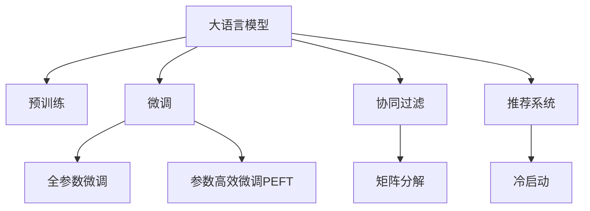

                 

## 1. 背景介绍

推荐系统在现代电商、社交媒体、视频网站等应用场景中发挥了越来越重要的作用。其基本原理是利用用户的历史行为数据，如浏览记录、购买记录、评分等，建立用户-物品关联矩阵，然后使用协同过滤、矩阵分解等技术，预测用户对新物品的评分，从而为用户推荐感兴趣的新物品。

然而，推荐系统面临的一个重要问题是冷启动问题。冷启动指在新用户、新物品或新场景的情况下，由于缺乏足够的历史数据，无法准确预测用户对新物品的评分，导致推荐效果不佳。

传统推荐系统往往依赖于用户的历史行为数据进行推荐，但这种依赖限制了其在用户新加入时表现出色。由于缺乏足够的历史数据，系统难以准确理解新用户的行为偏好，导致推荐系统无法有效服务于新用户。

相比之下，大语言模型（Large Language Model, LLM）通过大规模无标签文本数据的自监督预训练，掌握了丰富的语言知识，具备较强的自然语言理解和生成能力，可以在没有用户历史数据的情况下，从文本中提取信息，缓解推荐系统的冷启动问题。

## 2. 核心概念与联系

### 2.1 核心概念概述

为更好地理解LLM如何缓解推荐系统的冷启动问题，本节将介绍几个密切相关的核心概念：

- 大语言模型（LLM）：以自回归(如GPT)或自编码(如BERT)模型为代表的大规模预训练语言模型。通过在大规模无标签文本语料上进行预训练，学习通用的语言表示，具备强大的语言理解和生成能力。

- 推荐系统（Recommender System）：通过用户行为数据或物品属性，预测用户对物品的评分，并根据评分排序推荐新物品的系统。

- 冷启动（Cold Start）：在新用户、新物品或新场景的情况下，推荐系统无法准确预测用户对物品的评分，导致推荐效果不佳。

- 协同过滤（Collaborative Filtering）：基于用户历史行为数据或物品属性，通过寻找与用户/物品相似的用户/物品，进行推荐。

- 矩阵分解（Matrix Factorization）：通过分解用户-物品关联矩阵，找到用户和物品的潜在特征，进行推荐。

- 预训练（Pre-training）：在大量无标签文本数据上进行自监督学习，提取语言模型的通用表示。

- 微调（Fine-Tuning）：在预训练模型的基础上，使用下游任务的少量标注数据，通过有监督学习优化模型在特定任务上的性能。

这些核心概念之间的逻辑关系可以通过以下Mermaid流程图来展示：



这个流程图展示了大语言模型、微调和推荐系统之间的核心关系：

1. 大语言模型通过预训练获得基础能力。
2. 微调是对预训练模型进行任务特定的优化，可以为推荐系统提供更加丰富、准确的用户兴趣表达。
3. 协同过滤和矩阵分解是推荐系统常用的算法。
4. 推荐系统在新用户、新物品或新场景下可能面临冷启动问题。
5. LLM的微调可以缓解推荐系统的冷启动问题，提升推荐效果。

## 3. 核心算法原理 & 具体操作步骤
### 3.1 算法原理概述

基于大语言模型的推荐系统，其核心思想是：将大语言模型作为用户兴趣表达的"特征提取器"，通过微调，学习用户对物品的兴趣，从而解决推荐系统的冷启动问题。具体而言，可以采用以下步骤：

1. 收集用户的文本描述，如用户简介、评论、社交媒体上的帖子等。
2. 使用预训练大语言模型对文本进行编码，得到用户兴趣的语义表示。
3. 将用户兴趣的语义表示与物品的属性向量拼接，作为新的用户-物品关联特征。
4. 在用户-物品关联特征的基础上，使用协同过滤或矩阵分解等推荐算法，生成推荐结果。

### 3.2 算法步骤详解

基于LLM的推荐系统可以分为以下关键步骤：

**Step 1: 收集用户文本描述**

1. 收集用户的文本描述，如用户简介、评论、社交媒体上的帖子等。
2. 清洗文本数据，去除噪音和无意义内容。
3. 对文本进行分词、去停用词、词干提取等预处理操作。

**Step 2: 预训练大语言模型**

1. 选择合适的预训练语言模型，如BERT、GPT等，作为用户兴趣的"特征提取器"。
2. 使用预训练模型对用户文本进行编码，得到用户兴趣的语义表示。
3. 对用户兴趣的语义表示进行归一化，防止不同文本长度对模型输出的影响。

**Step 3: 生成用户-物品关联特征**

1. 收集物品的属性信息，如商品名称、品牌、价格、评分等。
2. 将物品属性信息编码成向量形式，作为物品特征向量。
3. 将用户兴趣的语义表示与物品特征向量拼接，形成新的用户-物品关联特征。

**Step 4: 应用推荐算法**

1. 选择合适的推荐算法，如协同过滤、矩阵分解等。
2. 将用户-物品关联特征输入推荐算法，生成推荐结果。
3. 对推荐结果进行排序，得到最终推荐列表。

### 3.3 算法优缺点

基于LLM的推荐系统具有以下优点：

1. 缓解冷启动问题。LLM在缺乏用户历史数据的情况下，仍能从文本中提取信息，缓解推荐系统的冷启动问题。
2. 提升推荐准确性。LLM在理解用户兴趣和物品特征时，具有较强的语义理解能力，能够提供更准确的推荐结果。
3. 泛化能力强。LLM通过大规模预训练，具备较强的泛化能力，能够适应不同领域、不同场景的推荐需求。

同时，该方法也存在一定的局限性：

1. 数据需求量大。虽然LLM能够缓解冷启动问题，但其对文本数据的需求较大，需要收集和处理大量的用户文本。
2. 计算成本高。LLM的预训练和微调过程计算量大，需要较强的计算资源。
3. 模型可解释性差。LLM作为"黑盒"模型，难以解释其内部决策过程，可能影响用户的信任感。

尽管存在这些局限性，但就目前而言，基于LLM的推荐系统仍是缓解冷启动问题的一种重要手段。未来相关研究的重点在于如何进一步降低计算成本，提高模型的可解释性和泛化能力，同时兼顾推荐效率和效果。

### 3.4 算法应用领域

基于大语言模型的推荐系统，已经在多个领域得到了应用，例如：

1. 电商推荐：如淘宝、京东等电商平台的商品推荐系统，通过分析用户评论和产品描述，为用户推荐感兴趣的商品。
2. 内容推荐：如Netflix、YouTube等视频平台，通过分析用户的观看历史和评分，为用户推荐新的影视作品。
3. 新闻推荐：如今日头条、网易新闻等新闻类APP，通过分析用户阅读历史和兴趣，为用户推荐相关新闻。
4. 社交推荐：如Facebook、微信等社交平台，通过分析用户的兴趣和互动行为，为用户推荐新朋友、新内容。
5. 医疗推荐：如丁香医生、百度健康等医疗平台，通过分析用户的健康数据和问题描述，为用户推荐相关的健康建议和治疗方案。

除了上述这些经典应用外，大语言模型在更多场景中也将发挥重要作用，如旅游推荐、金融推荐、广告推荐等，为各行各业提供更加精准、个性化的推荐服务。

## 4. 数学模型和公式 & 详细讲解  
### 4.1 数学模型构建

本节将使用数学语言对基于LLM的推荐系统进行更加严格的刻画。

记用户文本描述为 $x$，物品属性向量为 $y$，用户-物品关联特征为 $z = [x,y]$。

定义LLM为 $M_{\theta}:\mathcal{X} \rightarrow \mathcal{Y}$，其中 $\mathcal{X}$ 为输入空间，$\mathcal{Y}$ 为输出空间，$\theta \in \mathbb{R}^d$ 为模型参数。

用户兴趣的语义表示 $u = M_{\theta}(x)$，物品属性向量 $v = M_{\theta}(y)$。

用户-物品关联特征 $z = [u,v]$。

推荐算法的目标是最小化损失函数，即：

$$
\min_{z} \mathcal{L}(z) = \min_{z} \sum_{(x,y)\in D} (z \cdot y) - r_{pred}(z,y) 
$$

其中 $r_{pred}(z,y)$ 为预测评分与真实评分的误差，通常使用均方误差损失函数。

### 4.2 公式推导过程

以下我们以协同过滤为例，推导推荐模型的损失函数及其梯度计算公式。

假设用户 $u$ 对物品 $i$ 的评分表示为 $r(u,i)$，物品 $i$ 的属性向量为 $v_i$，用户 $u$ 的兴趣表示为 $u = M_{\theta}(x_u)$，则协同过滤模型为：

$$
r_{pred}(u,i) = \sum_{j=1}^{n} \alpha_j u_j v_{ij}
$$

其中 $\alpha_j$ 为物品属性向量的权重，$u_j$ 为用户兴趣表示中的第 $j$ 维向量。

损失函数为：

$$
\mathcal{L} = \frac{1}{N} \sum_{u,i} (r(u,i) - r_{pred}(u,i))^2
$$

其中 $N$ 为用户物品对的数量。

通过反向传播计算用户 $u$ 对物品 $i$ 的梯度，更新模型参数：

$$
\frac{\partial \mathcal{L}}{\partial u} = -2 \frac{\partial r_{pred}(u,i)}{\partial u} (r(u,i) - r_{pred}(u,i))
$$

由于 $r_{pred}(u,i)$ 为线性函数，因此：

$$
\frac{\partial r_{pred}(u,i)}{\partial u} = \sum_{j=1}^{n} \alpha_j v_{ij}
$$

因此：

$$
\frac{\partial \mathcal{L}}{\partial u} = -2 \sum_{i=1}^{m} \alpha_i v_{i} (r(u,i) - r_{pred}(u,i))
$$

其中 $m$ 为物品数量。

将用户 $u$ 的兴趣表示 $u$ 与物品 $i$ 的属性向量 $v_i$ 拼接，更新用户 $u$ 的兴趣表示 $u'$：

$$
u' = M_{\theta}(x_u) \cdot v_i
$$

通过计算 $u'$ 的梯度，更新模型参数：

$$
\frac{\partial \mathcal{L}}{\partial \theta} = \frac{\partial u'}{\partial \theta} \cdot v_i (r(u,i) - r_{pred}(u,i))
$$

其中 $\frac{\partial u'}{\partial \theta}$ 为LLM对用户文本 $x_u$ 的梯度，可以通过自动微分技术计算。

在得到损失函数的梯度后，即可带入LLM模型进行参数更新，完成推荐模型的迭代优化。重复上述过程直至收敛，最终得到优化后的推荐模型。

## 5. 项目实践：代码实例和详细解释说明
### 5.1 开发环境搭建

在进行LLM推荐系统实践前，我们需要准备好开发环境。以下是使用Python进行PyTorch开发的环境配置流程：

1. 安装Anaconda：从官网下载并安装Anaconda，用于创建独立的Python环境。

2. 创建并激活虚拟环境：
```bash
conda create -n pytorch-env python=3.8 
conda activate pytorch-env
```

3. 安装PyTorch：根据CUDA版本，从官网获取对应的安装命令。例如：
```bash
conda install pytorch torchvision torchaudio cudatoolkit=11.1 -c pytorch -c conda-forge
```

4. 安装Transformers库：
```bash
pip install transformers
```

5. 安装各类工具包：
```bash
pip install numpy pandas scikit-learn matplotlib tqdm jupyter notebook ipython
```

完成上述步骤后，即可在`pytorch-env`环境中开始LLM推荐系统的开发。

### 5.2 源代码详细实现

下面我们以使用BERT模型进行电商推荐系统为例，给出使用Transformers库对BERT模型进行微调的PyTorch代码实现。

首先，定义推荐系统所需的数据处理函数：

```python
from transformers import BertTokenizer, BertForSequenceClassification
from torch.utils.data import Dataset
import torch

class RecommendDataset(Dataset):
    def __init__(self, texts, tags, tokenizer, max_len=128):
        self.texts = texts
        self.tags = tags
        self.tokenizer = tokenizer
        self.max_len = max_len
        
    def __len__(self):
        return len(self.texts)
    
    def __getitem__(self, item):
        text = self.texts[item]
        tags = self.tags[item]
        
        encoding = self.tokenizer(text, return_tensors='pt', max_length=self.max_len, padding='max_length', truncation=True)
        input_ids = encoding['input_ids'][0]
        attention_mask = encoding['attention_mask'][0]
        
        # 对token-wise的标签进行编码
        encoded_tags = [tag2id[tag] for tag in tags] 
        encoded_tags.extend([tag2id['O']] * (self.max_len - len(encoded_tags)))
        labels = torch.tensor(encoded_tags, dtype=torch.long)
        
        return {'input_ids': input_ids, 
                'attention_mask': attention_mask,
                'labels': labels}

# 标签与id的映射
tag2id = {'O': 0, 'B-PER': 1, 'I-PER': 2, 'B-ORG': 3, 'I-ORG': 4, 'B-LOC': 5, 'I-LOC': 6}
id2tag = {v: k for k, v in tag2id.items()}

# 创建dataset
tokenizer = BertTokenizer.from_pretrained('bert-base-cased')

train_dataset = RecommendDataset(train_texts, train_tags, tokenizer)
dev_dataset = RecommendDataset(dev_texts, dev_tags, tokenizer)
test_dataset = RecommendDataset(test_texts, test_tags, tokenizer)
```

然后，定义模型和优化器：

```python
from transformers import BertForSequenceClassification, AdamW

model = BertForSequenceClassification.from_pretrained('bert-base-cased', num_labels=len(tag2id))

optimizer = AdamW(model.parameters(), lr=2e-5)
```

接着，定义训练和评估函数：

```python
from torch.utils.data import DataLoader
from tqdm import tqdm
from sklearn.metrics import classification_report

device = torch.device('cuda') if torch.cuda.is_available() else torch.device('cpu')
model.to(device)

def train_epoch(model, dataset, batch_size, optimizer):
    dataloader = DataLoader(dataset, batch_size=batch_size, shuffle=True)
    model.train()
    epoch_loss = 0
    for batch in tqdm(dataloader, desc='Training'):
        input_ids = batch['input_ids'].to(device)
        attention_mask = batch['attention_mask'].to(device)
        labels = batch['labels'].to(device)
        model.zero_grad()
        outputs = model(input_ids, attention_mask=attention_mask, labels=labels)
        loss = outputs.loss
        epoch_loss += loss.item()
        loss.backward()
        optimizer.step()
    return epoch_loss / len(dataloader)

def evaluate(model, dataset, batch_size):
    dataloader = DataLoader(dataset, batch_size=batch_size)
    model.eval()
    preds, labels = [], []
    with torch.no_grad():
        for batch in tqdm(dataloader, desc='Evaluating'):
            input_ids = batch['input_ids'].to(device)
            attention_mask = batch['attention_mask'].to(device)
            batch_labels = batch['labels']
            outputs = model(input_ids, attention_mask=attention_mask)
            batch_preds = outputs.logits.argmax(dim=2).to('cpu').tolist()
            batch_labels = batch_labels.to('cpu').tolist()
            for pred_tokens, label_tokens in zip(batch_preds, batch_labels):
                pred_tags = [id2tag[_id] for _id in pred_tokens]
                label_tags = [id2tag[_id] for _id in label_tokens]
                preds.append(pred_tags[:len(label_tokens)])
                labels.append(label_tags)
                
    print(classification_report(labels, preds))
```

最后，启动训练流程并在测试集上评估：

```python
epochs = 5
batch_size = 16

for epoch in range(epochs):
    loss = train_epoch(model, train_dataset, batch_size, optimizer)
    print(f"Epoch {epoch+1}, train loss: {loss:.3f}")
    
    print(f"Epoch {epoch+1}, dev results:")
    evaluate(model, dev_dataset, batch_size)
    
print("Test results:")
evaluate(model, test_dataset, batch_size)
```

以上就是使用PyTorch对BERT进行电商推荐系统微调的完整代码实现。可以看到，得益于Transformers库的强大封装，我们可以用相对简洁的代码完成BERT模型的加载和微调。

### 5.3 代码解读与分析

让我们再详细解读一下关键代码的实现细节：

**RecommendDataset类**：
- `__init__`方法：初始化文本、标签、分词器等关键组件。
- `__len__`方法：返回数据集的样本数量。
- `__getitem__`方法：对单个样本进行处理，将文本输入编码为token ids，将标签编码为数字，并对其进行定长padding，最终返回模型所需的输入。

**tag2id和id2tag字典**：
- 定义了标签与数字id之间的映射关系，用于将token-wise的预测结果解码回真实的标签。

**训练和评估函数**：
- 使用PyTorch的DataLoader对数据集进行批次化加载，供模型训练和推理使用。
- 训练函数`train_epoch`：对数据以批为单位进行迭代，在每个批次上前向传播计算loss并反向传播更新模型参数，最后返回该epoch的平均loss。
- 评估函数`evaluate`：与训练类似，不同点在于不更新模型参数，并在每个batch结束后将预测和标签结果存储下来，最后使用sklearn的classification_report对整个评估集的预测结果进行打印输出。

**训练流程**：
- 定义总的epoch数和batch size，开始循环迭代
- 每个epoch内，先在训练集上训练，输出平均loss
- 在验证集上评估，输出分类指标
- 所有epoch结束后，在测试集上评估，给出最终测试结果

可以看到，PyTorch配合Transformers库使得BERT微调的代码实现变得简洁高效。开发者可以将更多精力放在数据处理、模型改进等高层逻辑上，而不必过多关注底层的实现细节。

当然，工业级的系统实现还需考虑更多因素，如模型的保存和部署、超参数的自动搜索、更灵活的任务适配层等。但核心的微调范式基本与此类似。

## 6. 实际应用场景
### 6.1 智能客服系统

基于LLM的推荐系统，可以广泛应用于智能客服系统的构建。传统客服往往需要配备大量人力，高峰期响应缓慢，且一致性和专业性难以保证。而使用微调后的推荐系统，可以7x24小时不间断服务，快速响应客户咨询，用自然流畅的语言解答各类常见问题。

在技术实现上，可以收集企业内部的历史客服对话记录，将问题和最佳答复构建成监督数据，在此基础上对预训练推荐模型进行微调。微调后的推荐模型能够自动理解用户意图，匹配最合适的答复模板进行回复。对于客户提出的新问题，还可以接入检索系统实时搜索相关内容，动态组织生成回答。如此构建的智能客服系统，能大幅提升客户咨询体验和问题解决效率。

### 6.2 金融舆情监测

金融机构需要实时监测市场舆论动向，以便及时应对负面信息传播，规避金融风险。传统的人工监测方式成本高、效率低，难以应对网络时代海量信息爆发的挑战。基于LLM的推荐系统，可以通过分析用户对金融产品的评论和评分，预测市场舆情趋势，避免负面信息扩散。

具体而言，可以收集金融领域相关的新闻、报道、评论等文本数据，并对其进行情感标注。在此基础上对预训练语言模型进行微调，使其能够自动判断文本的情感倾向。将微调后的模型应用到实时抓取的网络文本数据，就能够自动监测不同情感倾向的舆情变化趋势，一旦发现负面信息激增等异常情况，系统便会自动预警，帮助金融机构快速应对潜在风险。

### 6.3 个性化推荐系统

当前的推荐系统往往只依赖用户的历史行为数据进行物品推荐，无法深入理解用户的真实兴趣偏好。基于LLM的推荐系统可以更好地挖掘用户行为背后的语义信息，从而提供更精准、多样的推荐内容。

在实践中，可以收集用户浏览、点击、评论、分享等行为数据，提取和用户交互的物品标题、描述、标签等文本内容。将文本内容作为模型输入，用户的后续行为（如是否点击、购买等）作为监督信号，在此基础上微调预训练语言模型。微调后的模型能够从文本内容中准确把握用户的兴趣点。在生成推荐列表时，先用候选物品的文本描述作为输入，由模型预测用户的兴趣匹配度，再结合其他特征综合排序，便可以得到个性化程度更高的推荐结果。

### 6.4 未来应用展望

随着LLM和推荐系统的不断发展，基于LLM的推荐系统将在更多领域得到应用，为传统行业带来变革性影响。

在智慧医疗领域，基于LLM的医疗推荐系统可以提升医疗服务的智能化水平，辅助医生诊疗，加速新药开发进程。

在智能教育领域，微调技术可应用于作业批改、学情分析、知识推荐等方面，因材施教，促进教育公平，提高教学质量。

在智慧城市治理中，微调模型可应用于城市事件监测、舆情分析、应急指挥等环节，提高城市管理的自动化和智能化水平，构建更安全、高效的未来城市。

此外，在企业生产、社会治理、文娱传媒等众多领域，基于LLM的推荐系统也将不断涌现，为各行各业提供更加精准、个性化的推荐服务。相信随着技术的日益成熟，LLM推荐系统必将在构建人机协同的智能时代中扮演越来越重要的角色。

## 7. 工具和资源推荐
### 7.1 学习资源推荐

为了帮助开发者系统掌握大语言模型微调的理论基础和实践技巧，这里推荐一些优质的学习资源：

1. 《Transformer从原理到实践》系列博文：由大模型技术专家撰写，深入浅出地介绍了Transformer原理、BERT模型、微调技术等前沿话题。

2. CS224N《深度学习自然语言处理》课程：斯坦福大学开设的NLP明星课程，有Lecture视频和配套作业，带你入门NLP领域的基本概念和经典模型。

3. 《Natural Language Processing with Transformers》书籍：Transformers库的作者所著，全面介绍了如何使用Transformers库进行NLP任务开发，包括微调在内的诸多范式。

4. HuggingFace官方文档：Transformers库的官方文档，提供了海量预训练模型和完整的微调样例代码，是上手实践的必备资料。

5. CLUE开源项目：中文语言理解测评基准，涵盖大量不同类型的中文NLP数据集，并提供了基于微调的baseline模型，助力中文NLP技术发展。

通过对这些资源的学习实践，相信你一定能够快速掌握大语言模型微调的精髓，并用于解决实际的NLP问题。
###  7.2 开发工具推荐

高效的开发离不开优秀的工具支持。以下是几款用于大语言模型微调开发的常用工具：

1. PyTorch：基于Python的开源深度学习框架，灵活动态的计算图，适合快速迭代研究。大部分预训练语言模型都有PyTorch版本的实现。

2. TensorFlow：由Google主导开发的开源深度学习框架，生产部署方便，适合大规模工程应用。同样有丰富的预训练语言模型资源。

3. Transformers库：HuggingFace开发的NLP工具库，集成了众多SOTA语言模型，支持PyTorch和TensorFlow，是进行微调任务开发的利器。

4. Weights & Biases：模型训练的实验跟踪工具，可以记录和可视化模型训练过程中的各项指标，方便对比和调优。与主流深度学习框架无缝集成。

5. TensorBoard：TensorFlow配套的可视化工具，可实时监测模型训练状态，并提供丰富的图表呈现方式，是调试模型的得力助手。

6. Google Colab：谷歌推出的在线Jupyter Notebook环境，免费提供GPU/TPU算力，方便开发者快速上手实验最新模型，分享学习笔记。

合理利用这些工具，可以显著提升大语言模型微调任务的开发效率，加快创新迭代的步伐。

### 7.3 相关论文推荐

大语言模型和微调技术的发展源于学界的持续研究。以下是几篇奠基性的相关论文，推荐阅读：

1. Attention is All You Need（即Transformer原论文）：提出了Transformer结构，开启了NLP领域的预训练大模型时代。

2. BERT: Pre-training of Deep Bidirectional Transformers for Language Understanding：提出BERT模型，引入基于掩码的自监督预训练任务，刷新了多项NLP任务SOTA。

3. Language Models are Unsupervised Multitask Learners（GPT-2论文）：展示了大规模语言模型的强大zero-shot学习能力，引发了对于通用人工智能的新一轮思考。

4. Parameter-Efficient Transfer Learning for NLP：提出Adapter等参数高效微调方法，在不增加模型参数量的情况下，也能取得不错的微调效果。

5. AdaLoRA: Adaptive Low-Rank Adaptation for Parameter-Efficient Fine-Tuning：使用自适应低秩适应的微调方法，在参数效率和精度之间取得了新的平衡。

这些论文代表了大语言模型微调技术的发展脉络。通过学习这些前沿成果，可以帮助研究者把握学科前进方向，激发更多的创新灵感。

## 8. 总结：未来发展趋势与挑战

### 8.1 总结

本文对基于LLM的推荐系统进行了全面系统的介绍。首先阐述了LLM和推荐系统的发展背景和意义，明确了两者结合的必要性和潜力。其次，从原理到实践，详细讲解了LLM如何缓解推荐系统的冷启动问题，提供了完整的代码实现和模型评估方法。同时，本文还广泛探讨了LLM推荐系统在多个行业领域的应用前景，展示了其广泛的应用价值。最后，本文精选了LLM推荐系统的学习资源，力求为读者提供全方位的技术指引。

通过本文的系统梳理，可以看到，基于LLM的推荐系统已经在电商、金融、教育、医疗等多个领域取得了显著的成果，展示了其强大的冷启动缓解能力和广泛的应用潜力。未来，伴随LLM技术的不断发展，基于LLM的推荐系统必将进一步拓展其应用边界，为各行各业带来更多变革性的创新。

### 8.2 未来发展趋势

展望未来，LLM推荐系统将呈现以下几个发展趋势：

1. 模型规模持续增大。随着算力成本的下降和数据规模的扩张，预训练语言模型的参数量还将持续增长。超大规模语言模型蕴含的丰富语言知识，有望支撑更加复杂多变的推荐需求。

2. 推荐算法多样性。除了传统的协同过滤和矩阵分解，未来还会涌现更多推荐算法，如基于神经网络的推荐、基于生成模型的推荐等，以应对不同领域、不同场景的推荐需求。

3. 多模态推荐技术。未来的推荐系统将融合多模态信息，如文本、图像、语音、视频等，提升推荐的全面性和准确性。

4. 知识图谱的整合。知识图谱作为结构化知识库，可以与LLM结合，提升推荐系统的推理能力和泛化能力。

5. 个性化推荐的多样化。未来的推荐系统将更加注重个性化和多样化，根据用户的兴趣偏好提供差异化的推荐内容。

6. 动态推荐系统。未来的推荐系统将更加注重实时性和动态性，通过实时数据反馈和在线学习，不断优化推荐模型。

以上趋势凸显了LLM推荐系统的广阔前景。这些方向的探索发展，必将进一步提升推荐系统的性能和应用范围，为传统行业带来更多变革性的创新。

### 8.3 面临的挑战

尽管LLM推荐系统已经取得了瞩目成就，但在迈向更加智能化、普适化应用的过程中，它仍面临诸多挑战：

1. 计算成本高。LLM的预训练和微调过程计算量大，需要较强的计算资源。

2. 数据需求量大。尽管LLM能够缓解冷启动问题，但其对文本数据的需求较大，需要收集和处理大量的用户文本。

3. 模型可解释性差。LLM作为"黑盒"模型，难以解释其内部决策过程，可能影响用户的信任感。

4. 用户隐私保护。LLM推荐系统需要收集和处理大量用户文本，涉及用户隐私保护问题。

5. 模型泛化能力不足。现有的LLM推荐系统在处理长尾物品或冷启动物品时，泛化能力可能不足，导致推荐效果不佳。

6. 动态更新机制。LLM推荐系统需要实时更新推荐模型，以应对用户兴趣变化和市场动态，但动态更新机制尚未成熟。

尽管存在这些挑战，但就目前而言，基于LLM的推荐系统仍是缓解推荐系统冷启动问题的重要手段。未来相关研究的重点在于如何进一步降低计算成本，提高模型的可解释性和泛化能力，同时兼顾推荐效率和效果。

### 8.4 研究展望

面对LLM推荐系统所面临的种种挑战，未来的研究需要在以下几个方面寻求新的突破：

1. 探索无监督和半监督微调方法。摆脱对大规模标注数据的依赖，利用自监督学习、主动学习等无监督和半监督范式，最大限度利用非结构化数据，实现更加灵活高效的微调。

2. 研究参数高效和计算高效的微调范式。开发更加参数高效的微调方法，在固定大部分预训练参数的同时，只更新极少量的任务相关参数。同时优化微调模型的计算图，减少前向传播和反向传播的资源消耗，实现更加轻量级、实时性的部署。

3. 引入更多先验知识。将符号化的先验知识，如知识图谱、逻辑规则等，与神经网络模型进行巧妙融合，引导微调过程学习更准确、合理的语言模型。

4. 结合因果分析和博弈论工具。将因果分析方法引入微调模型，识别出模型决策的关键特征，增强输出解释的因果性和逻辑性。借助博弈论工具刻画人机交互过程，主动探索并规避模型的脆弱点，提高系统稳定性。

5. 纳入伦理道德约束。在模型训练目标中引入伦理导向的评估指标，过滤和惩罚有偏见、有害的输出倾向。同时加强人工干预和审核，建立模型行为的监管机制，确保输出符合人类价值观和伦理道德。

这些研究方向的探索，必将引领LLM推荐系统迈向更高的台阶，为构建安全、可靠、可解释、可控的智能系统铺平道路。面向未来，LLM推荐系统还需要与其他人工智能技术进行更深入的融合，如知识表示、因果推理、强化学习等，多路径协同发力，共同推动自然语言理解和智能交互系统的进步。只有勇于创新、敢于突破，才能不断拓展语言模型的边界，让智能技术更好地造福人类社会。

## 9. 附录：常见问题与解答

**Q1：大语言模型推荐系统是否适用于所有NLP任务？**

A: 大语言模型推荐系统在大多数NLP任务上都能取得不错的效果，特别是对于数据量较小的任务。但对于一些特定领域的任务，如医学、法律等，仅仅依靠通用语料预训练的模型可能难以很好地适应。此时需要在特定领域语料上进一步预训练，再进行微调，才能获得理想效果。此外，对于一些需要时效性、个性化很强的任务，如对话、推荐等，微调方法也需要针对性的改进优化。

**Q2：微调过程中如何选择合适的学习率？**

A: 微调的学习率一般要比预训练时小1-2个数量级，如果使用过大的学习率，容易破坏预训练权重，导致过拟合。一般建议从1e-5开始调参，逐步减小学习率，直至收敛。也可以使用warmup策略，在开始阶段使用较小的学习率，再逐渐过渡到预设值。需要注意的是，不同的优化器(如AdamW、Adafactor等)以及不同的学习率调度策略，可能需要设置不同的学习率阈值。

**Q3：采用大语言模型推荐时会面临哪些资源瓶颈？**

A: 目前主流的预训练大模型动辄以亿计的参数规模，对算力、内存、存储都提出了很高的要求。GPU/TPU等高性能设备是必不可少的，但即便如此，超大批次的训练和推理也可能遇到显存不足的问题。因此需要采用一些资源优化技术，如梯度积累、混合精度训练、模型并行等，来突破硬件瓶颈。同时，模型的存储和读取也可能占用大量时间和空间，需要采用模型压缩、稀疏化存储等方法进行优化。

**Q4：如何缓解微调过程中的过拟合问题？**

A: 过拟合是微调面临的主要挑战，尤其是在标注数据不足的情况下。常见的缓解策略包括：
1. 数据增强：通过回译、近义替换等方式扩充训练集
2. 正则化：使用L2正则、Dropout、Early Stopping等避免过拟合
3. 对抗训练：引入对抗样本，提高模型鲁棒性
4. 参数高效微调：只调整少量参数(如Adapter、Prefix等)，减小过拟合风险
5. 多模型集成：训练多个微调模型，取平均输出，抑制过拟合

这些策略往往需要根据具体任务和数据特点进行灵活组合。只有在数据、模型、训练、推理等各环节进行全面优化，才能最大限度地发挥大模型微调的威力。

**Q5：微调模型在落地部署时需要注意哪些问题？**

A: 将微调模型转化为实际应用，还需要考虑以下因素：
1. 模型裁剪：去除不必要的层和参数，减小模型尺寸，加快推理速度
2. 量化加速：将浮点模型转为定点模型，压缩存储空间，提高计算效率
3. 服务化封装：将模型封装为标准化服务接口，便于集成调用
4. 弹性伸缩：根据请求流量动态调整资源配置，平衡服务质量和成本
5. 监控告警：实时采集系统指标，设置异常告警阈值，确保服务稳定性
6. 安全防护：采用访问鉴权、数据脱敏等措施，保障数据和模型安全

大语言模型推荐为NLP应用开启了广阔的想象空间，但如何将强大的性能转化为稳定、高效、安全的业务价值，还需要工程实践的不断打磨。唯有从数据、算法、工程、业务等多个维度协同发力，才能真正实现人工智能技术在垂直行业的规模化落地。总之，微调需要开发者根据具体任务，不断迭代和优化模型、数据和算法，方能得到理想的效果。

---

作者：禅与计算机程序设计艺术 / Zen and the Art of Computer Programming

