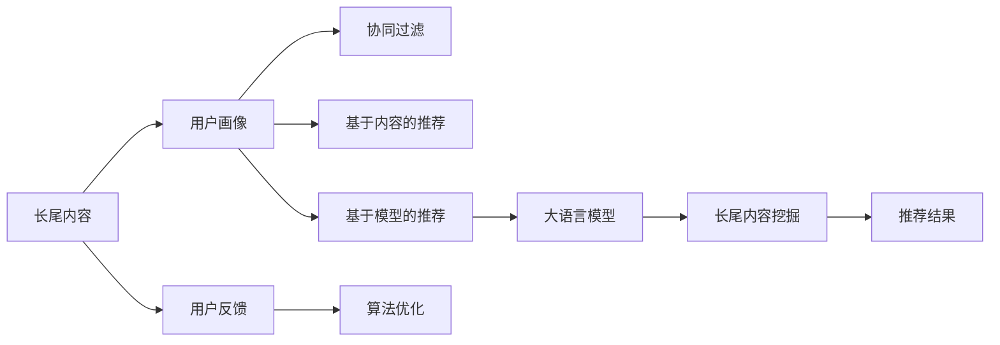

                 

## 1. 背景介绍

推荐系统（Recommendation System）已经成为互联网时代不可或缺的一部分。无论是电商、社交媒体、视频平台，还是新闻网站，都依赖推荐系统为用户提供个性化的内容推荐。然而，传统推荐系统在面对长尾内容（Long Tail Content）时，往往存在冷启动问题、内容稀疏性、多样性不足等问题。这些问题不仅降低了用户体验，也限制了推荐系统的服务价值。

随着人工智能和大语言模型的发展，新的推荐算法开始涌现。大语言模型（Large Language Models, LLMs）由于其强大的语言理解和生成能力，为推荐系统提供了新的解决方案。特别是大语言模型在长尾内容挖掘上的潜力，逐渐引起研究者的关注。

本文将围绕大语言模型对推荐系统长尾内容的挖掘，探讨其核心概念、技术原理、应用场景及未来趋势。

## 2. 核心概念与联系

### 2.1 核心概念概述

在大语言模型的辅助下，推荐系统可以从以下几个层面进行长尾内容挖掘：

- **长尾内容（Long Tail Content）**：指那些少量用户关注但大量内容构成的内容集合。长尾内容的典型代表包括小众书籍、独立音乐、冷门影视等。
- **推荐算法（Recommendation Algorithms）**：传统推荐算法包括协同过滤、基于内容的推荐、基于模型的推荐等，而在大语言模型的支持下，推荐算法可以更加灵活和多样化。
- **大语言模型（Large Language Models, LLMs）**：指通过大规模预训练学习到复杂语言能力的深度学习模型，如GPT、BERT、T5等。
- **用户画像（User Profiles）**：构建用户兴趣画像，捕捉用户的个性化需求。
- **冷启动问题（Cold Start Problem）**：新用户或新物品加入推荐系统时，缺乏足够历史数据的问题。

### 2.2 核心概念原理和架构的 Mermaid 流程图



## 3. 核心算法原理 & 具体操作步骤

### 3.1 算法原理概述

大语言模型通过预训练学习到广泛的语言知识，能够理解自然语言文本的语义和结构，从而辅助推荐系统进行长尾内容的挖掘。其基本原理如下：

1. **预训练过程**：大语言模型在大规模无标签文本数据上进行预训练，学习到丰富的语言表示。
2. **微调过程**：针对推荐系统的特定需求，对大语言模型进行微调，使其能够处理特定的推荐任务。
3. **长尾内容挖掘**：在微调后的大语言模型中，引入推荐系统的用户画像和长尾内容数据，通过语言模型对用户兴趣进行预测，生成推荐结果。

### 3.2 算法步骤详解

大语言模型辅助推荐系统挖掘长尾内容的步骤如下：

**Step 1: 数据预处理**

- **用户画像构建**：收集用户的浏览历史、搜索记录、评分记录等，构建用户的兴趣画像。
- **长尾内容采集**：采集长尾内容的元数据，如书名、歌曲名、影片名等。
- **数据清洗和归一化**：处理数据中的噪声，归一化数据格式。

**Step 2: 大语言模型微调**

- **选择模型**：选择适合任务的大语言模型，如GPT、BERT、T5等。
- **任务适配层设计**：根据推荐任务，设计适合的任务适配层，如评分预测、分类任务等。
- **微调数据准备**：准备微调所需的数据集，包括用户画像和长尾内容数据。
- **微调训练**：在大语言模型上进行微调训练，优化适配层的参数，使其适合推荐任务。

**Step 3: 长尾内容挖掘**

- **特征提取**：从长尾内容数据中提取特征，如文本摘要、关键词等。
- **内容匹配**：将长尾内容特征与用户兴趣画像进行匹配，筛选出与用户兴趣相关的内容。
- **推荐生成**：利用微调后的大语言模型，对筛选出的长尾内容进行评分或分类，生成推荐结果。
- **推荐优化**：根据用户反馈，不断优化推荐算法，提升推荐效果。

### 3.3 算法优缺点

**优点**：
1. **增强推荐多样性**：大语言模型能够理解长尾内容的语义，增加推荐内容的多样性和丰富度。
2. **缓解冷启动问题**：大语言模型通过理解自然语言，可以在一定程度上缓解新用户和新物品的冷启动问题。
3. **减少数据需求**：与传统推荐算法相比，大语言模型可以在较少的标注数据下，进行有效的长尾内容挖掘。

**缺点**：
1. **计算资源需求高**：大语言模型的预训练和微调需要大量的计算资源，可能导致计算成本较高。
2. **可解释性不足**：大语言模型的决策过程不够透明，难以进行详细解释。
3. **泛化能力有限**：大语言模型在特定领域的泛化能力可能不如领域专用模型。

### 3.4 算法应用领域

大语言模型辅助推荐系统在长尾内容挖掘中的应用广泛，以下是几个典型领域：

- **电商推荐**：在电商平台中，大语言模型可以挖掘用户对小众商品、新品、长尾商品的兴趣，提升用户体验和满意度。
- **视频推荐**：在视频平台中，大语言模型可以挖掘用户对冷门电影、独立纪录片等长尾内容的兴趣，丰富用户观看体验。
- **音乐推荐**：在音乐平台中，大语言模型可以挖掘用户对独立音乐人、小众音乐等长尾内容的兴趣，增强推荐的多样性和个性化。
- **书籍推荐**：在图书平台中，大语言模型可以挖掘用户对冷门书籍、经典文学等长尾内容的兴趣，丰富用户的阅读选择。
- **影视推荐**：在影视平台中，大语言模型可以挖掘用户对独立电影、小众电影等长尾内容的兴趣，提升用户的观看体验。

## 4. 数学模型和公式 & 详细讲解 & 举例说明

### 4.1 数学模型构建

在大语言模型辅助推荐系统中，可以使用基于语言模型的评分预测模型。假设大语言模型为 $M_{\theta}$，输入为长尾内容 $x$ 和用户画像 $p$，输出为推荐评分 $y$。模型的目标是最小化预测评分与真实评分之间的差异。

假设长尾内容的特征表示为 $\text{feature}(x)$，用户画像的特征表示为 $\text{feature}(p)$，则评分预测模型可以表示为：

$$
y = M_{\theta}(\text{feature}(x), \text{feature}(p))
$$

### 4.2 公式推导过程

为了构建评分预测模型，可以采用自回归语言模型。假设模型 $M_{\theta}$ 的输出为 $\hat{y}$，则评分预测模型的损失函数可以表示为：

$$
\mathcal{L} = -\frac{1}{N}\sum_{i=1}^N(y_i - \hat{y}_i)^2
$$

其中 $N$ 为样本数，$y_i$ 为真实评分，$\hat{y}_i$ 为模型预测评分。

对损失函数求导，可以得到模型的梯度更新公式：

$$
\frac{\partial \mathcal{L}}{\partial \theta} = -\frac{2}{N}\sum_{i=1}^N(y_i - \hat{y}_i)\frac{\partial \hat{y}_i}{\partial \theta}
$$

通过反向传播算法，可以计算出模型参数 $\theta$ 的梯度，并使用优化算法进行更新。

### 4.3 案例分析与讲解

假设某电商平台的推荐任务为推荐书籍，用户画像为用户的浏览历史和评分记录，长尾内容为书籍的元数据。使用BERT模型作为大语言模型，构建评分预测模型。

假设某用户对《深度学习入门》有正向反馈，用户画像为“深度学习入门”，长尾内容为“深度学习入门”，则评分预测模型的输出为：

$$
y = M_{\theta}(\text{feature}(《深度学习入门》), \text{feature}(深度学习入门))
$$

假设模型的输出为0.8，则模型的损失为：

$$
\mathcal{L} = -\frac{1}{N}(y - 0.8)^2
$$

其中 $N$ 为用户数量。通过反向传播算法，计算出模型的梯度，使用优化算法进行更新，最小化损失函数。

## 5. 项目实践：代码实例和详细解释说明

### 5.1 开发环境搭建

本节将介绍使用Python和PyTorch搭建大语言模型辅助推荐系统的环境。

1. 安装Anaconda并创建虚拟环境：
```bash
conda create -n llm-recommend-env python=3.8
conda activate llm-recommend-env
```

2. 安装PyTorch和相关库：
```bash
pip install torch transformers torchtext
```

3. 安装相关依赖库：
```bash
pip install pandas numpy sklearn
```

### 5.2 源代码详细实现

本节以BertForSequenceClassification模型为例，展示使用BERT模型进行长尾内容挖掘的代码实现。

```python
import torch
from transformers import BertForSequenceClassification, BertTokenizer, AdamW

# 加载模型和分词器
model = BertForSequenceClassification.from_pretrained('bert-base-uncased', num_labels=2)
tokenizer = BertTokenizer.from_pretrained('bert-base-uncased')

# 准备数据
train_data = ...
val_data = ...
test_data = ...

# 定义评分预测函数
def predict_score(model, data):
    inputs = tokenizer(data, return_tensors='pt', padding=True, truncation=True)
    with torch.no_grad():
        outputs = model(**inputs)
        scores = outputs.logits.softmax(dim=1).tolist()[0]
    return scores

# 微调训练
optimizer = AdamW(model.parameters(), lr=1e-5)
for epoch in range(10):
    for data in train_data:
        scores = predict_score(model, data)
        loss = torch.nn.functional.mse_loss(scores, torch.tensor([1]))
        optimizer.zero_grad()
        loss.backward()
        optimizer.step()
    print(f"Epoch {epoch+1}, loss: {loss.item()}")
```

### 5.3 代码解读与分析

本节详细解读上述代码的实现细节：

1. **模型加载**：从HuggingFace库中加载BERT模型和分词器，用于特征提取和评分预测。
2. **数据准备**：收集训练数据、验证数据和测试数据，包括长尾内容的元数据和用户画像。
3. **评分预测函数**：使用分词器将长尾内容转化为模型可接受的格式，并使用BERT模型进行评分预测。
4. **微调训练**：使用AdamW优化器进行模型微调，最小化预测评分与真实评分之间的差异。
5. **损失计算**：计算模型预测评分与真实评分之间的均方误差损失。

通过这些代码，可以在PyTorch中实现大语言模型辅助推荐系统的长尾内容挖掘。

### 5.4 运行结果展示

运行上述代码，将输出每个epoch的损失值。在10个epoch后，损失值应该收敛到一个较低的水平，表示模型已经较好地适应了长尾内容的评分预测任务。

## 6. 实际应用场景

大语言模型辅助推荐系统在长尾内容挖掘中的应用场景广泛，以下是几个典型案例：

### 6.1 电商平台

在电商平台中，大语言模型可以挖掘用户对小众商品、新品、长尾商品的兴趣，提升用户体验和满意度。例如，某用户对某品牌的小众手工艺品有正向反馈，平台可以根据用户画像和长尾内容，推荐类似的小众商品，增加用户的购物体验和品牌粘性。

### 6.2 视频平台

在视频平台中，大语言模型可以挖掘用户对冷门电影、独立纪录片等长尾内容的兴趣，丰富用户观看体验。例如，某用户对一部冷门独立电影有正向反馈，平台可以根据用户画像和长尾内容，推荐类似风格的独立电影，增加用户观影的发现感和满足感。

### 6.3 音乐平台

在音乐平台中，大语言模型可以挖掘用户对独立音乐人、小众音乐等长尾内容的兴趣，增强推荐的多样性和个性化。例如，某用户对一位独立音乐人的音乐有正向反馈，平台可以根据用户画像和长尾内容，推荐类似风格的音乐人和音乐，增加用户的音乐发现感和满足感。

### 6.4 图书平台

在图书平台中，大语言模型可以挖掘用户对冷门书籍、经典文学等长尾内容的兴趣，丰富用户的阅读选择。例如，某用户对某部冷门书籍有正向反馈，平台可以根据用户画像和长尾内容，推荐类似风格的书籍，增加用户的阅读发现感和满足感。

### 6.5 影视平台

在影视平台中，大语言模型可以挖掘用户对独立电影、小众电影等长尾内容的兴趣，提升用户的观看体验。例如，某用户对一部独立电影有正向反馈，平台可以根据用户画像和长尾内容，推荐类似风格的影视作品，增加用户的观影发现感和满足感。

## 7. 工具和资源推荐

### 7.1 学习资源推荐

为了帮助开发者系统掌握大语言模型辅助推荐系统的开发，这里推荐一些优质的学习资源：

1. **《深度学习与推荐系统》**：清华大学开设的课程，涵盖了深度学习和推荐系统的基础理论和经典算法。
2. **《自然语言处理与深度学习》**：斯坦福大学开设的课程，讲解自然语言处理和深度学习的基本概念和前沿技术。
3. **《Transformers》**：HuggingFace出版的书籍，全面介绍了Transformers模型及其在NLP中的应用。
4. **HuggingFace官方文档**：提供了丰富的预训练语言模型和微调样例代码，是上手的必备资料。
5. **Kaggle竞赛**：参加Kaggle上的推荐系统竞赛，实践大语言模型在长尾内容挖掘中的应用。

通过这些资源的学习实践，相信你一定能够快速掌握大语言模型辅助推荐系统的精髓，并用于解决实际的推荐问题。

### 7.2 开发工具推荐

高效的大语言模型辅助推荐系统开发离不开优秀的工具支持。以下是几款常用的开发工具：

1. **PyTorch**：基于Python的开源深度学习框架，灵活的动态计算图，适合快速迭代研究。
2. **TensorFlow**：由Google主导开发的开源深度学习框架，生产部署方便，适合大规模工程应用。
3. **Transformers库**：HuggingFace开发的NLP工具库，集成了多种SOTA语言模型，支持PyTorch和TensorFlow，是微调任务的开发利器。
4. **Weights & Biases**：模型训练的实验跟踪工具，可以记录和可视化模型训练过程中的各项指标，方便对比和调优。
5. **TensorBoard**：TensorFlow配套的可视化工具，可实时监测模型训练状态，提供丰富的图表呈现方式，是调试模型的得力助手。
6. **Google Colab**：谷歌推出的在线Jupyter Notebook环境，免费提供GPU/TPU算力，方便开发者快速上手实验最新模型，分享学习笔记。

合理利用这些工具，可以显著提升大语言模型辅助推荐系统的开发效率，加快创新迭代的步伐。

### 7.3 相关论文推荐

大语言模型辅助推荐系统的发展源于学界的持续研究。以下是几篇奠基性的相关论文，推荐阅读：

1. **《Adaptive Long-Term Memory for Nonlinear Embedding》**：提出长短期记忆网络（LSTM）与自适应长时记忆（ALM）的结合，用于推荐系统的用户画像建模。
2. **《A Survey on Deep Learning for Recommendation Systems》**：综述了深度学习在推荐系统中的应用，介绍了多种深度学习模型的推荐效果。
3. **《Interactive Collaborative Filtering for Recommendation》**：提出交互式协同过滤（ICF）模型，用于推荐系统的用户行为预测。
4. **《Deep Neural Networks for Recommendation System》**：提出多层感知机（MLP）和卷积神经网络（CNN）在推荐系统中的应用。
5. **《Probabilistic Matrix Factorization》**：提出概率矩阵分解模型（PMF），用于推荐系统的用户行为建模。

通过对这些前沿论文的学习，可以帮助研究者掌握大语言模型辅助推荐系统的核心技术，并在实际应用中取得突破。

## 8. 总结：未来发展趋势与挑战

### 8.1 研究成果总结

大语言模型辅助推荐系统在长尾内容挖掘方面取得了显著成效，显著提升了推荐系统的内容多样性和个性化。然而，在实际应用中也面临着一些挑战和问题，需要进一步探索和改进。

### 8.2 未来发展趋势

未来，大语言模型辅助推荐系统将呈现以下几个发展趋势：

1. **模型复杂度提升**：随着计算资源的增加，推荐系统的模型复杂度将进一步提升，引入更多层和参数，增加模型的预测能力和泛化能力。
2. **多模态融合**：推荐系统将进一步融合视觉、语音、文本等多模态数据，实现更加全面和丰富的推荐效果。
3. **自适应推荐**：推荐系统将实现更加个性化的推荐，根据用户的实时行为和偏好动态调整推荐策略。
4. **跨领域迁移**：推荐系统将在不同领域之间进行迁移学习，实现知识共享和复用。
5. **离线推理优化**：推荐系统将进一步优化离线推理效率，减少计算资源消耗，提升响应速度。

### 8.3 面临的挑战

尽管大语言模型辅助推荐系统已经取得了一定的成果，但在实际应用中也面临着一些挑战：

1. **计算资源消耗大**：大语言模型的预训练和微调需要大量的计算资源，可能导致计算成本较高。
2. **数据隐私问题**：推荐系统需要收集和处理大量用户数据，数据隐私和安全问题需要得到充分保障。
3. **算法复杂度高**：推荐系统的算法复杂度高，模型训练和推理过程中容易出现模型过拟合和泛化能力不足的问题。
4. **用户行为预测困难**：用户行为数据稀疏，难以准确预测用户的兴趣和需求，需要结合更多先验知识进行改进。
5. **模型可解释性不足**：推荐系统的模型复杂度高，难以进行详细解释，需要提高模型的可解释性和可理解性。

### 8.4 研究展望

未来，大语言模型辅助推荐系统需要在以下几个方面进行探索和改进：

1. **引入先验知识**：将领域知识与神经网络模型进行融合，增强推荐系统的先验能力和泛化能力。
2. **多模态融合**：融合视觉、语音、文本等多模态数据，实现更加全面和丰富的推荐效果。
3. **自适应推荐**：实现更加个性化的推荐，根据用户的实时行为和偏好动态调整推荐策略。
4. **跨领域迁移**：在不同领域之间进行迁移学习，实现知识共享和复用。
5. **离线推理优化**：优化离线推理效率，减少计算资源消耗，提升响应速度。
6. **数据隐私保护**：保障用户数据隐私和安全，防止数据泄露和滥用。

通过不断探索和改进，大语言模型辅助推荐系统将在长尾内容挖掘上取得更大突破，为推荐系统带来新的生机和活力。

## 9. 附录：常见问题与解答

### Q1：大语言模型辅助推荐系统在长尾内容挖掘上的优势是什么？

A: 大语言模型辅助推荐系统在长尾内容挖掘上的优势主要包括：
1. **增强推荐多样性**：大语言模型能够理解长尾内容的语义，增加推荐内容的多样性和丰富度。
2. **缓解冷启动问题**：大语言模型通过理解自然语言，可以在一定程度上缓解新用户和新物品的冷启动问题。
3. **减少数据需求**：与传统推荐算法相比，大语言模型可以在较少的标注数据下，进行有效的长尾内容挖掘。

### Q2：大语言模型辅助推荐系统在实际应用中需要注意哪些问题？

A: 大语言模型辅助推荐系统在实际应用中需要注意以下几个问题：
1. **计算资源消耗大**：大语言模型的预训练和微调需要大量的计算资源，可能导致计算成本较高。
2. **数据隐私问题**：推荐系统需要收集和处理大量用户数据，数据隐私和安全问题需要得到充分保障。
3. **算法复杂度高**：推荐系统的算法复杂度高，模型训练和推理过程中容易出现模型过拟合和泛化能力不足的问题。
4. **用户行为预测困难**：用户行为数据稀疏，难以准确预测用户的兴趣和需求，需要结合更多先验知识进行改进。
5. **模型可解释性不足**：推荐系统的模型复杂度高，难以进行详细解释，需要提高模型的可解释性和可理解性。

### Q3：如何提高大语言模型辅助推荐系统的推荐效果？

A: 提高大语言模型辅助推荐系统的推荐效果，可以采取以下几个策略：
1. **引入先验知识**：将领域知识与神经网络模型进行融合，增强推荐系统的先验能力和泛化能力。
2. **多模态融合**：融合视觉、语音、文本等多模态数据，实现更加全面和丰富的推荐效果。
3. **自适应推荐**：实现更加个性化的推荐，根据用户的实时行为和偏好动态调整推荐策略。
4. **跨领域迁移**：在不同领域之间进行迁移学习，实现知识共享和复用。
5. **离线推理优化**：优化离线推理效率，减少计算资源消耗，提升响应速度。
6. **数据隐私保护**：保障用户数据隐私和安全，防止数据泄露和滥用。

通过不断探索和改进，大语言模型辅助推荐系统将在长尾内容挖掘上取得更大突破，为推荐系统带来新的生机和活力。

---

作者：禅与计算机程序设计艺术 / Zen and the Art of Computer Programming

