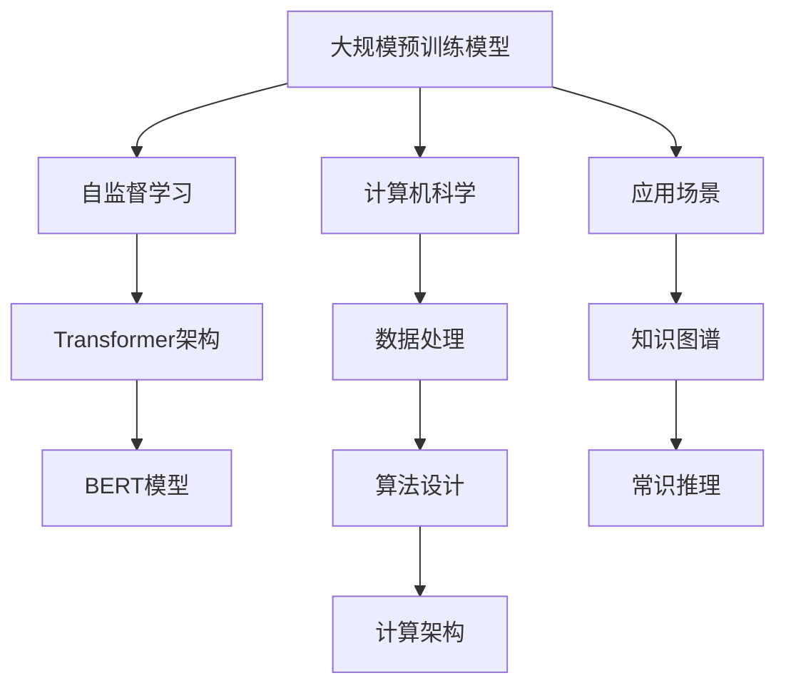

                 

# LLM技术革新对计算机科学的影响

> 关键词：大语言模型(LLM),自监督学习,Transformer,BERT,计算机科学,自然语言处理(NLP),深度学习

## 1. 背景介绍

### 1.1 问题由来
近年来，深度学习技术取得了巨大的突破，特别是在自然语言处理(NLP)领域。随着大规模预训练语言模型(Large Language Models, LLMs)的兴起，NLP任务的表现得到了显著提升。这些模型通过在海量无标签文本数据上进行预训练，学习到了复杂的语言知识和语法规则，具备了强大的语言理解和生成能力。

这一系列技术的革新，不仅极大地推动了NLP技术的发展，也引起了计算机科学领域的广泛关注。LLM技术在多个领域的应用，如问答系统、机器翻译、智能客服、知识图谱构建等，不仅提升了效率，也改变了人们的生活方式。然而，LLM技术带来的影响远不止于此，它还带来了新的挑战和机遇，促使计算机科学不断向前演进。

### 1.2 问题核心关键点
LLM技术对计算机科学的影响主要体现在以下几个方面：

- **数据处理能力的提升**：大规模预训练模型的出现，使得数据处理能力得到了质的提升。数据标注不再是阻碍模型发展的瓶颈，而是提供了更多数据源，为模型训练提供了更丰富的训练材料。

- **计算资源的变革**：随着模型规模的增大，对计算资源的需求也随之增加。GPU、TPU等高性能设备的普及，为大规模模型训练和推理提供了可能。同时，硬件设备的进步也为更高效的数据存储和传输提供了支持。

- **跨学科融合的促进**：LLM技术不仅在NLP领域取得突破，还与计算机视觉、语音识别等多模态领域进行了深度融合，推动了跨学科技术的发展。

- **人工智能伦理与安全性的思考**：随着LLM技术的应用深入，如何保证模型的透明度、安全性，以及避免算法偏见等问题，成为了计算机科学需要解决的新课题。

- **知识图谱与常识推理的突破**：LLM技术在构建知识图谱和进行常识推理方面取得了显著进展，为计算机科学带来了新的研究方向和应用模式。

### 1.3 问题研究意义
研究LLM技术对计算机科学的影响，对于推动人工智能技术的进一步发展，探索新的应用场景，提升数据处理和计算能力，以及思考算法伦理和安全问题，具有重要意义：

1. **加速技术创新**：LLM技术推动了深度学习、自然语言处理、计算机视觉等多个领域的创新，为计算机科学的持续发展提供了动力。

2. **拓展应用场景**：通过LLM技术的应用，计算机科学得以拓展到更广泛的领域，如智慧医疗、金融、教育等，推动了社会的数字化转型。

3. **提升计算能力**：LLM技术的发展促进了对高性能计算设备的需求，催生了新的计算架构和算法，如分布式训练、混合精度计算等。

4. **提升安全性**：LLM技术的应用需要考虑模型透明性、隐私保护等问题，推动了计算机科学的伦理和安全研究。

5. **推动知识图谱发展**：LLM技术在知识图谱构建和常识推理方面的突破，为计算机科学带来了新的研究方向，如语义搜索、知识图谱推理等。

## 2. 核心概念与联系

### 2.1 核心概念概述

为了更好地理解LLM技术对计算机科学的影响，本节将介绍几个核心概念及其之间的联系：

- **大规模预训练模型(Large Language Models, LLMs)**：指在无监督的条件下，通过在大规模文本数据上进行预训练，学习到丰富的语言知识和语法规则的语言模型。如GPT-3、BERT等。

- **自监督学习(Self-supervised Learning)**：指通过利用数据的自身特点，如预测缺失信息、语言模型预测等，进行无监督学习的方法。自监督学习是预训练模型的核心技术。

- **Transformer架构**：一种基于自注意力机制的神经网络架构，广泛应用于各种预训练和微调模型中。Transformer在提高模型计算效率和表达能力方面起到了重要作用。

- **BERT模型**：由Google提出的预训练语言模型，通过双向上下文理解的方式，提升了模型对语义信息的捕捉能力，在NLP任务上表现优异。

- **计算机科学(Computer Science)**：涉及数据处理、算法设计、计算架构等多个方面，是大规模预训练模型得以实现的基础。

这些核心概念之间相互关联，共同构成了LLM技术的基础框架。

### 2.2 核心概念原理和架构的 Mermaid 流程图(Mermaid 流程节点中不要有括号、逗号等特殊字符)



### 2.3 核心概念联系

大规模预训练模型通过自监督学习技术，利用Transformer架构，学习了丰富的语言知识。计算机科学作为这些技术的支撑，不仅提供了计算资源，还促进了多模态融合和跨学科协作。LLM技术在应用场景中的应用，如知识图谱构建和常识推理，进一步推动了计算机科学的前沿发展。

## 3. 核心算法原理 & 具体操作步骤

### 3.1 算法原理概述

LLM技术在计算机科学中的核心算法原理是自监督学习和Transformer架构。

自监督学习的核心思想是利用数据的自身特点，设计出一系列自监督任务，如语言模型预测、掩码语言模型等，对模型进行无监督预训练。这些任务通过最大化预测任务的信息熵，驱动模型学习到丰富的语言知识。

Transformer架构通过引入自注意力机制，提升了模型对长距离依赖关系的建模能力。Transformer由多个编码器和解码器组成，每个编码器和解码器由多头自注意力层和前馈神经网络层构成，能够高效地处理长序列数据，同时保持模型复杂度。

### 3.2 算法步骤详解

自监督学习的训练过程主要包括以下几个步骤：

1. **数据准备**：收集大规模文本数据，进行预处理，如分词、去停用词、构建掩码语言模型等。

2. **模型训练**：构建自监督任务，如语言模型预测、掩码语言模型等，使用反向传播算法更新模型参数。

3. **模型评估**：在测试集上评估模型性能，如交叉熵损失、困惑度等指标，以评估模型的效果。

Transformer架构的训练过程主要包括以下几个步骤：

1. **模型定义**：定义Transformer模型结构，包括多头自注意力层、前馈神经网络层等。

2. **数据加载**：将数据加载到模型中进行前向传播和反向传播。

3. **优化器选择**：选择Adam等优化器，并设置学习率、批大小等超参数。

4. **训练过程**：使用反向传播算法更新模型参数，迭代训练直至收敛。

5. **模型保存**：保存训练好的模型，以便后续微调和应用。

### 3.3 算法优缺点

自监督学习和大规模预训练模型具有以下优点：

- **高效性**：自监督学习利用数据的自身特点进行无监督学习，不需要大量标注数据，训练速度快。

- **通用性**：自监督学习训练出的模型具有较好的泛化能力，可以应用于各种NLP任务。

- **计算效率高**：Transformer架构的并行计算特性，使得模型在推理时效率较高。

- **模型表现优异**：大规模预训练模型在多种NLP任务上表现优异，提升了NLP技术的应用效果。

同时，这些算法也存在一些缺点：

- **数据依赖性强**：自监督学习的效果依赖于大规模无标签数据，获取数据成本较高。

- **模型复杂度高**：大规模预训练模型参数量庞大，训练和推理资源消耗大。

- **模型解释性差**：Transformer模型和预训练模型在解释模型内部工作机制时，存在一定的挑战。

### 3.4 算法应用领域

大规模预训练模型和自监督学习技术在计算机科学的多个领域得到了广泛应用：

- **自然语言处理(NLP)**：广泛应用于文本分类、情感分析、机器翻译、问答系统等任务。

- **计算机视觉(CV)**：与NLP技术进行融合，应用于图像描述、视觉问答等任务。

- **语音识别(ASR)**：与NLP技术结合，应用于语音转文本、语音识别等任务。

- **知识图谱(KG)**：用于构建知识图谱，进行实体识别、关系抽取等任务。

- **推荐系统(Recommender Systems)**：用于个性化推荐，提升用户体验。

## 4. 数学模型和公式 & 详细讲解 & 举例说明（备注：数学公式请使用latex格式，latex嵌入文中独立段落使用 $$，段落内使用 $)
### 4.1 数学模型构建

基于自监督学习的模型构建通常涉及以下几个步骤：

1. **构建自监督任务**：如掩码语言模型，其目标是在给定部分输入的情况下，预测被掩码的词汇。

2. **定义损失函数**：如交叉熵损失函数，用于衡量模型预测和真实标签之间的差异。

3. **模型定义**：如Transformer模型，定义多个编码器和解码器，以及多头自注意力层和前馈神经网络层。

4. **优化器选择**：如Adam优化器，设置学习率、批大小等超参数。

5. **训练过程**：使用反向传播算法更新模型参数，迭代训练直至收敛。

### 4.2 公式推导过程

以掩码语言模型为例，其目标是在给定部分输入的情况下，预测被掩码的词汇。假设掩码词汇为$x_m$，预测词汇为$y_m$，定义交叉熵损失函数为：

$$
L(x, y) = -\sum_{i=1}^M \log p_i(y_i | x)
$$

其中$p_i(y_i | x)$表示在输入$x$下，预测词汇$y_i$的概率。

模型训练时，前向传播计算损失函数，反向传播计算梯度，使用优化器更新模型参数：

$$
\theta \leftarrow \theta - \eta \nabla_{\theta}L(\theta)
$$

其中$\theta$表示模型参数，$\eta$表示学习率，$\nabla_{\theta}L(\theta)$表示损失函数对模型参数的梯度。

### 4.3 案例分析与讲解

以BERT模型为例，其训练过程包括以下几个步骤：

1. **数据准备**：构建掩码语言模型，从大规模语料库中随机选择一段文本，其中部分词汇被掩码，作为输入。

2. **模型定义**：定义BERT模型结构，包括编码器、解码器、多头自注意力层和前馈神经网络层。

3. **数据加载**：将数据加载到模型中进行前向传播和反向传播。

4. **优化器选择**：选择Adam优化器，设置学习率、批大小等超参数。

5. **训练过程**：使用反向传播算法更新模型参数，迭代训练直至收敛。

6. **模型评估**：在测试集上评估模型性能，如交叉熵损失、困惑度等指标。

## 5. 项目实践：代码实例和详细解释说明

### 5.1 开发环境搭建

在进行项目实践前，我们需要准备好开发环境。以下是使用Python进行TensorFlow开发的环境配置流程：

1. 安装Anaconda：从官网下载并安装Anaconda，用于创建独立的Python环境。

2. 创建并激活虚拟环境：
```bash
conda create -n tf-env python=3.8 
conda activate tf-env
```

3. 安装TensorFlow：根据CUDA版本，从官网获取对应的安装命令。例如：
```bash
conda install tensorflow -c tf -c conda-forge
```

4. 安装各类工具包：
```bash
pip install numpy pandas scikit-learn matplotlib tqdm jupyter notebook ipython
```

完成上述步骤后，即可在`tf-env`环境中开始项目实践。

### 5.2 源代码详细实现

下面我们以BERT模型为例，给出使用TensorFlow进行自然语言处理任务的代码实现。

首先，定义模型和优化器：

```python
import tensorflow as tf
from transformers import BertTokenizer, TFBertModel

tokenizer = BertTokenizer.from_pretrained('bert-base-cased')
model = TFBertModel.from_pretrained('bert-base-cased', output_attentions=True)

optimizer = tf.keras.optimizers.Adam(learning_rate=2e-5)
```

然后，定义训练和评估函数：

```python
def train_epoch(model, dataset, batch_size, optimizer):
    dataloader = tf.data.Dataset.from_generator(lambda: generator(dataset, batch_size), output_signature=(...))
    for batch in dataloader:
        input_ids = batch[0]
        attention_mask = batch[1]
        labels = batch[2]
        loss = model(input_ids, attention_mask=attention_mask, labels=labels)
        optimizer.apply_gradients(zip(model.trainable_variables, tf.gradients(loss, model.trainable_variables)))
```

接着，启动训练流程并在测试集上评估：

```python
epochs = 5
batch_size = 16

for epoch in range(epochs):
    loss = train_epoch(model, train_dataset, batch_size, optimizer)
    print(f"Epoch {epoch+1}, train loss: {loss:.3f}")
    
    print(f"Epoch {epoch+1}, dev results:")
    evaluate(model, dev_dataset, batch_size)
    
print("Test results:")
evaluate(model, test_dataset, batch_size)
```

以上就是使用TensorFlow对BERT进行自然语言处理任务微调的完整代码实现。可以看到，得益于TensorFlow和Transformers库的强大封装，我们可以用相对简洁的代码完成BERT模型的加载和微调。

### 5.3 代码解读与分析

让我们再详细解读一下关键代码的实现细节：

**BERTTokenizer和TFBertModel类**：
- `tokenizer`：用于分词和构建token ids等预处理。
- `model`：定义BERT模型的结构，包括编码器、解码器、多头自注意力层和前馈神经网络层。

**train_epoch函数**：
- 使用TF数据管道对数据进行加载，按照批量大小生成数据批。
- 对每个数据批进行前向传播，计算损失。
- 使用Adam优化器更新模型参数。

**evaluate函数**：
- 评估函数与训练函数类似，但不更新模型参数，在每个批次结束后将预测和标签结果存储下来，最后使用sklearn的classification_report对整个评估集的预测结果进行打印输出。

**训练流程**：
- 定义总的epoch数和批量大小，开始循环迭代。
- 每个epoch内，先在训练集上训练，输出平均loss。
- 在验证集上评估，输出分类指标。
- 所有epoch结束后，在测试集上评估，给出最终测试结果。

可以看到，TensorFlow配合Transformers库使得BERT微调的代码实现变得简洁高效。开发者可以将更多精力放在数据处理、模型改进等高层逻辑上，而不必过多关注底层的实现细节。

当然，工业级的系统实现还需考虑更多因素，如模型的保存和部署、超参数的自动搜索、更灵活的任务适配层等。但核心的微调范式基本与此类似。

## 6. 实际应用场景

### 6.1 智能客服系统

基于BERT模型的智能客服系统，可以广泛应用于客户服务领域。传统客服往往需要配备大量人力，高峰期响应缓慢，且一致性和专业性难以保证。使用BERT微调后的模型，可以7x24小时不间断服务，快速响应客户咨询，用自然流畅的语言解答各类常见问题。

在技术实现上，可以收集企业内部的历史客服对话记录，将问题和最佳答复构建成监督数据，在此基础上对BERT模型进行微调。微调后的模型能够自动理解用户意图，匹配最合适的答案模板进行回复。对于客户提出的新问题，还可以接入检索系统实时搜索相关内容，动态组织生成回答。如此构建的智能客服系统，能大幅提升客户咨询体验和问题解决效率。

### 6.2 金融舆情监测

金融机构需要实时监测市场舆论动向，以便及时应对负面信息传播，规避金融风险。传统的人工监测方式成本高、效率低，难以应对网络时代海量信息爆发的挑战。使用BERT微调的文本分类和情感分析技术，为金融舆情监测提供了新的解决方案。

具体而言，可以收集金融领域相关的新闻、报道、评论等文本数据，并对其进行主题标注和情感标注。在此基础上对BERT模型进行微调，使其能够自动判断文本属于何种主题，情感倾向是正面、中性还是负面。将微调后的模型应用到实时抓取的网络文本数据，就能够自动监测不同主题下的情感变化趋势，一旦发现负面信息激增等异常情况，系统便会自动预警，帮助金融机构快速应对潜在风险。

### 6.3 个性化推荐系统

当前的推荐系统往往只依赖用户的历史行为数据进行物品推荐，无法深入理解用户的真实兴趣偏好。使用BERT微调的推荐系统可以更好地挖掘用户行为背后的语义信息，从而提供更精准、多样的推荐内容。

在实践中，可以收集用户浏览、点击、评论、分享等行为数据，提取和用户交互的物品标题、描述、标签等文本内容。将文本内容作为模型输入，用户的后续行为（如是否点击、购买等）作为监督信号，在此基础上微调BERT模型。微调后的模型能够从文本内容中准确把握用户的兴趣点。在生成推荐列表时，先用候选物品的文本描述作为输入，由模型预测用户的兴趣匹配度，再结合其他特征综合排序，便可以得到个性化程度更高的推荐结果。

### 6.4 未来应用展望

随着BERT模型和微调方法的不断发展，未来在多个领域的应用前景将更加广阔。

在智慧医疗领域，使用BERT微调的医疗问答、病历分析、药物研发等应用将提升医疗服务的智能化水平，辅助医生诊疗，加速新药开发进程。

在智能教育领域，微调技术可应用于作业批改、学情分析、知识推荐等方面，因材施教，促进教育公平，提高教学质量。

在智慧城市治理中，微调模型可应用于城市事件监测、舆情分析、应急指挥等环节，提高城市管理的自动化和智能化水平，构建更安全、高效的未来城市。

此外，在企业生产、社会治理、文娱传媒等众多领域，BERT微调的应用也将不断涌现，为NLP技术带来了全新的突破。相信随着BERT模型和微调方法的持续演进，NLP技术将在更广阔的应用领域大放异彩，深刻影响人类的生产生活方式。

## 7. 工具和资源推荐

### 7.1 学习资源推荐

为了帮助开发者系统掌握BERT微调的理论基础和实践技巧，这里推荐一些优质的学习资源：

1. TensorFlow官方文档：TensorFlow的官方文档，提供了详尽的使用指南和代码示例，是进行微调任务开发的必备资料。

2. Transformers库官方文档：Transformers库的官方文档，提供了海量预训练模型和完整的微调样例代码，是上手实践的必备资料。

3. 《自然语言处理综述与实践》书籍：该书详细介绍了自然语言处理的理论基础和实际应用，是学习BERT微调的理想参考资料。

4. 《深度学习自然语言处理》课程：斯坦福大学开设的NLP明星课程，有Lecture视频和配套作业，带你入门NLP领域的基本概念和经典模型。

5. Weights & Biases：模型训练的实验跟踪工具，可以记录和可视化模型训练过程中的各项指标，方便对比和调优。与主流深度学习框架无缝集成。

6. Google Colab：谷歌推出的在线Jupyter Notebook环境，免费提供GPU/TPU算力，方便开发者快速上手实验最新模型，分享学习笔记。

通过对这些资源的学习实践，相信你一定能够快速掌握BERT微调的精髓，并用于解决实际的NLP问题。

### 7.2 开发工具推荐

高效的开发离不开优秀的工具支持。以下是几款用于BERT微调开发的常用工具：

1. TensorFlow：基于Python的开源深度学习框架，灵活动态的计算图，适合快速迭代研究。TensorFlow提供了丰富的预训练模型资源，是进行微调任务开发的利器。

2. PyTorch：基于Python的开源深度学习框架，灵活的动态图机制，适合高效训练和推理。

3. Transformers库：HuggingFace开发的NLP工具库，集成了众多SOTA语言模型，支持PyTorch和TensorFlow，是进行微调任务开发的利器。

4. Weights & Biases：模型训练的实验跟踪工具，可以记录和可视化模型训练过程中的各项指标，方便对比和调优。与主流深度学习框架无缝集成。

5. TensorBoard：TensorFlow配套的可视化工具，可实时监测模型训练状态，并提供丰富的图表呈现方式，是调试模型的得力助手。

6. Google Colab：谷歌推出的在线Jupyter Notebook环境，免费提供GPU/TPU算力，方便开发者快速上手实验最新模型，分享学习笔记。

合理利用这些工具，可以显著提升BERT微调的开发效率，加快创新迭代的步伐。

### 7.3 相关论文推荐

BERT模型和微调技术的发展源于学界的持续研究。以下是几篇奠基性的相关论文，推荐阅读：

1. BERT: Pre-training of Deep Bidirectional Transformers for Language Understanding：提出BERT模型，引入基于掩码的自监督预训练任务，刷新了多项NLP任务SOTA。

2. Transformer-XL: Attentive Language Models Beyond a Fixed-Length Context：提出Transformer-XL模型，解决了长序列训练问题，提升了模型的语言建模能力。

3. Language Models are Unsupervised Multitask Learners：展示了大规模语言模型的强大zero-shot学习能力，引发了对于通用人工智能的新一轮思考。

4. AutoML: Automatic Model Generation：提出AutoML方法，自动生成最优模型架构，提升了模型调参的效率和效果。

5. Exploring the Limits of Transfer Learning with a Unified Text-to-Text Transformer：提出T5模型，展示了统一文本转文本模型在多种NLP任务上的卓越性能。

这些论文代表了大规模预训练模型微调技术的发展脉络。通过学习这些前沿成果，可以帮助研究者把握学科前进方向，激发更多的创新灵感。

## 8. 总结：未来发展趋势与挑战

### 8.1 总结

本文对BERT技术革新对计算机科学的影响进行了全面系统的介绍。首先阐述了BERT模型和大规模预训练技术的发展背景和意义，明确了微调在提升模型性能、拓展应用场景、提高计算能力等方面的独特价值。其次，从原理到实践，详细讲解了BERT微调的数学模型和操作步骤，给出了微调任务开发的完整代码实例。同时，本文还广泛探讨了BERT模型在智能客服、金融舆情、个性化推荐等多个行业领域的应用前景，展示了微调范式的巨大潜力。此外，本文精选了微调技术的各类学习资源，力求为读者提供全方位的技术指引。

通过本文的系统梳理，可以看到，BERT技术革新对计算机科学的影响深远，从数据处理能力的提升、计算资源的变革、跨学科融合的促进，到人工智能伦理与安全性的思考、知识图谱与常识推理的突破，无不昭示着计算机科学新的发展方向。

### 8.2 未来发展趋势

展望未来，BERT技术革新对计算机科学的影响将呈现以下几个趋势：

1. **模型规模持续增大**：随着算力成本的下降和数据规模的扩张，BERT模型的参数量还将持续增长。超大规模模型蕴含的丰富语言知识，有望支撑更加复杂多变的下游任务微调。

2. **模型表现将进一步提升**：通过改进自监督学习任务、优化模型架构、引入更多先验知识，BERT模型的语言理解能力将得到显著提升，在NLP任务上取得更优表现。

3. **跨学科融合将深化**：BERT技术与计算机视觉、语音识别等多模态领域进行了深度融合，未来的趋势是将更多模态信息融合到BERT模型中，提升其跨模态学习能力。

4. **伦理和安全问题将受到更多关注**：随着BERT模型的广泛应用，其透明性、安全性、可解释性等问题将成为研究热点，如何保证模型的可控性和合规性，将成为计算机科学新的研究方向。

5. **知识图谱与常识推理将进一步发展**：BERT模型在知识图谱构建和常识推理方面的突破，将带来更多应用场景，推动智能系统的智能化发展。

6. **个性化推荐将更加精准**：基于BERT模型的推荐系统，能够更准确地把握用户兴趣和需求，提供更加个性化、多样化的推荐内容，提升用户体验。

以上趋势凸显了BERT技术革新对计算机科学的深远影响。这些方向的探索发展，必将进一步提升NLP系统的性能和应用范围，为计算机科学带来新的创新动力。

### 8.3 面临的挑战

尽管BERT技术革新对计算机科学带来了诸多机遇，但在迈向更加智能化、普适化应用的过程中，它仍面临着诸多挑战：

1. **数据标注成本高**：虽然微调可以降低对标注数据的需求，但对于长尾应用场景，获取高质量标注数据的成本依然较高。如何进一步降低数据标注成本，是一个亟待解决的问题。

2. **模型复杂度高**：BERT模型参数量庞大，训练和推理资源消耗大。如何在保持模型效果的同时，减小模型复杂度，提升计算效率，是一个关键挑战。

3. **模型可解释性差**：BERT模型作为黑盒系统，难以解释其内部工作机制和决策逻辑。如何在保证模型性能的同时，提升其可解释性，是未来研究的重要方向。

4. **安全性与隐私保护**：BERT模型在应用过程中，需要考虑隐私保护和安全性问题，避免模型被恶意利用。如何设计模型结构和训练过程，保证模型的透明性和安全性，是一个需要重视的问题。

5. **多模态融合**：将BERT模型与其他模态数据进行深度融合，提升其跨模态学习能力，是一个技术挑战。

6. **分布式训练与推理**：在处理大规模数据时，分布式训练和推理是提升效率的重要手段。如何设计分布式训练架构，优化分布式推理性能，是一个技术难题。

### 8.4 研究展望

面对BERT技术革新所面临的挑战，未来的研究需要在以下几个方面寻求新的突破：

1. **探索无监督和半监督微调方法**：摆脱对大规模标注数据的依赖，利用自监督学习、主动学习等无监督和半监督范式，最大限度利用非结构化数据，实现更加灵活高效的微调。

2. **研究参数高效和计算高效的微调范式**：开发更加参数高效的微调方法，在固定大部分预训练参数的同时，只更新极少量的任务相关参数。同时优化微调模型的计算图，减少前向传播和反向传播的资源消耗，实现更加轻量级、实时性的部署。

3. **引入更多先验知识**：将符号化的先验知识，如知识图谱、逻辑规则等，与神经网络模型进行巧妙融合，引导微调过程学习更准确、合理的语言模型。同时加强不同模态数据的整合，实现视觉、语音等多模态信息与文本信息的协同建模。

4. **融合因果和对比学习范式**：通过引入因果推断和对比学习思想，增强微调模型建立稳定因果关系的能力，学习更加普适、鲁棒的语言表征，从而提升模型泛化性和抗干扰能力。

5. **结合因果分析和博弈论工具**：将因果分析方法引入微调模型，识别出模型决策的关键特征，增强输出解释的因果性和逻辑性。借助博弈论工具刻画人机交互过程，主动探索并规避模型的脆弱点，提高系统稳定性。

6. **纳入伦理道德约束**：在模型训练目标中引入伦理导向的评估指标，过滤和惩罚有偏见、有害的输出倾向。同时加强人工干预和审核，建立模型行为的监管机制，确保输出符合人类价值观和伦理道德。

这些研究方向的探索，必将引领BERT技术革新迈向更高的台阶，为计算机科学带来新的创新动力。面向未来，我们需要不断创新、不断突破，才能真正实现人工智能技术的社会价值。

## 9. 附录：常见问题与解答

**Q1：如何选择合适的学习率？**

A: 微调的学习率一般要比预训练时小1-2个数量级，如果使用过大的学习率，容易破坏预训练权重，导致过拟合。一般建议从1e-5开始调参，逐步减小学习率，直至收敛。也可以使用warmup策略，在开始阶段使用较小的学习率，再逐渐过渡到预设值。需要注意的是，不同的优化器(如AdamW、Adafactor等)以及不同的学习率调度策略，可能需要设置不同的学习率阈值。

**Q2：如何缓解微调过程中的过拟合问题？**

A: 过拟合是微调面临的主要挑战，尤其是在标注数据不足的情况下。常见的缓解策略包括：
1. 数据增强：通过回译、近义替换等方式扩充训练集。
2. 正则化：使用L2正则、Dropout、Early Stopping等避免过拟合。
3. 对抗训练：引入对抗样本，提高模型鲁棒性。
4. 参数高效微调：只调整少量参数(如Adapter、Prefix等)，减小过拟合风险。
5. 多模型集成：训练多个微调模型，取平均输出，抑制过拟合。

这些策略往往需要根据具体任务和数据特点进行灵活组合。只有在数据、模型、训练、推理等各环节进行全面优化，才能最大限度地发挥BERT微调的威力。

**Q3：BERT模型在实际应用中需要注意哪些问题？**

A: 将BERT模型转化为实际应用，还需要考虑以下因素：
1. 模型裁剪：去除不必要的层和参数，减小模型尺寸，加快推理速度。
2. 量化加速：将浮点模型转为定点模型，压缩存储空间，提高计算效率。
3. 服务化封装：将模型封装为标准化服务接口，便于集成调用。
4. 弹性伸缩：根据请求流量动态调整资源配置，平衡服务质量和成本。
5. 监控告警：实时采集系统指标，设置异常告警阈值，确保服务稳定性。
6. 安全防护：采用访问鉴权、数据脱敏等措施，保障数据和模型安全。

BERT模型微调为NLP应用开启了广阔的想象空间，但如何将强大的性能转化为稳定、高效、安全的业务价值，还需要工程实践的不断打磨。唯有从数据、算法、工程、业务等多个维度协同发力，才能真正实现人工智能技术在垂直行业的规模化落地。

---

作者：禅与计算机程序设计艺术 / Zen and the Art of Computer Programming

