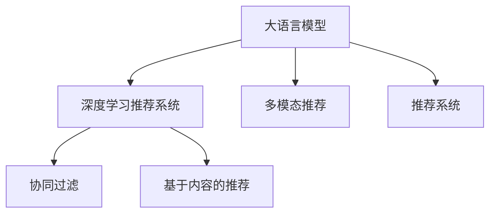

                 

# LLM推荐系统相关研究综述

> 关键词：大语言模型,推荐系统,深度学习,自然语言处理,强化学习,协同过滤,序列模型,多模态推荐

## 1. 背景介绍

### 1.1 问题由来
推荐系统(Recommender System)是现代社会数字化、个性化信息爆炸时代的产物，广泛应用于电商、社交网络、流媒体、内容分发等领域。传统推荐系统主要以用户行为为依据，利用协同过滤、基于内容的推荐、矩阵分解等技术，为每个用户提供个性化推荐。随着人工智能技术的发展，推荐系统也开始引入机器学习算法，进一步提升推荐效果。

近年来，基于深度学习的推荐系统逐渐成为主流。通过构建神经网络模型，学习用户和物品的隐含语义表示，预测用户对物品的偏好，为每个用户生成动态的推荐结果。深度学习推荐系统显著提升了推荐精度和多样性，在商业化应用中取得了巨大成功。

然而，随着用户需求的进一步细分和个性化需求的增长，仅依赖用户行为数据进行推荐的方法已无法满足高要求。越来越多的研究开始关注如何利用用户的文本描述、情感状态等语言信息，构建更加智能、全面的推荐模型。大语言模型(Large Language Model, LLM)的出现，为基于文本信息的推荐系统提供了新的可能。

### 1.2 问题核心关键点
大语言模型是一种通过自监督学习在巨量无标签数据上预训练得到的高级语言表示模型，具备强大的语言理解和生成能力。近年来，GPT、BERT、XLNet等大语言模型已经在多个NLP任务上取得了优异表现，成为自然语言处理领域的明星模型。

推荐系统可以视为一种特殊的NLP任务，通过将用户的语言描述和物品的文本描述作为输入，利用大语言模型提取语义信息，预测用户对物品的偏好，生成个性化推荐。基于大语言模型的推荐系统兼具深度学习推荐系统与传统文本推荐系统的优势，能够充分利用用户语言信息，提升推荐效果。

### 1.3 问题研究意义
研究大语言模型在推荐系统中的应用，对于提升推荐系统性能、拓展推荐系统应用边界具有重要意义：

1. 提升推荐系统精度：通过大语言模型的语言理解能力，推荐系统可以更准确地预测用户对物品的偏好，提升推荐精度和召回率。
2. 拓展推荐系统应用场景：大语言模型可以处理更多的非结构化数据，支持文本、音频、视频等多模态推荐，覆盖更广泛的推荐应用领域。
3. 优化推荐系统用户界面：大语言模型可以自动生成自然流畅的推荐理由和描述，提升用户体验。
4. 促进推荐系统商业化：利用大语言模型进行个性化推荐，可以显著提升用户粘性，降低流失率，带来更高的商业价值。

## 2. 核心概念与联系

### 2.1 核心概念概述

为更好地理解基于大语言模型的推荐系统，本节将介绍几个密切相关的核心概念：

- 大语言模型(Large Language Model, LLM)：以自回归(如GPT)或自编码(如BERT)模型为代表的大规模预训练语言模型。通过在大规模无标签文本语料上进行预训练，学习通用的语言知识，具备强大的语言理解和生成能力。

- 深度学习推荐系统(Deep Learning-Based Recommender System)：利用深度神经网络模型，学习用户和物品的隐含语义表示，预测用户对物品的偏好，生成推荐结果的推荐系统。

- 协同过滤(Collaborative Filtering)：通过分析用户历史行为数据，构建用户-物品交互矩阵，计算相似度，为每个用户生成推荐结果的推荐系统。

- 基于内容的推荐(Content-Based Recommender)：通过分析物品属性特征，利用特征匹配的方式，生成推荐结果的推荐系统。

- 多模态推荐(Multimodal Recommender)：结合图像、音频、文本等多模态数据，构建更加全面、准确的用户-物品表示，生成推荐结果的推荐系统。

这些核心概念之间的逻辑关系可以通过以下Mermaid流程图来展示：



这个流程图展示了不同推荐系统方法间的逻辑关系：

1. 大语言模型作为推荐系统的基础，提供了强大的语言理解和生成能力。
2. 深度学习推荐系统利用神经网络模型，学习用户和物品的语义表示。
3. 协同过滤和基于内容的推荐系统，侧重于用户行为和物品属性，通过构建交互矩阵或特征向量进行推荐。
4. 多模态推荐系统，综合利用文本、图像、音频等多模态数据，提供更全面的推荐。
5. 推荐系统是大语言模型与其它推荐技术的桥梁，将大语言模型的语言表示与推荐模型结合，生成个性化推荐。

## 3. 核心算法原理 & 具体操作步骤
### 3.1 算法原理概述

基于大语言模型的推荐系统，本质上是一种融合了语言理解和推荐算法的新型推荐方法。其核心思想是：将大语言模型视作一种强大的"特征提取器"，通过用户和物品的语言描述提取隐含语义，结合推荐算法预测用户对物品的偏好，生成推荐结果。

形式化地，假设用户描述为 $x$，物品描述为 $y$，推荐模型为 $M_{\theta}$，其中 $\theta$ 为模型参数。推荐任务的目标是最大化用户对物品的评分：

$$
\max_{\theta} \sum_{(x,y) \in X \times Y} \left( \text{Score}(x,y;M_{\theta}) \times r(x,y) \right)
$$

其中 $\text{Score}(x,y;M_{\theta})$ 为模型预测的用户-物品评分，$r(x,y)$ 为真实评分，$X$ 和 $Y$ 为用户和物品的数据集合。

具体而言，基于大语言模型的推荐系统分为以下几个关键步骤：

1. 收集用户和物品的语言描述，使用大语言模型提取语义表示。
2. 将用户和物品的语义表示作为输入，训练推荐模型进行评分预测。
3. 将预测评分与真实评分进行对比，通过优化算法更新模型参数。
4. 重复步骤2-3，直至收敛，得到最佳推荐模型。

### 3.2 算法步骤详解

基于大语言模型的推荐系统通常分为两个关键部分：语义表示提取和推荐模型训练。

#### 3.2.1 语义表示提取

语义表示提取是利用大语言模型对用户和物品的语言描述进行编码，获得其隐含语义表示。以下以使用BERT模型为例，介绍语义表示提取的具体实现。

1. 收集用户和物品的文本描述，构建训练集。
2. 使用BERT模型对文本进行编码，获得用户和物品的语义表示。

具体地，假设用户描述为 $x$，物品描述为 $y$，训练集为 $D=\{(x_i, y_i)\}_{i=1}^N$，则BERT模型的编码过程如下：

$$
\mathcal{E}(x_i) = \text{BERT}_{\theta}(x_i), \quad \mathcal{E}(y_i) = \text{BERT}_{\theta}(y_i)
$$

其中 $\text{BERT}_{\theta}$ 为BERT模型的参数，$\mathcal{E}(x_i)$ 和 $\mathcal{E}(y_i)$ 分别为用户和物品的隐含语义表示。

#### 3.2.2 推荐模型训练

推荐模型训练是利用用户和物品的语义表示，训练一个推荐模型进行评分预测。以下以使用线性回归模型为例，介绍推荐模型训练的具体实现。

1. 收集训练集，将用户和物品的语义表示作为输入，设定评分作为标签，构建训练数据。
2. 使用线性回归模型训练推荐模型，最小化预测评分与真实评分之间的误差。

具体地，假设训练集为 $D=\{(x_i, y_i)\}_{i=1}^N$，推荐模型为 $M_{\theta}$，则训练过程如下：

$$
\min_{\theta} \frac{1}{N} \sum_{i=1}^N (\text{Score}(x_i, y_i;M_{\theta}) - r_i)^2
$$

其中 $\text{Score}(x_i, y_i;M_{\theta})$ 为模型预测的用户-物品评分，$r_i$ 为真实评分。

### 3.3 算法优缺点

基于大语言模型的推荐系统具有以下优点：

1. 灵活性高：大语言模型可以处理多种类型的文本数据，涵盖长文本、短文本、图像标题、视频字幕等多种形式。
2. 覆盖面广：可以覆盖包括电影、商品、图书、新闻等在内的各类应用场景，具备较强的普适性。
3. 精确度高：通过大语言模型的语言理解能力，可以更准确地把握用户需求和物品属性，提升推荐精度。
4. 可解释性强：利用大语言模型提取语义表示，可以提供更自然、全面的推荐理由和描述，增强用户体验。

同时，该方法也存在一定的局限性：

1. 数据成本高：大语言模型通常需要大量的高质量数据进行预训练，预训练和微调的过程耗费时间。
2. 泛化能力有限：当用户和物品的语言描述差异较大时，大语言模型的泛化性能可能受到影响。
3. 计算资源需求大：大语言模型和推荐模型本身计算量较大，需要较高的计算资源。
4. 隐私问题：大语言模型需要收集用户的语言描述信息，可能存在隐私泄露的风险。

尽管存在这些局限性，但就目前而言，基于大语言模型的推荐方法仍具有较大的应用潜力，能够在大数据、多模态等场景中发挥重要作用。未来相关研究的重点在于如何进一步降低数据成本，提升模型泛化性能，同时兼顾可解释性和隐私保护等因素。

### 3.4 算法应用领域

基于大语言模型的推荐系统，已经在电商、社交网络、流媒体、内容分发等多个领域得到了应用，覆盖了各种推荐任务，例如：

- 电影推荐：利用用户的电影评论和电影描述，推荐用户可能感兴趣的电影。
- 商品推荐：结合用户浏览历史和商品描述，推荐用户可能购买的商品。
- 音乐推荐：利用用户听歌历史和歌曲的歌词，推荐用户可能喜欢的歌曲。
- 新闻推荐：根据用户阅读历史和新闻标题，推荐相关的新闻文章。
- 视频推荐：结合用户观看历史和视频描述，推荐用户感兴趣的视频内容。

除了上述这些经典任务外，大语言模型在多模态推荐、跨领域推荐、多层次推荐等前沿方向上，也有广泛的应用前景。

## 4. 数学模型和公式 & 详细讲解 & 举例说明

### 4.1 数学模型构建

本节将使用数学语言对基于大语言模型的推荐系统进行更加严格的刻画。

记用户描述为 $x$，物品描述为 $y$，用户对物品的评分矩阵为 $R_{ij}$，其中 $R_{ij}=1$ 表示用户 $i$ 对物品 $j$ 的评分。假设训练集为 $D=\{(x_i, y_i, r_i)\}_{i=1}^N$，其中 $x_i$ 为第 $i$ 个用户的描述，$y_i$ 为第 $i$ 个物品的描述，$r_i$ 为用户 $i$ 对物品 $y_i$ 的真实评分。

定义用户和物品的语义表示分别为 $u_i=\mathcal{E}(x_i)$ 和 $v_j=\mathcal{E}(y_j)$，其中 $\mathcal{E}(x)$ 为对用户描述 $x$ 进行编码的函数。

假设推荐模型为 $M_{\theta}$，其中 $\theta$ 为模型参数。推荐模型的评分预测函数为：

$$
\text{Score}(x_i, y_j; M_{\theta}) = u_i^\top M_{\theta} v_j
$$

其中 $u_i^\top M_{\theta} v_j$ 为线性回归模型的预测评分。

### 4.2 公式推导过程

以下我们以简单的线性回归模型为例，推导推荐模型的评分预测公式及其梯度计算。

设 $\theta$ 为线性回归模型的权重向量，则评分预测函数为：

$$
\text{Score}(x_i, y_j; \theta) = u_i^\top \theta v_j
$$

对于训练集 $D=\{(x_i, y_i, r_i)\}_{i=1}^N$，定义损失函数为均方误差：

$$
\mathcal{L}(\theta) = \frac{1}{N} \sum_{i=1}^N (\text{Score}(x_i, y_i; \theta) - r_i)^2
$$

根据梯度下降算法，参数更新公式为：

$$
\theta \leftarrow \theta - \eta \nabla_{\theta} \mathcal{L}(\theta)
$$

其中 $\eta$ 为学习率，$\nabla_{\theta} \mathcal{L}(\theta)$ 为损失函数对参数 $\theta$ 的梯度。利用链式法则，可进一步展开得到：

$$
\nabla_{\theta} \mathcal{L}(\theta) = -\frac{2}{N} \sum_{i=1}^N (\text{Score}(x_i, y_i; \theta) - r_i) \cdot v_i \cdot u_j
$$

其中 $v_i$ 和 $u_j$ 分别为用户和物品的语义表示。

### 4.3 案例分析与讲解

以电影推荐为例，介绍基于BERT模型的推荐系统实现。

1. 收集电影评论和电影描述，构建训练集 $D=\{(x_i, y_i, r_i)\}_{i=1}^N$，其中 $x_i$ 为电影评论，$y_i$ 为电影描述，$r_i$ 为用户对电影的评分。
2. 使用BERT模型对评论和描述进行编码，得到用户和电影的语义表示 $u_i=\mathcal{E}(x_i)$ 和 $v_j=\mathcal{E}(y_j)$。
3. 将语义表示输入到线性回归模型，进行评分预测，最小化均方误差。

具体地，假设线性回归模型的参数向量为 $\theta$，则评分预测公式为：

$$
\text{Score}(x_i, y_j; \theta) = u_i^\top \theta v_j
$$

根据均方误差损失函数，损失函数为：

$$
\mathcal{L}(\theta) = \frac{1}{N} \sum_{i=1}^N (\text{Score}(x_i, y_i; \theta) - r_i)^2
$$

梯度更新公式为：

$$
\theta \leftarrow \theta - \eta \nabla_{\theta} \mathcal{L}(\theta)
$$

其中 $\eta$ 为学习率。

## 5. 项目实践：代码实例和详细解释说明
### 5.1 开发环境搭建

在进行推荐系统开发前，我们需要准备好开发环境。以下是使用Python进行TensorFlow和PyTorch开发的环境配置流程：

1. 安装Anaconda：从官网下载并安装Anaconda，用于创建独立的Python环境。

2. 创建并激活虚拟环境：
```bash
conda create -n pytorch-env python=3.8 
conda activate pytorch-env
```

3. 安装TensorFlow：根据CUDA版本，从官网获取对应的安装命令。例如：
```bash
conda install tensorflow==2.8.0
```

4. 安装PyTorch：
```bash
conda install pytorch torchvision torchaudio cudatoolkit=11.1 -c pytorch -c conda-forge
```

5. 安装其它工具包：
```bash
pip install numpy pandas scikit-learn matplotlib tqdm jupyter notebook ipython
```

完成上述步骤后，即可在`pytorch-env`环境中开始推荐系统开发。

### 5.2 源代码详细实现

下面以使用BERT和线性回归模型进行电影推荐为例，给出推荐系统的PyTorch代码实现。

首先，定义电影推荐任务的数据处理函数：

```python
from transformers import BertTokenizer
from torch.utils.data import Dataset
import torch

class MovieDataset(Dataset):
    def __init__(self, reviews, descriptions, ratings, tokenizer, max_len=128):
        self.reviews = reviews
        self.descriptions = descriptions
        self.ratings = ratings
        self.tokenizer = tokenizer
        self.max_len = max_len
        
    def __len__(self):
        return len(self.reviews)
    
    def __getitem__(self, item):
        review = self.reviews[item]
        description = self.descriptions[item]
        rating = self.ratings[item]
        
        encoding = self.tokenizer(review, return_tensors='pt', max_length=self.max_len, padding='max_length', truncation=True)
        description_encoding = self.tokenizer(description, return_tensors='pt', max_length=self.max_len, padding='max_length', truncation=True)
        
        # 对token-wise的标签进行编码
        encoded_tags = [rating] * self.max_len
        labels = torch.tensor(encoded_tags, dtype=torch.long)
        
        return {'input_ids': encoding['input_ids'][0],
                'attention_mask': encoding['attention_mask'][0],
                'labels': labels,
                'description_input_ids': description_encoding['input_ids'][0],
                'description_attention_mask': description_encoding['attention_mask'][0]}
```

然后，定义模型和优化器：

```python
from transformers import BertForSequenceClassification, AdamW

model = BertForSequenceClassification.from_pretrained('bert-base-cased', num_labels=2)

optimizer = AdamW(model.parameters(), lr=2e-5)
```

接着，定义训练和评估函数：

```python
from torch.utils.data import DataLoader
from tqdm import tqdm

device = torch.device('cuda') if torch.cuda.is_available() else torch.device('cpu')
model.to(device)

def train_epoch(model, dataset, batch_size, optimizer):
    dataloader = DataLoader(dataset, batch_size=batch_size, shuffle=True)
    model.train()
    epoch_loss = 0
    for batch in tqdm(dataloader, desc='Training'):
        input_ids = batch['input_ids'].to(device)
        attention_mask = batch['attention_mask'].to(device)
        labels = batch['labels'].to(device)
        description_input_ids = batch['description_input_ids'].to(device)
        description_attention_mask = batch['description_attention_mask'].to(device)
        model.zero_grad()
        outputs = model(input_ids, attention_mask=attention_mask, labels=labels, description_input_ids=description_input_ids, description_attention_mask=description_attention_mask)
        loss = outputs.loss
        epoch_loss += loss.item()
        loss.backward()
        optimizer.step()
    return epoch_loss / len(dataloader)

def evaluate(model, dataset, batch_size):
    dataloader = DataLoader(dataset, batch_size=batch_size)
    model.eval()
    preds, labels = [], []
    with torch.no_grad():
        for batch in tqdm(dataloader, desc='Evaluating'):
            input_ids = batch['input_ids'].to(device)
            attention_mask = batch['attention_mask'].to(device)
            labels = batch['labels'].to(device)
            description_input_ids = batch['description_input_ids'].to(device)
            description_attention_mask = batch['description_attention_mask'].to(device)
            batch_preds = model(input_ids, attention_mask=attention_mask, labels=labels, description_input_ids=description_input_ids, description_attention_mask=description_attention_mask)
            batch_labels = batch['labels'].to('cpu').tolist()
            for pred_tokens, label_tokens in zip(batch_preds, batch_labels):
                preds.append(pred_tokens[:len(label_tokens)])
                labels.append(label_tokens)
                
    print(classification_report(labels, preds))
```

最后，启动训练流程并在测试集上评估：

```python
epochs = 5
batch_size = 16

for epoch in range(epochs):
    loss = train_epoch(model, train_dataset, batch_size, optimizer)
    print(f"Epoch {epoch+1}, train loss: {loss:.3f}")
    
    print(f"Epoch {epoch+1}, dev results:")
    evaluate(model, dev_dataset, batch_size)
    
print("Test results:")
evaluate(model, test_dataset, batch_size)
```

以上就是使用PyTorch对BERT进行电影推荐任务推荐系统的完整代码实现。可以看到，借助Transformers库，我们可以用相对简洁的代码完成BERT模型的加载和推荐系统训练。

### 5.3 代码解读与分析

让我们再详细解读一下关键代码的实现细节：

**MovieDataset类**：
- `__init__`方法：初始化评论、描述、评分等关键组件。
- `__len__`方法：返回数据集的样本数量。
- `__getitem__`方法：对单个样本进行处理，将评论和描述输入编码为token ids，将评分进行编码，并对其进行定长padding，最终返回模型所需的输入。

**电影推荐模型**：
- `BertForSequenceClassification`：从预训练的BERT模型加载，用于电影评分预测。
- `AdamW`：优化器，设置学习率为2e-5。

**训练和评估函数**：
- 使用PyTorch的DataLoader对数据集进行批次化加载，供模型训练和推理使用。
- 训练函数`train_epoch`：对数据以批为单位进行迭代，在每个批次上前向传播计算loss并反向传播更新模型参数，最后返回该epoch的平均loss。
- 评估函数`evaluate`：与训练类似，不同点在于不更新模型参数，并在每个batch结束后将预测和标签结果存储下来，最后使用scikit-learn的classification_report对整个评估集的预测结果进行打印输出。

**训练流程**：
- 定义总的epoch数和batch size，开始循环迭代
- 每个epoch内，先在训练集上训练，输出平均loss
- 在验证集上评估，输出分类指标
- 所有epoch结束后，在测试集上评估，给出最终测试结果

可以看到，PyTorch配合Transformers库使得BERT推荐系统的代码实现变得简洁高效。开发者可以将更多精力放在数据处理、模型改进等高层逻辑上，而不必过多关注底层的实现细节。

当然，工业级的系统实现还需考虑更多因素，如模型的保存和部署、超参数的自动搜索、更灵活的任务适配层等。但核心的推荐范式基本与此类似。

## 6. 实际应用场景
### 6.1 智能推荐系统

基于大语言模型的推荐系统，在电商、社交网络、流媒体等多个场景中得到广泛应用，帮助用户发现更多有趣、有用的内容，提高用户粘性和满意度。

例如，某电商平台可以收集用户浏览历史、商品描述和评分，利用BERT模型提取用户和商品的语义表示，构建推荐模型进行评分预测。模型通过综合用户历史行为和商品属性，为每个用户生成个性化的商品推荐列表。

### 6.2 视频推荐系统

视频推荐系统旨在为视频用户推荐感兴趣的视频内容，提升用户体验。通过收集用户观看历史、视频描述和标签，构建推荐模型进行评分预测，为每个用户生成个性化的视频推荐列表。

例如，某视频平台可以收集用户观看历史和视频描述，利用BERT模型提取用户和视频的语义表示，构建推荐模型进行评分预测。模型通过综合用户历史行为和视频属性，为每个用户生成个性化的视频推荐列表。

### 6.3 新闻推荐系统

新闻推荐系统帮助用户发现感兴趣的新闻内容，提升信息获取效率。通过收集用户阅读历史、新闻标题和摘要，构建推荐模型进行评分预测，为每个用户生成个性化的新闻推荐列表。

例如，某新闻平台可以收集用户阅读历史和新闻摘要，利用BERT模型提取用户和新闻的语义表示，构建推荐模型进行评分预测。模型通过综合用户历史行为和新闻属性，为每个用户生成个性化的新闻推荐列表。

### 6.4 音乐推荐系统

音乐推荐系统旨在为音乐用户推荐喜欢的音乐，提升音乐体验。通过收集用户听歌历史、歌曲描述和标签，构建推荐模型进行评分预测，为每个用户生成个性化的音乐推荐列表。

例如，某音乐平台可以收集用户听歌历史和歌曲描述，利用BERT模型提取用户和歌曲的语义表示，构建推荐模型进行评分预测。模型通过综合用户历史行为和歌曲属性，为每个用户生成个性化的音乐推荐列表。

### 6.5 未来应用展望

随着大语言模型和推荐系统的不断发展，基于大语言模型的推荐系统将在更多领域得到应用，为各类应用场景带来变革性影响。

在智慧医疗领域，基于大语言模型的推荐系统可以为医生提供高效的患者信息检索和药品推荐，帮助医生做出更准确、全面的诊断和治疗决策。

在智能教育领域，利用大语言模型的推荐系统可以为学生推荐适合的教材和作业，帮助学生掌握知识，提高学习效率。

在智慧城市治理中，基于大语言模型的推荐系统可以为市民提供个性化的城市服务，如交通出行、公共安全、环保管理等，提升城市管理水平。

此外，在企业生产、社会治理、文娱传媒等众多领域，基于大语言模型的推荐系统也将不断涌现，为经济社会发展注入新的动力。相信随着技术的日益成熟，基于大语言模型的推荐系统必将在更广阔的应用领域大放异彩，深刻影响人类的生产生活方式。

## 7. 工具和资源推荐
### 7.1 学习资源推荐

为了帮助开发者系统掌握大语言模型在推荐系统中的应用，这里推荐一些优质的学习资源：

1. 《深度学习推荐系统》系列书籍：由深度学习专家编写，详细介绍推荐系统原理、模型设计、评价指标等关键内容，涵盖协同过滤、基于内容的推荐等多种方法。

2. 《Python推荐系统》书籍：详细介绍了使用Python实现推荐系统的流程和案例，包括深度学习推荐系统和基于大语言模型的推荐系统。

3. 《推荐系统实战》课程：Coursera提供的推荐系统实践课程，包含大量项目实例，带你系统掌握推荐系统开发技巧。

4. 《自然语言处理入门》书籍：自然语言处理领域的入门教材，涵盖NLP基础概念和常用模型，如BERT、XLNet等。

5. 《Transformers官方文档》：Transformers库的官方文档，提供了海量预训练模型和完整的推荐系统样例代码，是上手实践的必备资料。

通过对这些资源的学习实践，相信你一定能够快速掌握大语言模型在推荐系统中的应用，并用于解决实际的推荐问题。
###  7.2 开发工具推荐

高效的开发离不开优秀的工具支持。以下是几款用于大语言模型推荐系统开发的常用工具：

1. PyTorch：基于Python的开源深度学习框架，灵活动态的计算图，适合快速迭代研究。大部分预训练语言模型都有PyTorch版本的实现。

2. TensorFlow：由Google主导开发的开源深度学习框架，生产部署方便，适合大规模工程应用。同样有丰富的预训练语言模型资源。

3. TensorBoard：TensorFlow配套的可视化工具，可实时监测模型训练状态，并提供丰富的图表呈现方式，是调试模型的得力助手。

4. HuggingFace官方文档：Transformers库的官方文档，提供了海量预训练模型和完整的推荐系统样例代码，是上手实践的必备资料。

5. Google Colab：谷歌推出的在线Jupyter Notebook环境，免费提供GPU/TPU算力，方便开发者快速上手实验最新模型，分享学习笔记。

合理利用这些工具，可以显著提升大语言模型推荐系统的开发效率，加快创新迭代的步伐。

### 7.3 相关论文推荐

大语言模型和推荐系统的发展源于学界的持续研究。以下是几篇奠基性的相关论文，推荐阅读：

1. Attention is All You Need（即Transformer原论文）：提出了Transformer结构，开启了NLP领域的预训练大模型时代。

2. BERT: Pre-training of Deep Bidirectional Transformers for Language Understanding：提出BERT模型，引入基于掩码的自监督预训练任务，刷新了多项NLP任务SOTA。

3. Neural Collaborative Filtering：引入神经网络，改进协同过滤推荐模型的表现。

4. Multi-Task Learning Using a Multi-Task Neural Network with Sparsely Connected Layers：引入多任务学习，改进协同过滤推荐模型的表现。

5. Generating Sequences with Recurrent Neural Networks：引入RNN，改进基于内容的推荐模型的表现。

这些论文代表了大语言模型和推荐系统的发展脉络。通过学习这些前沿成果，可以帮助研究者把握学科前进方向，激发更多的创新灵感。

## 8. 总结：未来发展趋势与挑战
### 8.1 总结

本文对基于大语言模型的推荐系统进行了全面系统的介绍。首先阐述了大语言模型和推荐系统的发展背景和意义，明确了微调在拓展预训练模型应用、提升推荐系统性能方面的独特价值。其次，从原理到实践，详细讲解了基于大语言模型的推荐系统数学模型和关键步骤，给出了推荐系统开发的完整代码实例。同时，本文还广泛探讨了推荐系统在智能推荐、视频推荐、新闻推荐、音乐推荐等多个领域的应用前景，展示了推荐系统的巨大潜力。此外，本文精选了推荐系统的各类学习资源，力求为读者提供全方位的技术指引。

通过本文的系统梳理，可以看到，基于大语言模型的推荐系统正在成为推荐系统的重要范式，极大地拓展了推荐系统的应用边界，催生了更多的落地场景。受益于大规模语料的预训练，推荐系统可以处理更多的非结构化数据，支持文本、音频、视频等多模态推荐，为推荐系统带来了新的发展方向。未来，伴随大语言模型和推荐系统的持续演进，相信推荐系统必将在更广泛的领域发挥重要作用，推动推荐技术的发展与应用。

### 8.2 未来发展趋势

展望未来，基于大语言模型的推荐系统将呈现以下几个发展趋势：

1. 多模态融合：随着推荐场景的多样化，推荐系统需要综合利用文本、图像、音频等多模态数据，构建更全面、准确的推荐模型。

2. 交互式推荐：推荐系统不仅需要预测用户对物品的评分，还需要理解用户对推荐结果的反馈，进行持续优化。

3. 跨领域推荐：推荐系统需要具备跨领域推荐的泛化能力，能够在不同领域之间进行推荐。

4. 实时推荐：推荐系统需要实现实时推荐，快速响应用户的即时需求。

5. 分布式训练：随着数据规模的不断增大，推荐系统需要在大规模分布式集群上进行训练，提高训练效率。

6. 自适应推荐：推荐系统需要具备自适应能力，根据用户行为和反馈动态调整推荐策略。

7. 个性化推荐：推荐系统需要根据用户个性化需求进行推荐，提升推荐精度和相关性。

8. 安全推荐：推荐系统需要确保推荐内容的安全性，避免有害信息的传播。

以上趋势凸显了大语言模型推荐系统的广阔前景。这些方向的探索发展，必将进一步提升推荐系统的性能和应用范围，为推荐技术带来新的突破。

### 8.3 面临的挑战

尽管基于大语言模型的推荐系统已经取得了瞩目成就，但在迈向更加智能化、普适化应用的过程中，它仍面临诸多挑战：

1. 数据成本高：大语言模型通常需要大量的高质量数据进行预训练，预训练和微调的过程耗费时间。如何降低数据成本，提升数据利用率，是未来的研究重点。

2. 泛化能力有限：当用户和物品的语言描述差异较大时，大语言模型的泛化性能可能受到影响。如何提高模型的泛化能力，增强在不同领域、不同模态下的表现，是重要的研究课题。

3. 计算资源需求大：大语言模型和推荐模型本身计算量较大，需要较高的计算资源。如何优化模型结构，提升训练和推理效率，是未来的研究方向。

4. 隐私问题：大语言模型需要收集用户的语言描述信息，可能存在隐私泄露的风险。如何保护用户隐私，确保数据安全，是未来的研究重点。

5. 计算效率低：大语言模型和推荐模型本身计算量较大，推理过程耗时较长。如何优化计算效率，提高推荐速度，是未来的研究方向。

6. 模型可解释性不足：推荐系统的决策过程缺乏可解释性，难以对其推理逻辑进行分析和调试。如何赋予推荐系统更强的可解释性，增强系统的透明度，是未来的研究重点。

7. 推荐偏差问题：基于大语言模型的推荐系统可能会学习到用户的行为偏差，导致推荐结果不公平。如何减少推荐偏差，提升系统的公平性，是未来的研究方向。

8. 模型鲁棒性不足：推荐系统面对域外数据时，泛化性能往往大打折扣。如何提高推荐系统的鲁棒性，避免过拟合，是未来的研究重点。

尽管存在这些挑战，但随着大语言模型推荐系统技术的不断成熟，未来的推荐系统必将在更广泛的领域发挥重要作用，推动推荐技术的发展与应用。

### 8.4 未来突破

面对大语言模型推荐系统所面临的种种挑战，未来的研究需要在以下几个方面寻求新的突破：

1. 探索无监督和半监督推荐方法。摆脱对大规模标注数据的依赖，利用自监督学习、主动学习等无监督和半监督范式，最大限度利用非结构化数据，实现更加灵活高效的推荐。

2. 研究参数高效和计算高效的推荐范式。开发更加参数高效的推荐方法，在固定大部分预训练参数的同时，只更新极少量的任务相关参数。同时优化推荐模型的计算图，减少前向传播和反向传播的资源消耗，实现更加轻量级、实时性的部署。

3. 引入更多先验知识。将符号化的先验知识，如知识图谱、逻辑规则等，与神经网络模型进行巧妙融合，引导推荐过程学习更准确、合理的语言模型。同时加强不同模态数据的整合，实现视觉、语音等多模态信息与文本信息的协同建模。

4. 结合因果分析和博弈论工具。将因果分析方法引入推荐模型，识别出推荐决策的关键特征，增强推荐输出解释的因果性和逻辑性。借助博弈论工具刻画人机交互过程，主动探索并规避推荐的脆弱点，提高系统稳定性。

5. 纳入伦理道德约束。在推荐模型的训练目标中引入伦理导向的评估指标，过滤和惩罚有害的推荐结果，确保推荐内容的健康性。同时加强人工干预和审核，建立推荐行为的监管机制，确保推荐内容符合人类价值观和伦理道德。

这些研究方向的探索，必将引领大语言模型推荐系统技术迈向更高的台阶，为构建安全、可靠、可解释、可控的智能推荐系统铺平道路。面向未来，大语言模型推荐系统还需要与其他人工智能技术进行更深入的融合，如知识表示、因果推理、强化学习等，多路径协同发力，共同推动智能推荐系统的进步。只有勇于创新、敢于突破，才能不断拓展推荐系统的边界，让推荐技术更好地造福人类社会。

## 9. 附录：常见问题与解答
**Q1：大语言模型在推荐系统中的应用是否仅限于文本数据？**

A: 大语言模型在推荐系统中主要应用于处理文本数据，如评论、描述、摘要等。但对于图像、音频等多模态数据，可以通过将其转换为文本形式进行语义表示提取。例如，可以将图片的文字描述作为输入，利用BERT模型提取语义表示，用于图像推荐。

**Q2：大语言模型如何利用非结构化数据进行推荐？**

A: 大语言模型可以通过预训练学习丰富的语言表示，将非结构化数据转换为结构化表示，用于推荐模型的训练和推理。例如，可以使用预训练的BERT模型对电影评论、商品描述进行编码，得到用户和物品的语义表示，用于推荐模型的训练和评分预测。

**Q3：推荐系统如何平衡精度和多样性？**

A: 推荐系统可以通过设定不同的评估指标，如平均绝对误差、F1分数等，平衡推荐精度和多样性。例如，可以使用Top-K推荐算法，根据用户的历史行为和兴趣，生成前K个推荐结果，保证推荐精度和多样性的平衡。

**Q4：推荐系统如何进行多层次推荐？**

A: 推荐系统可以采用多层级推荐策略，先进行全局推荐，再进行局部推荐，最后进行个性化推荐。例如，可以先根据用户的历史行为进行全局推荐，再根据物品的属性特征进行局部推荐，最后根据用户对推荐结果的反馈进行个性化推荐。

**Q5：推荐系统如何处理新用户和新物品？**

A: 推荐系统可以使用冷启动策略处理新用户和新物品。对于新用户，可以利用其已有行为数据进行推荐；对于新物品，可以利用物品的属性特征进行推荐。在数据稀疏的情况下，可以采用协同过滤、基于内容的推荐等方法，进行推荐。

综上所述，基于大语言模型的推荐系统通过将大语言模型的语言理解和生成能力融入推荐算法，提升了推荐系统的精度和多样性，拓展了推荐系统的应用场景。随着大语言模型和推荐系统的不断发展，基于大语言模型的推荐系统必将在更广泛的领域发挥重要作用，推动推荐技术的发展与应用。

作者：禅与计算机程序设计艺术 / Zen and the Art of Computer Programming

