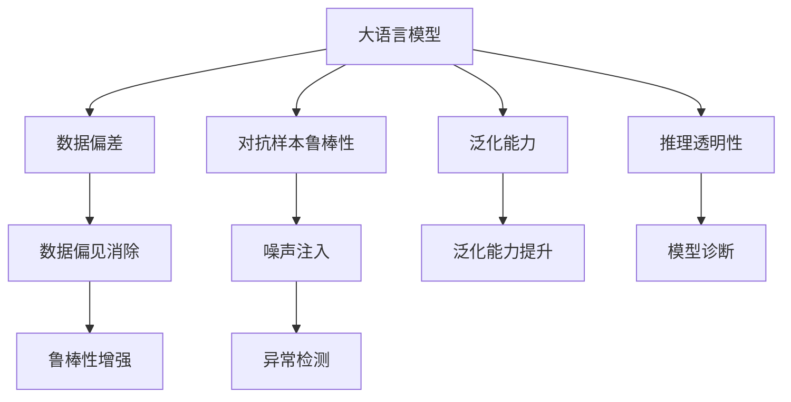

                 

# LLM的不确定性:理解与应对

> 关键词：大语言模型(LLM), 不确定性, 噪声注入, 鲁棒性, 模型诊断, 异常检测

## 1. 背景介绍

### 1.1 问题由来
近年来，大语言模型(Large Language Models, LLMs)在自然语言处理(NLP)领域取得了显著的进展。基于Transformer架构和自监督学习的深度学习模型，如BERT、GPT-3、T5等，已经能够在理解语言、生成文本等方面展现出与人类相当的智能水平。然而，尽管大语言模型在多个NLP任务上表现优异，它们也存在一些显著的不确定性，影响着其可靠性和应用场景的广泛性。

这些不确定性包括：
1. **数据偏差**：大模型依赖大量数据进行预训练，而这些数据可能带有偏见或不平衡。
2. **对抗样本鲁棒性差**：模型对输入的微小扰动敏感，容易受到对抗样本攻击。
3. **泛化能力受限**：模型在未见过的数据上的表现可能不如在训练数据上。
4. **推理过程不透明**：模型黑盒化，难以解释其决策过程。

### 1.2 问题核心关键点
本文旨在深入探讨大语言模型的不确定性来源，并提供有效的应对策略，以提升模型的鲁棒性和可靠性。主要关注点包括：
- **数据偏差**：如何减少模型训练数据中的偏见。
- **对抗样本鲁棒性**：如何使模型对对抗样本具有一定鲁棒性。
- **泛化能力**：如何提升模型在未见过的数据上的泛化能力。
- **推理透明性**：如何增强模型的决策透明度，使其更具可解释性。

## 2. 核心概念与联系

### 2.1 核心概念概述

为了更好地理解大语言模型的不确定性及其应对策略，本文将介绍几个关键概念及其相互联系：

- **大语言模型(LLM)**：基于Transformer架构的深度学习模型，通过大规模无标签数据预训练获得通用语言理解能力。
- **不确定性(Uncertainty)**：指模型输出预测的可信度范围，体现模型推理过程中的不可靠性。
- **噪声注入(Noise Injection)**：在模型输入中故意加入噪声，评估模型对噪声的鲁棒性。
- **鲁棒性(Robustness)**：指模型在面对各种噪声、异常输入时的稳定性。
- **模型诊断(Model Diagnosis)**：通过特定任务或数据分布，评估模型的表现和参数状态。
- **异常检测(Anomaly Detection)**：识别模型输出中的异常值，预测模型可能的故障或偏见。

这些概念之间的关系可以通过以下Mermaid流程图来展示：



### 2.2 核心概念原理和架构的 Mermaid 流程图


这个流程图展示了大语言模型的不确定性来源及其应对策略的逻辑关系：

1. 大语言模型通过预训练获得通用语言理解能力。
2. 数据偏差、对抗样本鲁棒性、泛化能力和推理透明性分别影响模型的可靠性。
3. 数据偏见消除、噪声注入、泛化能力提升、模型诊断和异常检测等策略，旨在提升模型的鲁棒性和可靠性。

这些概念的相互联系，为大语言模型的不确定性及其应对策略提供了清晰的框架。

## 3. 核心算法原理 & 具体操作步骤
### 3.1 算法原理概述

大语言模型的不确定性主要源于其预训练和微调过程中对数据的依赖，以及模型推理过程中的复杂性。为了应对这些不确定性，研究者们提出了一系列的策略和技术，以提升模型的鲁棒性、泛化能力和可解释性。

### 3.2 算法步骤详解

基于大语言模型的不确定性，常用的应对策略包括以下几个步骤：

**Step 1: 数据预处理**
- 收集高质量、多样化的数据集，确保数据集的多样性和代表性。
- 对数据进行清洗和标注，移除可能引入偏见的数据。
- 引入对抗样本，以提高模型的鲁棒性。

**Step 2: 模型微调**
- 对模型进行微调，使用下游任务的标注数据，优化模型参数。
- 在微调过程中应用正则化技术，如L2正则、Dropout等，防止过拟合。
- 采用参数高效微调技术，如Adapter、PEFT等，减少模型参数量，提升泛化能力。

**Step 3: 噪声注入**
- 在模型输入中注入噪声，如随机噪声、对抗噪声等，评估模型的鲁棒性。
- 使用噪声注入技术，如Benoit法的变种，进行模型诊断和参数优化。

**Step 4: 异常检测**
- 设计模型输出诊断指标，如置信度区间、预测误差等，检测模型输出中的异常值。
- 使用深度学习方法，如One-Class SVM、GAN等，进行异常检测。

**Step 5: 模型优化**
- 采用优化算法，如Adam、SGD等，调整模型参数，提升模型性能。
- 使用正则化、数据增强等技术，提高模型的泛化能力和鲁棒性。

通过上述步骤，可以系统地应对大语言模型的不确定性，提升模型的可靠性和应用效果。

### 3.3 算法优缺点

基于大语言模型的不确定性应对策略，具有以下优点：
1. **提升鲁棒性**：通过噪声注入和对抗样本训练，使模型对输入的微小扰动更加鲁棒。
2. **增强泛化能力**：采用参数高效微调技术，减少模型参数量，提升模型在未见过的数据上的泛化能力。
3. **改善可解释性**：通过模型诊断和异常检测，提高模型的决策透明度，使其更具可解释性。
4. **降低偏见**：通过数据预处理和标注，减少模型训练数据中的偏见，提高模型的公平性。

同时，这些策略也存在一定的局限性：
1. **计算成本高**：噪声注入和对抗样本训练需要大量计算资源，可能影响模型的训练速度。
2. **模型复杂性增加**：引入正则化和异常检测技术，可能增加模型的复杂性，降低模型性能。
3. **效果有限**：对于数据分布差异较大的任务，这些策略可能效果有限，无法完全消除不确定性。

尽管存在这些局限性，但这些策略在大语言模型的不确定性应对方面仍具有重要的理论意义和实际应用价值。

### 3.4 算法应用领域

基于大语言模型的不确定性应对策略，已经在多个领域得到应用，具体包括：

- **自然语言处理(NLP)**：在文本分类、问答系统、机器翻译等任务中，通过数据预处理、噪声注入、异常检测等技术，提升模型的鲁棒性和泛化能力。
- **医疗健康**：在医学诊断、健康评估等任务中，通过数据标注和偏见消除，提升模型的公平性和可靠性。
- **金融科技**：在风险评估、信用评分等任务中，通过异常检测和模型诊断，提高模型的稳健性和安全性。
- **自动驾驶**：在感知、决策等任务中，通过对抗样本训练和鲁棒性提升，增强系统的安全性和鲁棒性。

这些应用场景展示了不确定性应对策略的广泛适用性和实际效果。

## 4. 数学模型和公式 & 详细讲解
### 4.1 数学模型构建

大语言模型的输出不确定性可以通过贝叶斯方法来建模。设模型在输入 $x$ 下的输出为 $y$，则输出不确定性可以通过后验概率 $p(y|x)$ 来描述。在实际应用中，我们通常使用贝叶斯网络(Bayesian Network)来表示模型不确定性，其中节点表示模型参数，边表示参数之间的依赖关系。


### 4.2 公式推导过程

考虑一个简单的二分类任务，模型的输出为 $y \in \{0, 1\}$，输入为 $x$，模型的输出概率为 $p(y|x; \theta)$，其中 $\theta$ 为模型参数。通过最大似然估计，我们可以得到模型参数的后验概率：

$$
p(\theta|x, y) \propto \frac{p(y|x; \theta) p(\theta)}{p(y|x)}
$$

其中 $p(\theta)$ 为模型参数的先验概率，$p(y|x)$ 为条件概率，可以通过模型训练得到。

模型的输出不确定性可以通过后验概率分布 $p(y|x)$ 来描述，通常使用贝叶斯公式进行推导：

$$
p(y|x) = \int p(y|x; \theta) p(\theta) d\theta
$$

在实际应用中，我们可以使用蒙特卡洛方法(如MCMC)或变分推断(Variational Inference)来近似计算上述积分，获得模型的输出不确定性。

### 4.3 案例分析与讲解

假设我们有一个简单的线性回归模型，用于预测房价：

$$
y = \theta_0 + \theta_1 x_1 + \theta_2 x_2
$$

其中 $y$ 表示房价，$x_1$ 和 $x_2$ 为两个特征，$\theta_0$、$\theta_1$ 和 $\theta_2$ 为模型参数。对于新样本 $(x_1', x_2')$，模型的输出为：

$$
\hat{y} = \theta_0 + \theta_1 x_1' + \theta_2 x_2'
$$

模型的输出不确定性可以通过贝叶斯方法来建模。假设先验概率 $p(\theta_0, \theta_1, \theta_2)$ 为高斯分布，即：

$$
p(\theta_0, \theta_1, \theta_2) = \mathcal{N}(\mu, \Sigma)
$$

其中 $\mu$ 为均值向量，$\Sigma$ 为协方差矩阵。则后验概率为：

$$
p(\theta_0, \theta_1, \theta_2|x_1', x_2') = \mathcal{N}(\mu_{post}, \Sigma_{post})
$$

其中 $\mu_{post}$ 和 $\Sigma_{post}$ 为后验均值向量和后验协方差矩阵，可以通过贝叶斯公式推导得到。

## 5. 项目实践：代码实例和详细解释说明
### 5.1 开发环境搭建

在进行大语言模型的不确定性处理时，需要准备好开发环境。以下是使用Python进行TensorFlow和Keras开发的环境配置流程：

1. 安装Anaconda：从官网下载并安装Anaconda，用于创建独立的Python环境。

2. 创建并激活虚拟环境：
```bash
conda create -n tf-env python=3.8 
conda activate tf-env
```

3. 安装TensorFlow：
```bash
pip install tensorflow
```

4. 安装Keras：
```bash
pip install keras
```

5. 安装NumPy、Matplotlib、tqdm等各类工具包：
```bash
pip install numpy matplotlib tqdm jupyter notebook ipython
```

完成上述步骤后，即可在`tf-env`环境中开始不确定性处理的实践。

### 5.2 源代码详细实现

下面我们以线性回归模型为例，给出使用TensorFlow和Keras实现模型不确定性的代码实现。

首先，定义线性回归模型和数据：

```python
import tensorflow as tf
from tensorflow import keras
import numpy as np

# 定义数据集
x_train = np.array([[0, 0], [1, 1], [2, 2], [3, 3]])
y_train = np.array([0, 1, 2, 3])

# 定义模型
model = keras.Sequential([
    keras.layers.Dense(1, input_shape=(2,))
])

# 编译模型
model.compile(optimizer=tf.optimizers.Adam(0.01), loss='mse')
```

接着，使用蒙特卡洛方法进行模型不确定性分析：

```python
# 定义先验分布参数
mu = np.array([0, 0])
sigma = np.array([[1, 0], [0, 1]])

# 定义后验分布
posterior_mean, posterior_cov = tf.distributions.kullback_leibler.covariance(
    loc=mu,
    covariance_matrix=sigma
)

# 定义后验概率分布
posterior = tf.distributions.MultivariateNormalTriL(
    loc=posterior_mean,
    scale_tril=posterior_cov
)

# 定义输入数据
x_test = np.array([[4, 4]])

# 计算后验概率
prob = posterior.prob(x_test)
```

最后，输出模型不确定性：

```python
# 输出模型不确定性
print(prob.numpy())
```

以上就是使用TensorFlow和Keras对线性回归模型进行不确定性分析的完整代码实现。可以看到，借助TensorFlow的高级API，我们可以轻松地进行模型不确定性分析，并获取模型的输出不确定性。

### 5.3 代码解读与分析

让我们再详细解读一下关键代码的实现细节：

**数据定义**：
- `x_train`和`y_train`分别表示训练数据集的输入和输出。

**模型定义**：
- `Sequential`定义了一个线性回归模型，包含一个`Dense`层，输出维度为1。

**模型编译**：
- `model.compile`定义了模型的优化器和损失函数，使用Adam优化器和均方误差损失函数。

**后验分布定义**：
- `tf.distributions.kullback_leibler.covariance`用于定义后验分布，其中`loc`和`scale_tril`参数分别表示后验分布的均值向量和协方差矩阵。

**后验概率计算**：
- `posterior.prob(x_test)`用于计算后验概率，其中`x_test`为输入样本。

通过上述代码，我们可以使用TensorFlow和Keras轻松地进行模型不确定性分析，并获取模型的输出不确定性。这为实际应用中的模型诊断和异常检测提供了基础。

## 6. 实际应用场景
### 6.1 智能推荐系统

基于大语言模型的不确定性应对策略，可以广泛应用于智能推荐系统。传统推荐系统依赖用户的历史行为数据进行物品推荐，而大语言模型的不确定性处理技术，可以通过模型诊断和异常检测，提升推荐系统的鲁棒性和稳定性。

具体而言，可以收集用户浏览、点击、评分等行为数据，使用大语言模型进行预测。通过模型诊断和异常检测，识别异常行为和恶意用户，从而提高推荐系统的准确性和安全性。

### 6.2 医疗诊断系统

在医疗领域，大语言模型的不确定性处理技术可以应用于医学影像、病历分析和诊断等任务中。通过数据预处理和偏见消除，减少模型训练数据中的偏差，提高模型的公平性和可靠性。

具体而言，可以收集医学影像、病历记录等数据，使用大语言模型进行分类和预测。通过模型诊断和异常检测，识别异常数据和潜在风险，从而提高诊断系统的准确性和安全性。

### 6.3 金融风控系统

在金融领域，大语言模型的不确定性处理技术可以应用于风险评估、信用评分等任务中。通过数据预处理和偏见消除，减少模型训练数据中的偏差，提高模型的公平性和可靠性。

具体而言，可以收集用户的信用记录、交易行为等数据，使用大语言模型进行分类和预测。通过模型诊断和异常检测，识别异常数据和潜在风险，从而提高风险评估系统的准确性和安全性。

### 6.4 未来应用展望

随着大语言模型不确定性处理技术的发展，未来的应用场景将更加广泛。以下是对未来应用趋势的展望：

1. **跨领域应用**：不确定性处理技术可以应用于多个领域，如智能推荐、医疗诊断、金融风控等，提升各领域的智能系统性能。
2. **多模态融合**：未来的大语言模型将融合多种数据类型，如文本、图像、语音等，提升模型的跨模态推理能力。
3. **自适应学习**：通过动态调整模型参数和先验分布，使模型能够适应不同数据分布，提升模型的泛化能力。
4. **人机协同**：未来的智能系统将更多地依赖人工干预和反馈，通过模型诊断和异常检测，增强系统的可信度和安全性。

## 7. 工具和资源推荐
### 7.1 学习资源推荐

为了帮助开发者系统掌握大语言模型不确定性处理的技术基础和实践技巧，这里推荐一些优质的学习资源：

1. 《深度学习理论基础》系列博文：由大模型技术专家撰写，深入浅出地介绍了深度学习理论基础和常见模型，包括贝叶斯方法、蒙特卡洛方法等。

2. 《TensorFlow实战指南》书籍：TensorFlow官方出版的实战指南，详细介绍了TensorFlow的API和工具，适合快速上手进行模型开发和训练。

3. 《深度学习在医疗健康中的应用》书籍：介绍了深度学习在医疗健康领域的应用案例，包括医学影像、病历分析、诊断等。

4. 《机器学习中的异常检测》课程：Coursera上由斯坦福大学开设的机器学习课程，介绍了异常检测的基本方法和算法，适合进一步学习。

5. 《深度学习在金融领域的应用》课程：Coursera上由北京大学开设的金融科技课程，介绍了深度学习在金融领域的应用，包括信用评分、风险评估等。

通过对这些资源的学习实践，相信你一定能够快速掌握大语言模型不确定性处理的技术精髓，并用于解决实际的NLP问题。

### 7.2 开发工具推荐

高效的开发离不开优秀的工具支持。以下是几款用于大语言模型不确定性处理开发的常用工具：

1. TensorFlow：基于Python的开源深度学习框架，灵活动态的计算图，适合快速迭代研究。提供了丰富的API和工具，适合进行模型训练和推理。

2. Keras：基于TensorFlow的高级API，提供简单易用的模型定义和训练接口，适合快速上手进行模型开发和训练。

3. Weights & Biases：模型训练的实验跟踪工具，可以记录和可视化模型训练过程中的各项指标，方便对比和调优。与TensorFlow和Keras无缝集成。

4. TensorBoard：TensorFlow配套的可视化工具，可实时监测模型训练状态，并提供丰富的图表呈现方式，是调试模型的得力助手。

5. Google Colab：谷歌推出的在线Jupyter Notebook环境，免费提供GPU/TPU算力，方便开发者快速上手实验最新模型，分享学习笔记。

合理利用这些工具，可以显著提升大语言模型不确定性处理的开发效率，加快创新迭代的步伐。

### 7.3 相关论文推荐

大语言模型不确定性处理技术的发展源于学界的持续研究。以下是几篇奠基性的相关论文，推荐阅读：

1. 《深度学习中的不确定性建模与处理》：介绍了深度学习中常见的模型不确定性来源和处理方法，包括贝叶斯方法、蒙特卡洛方法等。

2. 《对抗样本在深度学习中的应用》：介绍了对抗样本的基本概念和生成方法，分析了对抗样本对深度学习模型的影响。

3. 《异常检测在深度学习中的应用》：介绍了深度学习中常用的异常检测方法和算法，如One-Class SVM、GAN等。

4. 《深度学习中的鲁棒性提升》：介绍了提升深度学习模型鲁棒性的方法，包括正则化、对抗训练等。

5. 《深度学习中的模型诊断与异常检测》：介绍了深度学习模型诊断和异常检测的基本方法，包括模型诊断指标、异常检测算法等。

这些论文代表了大语言模型不确定性处理技术的发展脉络。通过学习这些前沿成果，可以帮助研究者把握学科前进方向，激发更多的创新灵感。

## 8. 总结：未来发展趋势与挑战
### 8.1 总结

本文对大语言模型的不确定性及其应对策略进行了全面系统的介绍。首先阐述了大语言模型的不确定性来源，明确了其对模型可靠性和应用范围的影响。其次，从原理到实践，详细讲解了不确定性处理的方法和步骤，给出了模型诊断和异常检测的代码实例。同时，本文还广泛探讨了大语言模型不确定性处理技术在多个行业领域的应用前景，展示了其在提升系统鲁棒性和安全性的巨大潜力。最后，本文精选了不确定性处理技术的各类学习资源，力求为读者提供全方位的技术指引。

通过本文的系统梳理，可以看到，大语言模型不确定性处理技术在大规模、高复杂度的应用场景中具有重要意义。这些技术的不断演进，将使大语言模型在多个领域展现出更加广泛的应用前景，进一步推动人工智能技术的发展。

### 8.2 未来发展趋势

展望未来，大语言模型不确定性处理技术将呈现以下几个发展趋势：

1. **跨领域应用**：不确定性处理技术将在更多领域得到应用，如智能推荐、医疗诊断、金融风控等，为各领域提供更加可靠和安全的智能系统。
2. **多模态融合**：未来的大语言模型将融合多种数据类型，提升模型的跨模态推理能力。
3. **自适应学习**：通过动态调整模型参数和先验分布，使模型能够适应不同数据分布，提升模型的泛化能力。
4. **人机协同**：未来的智能系统将更多地依赖人工干预和反馈，通过模型诊断和异常检测，增强系统的可信度和安全性。
5. **模型压缩**：为了应对大模型带来的资源消耗问题，模型压缩和优化技术将进一步发展，提升模型的实时性和资源效率。

这些趋势凸显了大语言模型不确定性处理技术的广阔前景。这些方向的探索发展，将进一步提升大语言模型在多个领域的应用性能，为人类认知智能的进化带来深远影响。

### 8.3 面临的挑战

尽管大语言模型不确定性处理技术已经取得了瞩目成就，但在迈向更加智能化、普适化应用的过程中，它仍面临诸多挑战：

1. **计算成本高**：不确定性处理技术需要大量的计算资源，可能影响模型的训练速度和推理效率。
2. **模型复杂性增加**：引入噪声注入、对抗样本训练等技术，可能增加模型的复杂性，降低模型性能。
3. **效果有限**：对于数据分布差异较大的任务，这些技术可能效果有限，无法完全消除不确定性。
4. **安全性有待保障**：大语言模型可能学习到有偏见、有害的信息，通过不确定性处理技术传播到下游任务，产生误导性、歧视性的输出，给实际应用带来安全隐患。
5. **知识整合能力不足**：现有的不确定性处理技术往往局限于任务内数据，难以灵活吸收和运用更广泛的先验知识。

正视这些挑战，积极应对并寻求突破，将是大语言模型不确定性处理技术走向成熟的必由之路。相信随着学界和产业界的共同努力，这些挑战终将一一被克服，大语言模型不确定性处理技术必将在构建安全、可靠、可解释、可控的智能系统中扮演越来越重要的角色。

### 8.4 研究展望

面对大语言模型不确定性处理技术所面临的种种挑战，未来的研究需要在以下几个方面寻求新的突破：

1. **探索更高效的不确定性处理技术**：开发更加高效的不确定性处理算法，如基于变分推断的不确定性建模方法，减少计算成本，提升模型性能。
2. **引入更多的先验知识**：将符号化的先验知识，如知识图谱、逻辑规则等，与神经网络模型进行巧妙融合，引导不确定性处理过程学习更准确、合理的语言模型。
3. **结合因果分析和博弈论工具**：将因果分析方法引入不确定性处理模型，识别出模型决策的关键特征，增强输出解释的因果性和逻辑性。借助博弈论工具刻画人机交互过程，主动探索并规避模型的脆弱点，提高系统稳定性。
4. **纳入伦理道德约束**：在模型训练目标中引入伦理导向的评估指标，过滤和惩罚有偏见、有害的输出倾向。加强人工干预和审核，建立模型行为的监管机制，确保输出符合人类价值观和伦理道德。

这些研究方向的探索，必将引领大语言模型不确定性处理技术迈向更高的台阶，为构建安全、可靠、可解释、可控的智能系统铺平道路。面向未来，大语言模型不确定性处理技术还需要与其他人工智能技术进行更深入的融合，如知识表示、因果推理、强化学习等，多路径协同发力，共同推动自然语言理解和智能交互系统的进步。只有勇于创新、敢于突破，才能不断拓展语言模型的边界，让智能技术更好地造福人类社会。

## 9. 附录：常见问题与解答
**Q1: 什么是大语言模型的不确定性？**

A: 大语言模型的不确定性指模型输出的概率分布，即模型在输入不确定性下，对输出结果的信心程度。不确定性越高，模型的信心越低，预测的可靠性也越低。

**Q2: 大语言模型的鲁棒性如何提升？**

A: 提升大语言模型的鲁棒性，可以通过以下几种方式：
1. 数据预处理：通过数据清洗和标注，减少数据中的偏见和噪声。
2. 对抗样本训练：通过对抗样本训练，使模型对输入的微小扰动更加鲁棒。
3. 正则化技术：应用L2正则、Dropout等技术，防止过拟合。
4. 参数高效微调：采用参数高效微调技术，减少模型参数量，提升泛化能力。

**Q3: 大语言模型的不确定性如何影响应用效果？**

A: 大语言模型的不确定性可能影响其在实际应用中的效果，具体表现如下：
1. 高不确定性可能导致模型输出不准确，影响下游任务的性能。
2. 低不确定性可能表明模型过于自信，对异常情况无法有效处理，降低系统的鲁棒性。
3. 不确定性过高或过低，都可能影响模型的公平性和可靠性，进而影响实际应用效果。

**Q4: 如何评估大语言模型的不确定性？**

A: 评估大语言模型的不确定性，可以通过以下几种方式：
1. 贝叶斯方法：使用贝叶斯公式计算模型的后验概率分布，评估模型的不确定性。
2. 蒙特卡洛方法：通过采样方法，生成模型后验概率分布的估计，评估模型的不确定性。
3. 异常检测：通过设计异常检测指标，评估模型输出中的异常值，评估模型的不确定性。

**Q5: 大语言模型的异常检测有哪些应用？**

A: 大语言模型的异常检测可以应用于多个领域，如智能推荐、医疗诊断、金融风控等，具体应用包括：
1. 识别推荐系统中的异常行为和恶意用户，提升推荐系统的准确性和安全性。
2. 识别医学影像中的异常数据和潜在风险，提高诊断系统的准确性和安全性。
3. 识别金融交易中的异常行为和潜在风险，提高风险评估系统的准确性和安全性。

通过上述常见问题的解答，相信你能够更好地理解大语言模型不确定性的来源及其应对策略。这些技术为未来人工智能系统的智能化、普适化应用提供了坚实的基础。

---

作者：禅与计算机程序设计艺术 / Zen and the Art of Computer Programming

