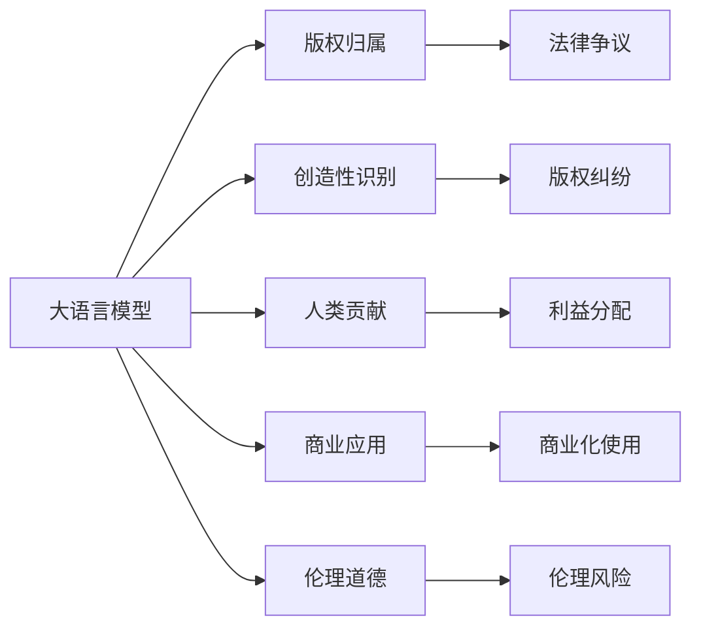

                 

# LLM的版权问题：AI创作的法律挑战

## 1. 背景介绍

### 1.1 问题由来
人工智能（AI）的快速发展和普及，使得自然语言处理（NLP）领域的大语言模型（LLM）如OpenAI的GPT-3、Google的BERT等取得了显著进展。这些大模型在文本生成、翻译、问答等多个任务上表现出色，展示了强大的语言理解与生成能力。然而，随之而来的是关于AI创作及其版权归属的一系列法律问题。

### 1.2 问题核心关键点
1. **版权归属**：由AI生成的文本是否具有版权？如果是，版权归属于谁？
2. **创造性识别**：AI创作的作品是否具备足够创造性？
3. **人类贡献**：在AI创作过程中，人类的创作和数据贡献是否应被考虑？
4. **商业应用**：AI生成的内容是否可以商业化使用？
5. **伦理道德**：AI创作可能带来的伦理问题，如版权冲突、隐私泄露等。

### 1.3 问题研究意义
探讨大语言模型创作的法律问题，不仅关乎技术发展的法律合规性，还涉及AI伦理、数据保护、商业模式等多个维度。这对于促进AI技术的健康发展，保护创作者权益，以及确保AI应用的安全性和可信赖性具有重要意义。

## 2. 核心概念与联系

### 2.1 核心概念概述

1. **大语言模型（LLM）**：通过大量文本数据训练而成的模型，能够理解、生成自然语言，并在特定任务上表现优异。
2. **版权（Copyright）**：一种法律保护，旨在保护原创作品的作者权益。
3. **创造性（Creativity）**：原创性和创新性的创作，是版权保护的核心要素之一。
4. **人工智能（AI）**：使用算法和数据训练的机器系统，具备自主学习和适应能力。
5. **商业应用（Commercial Application）**：AI生成内容的商业使用，包括广告、出版、影视等。
6. **伦理道德（Ethics）**：涉及道德、公平、责任等方面的问题，如数据隐私、内容真实性等。

这些概念之间的逻辑关系可以通过以下Mermaid流程图来展示：



这个流程图展示了大语言模型创作的各个核心概念及其之间的关系：

1. 大语言模型通过学习数据生成文本。
2. 生成的文本可能涉及版权问题。
3. 创作过程中可能涉及创造性和人类贡献。
4. 生成的内容可能被商业化使用。
5. 创作过程中可能引发伦理问题。
6. 以上问题可能导致法律争议、版权纠纷、利益分配、商业化使用和伦理风险。

## 3. 核心算法原理 & 具体操作步骤

### 3.1 算法原理概述
大语言模型生成的文本版权问题，主要围绕以下两个关键点展开：

- **原创性（Originality）**：AI生成的文本是否具备原创性？
- **作者身份（Authorship）**：谁应被视为AI创作的“作者”？

**原创性**通常被定义为“原创、独立且具备一定创造性的作品”。而**作者身份**则涉及谁是创作过程中的关键贡献者，包括数据提供者、算法开发者、模型训练师等。

### 3.2 算法步骤详解

#### 3.2.1 原创性判断
1. **内容独特性**：通过文本相似度检测，判断AI生成的文本是否与已有作品存在明显相似或复制。
2. **内容连贯性**：评估文本的语义连贯性和逻辑性，是否具有可理解的结构和内容。
3. **创作意图**：分析文本创作背后的意图，是否具有明显的创作意图和目的。

#### 3.2.2 作者身份识别
1. **数据来源**：识别用于训练模型的数据来源和数据贡献者。
2. **算法贡献**：评估算法开发者对模型设计、优化和训练的贡献。
3. **模型训练师**：确定模型训练师的贡献和责任，包括数据预处理、模型调优等。

#### 3.2.3 法律适用性
1. **国际法律差异**：不同国家对版权和AI创作的法律定义和适用性有所不同，需进行国际比较。
2. **法律责任分配**：明确各方在AI创作过程中的法律责任，包括创作者、开发者、数据提供者等。

### 3.3 算法优缺点

**优点**：
1. **自动化分析**：利用算法和工具可以自动化地检测文本的原创性和作者身份。
2. **快速判断**：通过技术手段快速判断AI生成的文本是否具有版权。
3. **数据驱动**：基于大量数据训练的模型可以更准确地评估文本的原创性和作者身份。

**缺点**：
1. **法律复杂性**：不同法律体系下的版权定义和保护方式不同，需复杂分析。
2. **伦理争议**：算法可能存在偏见和歧视，需进行伦理审查。
3. **技术局限性**：当前算法可能无法完全准确识别原创性和作者身份。

### 3.4 算法应用领域

**版权保护**：适用于保护AI生成的文本版权，防止未经授权的复制和传播。

**内容审查**：应用于媒体、出版等领域的文本审查，确保内容的真实性和原创性。

**市场监管**：在电子商务、广告等领域，通过技术手段防止侵权和虚假宣传。

**版权授权**：辅助版权持有者管理和授权AI生成的文本内容，保护知识产权。

## 4. 数学模型和公式 & 详细讲解 & 举例说明

### 4.1 数学模型构建

**版权归属模型**：
$$
\text{版权归属} = f(\text{原创性}, \text{人类贡献}, \text{商业应用}, \text{伦理道德})
$$

其中，$f$为映射函数，将原创性、人类贡献、商业应用和伦理道德映射为版权归属的概率分布。

### 4.2 公式推导过程

**原创性检测**：
1. **文本相似度检测**：计算AI生成的文本与已知文本的相似度。
2. **内容连贯性评估**：使用自然语言处理技术评估文本的连贯性和逻辑性。
3. **创作意图分析**：通过文本分析技术，识别文本的创作意图和目的。

**作者身份识别**：
1. **数据来源识别**：分析用于训练模型的数据来源，确定数据提供者。
2. **算法贡献评估**：基于算法设计的复杂性和创新性，评估算法开发者的贡献。
3. **模型训练师识别**：识别模型训练师的关键贡献和责任。

### 4.3 案例分析与讲解

**案例1**：某AI创作公司使用大语言模型生成文本，用于广告宣传。该公司需要判断生成的广告文本是否具备版权，以及版权归属于谁。

**案例分析**：
1. **原创性检测**：通过计算与已有广告文本的相似度，判断新广告文本的原创性。
2. **作者身份识别**：识别数据来源（如品牌故事、广告文案），评估算法和模型训练师的贡献。
3. **法律适用性**：根据不同国家的版权法律，确定版权归属和法律责任。

## 5. 项目实践：代码实例和详细解释说明

### 5.1 开发环境搭建

1. **安装Python和相关库**：
   ```bash
   conda create -n llm-env python=3.8
   conda activate llm-env
   pip install tensorflow numpy scikit-learn transformers
   ```

2. **准备数据集**：使用公开的文本数据集，如维基百科、新闻文章等。

3. **搭建模型环境**：使用TensorFlow或PyTorch搭建大语言模型。

### 5.2 源代码详细实现

**原创性检测**：

```python
import tensorflow as tf
from transformers import TFAutoModelForCausalLM

# 加载预训练模型
model = TFAutoModelForCausalLM.from_pretrained('gpt-3')

# 定义输入文本
input_text = "AI生成的文本"

# 生成文本
generated_text = model.generate(input_text, max_length=100, top_p=0.9, num_return_sequences=1)

# 计算文本相似度
similarity_score = calculate_similarity(input_text, generated_text)
```

**作者身份识别**：

```python
import pandas as pd

# 加载数据集
data = pd.read_csv('dataset.csv')

# 识别数据来源
data_source = data['data_source'].values

# 评估算法贡献
algorithm_contribution = data['algorithm_contribution'].values

# 识别模型训练师
trainer = data['trainer'].values
```

### 5.3 代码解读与分析

**原创性检测**：
1. **加载模型**：使用预训练的大语言模型。
2. **生成文本**：通过模型生成文本，并使用相似度算法计算与已知文本的相似度。
3. **相似度评估**：评估新文本的原创性。

**作者身份识别**：
1. **数据来源**：从数据集中提取数据来源。
2. **算法贡献**：评估算法的设计和优化。
3. **模型训练师**：确定模型训练师的关键贡献。

### 5.4 运行结果展示

**原创性检测**：输出相似度评分，判断新文本是否具备原创性。

**作者身份识别**：输出数据来源、算法贡献和模型训练师的信息，明确各方责任。

## 6. 实际应用场景

### 6.1 新闻出版

在新闻出版领域，大语言模型生成的文章可能需要经过原创性检测和作者身份识别，以确保内容的原创性和版权归属。例如，某新闻机构使用AI自动生成文章，需判断生成文章是否具备版权，以及版权归属于谁。

### 6.2 广告宣传

广告公司使用大语言模型生成广告文案，需通过原创性检测和作者身份识别，以确保广告文本的原创性和法律合规性。例如，某公司生成多个广告文本，需评估每个文本的原创性和版权归属。

### 6.3 版权管理

版权持有者需要管理和授权AI生成的内容，需通过原创性检测和作者身份识别，确定内容的版权归属和授权方式。例如，某出版社使用AI生成图书摘要，需判断摘要的原创性，确定版权归属。

## 7. 工具和资源推荐

### 7.1 学习资源推荐

1. **版权法基础知识**：学习版权法的基本概念和法律规定。
2. **自然语言处理基础**：学习自然语言处理技术，包括文本相似度检测、内容连贯性评估等。
3. **人工智能伦理**：学习人工智能伦理和道德规范，确保AI创作的应用合规。

### 7.2 开发工具推荐

1. **TensorFlow**：强大的深度学习框架，支持分布式训练和大模型应用。
2. **PyTorch**：灵活的深度学习框架，适用于NLP任务的开发。
3. **Transformers**：HuggingFace开发的NLP工具库，包含多个预训练模型。

### 7.3 相关论文推荐

1. **"Large Language Models Are Few-Shot Learners"**：展示了大型语言模型具备少样本学习能力的实验结果。
2. **"Copyright and AI"**：探讨AI生成内容版权的法律问题的多篇论文。
3. **"Ethics and AI"**：讨论AI伦理和道德问题的论文集。

## 8. 总结：未来发展趋势与挑战

### 8.1 总结

本文系统探讨了大语言模型创作的版权问题，涉及原创性检测、作者身份识别和法律适用性。通过案例分析，展示了AI创作在实际应用中面临的版权挑战，并提出了解决方案。未来，随着技术的不断进步，版权问题将得到更加系统的解决，为AI创作提供法律保障。

### 8.2 未来发展趋势

1. **技术进步**：大语言模型和自然语言处理技术将持续进步，提升原创性检测和作者身份识别的准确性。
2. **国际合作**：国际法律合作将推动版权保护的标准化和一致性。
3. **跨领域应用**：AI创作将应用于更多领域，如广告、出版、教育等，推动相关法律和规范的发展。

### 8.3 面临的挑战

1. **法律复杂性**：不同国家的版权法律体系不同，需进行复杂的法律适用性分析。
2. **伦理争议**：AI创作可能带来伦理问题，需进行伦理审查和规范制定。
3. **技术局限性**：现有技术可能存在偏见和局限，需不断改进和优化。

### 8.4 研究展望

未来，大语言模型创作的版权问题将得到更加系统的研究和解决，推动AI技术的健康发展。需加强国际合作、伦理规范和技术改进，确保AI创作在法律和伦理上的合规性，促进技术的广泛应用。

## 9. 附录：常见问题与解答

**Q1: 大语言模型生成的文本是否具有版权？**

A: 大语言模型生成的文本是否具有版权，取决于该文本是否具备原创性和独立创作的特点。如果生成的文本具有原创性和创造性，可能具备版权。然而，版权归属还需考虑数据来源、算法贡献等多方面因素。

**Q2: 如何判断大语言模型生成的文本的原创性？**

A: 可以通过文本相似度检测、内容连贯性评估、创作意图分析等方法，判断大语言模型生成的文本是否具备原创性。具体步骤如下：
1. 计算生成文本与已有文本的相似度。
2. 评估生成文本的连贯性和逻辑性。
3. 分析生成文本的创作意图和目的。

**Q3: 大语言模型生成的文本应归属于谁？**

A: 大语言模型生成的文本应归属于数据提供者、算法开发者、模型训练师等多方。需综合考虑各方的贡献和责任，明确版权归属。

**Q4: 大语言模型生成的文本是否可以商业化使用？**

A: 大语言模型生成的文本是否可以商业化使用，取决于版权归属和相关法律规定。通常需获得版权持有者的授权，确保使用的合法性。

**Q5: 大语言模型生成的文本可能带来的伦理问题有哪些？**

A: 大语言模型生成的文本可能带来的伦理问题包括数据隐私、内容真实性、版权冲突等。需制定相关规范和标准，确保AI创作的应用合规。

---

作者：禅与计算机程序设计艺术 / Zen and the Art of Computer Programming

