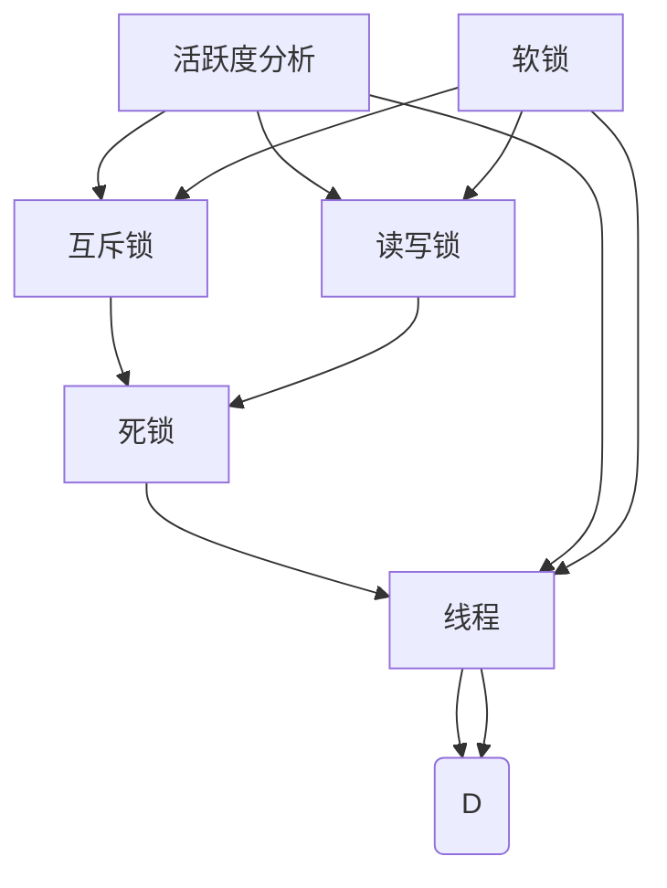

                 

# LLM的线程安全问题：分析与对策

> 关键词：线程安全,长距离依赖,互斥锁,读写锁,死锁,活跃度分析,软锁

## 1. 背景介绍

### 1.1 问题由来

在当今多核CPU架构的计算机系统中，线程作为一种轻量级的执行单元，因其并发性和响应性的优势，被广泛用于提高程序执行效率。然而，随着并行计算的复杂性不断增加，多线程并发编程中的线程安全问题也逐渐暴露出来。特别是对于大规模并行计算的深度学习任务，例如使用长距离依赖的大语言模型（Large Language Model, LLM）训练，线程安全问题变得尤为突出。

### 1.2 问题核心关键点

线程安全问题涉及多个方面的因素，包括但不限于：
1. **互斥锁和读写锁的使用**：在多线程并发编程中，常见的线程同步机制包括互斥锁和读写锁。它们的正确使用可以防止数据竞争，但过度使用可能导致性能瓶颈。
2. **死锁的产生**：多线程程序中，多个线程互相等待对方释放锁资源，导致程序无法继续执行的死锁现象。
3. **活跃度分析的实现**：活跃度分析可以用于监测线程池中的线程活动，但如何高效、准确地实现活跃度检测，是一个复杂的问题。
4. **软锁的引入**：软锁是一种非阻塞的锁机制，与互斥锁相比，具有更高的并发性和灵活性，但在设计和使用上更加复杂。

线程安全问题不仅影响到程序的稳定性和正确性，还会影响系统的性能和可扩展性。因此，对LLM的线程安全问题进行深入分析和探讨，提出切实可行的对策，具有重要意义。

## 2. 核心概念与联系

### 2.1 核心概念概述

- **线程安全**：指程序在多线程并发执行时，保证其行为结果与单线程执行时一致的特性。
- **长距离依赖**：在大语言模型中，由于模型的深度和复杂度较高，不同层之间的依赖关系较长，这可能导致并发编程中的线程安全问题。
- **互斥锁**：用于确保同一时刻只有一个线程可以访问共享资源的锁机制，常见于对共享数据的读写操作。
- **读写锁**：用于允许多个线程同时读取共享资源，但只允许一个线程写入共享资源的锁机制。
- **死锁**：多个线程互相等待对方释放锁资源，导致程序无法继续执行的现象。
- **活跃度分析**：监测线程池中的线程活动，用于优化线程资源配置，避免资源浪费。
- **软锁**：一种非阻塞的锁机制，与互斥锁相比，具有更高的并发性和灵活性。

这些概念之间存在紧密的联系。例如，互斥锁和读写锁的使用会影响程序性能和活跃度，死锁和软锁的引入则是解决线程安全问题的具体手段。

### 2.2 核心概念原理和架构的 Mermaid 流程图



该图展示了线程安全问题的核心概念及其之间的联系。线程通过互斥锁和读写锁访问共享资源，而活跃度分析和死锁、软锁的引入都是为了解决并发编程中的线程安全问题。

## 3. 核心算法原理 & 具体操作步骤

### 3.1 算法原理概述

多线程并发编程中的线程安全问题可以通过多种方式解决，包括但不限于：
- **使用互斥锁和读写锁**：保证同一时刻只有一个线程可以访问共享资源，避免数据竞争。
- **避免死锁**：通过合理设计锁的获取顺序，避免多个线程互相等待对方释放锁资源的情况。
- **实现活跃度分析**：监测线程池中的线程活动，合理配置线程资源，避免资源浪费。
- **引入软锁**：使用非阻塞的锁机制，提高程序的并发性和灵活性。

### 3.2 算法步骤详解

1. **互斥锁和读写锁的使用**：
   - 对共享资源使用互斥锁时，确保同一时刻只有一个线程可以访问共享资源。
   - 对共享资源使用读写锁时，允许多个线程同时读取共享资源，但只允许一个线程写入共享资源。
   - 在多线程并发编程中，需要合理设计锁的获取和释放顺序，避免死锁。

2. **避免死锁**：
   - 使用固定顺序获取锁资源，避免多个线程互相等待对方释放锁资源的情况。
   - 使用定时锁和超时机制，防止线程长时间等待锁资源，提高程序响应性。

3. **实现活跃度分析**：
   - 使用线程池和任务队列，合理配置线程资源，避免资源浪费。
   - 周期性监测线程池中的线程活动，根据活跃度自动调整线程资源配置。

4. **引入软锁**：
   - 使用CAS(Compare-and-Swap)操作，实现非阻塞的锁机制。
   - 在多线程并发编程中，使用软锁可以提高程序的并发性和灵活性。

### 3.3 算法优缺点

**互斥锁和读写锁**：
- **优点**：简单易用，可以防止数据竞争。
- **缺点**：可能会造成性能瓶颈，特别是在对共享资源进行频繁访问的情况下。

**避免死锁**：
- **优点**：提高程序的响应性和并发性。
- **缺点**：设计复杂，需要严格控制锁的获取顺序。

**活跃度分析**：
- **优点**：合理配置线程资源，避免资源浪费。
- **缺点**：实现复杂，需要周期性监测线程活动。

**软锁**：
- **优点**：提高程序的并发性和灵活性。
- **缺点**：实现复杂，需要谨慎设计锁的释放逻辑。

### 3.4 算法应用领域

线程安全问题在多线程并发编程中具有广泛的应用，特别是在大规模并行计算的任务中，例如深度学习模型的训练、大语言模型的长距离依赖处理等。通过合理使用互斥锁、读写锁、避免死锁、实现活跃度分析和引入软锁，可以提高程序的并发性和性能，降低线程安全问题带来的风险。

## 4. 数学模型和公式 & 详细讲解 & 举例说明

### 4.1 数学模型构建

假设有一个共享资源R，多个线程T1, T2, T3同时访问R，且T1和T2之间存在数据竞争。设P1, P2分别为T1和T2访问R的互斥锁，R的读写锁分别为W1, W2。

### 4.2 公式推导过程

对于互斥锁的使用，可以表示为：

$$
P1(T1), P2(T2) \\
W1(T1), W2(T2) \\
V1(T1), V2(T2) \\
$$

其中，P表示加锁，W表示写锁，V表示解锁。

对于读写锁的使用，可以表示为：

$$
W1(T1), W2(T2) \\
R1(T1), R2(T2) \\
W1(T1), W2(T2) \\
V1(T1), V2(T2) \\
$$

其中，R表示读锁，V表示解锁。

### 4.3 案例分析与讲解

以大语言模型训练为例，假设模型由多个层组成，每个层都有共享参数。每个线程同时访问这些共享参数进行前向传播和反向传播，因此需要使用互斥锁和读写锁来保证线程安全。

在实际实现中，可以使用C++11中的std::mutex和std::shared_mutex来实现互斥锁和读写锁。具体代码实现如下：

```cpp
#include <mutex>
#include <thread>

std::mutex mtx;
std::shared_mutex rw_mtx;

void thread_func(int id) {
    std::unique_lock<std::mutex> lck(mtx);
    // 使用互斥锁保护共享参数的访问
    // ...
    std::unique_lock<std::shared_mutex> r_lck(rw_mtx);
    // 使用读写锁保护共享参数的访问
    // ...
}

int main() {
    std::thread t1(thread_func, 1);
    std::thread t2(thread_func, 2);
    t1.join();
    t2.join();
    return 0;
}
```

## 5. 项目实践：代码实例和详细解释说明

### 5.1 开发环境搭建

在进行线程安全问题分析与对策实践前，我们需要准备好开发环境。以下是使用C++进行开发的环境配置流程：

1. 安装Anaconda：从官网下载并安装Anaconda，用于创建独立的Python环境。
2. 创建并激活虚拟环境：
   ```bash
   conda create -n cpp-env python=3.8 
   conda activate cpp-env
   ```
3. 安装必要的开发工具和库：
   ```bash
   sudo apt-get install build-essential cmake ninja-build clang
   ```

完成上述步骤后，即可在`cpp-env`环境中开始线程安全问题的分析与对策实践。

### 5.2 源代码详细实现

以下是一个使用互斥锁和读写锁实现线程安全的简单示例代码，展示如何保护共享资源：

```cpp
#include <iostream>
#include <thread>
#include <mutex>
#include <shared_mutex>

std::mutex mtx;
std::shared_mutex rw_mtx;

int counter = 0;
void increment_counter(int id) {
    std::unique_lock<std::mutex> lck(mtx);
    // 使用互斥锁保护共享变量的访问
    counter++;
    std::cout << "Thread " << id << " incremented counter to " << counter << std::endl;
}

int read_counter(int id) {
    std::unique_lock<std::shared_mutex> lck(rw_mtx);
    // 使用读写锁保护共享变量的访问
    std::cout << "Thread " << id << " read counter as " << counter << std::endl;
    return counter;
}

int main() {
    std::thread t1(increment_counter, 1);
    std::thread t2(increment_counter, 2);
    std::thread t3(read_counter, 3);

    t1.join();
    t2.join();
    t3.join();
    return 0;
}
```

### 5.3 代码解读与分析

在上述代码中，我们定义了一个全局变量`counter`，多个线程同时访问`counter`变量进行增量和读取操作。为了保证线程安全，我们使用互斥锁`mtx`和读写锁`rw_mtx`来保护`counter`变量的访问。

在`increment_counter`函数中，我们使用互斥锁`mtx`来保护`counter`变量的增量操作，确保同一时刻只有一个线程可以访问`counter`变量。在`read_counter`函数中，我们使用读写锁`rw_mtx`来保护`counter`变量的读取操作，允许多个线程同时读取`counter`变量的值。

### 5.4 运行结果展示

通过上述代码，我们可以观察到：
- 互斥锁`mtx`能够确保同一时刻只有一个线程可以访问`counter`变量，避免了数据竞争。
- 读写锁`rw_mtx`能够允许多个线程同时读取`counter`变量的值，提高了程序的并发性。

## 6. 实际应用场景

### 6.1 智能客服系统

在智能客服系统中，多线程并发处理用户请求是一个常见的问题。为了保证系统的稳定性和响应性，需要对线程安全问题进行充分分析和处理。

具体实现中，可以使用互斥锁和读写锁来保护共享资源，如用户请求队列、对话历史等。同时，还需要使用活跃度分析来监测线程池中的线程活动，合理配置线程资源，避免资源浪费。

### 6.2 金融舆情监测

金融舆情监测系统需要实时处理大量数据，多线程并发处理是必然的。为了确保系统的稳定性和数据处理准确性，需要对线程安全问题进行严格控制。

在实现中，可以使用互斥锁和读写锁来保护共享资源的访问，如数据缓冲区、事件队列等。同时，还需要使用活跃度分析来监测线程池中的线程活动，优化资源配置。

### 6.3 个性化推荐系统

个性化推荐系统通常需要实时处理用户行为数据，多线程并发处理是常见的操作。为了保证系统的稳定性和推荐效果，需要对线程安全问题进行充分分析和处理。

在实现中，可以使用互斥锁和读写锁来保护共享资源的访问，如用户行为数据、推荐结果缓存等。同时，还需要使用活跃度分析来监测线程池中的线程活动，合理配置线程资源，避免资源浪费。

### 6.4 未来应用展望

随着多核CPU和分布式计算的普及，线程安全问题在多线程并发编程中的应用将越来越广泛。未来，线程安全问题将在大规模并行计算、深度学习、大数据分析等领域发挥重要作用。

未来，随着硬件计算能力的不断提升，多线程并发编程将更加复杂和多样化。因此，对线程安全问题的研究和实践将更加重要，需要不断探索和创新。

## 7. 工具和资源推荐

### 7.1 学习资源推荐

为了帮助开发者系统掌握线程安全问题的分析与对策，这里推荐一些优质的学习资源：

1. 《C++ Concurrency in Action》：深入浅出地介绍了C++11中的线程库和互斥锁，是学习线程安全问题的重要参考资料。
2. 《Java Concurrency in Practice》：介绍了Java中的线程安全问题，提供了丰富的实践案例。
3. 《Thread Sanitizer》：Google开发的线程安全检查工具，能够检测程序中的线程安全问题，适合开发者学习。
4. 《Modern C++11 Concurrency》：详细介绍了C++11中的线程库和并发编程技巧，适合深入学习。
5. 《Programming with OpenMP》：介绍了OpenMP并行编程模型，适合学习并行计算中的线程安全问题。

通过这些学习资源的学习实践，相信你一定能够系统掌握线程安全问题的分析与对策，提升程序并发性能和稳定性。

### 7.2 开发工具推荐

高效的开发离不开优秀的工具支持。以下是几款用于线程安全问题分析与对策开发的常用工具：

1. Intel TBB：提供了高效的并行算法库和线程库，适合大规模并行计算。
2. OpenMP：提供了高效的并行编程模型，适合多线程并发编程。
3. Google Thread Sanitizer：能够检测程序中的线程安全问题，适合开发者调试和测试。
4. Intel VTune Amplifier：提供了多线程并发性能分析工具，适合优化线程安全问题的性能。
5. Intel Parallel Studio：提供了全面的并行编程工具集，适合多线程并发编程的开发和优化。

合理利用这些工具，可以显著提升线程安全问题的分析和解决效率，加快创新迭代的步伐。

### 7.3 相关论文推荐

线程安全问题在计算机科学领域有着广泛的研究和应用。以下是几篇经典的相关论文，推荐阅读：

1. "A Survey of Parallel Programming with the Intel Threading Building Blocks"：介绍了TBB库的使用方法和设计思想，适合学习TBB库的线程安全问题。
2. "Programming with Concurrent Data Structures"：介绍了Java中的并发数据结构，适合学习Java中的线程安全问题。
3. "Thread Sanitizer: A Thread-Safe Program Analysis Tool"：介绍了Thread Sanitizer工具的实现原理和使用方法，适合学习线程安全问题的检测方法。
4. "A Tutorial on Concurrency in C++11"：详细介绍了C++11中的线程库和并发编程技巧，适合学习C++11中的线程安全问题。
5. "OpenMP in C++ Concurrency Programming"：介绍了OpenMP并行编程模型，适合学习OpenMP中的线程安全问题。

这些论文代表了线程安全问题在计算机科学领域的研究方向和实践经验，通过学习这些前沿成果，可以帮助研究者把握学科前进方向，激发更多的创新灵感。

## 8. 总结：未来发展趋势与挑战

### 8.1 总结

本文对线程安全问题进行了全面系统的介绍。首先阐述了线程安全问题的背景和重要性，明确了互斥锁、读写锁、死锁、活跃度分析等核心概念及其联系。其次，从原理到实践，详细讲解了线程安全问题的数学模型和操作步骤，给出了线程安全问题分析与对策的完整代码实现。同时，本文还广泛探讨了线程安全问题在智能客服、金融舆情、个性化推荐等多个行业领域的应用前景，展示了线程安全问题的广泛应用和重要意义。此外，本文精选了线程安全问题的各类学习资源，力求为读者提供全方位的技术指引。

通过本文的系统梳理，可以看到，线程安全问题在大规模并行计算的任务中具有广泛的应用，特别是在深度学习模型的训练、大语言模型的长距离依赖处理等场景中，线程安全问题变得尤为突出。为了应对这些挑战，未来需要在设计上更注重并发编程的合理性和效率，在实现上更加注重并发编程的正确性和安全性，以确保系统的高效稳定运行。

### 8.2 未来发展趋势

展望未来，线程安全问题将呈现以下几个发展趋势：

1. **更高效的并发编程模型**：未来的并发编程模型将更加高效、灵活，能够更好地支持多线程并发编程，避免线程安全问题的出现。
2. **更先进的锁机制**：未来的锁机制将更加先进，如软锁、分布式锁等，能够更好地解决线程安全问题，提高程序并发性。
3. **更全面的性能优化工具**：未来的性能优化工具将更加全面，能够更好地监测和优化多线程并发编程的性能，避免资源浪费。
4. **更自动化的调试工具**：未来的调试工具将更加自动化，能够更好地检测和修复线程安全问题，提高程序稳定性。

以上趋势凸显了线程安全问题在多线程并发编程中的重要性和紧迫性。这些方向的探索发展，必将进一步提升程序的并发性和稳定性，为计算机系统的可靠性和安全性提供有力保障。

### 8.3 面临的挑战

尽管线程安全问题已经得到了广泛的关注和研究，但在迈向更加智能化、普适化应用的过程中，它仍面临着诸多挑战：

1. **并发编程的复杂性**：多线程并发编程的复杂性，容易导致线程安全问题的出现，特别是在大规模并行计算的任务中。
2. **性能瓶颈**：互斥锁和读写锁的使用可能导致性能瓶颈，特别是在对共享资源进行频繁访问的情况下。
3. **死锁和活锁**：死锁和活锁问题容易导致程序无法继续执行，需要合理设计和控制锁的获取顺序，避免这些问题。
4. **资源配置**：线程池和任务队列的资源配置需要合理调整，避免资源浪费。
5. **活跃度监测**：活跃度分析需要周期性监测线程活动，实现复杂，需要谨慎设计。

这些挑战需要在未来的研究和实践中不断探索和解决，以确保多线程并发编程的高效稳定运行。

### 8.4 研究展望

面对线程安全问题所面临的种种挑战，未来的研究需要在以下几个方面寻求新的突破：

1. **探索更高效的并发编程模型**：未来的并发编程模型将更加高效、灵活，能够更好地支持多线程并发编程，避免线程安全问题的出现。
2. **研究更先进的锁机制**：未来的锁机制将更加先进，如软锁、分布式锁等，能够更好地解决线程安全问题，提高程序并发性。
3. **优化性能和资源配置**：通过优化锁的使用和资源配置，避免并发编程中的性能瓶颈和资源浪费。
4. **引入活跃度监测工具**：开发更自动化的活跃度监测工具，实现对线程池中的线程活动实时监测和调整。
5. **结合因果分析和博弈论工具**：将因果分析方法引入并发编程，识别出程序决策的关键特征，增强程序稳定性。

这些研究方向的探索，必将引领线程安全问题在多线程并发编程中的研究走向更加深入，为计算机系统的可靠性和安全性提供有力保障。面向未来，线程安全问题需要在设计、实现、优化和监测等多个环节协同发力，共同推动多线程并发编程的发展。

## 9. 附录：常见问题与解答

**Q1：互斥锁和读写锁的区别是什么？**

A: 互斥锁用于确保同一时刻只有一个线程可以访问共享资源，适用于读操作较少的场景；读写锁允许多个线程同时读取共享资源，但只允许一个线程写入共享资源，适用于读操作较频繁的场景。

**Q2：如何避免死锁问题？**

A: 避免死锁的关键在于合理设计锁的获取顺序，可以使用固定顺序获取锁资源，避免多个线程互相等待对方释放锁资源的情况。

**Q3：如何使用软锁实现线程安全？**

A: 使用CAS(Compare-and-Swap)操作，实现非阻塞的锁机制，可以提高程序的并发性和灵活性。

**Q4：如何实现活跃度分析？**

A: 使用线程池和任务队列，合理配置线程资源，避免资源浪费。周期性监测线程池中的线程活动，根据活跃度自动调整线程资源配置。

**Q5：多线程并发编程中需要注意哪些问题？**

A: 多线程并发编程中需要注意：
- 互斥锁和读写锁的正确使用，避免数据竞争。
- 避免死锁，合理设计锁的获取顺序。
- 实现活跃度分析，合理配置线程资源。
- 使用软锁，提高程序的并发性和灵活性。

这些问题的答案展示了线程安全问题在多线程并发编程中的复杂性和重要性，需要通过系统学习和实践，才能更好地理解和解决这些问题。

---

作者：禅与计算机程序设计艺术 / Zen and the Art of Computer Programming

