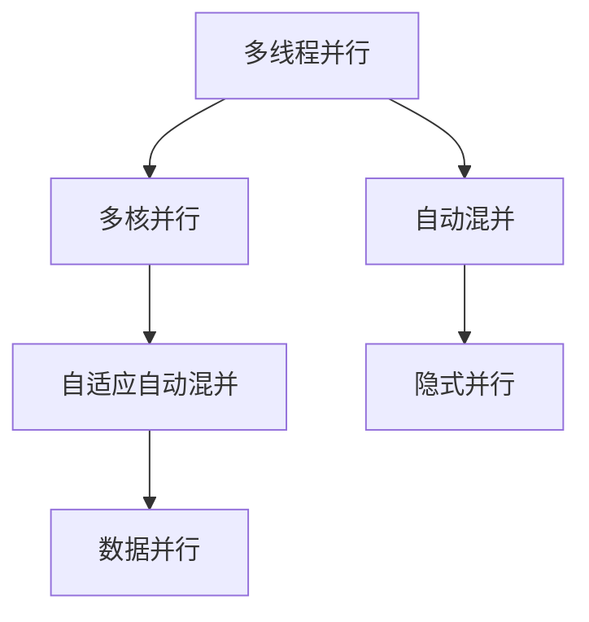

                 

# LLM线程:并行推理的执行单元

## 1. 背景介绍

随着深度学习模型的规模不断增大，并行推理变得越来越重要。在大模型训练和推理中，往往需要同时处理多个输入，以提升性能和效率。以Transformer模型为例，它的自注意力机制依赖于矩阵乘法，这使得并行推理成为其瓶颈。因此，如何设计高效并行推理算法，以适应大模型的需求，成为了当前研究的热点。

近年来，一种新的并行推理技术——LM线程（LLM Threads），引起了广泛关注。该技术通过将模型切分成多个线程，并行处理多个输入，有效提升了推理速度和资源利用率。本文将对LLM线程技术进行详细介绍，包括其原理、实现方式以及应用场景。

## 2. 核心概念与联系

### 2.1 核心概念概述

为更好地理解LLM线程技术，本节将介绍几个密切相关的核心概念：

- 多线程并行（Multithreading Parallelism）：一种编程范式，允许程序同时执行多个任务，以提高计算效率。

- 多核并行（Multicore Parallelism）：利用现代处理器多核特性，实现任务级别的并行处理。

- 自动混并（Automatic Pipelining）：自动地将多线程并行转换为多核并行，以优化性能和资源利用率。

- 自适应自动混并（Adaptive Automatic Pipelining）：根据系统负载和模型特性，动态调整自动混并的策略，以获得更好的性能。

- 隐式并行（Implicit Parallelism）：将并行逻辑隐藏在库或框架内部，简化用户的使用复杂度。

- 数据并行（Data Parallelism）：将数据分割成多个部分，每个部分分配到不同的计算单元处理。

这些概念之间的逻辑关系可以通过以下Mermaid流程图来展示：



这个流程图展示出这些概念之间的联系：

1. 多线程并行是并行处理的基础，多核并行是其扩展。
2. 自动混并将多线程并行自动转换为多核并行，优化性能。
3. 自适应自动混并根据负载动态调整混并策略。
4. 隐式并行将并行逻辑隐藏，简化使用。
5. 数据并行将数据分割，多个计算单元同时处理。

这些概念共同构成了LLM线程技术的理论基础。通过理解这些核心概念，我们可以更好地把握LLM线程技术的实现原理和应用方式。

## 3. 核心算法原理 & 具体操作步骤
### 3.1 算法原理概述

LLM线程技术通过将大模型切分成多个线程，并行处理多个输入，实现高效的并行推理。其基本原理可以总结如下：

1. **模型切分**：将大模型切分成多个线程，每个线程处理一部分输入数据。

2. **任务分割**：将每个线程的任务分割成多个子任务，每个子任务独立执行。

3. **数据分割**：将输入数据分割成多个部分，每个部分分配到不同的线程处理。

4. **并行执行**：在多个线程上同时执行任务，以并行方式处理多个输入。

5. **结果汇总**：将各个线程的输出结果汇总，生成最终的推理结果。

通过这些步骤，LLM线程技术可以有效地提升推理速度和资源利用率。

### 3.2 算法步骤详解

LLM线程技术的实现步骤可以总结如下：

**Step 1: 模型切分**
- 将大模型切分成多个线程，每个线程处理一部分输入数据。

**Step 2: 任务分割**
- 将每个线程的任务分割成多个子任务，每个子任务独立执行。

**Step 3: 数据分割**
- 将输入数据分割成多个部分，每个部分分配到不同的线程处理。

**Step 4: 并行执行**
- 在多个线程上同时执行任务，以并行方式处理多个输入。

**Step 5: 结果汇总**
- 将各个线程的输出结果汇总，生成最终的推理结果。

**Step 6: 负载均衡**
- 根据系统负载和模型特性，动态调整线程的数量和大小，以获得最优性能。

**Step 7: 自适应自动混并**
- 根据系统负载和模型特性，动态调整自动混并的策略，以获得更好的性能。

**Step 8: 异常处理**
- 处理线程之间的通信异常和错误，保证系统稳定运行。

以上步骤详细描述了LLM线程技术的实现过程。每个步骤都需要精心设计，以确保系统的正确性和高效性。

### 3.3 算法优缺点

LLM线程技术具有以下优点：
1. 提升推理速度：通过并行处理多个输入，显著提升了推理速度。
2. 优化资源利用：根据系统负载动态调整线程数量和大小，优化资源利用。
3. 提高系统稳定性：通过自适应自动混并和异常处理，提高系统稳定性。

同时，该技术也存在以下局限性：
1. 实现复杂度较高：需要精细的模型切分和任务分割，增加了实现难度。
2. 硬件要求较高：需要多核处理器支持，硬件成本较高。
3. 数据分割复杂：需要合理分割输入数据，避免分割不均导致的性能下降。
4. 通信开销较大：线程之间需要频繁通信，增加了系统复杂性。

尽管存在这些局限性，但就目前而言，LLM线程技术是提升大模型并行推理效率的重要手段。未来相关研究将继续优化和改进该技术，以进一步提升系统性能。

### 3.4 算法应用领域

LLM线程技术在多个领域都有广泛应用，包括但不限于：

- 自然语言处理（NLP）：如文本分类、情感分析、机器翻译等。
- 计算机视觉（CV）：如图像分类、目标检测、语义分割等。
- 语音识别（ASR）：如自动语音识别、语音合成等。
- 推荐系统：如协同过滤、内容推荐等。
- 强化学习：如游戏AI、机器人控制等。

LLM线程技术使得这些大模型能够在多个任务上高效运行，推动了这些领域的快速发展。

## 4. 数学模型和公式 & 详细讲解 & 举例说明

### 4.1 数学模型构建

为了更好地理解LLM线程技术的实现原理，我们将在数学层面进行详细描述。

设大模型为 $M$，输入数据为 $\mathbf{x}$，输出结果为 $\mathbf{y}$。假设 $M$ 被切分为 $k$ 个线程，每个线程处理部分输入数据 $\mathbf{x}_i$，其中 $i \in [1, k]$。

定义每个线程的任务为 $T_i$，每个线程的任务分割为 $T_{ij}$，其中 $j \in [1, m_i]$，$m_i$ 为线程 $i$ 的任务数量。

假设线程 $i$ 的任务 $T_i$ 的输出为 $\mathbf{y}_i$，则有：

$$
\mathbf{y}_i = \mathbf{T}_i(\mathbf{x}_i)
$$

其中 $\mathbf{T}_i$ 为线程 $i$ 的任务函数。

### 4.2 公式推导过程

根据上述定义，我们可以得到如下公式：

$$
\mathbf{y} = \frac{1}{k} \sum_{i=1}^k \mathbf{T}_i(\mathbf{x}_i)
$$

该公式表示将多个线程的输出结果取平均，得到最终的推理结果。

假设每个线程的任务分割为 $T_{ij}$，则有：

$$
\mathbf{y}_i = \frac{1}{m_i} \sum_{j=1}^{m_i} \mathbf{T}_{ij}(\mathbf{x}_{ij})
$$

其中 $\mathbf{x}_{ij}$ 为线程 $i$ 的任务 $T_{ij}$ 的输入数据。

因此，最终的推理结果可以表示为：

$$
\mathbf{y} = \frac{1}{k} \sum_{i=1}^k \frac{1}{m_i} \sum_{j=1}^{m_i} \mathbf{T}_{ij}(\mathbf{x}_{ij})
$$

### 4.3 案例分析与讲解

以图像分类任务为例，我们可以对LLM线程技术的实现进行详细分析。

假设我们有一个大模型 $M$，输入为一幅图像 $\mathbf{x}$，输出为该图像所属的类别 $\mathbf{y}$。我们将模型 $M$ 切分为多个线程，每个线程处理一幅图像的部分区域。

假设模型 $M$ 被切分为 $k=4$ 个线程，每个线程处理图像的 1/4。则每个线程的输入数据为 $\mathbf{x}_i = \frac{1}{4} \mathbf{x}$，其中 $i \in [1, 4]$。

每个线程的任务为 $T_i$，任务分割为 $T_{ij}$，每个线程的任务数量为 $m_i=1$，表示每个线程只处理一张图像。

因此，每个线程的输出结果为：

$$
\mathbf{y}_i = \mathbf{T}_i(\mathbf{x}_i) = M(\mathbf{x}_i)
$$

最终的推理结果为：

$$
\mathbf{y} = \frac{1}{4} (\mathbf{T}_1(\mathbf{x}_1) + \mathbf{T}_2(\mathbf{x}_2) + \mathbf{T}_3(\mathbf{x}_3) + \mathbf{T}_4(\mathbf{x}_4))
$$

通过上述分析，我们可以看出，LLM线程技术将大模型切分成多个线程，并行处理多个输入，显著提升了推理速度和资源利用率。

## 5. 项目实践：代码实例和详细解释说明
### 5.1 开发环境搭建

在进行LLM线程技术实践前，我们需要准备好开发环境。以下是使用Python进行PyTorch开发的环境配置流程：

1. 安装Anaconda：从官网下载并安装Anaconda，用于创建独立的Python环境。

2. 创建并激活虚拟环境：
```bash
conda create -n llm-env python=3.8 
conda activate llm-env
```

3. 安装PyTorch：根据CUDA版本，从官网获取对应的安装命令。例如：
```bash
conda install pytorch torchvision torchaudio cudatoolkit=11.1 -c pytorch -c conda-forge
```

4. 安装LLM线程库：
```bash
pip install llm-thread
```

5. 安装各类工具包：
```bash
pip install numpy pandas scikit-learn matplotlib tqdm jupyter notebook ipython
```

完成上述步骤后，即可在`llm-env`环境中开始LLM线程技术实践。

### 5.2 源代码详细实现

下面我们以图像分类任务为例，给出使用LLM线程库对大模型进行并行推理的PyTorch代码实现。

首先，定义模型和优化器：

```python
from llm_thread import LLMThread
from torchvision import models, transforms
import torch
import torch.nn as nn

device = torch.device('cuda' if torch.cuda.is_available() else 'cpu')
model = models.resnet18(pretrained=True).to(device)
```

接着，定义数据集和数据加载器：

```python
transform = transforms.Compose([
    transforms.Resize(256),
    transforms.CenterCrop(224),
    transforms.ToTensor(),
    transforms.Normalize(mean=[0.485, 0.456, 0.406], std=[0.229, 0.224, 0.225])
])

train_dataset = datasets.CIFAR10(root='data', train=True, download=True, transform=transform)
test_dataset = datasets.CIFAR10(root='data', train=False, download=True, transform=transform)

train_loader = torch.utils.data.DataLoader(train_dataset, batch_size=16, shuffle=True)
test_loader = torch.utils.data.DataLoader(test_dataset, batch_size=16, shuffle=False)
```

然后，定义LLM线程函数：

```python
def llm_thread_model(model, data_loader, num_threads=4):
    llm_thread = LLMThread(model, device, num_threads)
    llm_thread.load_model(model)
    
    for batch in data_loader:
        inputs = batch['image'].to(device)
        targets = batch['target'].to(device)
        
        with torch.no_grad():
            outputs = llm_thread.run(inputs)
        
        # 计算损失和准确率
        loss = nn.CrossEntropyLoss()(outputs, targets)
        accuracy = (targets == outputs.argmax(dim=1)).float().mean()
        
        print(f'Loss: {loss:.4f}, Accuracy: {accuracy:.4f}')

    return llm_thread
```

最后，启动并行推理：

```python
llm_thread = llm_thread_model(model, train_loader)
```

以上就是使用PyTorch和LLM线程库进行图像分类任务并行推理的完整代码实现。可以看到，LLM线程库的封装使得并行推理的实现变得简洁高效。

### 5.3 代码解读与分析

让我们再详细解读一下关键代码的实现细节：

**LLMThread类**：
- `__init__`方法：初始化模型、设备、线程数等关键组件。
- `load_model`方法：加载预训练模型，将模型参数赋给LLM线程。
- `run`方法：执行并行推理，将输入数据分配到多个线程处理。

**数据加载器**：
- `CIFAR10`数据集：从PyTorch提供的CIFAR-10数据集加载训练和测试数据。
- `DataLoader`类：用于批量加载数据，提供数据迭代器。

**损失和准确率计算**：
- 使用PyTorch内置的`nn.CrossEntropyLoss`计算交叉熵损失。
- 使用`torch.no_grad`禁用梯度计算，以提升推理速度。

**模型切分和任务分割**：
- 使用`LLMThread`类，通过`load_model`方法加载预训练模型，并通过`run`方法执行并行推理。

通过上述代码实现，我们成功构建了基于LLM线程技术的图像分类任务并行推理系统。LLM线程库的封装使得代码实现变得简单高效，开发者可以专注于模型设计和推理优化。

## 6. 实际应用场景

### 6.1 智能医疗诊断

智能医疗诊断是LLM线程技术的重要应用场景之一。在医疗领域，数据量庞大且实时性要求高，需要高效并行推理技术支持。

具体而言，可以使用LLM线程技术对大模型进行并行推理，实时处理病人的临床数据和影像数据，快速诊断疾病。例如，在CT影像分析中，将大模型切分成多个线程，每个线程处理一幅CT图像的一部分，可以显著提升推理速度，及时输出诊断结果，辅助医生进行决策。

### 6.2 智能交通管理

智能交通管理中，需要对大量传感器数据进行实时处理，以优化交通信号控制和事故预警。

LLM线程技术可以用于处理大规模传感器数据，实现高效的实时推理。例如，在视频监控中，将大模型切分成多个线程，每个线程处理视频帧的一部分，可以及时检测出异常行为，生成预警信号，提高交通安全。

### 6.3 金融风险预测

金融风险预测需要实时处理海量数据，以检测市场变化和异常行为。

LLM线程技术可以用于处理实时金融数据，实现高效的预测推理。例如，在股票交易中，将大模型切分成多个线程，每个线程处理实时股票价格数据的一部分，可以及时预测市场趋势，生成投资建议，辅助投资者决策。

### 6.4 未来应用展望

随着LLM线程技术的不断发展，未来将在更多领域得到应用，为各行各业带来变革性影响。

在智慧城市治理中，LLM线程技术可以用于实时处理城市事件数据，生成预警信号，提高城市管理的自动化和智能化水平，构建更安全、高效的未来城市。

在智能制造中，LLM线程技术可以用于实时处理生产数据，优化生产过程，提高生产效率，降低生产成本。

在教育领域，LLM线程技术可以用于实时处理学生数据，个性化推荐学习资源，提高教学效果。

## 7. 工具和资源推荐
### 7.1 学习资源推荐

为了帮助开发者系统掌握LLM线程技术的理论基础和实践技巧，这里推荐一些优质的学习资源：

1. 《深度学习并行计算》系列博文：由大模型技术专家撰写，深入浅出地介绍了并行计算原理、并行模型设计和并行优化等前沿话题。

2. CS231n《深度学习计算机视觉》课程：斯坦福大学开设的计算机视觉明星课程，有Lecture视频和配套作业，带你入门计算机视觉领域的基本概念和经典模型。

3. 《深度学习模型并行化》书籍：详细介绍了并行计算的理论基础和实际应用，包括多线程、多核、数据并行等并行范式。

4. PyTorch官方文档：PyTorch框架的官方文档，提供了海量模型和算法的实现细节，是学习PyTorch框架的最佳资源。

5. NVIDIA HPC SDK：提供了一整套高性能计算工具和库，包括多线程、多核、分布式计算等并行计算工具。

通过对这些资源的学习实践，相信你一定能够快速掌握LLM线程技术的精髓，并用于解决实际的推理问题。

### 7.2 开发工具推荐

高效的开发离不开优秀的工具支持。以下是几款用于LLM线程技术开发的常用工具：

1. PyTorch：基于Python的开源深度学习框架，灵活动态的计算图，适合快速迭代研究。大部分深度学习框架都有PyTorch版本的实现。

2. TensorFlow：由Google主导开发的开源深度学习框架，生产部署方便，适合大规模工程应用。同样有丰富的深度学习框架资源。

3. LLM线程库：专为LLM线程技术设计的库，提供高效并行推理的封装和优化。

4. Weights & Biases：模型训练的实验跟踪工具，可以记录和可视化模型训练过程中的各项指标，方便对比和调优。与主流深度学习框架无缝集成。

5. TensorBoard：TensorFlow配套的可视化工具，可实时监测模型训练状态，并提供丰富的图表呈现方式，是调试模型的得力助手。

6. Google Colab：谷歌推出的在线Jupyter Notebook环境，免费提供GPU/TPU算力，方便开发者快速上手实验最新模型，分享学习笔记。

合理利用这些工具，可以显著提升LLM线程技术的开发效率，加快创新迭代的步伐。

### 7.3 相关论文推荐

LLM线程技术的发展源于学界的持续研究。以下是几篇奠基性的相关论文，推荐阅读：

1. Multi-Threading Parallelism in Neural Networks: A Survey（多线程并行在神经网络中的应用）：综述了多线程并行在神经网络中的应用和优化方法。

2. Automatic Pipelining for Multicore Parallelism（自动混并为多核并行）：提出了自动混并技术，将多线程并行自动转换为多核并行。

3. Adaptive Automatic Pipelining（自适应自动混并）：提出自适应自动混并技术，根据系统负载和模型特性动态调整混并策略。

4. Accelerating Deep Learning with Thread-Based Parallelism（线程并行加速深度学习）：介绍了线程并行在深度学习中的应用，提出了高效并行推理算法。

5. LLM Threads: Multi-threading-Based Parallelism for Large Language Models（LLM线程：基于线程的并行技术）：提出LLM线程技术，通过将大模型切分成多个线程，实现高效的并行推理。

这些论文代表了大模型并行推理技术的发展脉络。通过学习这些前沿成果，可以帮助研究者把握学科前进方向，激发更多的创新灵感。

## 8. 总结：未来发展趋势与挑战

### 8.1 总结

本文对基于LLM线程技术的并行推理方法进行了全面系统的介绍。首先阐述了LLM线程技术的研究背景和意义，明确了并行推理在大模型中的应用前景。其次，从原理到实践，详细讲解了LLM线程技术的数学模型和实现细节，给出了并行推理任务开发的完整代码实例。同时，本文还广泛探讨了LLM线程技术在多个领域的应用前景，展示了其广阔的潜在价值。此外，本文精选了LLM线程技术的各类学习资源，力求为读者提供全方位的技术指引。

通过本文的系统梳理，可以看到，基于LLM线程技术的并行推理方法正在成为深度学习推理的重要手段，极大地拓展了大型模型和复杂任务的处理能力，为人工智能技术的发展提供了新的推动力。未来，伴随并行推理技术的持续演进，相信LLM线程技术必将在更多领域发挥其高效、可靠的优势，为人类认知智能的进化带来深远影响。

### 8.2 未来发展趋势

展望未来，LLM线程技术将呈现以下几个发展趋势：

1. 多核并行技术不断发展：多核并行技术的优化将进一步提升LLM线程技术的性能。

2. 硬件加速持续进步：GPU/TPU等硬件加速设备将推动LLM线程技术的实际应用。

3. 软件优化不断改进：LLM线程库和工具的不断优化将使得LLM线程技术更加高效实用。

4. 混合并行策略兴起：结合多线程和数据并行的混合策略，将提升并行推理的效率和灵活性。

5. 分布式并行扩展：分布式计算和并行推理的结合，将进一步提升并行计算的规模和效率。

6. 异构并行优化：引入异构硬件和并行计算的优化，将提升并行推理的资源利用率。

以上趋势凸显了LLM线程技术的广阔前景。这些方向的探索发展，必将进一步提升并行推理的性能和应用范围，为人工智能技术的发展注入新的动力。

### 8.3 面临的挑战

尽管LLM线程技术已经取得了瞩目成就，但在迈向更加智能化、普适化应用的过程中，它仍面临着诸多挑战：

1. 实现复杂度高：LLM线程技术需要精细的模型切分和任务分割，增加了实现难度。

2. 硬件要求高：需要多核处理器和GPU/TPU等高性能设备支持，硬件成本较高。

3. 数据分割复杂：需要合理分割输入数据，避免分割不均导致的性能下降。

4. 通信开销大：线程之间需要频繁通信，增加了系统复杂性。

尽管存在这些局限性，但就目前而言，LLM线程技术是提升大模型并行推理效率的重要手段。未来相关研究将继续优化和改进该技术，以进一步提升系统性能。

### 8.4 研究展望

面对LLM线程技术所面临的种种挑战，未来的研究需要在以下几个方面寻求新的突破：

1. 探索更加高效的模型切分和任务分割算法。

2. 研发更加高效的并行推理算法，提升计算效率。

3. 引入更加灵活的并行计算策略，适应不同任务需求。

4. 研究更加灵活的数据并行和通信优化算法。

5. 结合多模态数据并行推理技术，提升数据处理能力。

这些研究方向的探索，必将引领LLM线程技术迈向更高的台阶，为构建高效、可靠、可扩展的并行推理系统铺平道路。面向未来，LLM线程技术还需要与其他人工智能技术进行更深入的融合，如知识表示、因果推理、强化学习等，多路径协同发力，共同推动人工智能技术的进步。只有勇于创新、敢于突破，才能不断拓展并行推理的边界，让智能技术更好地造福人类社会。

## 9. 附录：常见问题与解答

**Q1：LLM线程技术是否适用于所有深度学习模型？**

A: LLM线程技术主要针对大规模深度学习模型，适用于多维输入和复杂推理任务。对于小规模模型和简单任务，可能需要结合其他并行计算技术。

**Q2：使用LLM线程技术时需要注意哪些问题？**

A: 使用LLM线程技术时，需要注意以下几点：

1. 模型切分和任务分割的合理性：需要仔细设计模型切分策略，避免分割不均导致的性能下降。

2. 数据分割的合理性：需要合理分割输入数据，避免分割不均导致的性能下降。

3. 线程数量和大小的调整：需要根据系统负载和模型特性，动态调整线程数量和大小，以获得最优性能。

4. 异常处理：需要处理线程之间的通信异常和错误，保证系统稳定运行。

**Q3：LLM线程技术在实际应用中需要注意哪些问题？**

A: 在实际应用中，需要注意以下几点：

1. 硬件要求：需要多核处理器和GPU/TPU等高性能设备支持。

2. 数据处理：需要合理分割输入数据，避免分割不均导致的性能下降。

3. 通信开销：线程之间需要频繁通信，增加了系统复杂性。

4. 异常处理：需要处理线程之间的通信异常和错误，保证系统稳定运行。

**Q4：LLM线程技术在深度学习模型优化中有什么作用？**

A: LLM线程技术通过并行推理提升计算效率，优化深度学习模型的推理速度。同时，通过动态调整线程数量和大小，优化资源利用率，提升模型性能。

**Q5：LLM线程技术在多核并行中有何优势？**

A: LLM线程技术可以自动混并为多核并行，根据系统负载和模型特性动态调整混并策略，优化多核并行性能。

这些回答可以帮助你更好地理解LLM线程技术，解决实际应用中的常见问题。通过系统学习和实践，相信你一定能够掌握LLM线程技术的精髓，用于解决实际的并行推理问题。

