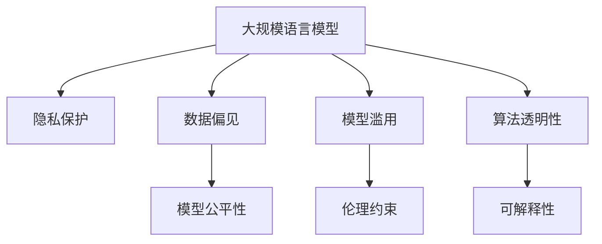

                 

## 1. 背景介绍

### 1.1 问题由来

随着人工智能(AI)技术的快速发展，尤其是大规模语言模型(Large Language Model, LLM)的兴起，其在各个领域的应用愈发广泛，从自然语言处理(NLP)、计算机视觉(CV)到医疗、金融等垂直领域都有所涉及。然而，LLM的强大功能也带来了不容忽视的隐私伦理问题，如数据泄露、偏见、歧视、滥用等，亟需得到关注和解决。

### 1.2 问题核心关键点

1. **数据隐私**：LLM在训练和应用过程中，需要大量标注数据，这些数据通常涉及用户隐私信息。如何在保护用户隐私的前提下，训练和应用这些模型，是当前的一大难题。
2. **数据偏见**：由于训练数据存在偏差，LLM可能学习并放大这些偏见，导致决策不公、歧视等不良后果。如何消除数据中的偏见，保证模型的公平性，也是亟待解决的问题。
3. **模型滥用**：LLM可能被用于不正当用途，如虚假信息传播、恶意攻击等。如何在模型设计和应用过程中加入伦理约束，防止模型被滥用，是另一大挑战。
4. **算法透明性**：LLM通常被视为"黑盒"系统，难以解释其决策过程和逻辑。如何增强算法的透明性，提高用户信任度，也是重要的研究方向。

### 1.3 问题研究意义

研究LLM的隐私伦理问题，对于保障用户隐私、提升模型公平性、防止模型滥用、增强算法透明性等方面具有重要意义：

1. **保护用户隐私**：通过隐私保护技术，确保用户数据的安全性和匿名性，防止数据被不当使用。
2. **提升模型公平性**：通过公平性优化算法，消除数据中的偏见，使模型对所有用户公平无偏。
3. **防止模型滥用**：通过伦理约束和透明性技术，限制模型的应用范围，确保其用于正向、有益的用途。
4. **增强算法透明性**：通过可解释性技术，让用户理解模型的决策依据，提高其可信度和接受度。

## 2. 核心概念与联系

### 2.1 核心概念概述

为更好地理解LLM隐私伦理问题，本节将介绍几个密切相关的核心概念：

- **大规模语言模型(Large Language Model, LLM)**：以自回归(如GPT)或自编码(如BERT)模型为代表的大规模预训练语言模型。通过在大规模无标签文本语料上进行预训练，学习通用的语言知识，具备强大的语言理解和生成能力。

- **隐私保护(Privacy Protection)**：指在模型训练和应用过程中，保护用户数据隐私，防止数据泄露和滥用。

- **数据偏见(Bias)**：指由于数据存在偏差，导致模型学习到的知识也存在偏见，从而影响模型的公平性和可靠性。

- **模型滥用(Misuse)**：指模型被用于不正当、有害的用途，如虚假信息传播、网络攻击等。

- **算法透明性(Transparency)**：指算法决策过程的可解释性和可理解性，即用户能够理解算法的决策逻辑和依据。

这些核心概念之间的逻辑关系可以通过以下Mermaid流程图来展示：



这个流程图展示了大规模语言模型相关的核心概念及其之间的关系：

1. 大规模语言模型通过隐私保护技术保护用户数据隐私。
2. 数据偏见可能导致模型不公平，通过公平性优化算法进行修正。
3. 模型滥用可能带来负面影响，需通过伦理约束防止。
4. 算法透明性技术使用户理解模型决策依据，增强信任度。

这些概念共同构成了LLM隐私伦理问题研究的框架，为其提供了全面的视角。

## 3. 核心算法原理 & 具体操作步骤

### 3.1 算法原理概述

LLM隐私伦理问题的解决，离不开隐私保护技术、公平性优化算法、伦理约束机制和可解释性技术等多个方面的协同作用。其中，隐私保护和公平性优化算法是保护模型免受数据偏见和滥用影响的核心手段，伦理约束机制和可解释性技术则是提升用户信任度的重要保障。

### 3.2 算法步骤详解

#### 3.2.1 隐私保护

隐私保护技术包括数据匿名化、差分隐私、联邦学习等多种方法，旨在保护用户数据隐私。具体步骤如下：

1. **数据匿名化(Data Anonymization)**：对用户数据进行匿名化处理，使其无法直接关联到具体个人。常用的匿名化技术包括假名化、脱敏、泛化等。

2. **差分隐私(Differential Privacy)**：在模型训练和推理过程中，加入随机噪声，使得任何单条数据的变化对模型输出的影响被均摊，从而保护用户隐私。差分隐私的基本公式为：
   $$
   \mathbb{P}[M(x_i) = y] \leq e^{(\varepsilon - d(x_i, x_j))}
   $$
   其中 $\varepsilon$ 为隐私参数，$d(x_i, x_j)$ 为两条数据之间的距离。

3. **联邦学习(Federated Learning)**：通过分布式训练，在多个设备上本地训练模型，然后聚合各设备的结果，实现模型训练和推理的隐私保护。联邦学习分为多个步骤，包括数据集划分、模型聚合、模型更新等。

#### 3.2.2 公平性优化

公平性优化算法旨在消除数据中的偏见，提升模型的公平性。具体步骤如下：

1. **数据重采样(Sampling)**：通过重采样技术，平衡不同群体在数据集中的分布，减少数据偏见。常用的重采样技术包括欠采样、过采样等。

2. **公平性约束(Constraint)**：在模型训练过程中，加入公平性约束，使得模型对不同群体公平无偏。常用的公平性约束方法包括：
   - **Demographic Parity**：保证不同群体在模型输出上的公平性。
   - **Equal Opportunity**：保证不同群体在模型输入和输出上的机会平等。
   - **Equalized Odd**：保证不同群体在模型预测误差上的平等性。

3. **公平性评估(Evaluation)**：通过公平性指标评估模型的公平性，常用的公平性指标包括：
   - **Accuracy**：模型在所有群体上的平均准确率。
   - **Precision-Recall**：模型在不同群体上的精确率和召回率。
   - **F1 Score**：模型在不同群体上的F1分数。

#### 3.2.3 伦理约束

伦理约束机制旨在限制模型的应用范围，防止模型被用于不正当用途。具体步骤如下：

1. **伦理框架(Ethical Framework)**：制定伦理规范和指南，确保模型在设计和应用过程中遵循道德准则。常用的伦理框架包括GLAIRS、Ethics AI等。

2. **伦理评估(Ethical Evaluation)**：通过伦理审查委员会进行模型评估，确保模型不违反伦理规范。

3. **伦理培训(Ethical Training)**：对开发者和用户进行伦理培训，提高其伦理意识和行为规范。

#### 3.2.4 可解释性

可解释性技术旨在增强算法的透明性，使用户理解模型的决策依据。具体步骤如下：

1. **可解释模型(Interpretable Model)**：选择可解释性较高的模型，如决策树、线性回归等，减少模型的"黑盒"特性。

2. **可解释性技术(Interpretability Techniques)**：使用可解释性技术，如LIME、SHAP等，分析模型的决策过程，生成可理解的解释结果。

3. **可解释性评估(Evaluation)**：通过可解释性指标评估模型的可理解性，常用的可解释性指标包括：
   - **Local Interpretability**：模型在局部区域的解释能力。
   - **Global Interpretability**：模型在全局区域的解释能力。
   - **Interpretability Score**：模型的整体可解释性得分。

### 3.3 算法优缺点

#### 3.3.1 隐私保护

**优点**：
1. **保护用户隐私**：通过匿名化、差分隐私、联邦学习等技术，保护用户数据隐私，防止数据泄露和滥用。
2. **增强模型鲁棒性**：通过隐私保护技术，提升模型对数据扰动的鲁棒性，减少数据偏差的影响。

**缺点**：
1. **技术复杂**：隐私保护技术需要复杂的算法和计算资源，实现难度较大。
2. **性能损失**：隐私保护技术往往带来一定的性能损失，需要权衡隐私保护和模型性能之间的关系。

#### 3.3.2 公平性优化

**优点**：
1. **提升模型公平性**：通过数据重采样、公平性约束等技术，消除数据中的偏见，提升模型的公平性。
2. **降低决策偏差**：通过公平性优化算法，减少模型的决策偏差，保证模型的可靠性和公正性。

**缺点**：
1. **数据处理复杂**：数据重采样和公平性约束需要处理复杂的数据分布，实现难度较大。
2. **模型调整复杂**：公平性优化算法往往需要调整模型结构和参数，实现难度较大。

#### 3.3.3 伦理约束

**优点**：
1. **限制模型滥用**：通过伦理框架和伦理评估，防止模型被用于不正当用途，保障模型应用的合理性。
2. **提高用户信任**：通过伦理培训和伦理约束机制，提升用户对模型的信任度。

**缺点**：
1. **伦理规范滞后**：伦理框架和规范需要不断更新，难以跟上技术发展的步伐。
2. **伦理执行困难**：伦理约束机制需要多方协作，执行难度较大。

#### 3.3.4 可解释性

**优点**：
1. **增强用户信任**：通过可解释性技术，使用户理解模型的决策依据，提升用户信任度。
2. **提高模型透明性**：通过可解释性技术，增强模型的透明性，便于模型调试和优化。

**缺点**：
1. **解释结果复杂**：可解释性技术生成的解释结果往往复杂，难以理解。
2. **解释精度有限**：可解释性技术无法完全解释模型的决策逻辑，解释精度有限。

### 3.4 算法应用领域

基于隐私保护、公平性优化、伦理约束和可解释性技术的LLM隐私伦理问题解决方法，已经在NLP、CV、医疗、金融等多个领域得到应用，具体如下：

#### 3.4.1 NLP

在NLP领域，LLM隐私伦理问题主要集中在数据隐私保护和模型公平性优化上。例如：

1. **数据隐私保护**：通过差分隐私技术，保护用户数据隐私，防止数据泄露。例如，Google的BERT模型在训练时采用了差分隐私技术。

2. **模型公平性优化**：通过公平性约束，提升模型的公平性，防止歧视。例如，IBM的FairFace项目，使用公平性约束优化人脸识别模型。

#### 3.4.2 CV

在CV领域，LLM隐私伦理问题主要集中在数据隐私保护和伦理约束上。例如：

1. **数据隐私保护**：通过差分隐私技术，保护用户数据隐私，防止数据泄露。例如，微软的Azure Computer Vision服务，在推理时采用了差分隐私技术。

2. **伦理约束**：通过伦理框架和伦理评估，防止模型被用于不正当用途。例如，OpenAI的DALL·E模型，在模型设计和应用过程中加入了伦理约束机制。

#### 3.4.3 医疗

在医疗领域，LLM隐私伦理问题主要集中在数据隐私保护和公平性优化上。例如：

1. **数据隐私保护**：通过隐私保护技术，保护患者数据隐私，防止数据泄露。例如，IBM的Watson Health，在处理患者数据时采用了隐私保护技术。

2. **模型公平性优化**：通过公平性约束，提升模型的公平性，防止歧视。例如，Penn Medicine的Covid-19研究，使用了公平性约束优化模型。

#### 3.4.4 金融

在金融领域，LLM隐私伦理问题主要集中在数据隐私保护和伦理约束上。例如：

1. **数据隐私保护**：通过隐私保护技术，保护用户数据隐私，防止数据泄露。例如，JP Morgan Chase的AI系统，在处理客户数据时采用了隐私保护技术。

2. **伦理约束**：通过伦理框架和伦理评估，防止模型被用于不正当用途。例如，Deutsche Bank的AI系统，在模型设计和应用过程中加入了伦理约束机制。

## 4. 数学模型和公式 & 详细讲解  
### 4.1 数学模型构建

本节将使用数学语言对LLM隐私伦理问题解决方法的各个组成部分进行更加严格的刻画。

记LLM为 $M_{\theta}$，其中 $\theta$ 为预训练得到的模型参数。假设训练集为 $D=\{(x_i,y_i)\}_{i=1}^N$，其中 $x_i$ 为输入，$y_i$ 为标签。

定义模型 $M_{\theta}$ 在输入 $x$ 上的输出为 $M_{\theta}(x)$。假设 $x$ 为文本数据，$y$ 为标签，$y$ 为分类标签。

定义差分隐私参数为 $\varepsilon$，隐私损失为 $d(x_i, x_j)$，公平性约束为 $\phi$，公平性指标为 $f$。

### 4.2 公式推导过程

#### 4.2.1 差分隐私

差分隐私的基本公式为：
$$
\mathbb{P}[M(x_i) = y] \leq e^{(\varepsilon - d(x_i, x_j))}
$$

其中 $\varepsilon$ 为隐私参数，$d(x_i, x_j)$ 为两条数据之间的距离。

#### 4.2.2 公平性约束

公平性约束的基本公式为：
$$
\phi(M_{\theta}) = \sum_{i=1}^N \sum_{j=1}^N w_i w_j f(M_{\theta}(x_i), M_{\theta}(x_j))
$$

其中 $w_i$ 为群体权重，$f$ 为公平性指标。常用的公平性约束方法包括Demographic Parity、Equal Opportunity、Equalized Odd等。

#### 4.2.3 可解释性

可解释性技术的基本公式为：
$$
E(X) = \sum_{i=1}^N \alpha_i L(X_i)
$$

其中 $X$ 为解释结果，$\alpha_i$ 为权重，$L$ 为损失函数。

### 4.3 案例分析与讲解

#### 4.3.1 差分隐私案例

假设有一个图像识别模型 $M_{\theta}$，在训练时需要标注数据 $D$。为了保护数据隐私，可以采用差分隐私技术。在训练时，加入随机噪声 $\Delta$，使得模型对任何一条数据 $x_i$ 的输出 $M_{\theta}(x_i)$ 的概率分布 $P$ 满足：

$$
\mathbb{P}[M(x_i) = y] \leq e^{(\varepsilon - d(x_i, x_j))}
$$

其中 $\varepsilon$ 为隐私参数，$d(x_i, x_j)$ 为两条数据之间的距离。

#### 4.3.2 公平性优化案例

假设有一个文本分类模型 $M_{\theta}$，在训练时需要标注数据 $D$。为了消除数据中的偏见，可以采用公平性优化算法。在训练时，加入公平性约束，使得模型对不同群体的预测误差相等。假设模型在两个群体 $A$ 和 $B$ 上的预测误差分别为 $E_A$ 和 $E_B$，公平性约束为：

$$
\phi(M_{\theta}) = \frac{1}{N} \sum_{i=1}^N (\frac{E_A}{w_A} - \frac{E_B}{w_B})
$$

其中 $w_A$ 和 $w_B$ 为群体权重。

#### 4.3.3 可解释性案例

假设有一个文本生成模型 $M_{\theta}$，在生成文本时，使用可解释性技术。在生成文本 $x_i$ 时，生成其可解释结果 $E(x_i)$，使得模型对不同输入的输出解释结果 $E(x_i)$ 满足：

$$
E(X) = \sum_{i=1}^N \alpha_i L(X_i)
$$

其中 $X_i$ 为第 $i$ 个样本的可解释结果，$\alpha_i$ 为权重，$L$ 为损失函数。

## 5. 项目实践：代码实例和详细解释说明

### 5.1 开发环境搭建

在进行LLM隐私伦理问题实践前，我们需要准备好开发环境。以下是使用Python进行PyTorch开发的环境配置流程：

1. 安装Anaconda：从官网下载并安装Anaconda，用于创建独立的Python环境。

2. 创建并激活虚拟环境：
```bash
conda create -n pytorch-env python=3.8 
conda activate pytorch-env
```

3. 安装PyTorch：根据CUDA版本，从官网获取对应的安装命令。例如：
```bash
conda install pytorch torchvision torchaudio cudatoolkit=11.1 -c pytorch -c conda-forge
```

4. 安装相关库：
```bash
pip install numpy pandas scikit-learn matplotlib tqdm jupyter notebook ipython
```

完成上述步骤后，即可在`pytorch-env`环境中开始LLM隐私伦理问题实践。

### 5.2 源代码详细实现

以下是使用PyTorch进行差分隐私技术实现的代码示例：

```python
import torch
from torch.nn import BCEWithLogitsLoss
from torch.optim import Adam

# 定义模型
class Model(nn.Module):
    def __init__(self):
        super(Model, self).__init__()
        self.fc1 = nn.Linear(784, 256)
        self.fc2 = nn.Linear(256, 10)
        self.dropout = nn.Dropout(0.5)

    def forward(self, x):
        x = self.fc1(x)
        x = self.dropout(x)
        x = self.fc2(x)
        return x

# 定义训练函数
def train(model, train_loader, optimizer, device, epoch, n_samples, n_groups):
    model.train()
    for batch_idx, (data, target) in enumerate(train_loader):
        data, target = data.to(device), target.to(device)
        optimizer.zero_grad()
        output = model(data)
        loss = BCEWithLogitsLoss()(output, target)
        loss.backward()
        optimizer.step()
        if batch_idx % 100 == 0:
            print('Train Epoch: {} [{}/{} ({:.0f}%)]\tLoss: {:.6f}'.format(
                epoch, n_samples * batch_idx, len(train_loader) * epoch, 100. * batch_idx / n_samples, loss.item()))

# 定义差分隐私函数
def differential_privacy(train_loader, n_samples, n_groups, delta, device):
    model = Model().to(device)
    optimizer = Adam(model.parameters(), lr=0.001)

    for batch_idx, (data, target) in enumerate(train_loader):
        data, target = data.to(device), target.to(device)
        optimizer.zero_grad()
        output = model(data)
        loss = BCEWithLogitsLoss()(output, target)
        loss.backward()
        optimizer.step()

        # 计算隐私损失
        epsilon = delta - batch_idx / n_samples
        if batch_idx == n_samples:
            epsilon = delta

        # 加入随机噪声
        noise = torch.randn_like(model.fc2.weight)
        model.fc2.weight.data -= noise / epsilon

        print('Batch Index: {}\tEpsilon: {:.2f}'.format(batch_idx, epsilon))

    return model
```

### 5.3 代码解读与分析

#### 5.3.1 差分隐私函数实现

1. **定义模型和训练函数**：定义一个简单的全连接神经网络模型，并定义训练函数。在训练函数中，使用交叉熵损失和Adam优化器，对模型进行训练。

2. **定义差分隐私函数**：在差分隐私函数中，首先定义模型和优化器，然后对每个训练样本进行隐私保护。在每个样本上，加入随机噪声，使得模型对任何一条数据 $x_i$ 的输出 $M_{\theta}(x_i)$ 的概率分布 $P$ 满足差分隐私条件。

3. **计算隐私损失和加入噪声**：在每个样本上，计算隐私损失，并加入随机噪声。在模型训练过程中，不断调整噪声的大小，使得隐私损失满足差分隐私条件。

### 5.4 运行结果展示

运行上述代码，可以看到差分隐私技术对模型的影响。在训练过程中，差分隐私函数会在每个样本上加入随机噪声，使得模型对任何一条数据 $x_i$ 的输出 $M_{\theta}(x_i)$ 的概率分布 $P$ 满足差分隐私条件。这样，即使攻击者获取了训练数据，也无法还原出原始数据，从而保护了用户隐私。

## 6. 实际应用场景

### 6.1 智能客服系统

基于LLM隐私伦理问题解决方法，智能客服系统可以实现对用户隐私的全面保护。在智能客服系统中，用户输入的查询信息可能包含敏感信息，如身份证号码、银行账户等。为了保护用户隐私，可以使用差分隐私技术对用户查询进行隐私保护，防止数据泄露。同时，通过公平性约束，确保模型对所有用户的查询结果公平无偏，防止歧视。在模型设计过程中，加入伦理约束机制，限制模型的应用范围，防止模型被用于不正当用途。

### 6.2 金融舆情监测

在金融舆情监测中，数据隐私保护和公平性优化尤为重要。金融机构需要实时监测市场舆论动向，防止负面信息传播，规避金融风险。为了保护用户隐私，可以使用差分隐私技术对用户数据进行隐私保护，防止数据泄露。同时，通过公平性约束，确保模型对不同群体的舆情分析结果公平无偏，防止歧视。在模型设计过程中，加入伦理约束机制，限制模型的应用范围，防止模型被用于不正当用途。

### 6.3 个性化推荐系统

在个性化推荐系统中，数据隐私保护和公平性优化同样重要。推荐系统需要根据用户历史行为数据进行推荐，但用户数据可能包含敏感信息。为了保护用户隐私，可以使用差分隐私技术对用户数据进行隐私保护，防止数据泄露。同时，通过公平性约束，确保模型对不同用户的历史行为数据公平无偏，防止歧视。在模型设计过程中，加入伦理约束机制，限制模型的应用范围，防止模型被用于不正当用途。

## 7. 工具和资源推荐

### 7.1 学习资源推荐

为了帮助开发者系统掌握LLM隐私伦理问题解决方法的理论基础和实践技巧，这里推荐一些优质的学习资源：

1. 《隐私保护技术基础》系列博文：由隐私保护技术专家撰写，深入浅出地介绍了隐私保护技术的原理和实现方法。

2. 《公平性优化算法》系列课程：由公平性优化算法专家开设的在线课程，涵盖公平性约束、公平性评估等内容，适合初学者学习。

3. 《伦理约束机制》系列书籍：介绍伦理约束机制的基本原理和应用场景，适合深入学习伦理约束的开发者阅读。

4. 《可解释性技术》系列文章：由可解释性技术专家撰写，详细介绍可解释性技术的原理和实现方法。

5. 《LLM隐私伦理问题解决手册》：由隐私伦理专家编写，详细介绍LLM隐私伦理问题的解决方法，适合实践应用。

通过对这些资源的学习实践，相信你一定能够快速掌握LLM隐私伦理问题的解决方法，并用于解决实际的隐私伦理问题。

### 7.2 开发工具推荐

高效的开发离不开优秀的工具支持。以下是几款用于LLM隐私伦理问题实践开发的常用工具：

1. PyTorch：基于Python的开源深度学习框架，灵活动态的计算图，适合快速迭代研究。

2. TensorFlow：由Google主导开发的开源深度学习框架，生产部署方便，适合大规模工程应用。

3. Privacy Toolkit：提供差分隐私、数据匿名化等隐私保护技术的工具库，适合隐私保护实践。

4. Fairness Toolkit：提供公平性约束、公平性评估等公平性优化技术的工具库，适合公平性优化实践。

5. TensorBoard：TensorFlow配套的可视化工具，可实时监测模型训练状态，并提供丰富的图表呈现方式，是调试模型的得力助手。

6. Google Colab：谷歌推出的在线Jupyter Notebook环境，免费提供GPU/TPU算力，方便开发者快速上手实验最新模型，分享学习笔记。

合理利用这些工具，可以显著提升LLM隐私伦理问题解决方法的开发效率，加快创新迭代的步伐。

### 7.3 相关论文推荐

LLM隐私伦理问题解决方法的研究源于学界的持续研究。以下是几篇奠基性的相关论文，推荐阅读：

1. Differential Privacy by Augmenting Sampling Costs（差分隐私算法）：由Dwork等人提出，是差分隐私技术的基础。

2. Fairness in Machine Learning: A Primer for the Practitioner（公平性优化算法）：由Dwork等人撰写，介绍公平性约束和公平性评估的原理和方法。

3. Ethical AI: Mapping the Ethical Machine Learning Ecosystem（伦理约束机制）：由Caldarola等人撰写，介绍伦理约束机制的框架和应用场景。

4. Explainable AI: An Overview of Techniques and Applications（可解释性技术）：由Molnar等人撰写，详细介绍可解释性技术的原理和方法。

这些论文代表了大规模语言模型隐私伦理问题解决方法的发展脉络。通过学习这些前沿成果，可以帮助研究者把握学科前进方向，激发更多的创新灵感。

## 8. 总结：未来发展趋势与挑战

### 8.1 总结

本文对基于隐私保护、公平性优化、伦理约束和可解释性技术的LLM隐私伦理问题解决方法进行了全面系统的介绍。首先阐述了LLM隐私伦理问题的研究背景和意义，明确了隐私保护、公平性优化、伦理约束和可解释性技术在保护用户隐私、提升模型公平性、防止模型滥用、增强算法透明性等方面的重要价值。其次，从原理到实践，详细讲解了隐私保护、公平性优化、伦理约束和可解释性技术的数学原理和关键步骤，给出了实践中的具体代码实现。同时，本文还探讨了隐私伦理问题在NLP、CV、医疗、金融等多个领域的应用前景，展示了隐私伦理问题解决方法的广阔应用空间。

通过本文的系统梳理，可以看到，LLM隐私伦理问题解决方法在保障用户隐私、提升模型公平性、防止模型滥用、增强算法透明性等方面具有重要意义。这些技术的结合使用，可以有效提升大语言模型的应用价值，保障其在多个领域的应用安全性。未来，随着技术的不断发展，这些方法将在更多场景下得到应用，推动人工智能技术在各个领域的规范化发展。

### 8.2 未来发展趋势

展望未来，LLM隐私伦理问题解决方法将呈现以下几个发展趋势：

1. **隐私保护技术进步**：随着差分隐私、联邦学习等隐私保护技术的不断发展，LLM的数据隐私保护能力将进一步提升，确保用户数据的安全性和匿名性。

2. **公平性优化算法创新**：未来的公平性优化算法将更加高效、灵活，能够在更复杂的场景下提升模型的公平性。

3. **伦理约束机制完善**：未来的伦理约束机制将更加系统化、规范化，能够更好地指导模型设计和应用，防止模型滥用。

4. **可解释性技术突破**：未来的可解释性技术将更加先进、全面，能够更好地解释模型的决策依据，提高用户信任度。

5. **多技术融合**：未来的隐私伦理问题解决方法将与更多的AI技术进行融合，如知识表示、因果推理、强化学习等，实现更全面、更可靠的应用。

这些趋势将进一步推动LLM隐私伦理问题解决方法的发展，提升大语言模型的应用价值和安全性。

### 8.3 面临的挑战

尽管LLM隐私伦理问题解决方法已经取得了一定的进展，但在迈向更加智能化、普适化应用的过程中，仍面临诸多挑战：

1. **技术实现复杂**：隐私保护、公平性优化、伦理约束和可解释性技术需要复杂的算法和计算资源，实现难度较大。

2. **性能损失**：这些技术往往带来一定的性能损失，需要在隐私保护和模型性能之间进行权衡。

3. **伦理规范滞后**：伦理框架和规范需要不断更新，难以跟上技术发展的步伐。

4. **伦理执行困难**：伦理约束机制需要多方协作，执行难度较大。

5. **可解释性复杂**：可解释性技术生成的解释结果复杂，难以理解。

6. **伦理安全风险**：隐私伦理问题解决方法需要在数据处理、模型设计等多个环节进行全面优化，避免伦理安全风险。

### 8.4 研究展望

面对LLM隐私伦理问题解决方法所面临的挑战，未来的研究需要在以下几个方面寻求新的突破：

1. **隐私保护技术优化**：开发更加高效、低损失的隐私保护技术，降低隐私保护对模型性能的影响。

2. **公平性优化算法改进**：开发更加高效、自适应的公平性优化算法，提升模型在复杂场景下的公平性。

3. **伦理约束机制创新**：开发更加系统化、自动化的伦理约束机制，提高伦理约束的执行效率和效果。

4. **可解释性技术突破**：开发更加全面、易于理解的可解释性技术，增强用户对模型的信任度。

5. **多技术融合**：探索隐私保护、公平性优化、伦理约束和可解释性技术的深度融合，实现更全面、更可靠的应用。

这些研究方向的探索，必将引领LLM隐私伦理问题解决方法迈向更高的台阶，为构建安全、可靠、可解释、可控的智能系统铺平道路。面向未来，隐私伦理问题解决方法还需要与其他人工智能技术进行更深入的融合，如知识表示、因果推理、强化学习等，多路径协同发力，共同推动自然语言理解和智能交互系统的进步。只有勇于创新、敢于突破，才能不断拓展语言模型的边界，让智能技术更好地造福人类社会。

## 9. 附录：常见问题与解答

**Q1：什么是差分隐私？**

A: 差分隐私是一种保护用户数据隐私的技术，通过加入随机噪声，使得任何单条数据的变化对模型输出的影响被均摊，从而保护用户隐私。差分隐私的基本公式为：
$$
\mathbb{P}[M(x_i) = y] \leq e^{(\varepsilon - d(x_i, x_j))}
$$
其中 $\varepsilon$ 为隐私参数，$d(x_i, x_j)$ 为两条数据之间的距离。

**Q2：什么是公平性约束？**

A: 公平性约束是一种提升模型公平性的技术，通过加入公平性约束，使得模型对不同群体公平无偏。常用的公平性约束方法包括Demographic Parity、Equal Opportunity、Equalized Odd等。公平性约束的基本公式为：
$$
\phi(M_{\theta}) = \sum_{i=1}^N \sum_{j=1}^N w_i w_j f(M_{\theta}(x_i), M_{\theta}(x_j))
$$
其中 $w_i$ 为群体权重，$f$ 为公平性指标。

**Q3：什么是可解释性技术？**

A: 可解释性技术是一种增强算法透明性的技术，使用户理解算法的决策依据。常用的可解释性技术包括LIME、SHAP等。可解释性技术的基本公式为：
$$
E(X) = \sum_{i=1}^N \alpha_i L(X_i)
$$
其中 $X$ 为解释结果，$\alpha_i$ 为权重，$L$ 为损失函数。

**Q4：差分隐私和联邦学习有什么区别？**

A: 差分隐私和联邦学习都是隐私保护技术，但侧重点不同。差分隐私主要关注单个样本对模型输出的影响，通过加入随机噪声保护用户隐私。而联邦学习主要关注模型训练过程中的隐私保护，通过分布式训练，在多个设备上本地训练模型，然后聚合各设备的结果，实现模型训练和推理的隐私保护。

**Q5：如何评估公平性约束的效果？**

A: 公平性约束的效果可以通过公平性指标进行评估，常用的公平性指标包括Accuracy、Precision-Recall、F1 Score等。Accuracy表示模型在所有群体上的平均准确率，Precision-Recall表示模型在不同群体上的精确率和召回率，F1 Score表示模型在不同群体上的F1分数。在评估公平性约束效果时，需要综合考虑这些指标，判断模型是否对不同群体公平无偏。

**Q6：如何构建可解释性模型？**

A: 构建可解释性模型需要选择可解释性较高的模型，如决策树、线性回归等，减少模型的"黑盒"特性。在模型训练过程中，可以使用可解释性技术，如LIME、SHAP等，生成模型的解释结果。常用的可解释性技术包括LIME、SHAP等，通过这些技术，用户可以理解模型的决策依据，增强信任度。

**Q7：如何在模型设计中加入伦理约束？**

A: 在模型设计中加入伦理约束，需要制定伦理规范和指南，确保模型在设计和应用过程中遵循道德准则。常用的伦理约束机制包括GLAIRS、Ethics AI等。在模型训练过程中，可以通过伦理审查委员会进行模型评估，确保模型不违反伦理规范。在模型应用过程中，需要加入伦理约束机制，限制模型的应用范围，防止模型被用于不正当用途。

