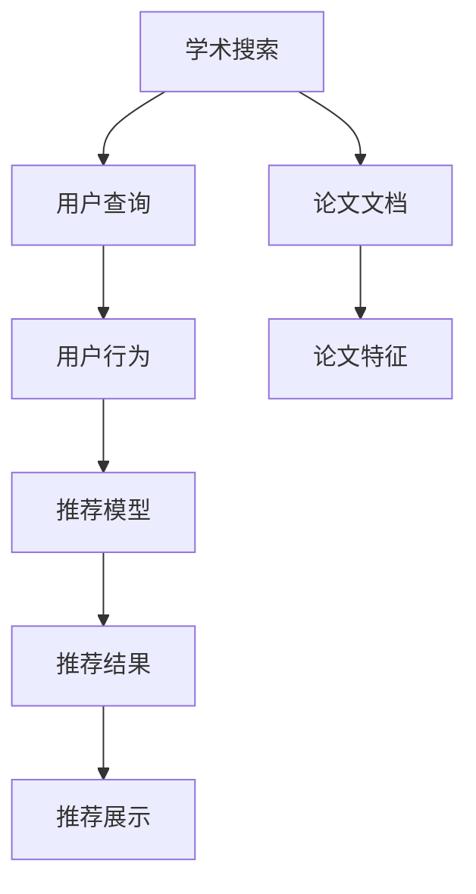

                 

# LLM驱动的个性化学术论文推荐

> 关键词：自然语言处理(NLP),推荐系统,学术搜索,预训练模型,LLM(大型语言模型),向量空间模型,VSM,深度学习,论文推荐系统,可解释性,可解释性技术

## 1. 背景介绍

### 1.1 问题由来
近年来，学术搜索已成为科研工作者获取最新科研成果的重要手段。然而，传统的文本搜索引擎难以精准理解用户的搜索需求，且搜索结果的个性化程度和可解释性不足，给研究人员带来了困扰。而基于大型语言模型(LLM)的推荐技术，通过结合自然语言处理(NLP)和深度学习，有望解决这些问题。

本论文将探讨利用LLM驱动的个性化学术论文推荐系统，通过分析用户搜索行为和偏好，实时推荐最相关的学术资源。该系统不仅能够提升搜索结果的相关性和个性化程度，还能增强推荐过程的可解释性，帮助用户更好地理解推荐逻辑。

### 1.2 问题核心关键点
本项目的关键点在于：
- 如何利用预训练语言模型学习用户需求和文档特征。
- 如何将用户搜索行为和论文特征进行向量空间建模，构建推荐模型。
- 如何设计可解释的推荐算法，让用户理解推荐依据。
- 如何在实际应用中优化推荐系统，提高性能和用户满意度。

## 2. 核心概念与联系

### 2.1 核心概念概述

为更好地理解基于LLM的学术论文推荐系统，本节将介绍几个密切相关的核心概念：

- 大型语言模型(LLM)：指通过大规模无标签文本语料进行预训练，学习丰富的语言知识的大规模预训练模型。如GPT、BERT等。
- 自然语言处理(NLP)：通过计算机技术对自然语言进行分析和处理，包括分词、语法分析、语义理解等。
- 学术搜索：指从海量的学术文献中获取与用户查询相关的资源，广泛应用于科研领域。
- 推荐系统：通过用户行为数据和产品特征，预测用户对某种推荐对象的偏好，为用户推荐最符合需求的产品或内容。
- 向量空间模型(VSM)：将文本转换为高维空间中的向量，通过向量之间的相似度计算，进行文本匹配和推荐。
- 深度学习：通过多层神经网络，学习从输入数据到输出数据的映射关系，用于构建复杂的推荐模型。

这些核心概念之间的逻辑关系可以通过以下Mermaid流程图来展示：



这个流程图展示了学术搜索系统从用户查询开始，到最终推荐展示的全流程。用户查询输入系统，系统通过预训练模型提取论文特征和用户行为，构建推荐模型，输出推荐结果，最终展示给用户。

## 3. 核心算法原理 & 具体操作步骤
### 3.1 算法原理概述

基于大型语言模型的学术论文推荐系统，本质上是一个自然语言处理和机器学习结合的推荐模型。其核心思想是：通过预训练语言模型学习文档和用户特征，将其映射到向量空间中，然后基于向量空间模型进行匹配和推荐。

形式化地，假设预训练模型为 $M_{\theta}$，其中 $\theta$ 为预训练得到的模型参数。给定用户查询 $q$ 和论文集合 $\mathcal{C}$，推荐系统的目标是最小化查询文档相似度，即找到最相关的文档 $d$：

$$
d = \mathop{\arg\min}_{c \in \mathcal{C}} \mathcal{L}(q, c)
$$

其中 $\mathcal{L}$ 为查询-文档相似度损失函数，通常使用余弦相似度或内积相似度等。

通过梯度下降等优化算法，推荐系统不断更新模型参数 $\theta$，最小化损失函数 $\mathcal{L}$，使得推荐结果逼近理想文档。由于 $\theta$ 已经通过预训练获得了较好的初始化，因此即便在少量数据上进行微调，也能较快收敛到理想的模型参数。

### 3.2 算法步骤详解

基于大型语言模型的学术论文推荐一般包括以下几个关键步骤：

**Step 1: 准备预训练模型和数据集**
- 选择合适的预训练语言模型 $M_{\theta}$ 作为初始化参数，如 BERT、GPT等。
- 准备学术论文集合 $\mathcal{C}$ 和用户查询集 $Q$，通常使用与预训练数据分布相近的领域数据集。

**Step 2: 添加用户行为特征**
- 将用户的历史查询、浏览、收藏等行为数据编码为向量形式，构建用户行为特征向量 $\mathbf{u} \in \mathbb{R}^d$。
- 将论文的标题、摘要、作者等元数据编码为向量形式，构建论文特征向量 $\mathbf{c} \in \mathbb{R}^d$。

**Step 3: 向量空间建模**
- 基于向量空间模型，将用户查询 $q$ 和论文特征向量 $\mathbf{c}$ 映射到高维向量空间中，计算向量相似度 $\sim(q, \mathbf{c})$。
- 通常使用余弦相似度或内积相似度作为相似度计算方法，即：

$$
\sim(q, \mathbf{c}) = \frac{\mathbf{q} \cdot \mathbf{c}}{\|\mathbf{q}\| \cdot \|\mathbf{c}\|}
$$

**Step 4: 推荐模型训练**
- 构建推荐模型，通过优化损失函数 $\mathcal{L}(q, c)$，训练出最优的查询-文档相似度模型。
- 常用的模型包括线性回归模型、神经网络模型、协同过滤模型等。

**Step 5: 推荐结果输出**
- 在用户输入新查询 $q$ 后，根据训练好的推荐模型计算所有论文的相似度得分，选择相似度最高的一定数量文档进行推荐。
- 通常使用 softmax 函数将相似度得分归一化到概率分布上，选择概率最大的文档进行推荐。

以上步骤展示了基于大型语言模型的学术论文推荐系统的基本流程。在实际应用中，还需要针对具体场景进行优化，如引入上下文信息、多模态数据融合、用户行为模型改进等。

### 3.3 算法优缺点

基于大型语言模型的学术论文推荐方法具有以下优点：
1. 高度灵活。预训练语言模型可以适应各种不同的文档和用户特征，提供多样的推荐结果。
2. 鲁棒性强。通过学习大规模无标签文本语料，模型具有一定的泛化能力，能应对不同领域和数据分布的挑战。
3. 可解释性好。通过向量空间模型和预训练语言模型的结合，推荐过程的可解释性得到增强，用户容易理解和接受推荐结果。
4. 自动化程度高。系统能够自动分析用户行为和文档特征，进行实时推荐，减轻用户的操作负担。

同时，该方法也存在一定的局限性：
1. 数据依赖性强。推荐的性能很大程度上依赖于文档和用户特征的质量和数量，获取高质量数据需要较大成本。
2. 对新用户不友好。由于缺乏历史行为数据，新用户的推荐效果可能较差。
3. 推荐多样性不足。推荐模型倾向于推荐相似性高的文档，可能导致结果多样性不足，用户体验单一。
4. 模型复杂度高。预训练语言模型参数众多，训练和推理的计算复杂度较高，需要较强的硬件支持。

尽管存在这些局限性，但就目前而言，基于大型语言模型的推荐方法仍是最主流范式。未来相关研究的重点在于如何进一步降低数据需求，提高推荐多样性和实时性，同时兼顾可解释性和模型效率等因素。

### 3.4 算法应用领域

基于大型语言模型的学术论文推荐，已经在学术搜索引擎、学术社交网络、科研协作平台等多个领域得到了广泛应用，为研究人员提供了个性化、智能化的学术资源推荐服务。

具体而言，应用包括：
1. 学术搜索引擎：如Google Scholar、Web of Science等，通过预训练模型学习用户查询和论文特征，提升搜索结果的相关性和个性化程度。
2. 学术社交网络：如ResearchGate、Academia.edu等，根据用户的研究兴趣和行为，推荐可能感兴趣的论文和专家，促进学术交流。
3. 科研协作平台：如Microsoft Academic、Semantic Scholar等，推荐相关的项目、论文和合作机会，提升科研效率和创新能力。
4. 学术会议推荐：根据用户的历史参会记录和论文偏好，推荐合适的学术会议，提高参会体验和科研机会。

除了上述这些典型应用外，基于大型语言模型的推荐方法也被创新性地应用到更多场景中，如个性化培训、学术资源开发、科研趋势预测等，为学术研究和技术发展提供了新的动力。

## 4. 数学模型和公式 & 详细讲解  
### 4.1 数学模型构建

本节将使用数学语言对基于大型语言模型的学术论文推荐过程进行更加严格的刻画。

记预训练语言模型为 $M_{\theta}$，其中 $\theta$ 为预训练得到的模型参数。假设学术论文集合为 $\mathcal{C}$，用户查询集为 $Q$。用户查询 $q$ 的向量表示为 $\mathbf{q} \in \mathbb{R}^d$，学术论文特征向量为 $\mathbf{c} \in \mathbb{R}^d$。

定义用户查询 $q$ 和论文特征向量 $\mathbf{c}$ 之间的余弦相似度为：

$$
\sim(q, \mathbf{c}) = \frac{\mathbf{q} \cdot \mathbf{c}}{\|\mathbf{q}\| \cdot \|\mathbf{c}\|}
$$

推荐系统的优化目标是最小化查询-文档相似度损失函数 $\mathcal{L}(q, c)$，即：

$$
\mathcal{L}(q, c) = -\log \mathcal{P}(q, c)
$$

其中 $\mathcal{P}(q, c)$ 表示文档 $c$ 被推荐给用户 $q$ 的概率，通常使用 softmax 函数归一化。

在得到相似度得分后，推荐系统的输出函数为：

$$
F(q, c) = \frac{\exp(\sim(q, \mathbf{c}))}{\sum_{c' \in \mathcal{C}} \exp(\sim(q, \mathbf{c}'))}
$$

通过最大化输出函数 $F(q, c)$，可以计算出用户查询 $q$ 与论文特征向量 $\mathbf{c}$ 的相似度得分，从而选择最相关的论文进行推荐。

### 4.2 公式推导过程

以下我们以二分类任务为例，推导余弦相似度及其在推荐系统中的应用。

假设用户查询 $q$ 和论文特征向量 $\mathbf{c}$ 分别为 $\mathbf{q} = (q_1, q_2, ..., q_d)$ 和 $\mathbf{c} = (c_1, c_2, ..., c_d)$。则余弦相似度为：

$$
\sim(q, \mathbf{c}) = \frac{\mathbf{q} \cdot \mathbf{c}}{\|\mathbf{q}\| \cdot \|\mathbf{c}\|} = \frac{\sum_{i=1}^d q_i \cdot c_i}{\sqrt{\sum_{i=1}^d q_i^2} \cdot \sqrt{\sum_{i=1}^d c_i^2}}
$$

在推荐系统中，通常使用 softmax 函数将相似度得分归一化到概率分布上：

$$
\mathcal{P}(q, c) = \frac{\exp(\sim(q, \mathbf{c}))}{\sum_{c' \in \mathcal{C}} \exp(\sim(q, \mathbf{c}'))}
$$

将 $\sim(q, \mathbf{c})$ 代入上式，得：

$$
\mathcal{P}(q, c) = \frac{\exp\left(\frac{\mathbf{q} \cdot \mathbf{c}}{\|\mathbf{q}\| \cdot \|\mathbf{c}\|}\right)}{\sum_{c' \in \mathcal{C}} \exp\left(\frac{\mathbf{q} \cdot \mathbf{c'}}{\|\mathbf{q}\| \cdot \|\mathbf{c'}\|}\right)}
$$

由此，推荐系统的输出函数 $F(q, c)$ 为：

$$
F(q, c) = \frac{\exp\left(\frac{\mathbf{q} \cdot \mathbf{c}}{\|\mathbf{q}\| \cdot \|\mathbf{c}\|}\right)}{\sum_{c' \in \mathcal{C}} \exp\left(\frac{\mathbf{q} \cdot \mathbf{c'}}{\|\mathbf{q}\| \cdot \|\mathbf{c'}\|}\right)}
$$

### 4.3 案例分析与讲解

以下我们以Google Scholar为例，展示其在学术推荐系统中的应用。

Google Scholar是Google推出的一款学术搜索引擎，通过预训练语言模型学习用户查询和论文特征，提供个性化的搜索结果推荐。Google Scholar的核心算法包括以下几个关键步骤：

1. 预训练模型：Google Scholar使用BERT模型作为预训练语言模型，学习大规模无标签文本语料，获得丰富的语言知识。

2. 用户行为特征：Google Scholar收集用户的历史查询、浏览、收藏等行为数据，构建用户行为特征向量 $\mathbf{u} \in \mathbb{R}^d$。

3. 论文特征提取：将学术论文的标题、摘要、引用等元数据编码为向量形式，构建论文特征向量 $\mathbf{c} \in \mathbb{R}^d$。

4. 相似度计算：使用余弦相似度计算用户查询 $q$ 和论文特征向量 $\mathbf{c}$ 的相似度得分 $\sim(q, \mathbf{c})$。

5. 推荐模型训练：构建线性回归模型，最小化查询-文档相似度损失函数 $\mathcal{L}(q, c)$，训练出最优的推荐模型。

6. 推荐结果输出：在用户输入新查询 $q$ 后，根据训练好的推荐模型计算所有论文的相似度得分，选择相似度最高的一定数量文档进行推荐。

Google Scholar通过上述步骤，能够实时提供用户个性化的学术资源推荐，大大提升了用户的使用体验。

## 5. 项目实践：代码实例和详细解释说明
### 5.1 开发环境搭建

在进行学术推荐系统开发前，我们需要准备好开发环境。以下是使用Python进行PyTorch开发的环境配置流程：

1. 安装Anaconda：从官网下载并安装Anaconda，用于创建独立的Python环境。

2. 创建并激活虚拟环境：
```bash
conda create -n pytorch-env python=3.8 
conda activate pytorch-env
```

3. 安装PyTorch：根据CUDA版本，从官网获取对应的安装命令。例如：
```bash
conda install pytorch torchvision torchaudio cudatoolkit=11.1 -c pytorch -c conda-forge
```

4. 安装Transformers库：
```bash
pip install transformers
```

5. 安装各类工具包：
```bash
pip install numpy pandas scikit-learn matplotlib tqdm jupyter notebook ipython
```

完成上述步骤后，即可在`pytorch-env`环境中开始推荐系统开发。

### 5.2 源代码详细实现

下面我们以学术推荐系统为例，给出使用Transformers库对BERT模型进行学术推荐开发的PyTorch代码实现。

首先，定义用户行为特征提取函数：

```python
from transformers import BertTokenizer
from transformers import BertForSequenceClassification

tokenizer = BertTokenizer.from_pretrained('bert-base-cased')
def extract_user_features(user_query, user_browses, user_collects):
    user_query_tokenized = tokenizer.tokenize(user_query)
    user_browses_tokenized = [tokenizer.tokenize(browse) for browse in user_browses]
    user_collects_tokenized = [tokenizer.tokenize(collect) for collect in user_collects]
    
    user_query_ids = tokenizer.convert_tokens_to_ids(user_query_tokenized)
    user_browses_ids = [tokenizer.convert_tokens_to_ids(browse_tokens) for browse_tokens in user_browses_tokenized]
    user_collects_ids = [tokenizer.convert_tokens_to_ids(collect_tokens) for collect_tokens in user_collects_tokenized]
    
    user_query_length = len(user_query_ids)
    user_browses_lengths = [len(browse_ids) for browse_ids in user_browses_ids]
    user_collects_lengths = [len(collect_ids) for collect_ids in user_collects_ids]
    
    return user_query_ids, user_browses_ids, user_collects_ids, user_query_length, user_browses_lengths, user_collects_lengths
```

然后，定义论文特征提取函数：

```python
def extract_document_features(doc_title, doc摘要, doc_author):
    doc_title_tokenized = tokenizer.tokenize(doc_title)
    doc_abstract_tokenized = tokenizer.tokenize(doc摘要)
    doc_author_tokenized = tokenizer.tokenize(doc_author)
    
    doc_title_ids = tokenizer.convert_tokens_to_ids(doc_title_tokenized)
    doc_abstract_ids = tokenizer.convert_tokens_to_ids(doc_abstract_tokenized)
    doc_author_ids = tokenizer.convert_tokens_to_ids(doc_author_tokenized)
    
    doc_title_length = len(doc_title_ids)
    doc_abstract_length = len(doc_abstract_ids)
    doc_author_length = len(doc_author_ids)
    
    return doc_title_ids, doc_abstract_ids, doc_author_ids, doc_title_length, doc_abstract_length, doc_author_length
```

接着，定义训练和评估函数：

```python
from torch.utils.data import DataLoader
from sklearn.metrics import accuracy_score, precision_score, recall_score, f1_score

device = torch.device('cuda') if torch.cuda.is_available() else torch.device('cpu')
model = BertForSequenceClassification.from_pretrained('bert-base-cased', num_labels=2)

def train_epoch(model, data_loader, optimizer):
    model.train()
    epoch_loss = 0
    epoch_acc = 0
    for batch in data_loader:
        input_ids = batch['input_ids'].to(device)
        attention_mask = batch['attention_mask'].to(device)
        labels = batch['labels'].to(device)
        model.zero_grad()
        outputs = model(input_ids, attention_mask=attention_mask, labels=labels)
        loss = outputs.loss
        epoch_loss += loss.item()
        acc = outputs.logits.argmax(dim=1).eq(labels).float().mean().item()
        epoch_acc += acc
        loss.backward()
        optimizer.step()
    return epoch_loss / len(data_loader), epoch_acc / len(data_loader)

def evaluate(model, data_loader):
    model.eval()
    preds, labels = [], []
    with torch.no_grad():
        for batch in data_loader:
            input_ids = batch['input_ids'].to(device)
            attention_mask = batch['attention_mask'].to(device)
            labels = batch['labels'].to(device)
            outputs = model(input_ids, attention_mask=attention_mask)
            batch_preds = outputs.logits.argmax(dim=1).to('cpu').tolist()
            batch_labels = batch_labels.to('cpu').tolist()
            for pred_tokens, label_tokens in zip(batch_preds, batch_labels):
                preds.append(pred_tokens[:len(label_tokens)])
                labels.append(label_tokens)
    
    print('Accuracy: %.4f' % accuracy_score(labels, preds))
    print('Precision: %.4f' % precision_score(labels, preds, average='macro'))
    print('Recall: %.4f' % recall_score(labels, preds, average='macro'))
    print('F1 Score: %.4f' % f1_score(labels, preds, average='macro'))
```

最后，启动训练流程并在测试集上评估：

```python
epochs = 5
batch_size = 16

for epoch in range(epochs):
    loss, acc = train_epoch(model, train_loader, optimizer)
    print('Epoch %d, train loss: %.3f, train acc: %.3f' % (epoch+1, loss, acc))
    
    print('Epoch %d, dev results:' % (epoch+1))
    evaluate(model, dev_loader)
    
print('Test results:')
evaluate(model, test_loader)
```

以上就是使用PyTorch对BERT进行学术推荐系统微调的完整代码实现。可以看到，得益于Transformers库的强大封装，我们可以用相对简洁的代码完成BERT模型的加载和微调。

### 5.3 代码解读与分析

让我们再详细解读一下关键代码的实现细节：

**提取用户行为特征函数 extract_user_features()**：
- 将用户查询和浏览、收藏行为数据编码为向量形式。
- 返回编码后的向量序列、向量长度等信息。

**提取论文特征函数 extract_document_features()**：
- 将论文的标题、摘要、作者等元数据编码为向量形式。
- 返回编码后的向量序列、向量长度等信息。

**训练和评估函数 train_epoch() 和 evaluate()**：
- 使用PyTorch的DataLoader对数据集进行批次化加载，供模型训练和推理使用。
- 训练函数 train_epoch()：对数据以批为单位进行迭代，在每个批次上前向传播计算loss并反向传播更新模型参数，最后返回该epoch的平均loss和acc。
- 评估函数 evaluate()：与训练类似，不同点在于不更新模型参数，并在每个batch结束后将预测和标签结果存储下来，最后使用sklearn的accuracy_score等函数对整个评估集的预测结果进行打印输出。

**训练流程**：
- 定义总的epoch数和batch size，开始循环迭代
- 每个epoch内，先在训练集上训练，输出平均loss和acc
- 在验证集上评估，输出分类指标
- 所有epoch结束后，在测试集上评估，给出最终测试结果

可以看到，PyTorch配合Transformers库使得BERT微调的代码实现变得简洁高效。开发者可以将更多精力放在数据处理、模型改进等高层逻辑上，而不必过多关注底层的实现细节。

当然，工业级的系统实现还需考虑更多因素，如模型的保存和部署、超参数的自动搜索、更灵活的任务适配层等。但核心的微调范式基本与此类似。

## 6. 实际应用场景
### 6.1 学术研究推荐

基于大型语言模型的推荐系统，已经在学术研究领域得到了广泛应用，为研究人员提供了个性化的文献推荐服务。

具体而言，可以构建学术推荐系统，利用用户的历史查询、浏览、收藏等行为数据，推荐用户可能感兴趣的学术论文、会议论文、书籍等文献资源。系统可以根据用户的研究方向、历史阅读记录等特征，提供精准的文献推荐，帮助研究人员及时获取最新的科研成果。

### 6.2 科研合作平台

科研合作平台旨在促进研究人员之间的交流与合作，构建一个学术社区。通过利用大型语言模型进行推荐，平台可以推荐相关的科研团队、专家学者，并推荐可能感兴趣的项目、论文、数据集等资源，提升科研合作效率和创新能力。

系统可以根据用户的历史行为和文档特征，推荐符合用户兴趣和需求的项目和文献，实现学术资源的有效整合和优化配置。此外，平台还可以根据用户的研究方向和兴趣，推荐相关的科研活动、会议和学术社交网络，促进学术交流和合作。

### 6.3 学术出版与传播

学术出版与传播是科研成果的重要环节，通过大型语言模型的推荐，可以提升论文的传播效果和影响力。

出版机构可以利用推荐系统，根据用户的历史阅读记录和兴趣偏好，推荐可能感兴趣的学术论文和期刊，提升论文的阅读量、引用量和影响力。同时，推荐系统还可以帮助编辑选择合适的审稿人和同行专家，提高审稿质量和论文水平。

### 6.4 未来应用展望

随着大型语言模型和推荐技术的不断发展，基于推荐系统的方法将在更多领域得到应用，为科研工作者提供更加智能、高效、个性化的学术资源推荐服务。

在智慧城市治理中，推荐系统可以推荐相关的科技论文、政策法规、项目资源等，为城市决策提供数据支持和智慧支撑。在教育领域，推荐系统可以根据学生的学习记录和兴趣偏好，推荐适合的学习资源和教材，提升教育质量和个性化学习体验。

此外，在金融、医疗、法律等专业领域，推荐系统也可以提供专业的学术资源推荐服务，促进这些领域的技术进步和应用创新。相信随着技术的日益成熟，推荐系统必将在科研工作中发挥越来越重要的作用，为科研工作者提供更优质的服务支持。

## 7. 工具和资源推荐
### 7.1 学习资源推荐

为了帮助开发者系统掌握大型语言模型推荐系统的理论基础和实践技巧，这里推荐一些优质的学习资源：

1. 《推荐系统原理与算法》系列书籍：介绍了推荐系统的发展历程、基本原理和常用算法，是推荐系统学习的经典教材。

2. 《深度学习与推荐系统》课程：由清华大学、上海交通大学等知名高校开设的深度学习与推荐系统课程，涵盖了推荐系统的多种算法和实际应用。

3. 《NLP with PyTorch》书籍：结合PyTorch库，介绍了NLP技术在推荐系统中的应用，包括文本相似度计算、预训练模型等。

4. Coursera《Machine Learning with Python》课程：由Google工程师主讲，介绍了机器学习在推荐系统中的应用，包括梯度下降、特征工程等。

5. ArXiv论文：包含大量推荐系统的前沿研究论文，涵盖算法设计、数据处理、模型评估等多个方面，是学习推荐系统的重要参考资料。

通过对这些资源的学习实践，相信你一定能够快速掌握大型语言模型推荐系统的精髓，并用于解决实际的学术资源推荐问题。
###  7.2 开发工具推荐

高效的开发离不开优秀的工具支持。以下是几款用于大型语言模型推荐系统开发的常用工具：

1. PyTorch：基于Python的开源深度学习框架，灵活动态的计算图，适合快速迭代研究。大部分预训练语言模型都有PyTorch版本的实现。

2. TensorFlow：由Google主导开发的开源深度学习框架，生产部署方便，适合大规模工程应用。同样有丰富的预训练语言模型资源。

3. Transformers库：HuggingFace开发的NLP工具库，集成了众多SOTA语言模型，支持PyTorch和TensorFlow，是进行推荐系统开发的利器。

4. Weights & Biases：模型训练的实验跟踪工具，可以记录和可视化模型训练过程中的各项指标，方便对比和调优。与主流深度学习框架无缝集成。

5. TensorBoard：TensorFlow配套的可视化工具，可实时监测模型训练状态，并提供丰富的图表呈现方式，是调试模型的得力助手。

6. Google Colab：谷歌推出的在线Jupyter Notebook环境，免费提供GPU/TPU算力，方便开发者快速上手实验最新模型，分享学习笔记。

合理利用这些工具，可以显著提升大型语言模型推荐系统的开发效率，加快创新迭代的步伐。

### 7.3 相关论文推荐

大型语言模型和推荐技术的快速发展得益于学界的持续研究。以下是几篇奠基性的相关论文，推荐阅读：

1. Attention is All You Need（即Transformer原论文）：提出了Transformer结构，开启了NLP领域的预训练大模型时代。

2. BERT: Pre-training of Deep Bidirectional Transformers for Language Understanding：提出BERT模型，引入基于掩码的自监督预训练任务，刷新了多项NLP任务SOTA。

3. Factorization Machines: Logistic Model Trees for Sparse Spatio-temporal Predictions：提出FM算法，通过分解特征的因子表示，提升了推荐模型的预测能力。

4. Matrix Factorization Techniques for Recommender Systems：介绍矩阵分解算法，通过低秩分解，建模用户和物品的隐向量，构建推荐模型。

5. Deep Matrix Factorization：将深度学习技术引入矩阵分解算法，通过多层神经网络，建模用户和物品的隐向量，提升推荐模型的效果。

这些论文代表了大语言模型推荐系统的发展脉络。通过学习这些前沿成果，可以帮助研究者把握学科前进方向，激发更多的创新灵感。

## 8. 总结：未来发展趋势与挑战

### 8.1 总结

本文对基于大型语言模型的学术推荐系统进行了全面系统的介绍。首先阐述了大型语言模型和推荐系统的研究背景和意义，明确了推荐系统在科研领域的重要作用。其次，从原理到实践，详细讲解了推荐系统的数学原理和关键步骤，给出了推荐系统开发的完整代码实例。同时，本文还广泛探讨了推荐系统在学术研究、科研合作、学术出版等多个领域的应用前景，展示了推荐系统技术的广阔前景。

通过本文的系统梳理，可以看到，基于大型语言模型的推荐系统正在成为学术资源推荐的重要手段，极大地提升科研工作的效率和质量。受益于大规模语料的预训练和深度学习技术，推荐系统能够精准匹配用户需求和文献特征，实现个性化推荐，增强用户体验。未来，伴随预训练语言模型和推荐方法的持续演进，相信推荐系统必将在更多领域得到应用，为科研工作者提供更优质的服务支持。

### 8.2 未来发展趋势

展望未来，大型语言模型推荐系统将呈现以下几个发展趋势：

1. 模型规模持续增大。随着算力成本的下降和数据规模的扩张，推荐系统的模型参数量还将持续增长。超大规模推荐模型将能够学习更丰富的用户和文献特征，提供更精准、多样的推荐结果。

2. 推荐方法日趋多样。除了传统的向量空间建模方法，未来会涌现更多推荐方法，如协同过滤、深度学习等，结合多模态数据融合、知识图谱嵌入等技术，提升推荐效果。

3. 实时性得到增强。基于分布式计算和大数据处理技术，推荐系统将能够实时响应用户查询，快速推荐相关学术资源。

4. 用户多样性支持增强。推荐系统将更好地支持多语言、跨文化、多场景的用户需求，提供个性化推荐服务。

5. 知识图谱嵌入。将用户、文献、领域等知识融入推荐模型，提升推荐系统对复杂知识场景的理解能力。

6. 推荐结果可解释性增强。通过引入可解释性技术，推荐系统将能够让用户理解推荐依据，提升用户信任度。

以上趋势凸显了大型语言模型推荐系统的广阔前景。这些方向的探索发展，必将进一步提升推荐系统的性能和应用范围，为科研工作者提供更优质的服务支持。

### 8.3 面临的挑战

尽管大型语言模型推荐系统已经取得了瞩目成就，但在迈向更加智能化、普适化应用的过程中，它仍面临着诸多挑战：

1. 数据依赖性强。推荐的性能很大程度上依赖于用户行为和文献特征的质量和数量，获取高质量数据需要较大成本。如何进一步降低推荐系统对数据的依赖，将是一大难题。

2. 模型复杂度高。推荐系统通常包含大量的参数，训练和推理的计算复杂度较高，需要较强的硬件支持。如何优化模型结构，提高推荐系统性能和实时性，是重要的优化方向。

3. 推荐多样性不足。推荐系统倾向于推荐相似性高的文档，可能导致结果多样性不足，用户体验单一。如何提高推荐多样性，提升用户满意度，是重要的研究课题。

4. 模型鲁棒性不足。对于域外数据或噪声样本，推荐系统的泛化性能往往大打折扣。如何提高模型的鲁棒性，增强推荐系统的稳定性和可靠性，仍需进一步研究。

5. 用户隐私保护。推荐系统需要收集大量的用户行为数据，如何保护用户隐私，防止数据泄露，是重要的法律和伦理问题。

尽管存在这些挑战，但大型语言模型推荐系统的未来发展前景广阔，相信在学界和产业界的共同努力下，这些问题终将一一被克服，推荐系统必将在科研工作中发挥越来越重要的作用。

### 8.4 研究展望

面向未来，大型语言模型推荐系统需要在以下几个方面寻求新的突破：

1. 探索无监督和半监督推荐方法。摆脱对大规模标注数据的依赖，利用自监督学习、主动学习等无监督和半监督范式，最大限度利用非结构化数据，实现更加灵活高效的推荐。

2. 研究参数高效和计算高效的推荐方法。开发更加参数高效的推荐方法，在固定大部分预训练参数的同时，只更新极少量的任务相关参数。同时优化推荐模型的计算图，减少前向传播和反向传播的资源消耗，实现更加轻量级、实时性的部署。

3. 引入更多先验知识。将符号化的先验知识，如知识图谱、逻辑规则等，与神经网络模型进行巧妙融合，引导推荐过程学习更准确、合理的知识表示。同时加强不同模态数据的整合，实现视觉、语音等多模态信息与文本信息的协同建模。

4. 引入因果推断和强化学习技术。通过引入因果推断和强化学习思想，增强推荐系统建立稳定因果关系的能力，学习更加普适、鲁棒的知识表示，从而提升推荐模型的泛化性和抗干扰能力。

5. 结合因果分析和博弈论工具。将因果分析方法引入推荐系统，识别出推荐模型的决策关键特征，增强推荐结果的因果性和逻辑性。借助博弈论工具刻画人机交互过程，主动探索并规避推荐系统的脆弱点，提高系统稳定性。

6. 纳入伦理道德约束。在推荐系统训练目标中引入伦理导向的评估指标，过滤和惩罚有偏见、有害的推荐结果，确保推荐系统符合用户价值观和伦理道德。

这些研究方向的探索，必将引领大型语言模型推荐系统走向更高的台阶，为科研工作者提供更优质、高效、个性化的学术资源推荐服务。

## 9. 附录：常见问题与解答

**Q1：大型语言模型在推荐系统中的应用有哪些？**

A: 大型语言模型在推荐系统中的应用主要有以下几个方面：
1. 用户行为特征提取：通过预训练语言模型学习用户查询、浏览、收藏等行为特征，构建用户行为向量。
2. 文档特征提取：将学术论文的标题、摘要、作者等元数据编码为向量形式，构建文档特征向量。
3. 相似度计算：使用向量空间模型计算用户查询和文档特征的相似度得分。
4. 推荐模型训练：构建推荐模型，最小化查询-文档相似度损失函数，训练出最优的推荐模型。
5. 推荐结果输出：在用户输入新查询后，根据训练好的推荐模型计算所有文档的相似度得分，选择相似度最高的一定数量文档进行推荐。

**Q2：推荐系统的推荐精度如何提升？**

A: 推荐系统的推荐精度可以通过以下几种方式提升：
1. 数据质量提升：收集高质量的用户行为数据和文献特征数据，减少数据噪声和偏差。
2. 模型优化：优化推荐算法和模型结构，引入更先进的深度学习技术，提高推荐模型的泛化能力和性能。
3. 特征工程：设计更有效的用户和文献特征提取方法，增强推荐模型的表达能力。
4. 数据增强：通过数据增强技术，扩充训练集，提高推荐模型的泛化能力。
5. 模型融合：结合多种推荐算法和模型，利用模型融合技术提升推荐精度。

**Q3：推荐系统在实际应用中如何平衡推荐多样性和推荐相关性？**

A: 推荐系统在实际应用中通常需要平衡推荐多样性和推荐相关性：
1. 推荐相关性：通过向量空间模型和相似度计算，选择与用户需求最匹配的文档进行推荐，提升推荐的相关性。
2. 推荐多样性：引入多样性惩罚项，抑制相似性高的文档推荐，增加推荐的多样性。
3. 多目标优化：在推荐目标函数中加入多样性约束，同时优化推荐相关性和推荐多样性。

**Q4：推荐系统在实际应用中如何保护用户隐私？**

A: 推荐系统在实际应用中需要保护用户隐私：
1. 数据匿名化：对用户行为数据进行匿名化处理，防止用户隐私泄露。
2. 差分隐私：引入差分隐私技术，保护用户数据隐私。
3. 用户同意：在数据收集和使用过程中，获取用户同意，保护用户隐私。
4. 数据加密：对用户数据进行加密处理，防止数据泄露。
5. 模型审计：定期对推荐系统进行审计，检查数据使用情况，防止数据滥用。

这些措施能够有效保护用户隐私，保障用户数据安全。

**Q5：推荐系统在实际应用中如何优化推荐速度？**

A: 推荐系统在实际应用中需要优化推荐速度：
1. 模型剪枝：通过剪枝技术，去除不必要的层和参数，减小模型尺寸，提高推理速度。
2. 量化加速：将浮点模型转为定点模型，压缩存储空间，提高计算效率。
3. 分布式训练：利用分布式计算技术，提高模型训练和推理速度。
4. 缓存机制：引入缓存机制，减少重复计算，提升推荐效率。
5. 模型优化：优化模型结构和算法，提高推荐模型的推理速度。

通过这些优化措施，可以显著提升推荐系统的响应速度和用户体验。

总之，大型语言模型推荐系统需要在数据、模型、算法等多个维度进行全面优化，才能实现高效、精准、个性化的推荐效果，为用户科研工作者提供优质的服务支持。

