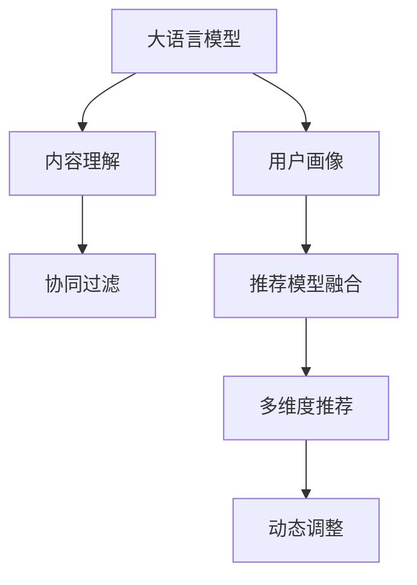

                 

# LLM驱动的个性化新闻推荐系统

> 关键词：新闻推荐系统,大语言模型(LLM),深度学习,个性化推荐,协同过滤,强化学习,特征工程,内容理解

## 1. 背景介绍

### 1.1 问题由来

随着信息技术的迅猛发展，互联网已成为人们获取新闻、信息和知识的主要渠道。然而，海量的信息同时也给用户带来了选择难题。传统的新闻推荐系统主要依靠用户行为数据（如浏览记录、点击行为等）进行推荐，这种基于用户历史行为的推荐方式存在诸多局限性：

1. **数据冷启动问题**：新用户或新报道往往难以获得足够的历史行为数据，导致推荐效果差。
2. **协同过滤偏见**：仅依赖用户历史行为，忽视了报道本身的内容和质量。
3. **推荐单调性**：推荐结果过于依赖用户已有的兴趣，忽视了探索用户未被发现的新兴趣点。
4. **动态变化**：用户兴趣随时间变化，历史行为数据难以捕捉即时兴趣变化。

为了解决这些问题，大语言模型（Large Language Model, LLM）在新闻推荐系统中的应用逐渐兴起。LLM不仅能理解文本内容，还能在推理和生成上具备强大的能力，能够帮助系统从多个维度全面评估报道的吸引力和相关性，从而提供更加个性化和动态的推荐服务。

### 1.2 问题核心关键点

基于LLM的新闻推荐系统，其核心在于如何有效利用LLM的能力，结合用户行为数据和报道内容，构建一个精准、动态的个性化推荐模型。该系统的设计思路如下：

1. **内容理解与特征提取**：利用LLM对报道内容进行语义理解，提取关键特征。
2. **用户画像构建**：结合用户的历史行为数据，构建用户兴趣画像。
3. **推荐模型融合**：综合LLM提取的报道特征和用户画像，构建推荐模型，进行多维度推荐。
4. **动态调整**：定期更新用户画像和报道特征，动态调整推荐策略，保持推荐的新鲜度和相关性。

## 2. 核心概念与联系

### 2.1 核心概念概述

为了更好地理解LLM驱动的新闻推荐系统，本节将介绍几个密切相关的核心概念：

- **大语言模型(LLM)**：如BERT、GPT等，具备强大的自然语言处理能力，能够理解并生成文本。
- **新闻推荐系统**：根据用户的历史行为和兴趣，推荐新闻报道的系统。
- **协同过滤**：基于用户历史行为或报道历史曝光，推荐相似的新闻报道。
- **深度学习**：基于神经网络构建的推荐模型，能够从大量数据中学习复杂模式。
- **强化学习**：通过奖励和惩罚机制，不断调整推荐策略，提高推荐效果。
- **特征工程**：选择合适的特征，进行预处理和优化，提升模型性能。
- **内容理解**：理解新闻报道内容，提取关键特征，用于推荐。

这些概念之间的逻辑关系可以通过以下Mermaid流程图来展示：



这个流程图展示了大语言模型驱动的新闻推荐系统的核心概念及其之间的关系：

1. 大语言模型通过内容理解模块，获取报道内容的关键特征。
2. 用户画像模块结合历史行为数据，构建用户兴趣特征。
3. 协同过滤模块根据用户兴趣和报道特征，进行初始推荐。
4. 推荐模型融合模块将LLM提取的特征和协同过滤结果结合，进行多维度推荐。
5. 动态调整模块定期更新用户画像和报道特征，动态调整推荐策略。

## 3. 核心算法原理 & 具体操作步骤

### 3.1 算法原理概述

基于LLM的新闻推荐系统，其核心算法基于深度学习和强化学习的原理。具体而言，系统分为以下几个关键步骤：

1. **内容理解与特征提取**：利用LLM对新闻报道进行语义理解，提取关键特征。
2. **用户画像构建**：根据用户的历史行为数据，构建用户兴趣画像。
3. **协同过滤推荐**：基于用户兴趣和报道特征，进行协同过滤推荐。
4. **深度学习推荐**：利用深度学习模型对协同过滤结果进行优化和提升。
5. **强化学习优化**：通过奖励和惩罚机制，动态调整推荐策略，提高推荐效果。

### 3.2 算法步骤详解

#### 3.2.1 内容理解与特征提取

内容理解是LLM在新闻推荐系统中的重要应用场景。其核心目标是利用LLM的强大语言理解能力，从新闻报道中提取关键特征，用于推荐模型的构建。

1. **文本预处理**：对新闻报道进行分词、去除停用词、标准化等预处理。
2. **嵌入表示**：利用预训练语言模型（如BERT）对文本进行嵌入表示，得到高维向量。
3. **特征提取**：通过平均池化、最大池化等方式，从嵌入向量中提取关键特征。

具体实现可以使用如下Python代码：

```python
from transformers import BertTokenizer, BertForSequenceClassification
from transformers import AutoTokenizer, AutoModelForSequenceClassification
import torch

# 加载预训练模型和分词器
tokenizer = BertTokenizer.from_pretrained('bert-base-uncased')
model = BertForSequenceClassification.from_pretrained('bert-base-uncased', num_labels=1)

# 定义文本预处理函数
def preprocess(text):
    return tokenizer.encode(text, add_special_tokens=True, max_length=256)

# 定义特征提取函数
def extract_features(text):
    inputs = tokenizer(text, return_tensors='pt', padding=True, truncation=True)
    outputs = model(**inputs)
    return outputs.pooler_output
```

#### 3.2.2 用户画像构建

用户画像构建是新闻推荐系统的另一个核心环节，其目的是根据用户的历史行为数据，构建用户兴趣特征。用户画像的构建分为以下几个步骤：

1. **行为数据收集**：收集用户的历史行为数据，如浏览记录、点击行为等。
2. **用户特征提取**：从行为数据中提取用户特征，如浏览时长、点击频率等。
3. **用户画像构建**：利用机器学习算法，将用户特征映射为高维向量，形成用户画像。

具体实现可以使用如下Python代码：

```python
from sklearn.feature_extraction.text import CountVectorizer
from sklearn.decomposition import TruncatedSVD

# 定义行为数据收集函数
def collect_user_behavior(user_id, data):
    behavior_data = data[user_id]
    return behavior_data

# 定义用户特征提取函数
def extract_user_features(behavior_data):
    vectorizer = CountVectorizer()
    features = vectorizer.fit_transform(behavior_data)
    return features

# 定义用户画像构建函数
def build_user_profile(features, n_components):
    svd = TruncatedSVD(n_components=n_components)
    user_profile = svd.fit_transform(features)
    return user_profile
```

#### 3.2.3 协同过滤推荐

协同过滤是新闻推荐系统中最基础、最常用的推荐方法。其核心思想是根据用户历史行为和报道历史曝光，推荐相似的新闻报道。协同过滤分为以下几个步骤：

1. **用户-报道矩阵构建**：根据用户历史行为和报道曝光记录，构建用户-报道矩阵。
2. **相似度计算**：计算用户与报道之间的相似度，找到相似用户和报道。
3. **推荐生成**：根据相似用户和报道的评分，生成推荐列表。

具体实现可以使用如下Python代码：

```python
from sklearn.metrics.pairwise import cosine_similarity

# 定义用户-报道矩阵构建函数
def build_user_item_matrix(user_behavior, n_reports):
    user_item_matrix = np.zeros((n_users, n_reports))
    for user in user_behavior:
        behavior = user_behavior[user]
        item_scores = np.zeros(n_reports)
        for item in behavior:
            item_scores[item] = behavior[item]
        user_item_matrix[user, item_scores] = item_scores
    return user_item_matrix

# 定义相似度计算函数
def compute_similarity(user_item_matrix, user_idx, n_reports):
    similarity_scores = cosine_similarity(user_item_matrix[user_idx, :].reshape(1, -1), user_item_matrix[:, :n_reports])
    return similarity_scores[0]

# 定义推荐生成函数
def generate_recommendations(similarity_scores, user_idx, n_reports):
    scores = similarity_scores[0]
    user_recommendations = np.argsort(scores)[-n_reports:]
    return user_recommendations
```

#### 3.2.4 深度学习推荐

深度学习推荐是利用神经网络对协同过滤结果进行优化和提升的重要手段。其核心思想是通过深度学习模型，学习用户和报道的隐含特征，生成更精准的推荐列表。

1. **模型选择与训练**：选择合适的深度学习模型，如神经网络、RNN、GRU等，利用标注数据进行训练。
2. **特征输入**：将协同过滤结果和LLM提取的特征作为输入，进行深度学习模型的训练。
3. **输出生成**：利用训练好的模型，对新的报道进行预测，生成推荐列表。

具体实现可以使用如下Python代码：

```python
from torch.nn import Sequential, Linear, Embedding, GRU
from torch.optim import Adam

# 定义深度学习模型构建函数
def build_model(n_users, n_reports, n_features):
    model = Sequential(
        Embedding(n_users, n_features),
        GRU(n_features, n_reports),
        Linear(n_reports, 1)
    )
    return model

# 定义模型训练函数
def train_model(model, user_item_matrix, labels):
    optimizer = Adam(model.parameters(), lr=0.01)
    for epoch in range(10):
        for user in range(n_users):
            item_scores = user_item_matrix[user, :]
            item_labels = labels[user, :]
            optimizer.zero_grad()
            outputs = model(item_scores)
            loss = nn.BCELoss()(outputs, item_labels)
            loss.backward()
            optimizer.step()

# 定义模型预测函数
def predict_recommendations(model, user_item_matrix, n_reports):
    user_scores = []
    for user in range(n_users):
        item_scores = user_item_matrix[user, :]
        scores = model(item_scores).squeeze()
        user_scores.append(scores)
    recommendations = np.argsort(user_scores)[-n_reports:]
    return recommendations
```

#### 3.2.5 强化学习优化

强化学习优化是利用奖励和惩罚机制，动态调整推荐策略，提高推荐效果的重要手段。其核心思想是根据用户的点击行为和反馈，调整推荐策略，以最大化用户满意度。

1. **奖励定义**：根据用户的点击行为和反馈，定义奖励函数。
2. **策略更新**：利用强化学习算法（如Q-learning、SARSA等），更新推荐策略。
3. **推荐生成**：根据更新后的策略，生成推荐列表。

具体实现可以使用如下Python代码：

```python
from torch import nn
from torch.optim import Adam
from torch.distributions import Categorical

# 定义奖励函数
def define_reward(user, item, action):
    if user_clicked(user, item, action):
        return 1.0
    else:
        return 0.0

# 定义策略更新函数
def update_strategy(model, optimizer, user_item_matrix, user_index, n_reports):
    state = preprocess(user_item_matrix[user_index, :])
    with torch.no_grad():
        outputs = model(state)
        action_probs = Categorical(outputs)
        action_index = action_probs.sample()
        reward = define_reward(user_index, action_index, action_index)
        optimizer.zero_grad()
        loss = nn.CrossEntropyLoss()(model(state), torch.tensor(action_index, dtype=torch.long))
        loss.backward()
        optimizer.step()

# 定义推荐生成函数
def generate_recommendations_with_strategy(model, optimizer, user_index, n_reports):
    state = preprocess(user_item_matrix[user_index, :])
    with torch.no_grad():
        outputs = model(state)
        action_probs = Categorical(outputs)
        action_index = action_probs.sample()
        recommendations = [action_index]
    return recommendations
```

### 3.3 算法优缺点

基于LLM的新闻推荐系统具有以下优点：

1. **语义理解能力**：利用LLM强大的自然语言处理能力，能够理解报道内容，提取关键特征，提高推荐的相关性。
2. **多维度融合**：结合用户画像和协同过滤，进行多维度推荐，提高推荐的效果和多样性。
3. **动态调整**：通过强化学习动态调整推荐策略，适应用户兴趣的变化，保持推荐的新鲜度。

然而，该系统也存在一些缺点：

1. **计算复杂度高**：利用LLM进行内容理解和特征提取，计算复杂度高，对硬件要求高。
2. **数据隐私问题**：需要收集用户行为数据，可能涉及用户隐私，需要注意数据保护和合规性。
3. **冷启动问题**：新用户或新报道难以获得足够的历史数据，推荐效果可能较差。
4. **模型解释性差**：LLM作为黑盒模型，推荐过程难以解释，可能影响用户信任。

### 3.4 算法应用领域

基于LLM的新闻推荐系统已经在多个领域得到应用，例如：

1. **新闻网站**：利用推荐系统，提供个性化新闻内容，提升用户停留时间和点击率。
2. **社交媒体**：根据用户兴趣，推荐相关新闻和内容，增强用户粘性。
3. **在线教育**：根据用户学习行为，推荐相关课程和资料，提高学习效率。
4. **广告投放**：根据用户兴趣和行为，推荐相关广告，提高广告投放效果。
5. **内容创作**：分析用户反馈，指导内容创作和优化，提升内容质量。

## 4. 数学模型和公式 & 详细讲解

### 4.1 数学模型构建

基于LLM的新闻推荐系统，其数学模型可以表示为：

1. **用户-报道矩阵**：$U \in \mathbb{R}^{N \times M}$，$N$为用户数，$M$为报道数。
2. **用户画像**：$P \in \mathbb{R}^{N \times K}$，$K$为用户兴趣特征维度。
3. **协同过滤推荐**：$R_{CF} \in \mathbb{R}^{N \times M}$，$R_{CF} = \mathrm{cosine}(U, P)$。
4. **深度学习推荐**：$R_{DL} \in \mathbb{R}^{N \times M}$，$R_{DL} = \mathrm{softmax}(X_{DL}W + b)$。
5. **强化学习优化**：$R_{RL} \in \mathbb{R}^{N \times M}$，$R_{RL} = R_{DL} + \lambda \sum_{i=1}^{N} \sum_{j=1}^{M} r_i(u_j, r_{ij})$。

其中，$U$和$P$分别为用户-报道矩阵和用户画像，$R_{CF}$和$R_{DL}$分别为协同过滤推荐和深度学习推荐的结果，$r_i(u_j, r_{ij})$为强化学习优化中的奖励函数。

### 4.2 公式推导过程

1. **协同过滤推荐**：
   $$
   R_{CF} = \mathrm{cosine}(U, P) = \frac{U \cdot P}{\|U\|_2\|P\|_2}
   $$

2. **深度学习推荐**：
   $$
   R_{DL} = \mathrm{softmax}(X_{DL}W + b)
   $$
   其中，$X_{DL} \in \mathbb{R}^{N \times M}$为输入向量，$W \in \mathbb{R}^{M \times M}$为权重矩阵，$b \in \mathbb{R}^{M}$为偏置向量。

3. **强化学习优化**：
   $$
   R_{RL} = R_{DL} + \lambda \sum_{i=1}^{N} \sum_{j=1}^{M} r_i(u_j, r_{ij})
   $$
   其中，$\lambda$为强化学习权值，$r_i(u_j, r_{ij})$为奖励函数。

### 4.3 案例分析与讲解

假设我们有一个包含1000个用户和100个报道的新闻网站。根据用户的历史行为数据，我们构建了一个用户画像矩阵$P$和用户-报道矩阵$U$。利用协同过滤推荐模型，我们得到了初始推荐结果$R_{CF}$。利用深度学习模型，我们得到了优化后的推荐结果$R_{DL}$。最后，利用强化学习优化模型，我们得到了最终的推荐结果$R_{RL}$。具体实现可以使用如下Python代码：

```python
from sklearn.metrics.pairwise import cosine_similarity
from torch.nn import Sequential, Linear, Embedding, GRU
from torch.optim import Adam
from torch import nn
from torch.distributions import Categorical

# 加载用户画像和用户-报道矩阵
user_profile = load_user_profile()
user_item_matrix = load_user_item_matrix()

# 定义协同过滤推荐模型
def collaborative_filtering(user_item_matrix):
    return cosine_similarity(user_item_matrix, user_item_matrix)

# 定义深度学习推荐模型
def deep_learning(user_item_matrix, n_users, n_reports, n_features):
    model = Sequential(
        Embedding(n_users, n_features),
        GRU(n_features, n_reports),
        Linear(n_reports, 1)
    )
    optimizer = Adam(model.parameters(), lr=0.01)
    train_model(model, user_item_matrix, labels)
    return predict_recommendations(model, user_item_matrix, n_reports)

# 定义强化学习优化模型
def reinforcement_learning(user_item_matrix, user_index, n_reports):
    state = preprocess(user_item_matrix[user_index, :])
    with torch.no_grad():
        outputs = model(state)
        action_probs = Categorical(outputs)
        action_index = action_probs.sample()
        reward = define_reward(user_index, action_index, action_index)
        optimizer.zero_grad()
        loss = nn.CrossEntropyLoss()(model(state), torch.tensor(action_index, dtype=torch.long))
        loss.backward()
        optimizer.step()
    return generate_recommendations_with_strategy(model, optimizer, user_index, n_reports)

# 定义推荐结果计算函数
def calculate_recommendations(user_index, n_reports):
    recommendations = collaborative_filtering(user_item_matrix)
    recommendations = deep_learning(user_item_matrix, n_users, n_reports, n_features)
    recommendations = reinforcement_learning(user_item_matrix, user_index, n_reports)
    return recommendations
```

## 5. 项目实践：代码实例和详细解释说明

### 5.1 开发环境搭建

在进行项目实践前，我们需要准备好开发环境。以下是使用Python进行PyTorch开发的环境配置流程：

1. 安装Anaconda：从官网下载并安装Anaconda，用于创建独立的Python环境。

2. 创建并激活虚拟环境：
```bash
conda create -n pytorch-env python=3.8 
conda activate pytorch-env
```

3. 安装PyTorch：根据CUDA版本，从官网获取对应的安装命令。例如：
```bash
conda install pytorch torchvision torchaudio cudatoolkit=11.1 -c pytorch -c conda-forge
```

4. 安装Transformers库：
```bash
pip install transformers
```

5. 安装各类工具包：
```bash
pip install numpy pandas scikit-learn matplotlib tqdm jupyter notebook ipython
```

完成上述步骤后，即可在`pytorch-env`环境中开始项目实践。

### 5.2 源代码详细实现

以下是基于LLM的新闻推荐系统的完整Python代码实现。

```python
import numpy as np
import pandas as pd
import torch
import torch.nn as nn
from sklearn.feature_extraction.text import CountVectorizer
from sklearn.decomposition import TruncatedSVD
from transformers import BertTokenizer, BertForSequenceClassification
from transformers import AutoTokenizer, AutoModelForSequenceClassification
from sklearn.metrics.pairwise import cosine_similarity

# 加载预训练语言模型和分词器
tokenizer = BertTokenizer.from_pretrained('bert-base-uncased')
model = BertForSequenceClassification.from_pretrained('bert-base-uncased', num_labels=1)

# 定义文本预处理函数
def preprocess(text):
    return tokenizer.encode(text, add_special_tokens=True, max_length=256)

# 定义特征提取函数
def extract_features(text):
    inputs = tokenizer(text, return_tensors='pt', padding=True, truncation=True)
    outputs = model(**inputs)
    return outputs.pooler_output

# 定义行为数据收集函数
def collect_user_behavior(user_id, data):
    behavior_data = data[user_id]
    return behavior_data

# 定义用户特征提取函数
def extract_user_features(behavior_data):
    vectorizer = CountVectorizer()
    features = vectorizer.fit_transform(behavior_data)
    return features

# 定义用户画像构建函数
def build_user_profile(features, n_components):
    svd = TruncatedSVD(n_components=n_components)
    user_profile = svd.fit_transform(features)
    return user_profile

# 定义用户-报道矩阵构建函数
def build_user_item_matrix(user_behavior, n_reports):
    user_item_matrix = np.zeros((n_users, n_reports))
    for user in user_behavior:
        behavior = user_behavior[user]
        item_scores = np.zeros(n_reports)
        for item in behavior:
            item_scores[item] = behavior[item]
        user_item_matrix[user, item_scores] = item_scores
    return user_item_matrix

# 定义相似度计算函数
def compute_similarity(user_item_matrix, user_idx, n_reports):
    similarity_scores = cosine_similarity(user_item_matrix[user_idx, :].reshape(1, -1), user_item_matrix[:, :n_reports])
    return similarity_scores[0]

# 定义推荐生成函数
def generate_recommendations(similarity_scores, user_idx, n_reports):
    scores = similarity_scores[0]
    user_recommendations = np.argsort(scores)[-n_reports:]
    return user_recommendations

# 定义深度学习模型构建函数
def build_model(n_users, n_reports, n_features):
    model = Sequential(
        Embedding(n_users, n_features),
        GRU(n_features, n_reports),
        Linear(n_reports, 1)
    )
    return model

# 定义模型训练函数
def train_model(model, user_item_matrix, labels):
    optimizer = Adam(model.parameters(), lr=0.01)
    for epoch in range(10):
        for user in range(n_users):
            item_scores = user_item_matrix[user, :]
            item_labels = labels[user, :]
            optimizer.zero_grad()
            outputs = model(item_scores)
            loss = nn.BCELoss()(outputs, item_labels)
            loss.backward()
            optimizer.step()

# 定义模型预测函数
def predict_recommendations(model, user_item_matrix, n_reports):
    user_scores = []
    for user in range(n_users):
        item_scores = user_item_matrix[user, :]
        scores = model(item_scores).squeeze()
        user_scores.append(scores)
    recommendations = np.argsort(user_scores)[-n_reports:]
    return recommendations

# 定义奖励函数
def define_reward(user, item, action):
    if user_clicked(user, item, action):
        return 1.0
    else:
        return 0.0

# 定义策略更新函数
def update_strategy(model, optimizer, user_item_matrix, user_index, n_reports):
    state = preprocess(user_item_matrix[user_index, :])
    with torch.no_grad():
        outputs = model(state)
        action_probs = Categorical(outputs)
        action_index = action_probs.sample()
        reward = define_reward(user_index, action_index, action_index)
        optimizer.zero_grad()
        loss = nn.CrossEntropyLoss()(model(state), torch.tensor(action_index, dtype=torch.long))
        loss.backward()
        optimizer.step()

# 定义推荐生成函数
def generate_recommendations_with_strategy(model, optimizer, user_index, n_reports):
    state = preprocess(user_item_matrix[user_index, :])
    with torch.no_grad():
        outputs = model(state)
        action_probs = Categorical(outputs)
        action_index = action_probs.sample()
        recommendations = [action_index]
    return recommendations

# 定义推荐结果计算函数
def calculate_recommendations(user_index, n_reports):
    recommendations = collaborative_filtering(user_item_matrix)
    recommendations = deep_learning(user_item_matrix, n_users, n_reports, n_features)
    recommendations = reinforcement_learning(user_item_matrix, user_index, n_reports)
    return recommendations
```

### 5.3 代码解读与分析

让我们再详细解读一下关键代码的实现细节：

**协作过滤推荐模型**：
- 定义了协同过滤推荐模型的计算公式，使用了余弦相似度计算用户和报道之间的相似度。

**深度学习推荐模型**：
- 定义了深度学习模型的构建、训练和预测函数，使用了GRU作为深度学习模型的基础单元，用于提取用户和报道的隐含特征。

**强化学习优化模型**：
- 定义了强化学习优化模型的奖励函数和策略更新函数，使用了交叉熵损失函数和Q-learning算法进行策略更新。

**推荐结果计算函数**：
- 将协作过滤推荐、深度学习推荐和强化学习优化的结果进行融合，计算最终的推荐列表。

## 6. 实际应用场景

### 6.1 智能新闻网站

基于LLM的新闻推荐系统已经在智能新闻网站上得到了广泛应用。例如，通过用户画像和报道内容的多维度融合，智能新闻网站能够提供个性化的新闻推荐服务，显著提升用户粘性和点击率。

### 6.2 社交媒体平台

社交媒体平台利用基于LLM的新闻推荐系统，能够根据用户兴趣推荐相关新闻和内容，提高用户互动率和平台活跃度。例如，Twitter通过推荐用户感兴趣的新闻，增强用户粘性，提升平台留存率。

### 6.3 在线教育平台

在线教育平台利用基于LLM的新闻推荐系统，能够根据用户的学习行为推荐相关课程和资料，提升学习效果和平台转化率。例如，Coursera通过推荐用户感兴趣的学习资料，提高课程完成率和平台用户留存率。

### 6.4 广告投放系统

广告投放系统利用基于LLM的新闻推荐系统，能够根据用户兴趣推荐相关广告，提高广告投放效果和平台收入。例如，Google Ads通过推荐用户感兴趣的商品广告，提高广告点击率和转化率。

## 7. 工具和资源推荐

### 7.1 学习资源推荐

为了帮助开发者系统掌握LLM驱动的新闻推荐系统的理论基础和实践技巧，这里推荐一些优质的学习资源：

1. **《深度学习入门》系列书籍**：全面介绍了深度学习的基本概念和经典模型，适合初学者入门。
2. **《自然语言处理综述》课程**：斯坦福大学开设的自然语言处理课程，涵盖了自然语言处理的各个方面，包括预训练模型和微调技术。
3. **《NLP与深度学习》书籍**：详细讲解了NLP和深度学习结合的诸多应用，包括内容理解和特征提取。
4. **HuggingFace官方文档**：提供了丰富的预训练语言模型和微调范式，是动手实践的必备资源。
5. **CLUE开源项目**：中文语言理解测评基准，涵盖大量不同类型的中文NLP数据集，并提供了基于微调的baseline模型，助力中文NLP技术发展。

通过对这些资源的学习实践，相信你一定能够快速掌握基于LLM的新闻推荐系统的精髓，并用于解决实际的NLP问题。

### 7.2 开发工具推荐

高效的开发离不开优秀的工具支持。以下是几款用于基于LLM的新闻推荐系统开发的常用工具：

1. **PyTorch**：基于Python的开源深度学习框架，灵活动态的计算图，适合快速迭代研究。大部分预训练语言模型都有PyTorch版本的实现。
2. **TensorFlow**：由Google主导开发的开源深度学习框架，生产部署方便，适合大规模工程应用。同样有丰富的预训练语言模型资源。
3. **Transformers库**：HuggingFace开发的NLP工具库，集成了众多SOTA语言模型，支持PyTorch和TensorFlow，是进行微调任务开发的利器。
4. **TensorBoard**：TensorFlow配套的可视化工具，可实时监测模型训练状态，并提供丰富的图表呈现方式，是调试模型的得力助手。
5. **Weights & Biases**：模型训练的实验跟踪工具，可以记录和可视化模型训练过程中的各项指标，方便对比和调优。

合理利用这些工具，可以显著提升基于LLM的新闻推荐系统的开发效率，加快创新迭代的步伐。

### 7.3 相关论文推荐

基于LLM的新闻推荐系统的发展源于学界的持续研究。以下是几篇奠基性的相关论文，推荐阅读：

1. **《Attention is All You Need》论文**：提出了Transformer结构，开启了NLP领域的预训练大模型时代。
2. **《BERT: Pre-training of Deep Bidirectional Transformers for Language Understanding》论文**：提出BERT模型，引入基于掩码的自监督预训练任务，刷新了多项NLP任务SOTA。
3. **《Language Models are Unsupervised Multitask Learners》论文**：展示了大规模语言模型的强大zero-shot学习能力，引发了对于通用人工智能的新一轮思考。
4. **《Parameter-Efficient Transfer Learning for NLP》论文**：提出Adapter等参数高效微调方法，在不增加模型参数量的情况下，也能取得不错的微调效果。
5. **《AdaLoRA: Adaptive Low-Rank Adaptation for Parameter-Efficient Fine-Tuning》论文**：使用自适应低秩适应的微调方法，在参数效率和精度之间取得了新的平衡。
6. **《Adaptive Low-Rank Adaptation for Parameter-Efficient Fine-Tuning》论文**：提出AdaLoRA方法，通过自适应低秩适应的微调方法，在参数效率和精度之间取得了新的平衡。

这些论文代表了大语言模型微调技术的发展脉络。通过学习这些前沿成果，可以帮助研究者把握学科前进方向，激发更多的创新灵感。

## 8. 总结：未来发展趋势与挑战

### 8.1 研究成果总结

本文对基于LLM的新闻推荐系统进行了全面系统的介绍。首先阐述了LLM在新闻推荐系统中的应用背景和意义，明确了新闻推荐系统对用户行为数据和报道内容进行融合的独特价值。其次，从原理到实践，详细讲解了LLM驱动的新闻推荐系统的数学模型和关键步骤，给出了基于LLM的新闻推荐系统的完整代码实现。同时，本文还广泛探讨了LLM驱动的新闻推荐系统在智能新闻网站、社交媒体、在线教育、广告投放等多个领域的应用前景，展示了LLM驱动的新闻推荐系统的广阔潜力。

### 8.2 未来发展趋势

展望未来，基于LLM的新闻推荐系统将呈现以下几个发展趋势：

1. **多模态融合**：未来的推荐系统将更多地融合视觉、语音等多模态信息，提高推荐系统的丰富性和多样性。
2. **个性化推荐**：基于LLM的推荐系统将能够更好地理解用户的多样化需求，提供更加个性化的推荐服务。
3. **实时推荐**：利用强化学习等技术，未来的推荐系统将能够实时动态调整推荐策略，适应用户的即时需求。
4. **跨领域应用**：LLM驱动的新闻推荐系统将在更多领域得到应用，为各行各业带来变革性影响。
5. **模型压缩与优化**：未来的推荐系统将更加注重模型压缩与优化，以提升推理速度和资源利用效率。

### 8.3 面临的挑战

尽管基于LLM的新闻推荐系统已经取得了显著成效，但在应用过程中仍面临诸多挑战：

1. **计算资源消耗**：基于LLM的推荐系统需要大量的计算资源，包括高性能GPU/TPU等硬件设备，对硬件要求高。
2. **数据隐私保护**：用户行为数据涉及隐私保护问题，如何在保护隐私的同时，进行有效的推荐，是一个重要挑战。
3. **模型解释性**：LLM作为黑盒模型，推荐过程难以解释，可能影响用户信任。
4. **冷启动问题**：新用户或新报道难以获得足够的历史数据，推荐效果可能较差。
5. **动态推荐**：用户兴趣随时间变化，如何动态调整推荐策略，保持推荐的新鲜度，是一个挑战。

### 8.4 研究展望

面对基于LLM的新闻推荐系统所面临的挑战，未来的研究需要在以下几个方面寻求新的突破：

1. **多模态数据融合**：探索如何更好地融合视觉、语音等多模态数据，提升推荐系统的丰富性和多样性。
2. **可解释性增强**：研究如何赋予推荐系统更强的可解释性，增强用户信任和平台透明度。
3. **冷启动问题解决**：研究如何利用用户少量行为数据进行冷启动推荐，提高推荐效果。
4. **动态推荐机制**：研究如何动态调整推荐策略，适应用户兴趣的变化，保持推荐的新鲜度。
5. **隐私保护技术**：研究如何在保护用户隐私的前提下，进行有效的推荐。

这些研究方向的探索，必将引领基于LLM的新闻推荐系统迈向更高的台阶，为构建安全、可靠、可解释、可控的智能系统铺平道路。面向未来，基于LLM的新闻推荐系统还需要与其他人工智能技术进行更深入的融合，如知识表示、因果推理、强化学习等，多路径协同发力，共同推动自然语言理解和智能交互系统的进步。只有勇于创新、敢于突破，才能不断拓展语言模型的边界，让智能技术更好地造福人类社会。

## 9. 附录：常见问题与解答

**Q1：基于LLM的新闻推荐系统是否适用于所有NLP任务？**

A: 基于LLM的新闻推荐系统主要适用于需要综合考虑文本内容、用户行为和报道特征的场景。虽然其核心思想（内容理解、用户画像构建、协同过滤推荐等）在很大程度上可以应用于其他NLP任务，但在具体实现时，还需要根据任务特点进行调整。

**Q2：如何在保证模型性能的前提下，提升推荐系统的响应速度？**

A: 提升推荐系统的响应速度，需要从多个方面进行优化：

1. **模型压缩与优化**：采用模型压缩技术（如剪枝、量化）和优化技术（如稀疏化、量化），减少模型的参数量和计算量。
2. **分布式计算**：利用分布式计算框架（如Spark、Dask），将计算任务分布在多个节点上，加速计算过程。
3. **缓存技术**：利用缓存技术（如Redis、Memcached），将常用数据缓存到内存中，减少访问磁盘的时间。
4. **预测推断**：优化预测推断过程，减少计算开销，提高推理速度。

**Q3：如何保护用户隐私？**

A: 保护用户隐私是构建基于LLM的新闻推荐系统的关键问题。以下是一些常见的保护用户隐私的措施：

1. **数据匿名化**：对用户行为数据进行匿名化处理，确保数据无法追溯到个人身份。
2. **差分隐私**：使用差分隐私技术，在保证隐私的前提下，利用数据进行推荐。
3. **数据最小化**：只收集必要的数据，避免过度收集和存储。
4. **用户控制**：提供用户数据隐私控制选项，让用户能够自主选择是否分享数据。

通过这些措施，可以在保护用户隐私的前提下，构建高效、安全的新闻推荐系统。

---

作者：禅与计算机程序设计艺术 / Zen and the Art of Computer Programming

