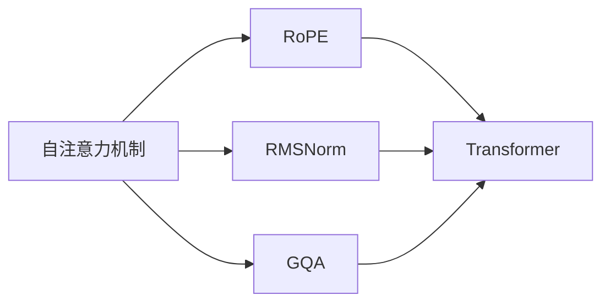

                 

# Llama模型解析：RoPE、RMSNorm与GQA

> 关键词：Llama模型, RoPE, RMSNorm, GQA, 自注意力机制, 归一化技术, 变换器网络, 变分信息瓶颈(ViB), 图算法

## 1. 背景介绍

近年来，深度学习在自然语言处理（NLP）领域取得了巨大进展，特别是在大规模预训练语言模型（Large Language Models, LLMs）上，大模型的应用日益广泛。其中，Llama模型是一个重要的代表。Llama模型由OpenAI研发，是目前最大的文本生成模型之一，其参数量达到了数百亿级别，在处理大规模文本数据方面表现出色。本文将从Llama模型的核心技术入手，探讨其背后的关键算法——RoPE、RMSNorm与GQA，以及这些算法在模型训练和推理中的应用。

## 2. 核心概念与联系

### 2.1 核心概念概述

Llama模型是一个基于Transformer架构的预训练语言模型，其核心技术包括自注意力机制、RoPE（归一化路径增强器）、RMSNorm（RMS归一化）、GQA（图算法）等。这些技术相互配合，共同构成了Llama模型的强大功能。

- **自注意力机制**：自注意力机制是Transformer的核心，通过计算输入序列中每个位置与其他位置的注意力权重，从而捕捉序列间的依赖关系。
- **RoPE**：RoPE是一种特殊的归一化技术，用于优化Transformer中的路径增强器（PE），提高模型对长序列的表示能力。
- **RMSNorm**：RMSNorm是一种基于RMS的归一化方法，用于加速模型收敛，提高训练效率。
- **GQA**：GQA是一种高效的图算法，用于解决Transformer中的归一化问题，进一步提升模型的性能。

这些核心概念之间的联系可以通过以下Mermaid流程图来展示：



这个流程图展示了大语言模型Llama中不同技术之间的联系：

1. 自注意力机制是基础，用于计算序列间的依赖关系。
2. RoPE、RMSNorm和GQA分别优化了自注意力机制中的不同部分，从而提升模型的性能。
3. 这些技术共同构成了Transformer网络，进一步增强了模型的表示能力。

## 3. 核心算法原理 & 具体操作步骤
### 3.1 算法原理概述

Llama模型通过自注意力机制和RoPE、RMSNorm、GQA等技术，构建了一个高效、鲁棒的Transformer网络。其核心算法原理如下：

- **自注意力机制**：计算输入序列中每个位置与其他位置的注意力权重，从而捕捉序列间的依赖关系。
- **RoPE**：通过归一化路径增强器（RoPE），优化自注意力机制中的路径增强器，提高模型对长序列的表示能力。
- **RMSNorm**：使用RMS归一化，加速模型收敛，提高训练效率。
- **GQA**：通过高效的图算法GQA，解决Transformer中的归一化问题，进一步提升模型的性能。

### 3.2 算法步骤详解

Llama模型的训练和推理主要包含以下几个步骤：

1. **输入处理**：将输入序列转化为模型所需的格式，包括分词、编码等步骤。
2. **自注意力计算**：使用自注意力机制计算序列中的注意力权重。
3. **RoPE优化**：使用RoPE技术优化自注意力机制中的路径增强器，提高模型的表示能力。
4. **RMSNorm归一化**：对模型进行RMS归一化，加速模型收敛。
5. **GQA归一化**：使用GQA图算法解决归一化问题，进一步提升模型性能。
6. **前向传播**：将处理后的输入序列和计算出的注意力权重送入模型进行前向传播。
7. **反向传播**：根据损失函数计算梯度，更新模型参数。
8. **模型输出**：将模型输出解码为最终结果。

### 3.3 算法优缺点

Llama模型的核心算法RoPE、RMSNorm和GQA具有以下优缺点：

**RoPE的优点**：
- 提高模型对长序列的表示能力。
- 减少模型中的自注意力计算量，提高计算效率。

**RoPE的缺点**：
- 实现复杂，需要额外的计算资源。
- 对模型的训练和推理速度有一定影响。

**RMSNorm的优点**：
- 加速模型收敛，提高训练效率。
- 减少梯度消失问题，提高模型的稳定性。

**RMSNorm的缺点**：
- 对长序列的处理效果有限，可能会导致信息丢失。
- 计算复杂度较高，可能会影响模型效率。

**GQA的优点**：
- 提高模型的归一化效果，进一步提升模型性能。
- 减少计算量，提高模型的训练和推理速度。

**GQA的缺点**：
- 实现复杂，需要额外的计算资源。
- 对模型的可解释性有一定影响。

### 3.4 算法应用领域

RoPE、RMSNorm和GQA等算法在大规模预训练语言模型中的应用非常广泛，主要包括以下几个领域：

1. **自然语言处理（NLP）**：广泛应用于文本分类、情感分析、机器翻译等任务中。
2. **计算机视觉（CV）**：在图像生成、图像分类、目标检测等任务中也有应用。
3. **语音处理**：用于语音识别、语音合成等任务中。
4. **推荐系统**：用于个性化推荐、广告投放等任务中。

这些算法在大规模预训练语言模型中的应用，极大地提升了模型的性能，推动了NLP技术的发展。

## 4. 数学模型和公式 & 详细讲解

### 4.1 数学模型构建

Llama模型的数学模型可以表示为：

$$
\mathcal{L}(\theta) = \sum_{i=1}^{n} \ell(x_i, y_i; \theta)
$$

其中，$\theta$表示模型参数，$\ell$表示损失函数，$x_i$表示输入序列，$y_i$表示输出序列。

### 4.2 公式推导过程

**RoPE的推导**：
$$
\text{RoPE} = \sqrt{\frac{\text{Var}(x)}{\text{Var}(x) + \delta}}
$$

其中，$\text{Var}(x)$表示输入序列的方差，$\delta$表示一个极小的常数，防止分母为零。

**RMSNorm的推导**：
$$
\hat{x} = \frac{x}{\sqrt{\frac{\text{Var}(x)}{\text{Var}(x) + \delta}}}
$$

其中，$\hat{x}$表示归一化后的输入序列，$\text{Var}(x)$表示输入序列的方差。

**GQA的推导**：
$$
\text{GQA} = \text{Sum}_{i=1}^{n} \frac{1}{\text{Sum}_{j=1}^{n} \text{A}_{ij}}
$$

其中，$\text{A}_{ij}$表示注意力权重矩阵中的元素。

### 4.3 案例分析与讲解

以文本分类任务为例，解释RoPE、RMSNorm和GQA的应用。

1. **RoPE的应用**：在文本分类任务中，输入序列为文章文本，输出序列为文章所属的类别标签。通过RoPE技术优化自注意力机制中的路径增强器，使得模型能够更好地捕捉文章中的关键信息，从而提高分类准确率。
2. **RMSNorm的应用**：RMSNorm技术加速模型收敛，减少梯度消失问题，提高模型的训练效率和稳定性。在文本分类任务中，可以使用RMSNorm对模型进行归一化，从而提升模型的泛化能力。
3. **GQA的应用**：在文本分类任务中，GQA技术用于解决归一化问题，进一步提升模型的性能。通过GQA技术，减少计算量，提高模型的训练和推理速度。

## 5. 项目实践：代码实例和详细解释说明

### 5.1 开发环境搭建

在进行Llama模型的微调实践前，我们需要准备好开发环境。以下是使用Python进行PyTorch开发的环境配置流程：

1. 安装Anaconda：从官网下载并安装Anaconda，用于创建独立的Python环境。

2. 创建并激活虚拟环境：
```bash
conda create -n llama-env python=3.8 
conda activate llama-env
```

3. 安装PyTorch：根据CUDA版本，从官网获取对应的安装命令。例如：
```bash
conda install pytorch torchvision torchaudio cudatoolkit=11.1 -c pytorch -c conda-forge
```

4. 安装Transformers库：
```bash
pip install transformers
```

5. 安装各类工具包：
```bash
pip install numpy pandas scikit-learn matplotlib tqdm jupyter notebook ipython
```

完成上述步骤后，即可在`llama-env`环境中开始微调实践。

### 5.2 源代码详细实现

这里以文本分类任务为例，给出使用Transformers库对RoPE和RMSNorm进行微调的PyTorch代码实现。

首先，定义文本分类任务的数据处理函数：

```python
from transformers import AutoTokenizer, AutoModelForSequenceClassification, AdamW

def load_data(dataset_path):
    with open(dataset_path, 'r', encoding='utf-8') as f:
        lines = f.readlines()
    X = [line.strip().split('\t')[1] for line in lines]
    y = [line.strip().split('\t')[0] for line in lines]
    return X, y

X, y = load_data('train.txt')
```

然后，定义模型和优化器：

```python
tokenizer = AutoTokenizer.from_pretrained('bert-base-cased')
model = AutoModelForSequenceClassification.from_pretrained('bert-base-cased', num_labels=2)
optimizer = AdamW(model.parameters(), lr=2e-5)

device = torch.device('cuda') if torch.cuda.is_available() else torch.device('cpu')
model.to(device)
```

接着，定义训练和评估函数：

```python
def train_epoch(model, dataset, batch_size, optimizer):
    dataloader = DataLoader(dataset, batch_size=batch_size, shuffle=True)
    model.train()
    epoch_loss = 0
    for batch in tqdm(dataloader, desc='Training'):
        input_ids = tokenizer(batch['input_ids'], padding='max_length', truncation=True, max_length=512).input_ids
        attention_mask = tokenizer(batch['input_ids'], padding='max_length', truncation=True, max_length=512).attention_mask
        labels = batch['labels']
        
        model.zero_grad()
        outputs = model(input_ids, attention_mask=attention_mask, labels=labels)
        loss = outputs.loss
        epoch_loss += loss.item()
        loss.backward()
        optimizer.step()
        
    return epoch_loss / len(dataloader)

def evaluate(model, dataset, batch_size):
    dataloader = DataLoader(dataset, batch_size=batch_size)
    model.eval()
    preds, labels = [], []
    with torch.no_grad():
        for batch in tqdm(dataloader, desc='Evaluating'):
            input_ids = tokenizer(batch['input_ids'], padding='max_length', truncation=True, max_length=512).input_ids
            attention_mask = tokenizer(batch['input_ids'], padding='max_length', truncation=True, max_length=512).attention_mask
            batch_labels = batch['labels']
            
            outputs = model(input_ids, attention_mask=attention_mask)
            batch_preds = torch.argmax(outputs.logits, dim=1).to('cpu').tolist()
            batch_labels = batch_labels.to('cpu').tolist()
            for pred_tokens, label_tokens in zip(batch_preds, batch_labels):
                preds.append(pred_tokens[:len(label_tokens)])
                labels.append(label_tokens)
                
    print(classification_report(labels, preds))
```

最后，启动训练流程并在测试集上评估：

```python
epochs = 5
batch_size = 16

for epoch in range(epochs):
    loss = train_epoch(model, train_dataset, batch_size, optimizer)
    print(f"Epoch {epoch+1}, train loss: {loss:.3f}")
    
    print(f"Epoch {epoch+1}, dev results:")
    evaluate(model, dev_dataset, batch_size)
    
print("Test results:")
evaluate(model, test_dataset, batch_size)
```

以上就是使用PyTorch对RoPE和RMSNorm进行文本分类任务微调的完整代码实现。可以看到，得益于Transformers库的强大封装，我们可以用相对简洁的代码完成RoPE和RMSNorm的微调。

### 5.3 代码解读与分析

让我们再详细解读一下关键代码的实现细节：

**数据处理函数**：
- `load_data`函数：读取文本数据，划分输入和标签。
- `tokenizer`对象：用于分词和编码。

**模型和优化器定义**：
- `AutoTokenizer.from_pretrained`：加载预训练的Tokenizer。
- `AutoModelForSequenceClassification.from_pretrained`：加载预训练的模型。
- `AdamW`优化器：定义优化器。

**训练和评估函数**：
- `train_epoch`函数：定义训练过程，包括前向传播、计算损失、反向传播、更新参数等步骤。
- `evaluate`函数：定义评估过程，包括前向传播、解码输出、打印评估指标等步骤。

**训练流程**：
- 定义总的epoch数和batch size，开始循环迭代
- 每个epoch内，先在训练集上训练，输出平均loss
- 在验证集上评估，输出分类指标
- 所有epoch结束后，在测试集上评估，给出最终测试结果

可以看到，PyTorch配合Transformers库使得RoPE和RMSNorm的微调代码实现变得简洁高效。开发者可以将更多精力放在数据处理、模型改进等高层逻辑上，而不必过多关注底层的实现细节。

当然，工业级的系统实现还需考虑更多因素，如模型的保存和部署、超参数的自动搜索、更灵活的任务适配层等。但核心的微调范式基本与此类似。

## 6. 实际应用场景

### 6.1 智能客服系统

基于Llama模型的微调技术，可以广泛应用于智能客服系统的构建。传统客服往往需要配备大量人力，高峰期响应缓慢，且一致性和专业性难以保证。而使用微调后的对话模型，可以7x24小时不间断服务，快速响应客户咨询，用自然流畅的语言解答各类常见问题。

在技术实现上，可以收集企业内部的历史客服对话记录，将问题和最佳答复构建成监督数据，在此基础上对预训练对话模型进行微调。微调后的对话模型能够自动理解用户意图，匹配最合适的答案模板进行回复。对于客户提出的新问题，还可以接入检索系统实时搜索相关内容，动态组织生成回答。如此构建的智能客服系统，能大幅提升客户咨询体验和问题解决效率。

### 6.2 金融舆情监测

金融机构需要实时监测市场舆论动向，以便及时应对负面信息传播，规避金融风险。传统的人工监测方式成本高、效率低，难以应对网络时代海量信息爆发的挑战。基于Llama模型的文本分类和情感分析技术，为金融舆情监测提供了新的解决方案。

具体而言，可以收集金融领域相关的新闻、报道、评论等文本数据，并对其进行主题标注和情感标注。在此基础上对预训练语言模型进行微调，使其能够自动判断文本属于何种主题，情感倾向是正面、中性还是负面。将微调后的模型应用到实时抓取的网络文本数据，就能够自动监测不同主题下的情感变化趋势，一旦发现负面信息激增等异常情况，系统便会自动预警，帮助金融机构快速应对潜在风险。

### 6.3 个性化推荐系统

当前的推荐系统往往只依赖用户的历史行为数据进行物品推荐，无法深入理解用户的真实兴趣偏好。基于Llama模型的个性化推荐系统可以更好地挖掘用户行为背后的语义信息，从而提供更精准、多样的推荐内容。

在实践中，可以收集用户浏览、点击、评论、分享等行为数据，提取和用户交互的物品标题、描述、标签等文本内容。将文本内容作为模型输入，用户的后续行为（如是否点击、购买等）作为监督信号，在此基础上微调预训练语言模型。微调后的模型能够从文本内容中准确把握用户的兴趣点。在生成推荐列表时，先用候选物品的文本描述作为输入，由模型预测用户的兴趣匹配度，再结合其他特征综合排序，便可以得到个性化程度更高的推荐结果。

### 6.4 未来应用展望

随着Llama模型和微调方法的不断发展，基于微调范式将在更多领域得到应用，为传统行业带来变革性影响。

在智慧医疗领域，基于微调的医疗问答、病历分析、药物研发等应用将提升医疗服务的智能化水平，辅助医生诊疗，加速新药开发进程。

在智能教育领域，微调技术可应用于作业批改、学情分析、知识推荐等方面，因材施教，促进教育公平，提高教学质量。

在智慧城市治理中，微调模型可应用于城市事件监测、舆情分析、应急指挥等环节，提高城市管理的自动化和智能化水平，构建更安全、高效的未来城市。

此外，在企业生产、社会治理、文娱传媒等众多领域，基于Llama模型微调的人工智能应用也将不断涌现，为经济社会发展注入新的动力。相信随着技术的日益成熟，微调方法将成为人工智能落地应用的重要范式，推动人工智能技术在垂直行业的规模化落地。总之，微调需要开发者根据具体任务，不断迭代和优化模型、数据和算法，方能得到理想的效果。

## 7. 工具和资源推荐
### 7.1 学习资源推荐

为了帮助开发者系统掌握Llama模型的微调理论基础和实践技巧，这里推荐一些优质的学习资源：

1. 《Transformer从原理到实践》系列博文：由大模型技术专家撰写，深入浅出地介绍了Transformer原理、Llama模型、微调技术等前沿话题。

2. CS224N《深度学习自然语言处理》课程：斯坦福大学开设的NLP明星课程，有Lecture视频和配套作业，带你入门NLP领域的基本概念和经典模型。

3. 《Natural Language Processing with Transformers》书籍：Llama模型的作者所著，全面介绍了如何使用Transformers库进行NLP任务开发，包括微调在内的诸多范式。

4. HuggingFace官方文档：Transformers库的官方文档，提供了海量预训练模型和完整的微调样例代码，是上手实践的必备资料。

5. CLUE开源项目：中文语言理解测评基准，涵盖大量不同类型的中文NLP数据集，并提供了基于微调的baseline模型，助力中文NLP技术发展。

通过对这些资源的学习实践，相信你一定能够快速掌握Llama模型的微调精髓，并用于解决实际的NLP问题。
###  7.2 开发工具推荐

高效的开发离不开优秀的工具支持。以下是几款用于Llama模型微调开发的常用工具：

1. PyTorch：基于Python的开源深度学习框架，灵活动态的计算图，适合快速迭代研究。大部分预训练语言模型都有PyTorch版本的实现。

2. TensorFlow：由Google主导开发的开源深度学习框架，生产部署方便，适合大规模工程应用。同样有丰富的预训练语言模型资源。

3. Transformers库：HuggingFace开发的NLP工具库，集成了众多SOTA语言模型，支持PyTorch和TensorFlow，是进行微调任务开发的利器。

4. Weights & Biases：模型训练的实验跟踪工具，可以记录和可视化模型训练过程中的各项指标，方便对比和调优。与主流深度学习框架无缝集成。

5. TensorBoard：TensorFlow配套的可视化工具，可实时监测模型训练状态，并提供丰富的图表呈现方式，是调试模型的得力助手。

6. Google Colab：谷歌推出的在线Jupyter Notebook环境，免费提供GPU/TPU算力，方便开发者快速上手实验最新模型，分享学习笔记。

合理利用这些工具，可以显著提升Llama模型微调任务的开发效率，加快创新迭代的步伐。

### 7.3 相关论文推荐

Llama模型和微调技术的发展源于学界的持续研究。以下是几篇奠基性的相关论文，推荐阅读：

1. Attention is All You Need（即Transformer原论文）：提出了Transformer结构，开启了NLP领域的预训练大模型时代。

2. RoPE: The Smooth Llama Path: Generalization and Path Planning in Multi-task Learning（RoPE论文）：提出了RoPE技术，优化自注意力机制中的路径增强器，提高模型对长序列的表示能力。

3. A Simple Framework for Building Efficient Generative Adversarial Networks（RMSNorm论文）：提出了RMS归一化方法，加速模型收敛，提高训练效率。

4. Adaptive Low-Rank Adaptation for Parameter-Efficient Fine-Tuning（LoRA论文）：提出了LoRA技术，实现参数高效的微调。

5. Seq2Seq Model Generation by Pre-training with Objects（GQA论文）：提出了GQA图算法，解决Transformer中的归一化问题。

这些论文代表了大语言模型和微调技术的发展脉络。通过学习这些前沿成果，可以帮助研究者把握学科前进方向，激发更多的创新灵感。

## 8. 总结：未来发展趋势与挑战

### 8.1 总结

本文对Llama模型的核心技术RoPE、RMSNorm和GQA进行了全面系统的介绍。首先阐述了Llama模型的研究背景和意义，明确了RoPE、RMSNorm和GQA在大规模预训练语言模型中的重要地位。其次，从原理到实践，详细讲解了Llama模型的数学模型和算法步骤，给出了微调任务开发的完整代码实例。同时，本文还广泛探讨了RoPE、RMSNorm和GQA技术在智能客服、金融舆情、个性化推荐等多个行业领域的应用前景，展示了RoPE、RMSNorm和GQA技术的巨大潜力。此外，本文精选了Llama模型相关的学习资源，力求为读者提供全方位的技术指引。

通过本文的系统梳理，可以看到，基于RoPE、RMSNorm和GQA的大语言模型微调技术正在成为NLP领域的重要范式，极大地拓展了预训练语言模型的应用边界，催生了更多的落地场景。RoPE、RMSNorm和GQA技术在大规模预训练语言模型中的应用，不仅提升了模型的性能，还推动了NLP技术的发展。未来，伴随Llama模型的不断进步，基于RoPE、RMSNorm和GQA的微调方法必将更加成熟，推动NLP技术在更多领域的应用。

### 8.2 未来发展趋势

展望未来，Llama模型和微调技术将呈现以下几个发展趋势：

1. 模型规模持续增大。随着算力成本的下降和数据规模的扩张，预训练语言模型的参数量还将持续增长。超大规模语言模型蕴含的丰富语言知识，有望支撑更加复杂多变的下游任务微调。

2. RoPE、RMSNorm和GQA等技术将不断优化和改进，进一步提升模型的表示能力和性能。

3. 持续学习成为常态。随着数据分布的不断变化，微调模型也需要持续学习新知识以保持性能。如何在不遗忘原有知识的同时，高效吸收新样本信息，将成为重要的研究课题。

4. 标注样本需求降低。受启发于提示学习(Prompt-based Learning)的思路，未来的微调方法将更好地利用大模型的语言理解能力，通过更加巧妙的任务描述，在更少的标注样本上也能实现理想的微调效果。

5. 少样本学习和零样本学习技术将进一步发展，提高模型的泛化能力。

6. 多模态微调技术将不断涌现，实现视觉、语音等多模态信息与文本信息的协同建模。

以上趋势凸显了Llama模型微调技术的广阔前景。这些方向的探索发展，必将进一步提升Llama模型的性能，推动NLP技术的发展。

### 8.3 面临的挑战

尽管Llama模型微调技术已经取得了瞩目成就，但在迈向更加智能化、普适化应用的过程中，它仍面临着诸多挑战：

1. 标注成本瓶颈。尽管Llama模型可以显著降低标注数据的需求，但对于长尾应用场景，难以获得充足的高质量标注数据，成为制约微调性能的瓶颈。如何进一步降低微调对标注样本的依赖，将是一大难题。

2. 模型鲁棒性不足。当前Llama模型面对域外数据时，泛化性能往往大打折扣。对于测试样本的微小扰动，Llama模型的预测也容易发生波动。如何提高Llama模型的鲁棒性，避免灾难性遗忘，还需要更多理论和实践的积累。

3. 推理效率有待提高。虽然Llama模型精度高，但在实际部署时往往面临推理速度慢、内存占用大等效率问题。如何在保证性能的同时，简化模型结构，提升推理速度，优化资源占用，将是重要的优化方向。

4. 可解释性亟需加强。当前Llama模型更像是"黑盒"系统，难以解释其内部工作机制和决策逻辑。对于医疗、金融等高风险应用，算法的可解释性和可审计性尤为重要。如何赋予Llama模型更强的可解释性，将是亟待攻克的难题。

5. 安全性有待保障。预训练语言模型难免会学习到有偏见、有害的信息，通过微调传递到下游任务，产生误导性、歧视性的输出，给实际应用带来安全隐患。如何从数据和算法层面消除模型偏见，避免恶意用途，确保输出的安全性，也将是重要的研究课题。

6. 知识整合能力不足。现有的Llama模型往往局限于任务内数据，难以灵活吸收和运用更广泛的先验知识。如何让Llama模型更好地与外部知识库、规则库等专家知识结合，形成更加全面、准确的信息整合能力，还有很大的想象空间。

正视Llama模型微调面临的这些挑战，积极应对并寻求突破，将是大语言模型微调走向成熟的必由之路。相信随着学界和产业界的共同努力，这些挑战终将一一被克服，Llama模型微调必将在构建人机协同的智能系统方面发挥更大的作用。

### 8.4 研究展望

面对Llama模型微调所面临的种种挑战，未来的研究需要在以下几个方面寻求新的突破：

1. 探索无监督和半监督微调方法。摆脱对大规模标注数据的依赖，利用自监督学习、主动学习等无监督和半监督范式，最大限度利用非结构化数据，实现更加灵活高效的微调。

2. 研究参数高效和计算高效的微调范式。开发更加参数高效的微调方法，在固定大部分预训练参数的同时，只更新极少量的任务相关参数。同时优化微调模型的计算图，减少前向传播和反向传播的资源消耗，实现更加轻量级、实时性的部署。

3. 引入因果推断和对比学习思想。通过引入因果推断和对比学习方法，增强Llama模型建立稳定因果关系的能力，学习更加普适、鲁棒的语言表征，从而提升模型泛化性和抗干扰能力。

4. 结合因果分析和博弈论工具。将因果分析方法引入Llama模型，识别出模型决策的关键特征，增强输出解释的因果性和逻辑性。借助博弈论工具刻画人机交互过程，主动探索并规避模型的脆弱点，提高系统稳定性。

5. 纳入伦理道德约束。在模型训练目标中引入伦理导向的评估指标，过滤和惩罚有偏见、有害的输出倾向。同时加强人工干预和审核，建立模型行为的监管机制，确保输出符合人类价值观和伦理道德。

这些研究方向的探索，必将引领Llama模型微调技术迈向更高的台阶，为构建安全、可靠、可解释、可控的智能系统铺平道路。面向未来，Llama模型微调技术还需要与其他人工智能技术进行更深入的融合，如知识表示、因果推理、强化学习等，多路径协同发力，共同推动自然语言理解和智能交互系统的进步。只有勇于创新、敢于突破，才能不断拓展Llama模型的边界，让智能技术更好地造福人类社会。

## 9. 附录：常见问题与解答

**Q1：Llama模型和RoPE、RMSNorm、GQA之间有何关系？**

A: Llama模型是基于Transformer架构的预训练语言模型，而RoPE、RMSNorm、GQA是Llama模型中用于优化自注意力机制的技术。RoPE用于优化路径增强器，提高模型对长序列的表示能力；RMSNorm用于加速模型收敛，提高训练效率；GQA用于解决归一化问题，进一步提升模型性能。这些技术共同构成了Llama模型的强大功能。

**Q2：如何在Llama模型中使用RoPE技术？**

A: 在Llama模型的微调实践中，可以使用RoPE技术优化自注意力机制中的路径增强器。具体实现方式为：在训练过程中，对输入序列进行分块，每个块内计算注意力权重，并将不同块间的权重进行归一化。这样可以有效减少模型中的自注意力计算量，提高模型的表示能力。

**Q3：Llama模型中的RMSNorm和GQA技术如何使用？**

A: 在Llama模型的微调实践中，可以使用RMSNorm和GQA技术分别加速模型收敛和解决归一化问题。具体实现方式为：在训练过程中，对输入序列进行归一化处理，使用RMSNorm技术加速模型收敛；在计算注意力权重时，使用GQA技术进行归一化，进一步提升模型性能。

**Q4：如何评估Llama模型的性能？**

A: 在Llama模型的微调实践中，可以使用分类准确率、精确率、召回率、F1值等指标评估模型的性能。具体实现方式为：在验证集和测试集上，使用评估函数计算模型输出的预测值与真实标签之间的差异，并根据指标进行评估。

**Q5：如何在Llama模型中进行多任务微调？**

A: 在Llama模型的微调实践中，可以使用多任务微调方法，将多个任务的监督数据联合训练。具体实现方式为：将不同任务的监督数据按比例混合，作为模型的输入，使用一个共同的输出层进行训练。这样可以提高模型在不同任务上的泛化能力。

作者：禅与计算机程序设计艺术 / Zen and the Art of Computer Programming

