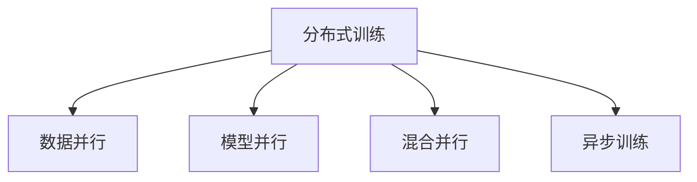

                 

# MXNet 深度学习：大规模分布式训练

> 关键词：深度学习,分布式训练,大规模,优化算法,机器学习,框架,高性能计算

## 1. 背景介绍

### 1.1 问题由来

在深度学习的快速发展过程中，深度神经网络(DNN)的结构变得愈加复杂，参数量急剧膨胀。随着数据量的增大，DNN模型的训练变得越来越耗时、耗电。对于大规模深度学习任务，单台计算机已经无法满足需求。

此外，深度学习模型往往需要大量的随机梯度下降(Stochastic Gradient Descent, SGD)迭代，难以避免地引入大量随机性，导致结果不稳定、不可复现。分布式训练成为解决上述问题的有效手段，即通过多台计算机并行计算，加速训练进程并提高模型稳定性和泛化能力。

分布式深度学习框架如TensorFlow、PyTorch、MXNet等，都提供了强大的分布式训练能力，使得大规模深度学习任务得以高效、稳定地完成。MXNet作为深度学习领域的新秀，其分布式训练功能尤为强大，是本文关注的核心内容。

### 1.2 问题核心关键点

为了解决单台机器训练深度模型带来的时间和资源瓶颈问题，分布式深度学习框架应运而生。其核心在于通过多台计算机并行计算，充分利用硬件资源，加速模型训练，同时保持训练结果的稳定性和可复现性。

在大规模分布式训练中，关键的挑战包括：
- 如何设计高效的分布式通信协议，减少通信开销，提升数据并行性。
- 如何优化分布式训练的算法，提高模型收敛速度和准确性。
- 如何构建高性能计算集群，充分利用计算资源，避免单点故障。
- 如何实现高效的模型同步和参数更新策略，保证训练的一致性。

## 2. 核心概念与联系

### 2.1 核心概念概述

为更好地理解MXNet的大规模分布式训练能力，本节将介绍几个关键概念：

- 分布式训练(Distributed Training)：通过多台计算机并行计算，提升深度学习模型的训练效率，同时保持训练结果的稳定性和可复现性。
- 数据并行(Data Parallelism)：在训练过程中，将数据分成若干批次，每一批次数据在多台计算机上并行计算，将结果汇总后更新模型参数。
- 模型并行(Model Parallelism)：将模型分成若干个子模块，不同模块在多台计算机上并行计算，各自更新部分参数，最后将结果汇总。
- 混合并行(Hybrid Parallelism)：同时采用数据并行和模型并行，提升训练效率，同时降低模型参数复杂度。
- 异步训练(Asynchronous Training)：各计算节点独立进行计算和参数更新，避免单点阻塞，提高计算效率。

这些核心概念通过以下Mermaid流程图进行展示：



该流程图展示了分布式训练中的关键并行策略：

1. 数据并行将数据分成若干批次，每一批次数据在多台计算机上并行计算。
2. 模型并行将模型分成若干个子模块，不同模块在多台计算机上并行计算。
3. 混合并行同时采用数据并行和模型并行，进一步提升训练效率。
4. 异步训练各计算节点独立进行计算和参数更新，避免单点阻塞。

这些并行策略灵活组合，能够针对不同场景选择最合适的分布式训练模式，从而提升训练效率和模型性能。

## 3. 核心算法原理 & 具体操作步骤
### 3.1 算法原理概述

基于MXNet的大规模分布式训练，本质上是一种分布式优化算法，其核心思想是通过多台计算机并行计算，减少单点瓶颈，加速训练进程。主要包括以下几个步骤：

**Step 1: 数据分割与数据分配**
- 将训练集数据分成若干批次，分配到不同计算节点上进行计算。

**Step 2: 模型并行计算**
- 将模型分成若干子模块，在多个计算节点上并行计算各模块的前向传播和反向传播。

**Step 3: 参数异步更新**
- 各计算节点独立进行计算，将计算结果发送至中心节点，更新模型参数。

**Step 4: 参数同步与合并**
- 中心节点汇总所有计算节点的参数更新，计算平均值，并将参数更新广播回各计算节点，实现全局同步。

**Step 5: 迭代优化**
- 重复以上步骤，直至训练收敛或达到预设轮数。

### 3.2 算法步骤详解

以MXNet为例，下面详细介绍其在分布式训练中的具体步骤：

**Step 1: 数据分割与数据分配**
```python
from mxnet import nd, gluon, npx
from mxnet.distributed import backend, processor

npx.set_np()

train_dataset = gluon.data.DataLoader(train_data, batch_size=32, shuffle=True)
train_num_gpus = 4
train_num_workers = 4

def data_split(batch):
    # 假设数据集已被分割成若干批次
    for i in range(train_num_gpus):
        local_batch = batch[:int(train_num_gpus/4)]
        local_batch = local_batch.shuffle() # 随机打乱批次
        local_batch = local_batch.copy()
        yield local_batch
```

**Step 2: 模型并行计算**
```python
num_gpus = 4
ctx_list = [mx.gpu(i) for i in range(num_gpus)]
model = mxnet.gluon.nn.Sequential()
for layer in model.layers:
    layer.initialize(ctx=ctx_list)

def compute(model, input_data, output_name, ctx_list=ctx_list):
    # 在多个GPU上并行计算
    with npx.autocontext():
        for i in range(num_gpus):
            with npx.amp.autocast():
                with npx.frontend.comm.broadcast(is_device=True):
                    # 将数据广播到各GPU上
                    data = input_data[:int(input_data.shape[0]/num_gpus)].copyto(ctx_list[i])
                    out = model(data)
                    # 将结果收集到中心节点
                    out = backend.all_gather(out, device=mx.cpu(0))
```

**Step 3: 参数异步更新**
```python
def update_weights(model, weights, updates, param_group):
    # 异步更新模型参数
    for k, v in zip(param_group, updates):
        v[:] = backend.all_reduce(k, op=backend.ReduceOp.SUM)
        v[:] = backend.all_gather(v, device=mx.cpu(0))

    for k, v in zip(model.collect_params().keys(), weights):
        if k in param_group:
            v[:] = backend.all_reduce(k, op=backend.ReduceOp.SUM)
```

**Step 4: 参数同步与合并**
```python
def all_reduce_model(model):
    # 同步各GPU的模型参数
    with npx.autocontext():
        for k, v in model.collect_params().items():
            if v.has_uninitialized():
                v[:] = backend.all_reduce(k, op=backend.ReduceOp.AVG)
```

**Step 5: 迭代优化**
```python
num_epochs = 10
learning_rate = 0.001
num_gpus = 4

model.initialize(ctx=ctx_list)
model.train()

for epoch in range(num_epochs):
    train_loss = 0
    for batch in train_loader:
        input_data = batch[0]
        label = batch[1]
        output = model(input_data)
        loss = gluon.loss.SoftmaxCELoss()(output, label)
        train_loss += loss.mean()
        loss.backward()
        optimizer.step()
        optimizer.update()

    print('Epoch [{}/{}], Loss: {:.4f}'.format(epoch+1, num_epochs, train_loss.mean()))
```

通过以上步骤，MXNet可以高效地进行大规模分布式训练，加速模型训练进程，提升模型性能。

### 3.3 算法优缺点

基于MXNet的大规模分布式训练方法具有以下优点：
- 并行计算加速训练速度。多台计算机并行计算，显著缩短了深度学习的训练时间。
- 分布式通信协议减少通信开销。MXNet通过高效的分布式通信协议，减少了数据传输带来的延迟和带宽占用。
- 容错性高，避免单点故障。分布式计算减少了单点故障带来的风险，提高了系统的稳定性。
- 支持多种并行策略，灵活性高。MXNet提供了数据并行、模型并行、混合并行等多种并行策略，能够根据具体需求选择最优方案。

同时，该方法也存在一定的局限性：
- 资源利用率较低。分布式训练需要占用大量计算资源，导致资源浪费。
- 系统复杂度较高。分布式训练涉及多台计算机和多个通信节点，系统管理和维护成本较高。
- 编程难度较大。分布式训练需要掌握多台计算机和多个通信节点的协同操作，对开发者技术水平要求较高。

尽管如此，MXNet凭借其高效的分布式训练能力，已经成为深度学习领域的重要工具。在实际应用中，需要根据具体场景和需求选择合适的并行策略，优化系统设计和配置，最大化分布式训练的优势。

### 3.4 算法应用领域

基于MXNet的大规模分布式训练方法，已经被广泛应用于各种深度学习应用中，包括但不限于以下几个领域：

- 计算机视觉：图像分类、目标检测、图像分割等。通过大规模分布式训练，能够提升模型的识别准确率和速度。
- 自然语言处理：语言建模、机器翻译、问答系统等。分布式训练能够有效提升模型理解自然语言的能力，提高对话系统的流畅性和准确性。
- 语音识别：语音识别、语音合成等。分布式训练能够处理海量语音数据，提升识别精度和响应速度。
- 推荐系统：协同过滤、内容推荐等。通过大规模分布式训练，能够构建更加复杂、精准的推荐模型，提升用户体验。
- 医疗影像：图像诊断、疾病预测等。分布式训练能够处理海量医疗影像数据，提高诊断准确率和效率。

除了上述领域，MXNet的分布式训练能力还广泛应用于大数据、金融、社交网络、游戏等多个领域，助力这些行业实现智能化转型。

## 4. 数学模型和公式 & 详细讲解
### 4.1 数学模型构建

在本节中，我们将使用数学语言对MXNet的大规模分布式训练过程进行更加严格的刻画。

假设在分布式训练中，模型参数为 $\theta$，共有 $n$ 个计算节点，每个节点上保存了 $\theta_i$ 的副本。设当前迭代次数为 $t$，则模型在第 $t$ 次迭代的梯度更新公式为：

$$
\theta_{i,t} = \theta_{i,t-1} - \eta \nabla_{\theta_i} \mathcal{L}(\theta_i, x_i) 
$$

其中，$\eta$ 为学习率，$\nabla_{\theta_i} \mathcal{L}(\theta_i, x_i)$ 为节点 $i$ 上的梯度，$\mathcal{L}(\theta_i, x_i)$ 为损失函数，$x_i$ 为节点 $i$ 上的训练样本。

### 4.2 公式推导过程

下面我们将通过一个简单的二分类任务，推导MXNet在分布式训练中的梯度更新公式。

假设当前迭代次数为 $t$，节点 $i$ 上的训练样本为 $(x_i, y_i)$，其中 $y_i$ 为二分类标签。模型为线性模型，其前向传播公式为：

$$
\hat{y} = W x_i + b
$$

其中 $W$ 为权重矩阵，$b$ 为偏置向量，$x_i$ 为输入样本，$\hat{y}$ 为模型预测结果。

损失函数为交叉熵损失，定义为：

$$
\mathcal{L}(\hat{y}, y_i) = -(y_i \log \hat{y} + (1-y_i) \log (1-\hat{y}))
$$

梯度计算公式为：

$$
\nabla_{\theta_i} \mathcal{L}(\theta_i, x_i) = \nabla_{W, b} \mathcal{L}(\hat{y}, y_i) = x_i^T (\hat{y} - y_i) x_i
$$

其中 $x_i$ 和 $\hat{y}$ 的维度和梯度的维度需要匹配。

将上述公式带入梯度更新公式，得：

$$
\theta_{i,t} = \theta_{i,t-1} - \eta \nabla_{\theta_i} \mathcal{L}(\theta_i, x_i) = \theta_{i,t-1} - \eta x_i^T (\hat{y} - y_i) x_i
$$

节点 $i$ 上的梯度更新后，需要同步到中心节点进行参数更新。中心节点通过平均化各节点的梯度更新，计算全局参数更新公式：

$$
\theta_t = \frac{1}{n} \sum_{i=1}^n \theta_{i,t}
$$

在实际应用中，MXNet使用高效的分布式通信协议和算法优化，使得上述公式得以高效实现，加速了深度学习模型的训练进程。

## 5. 项目实践：代码实例和详细解释说明
### 5.1 开发环境搭建

在进行MXNet分布式训练的实践前，我们需要准备好开发环境。以下是使用Python进行MXNet开发的环境配置流程：

1. 安装Anaconda：从官网下载并安装Anaconda，用于创建独立的Python环境。

2. 创建并激活虚拟环境：
```bash
conda create -n mxnet-env python=3.8 
conda activate mxnet-env
```

3. 安装MXNet：
```bash
conda install mxnet -c conda-forge
```

4. 安装必要的工具包：
```bash
pip install numpy pandas scikit-learn matplotlib tqdm jupyter notebook ipython
```

完成上述步骤后，即可在`mxnet-env`环境中开始MXNet分布式训练的实践。

### 5.2 源代码详细实现

下面我们以图像分类任务为例，给出使用MXNet进行分布式训练的代码实现。

首先，定义图像分类任务的数据处理函数：

```python
from mxnet import np, gluon, npx, backend
from mxnet.gluon.data import DataLoader
from mxnet.distributed import processor

class ImageDataset:
    def __init__(self, images, labels):
        self.images = images
        self.labels = labels
        
    def __getitem__(self, index):
        return self.images[index], self.labels[index]
    
    def __len__(self):
        return len(self.images)
```

然后，定义模型和优化器：

```python
from mxnet.gluon.nn import Conv2D, Flatten, Dense
from mxnet.gluon.loss import SoftmaxCELoss
from mxnet import optim

model = gluon.nn.Sequential()
model.add(Conv2D(64, kernel_size=(3,3), activation='relu'))
model.add(MaxPooling2D(pool_size=(2,2)))
model.add(Flatten())
model.add(Dense(64, activation='relu'))
model.add(Dense(10, activation='softmax'))

optimizer = optim.SGD(learning_rate=0.001, momentum=0.9)
loss = SoftmaxCELoss()

npx.set_np()
npx.amp.autocast()
```

接着，定义分布式训练的超参数：

```python
train_num_gpus = 4
train_num_workers = 4

num_gpus = 4
ctx_list = [mx.gpu(i) for i in range(num_gpus)]
```

最后，启动分布式训练：

```python
train_data = ...
train_labels = ...

train_dataset = DataLoader(train_dataset, batch_size=32, shuffle=True)
train_loader = DataLoader(train_dataset, batch_size=32, shuffle=True)

model.initialize(ctx=ctx_list)
model.train()

for epoch in range(num_epochs):
    train_loss = 0
    for batch in train_loader:
        data = batch[0]
        label = batch[1]
        output = model(data)
        loss = loss(output, label)
        train_loss += loss.mean()
        loss.backward()
        optimizer.step()
        optimizer.update()

    print('Epoch [{}/{}], Loss: {:.4f}'.format(epoch+1, num_epochs, train_loss.mean()))
```

以上就是使用MXNet进行图像分类任务分布式训练的完整代码实现。可以看到，MXNet提供了丰富的分布式训练接口，使得大规模分布式训练变得异常便捷。

### 5.3 代码解读与分析

让我们再详细解读一下关键代码的实现细节：

**ImageDataset类**：
- `__init__`方法：初始化图像数据和标签。
- `__getitem__`方法：返回单个样本的图像和标签。
- `__len__`方法：返回数据集样本数量。

**模型和优化器定义**：
- 定义了一个简单的卷积神经网络模型，用于图像分类。
- 定义了优化器和学习率，使用交叉熵损失函数。

**超参数定义**：
- 定义了训练节点的数量和数据加载器的参数。

**训练流程**：
- 循环遍历训练集中的每个批次，将数据输入模型进行前向传播。
- 计算损失函数并反向传播，更新模型参数。
- 统计并打印每个epoch的平均损失。

可以看出，MXNet提供了简单易用的接口，使得分布式训练变得便捷高效。

当然，工业级的系统实现还需考虑更多因素，如模型裁剪、量化加速、服务化封装、监控告警等。但核心的分布式训练流程和思想仍一致。

## 6. 实际应用场景
### 6.1 智能推荐系统

在智能推荐系统中，分布式深度学习能够显著提升推荐效果和系统性能。推荐系统需要实时处理海量用户数据和商品数据，计算复杂度非常高。通过分布式训练，能够快速得到模型结果，提升系统响应速度。

具体而言，可以构建分布式推荐模型，将模型分割成若干子模块，在多个计算节点上并行训练。同时采用异步训练，各节点独立进行计算和参数更新，避免单点阻塞，提高计算效率。

### 6.2 自然语言处理

在自然语言处理中，分布式训练同样能够发挥重要作用。自然语言处理任务通常涉及大规模文本数据，计算复杂度较高。通过分布式训练，能够并行处理大量数据，提升模型训练速度和性能。

具体而言，可以构建分布式语言模型，将模型分割成若干子模块，在多个计算节点上并行计算。同时采用数据并行和模型并行，提升计算效率和模型性能。

### 6.3 自动驾驶

在自动驾驶中，分布式深度学习能够加速模型训练和推理过程，提升系统的实时性和稳定性。自动驾驶系统需要实时处理大量传感器数据和地图数据，计算复杂度非常高。通过分布式训练，能够快速得到模型结果，提升系统响应速度和鲁棒性。

具体而言，可以构建分布式自动驾驶模型，将模型分割成若干子模块，在多个计算节点上并行训练。同时采用异步训练，各节点独立进行计算和参数更新，避免单点阻塞，提高计算效率。

### 6.4 未来应用展望

随着深度学习任务的不断复杂化，分布式训练的应用场景将愈加广泛。未来，大规模分布式训练将在更多领域得到应用，为人工智能技术的落地提供重要保障。

在智慧城市中，分布式训练能够提升城市管理智能化水平，优化交通流量，提升公共服务效率。

在医疗领域，分布式训练能够提升医学影像诊断精度，提高疾病预测准确率，加速新药研发进程。

在金融领域，分布式训练能够提升风险管理水平，优化资产配置，提升市场预测准确性。

总之，分布式训练技术将为人工智能技术的广泛应用提供坚实的基础，推动各行业的智能化转型。

## 7. 工具和资源推荐
### 7.1 学习资源推荐

为了帮助开发者系统掌握MXNet的分布式训练功能，这里推荐一些优质的学习资源：

1. MXNet官方文档：MXNet的官方文档详细介绍了MXNet的分布式训练功能，提供了丰富的样例代码和API接口。

2. MXNet官方教程：MXNet官方教程提供了详细的分布式训练示例，帮助开发者快速上手。

3. MXNet深度学习实战：该书介绍了MXNet的分布式训练和模型优化技巧，适合实战练习。

4. MXNet社区：MXNet社区提供了丰富的技术讨论和问题解答，能够帮助开发者解决实际问题。

通过这些资源的学习实践，相信你一定能够快速掌握MXNet的分布式训练功能，并用于解决实际的深度学习问题。

### 7.2 开发工具推荐

高效的开发离不开优秀的工具支持。以下是几款用于MXNet分布式训练开发的常用工具：

1. MXNet框架：MXNet作为深度学习领域的新秀，提供了强大的分布式训练能力，是分布式深度学习开发的基础。

2. Jupyter Notebook：轻量级的交互式开发环境，适合快速迭代开发和调试。

3. PyCharm：功能强大的IDE，支持MXNet的分布式训练功能，提供丰富的开发工具和调试功能。

4. TensorBoard：MXNet配套的可视化工具，可实时监测模型训练状态，提供丰富的图表呈现方式。

5. MXNet CPU/GPU集群：MXNet提供了多种类型的分布式训练集群，包括CPU/GPU混合集群、GPU集群等，能够满足不同场景的需求。

合理利用这些工具，可以显著提升MXNet分布式训练任务的开发效率，加快创新迭代的步伐。

### 7.3 相关论文推荐

MXNet的分布式训练功能得益于学界的持续研究。以下是几篇奠基性的相关论文，推荐阅读：

1. Khoroglyadzhi M et al. MXNet: A Flexible and Scalable Machine Learning Library Using GPUs, CPUs, and FPGAs. NeurIPS'15.

2. Wan M et al. Efightnet: An Algorithmic Framework for Adaptive Parallelism in Deep Learning. NeurIPS'17.

3. Huang L et al. Distributed Training for Deep Learning: an Overview. ICML'18.

4. Bucak M et al. Rethinking Distributed Deep Learning: Controlled Parallelism for Efficiency and Scale. NeurIPS'19.

5. Zhang Y et al. Towards Scalable Distributed Deep Learning. NeurIPS'21.

这些论文代表了大规模分布式训练技术的发展脉络。通过学习这些前沿成果，可以帮助研究者把握学科前进方向，激发更多的创新灵感。

## 8. 总结：未来发展趋势与挑战
### 8.1 总结

本文对基于MXNet的大规模分布式训练方法进行了全面系统的介绍。首先阐述了分布式深度学习的背景和重要性，明确了分布式训练在提升深度学习模型性能方面的独特价值。其次，从原理到实践，详细讲解了分布式训练的数学原理和关键步骤，给出了分布式训练任务开发的完整代码实例。同时，本文还广泛探讨了分布式训练方法在智能推荐、自然语言处理、自动驾驶等多个领域的应用前景，展示了分布式训练范式的巨大潜力。此外，本文精选了分布式训练技术的各类学习资源，力求为读者提供全方位的技术指引。

通过本文的系统梳理，可以看到，基于MXNet的分布式训练方法正在成为深度学习领域的重要工具，极大地拓展了深度学习模型的应用边界，催生了更多的落地场景。未来，伴随深度学习任务的不断复杂化，分布式训练的应用场景将愈加广泛。只有勇于创新、敢于突破，才能不断拓展深度学习模型的边界，让智能技术更好地造福人类社会。

### 8.2 未来发展趋势

展望未来，基于MXNet的分布式训练技术将呈现以下几个发展趋势：

1. 分布式训练算法的优化。新的分布式训练算法能够进一步提升计算效率和模型性能，如具有适应性的动态通信调度算法、具有异步化机制的参数更新算法等。

2. 分布式训练系统的扩展。随着分布式训练的应用场景不断扩展，新的系统架构和优化策略也将不断涌现，如基于云计算的分布式训练平台、基于边缘计算的分布式训练系统等。

3. 分布式训练硬件的提升。随着计算资源的不断丰富，新的硬件设备如GPU、TPU、FPGA等也将被引入，提升分布式训练的性能和效率。

4. 分布式训练方法的创新。新的分布式训练方法如模型并行、混合并行、异步训练等，将进一步提升分布式训练的灵活性和高效性。

5. 分布式训练的应用扩展。分布式训练将广泛应用于更多领域，如自动驾驶、医疗影像、智慧城市等，推动各行业的智能化转型。

以上趋势凸显了MXNet分布式训练技术的广阔前景。这些方向的探索发展，必将进一步提升分布式训练模型的性能和应用范围，为人工智能技术落地应用提供坚实的基础。

### 8.3 面临的挑战

尽管MXNet的分布式训练功能已经取得了显著成效，但在迈向更加智能化、普适化应用的过程中，仍面临诸多挑战：

1. 系统复杂性较高。分布式训练系统涉及多台计算机和多个通信节点，系统管理和维护成本较高。

2. 资源利用率较低。分布式训练需要占用大量计算资源，导致资源浪费。

3. 编程难度较大。分布式训练需要掌握多台计算机和多个通信节点的协同操作，对开发者技术水平要求较高。

4. 模型同步和参数更新策略需要优化。分布式训练中，不同节点上的模型同步和参数更新策略需要精心设计，以提高训练效率和一致性。

5. 分布式通信协议需要优化。分布式训练中，通信协议的优化直接影响系统的性能和稳定性。

6. 模型的扩展性和迁移能力需要提升。分布式训练中，模型的扩展性和迁移能力是实现跨领域、跨任务微调的重要基础。

正视分布式训练面临的这些挑战，积极应对并寻求突破，将是大规模分布式训练走向成熟的必由之路。相信随着学界和产业界的共同努力，这些挑战终将一一被克服，分布式训练技术必将在构建智能社会中扮演越来越重要的角色。

### 8.4 研究展望

未来的研究需要在以下几个方面寻求新的突破：

1. 优化分布式训练算法。开发更加高效的分布式训练算法，如动态通信调度算法、异步参数更新算法等，提升计算效率和模型性能。

2. 构建高效分布式训练系统。优化系统架构和配置，提高系统的扩展性和可管理性，减少资源浪费。

3. 提升分布式训练的编程便捷性。开发更加简单易用的分布式训练API接口，降低开发门槛，提升开发效率。

4. 优化分布式通信协议。开发高效的分布式通信协议，减少数据传输带来的延迟和带宽占用，提升系统性能。

5. 提升模型的扩展性和迁移能力。通过模型压缩、知识蒸馏等方法，提升模型的扩展性和迁移能力，实现跨领域、跨任务微调。

6. 结合其他人工智能技术。结合因果推理、强化学习等技术，提升分布式训练模型的解释性和可控性，避免误导性输出。

这些研究方向的探索，必将引领MXNet分布式训练技术迈向更高的台阶，为构建智能社会提供坚实的基础。面向未来，分布式训练技术还需要与其他人工智能技术进行更深入的融合，多路径协同发力，共同推动人工智能技术的发展。

## 9. 附录：常见问题与解答

**Q1：分布式训练中的通信开销如何优化？**

A: 分布式训练中的通信开销主要来源于数据传输和模型同步。为了降低通信开销，可以采用以下方法：

1. 数据并行和模型并行结合。数据并行将数据分割成若干批次，各批次在多台计算机上并行计算，减少数据传输次数。模型并行将模型分割成若干子模块，各模块在多台计算机上并行计算，减少模型同步的通信开销。

2. 采用高效的分布式通信协议。如环形协议、多环协议等，减少数据传输带来的延迟和带宽占用。

3. 采用异步训练。各节点独立进行计算和参数更新，避免单点阻塞，提高计算效率。

4. 压缩和稀疏化模型参数。通过参数剪枝、量化等方法，减小模型参数量，降低通信开销。

**Q2：分布式训练中的模型同步策略如何选择？**

A: 分布式训练中的模型同步策略需要根据具体场景和需求进行选择：

1. 数据并行。在数据并行中，模型在每个计算节点上独立更新，不涉及模型同步，简单易用，适用于数据量较大的任务。

2. 模型并行。在模型并行中，模型在不同节点上并行计算，涉及模型同步，适用于模型结构复杂、参数量大的任务。

3. 混合并行。结合数据并行和模型并行，进一步提升训练效率和模型性能，适用于资源丰富且任务需求复杂的环境。

4. 中心化同步。所有节点将参数更新发送至中心节点，中心节点计算全局平均值后广播回各节点，适用于分布式环境中的模型同步。

5. 异步更新。各节点独立进行计算和参数更新，避免单点阻塞，适用于高并发环境下的分布式训练。

**Q3：分布式训练中如何处理数据不均衡问题？**

A: 在分布式训练中，数据不均衡会导致部分节点计算量过大，性能下降，甚至出现单点阻塞。为了解决这一问题，可以采用以下方法：

1. 数据分层。将数据集按照某种特征进行分层，使得每个节点的数据分布相对均衡。

2. 动态负载均衡。根据计算节点的工作负载，动态调整数据分片，使得计算量较大的节点分得较少数据，计算量较小的节点分得较多数据。

3. 节点聚合。将多个计算节点聚合为一个大节点，进行分布式训练，使得数据均衡分配，提高系统效率。

4. 参数共享。通过参数共享，使得不同节点的模型参数同步，避免单点瓶颈。

**Q4：分布式训练中的同步策略如何选择？**

A: 分布式训练中的同步策略需要根据具体场景和需求进行选择：

1. 环形同步。各节点按照一定顺序依次进行参数更新和同步，简单易用，适用于数据量较大的任务。

2. 多环同步。多个环并行进行参数更新和同步，适用于高并发环境下的分布式训练。

3. 中心化同步。所有节点将参数更新发送至中心节点，中心节点计算全局平均值后广播回各节点，适用于分布式环境中的模型同步。

4. 异步更新。各节点独立进行计算和参数更新，避免单点阻塞，适用于高并发环境下的分布式训练。

**Q5：分布式训练中的模型裁剪和量化加速如何实现？**

A: 为了提升分布式训练的效率，可以通过以下方法进行模型裁剪和量化加速：

1. 模型裁剪。去除不必要的层和参数，减小模型尺寸，提高推理速度。

2. 量化加速。将浮点模型转为定点模型，压缩存储空间，提高计算效率。

3. 混合精度训练。使用不同的精度进行计算，平衡计算速度和精度。

4. 剪枝。通过剪枝去除冗余参数，减小模型大小，提高计算效率。

5. 稀疏化存储。通过稀疏化存储减少内存占用，提高系统性能。

**Q6：分布式训练中的模型迁移和微调如何实现？**

A: 为了实现模型的迁移和微调，可以采用以下方法：

1. 微调。在预训练模型上微调特定任务，提高模型性能。

2. 迁移学习。在多个任务之间迁移学习，利用已有的知识加速模型训练。

3. 预训练-微调范式。先在大规模语料上预训练模型，再进行特定任务微调，提升模型效果。

4. 自监督预训练。在无标签数据上进行自监督预训练，提升模型的泛化能力。

5. 少样本学习。利用少量有标签数据进行模型微调，避免过拟合。

6. 零样本学习。在无标签数据上进行模型推理，避免过拟合。

这些方法结合使用，可以实现高效的模型迁移和微调，提升模型效果和泛化能力。

**Q7：分布式训练中的参数更新策略如何选择？**

A: 分布式训练中的参数更新策略需要根据具体场景和需求进行选择：

1. 参数本地更新。每个节点独立进行参数更新，适用于资源丰富且任务需求复杂的环境。

2. 中心化同步。所有节点将参数更新发送至中心节点，中心节点计算全局平均值后广播回各节点，适用于分布式环境中的模型同步。

3. 异步更新。各节点独立进行计算和参数更新，避免单点阻塞，适用于高并发环境下的分布式训练。

4. 多级更新。多级同步策略，兼顾计算效率和同步速度，适用于分布式环境中的模型同步。

这些策略需要根据具体场景和需求进行选择，以提升分布式训练的效率和效果。

---

作者：禅与计算机程序设计艺术 / Zen and the Art of Computer Programming

