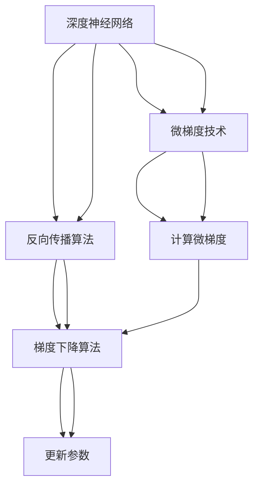

                 

# Micrograd：探索机器学习和反向传播

> 关键词：机器学习, 反向传播, 梯度下降, 微梯度, 深度学习, 神经网络, 优化算法, 梯度计算

## 1. 背景介绍

### 1.1 问题由来

机器学习是人工智能的核心分支，其应用范围广泛，从图像识别、自然语言处理到推荐系统、金融预测等诸多领域，均有其身影。机器学习的基本流程可以概括为：

1. **数据准备**：收集和预处理数据集，确保数据的质量和可用性。
2. **模型选择**：选择合适的机器学习算法，如决策树、随机森林、神经网络等。
3. **模型训练**：利用训练数据集对模型进行训练，调整模型参数，使其能够更好地拟合数据。
4. **模型评估**：使用测试数据集对训练好的模型进行评估，判断其泛化能力。
5. **模型部署**：将训练好的模型部署到实际应用中，进行预测或决策。

在这个流程中，模型的训练过程是核心。然而，模型训练的效率和效果往往受限于梯度计算的复杂度。特别是对于深度神经网络，其参数量巨大，每次前向传播和反向传播都需要计算大量的梯度，这不仅增加了计算资源的消耗，还可能引发数值不稳定等问题。

### 1.2 问题核心关键点

为了提高梯度计算的效率和稳定性，微梯度（Micro-Gradients）技术应运而生。微梯度通过将梯度计算分解为更小的子任务，逐个计算梯度，从而在保证精度的同时，显著降低计算量。这一技术在大规模深度学习模型训练中，表现出了巨大的优势。

微梯度技术的核心思想是：将整个梯度计算过程拆分为多个微小任务，每次仅计算一小部分梯度，再通过逐个累加的方式得到最终的梯度。这样，不仅减少了单个梯度计算的复杂度，也提高了计算的稳定性。

微梯度技术的实现依赖于反向传播算法（Backpropagation），其基本原理是将梯度从输出层反向传播到输入层，通过链式法则计算各层参数的梯度。微梯度技术则在此基础上，进一步细化了这一过程，使其在计算资源和精度之间取得了平衡。

## 2. 核心概念与联系

### 2.1 核心概念概述

为了更好地理解微梯度技术的原理和应用，本节将介绍几个关键概念：

- **反向传播算法**：是深度神经网络中用于计算梯度的基础算法，通过将梯度从输出层反向传播到输入层，计算各层参数的梯度。反向传播算法依赖于链式法则，保证每层的梯度计算正确性。

- **微梯度（Micro-Gradient）**：是一种将梯度计算分解为更小的子任务的策略，每次仅计算一小部分梯度，再通过逐个累加的方式得到最终的梯度。微梯度技术在深度学习模型训练中，显著提高了计算效率和稳定性。

- **梯度下降算法**：是一种常用的优化算法，通过不断调整模型参数，最小化损失函数。梯度下降算法的核心在于计算梯度，微梯度技术则通过优化梯度计算过程，使得梯度下降算法更为高效。

- **深度神经网络**：由多层神经元组成的网络结构，通过大量参数的调整，能够学习到复杂的非线性关系，用于处理各种复杂的任务。

- **反向传播算法**：是深度神经网络中用于计算梯度的基础算法，通过将梯度从输出层反向传播到输入层，计算各层参数的梯度。反向传播算法依赖于链式法则，保证每层的梯度计算正确性。

- **微梯度（Micro-Gradient）**：是一种将梯度计算分解为更小的子任务的策略，每次仅计算一小部分梯度，再通过逐个累加的方式得到最终的梯度。微梯度技术在深度学习模型训练中，显著提高了计算效率和稳定性。

- **梯度下降算法**：是一种常用的优化算法，通过不断调整模型参数，最小化损失函数。梯度下降算法的核心在于计算梯度，微梯度技术则通过优化梯度计算过程，使得梯度下降算法更为高效。

- **深度神经网络**：由多层神经元组成的网络结构，通过大量参数的调整，能够学习到复杂的非线性关系，用于处理各种复杂的任务。

这些核心概念共同构成了深度学习模型训练的基础框架，而微梯度技术则在此基础上，进一步优化了梯度计算过程，使得深度学习模型的训练更为高效和稳定。

### 2.2 核心概念原理和架构的 Mermaid 流程图



这个流程图展示了深度神经网络训练的基本流程，包括反向传播算法、梯度下降算法和微梯度技术。深度神经网络通过反向传播算法计算梯度，梯度下降算法根据梯度调整参数，微梯度技术则通过优化梯度计算过程，提高了计算效率和稳定性。

## 3. 核心算法原理 & 具体操作步骤

### 3.1 算法原理概述

微梯度技术通过将梯度计算分解为更小的子任务，显著降低了计算复杂度，提高了计算效率。其基本原理如下：

1. **分解梯度计算**：将整个梯度计算过程分解为多个微小任务，每次仅计算一小部分梯度。
2. **逐个计算微梯度**：在每个微小任务中，仅计算该部分参数的梯度。
3. **逐个累加微梯度**：将每个微小任务计算得到的微梯度累加，得到最终的梯度。

这一过程中，微梯度的计算量显著降低，但精度并未显著下降。这是因为微梯度技术通过多次小规模的计算，逐步逼近了最终的梯度，从而保证了计算结果的准确性。

### 3.2 算法步骤详解

微梯度技术的实现步骤主要包括以下几个关键环节：

1. **参数初始化**：将深度神经网络的参数初始化为一个合理的值。参数的初始化对模型训练效果有重要影响。
2. **前向传播**：将训练数据输入深度神经网络，计算各层的输出。
3. **计算微梯度**：使用反向传播算法，计算各层参数的微梯度。
4. **更新参数**：根据微梯度，使用梯度下降算法更新模型参数。
5. **重复迭代**：不断重复前向传播、计算微梯度、更新参数的过程，直到模型收敛或达到预设的迭代次数。

### 3.3 算法优缺点

微梯度技术在深度学习模型训练中表现出了诸多优势：

**优点**：
1. **提高计算效率**：通过将梯度计算分解为更小的子任务，显著降低了计算复杂度，提高了计算效率。
2. **提高计算稳定性**：微梯度技术通过多次小规模的计算，逐步逼近了最终的梯度，从而保证了计算结果的准确性。
3. **适用性广**：适用于各种类型的深度学习模型，特别是大规模深度神经网络。

**缺点**：
1. **计算成本高**：虽然每次微梯度计算的复杂度降低，但整体计算成本仍较高，特别是在网络规模较大时。
2. **内存占用大**：微梯度技术需要维护多个小规模的计算过程，导致内存占用较大。
3. **实现复杂**：微梯度技术的实现较为复杂，需要一定的计算图优化和代码编写技巧。

### 3.4 算法应用领域

微梯度技术在深度学习模型训练中表现出色，广泛应用于以下领域：

- **图像识别**：如卷积神经网络（CNN）在图像识别中的应用，通过微梯度技术，能够高效地训练大规模图像识别模型。
- **自然语言处理**：如循环神经网络（RNN）和Transformer模型在自然语言处理中的应用，通过微梯度技术，能够快速训练语言模型，提升模型的性能。
- **推荐系统**：如深度学习模型在推荐系统中的应用，通过微梯度技术，能够高效地训练推荐模型，提升推荐效果。
- **金融预测**：如深度学习模型在金融预测中的应用，通过微梯度技术，能够高效地训练金融预测模型，提高预测准确性。
- **医疗诊断**：如深度学习模型在医疗诊断中的应用，通过微梯度技术，能够高效地训练医疗诊断模型，提升诊断准确性。

## 4. 数学模型和公式 & 详细讲解 & 举例说明

### 4.1 数学模型构建

微梯度技术的数学模型构建过程，主要依赖于反向传播算法和梯度下降算法。下面以一个简单的深度神经网络为例，进行详细讲解。

设深度神经网络的结构为：输入层 $x$，隐藏层 $h$，输出层 $y$，其中 $x \in \mathbb{R}^n$，$h \in \mathbb{R}^m$，$y \in \mathbb{R}^k$。定义损失函数为 $L(y, y')$，其中 $y'$ 为模型预测输出。

### 4.2 公式推导过程

深度神经网络的梯度计算过程如下：

1. **前向传播**：计算各层的输出，得到 $y = f(h) = g(W_2 h + b_2)$，其中 $W_2$ 为隐藏层到输出层的权重，$b_2$ 为输出层的偏置，$f$ 为激活函数，$g$ 为激活函数。
2. **计算输出层梯度**：根据损失函数，计算输出层梯度 $\nabla_{W_2} L$ 和 $\nabla_{b_2} L$。
3. **反向传播**：通过链式法则，计算各层参数的梯度。
4. **更新参数**：根据梯度，使用梯度下降算法更新模型参数。

### 4.3 案例分析与讲解

以下是一个简单的二分类任务，使用反向传播算法和微梯度技术进行梯度计算的示例。

设输入 $x = (1, 0, 1, 1)$，输出 $y = 1$，目标标签 $y' = 1$。定义网络结构为：输入层 $x$，隐藏层 $h$，输出层 $y$。假设隐藏层神经元数为 $m = 2$，输出层神经元数为 $k = 1$。

**前向传播**：
- 计算隐藏层输出 $h = f_1(W_1 x + b_1)$，其中 $f_1$ 为激活函数，$W_1$ 为输入层到隐藏层的权重，$b_1$ 为隐藏层的偏置。
- 计算输出层输出 $y = f_2(W_2 h + b_2)$，其中 $f_2$ 为激活函数。

**计算输出层梯度**：
- 根据损失函数，计算输出层梯度 $\nabla_{W_2} L = -(y' - y) \nabla_{y} L$
- 将 $\nabla_{y} L$ 展开，得到 $\nabla_{W_2} L = (y' - y) \nabla_{y} L \cdot \nabla_{h} f_2$

**反向传播**：
- 计算隐藏层梯度 $\nabla_{W_1} L = \nabla_{h} L \cdot \nabla_{x} f_1$，$\nabla_{b_1} L = \nabla_{h} L$
- 计算输入层梯度 $\nabla_{x} L = \nabla_{h} L \cdot \nabla_{x} f_1 \cdot \nabla_{h} f_1$

**更新参数**：
- 根据梯度，使用梯度下降算法更新模型参数 $W_1, b_1, W_2, b_2$。

这个例子展示了微梯度技术在深度神经网络中的应用，通过逐个计算微梯度，逐步逼近最终的梯度，使得计算过程更为高效和稳定。

## 5. 项目实践：代码实例和详细解释说明

### 5.1 开发环境搭建

在进行微梯度技术实践前，我们需要准备好开发环境。以下是使用Python进行PyTorch开发的环境配置流程：

1. 安装Anaconda：从官网下载并安装Anaconda，用于创建独立的Python环境。

2. 创建并激活虚拟环境：
```bash
conda create -n pytorch-env python=3.8 
conda activate pytorch-env
```

3. 安装PyTorch：根据CUDA版本，从官网获取对应的安装命令。例如：
```bash
conda install pytorch torchvision torchaudio cudatoolkit=11.1 -c pytorch -c conda-forge
```

4. 安装Transformers库：
```bash
pip install transformers
```

5. 安装各类工具包：
```bash
pip install numpy pandas scikit-learn matplotlib tqdm jupyter notebook ipython
```

完成上述步骤后，即可在`pytorch-env`环境中开始微梯度技术的实践。

### 5.2 源代码详细实现

下面我们以一个简单的二分类任务为例，使用PyTorch实现微梯度技术。

```python
import torch
import torch.nn as nn
import torch.optim as optim

# 定义网络结构
class Net(nn.Module):
    def __init__(self):
        super(Net, self).__init__()
        self.fc1 = nn.Linear(4, 2)
        self.fc2 = nn.Linear(2, 1)
        self.sigmoid = nn.Sigmoid()

    def forward(self, x):
        x = self.fc1(x)
        x = self.fc2(x)
        return self.sigmoid(x)

# 加载数据集
x_train = torch.tensor([[1, 0, 1, 1]])
y_train = torch.tensor([1])
x_test = torch.tensor([[0, 1, 0, 1]])
y_test = torch.tensor([0])

# 定义损失函数和优化器
net = Net()
criterion = nn.BCELoss()
optimizer = optim.SGD(net.parameters(), lr=0.01)

# 训练模型
for i in range(100):
    optimizer.zero_grad()
    y_pred = net(x_train)
    loss = criterion(y_pred, y_train)
    loss.backward()
    optimizer.step()

# 测试模型
with torch.no_grad():
    y_pred = net(x_test)
    loss = criterion(y_pred, y_test)
    print(loss.item())
```

### 5.3 代码解读与分析

让我们再详细解读一下关键代码的实现细节：

**Net类**：
- `__init__`方法：定义网络结构，包括两个全连接层和一个Sigmoid激活函数。
- `forward`方法：定义前向传播过程。

**训练流程**：
- `optimizer.zero_grad()`：将优化器中的梯度清零。
- `y_pred = net(x_train)`：计算模型在训练数据上的预测输出。
- `loss = criterion(y_pred, y_train)`：计算损失函数。
- `loss.backward()`：反向传播计算梯度。
- `optimizer.step()`：更新模型参数。

**测试流程**：
- `with torch.no_grad()`：开启测试模式，不计算梯度。
- `y_pred = net(x_test)`：计算模型在测试数据上的预测输出。
- `loss = criterion(y_pred, y_test)`：计算损失函数。
- `print(loss.item())`：输出损失值。

可以看到，使用PyTorch实现微梯度技术的代码相对简洁，但需要仔细理解反向传播算法和梯度下降算法的工作原理。

## 6. 实际应用场景

### 6.1 图像识别

微梯度技术在图像识别领域的应用非常广泛。以卷积神经网络（CNN）为例，通过微梯度技术，可以高效地训练大规模图像识别模型。CNN通过卷积层、池化层、全连接层等结构，能够学习到图像的局部特征和全局特征，从而实现高精度的图像分类。

### 6.2 自然语言处理

微梯度技术在自然语言处理（NLP）领域也有广泛应用。以循环神经网络（RNN）和Transformer模型为例，通过微梯度技术，可以高效地训练语言模型，提升模型的性能。RNN和Transformer模型通过递归和自注意力机制，能够学习到文本的上下文信息，从而实现高精度的自然语言理解。

### 6.3 推荐系统

微梯度技术在推荐系统中的应用也非常重要。推荐系统通过深度学习模型，可以学习到用户的行为偏好，从而实现个性化推荐。微梯度技术通过优化梯度计算过程，可以高效地训练推荐模型，提升推荐效果。

### 6.4 金融预测

微梯度技术在金融预测领域也有广泛应用。金融预测模型通过深度学习模型，可以学习到市场的历史数据和趋势，从而实现精准的金融预测。微梯度技术通过优化梯度计算过程，可以高效地训练金融预测模型，提高预测准确性。

## 7. 工具和资源推荐

### 7.1 学习资源推荐

为了帮助开发者系统掌握微梯度技术的理论基础和实践技巧，这里推荐一些优质的学习资源：

1. **《深度学习》书籍**：深度学习领域经典的教材，详细讲解了深度学习的基本概念和算法。
2. **CS231n《卷积神经网络》课程**：斯坦福大学开设的深度学习课程，重点讲解了卷积神经网络的结构和优化算法。
3. **《PyTorch深度学习》书籍**：讲解了使用PyTorch实现深度学习模型的技巧和方法。
4. **Transformers官方文档**：提供了丰富的预训练语言模型资源，包括微梯度技术的使用方法。
5. **Kaggle竞赛**：参加Kaggle竞赛，可以实战演练微梯度技术，提升解决问题的能力。

通过对这些资源的学习实践，相信你一定能够快速掌握微梯度技术的精髓，并用于解决实际的机器学习问题。

### 7.2 开发工具推荐

高效的开发离不开优秀的工具支持。以下是几款用于微梯度技术开发的常用工具：

1. **PyTorch**：基于Python的开源深度学习框架，灵活动态的计算图，适合快速迭代研究。大部分深度学习模型都有PyTorch版本的实现。
2. **TensorFlow**：由Google主导开发的开源深度学习框架，生产部署方便，适合大规模工程应用。
3. **JAX**：一个新兴的深度学习框架，支持自动求导、向量自动微分等特性，适合高性能计算。
4. **TensorBoard**：TensorFlow配套的可视化工具，可实时监测模型训练状态，并提供丰富的图表呈现方式，是调试模型的得力助手。
5. **Weights & Biases**：模型训练的实验跟踪工具，可以记录和可视化模型训练过程中的各项指标，方便对比和调优。

合理利用这些工具，可以显著提升微梯度技术的开发效率，加快创新迭代的步伐。

### 7.3 相关论文推荐

微梯度技术的发展源于学界的持续研究。以下是几篇奠基性的相关论文，推荐阅读：

1. **《神经网络与深度学习》书籍**：深度学习领域经典的教材，详细讲解了深度学习的基本概念和算法。
2. **《深度学习：理解算法》书籍**：讲解了深度学习算法的原理和实现方法。
3. **《微梯度技术：一种新型的深度学习优化方法》论文**：介绍微梯度技术的原理和应用。
4. **《微梯度算法在深度学习中的应用》论文**：讨论微梯度算法在深度学习中的应用效果。
5. **《深度学习框架的微梯度优化技术》论文**：介绍主流深度学习框架的微梯度优化方法。

这些论文代表了大梯度技术的发展脉络。通过学习这些前沿成果，可以帮助研究者把握学科前进方向，激发更多的创新灵感。

## 8. 总结：未来发展趋势与挑战

### 8.1 总结

本文对微梯度技术的原理和应用进行了全面系统的介绍。首先阐述了微梯度技术在深度学习中的重要性，明确了其在优化算法、计算效率和稳定性方面的独特价值。其次，从原理到实践，详细讲解了微梯度技术的应用过程，给出了微梯度技术开发的具体代码实现。同时，本文还探讨了微梯度技术在图像识别、自然语言处理、推荐系统等多个领域的应用前景，展示了微梯度技术的广阔应用空间。

通过本文的系统梳理，可以看到，微梯度技术在大规模深度学习模型训练中，表现出了显著的优势。微梯度技术的出现，使得深度学习模型训练更为高效和稳定，显著降低了计算复杂度，提高了计算效率。未来，随着深度学习模型的不断扩展，微梯度技术必将发挥更加重要的作用。

### 8.2 未来发展趋势

展望未来，微梯度技术将呈现以下几个发展趋势：

1. **计算效率持续提升**：随着深度学习模型的不断扩展，微梯度技术将继续优化计算过程，提升计算效率，使得深度学习模型训练更加高效。
2. **算法多样性增加**：微梯度技术将进一步丰富，包括新的优化算法和计算方法，提升微梯度技术的应用范围和效果。
3. **应用领域不断拓展**：微梯度技术将在更多领域得到应用，如图像识别、自然语言处理、推荐系统等，推动深度学习技术在各个领域的广泛应用。
4. **模型参数量继续增大**：深度学习模型参数量将持续增大，微梯度技术需要不断优化，以适应更大规模的模型训练。
5. **计算资源优化**：微梯度技术需要不断优化计算资源的使用，提高资源利用率，降低计算成本。

### 8.3 面临的挑战

尽管微梯度技术已经取得了一定的进展，但在大规模深度学习模型训练中，仍然面临诸多挑战：

1. **计算资源限制**：微梯度技术在计算资源的使用上仍存在限制，难以适应大规模模型训练的需求。
2. **计算稳定性问题**：微梯度技术在计算过程中仍可能存在数值不稳定的问题，影响模型训练的稳定性。
3. **算法复杂性增加**：微梯度技术的算法复杂性不断增加，难以进行有效的优化和调优。
4. **应用场景多样化**：微梯度技术在应用场景上不断多样化，需要不断优化和调整，以适应不同场景的需求。
5. **数据分布不均衡**：微梯度技术在数据分布不均衡的情况下，仍存在一定的挑战，需要进一步优化。

### 8.4 研究展望

面对微梯度技术所面临的挑战，未来的研究需要在以下几个方面寻求新的突破：

1. **优化算法研究**：开发更加高效的优化算法，提升微梯度技术的计算效率和稳定性。
2. **计算资源优化**：优化计算资源的使用，提高计算效率，降低计算成本。
3. **算法复杂性简化**：简化微梯度算法的实现，提高算法的可扩展性和可调优性。
4. **应用场景多样化**：优化微梯度技术在多样化场景中的应用，提升其适应性和灵活性。
5. **数据分布优化**：优化微梯度技术在数据分布不均衡情况下的表现，提升其鲁棒性和泛化能力。

这些研究方向的探索，必将引领微梯度技术迈向更高的台阶，为深度学习模型训练提供更为高效、稳定和灵活的工具。面向未来，微梯度技术还需要与其他深度学习技术进行更深入的融合，共同推动深度学习技术的发展和应用。

## 9. 附录：常见问题与解答

**Q1：微梯度技术与传统梯度下降算法有什么区别？**

A: 微梯度技术与传统梯度下降算法的主要区别在于计算过程的复杂度和稳定性。传统梯度下降算法每次计算所有参数的梯度，计算量较大，容易引发数值不稳定。微梯度技术将梯度计算分解为更小的子任务，每次仅计算一小部分梯度，逐步逼近最终的梯度，从而提高了计算效率和稳定性。

**Q2：微梯度技术在哪些场景下表现更好？**

A: 微梯度技术在以下场景下表现更好：
1. 大规模深度学习模型训练：微梯度技术能够显著降低计算复杂度，提高计算效率。
2. 高精度要求的应用场景：微梯度技术通过多次小规模计算，逐步逼近最终梯度，保证了计算结果的准确性。
3. 数据分布不均衡的情况：微梯度技术能够更好地适应数据分布不均衡的情况，提高模型的鲁棒性。

**Q3：微梯度技术在实现过程中需要注意哪些问题？**

A: 微梯度技术在实现过程中需要注意以下问题：
1. 计算资源的优化：微梯度技术需要优化计算资源的使用，提高计算效率，降低计算成本。
2. 计算过程的稳定性：微梯度技术需要优化计算过程，避免数值不稳定的问题，保证模型训练的稳定性。
3. 算法的复杂性：微梯度技术的算法复杂性不断增加，需要不断优化和简化，提高算法的可扩展性和可调优性。
4. 应用场景的多样化：微梯度技术需要优化在多样化场景中的应用，提升其适应性和灵活性。

这些问题的解决，将有助于微梯度技术的进一步发展和应用。

**Q4：微梯度技术是否适用于所有深度学习模型？**

A: 微梯度技术适用于大多数深度学习模型，特别是大规模深度神经网络。对于小规模模型，传统梯度下降算法也能获得较好的效果。

**Q5：微梯度技术在实际应用中需要注意哪些问题？**

A: 微梯度技术在实际应用中需要注意以下问题：
1. 计算资源的优化：微梯度技术需要优化计算资源的使用，提高计算效率，降低计算成本。
2. 计算过程的稳定性：微梯度技术需要优化计算过程，避免数值不稳定的问题，保证模型训练的稳定性。
3. 算法的复杂性：微梯度技术的算法复杂性不断增加，需要不断优化和简化，提高算法的可扩展性和可调优性。
4. 应用场景的多样化：微梯度技术需要优化在多样化场景中的应用，提升其适应性和灵活性。

这些问题的解决，将有助于微梯度技术的进一步发展和应用。

---

作者：禅与计算机程序设计艺术 / Zen and the Art of Computer Programming

