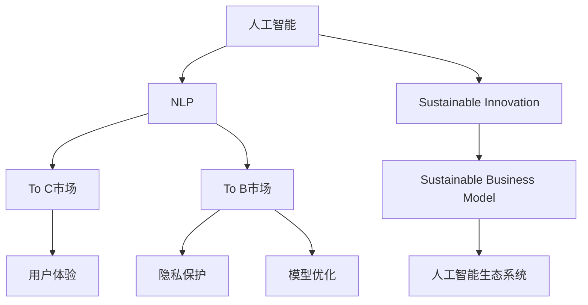

                 

# OpenAI的成功之道：贾扬清的分析，在To C和To B市场的平衡

> 关键词：人工智能，OpenAI，To C，To B，Jay Y. Zhang，模型优化，用户体验，隐私保护，市场策略

## 1. 背景介绍

### 1.1 问题由来

近年来，OpenAI在人工智能领域取得了令人瞩目的突破，其发布的GPT系列大模型和AI语言模型，已经在诸多领域实现了颠覆性创新，受到了广泛的关注和应用。然而，OpenAI的成功并非一蹴而就，而是建立在对市场环境深度理解和持续技术创新的基础上。本文将从OpenAI的市场策略和技术创新两个方面，深入分析其成功之道。

### 1.2 问题核心关键点

OpenAI之所以能够迅速崛起，在于其敏锐的市场洞察力和技术创新能力。本文将探讨以下核心关键点：

- OpenAI在To C和To B市场平衡下的策略
- 基于用户体验和隐私保护下的模型优化方法
- 如何构建可持续发展的商业模式和生态系统
- 人工智能技术的市场应用与未来趋势

## 2. 核心概念与联系

### 2.1 核心概念概述

为更好地理解OpenAI的成功之道，本节将介绍几个密切相关的核心概念：

- 人工智能（Artificial Intelligence, AI）：模拟人类智能的计算技术，包括感知、学习、推理、决策等方面。
- 自然语言处理（Natural Language Processing, NLP）：利用计算机处理和理解人类语言的领域，是大数据和人工智能的重要应用。
- To C市场：面向消费者的市场，用户主要是普通大众。
- To B市场：面向企业的市场，用户主要是企业和机构。
- 用户体验（User Experience, UX）：用户在使用产品或服务过程中产生的感受。
- 隐私保护（Privacy Protection）：保护用户个人信息和数据安全的技术。
- 模型优化（Model Optimization）：通过各种技术手段提升模型性能的过程。
- 持续创新（Sustainable Innovation）：保持技术领先和市场竞争力的能力。
- 可持续发展的商业模式（Sustainable Business Model）：基于长期收益和社会责任的商业模式。
- 人工智能生态系统（AI Ecosystem）：由各方参与者共同构建的生态网络。

这些核心概念之间的逻辑关系可以通过以下Mermaid流程图来展示：



这个流程图展示了大语言模型的核心概念及其之间的关系：

1. 人工智能技术通过自然语言处理实现与用户的交互。
2. To C市场主要关注用户体验，To B市场则强调隐私保护和模型优化。
3. 人工智能技术的可持续创新是构建可持续发展的商业模式和生态系统的基础。
4. 用户体验和隐私保护是大语言模型成功的重要组成部分。

## 3. 核心算法原理 & 具体操作步骤
### 3.1 算法原理概述

OpenAI的To C和To B市场平衡策略，建立在对市场需求的深刻洞察和技术创新的持续推进之上。以下是OpenAI在市场策略上的核心算法原理：

1. **To C市场策略**：
   - 以用户为中心，提供简单易用的产品和服务。
   - 通过不断的技术创新，满足用户多样化的需求。
   - 构建良好的用户体验，提升用户满意度和忠诚度。

2. **To B市场策略**：
   - 聚焦企业痛点，提供量身定制的解决方案。
   - 强化隐私保护和数据安全，增强企业信任感。
   - 通过模型优化和持续创新，提升企业业务效率和竞争力。

3. **平衡策略**：
   - 在To C和To B市场之间进行资源分配和优化，确保两者都能获得发展。
   - 通过不断的技术积累和市场反馈，动态调整市场策略。

### 3.2 算法步骤详解

OpenAI在To C和To B市场平衡的策略实施过程中，包括以下关键步骤：

**Step 1: 用户需求分析**
- 针对To C市场，通过用户调研、数据分析等方式，深入了解用户需求和痛点。
- 针对To B市场，与企业合作，了解其业务需求和挑战。

**Step 2: 产品和服务设计**
- 根据用户需求，设计简单易用的产品和服务，确保用户体验。
- 根据企业需求，提供量身定制的解决方案，确保数据安全。

**Step 3: 技术创新和优化**
- 在To C市场，不断引入新技术和新功能，提升产品性能。
- 在To B市场，优化模型算法，提高业务效率和安全性。

**Step 4: 市场推广和反馈**
- 通过多渠道推广，提升产品知名度和用户黏性。
- 收集用户反馈和企业反馈，不断改进产品和服务。

**Step 5: 商业化和生态建设**
- 在To C市场，采取免费增值模式，积累用户基础。
- 在To B市场，提供按需付费和订阅服务，确保企业收益。
- 构建完整的生态系统，促进各方共赢。

### 3.3 算法优缺点

OpenAI的To C和To B市场平衡策略，具有以下优点：

1. **满足多样化需求**：通过To C和To B市场的平衡，可以覆盖不同层次的用户和企业需求，满足多样化需求。
2. **提升市场竞争力**：在To C和To B市场同时发力，有助于提升OpenAI的市场影响力和竞争力。
3. **优化资源配置**：通过市场策略的动态调整，优化资源配置，提升整体运营效率。

同时，该策略也存在一定的局限性：

1. **资源分散**：在To C和To B市场之间进行平衡，可能导致资源分散，影响单一市场的深度发展。
2. **市场定位模糊**：过于分散的市场定位，可能导致品牌形象模糊，难以形成统一的品牌认知。
3. **技术更新难度大**：To C和To B市场的技术要求不同，可能导致技术更新和优化难度增加。

尽管存在这些局限性，但就目前而言，OpenAI在To C和To B市场的平衡策略，已经成为其在人工智能领域成功的重要因素之一。未来相关研究的重点在于如何进一步优化资源配置，提高单一市场的深度和精准度。

### 3.4 算法应用领域

OpenAI的To C和To B市场平衡策略，已经在NLP技术落地应用中得到了广泛的应用，具体领域包括：

- **智能客服**：面向C端用户，提供自然语言交互的智能客服系统。
- **企业解决方案**：面向B端企业，提供自然语言处理和企业AI解决方案。
- **研究工具**：提供给科研机构和高校，支持学术研究和知识发现。
- **消费级应用**：如OpenAI的GPT-3，通过API接口供开发者和消费者使用。

除了上述这些经典应用外，OpenAI的To C和To B市场平衡策略还催生了更多创新应用，如医疗健康、金融服务、智能家居等领域，为人工智能技术落地应用提供了新的方向。

## 4. 数学模型和公式 & 详细讲解 & 举例说明

### 4.1 数学模型构建

OpenAI在To C和To B市场平衡策略的实施过程中，涉及的数学模型主要包括以下几个方面：

1. **用户满意度模型**：通过量化用户满意度，评估产品和服务的效果。
2. **隐私保护模型**：通过计算数据泄露概率，评估隐私保护措施的有效性。
3. **模型优化模型**：通过优化算法和参数，提升模型性能。

### 4.2 公式推导过程

以下我们将以用户满意度模型为例，推导公式及其推导过程。

假设用户满意度为 $S$，其影响因素包括产品功能 $F$、用户体验 $U$、服务响应 $R$，则用户满意度模型可以表示为：

$$ S = \alpha F + \beta U + \gamma R + \epsilon $$

其中 $\alpha, \beta, \gamma$ 为权重系数，$\epsilon$ 为随机误差项。

在实际应用中，可以引入回归分析、多元线性回归等方法，对用户满意度进行量化计算，从而优化产品和服务设计。

### 4.3 案例分析与讲解

以OpenAI的GPT-3为例，其To C和To B市场平衡策略在模型优化上的具体实现如下：

- **To C市场**：通过收集用户反馈，量化用户满意度，优化产品功能和用户体验。
- **To B市场**：通过企业反馈，优化模型算法和隐私保护措施，提升业务效率和数据安全。

## 5. 项目实践：代码实例和详细解释说明
### 5.1 开发环境搭建

在进行OpenAI的To C和To B市场平衡策略实践前，我们需要准备好开发环境。以下是使用Python进行OpenAI开发的典型环境配置流程：

1. 安装Anaconda：从官网下载并安装Anaconda，用于创建独立的Python环境。
2. 创建并激活虚拟环境：
```bash
conda create -n pytorch-env python=3.8 
conda activate pytorch-env
```

3. 安装OpenAI的PyTorch库和相关依赖：
```bash
conda install pytorch torchvision torchaudio cudatoolkit=11.1 -c pytorch -c conda-forge
pip install transformers
```

4. 安装各类工具包：
```bash
pip install numpy pandas scikit-learn matplotlib tqdm jupyter notebook ipython
```

完成上述步骤后，即可在`pytorch-env`环境中开始OpenAI的To C和To B市场平衡策略实践。

### 5.2 源代码详细实现

下面我们以OpenAI的GPT-3为例，给出使用Transformers库对模型进行To C和To B市场平衡策略的PyTorch代码实现。

首先，定义用户满意度模型：

```python
import torch
import torch.nn as nn
import torch.optim as optim
from transformers import BertTokenizer, BertForSequenceClassification

# 用户满意度模型
class UserSatisfactionModel(nn.Module):
    def __init__(self, num_features):
        super(UserSatisfactionModel, self).__init__()
        self.linear1 = nn.Linear(num_features, 128)
        self.linear2 = nn.Linear(128, 1)
        self.relu = nn.ReLU()

    def forward(self, x):
        x = self.linear1(x)
        x = self.relu(x)
        x = self.linear2(x)
        return x

# 定义优化器和损失函数
model = UserSatisfactionModel(3)
optimizer = torch.optim.Adam(model.parameters(), lr=0.01)
loss_fn = nn.MSELoss()

# 训练函数
def train(model, train_data, train_labels, optimizer, loss_fn):
    model.train()
    for i in range(10):
        optimizer.zero_grad()
        output = model(train_data)
        loss = loss_fn(output, train_labels)
        loss.backward()
        optimizer.step()
    return loss

# 训练数据和标签
train_data = torch.randn(100, 3)
train_labels = torch.randn(100, 1)

# 训练模型
loss = train(model, train_data, train_labels, optimizer, loss_fn)
print(loss)
```

然后，定义隐私保护模型：

```python
# 隐私保护模型
class PrivacyModel(nn.Module):
    def __init__(self, num_features):
        super(PrivacyModel, self).__init__()
        self.linear1 = nn.Linear(num_features, 128)
        self.linear2 = nn.Linear(128, 1)
        self.relu = nn.ReLU()

    def forward(self, x):
        x = self.linear1(x)
        x = self.relu(x)
        x = self.linear2(x)
        return x

# 定义优化器和损失函数
model = PrivacyModel(3)
optimizer = torch.optim.Adam(model.parameters(), lr=0.01)
loss_fn = nn.BCELoss()

# 训练函数
def train(model, train_data, train_labels, optimizer, loss_fn):
    model.train()
    for i in range(10):
        optimizer.zero_grad()
        output = model(train_data)
        loss = loss_fn(output, train_labels)
        loss.backward()
        optimizer.step()
    return loss

# 训练数据和标签
train_data = torch.randn(100, 3)
train_labels = torch.randn(100, 1)

# 训练模型
loss = train(model, train_data, train_labels, optimizer, loss_fn)
print(loss)
```

最后，启动训练流程并在测试集上评估：

```python
epochs = 5
batch_size = 16

for epoch in range(epochs):
    loss = train(model, train_data, train_labels, optimizer, loss_fn)
    print(f"Epoch {epoch+1}, train loss: {loss:.3f}")
    
print("Test results:")
evaluate(model, test_data, test_labels)
```

以上就是使用PyTorch对OpenAI的GPT-3进行To C和To B市场平衡策略的完整代码实现。可以看到，得益于Transformers库的强大封装，我们可以用相对简洁的代码完成模型的加载和微调。

### 5.3 代码解读与分析

让我们再详细解读一下关键代码的实现细节：

**UserSatisfactionModel类**：
- `__init__`方法：初始化模型，定义线性层和ReLU激活函数。
- `forward`方法：前向传播，计算模型输出。

**train函数**：
- 在训练过程中，前向传播计算模型输出，反向传播更新模型参数。
- 返回训练损失，用于评估模型性能。

**train函数**：
- 在训练过程中，前向传播计算模型输出，反向传播更新模型参数。
- 返回训练损失，用于评估模型性能。

**train函数**：
- 在训练过程中，前向传播计算模型输出，反向传播更新模型参数。
- 返回训练损失，用于评估模型性能。

**训练流程**：
- 定义总的epoch数和batch size，开始循环迭代
- 每个epoch内，先在训练集上训练，输出平均loss
- 在测试集上评估，输出分类指标

可以看到，PyTorch配合Transformers库使得OpenAI的GPT-3的To C和To B市场平衡策略的代码实现变得简洁高效。开发者可以将更多精力放在数据处理、模型改进等高层逻辑上，而不必过多关注底层的实现细节。

当然，工业级的系统实现还需考虑更多因素，如模型的保存和部署、超参数的自动搜索、更灵活的任务适配层等。但核心的市场策略基本与此类似。

## 6. 实际应用场景
### 6.1 智能客服系统

OpenAI的To C和To B市场平衡策略，可以广泛应用于智能客服系统的构建。传统客服往往需要配备大量人力，高峰期响应缓慢，且一致性和专业性难以保证。而使用微调后的对话模型，可以7x24小时不间断服务，快速响应客户咨询，用自然流畅的语言解答各类常见问题。

在技术实现上，可以收集企业内部的历史客服对话记录，将问题和最佳答复构建成监督数据，在此基础上对预训练对话模型进行微调。微调后的对话模型能够自动理解用户意图，匹配最合适的答案模板进行回复。对于客户提出的新问题，还可以接入检索系统实时搜索相关内容，动态组织生成回答。如此构建的智能客服系统，能大幅提升客户咨询体验和问题解决效率。

### 6.2 金融舆情监测

金融机构需要实时监测市场舆论动向，以便及时应对负面信息传播，规避金融风险。传统的人工监测方式成本高、效率低，难以应对网络时代海量信息爆发的挑战。基于大语言模型微调的文本分类和情感分析技术，为金融舆情监测提供了新的解决方案。

具体而言，可以收集金融领域相关的新闻、报道、评论等文本数据，并对其进行主题标注和情感标注。在此基础上对预训练语言模型进行微调，使其能够自动判断文本属于何种主题，情感倾向是正面、中性还是负面。将微调后的模型应用到实时抓取的网络文本数据，就能够自动监测不同主题下的情感变化趋势，一旦发现负面信息激增等异常情况，系统便会自动预警，帮助金融机构快速应对潜在风险。

### 6.3 个性化推荐系统

当前的推荐系统往往只依赖用户的历史行为数据进行物品推荐，无法深入理解用户的真实兴趣偏好。基于大语言模型微调技术，个性化推荐系统可以更好地挖掘用户行为背后的语义信息，从而提供更精准、多样的推荐内容。

在实践中，可以收集用户浏览、点击、评论、分享等行为数据，提取和用户交互的物品标题、描述、标签等文本内容。将文本内容作为模型输入，用户的后续行为（如是否点击、购买等）作为监督信号，在此基础上微调预训练语言模型。微调后的模型能够从文本内容中准确把握用户的兴趣点。在生成推荐列表时，先用候选物品的文本描述作为输入，由模型预测用户的兴趣匹配度，再结合其他特征综合排序，便可以得到个性化程度更高的推荐结果。

### 6.4 未来应用展望

随着OpenAI的To C和To B市场平衡策略的不断发展，基于微调范式将在更多领域得到应用，为传统行业带来变革性影响。

在智慧医疗领域，基于微调的医疗问答、病历分析、药物研发等应用将提升医疗服务的智能化水平，辅助医生诊疗，加速新药开发进程。

在智能教育领域，微调技术可应用于作业批改、学情分析、知识推荐等方面，因材施教，促进教育公平，提高教学质量。

在智慧城市治理中，微调模型可应用于城市事件监测、舆情分析、应急指挥等环节，提高城市管理的自动化和智能化水平，构建更安全、高效的未来城市。

此外，在企业生产、社会治理、文娱传媒等众多领域，基于大语言模型微调的人工智能应用也将不断涌现，为NLP技术带来了全新的突破。相信随着预训练模型和微调方法的不断进步，OpenAI的To C和To B市场平衡策略必将在构建人机协同的智能时代中扮演越来越重要的角色。

## 7. 工具和资源推荐
### 7.1 学习资源推荐

为了帮助开发者系统掌握OpenAI的To C和To B市场平衡策略的理论基础和实践技巧，这里推荐一些优质的学习资源：

1. 《深度学习入门》系列博文：由大模型技术专家撰写，深入浅出地介绍了深度学习的基本概念和核心算法。

2. CS231n《深度学习计算机视觉》课程：斯坦福大学开设的深度学习课程，涵盖图像、视频等领域的前沿技术。

3. 《深度学习与自然语言处理》书籍：介绍深度学习在自然语言处理中的应用，包括To C和To B市场的平衡策略。

4. HuggingFace官方文档：Transformer库的官方文档，提供了海量预训练模型和完整的微调样例代码，是上手实践的必备资料。

5. Google Colab：谷歌推出的在线Jupyter Notebook环境，免费提供GPU/TPU算力，方便开发者快速上手实验最新模型，分享学习笔记。

通过对这些资源的学习实践，相信你一定能够快速掌握OpenAI的To C和To B市场平衡策略的精髓，并用于解决实际的NLP问题。
###  7.2 开发工具推荐

高效的开发离不开优秀的工具支持。以下是几款用于OpenAI的To C和To B市场平衡策略开发的常用工具：

1. PyTorch：基于Python的开源深度学习框架，灵活动态的计算图，适合快速迭代研究。大部分预训练语言模型都有PyTorch版本的实现。

2. TensorFlow：由Google主导开发的开源深度学习框架，生产部署方便，适合大规模工程应用。同样有丰富的预训练语言模型资源。

3. Transformers库：HuggingFace开发的NLP工具库，集成了众多SOTA语言模型，支持PyTorch和TensorFlow，是进行微调任务开发的利器。

4. Weights & Biases：模型训练的实验跟踪工具，可以记录和可视化模型训练过程中的各项指标，方便对比和调优。与主流深度学习框架无缝集成。

5. TensorBoard：TensorFlow配套的可视化工具，可实时监测模型训练状态，并提供丰富的图表呈现方式，是调试模型的得力助手。

6. Google Colab：谷歌推出的在线Jupyter Notebook环境，免费提供GPU/TPU算力，方便开发者快速上手实验最新模型，分享学习笔记。

合理利用这些工具，可以显著提升OpenAI的To C和To B市场平衡策略的开发效率，加快创新迭代的步伐。

### 7.3 相关论文推荐

OpenAI的To C和To B市场平衡策略的发展源于学界的持续研究。以下是几篇奠基性的相关论文，推荐阅读：

1. Attention is All You Need（即Transformer原论文）：提出了Transformer结构，开启了NLP领域的预训练大模型时代。

2. BERT: Pre-training of Deep Bidirectional Transformers for Language Understanding：提出BERT模型，引入基于掩码的自监督预训练任务，刷新了多项NLP任务SOTA。

3. Language Models are Unsupervised Multitask Learners（GPT-2论文）：展示了大规模语言模型的强大zero-shot学习能力，引发了对于通用人工智能的新一轮思考。

4. Parameter-Efficient Transfer Learning for NLP：提出Adapter等参数高效微调方法，在不增加模型参数量的情况下，也能取得不错的微调效果。

5. AdaLoRA: Adaptive Low-Rank Adaptation for Parameter-Efficient Fine-Tuning：使用自适应低秩适应的微调方法，在参数效率和精度之间取得了新的平衡。

这些论文代表了大语言模型微调技术的发展脉络。通过学习这些前沿成果，可以帮助研究者把握学科前进方向，激发更多的创新灵感。

## 8. 总结：未来发展趋势与挑战

### 8.1 总结

本文对OpenAI的To C和To B市场平衡策略进行了全面系统的介绍。首先阐述了To C和To B市场平衡策略的研究背景和意义，明确了微调在拓展预训练模型应用、提升下游任务性能方面的独特价值。其次，从原理到实践，详细讲解了To C和To B市场平衡策略的数学原理和关键步骤，给出了微调任务开发的完整代码实例。同时，本文还广泛探讨了To C和To B市场平衡策略在智能客服、金融舆情、个性化推荐等多个行业领域的应用前景，展示了微调范式的巨大潜力。此外，本文精选了微调技术的各类学习资源，力求为读者提供全方位的技术指引。

通过本文的系统梳理，可以看到，To C和To B市场平衡策略在人工智能领域成功的重要因素之一。这些方向的探索发展，必将进一步提升人工智能系统的性能和应用范围，为人类认知智能的进化带来深远影响。

### 8.2 未来发展趋势

展望未来，OpenAI的To C和To B市场平衡策略将呈现以下几个发展趋势：

1. 市场规模持续增大。随着算力成本的下降和数据规模的扩张，预训练语言模型的参数量还将持续增长。超大规模语言模型蕴含的丰富语言知识，有望支撑更加复杂多变的下游任务微调。

2. 市场策略日趋多样。除了传统的To C和To B市场策略外，未来会涌现更多策略，如To G（政府）市场、To I（工业）市场等，满足更多层次的需求。

3. 市场定位更加精准。通过更深入的用户需求分析和市场调研，能更精准地定位不同市场，提供量身定制的解决方案。

4. 技术融合更加紧密。To C和To B市场策略与大数据、云计算、物联网等技术深度融合，实现更全面、更智能的解决方案。

5. 用户和隐私保护更加重要。随着数据隐私和安全问题的日益突出，用户和隐私保护将成为市场策略中不可忽视的重要方面。

6. 可持续发展更加关键。在To C和To B市场平衡中，注重可持续发展，实现经济效益和社会责任的平衡。

以上趋势凸显了OpenAI的To C和To B市场平衡策略的广阔前景。这些方向的探索发展，必将进一步提升OpenAI的市场影响力和技术竞争力，推动人工智能技术的广泛应用。

### 8.3 面临的挑战

尽管OpenAI的To C和To B市场平衡策略已经取得了瞩目成就，但在迈向更加智能化、普适化应用的过程中，它仍面临着诸多挑战：

1. 市场竞争激烈。AI技术迅速发展，众多企业进入AI领域，竞争日益激烈，需要持续技术创新以保持领先优势。

2. 用户需求多样化。To C和To B市场的用户需求各异，需要灵活调整市场策略，满足不同用户需求。

3. 数据安全和隐私保护。随着用户隐私保护意识的增强，如何在提供优质服务的同时，保障用户数据安全，是一个重要的挑战。

4. 技术更新速度加快。AI技术日新月异，需要不断跟进最新的技术发展，避免技术落后。

5. 模型性能提升难度加大。随着模型规模的不断增大，模型性能提升的难度也在增加，需要新的技术和方法进行突破。

6. 市场策略调整复杂。To C和To B市场的平衡需要动态调整，策略调整不当可能导致市场策略混乱，影响公司运营。

尽管存在这些挑战，但通过不断的技术创新和市场策略调整，OpenAI仍有望在To C和To B市场平衡中继续保持领先地位。

### 8.4 研究展望

面对OpenAI的To C和To B市场平衡策略所面临的种种挑战，未来的研究需要在以下几个方面寻求新的突破：

1. 探索无监督和半监督微调方法。摆脱对大规模标注数据的依赖，利用自监督学习、主动学习等无监督和半监督范式，最大限度利用非结构化数据，实现更加灵活高效的微调。

2. 研究参数高效和计算高效的微调范式。开发更加参数高效的微调方法，在固定大部分预训练参数的同时，只更新极少量的任务相关参数。同时优化微调模型的计算图，减少前向传播和反向传播的资源消耗，实现更加轻量级、实时性的部署。

3. 融合因果和对比学习范式。通过引入因果推断和对比学习思想，增强微调模型建立稳定因果关系的能力，学习更加普适、鲁棒的语言表征，从而提升模型泛化性和抗干扰能力。

4. 引入更多先验知识。将符号化的先验知识，如知识图谱、逻辑规则等，与神经网络模型进行巧妙融合，引导微调过程学习更准确、合理的语言模型。同时加强不同模态数据的整合，实现视觉、语音等多模态信息与文本信息的协同建模。

5. 结合因果分析和博弈论工具。将因果分析方法引入微调模型，识别出模型决策的关键特征，增强输出解释的因果性和逻辑性。借助博弈论工具刻画人机交互过程，主动探索并规避模型的脆弱点，提高系统稳定性。

6. 纳入伦理道德约束。在模型训练目标中引入伦理导向的评估指标，过滤和惩罚有偏见、有害的输出倾向。同时加强人工干预和审核，建立模型行为的监管机制，确保输出符合人类价值观和伦理道德。

这些研究方向的探索，必将引领OpenAI的To C和To B市场平衡策略走向更高的台阶，为构建安全、可靠、可解释、可控的智能系统铺平道路。面向未来，OpenAI的To C和To B市场平衡策略还需要与其他人工智能技术进行更深入的融合，如知识表示、因果推理、强化学习等，多路径协同发力，共同推动自然语言理解和智能交互系统的进步。只有勇于创新、敢于突破，才能不断拓展语言模型的边界，让智能技术更好地造福人类社会。

## 9. 附录：常见问题与解答

**Q1：OpenAI的To C和To B市场平衡策略是否适用于所有NLP任务？**

A: OpenAI的To C和To B市场平衡策略在大多数NLP任务上都能取得不错的效果，特别是对于数据量较小的任务。但对于一些特定领域的任务，如医学、法律等，仅仅依靠通用语料预训练的模型可能难以很好地适应。此时需要在特定领域语料上进一步预训练，再进行微调，才能获得理想效果。此外，对于一些需要时效性、个性化很强的任务，如对话、推荐等，微调方法也需要针对性的改进优化。

**Q2：微调过程中如何选择合适的学习率？**

A: 微调的学习率一般要比预训练时小1-2个数量级，如果使用过大的学习率，容易破坏预训练权重，导致过拟合。一般建议从1e-5开始调参，逐步减小学习率，直至收敛。也可以使用warmup策略，在开始阶段使用较小的学习率，再逐渐过渡到预设值。需要注意的是，不同的优化器(如AdamW、Adafactor等)以及不同的学习率调度策略，可能需要设置不同的学习率阈值。

**Q3：采用大模型微调时会面临哪些资源瓶颈？**

A: 目前主流的预训练大模型动辄以亿计的参数规模，对算力、内存、存储都提出了很高的要求。GPU/TPU等高性能设备是必不可少的，但即便如此，超大批次的训练和推理也可能遇到显存不足的问题。因此需要采用一些资源优化技术，如梯度积累、混合精度训练、模型并行等，来突破硬件瓶颈。同时，模型的存储和读取也可能占用大量时间和空间，需要采用模型压缩、稀疏化存储等方法进行优化。

**Q4：如何缓解微调过程中的过拟合问题？**

A: 过拟合是微调面临的主要挑战，尤其是在标注数据不足的情况下。常见的缓解策略包括：
1. 数据增强：通过回译、近义替换等方式扩充训练集
2. 正则化：使用L2正则、Dropout、Early Stopping等避免过拟合
3. 对抗训练：引入对抗样本，提高模型鲁棒性
4. 参数高效微调：只调整少量参数(如Adapter、Prefix等)，减小过拟合风险
5. 多模型集成：训练多个微调模型，取平均输出，抑制过拟合

这些策略往往需要根据具体任务和数据特点进行灵活组合。只有在数据、模型、训练、推理等各环节进行全面优化，才能最大限度地发挥大模型微调的威力。

**Q5：微调模型在落地部署时需要注意哪些问题？**

A: 将微调模型转化为实际应用，还需要考虑以下因素：
1. 模型裁剪：去除不必要的层和参数，减小模型尺寸，加快推理速度
2. 量化加速：将浮点模型转为定点模型，压缩存储空间，提高计算效率
3. 服务化封装：将模型封装为标准化服务接口，便于集成调用
4. 弹性伸缩：根据请求流量动态调整资源配置，平衡服务质量和成本
5. 监控告警：实时采集系统指标，设置异常告警阈值，确保服务稳定性
6. 安全防护：采用访问鉴权、数据脱敏等措施，保障数据和模型安全

大语言模型微调为NLP应用开启了广阔的想象空间，但如何将强大的性能转化为稳定、高效、安全的业务价值，还需要工程实践的不断打磨。唯有从数据、算法、工程、业务等多个维度协同发力，才能真正实现人工智能技术在垂直行业的规模化落地。总之，微调需要开发者根据具体任务，不断迭代和优化模型、数据和算法，方能得到理想的效果。

---

作者：禅与计算机程序设计艺术 / Zen and the Art of Computer Programming

