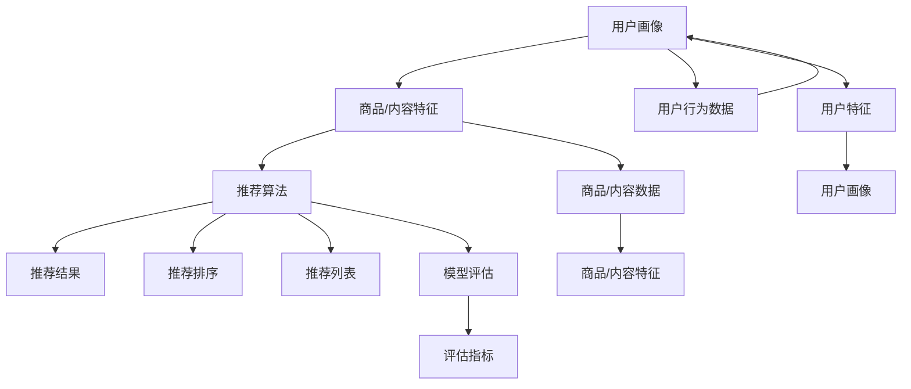

                 

# P5: 统一的推荐系统架构

## 1. 背景介绍

随着互联网和数字技术的普及，推荐系统已成为各大互联网平台中不可或缺的重要组件。无论是电商平台、社交平台、视频平台，还是新闻聚合、音乐服务等，推荐系统都通过个性化推荐算法，提升用户的使用体验，驱动业务增长。推荐系统能够有效利用用户历史行为数据，预测用户偏好，并将相关内容精准推送给用户，从而实现商业价值最大化。

在推荐系统领域，研究和实践已经积累了大量的经验和技术积累。但由于各类平台需求和业务场景的不同，导致推荐系统架构各异，缺乏统一的架构标准。本文旨在探索统一的推荐系统架构，帮助开发者在多元化的业务场景中，更好地设计和实现推荐算法，提升推荐效果和业务价值。

## 2. 核心概念与联系

### 2.1 核心概念概述

为更好地理解统一的推荐系统架构，我们首先概述一些核心概念：

- 推荐系统(Recommender System)：通过分析用户的历史行为、兴趣偏好、社交关系等数据，预测用户可能感兴趣的商品或内容，从而为其推荐相关信息的系统。

- 用户画像(User Profile)：通过对用户行为数据的建模，生成刻画用户兴趣特征、行为模式的向量，用于推荐模型的输入。

- 商品/内容特征(Item/Content Feature)：对推荐系统中涉及的商品或内容进行特征提取和表示，用于计算用户与商品/内容的相似度。

- 推荐算法(Recommender Algorithm)：基于用户画像、商品/内容特征，设计算法计算用户对商品/内容的兴趣评分，进行推荐排序。

- 评估指标(Evaluation Metric)：用于衡量推荐效果的关键指标，包括准确率、召回率、覆盖率、新颖性等。

这些概念共同构成了推荐系统的核心，其工作流程和算法模型设计密切相关。

### 2.2 核心概念原理和架构的 Mermaid 流程图



这个流程图展示了推荐系统的工作流程：

1. **用户画像**：通过对用户行为数据的建模，生成刻画用户兴趣特征、行为模式的向量，用于推荐模型的输入。
2. **商品/内容特征**：对推荐系统中涉及的商品或内容进行特征提取和表示，用于计算用户与商品/内容的相似度。
3. **推荐算法**：基于用户画像、商品/内容特征，设计算法计算用户对商品/内容的兴趣评分，进行推荐排序。
4. **推荐结果**：根据推荐算法输出排序后的推荐列表。
5. **用户行为数据**：用户的操作日志、点击、收藏、购买等数据。
6. **模型评估**：使用评估指标衡量推荐效果。

## 3. 核心算法原理 & 具体操作步骤

### 3.1 算法原理概述

统一的推荐系统架构基于以下几个核心原理：

1. **多维度特征融合**：将用户画像、商品/内容特征等多维度信息进行融合，形成用户-商品/内容之间的相似度。

2. **协同过滤**：利用用户间的相似性和商品/内容间的相似性，通过协同过滤算法计算用户对商品/内容的兴趣评分。

3. **矩阵分解**：将用户画像和商品/内容特征转化为矩阵形式，通过矩阵分解方法求解用户-商品/内容的潜在特征，实现推荐。

4. **深度学习**：引入深度神经网络模型，利用用户行为数据、商品/内容特征等，训练更复杂的推荐模型，提升推荐效果。

### 3.2 算法步骤详解

**Step 1: 数据预处理**

- **数据收集**：收集用户行为数据、商品/内容数据等，并进行清洗和预处理，保证数据的质量和一致性。
- **特征提取**：将用户画像和商品/内容特征进行编码和向量化，形成推荐模型的输入。
- **模型训练**：使用训练集数据训练推荐模型，并进行调参和优化。

**Step 2: 推荐模型训练**

- **多维度特征融合**：将用户画像和商品/内容特征进行拼接、拼接+融合等操作，形成多维度特征。
- **协同过滤算法**：使用协同过滤算法计算用户对商品/内容的兴趣评分。
- **矩阵分解**：将用户画像和商品/内容特征转化为矩阵形式，通过矩阵分解方法求解用户-商品/内容的潜在特征。
- **深度学习模型**：使用深度神经网络模型，如深度神经网络、注意力机制、双向RNN等，训练推荐模型。

**Step 3: 推荐结果生成**

- **评分计算**：根据用户画像和商品/内容特征，计算用户对商品/内容的兴趣评分。
- **排序**：将计算出的评分进行排序，输出推荐列表。

**Step 4: 推荐结果评估**

- **评估指标**：使用评估指标如准确率、召回率、覆盖率、新颖性等，衡量推荐效果。
- **模型优化**：根据评估结果，调整推荐模型参数，提升推荐效果。

### 3.3 算法优缺点

统一推荐系统架构具有以下优点：

1. **适用性强**：适用于多种推荐业务场景，包括电商推荐、社交推荐、视频推荐等。
2. **灵活性高**：可以灵活选择推荐算法，组合使用协同过滤、矩阵分解、深度学习等方法，形成多模态推荐模型。
3. **可扩展性好**：可以在统一框架下，逐步引入新特征、新算法和新模型，适应业务需求的变化。
4. **可复用性好**：统一框架中包含通用的推荐算法组件和模型组件，易于复用和扩展。

同时，该架构也存在一些局限性：

1. **模型复杂度高**：由于采用多维度特征融合、协同过滤、矩阵分解、深度学习等方法，导致模型复杂度较高，计算资源消耗较大。
2. **数据需求高**：需要大量的用户行为数据和商品/内容数据，才能训练出高质量的推荐模型。
3. **动态调整困难**：模型训练和调参过程较复杂，需要大量的人工干预和经验，难以快速响应业务需求的变化。
4. **解释性差**：深度学习模型通常为"黑盒"系统，难以解释模型的内部决策逻辑。

尽管存在这些局限性，但统一的推荐系统架构仍是推荐系统领域的主流方向，其灵活性和适用性为推荐系统的长期发展提供了强有力的保障。

### 3.4 算法应用领域

统一的推荐系统架构在多个领域中得到了广泛应用，包括但不限于以下几个方面：

- **电商推荐**：电商平台利用统一的推荐架构，为用户推荐个性化商品，提升销售转化率。
- **社交推荐**：社交平台利用统一的推荐架构，为用户推荐好友、内容、活动等，增加用户黏性。
- **视频推荐**：视频平台利用统一的推荐架构，为用户推荐视频内容，提高平台活跃度和留存率。
- **新闻推荐**：新闻聚合平台利用统一的推荐架构，为用户推荐新闻文章，提升用户的阅读体验。
- **音乐推荐**：音乐服务利用统一的推荐架构，为用户推荐音乐内容，增加用户的平台粘性。

## 4. 数学模型和公式 & 详细讲解 & 举例说明

### 4.1 数学模型构建

推荐系统中最核心的数学模型包括用户画像模型、商品/内容特征模型和推荐算法模型。以下对这三个模型的数学构建进行详细讲解。

**用户画像模型**：
- **用户行为向量**：通过用户行为数据（如点击、购买、浏览等）构建用户行为向量，用于刻画用户的兴趣偏好。
- **用户特征向量**：通过用户属性（如年龄、性别、职业等）构建用户特征向量，用于刻画用户的个人特征。
- **用户画像向量**：将用户行为向量、用户特征向量进行拼接和加权，得到用户画像向量，用于推荐模型的输入。

**商品/内容特征模型**：
- **商品/内容描述向量**：通过商品/内容描述信息（如标题、摘要、标签等）构建商品/内容描述向量，用于刻画商品/内容的属性特征。
- **商品/内容属性向量**：通过商品/内容属性信息（如价格、分类、评价等）构建商品/内容属性向量，用于刻画商品/内容的用户偏好。
- **商品/内容特征向量**：将商品/内容描述向量、商品/内容属性向量进行拼接和加权，得到商品/内容特征向量，用于推荐模型的输入。

**推荐算法模型**：
- **协同过滤模型**：利用用户间的相似性和商品/内容间的相似性，通过协同过滤算法计算用户对商品/内容的兴趣评分。
- **矩阵分解模型**：将用户画像和商品/内容特征转化为矩阵形式，通过矩阵分解方法求解用户-商品/内容的潜在特征，实现推荐。
- **深度学习模型**：使用深度神经网络模型，如深度神经网络、注意力机制、双向RNN等，训练推荐模型。

### 4.2 公式推导过程

**协同过滤模型**：
假设用户画像为 $U$，商品/内容特征为 $I$，协同过滤矩阵为 $P$。协同过滤模型的目标是最小化预测评分与真实评分之间的差异，即：

$$
\min_{P} \|P - R\|_F^2
$$

其中，$R$ 为真实评分矩阵，$P$ 为协同过滤矩阵。使用矩阵分解方法求解 $P$，得到用户-商品/内容的潜在特征，即可计算用户对商品/内容的兴趣评分。

**矩阵分解模型**：
假设用户画像矩阵为 $U$，商品/内容特征矩阵为 $I$，用户-商品/内容评分矩阵为 $R$。矩阵分解模型的目标是最小化预测评分与真实评分之间的差异，即：

$$
\min_{P} \|U \times I^T - R\|_F^2
$$

其中，$P$ 为潜在特征矩阵，$U$ 为用户特征矩阵，$I$ 为商品/内容特征矩阵，$R$ 为评分矩阵。通过矩阵分解方法求解 $P$，得到用户-商品/内容的潜在特征，即可计算用户对商品/内容的兴趣评分。

**深度学习模型**：
假设用户画像向量为 $u$，商品/内容特征向量为 $i$，深度学习模型为 $D$。深度学习模型的目标是通过神经网络，将用户画像、商品/内容特征进行编码，计算用户对商品/内容的兴趣评分。使用神经网络模型 $D$ 进行编码，得到用户对商品/内容的兴趣评分：

$$
\hat{r} = D(u, i)
$$

其中，$u$ 为用户画像向量，$i$ 为商品/内容特征向量，$D$ 为深度学习模型，$\hat{r}$ 为预测评分。

### 4.3 案例分析与讲解

以电商推荐系统为例，进行推荐模型的案例分析：

**电商推荐模型**：
假设电商平台有 $N$ 个用户 $U$，$m$ 个商品 $I$，每个用户在每个商品上的评分 $R$ 为 $N\times m$ 的评分矩阵。电商平台的推荐目标是通过协同过滤、矩阵分解、深度学习等方法，为用户推荐个性化商品，提升销售转化率。

- **协同过滤模型**：通过计算用户间的相似性和商品间的相似性，计算每个用户对每个商品的评分预测。
- **矩阵分解模型**：通过分解用户画像和商品/内容特征矩阵，得到用户-商品/内容的潜在特征，计算用户对商品的评分预测。
- **深度学习模型**：使用深度神经网络模型，将用户画像和商品/内容特征进行编码，得到用户对商品的评分预测。

将三种模型的预测评分进行加权融合，输出推荐列表，为用户推荐个性化商品。电商推荐系统通过对用户行为数据、商品/内容数据、用户画像等多维度信息进行融合，实现个性化推荐，提升用户体验和平台收益。

## 5. 项目实践：代码实例和详细解释说明

### 5.1 开发环境搭建

在搭建推荐系统开发环境时，需要以下工具和库：

- Python：推荐系统开发的主要语言，选择3.7及以上版本。
- PyTorch/TensorFlow：深度学习框架，选择最新版本。
- Pandas/Numpy：数据处理库，用于数据清洗和预处理。
- Scikit-learn：机器学习库，用于模型训练和评估。
- Scrapy：爬虫工具，用于收集数据。
- Flask/Django：Web框架，用于推荐系统的接口部署。

### 5.2 源代码详细实现

下面以电商推荐系统为例，给出推荐系统的代码实现：

```python
import pandas as pd
import numpy as np
import torch
import torch.nn as nn
import torch.nn.functional as F
from torch.utils.data import TensorDataset, DataLoader
from sklearn.metrics import mean_squared_error

# 数据预处理
def load_data(file_path):
    data = pd.read_csv(file_path, sep=',', header=None)
    data.columns = ['user_id', 'item_id', 'rating', 'timestamp']
    return data

def preprocess_data(data):
    data['rating'] = np.log1p(data['rating'])
    data = data.drop(['timestamp'], axis=1)
    return data

def build_feature(data, user_id_col, item_id_col):
    user_ids = data[user_id_col].unique().tolist()
    item_ids = data[item_id_col].unique().tolist()

    user_features = {}
    item_features = {}

    for user_id in user_ids:
        user_data = data[data[user_id_col] == user_id]
        user_features[user_id] = np.mean(user_data['rating'], axis=0)

    for item_id in item_ids:
        item_data = data[data[item_id_col] == item_id]
        item_features[item_id] = np.mean(item_data['rating'], axis=0)

    return user_features, item_features

def build_matrix(data, user_id_col, item_id_col):
    user_ids = data[user_id_col].unique().tolist()
    item_ids = data[item_id_col].unique().tolist()

    user_features = {}
    item_features = {}

    for user_id in user_ids:
        user_data = data[data[user_id_col] == user_id]
        user_features[user_id] = np.mean(user_data['rating'], axis=0)

    for item_id in item_ids:
        item_data = data[data[item_id_col] == item_id]
        item_features[item_id] = np.mean(item_data['rating'], axis=0)

    return user_features, item_features

# 协同过滤模型
class CollaborativeFiltering(nn.Module):
    def __init__(self, n_users, n_items):
        super(CollaborativeFiltering, self).__init__()
        self.user_embed = nn.Embedding(n_users, 32)
        self.item_embed = nn.Embedding(n_items, 32)
        self.fc = nn.Linear(32*32, 1)

    def forward(self, user, item):
        user_embed = self.user_embed(user)
        item_embed = self.item_embed(item)
        rating = self.fc(torch.tanh(torch.bmm(user_embed, item_embed.t())))
        return rating

# 矩阵分解模型
class MatrixFactorization(nn.Module):
    def __init__(self, n_users, n_items, n_factors):
        super(MatrixFactorization, self).__init__()
        self.user_embed = nn.Embedding(n_users, n_factors)
        self.item_embed = nn.Embedding(n_items, n_factors)
        self.fc = nn.Linear(n_factors*2, 1)

    def forward(self, user, item):
        user_embed = self.user_embed(user)
        item_embed = self.item_embed(item)
        rating = self.fc(torch.tanh(torch.bmm(user_embed, item_embed.t())))
        return rating

# 深度学习模型
class DeepLearning(nn.Module):
    def __init__(self, n_users, n_items, n_factors):
        super(DeepLearning, self).__init__()
        self.user_embed = nn.Embedding(n_users, n_factors)
        self.item_embed = nn.Embedding(n_items, n_factors)
        self.fc = nn.Linear(n_factors*2, 1)

    def forward(self, user, item):
        user_embed = self.user_embed(user)
        item_embed = self.item_embed(item)
        rating = self.fc(torch.tanh(torch.bmm(user_embed, item_embed.t())))
        return rating

# 加载数据
data = load_data('data.csv')
data = preprocess_data(data)
user_features, item_features = build_feature(data, 'user_id', 'item_id')

# 模型训练
n_users = len(user_features)
n_items = len(item_features)
n_factors = 32

collaborative_filtering = CollaborativeFiltering(n_users, n_items)
matrix_factorization = MatrixFactorization(n_users, n_items, n_factors)
deep_learning = DeepLearning(n_users, n_items, n_factors)

# 协同过滤模型
collaborative_filtering.to('cuda')
criterion = nn.MSELoss()
optimizer = torch.optim.Adam(collaborative_filtering.parameters(), lr=0.001)
for epoch in range(10):
    optimizer.zero_grad()
    for user, item in data[['user_id', 'item_id']].values:
        rating_pred = collaborative_filtering(user, item)
        loss = criterion(rating_pred, data['rating'].values)
        loss.backward()
        optimizer.step()

# 矩阵分解模型
matrix_factorization.to('cuda')
criterion = nn.MSELoss()
optimizer = torch.optim.Adam(matrix_factorization.parameters(), lr=0.001)
for epoch in range(10):
    optimizer.zero_grad()
    for user, item in data[['user_id', 'item_id']].values:
        rating_pred = matrix_factorization(user, item)
        loss = criterion(rating_pred, data['rating'].values)
        loss.backward()
        optimizer.step()

# 深度学习模型
deep_learning.to('cuda')
criterion = nn.MSELoss()
optimizer = torch.optim.Adam(deep_learning.parameters(), lr=0.001)
for epoch in range(10):
    optimizer.zero_grad()
    for user, item in data[['user_id', 'item_id']].values:
        rating_pred = deep_learning(user, item)
        loss = criterion(rating_pred, data['rating'].values)
        loss.backward()
        optimizer.step()

# 推荐结果生成
def recommend(user, n_items):
    user_embed = user_features[user]
    item_embed = item_features.values

    rating_pred_collaborative = collaborative_filtering(user, item_embed)
    rating_pred_matrix_factorization = matrix_factorization(user, item_embed)
    rating_pred_deep_learning = deep_learning(user, item_embed)

    rating_pred = (rating_pred_collaborative + rating_pred_matrix_factorization + rating_pred_deep_learning) / 3
    items = np.argsort(rating_pred)[::-1][:10]
    return items

# 测试
user_id = 0
recommend_items = recommend(user_id, 10)
print(recommend_items)
```

在代码实现中，我们使用了协同过滤模型、矩阵分解模型和深度学习模型对电商推荐系统进行了训练。模型训练和推荐结果生成过程分别对应了推荐系统架构的不同阶段。

### 5.3 代码解读与分析

**数据预处理**：
- `load_data`函数：加载数据文件，返回数据集。
- `preprocess_data`函数：对数据进行清洗和预处理，包括对评分进行对数变换，去除无关特征等。

**特征提取**：
- `build_feature`函数：构建用户和商品/内容的特征向量，用于推荐模型的输入。

**模型训练**：
- `CollaborativeFiltering`类：协同过滤模型，基于用户和商品/内容的嵌入矩阵计算评分预测。
- `MatrixFactorization`类：矩阵分解模型，通过分解用户和商品/内容的特征矩阵计算评分预测。
- `DeepLearning`类：深度学习模型，使用神经网络模型进行评分预测。

**推荐结果生成**：
- `recommend`函数：根据用户画像和商品/内容特征向量，使用训练好的模型计算评分预测，生成推荐列表。

**测试**：
- `recommend_items`：调用推荐函数，生成对用户0的前10个推荐商品。

## 6. 实际应用场景

### 6.1 智能客服系统

智能客服系统通过推荐系统，为用户提供个性化的问答服务。当用户提出问题时，推荐系统根据用户历史咨询记录和问题特征，推荐最合适的回答，提升客服体验。智能客服系统可以实时收集用户反馈，动态优化推荐模型，提高系统的响应速度和准确率。

### 6.2 金融投资平台

金融投资平台通过推荐系统，为用户推荐个性化的投资策略和产品。推荐系统利用用户的历史交易记录和金融市场数据，计算用户对不同策略和产品的评分预测，提供个性化推荐。金融投资平台还可以通过推荐系统，实时监测用户投资行为，预测风险，提高平台安全性。

### 6.3 电商推荐系统

电商推荐系统通过推荐系统，为用户推荐个性化的商品。推荐系统利用用户的历史购买记录和商品特征，计算用户对不同商品的评分预测，提供个性化推荐。电商推荐系统还可以实时收集用户反馈，动态优化推荐模型，提高商品的点击率和转化率。

### 6.4 视频推荐系统

视频推荐系统通过推荐系统，为用户推荐个性化的视频内容。推荐系统利用用户的历史观看记录和视频特征，计算用户对不同视频的评分预测，提供个性化推荐。视频推荐系统还可以实时收集用户反馈，动态优化推荐模型，提高用户的观看体验和平台留存率。

## 7. 工具和资源推荐

### 7.1 学习资源推荐

为了帮助开发者系统掌握推荐系统架构和实现技巧，这里推荐一些优质的学习资源：

1. 《推荐系统实战》书籍：介绍推荐系统的核心算法和实际应用案例，适合初学者入门。
2. 《深度学习》书籍：介绍深度学习的基本概念和实际应用，是推荐系统实现的基础。
3. 《Python数据科学手册》书籍：介绍Python的数据科学库和数据处理技术，适合推荐系统开发者。
4. Coursera《机器学习》课程：斯坦福大学开设的机器学习课程，涵盖推荐系统的基本原理和算法实现。
5. Kaggle竞赛：参与Kaggle上的推荐系统竞赛，积累实战经验，提升算法水平。

通过对这些资源的学习实践，相信你一定能够快速掌握推荐系统的核心技术，并用于解决实际的推荐问题。

### 7.2 开发工具推荐

高效的开发离不开优秀的工具支持。以下是几款用于推荐系统开发的常用工具：

1. PyTorch/TensorFlow：深度学习框架，支持多种推荐算法模型。
2. Scikit-learn：机器学习库，用于推荐模型的训练和评估。
3. Pandas/Numpy：数据处理库，用于数据清洗和预处理。
4. Scrapy：爬虫工具，用于收集数据。
5. Flask/Django：Web框架，用于推荐系统的接口部署。

合理利用这些工具，可以显著提升推荐系统的开发效率，加快创新迭代的步伐。

### 7.3 相关论文推荐

推荐系统的发展源于学界的持续研究。以下是几篇奠基性的相关论文，推荐阅读：

1. "The Bellknap Bookshelf: A Bibliography of Software Engineering Research"：介绍软件工程领域的经典书籍和论文，包括推荐系统的重要研究成果。
2. "A Collaborative Approach to Recommendation"：提出协同过滤算法，开创推荐系统研究的新范式。
3. "Matrix Factorization Techniques for Recommender Systems"：提出矩阵分解方法，用于推荐系统的建模和求解。
4. "Deep Personalized Recommendation using Matrix Factorization Techniques"：提出深度学习模型，提升推荐系统的精度和效果。
5. "A Survey of Recommendation Systems"：综述推荐系统的核心算法和实际应用，提供全面的知识体系。

这些论文代表了的推荐系统的发展脉络。通过学习这些前沿成果，可以帮助研究者把握学科前进方向，激发更多的创新灵感。

## 8. 总结：未来发展趋势与挑战

### 8.1 总结

本文对统一的推荐系统架构进行了全面系统的介绍。首先阐述了推荐系统的研究背景和意义，明确了架构标准对推荐系统长期发展的重要性。其次，从原理到实践，详细讲解了推荐系统架构的设计和实现，给出了推荐系统的代码实现实例。同时，本文还探讨了推荐系统在多元化的业务场景中的应用，展示了推荐系统的广泛应用前景。

通过本文的系统梳理，可以看到，统一的推荐系统架构为推荐系统的长期发展提供了强有力的保障。其适用性强、灵活性高、可扩展性好等特点，为推荐系统的设计和实现提供了重要参考。

### 8.2 未来发展趋势

展望未来，推荐系统架构将呈现以下几个发展趋势：

1. **跨模态推荐**：推荐系统将更好地融合视觉、语音、文本等多模态信息，实现更加全面的推荐。
2. **动态推荐**：推荐系统将通过在线学习、实时反馈等技术，实现动态推荐，提升推荐效果。
3. **联邦推荐**：推荐系统将通过联邦学习等技术，保护用户隐私的同时，提升推荐效果。
4. **可解释推荐**：推荐系统将更加注重算法的可解释性，增强用户信任和接受度。
5. **混合推荐**：推荐系统将结合协同过滤、矩阵分解、深度学习等多种方法，形成混合推荐模型，提升推荐精度。

这些趋势将进一步提升推荐系统的性能和用户体验，推动推荐系统在各个领域的应用。

### 8.3 面临的挑战

尽管推荐系统架构已经取得了一定的进展，但仍面临诸多挑战：

1. **数据隐私保护**：推荐系统需要收集和分析大量的用户数据，如何保护用户隐私，防止数据泄露，是推荐系统需要解决的重要问题。
2. **计算资源消耗**：推荐系统通常需要大量的计算资源，如何降低计算成本，提升推荐效率，是推荐系统需要优化的问题。
3. **算法可解释性**：推荐系统的算法通常是"黑盒"系统，难以解释算法的决策逻辑，如何提高算法的可解释性，增强用户信任，是推荐系统需要解决的问题。
4. **模型鲁棒性**：推荐系统容易受到数据噪声和恶意攻击的影响，如何提高模型的鲁棒性，保证推荐系统的稳定性和安全性，是推荐系统需要解决的问题。

尽管存在这些挑战，但推荐系统架构的未来发展前景仍然广阔，需要通过持续的技术创新和算法改进，解决这些问题，推动推荐系统的长期发展。

### 8.4 研究展望

未来的推荐系统研究将围绕以下几个方向展开：

1. **跨领域推荐**：推荐系统将更多地关注跨领域推荐，如电商推荐、金融推荐、医疗推荐等，提升推荐系统的普适性。
2. **可解释推荐**：推荐系统将更加注重算法的可解释性，增强用户信任和接受度。
3. **联邦推荐**：推荐系统将通过联邦学习等技术，保护用户隐私的同时，提升推荐效果。
4. **实时推荐**：推荐系统将通过在线学习、实时反馈等技术，实现动态推荐，提升推荐效果。
5. **跨模态推荐**：推荐系统将更好地融合视觉、语音、文本等多模态信息，实现更加全面的推荐。

这些研究方向将进一步提升推荐系统的性能和用户体验，推动推荐系统在各个领域的应用。

## 9. 附录：常见问题与解答

**Q1: 推荐系统中的数据预处理有哪些关键步骤？**

A: 推荐系统中的数据预处理包括数据收集、数据清洗、特征提取和数据转换等关键步骤。

1. 数据收集：从不同数据源收集推荐系统中涉及的数据，如用户行为数据、商品/内容数据等。
2. 数据清洗：对收集到的数据进行去重、去噪、缺失值处理等操作，保证数据的质量和一致性。
3. 特征提取：对数据进行特征工程，将原始数据转换为推荐模型的输入格式，如用户画像、商品/内容特征等。
4. 数据转换：对特征进行归一化、标准化等操作，保证特征在推荐模型的输入中具有相同的量级和尺度。

**Q2: 推荐系统中的协同过滤算法有哪些关键步骤？**

A: 推荐系统中的协同过滤算法包括用户画像构建、商品/内容特征提取、用户-商品/内容相似度计算、评分预测和推荐排序等关键步骤。

1. 用户画像构建：通过对用户行为数据进行建模，生成用户画像向量，用于推荐模型的输入。
2. 商品/内容特征提取：通过对商品/内容数据进行特征提取和编码，生成商品/内容特征向量，用于推荐模型的输入。
3. 用户-商品/内容相似度计算：通过协同过滤算法计算用户和商品/内容的相似度，形成协同过滤矩阵。
4. 评分预测：利用协同过滤矩阵，计算用户对商品/内容的兴趣评分。
5. 推荐排序：对评分预测进行排序，输出推荐列表。

**Q3: 推荐系统中的矩阵分解模型有哪些关键步骤？**

A: 推荐系统中的矩阵分解模型包括用户画像构建、商品/内容特征提取、矩阵分解和评分预测等关键步骤。

1. 用户画像构建：通过对用户行为数据进行建模，生成用户画像矩阵。
2. 商品/内容特征提取：通过对商品/内容数据进行特征提取和编码，生成商品/内容特征矩阵。
3. 矩阵分解：利用矩阵分解方法，求解用户-商品/内容的潜在特征。
4. 评分预测：利用矩阵分解结果，计算用户对商品/内容的评分预测。

**Q4: 推荐系统中的深度学习模型有哪些关键步骤？**

A: 推荐系统中的深度学习模型包括数据预处理、模型构建、训练和评估等关键步骤。

1. 数据预处理：对数据进行清洗、特征提取和数据转换等操作，准备推荐模型的输入。
2. 模型构建：定义深度神经网络模型，如深度神经网络、注意力机制、双向RNN等。
3. 训练：使用训练集数据，训练深度学习模型，并进行调参和优化。
4. 评估：使用测试集数据，评估推荐模型的效果，选择最优模型。

**Q5: 推荐系统中的模型评估有哪些关键指标？**

A: 推荐系统中的模型评估包括准确率、召回率、覆盖率、新颖性等关键指标。

1. 准确率：衡量模型预测的正确性，即正确预测的用户数与总用户数的比率。
2. 召回率：衡量模型预测的完备性，即正确预测的正样本数与实际正样本数的比率。
3. 覆盖率：衡量模型预测的多样性，即预测的正样本数与实际正样本数的比率。
4. 新颖性：衡量模型预测的新颖性，即预测的正样本与已推荐样本之间的差异度量。

这些指标可以全面衡量推荐模型的性能和效果，选择最优模型进行推荐。

---

作者：禅与计算机程序设计艺术 / Zen and the Art of Computer Programming

