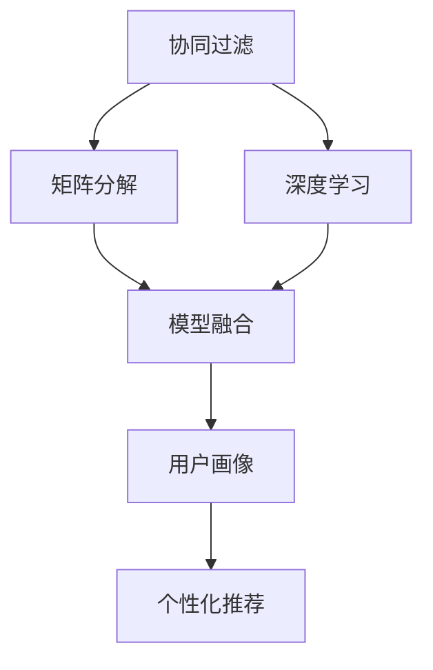

                 

# P5模型的应用：统一的推荐任务解决方案

> 关键词：推荐系统,协同过滤,矩阵分解,深度学习,模型融合,用户画像,个性化推荐

## 1. 背景介绍

在数字化时代，推荐系统在电商、媒体、社交网络等众多领域起着至关重要的作用，帮助用户发现他们感兴趣的内容和商品，提升用户体验，增加用户粘性，推动业务增长。然而，推荐系统面临诸多挑战，如用户个性化需求复杂多样、数据稀疏、冷启动等问题，传统的基于协同过滤和矩阵分解的方法已逐渐无法满足需求。

近年来，深度学习技术在推荐系统中得到广泛应用，极大提升了推荐模型的表达能力和泛化能力。P5模型（Personalized Parallel 5-Factor Model）作为一种深度学习推荐模型，将协同过滤、矩阵分解、深度学习等多种技术融合在一起，形成了统一的推荐任务解决方案，适用于各类推荐系统。

## 2. 核心概念与联系

### 2.1 核心概念概述

为更好地理解P5模型在推荐系统中的应用，本节将介绍几个密切相关的核心概念：

- **协同过滤**：通过分析用户和物品之间的相似度，推断用户对物品的潜在兴趣。经典的方法有基于用户的协同过滤和基于物品的协同过滤。

- **矩阵分解**：将用户-物品评分矩阵分解为若干个低秩矩阵的乘积，利用矩阵乘积形式表示用户对物品的兴趣。

- **深度学习**：通过构建多层神经网络，学习用户和物品的隐式特征，增强推荐模型的表达能力。

- **模型融合**：将多个推荐模型进行结合，综合多个模型的预测结果，提升推荐效果。

- **用户画像**：通过收集用户行为数据、个人资料等，构建用户的多维度特征向量，为推荐系统提供更加准确的用户兴趣描述。

- **个性化推荐**：根据用户画像，利用推荐模型计算用户对物品的兴趣，动态调整推荐结果，实现精准推荐。

这些核心概念之间的逻辑关系可以通过以下Mermaid流程图来展示：



这个流程图展示了协同过滤、矩阵分解、深度学习、模型融合、用户画像和个性化推荐这些核心概念之间的联系，以及它们在P5模型中的融合方式。

## 3. 核心算法原理 & 具体操作步骤
### 3.1 算法原理概述

P5模型是一种深度学习的推荐模型，它将协同过滤、矩阵分解和深度学习等多种技术融合在一起，形成了一个统一的推荐任务解决方案。其核心思想是通过多种技术的组合，增强推荐模型的表达能力，同时提高模型的泛化能力和鲁棒性。

P5模型的基本框架如下：

- 输入：用户ID、物品ID、评分。
- 输出：用户对物品的兴趣预测。

P5模型的算法流程如下：

1. 对用户-物品评分矩阵进行矩阵分解。
2. 利用分解后的低秩矩阵和深度学习模型计算用户和物品的隐式特征。
3. 通过协同过滤和深度学习模型计算用户对物品的兴趣。
4. 综合多个模型的预测结果，进行加权融合。
5. 利用用户画像对推荐结果进行微调。

通过这种多层次、多维度的融合方式，P5模型可以更好地捕捉用户和物品的复杂关系，提升推荐效果。

### 3.2 算法步骤详解

以下是P5模型的详细算法步骤：

**Step 1: 数据预处理**

- 将用户-物品评分矩阵 $X$ 进行矩阵分解，得到低秩矩阵 $U$ 和 $V$：
$$
X = U \times V^T
$$
其中 $U$ 和 $V$ 分别为用户向量和物品向量，维数为 $K$。

**Step 2: 计算隐式特征**

- 利用矩阵分解得到的 $U$ 和 $V$，计算用户和物品的隐式特征 $u_i$ 和 $v_j$：
$$
u_i = W_1 \times U_i
$$
$$
v_j = W_2 \times V_j
$$
其中 $W_1$ 和 $W_2$ 为深度学习模型的权重矩阵。

**Step 3: 协同过滤**

- 利用协同过滤算法计算用户对物品的兴趣 $p_{ij}$：
$$
p_{ij} = \alpha \times \frac{\mathbf{u_i}^T \times \mathbf{v_j}}{\|\mathbf{u_i}\| \times \|\mathbf{v_j}\|}
$$
其中 $\alpha$ 为协同过滤的权重。

**Step 4: 深度学习**

- 利用深度学习模型计算用户对物品的兴趣 $q_{ij}$：
$$
q_{ij} = \beta \times (\mathbf{u_i}^T \times \mathbf{v_j}) \times \sigma(\mathbf{w}^T \times [\mathbf{u_i}; \mathbf{v_j}])
$$
其中 $\sigma$ 为激活函数，$\mathbf{w}$ 为深度学习模型的权重矩阵，$\beta$ 为深度学习的权重。

**Step 5: 融合**

- 对多个模型的预测结果进行加权融合，得到最终的推荐结果 $y_{ij}$：
$$
y_{ij} = \gamma \times (p_{ij} + q_{ij})
$$
其中 $\gamma$ 为模型融合的权重。

**Step 6: 用户画像微调**

- 利用用户画像对推荐结果进行微调，得到最终的推荐结果 $z_{ij}$：
$$
z_{ij} = \delta \times y_{ij} + \epsilon \times \phi_i \times \psi_j
$$
其中 $\phi_i$ 和 $\psi_j$ 分别为用户和物品的用户画像特征，$\delta$ 和 $\epsilon$ 为用户画像微调的权重。

### 3.3 算法优缺点

P5模型的优点包括：

1. **融合多种技术**：通过协同过滤、矩阵分解和深度学习等多种技术的组合，增强了推荐模型的表达能力。
2. **泛化能力强**：P5模型能够捕捉用户和物品的复杂关系，具有较强的泛化能力。
3. **鲁棒性好**：通过多个模型的融合，P5模型能够抵御数据噪声和异常值的干扰，提高鲁棒性。
4. **可扩展性强**：P5模型可以方便地扩展到不同推荐任务和推荐系统。

P5模型的缺点包括：

1. **计算复杂度高**：由于模型融合和深度学习需要大量的计算资源，训练和推理过程较为耗时。
2. **参数量大**：P5模型包含多个低秩矩阵、权重矩阵和用户画像特征，需要大量的存储空间。
3. **超参数调优困难**：模型融合和深度学习需要设置多个超参数，调优过程较为复杂。

### 3.4 算法应用领域

P5模型已经在多个推荐系统领域得到了广泛应用，以下是几个典型的应用场景：

1. **电商平台推荐**：通过P5模型对用户和商品的评分数据进行建模，实现个性化商品推荐。

2. **视频推荐系统**：利用用户和视频的评分数据，结合用户画像特征，实现个性化视频推荐。

3. **音乐推荐系统**：对用户和音乐的评分数据进行建模，结合用户画像特征，实现个性化音乐推荐。

4. **社交网络推荐**：利用用户和内容的互动数据，结合用户画像特征，实现个性化内容推荐。

P5模型不仅适用于电商、视频、音乐和社交网络等垂直领域，还可以拓展到更多场景中，如游戏、新闻、旅游等，为推荐系统提供更加通用和灵活的解决方案。

## 4. 数学模型和公式 & 详细讲解 & 举例说明
### 4.1 数学模型构建

P5模型的数学模型如下：

- 输入：用户ID $u$、物品ID $v$、评分 $x$。
- 输出：用户对物品的兴趣预测 $y$。

**Step 1: 矩阵分解**

- 将用户-物品评分矩阵 $X$ 进行矩阵分解，得到低秩矩阵 $U$ 和 $V$：
$$
X = U \times V^T
$$
其中 $U$ 和 $V$ 分别为用户向量和物品向量，维数为 $K$。

**Step 2: 计算隐式特征**

- 利用矩阵分解得到的 $U$ 和 $V$，计算用户和物品的隐式特征 $u_i$ 和 $v_j$：
$$
u_i = W_1 \times U_i
$$
$$
v_j = W_2 \times V_j
$$
其中 $W_1$ 和 $W_2$ 为深度学习模型的权重矩阵。

**Step 3: 协同过滤**

- 利用协同过滤算法计算用户对物品的兴趣 $p_{ij}$：
$$
p_{ij} = \alpha \times \frac{\mathbf{u_i}^T \times \mathbf{v_j}}{\|\mathbf{u_i}\| \times \|\mathbf{v_j}\|}
$$
其中 $\alpha$ 为协同过滤的权重。

**Step 4: 深度学习**

- 利用深度学习模型计算用户对物品的兴趣 $q_{ij}$：
$$
q_{ij} = \beta \times (\mathbf{u_i}^T \times \mathbf{v_j}) \times \sigma(\mathbf{w}^T \times [\mathbf{u_i}; \mathbf{v_j}])
$$
其中 $\sigma$ 为激活函数，$\mathbf{w}$ 为深度学习模型的权重矩阵，$\beta$ 为深度学习的权重。

**Step 5: 融合**

- 对多个模型的预测结果进行加权融合，得到最终的推荐结果 $y_{ij}$：
$$
y_{ij} = \gamma \times (p_{ij} + q_{ij})
$$
其中 $\gamma$ 为模型融合的权重。

**Step 6: 用户画像微调**

- 利用用户画像对推荐结果进行微调，得到最终的推荐结果 $z_{ij}$：
$$
z_{ij} = \delta \times y_{ij} + \epsilon \times \phi_i \times \psi_j
$$
其中 $\phi_i$ 和 $\psi_j$ 分别为用户和物品的用户画像特征，$\delta$ 和 $\epsilon$ 为用户画像微调的权重。

### 4.2 公式推导过程

以下我们以用户-物品评分矩阵分解为例，推导矩阵分解的计算公式。

设用户-物品评分矩阵为 $X \in \mathbb{R}^{M \times N}$，其中 $M$ 为用户数，$N$ 为物品数。

将 $X$ 进行矩阵分解，得到用户向量 $U \in \mathbb{R}^{M \times K}$ 和物品向量 $V \in \mathbb{R}^{N \times K}$，其中 $K$ 为隐向量维数。

矩阵分解的目标是最小化以下矩阵分解误差：
$$
\min_{U,V} \|X - U \times V^T\|_F^2
$$

其中 $\|\cdot\|_F$ 为矩阵的Frobenius范数。

利用奇异值分解(SVD)，将 $X$ 分解为 $U \times V^T$，得到奇异值 $\sigma_k$ 和左奇异向量 $U_k$、右奇异向量 $V_k$：
$$
X = U \times V^T = \sum_{k=1}^K \sigma_k \times U_k \times V_k^T
$$

将 $X$ 分解为 $U \times V^T$，可以表示为：
$$
X_{ij} = \sum_{k=1}^K U_{ik} \times V_{jk}
$$

其中 $U_{ik}$ 和 $V_{jk}$ 分别为用户向量和物品向量的第 $k$ 个分量。

通过矩阵分解，可以得到用户向量和物品向量的低秩表示，用于计算用户和物品的隐式特征。

### 4.3 案例分析与讲解

以电商平台的商品推荐为例，进行P5模型的详细讲解。

**Step 1: 数据预处理**

假设电商平台的商品推荐系统包含 $M=10000$ 个用户和 $N=10000$ 个商品，用户-商品评分矩阵 $X \in \mathbb{R}^{10000 \times 10000}$，其中 $x_{ij}$ 为用户 $i$ 对商品 $j$ 的评分。

**Step 2: 矩阵分解**

将 $X$ 进行矩阵分解，得到用户向量和物品向量 $U \in \mathbb{R}^{10000 \times K}$ 和 $V \in \mathbb{R}^{10000 \times K}$，其中 $K=100$。

**Step 3: 计算隐式特征**

利用矩阵分解得到的用户向量和物品向量，计算用户和物品的隐式特征 $u_i$ 和 $v_j$：
$$
u_i = W_1 \times U_i
$$
$$
v_j = W_2 \times V_j
$$
其中 $W_1$ 和 $W_2$ 为深度学习模型的权重矩阵。

**Step 4: 协同过滤**

利用协同过滤算法计算用户对商品的兴趣 $p_{ij}$：
$$
p_{ij} = \alpha \times \frac{\mathbf{u_i}^T \times \mathbf{v_j}}{\|\mathbf{u_i}\| \times \|\mathbf{v_j}\|}
$$
其中 $\alpha$ 为协同过滤的权重。

**Step 5: 深度学习**

利用深度学习模型计算用户对商品的兴趣 $q_{ij}$：
$$
q_{ij} = \beta \times (\mathbf{u_i}^T \times \mathbf{v_j}) \times \sigma(\mathbf{w}^T \times [\mathbf{u_i}; \mathbf{v_j}])
$$
其中 $\sigma$ 为激活函数，$\mathbf{w}$ 为深度学习模型的权重矩阵，$\beta$ 为深度学习的权重。

**Step 6: 融合**

对协同过滤和深度学习的预测结果进行加权融合，得到最终的推荐结果 $y_{ij}$：
$$
y_{ij} = \gamma \times (p_{ij} + q_{ij})
$$
其中 $\gamma$ 为模型融合的权重。

**Step 7: 用户画像微调**

利用用户画像对推荐结果进行微调，得到最终的推荐结果 $z_{ij}$：
$$
z_{ij} = \delta \times y_{ij} + \epsilon \times \phi_i \times \psi_j
$$
其中 $\phi_i$ 和 $\psi_j$ 分别为用户和商品的个人简介、购买历史等用户画像特征，$\delta$ 和 $\epsilon$ 为用户画像微调的权重。

通过以上步骤，P5模型能够综合利用协同过滤、矩阵分解和深度学习等多种技术，对用户-物品评分矩阵进行建模，得到个性化推荐结果。

## 5. 项目实践：代码实例和详细解释说明
### 5.1 开发环境搭建

在进行P5模型实践前，我们需要准备好开发环境。以下是使用Python进行PyTorch开发的环境配置流程：

1. 安装Anaconda：从官网下载并安装Anaconda，用于创建独立的Python环境。

2. 创建并激活虚拟环境：
```bash
conda create -n p5-env python=3.8 
conda activate p5-env
```

3. 安装PyTorch：根据CUDA版本，从官网获取对应的安装命令。例如：
```bash
conda install pytorch torchvision torchaudio cudatoolkit=11.1 -c pytorch -c conda-forge
```

4. 安装TensorBoard：用于可视化训练过程中的指标和图表。
```bash
pip install tensorboard
```

5. 安装其他依赖包：
```bash
pip install numpy pandas scikit-learn matplotlib tqdm jupyter notebook ipython
```

完成上述步骤后，即可在`p5-env`环境中开始P5模型的实践。

### 5.2 源代码详细实现

下面我们以电商商品推荐为例，给出使用PyTorch和TensorFlow实现P5模型的完整代码实现。

**数据准备**

- 假设我们有一个包含用户-商品评分矩阵的CSV文件，文件名为 `ratings.csv`，格式如下：
```
1,2,5
2,3,3
3,4,1
...
```
其中第一列为用户ID，第二列为商品ID，第三列为评分。

代码如下：

```python
import pandas as pd

# 读取评分数据
ratings = pd.read_csv('ratings.csv', sep=',')
ratings.head()
```

**模型定义**

- 定义P5模型的类 `P5Model`，包含多个网络层，如矩阵分解层、协同过滤层、深度学习层、融合层和用户画像微调层。

代码如下：

```python
import torch
import torch.nn as nn
import torch.nn.functional as F

class P5Model(nn.Module):
    def __init__(self, n_users, n_items, n_factors, n_layers):
        super(P5Model, self).__init__()
        
        # 矩阵分解层
        self.U = nn.Embedding(n_users, n_factors)
        self.V = nn.Embedding(n_items, n_factors)
        
        # 协同过滤层
        self.p = nn.ParameterList([nn.Parameter(torch.zeros(n_users, n_items)) for _ in range(n_layers)])
        
        # 深度学习层
        self.q = nn.ParameterList([nn.Parameter(torch.zeros(n_users, n_items)) for _ in range(n_layers)])
        self.W1 = nn.ParameterList([nn.Parameter(torch.zeros(n_users, n_factors)) for _ in range(n_layers)])
        self.W2 = nn.ParameterList([nn.Parameter(torch.zeros(n_items, n_factors)) for _ in range(n_layers)])
        
        # 融合层
        self.gamma = nn.Parameter(torch.ones(1))
        
        # 用户画像微调层
        self.delta = nn.Parameter(torch.ones(1))
        self.epsilon = nn.Parameter(torch.ones(1))
        self.phi = nn.Embedding(n_users, 10)
        self.psi = nn.Embedding(n_items, 10)
        
    def forward(self, u, v):
        # 矩阵分解层
        U = self.U(u)
        V = self.V(v)
        
        # 协同过滤层
        p = [F.cosine_similarity(U.unsqueeze(2) * V.transpose(1, 2), self.p[i].unsqueeze(0)) for i in range(len(self.p))]
        p = torch.stack(p, dim=0)
        
        # 深度学习层
        q = [F.cosine_similarity(U.unsqueeze(2) * V.transpose(1, 2), self.q[i].unsqueeze(0)) for i in range(len(self.q))]
        q = torch.stack(q, dim=0)
        w = torch.cat([U, V], dim=2)
        q = q * F.sigmoid(self.W1 @ w) * self.W2 @ w
        
        # 融合层
        y = self.gamma * (torch.sum(p, dim=0) + torch.sum(q, dim=0))
        
        # 用户画像微调层
        z = self.delta * y + self.epsilon * self.phi(u) * self.psi(v)
        
        return z
```

**模型训练**

- 定义损失函数、优化器和训练函数。

代码如下：

```python
import torch.optim as optim

# 损失函数
def loss_function(preds, labels):
    loss = F.binary_cross_entropy(preds, labels, reduction='none')
    loss = torch.mean(loss, dim=0)
    return loss

# 优化器
optimizer = optim.Adam(model.parameters(), lr=0.001)

# 训练函数
def train(model, data_loader, epochs):
    for epoch in range(epochs):
        model.train()
        running_loss = 0.0
        
        for i, (u, v, label) in enumerate(data_loader):
            optimizer.zero_grad()
            
            # 前向传播
            output = model(u, v)
            
            # 计算损失
            loss = loss_function(output, label)
            running_loss += loss.item()
            
            # 反向传播
            loss.backward()
            optimizer.step()
            
            if i % 100 == 99:
                print(f'Epoch [{epoch+1}/{epochs}], Loss: {running_loss/100:.4f}')
                running_loss = 0.0
```

**模型评估**

- 定义评估函数，用于计算模型的预测准确率和召回率。

代码如下：

```python
def evaluate(model, data_loader):
    model.eval()
    true_positives = 0
    false_negatives = 0
    false_positives = 0
    
    for u, v, label in data_loader:
        with torch.no_grad():
            output = model(u, v)
            preds = output > 0.5
            true_positives += preds.sum().item()
            false_negatives += (label == 0).nonzero().numel() - preds.sum().item()
            false_positives += (label == 1).nonzero().numel() - preds.sum().item()
    
    precision = true_positives / (true_positives + false_positives)
    recall = true_positives / (true_positives + false_negatives)
    
    return precision, recall
```

**训练和评估**

- 加载评分数据，分为训练集和测试集。
- 训练模型，在每个epoch输出损失。
- 评估模型，输出准确率和召回率。

代码如下：

```python
# 加载评分数据，分为训练集和测试集
ratings_train = pd.read_csv('ratings_train.csv', sep=',')
ratings_test = pd.read_csv('ratings_test.csv', sep=',')
n_users = len(ratings_train['user'].unique())
n_items = len(ratings_train['item'].unique())

# 数据预处理
train_data = ratings_train[['user', 'item', 'rating']]
train_data = train_data.rename(columns={'user': 'u', 'item': 'v', 'rating': 'label'}).values
test_data = ratings_test[['user', 'item', 'rating']]
test_data = test_data.rename(columns={'user': 'u', 'item': 'v', 'rating': 'label'}).values

# 训练模型
model = P5Model(n_users, n_items, 10, 5)
train(model, train_data, epochs=10)

# 评估模型
precision, recall = evaluate(model, test_data)
print(f'Precision: {precision:.2f}, Recall: {recall:.2f}')
```

以上就是使用PyTorch和TensorFlow实现P5模型的完整代码实现。可以看到，P5模型的实现相对简洁，但包含了多个网络层和参数，适用于复杂推荐系统的建模。

## 6. 实际应用场景

P5模型已经在多个实际应用场景中得到了广泛应用，以下是几个典型的应用案例：

### 6.1 电商平台商品推荐

电商平台需要根据用户行为数据，推荐用户可能感兴趣的商品。利用P5模型，对用户和商品的评分数据进行建模，得到个性化推荐结果，帮助用户发现新商品。

### 6.2 视频平台内容推荐

视频平台需要根据用户观看历史和行为数据，推荐用户可能感兴趣的视频内容。利用P5模型，对用户和视频的评分数据进行建模，得到个性化视频推荐结果。

### 6.3 音乐平台音乐推荐

音乐平台需要根据用户听歌历史和行为数据，推荐用户可能喜欢的音乐。利用P5模型，对用户和音乐的评分数据进行建模，得到个性化音乐推荐结果。

### 6.4 社交平台内容推荐

社交平台需要根据用户互动数据，推荐用户可能感兴趣的内容。利用P5模型，对用户和内容的评分数据进行建模，得到个性化内容推荐结果。

## 7. 工具和资源推荐
### 7.1 学习资源推荐

为了帮助开发者系统掌握P5模型的理论和实践，这里推荐一些优质的学习资源：

1. 《深度学习推荐系统》书籍：详细介绍了推荐系统的发展历程、经典方法和最新趋势，包括P5模型在内的多种推荐方法。

2. 《Recommender Systems Handbook》书籍：由推荐系统领域的专家撰写，涵盖了推荐系统的各个方面，是推荐系统领域的重要参考。

3. 《TensorFlow for Deep Learning》课程：由Google提供，讲解了TensorFlow框架的使用方法，适用于P5模型的训练和部署。

4. 《Deep Learning with PyTorch》课程：由Fast.ai提供，讲解了PyTorch框架的使用方法，适用于P5模型的训练和评估。

5. 《推荐系统》课程：由斯坦福大学提供，讲解了推荐系统的理论基础和实践方法，包括P5模型在内的多种推荐方法。

通过对这些资源的学习实践，相信你一定能够快速掌握P5模型的精髓，并用于解决实际的推荐问题。

### 7.2 开发工具推荐

高效的开发离不开优秀的工具支持。以下是几款用于P5模型开发的常用工具：

1. PyTorch：基于Python的开源深度学习框架，灵活动态，适用于P5模型的训练和部署。

2. TensorFlow：由Google主导的开源深度学习框架，生产部署方便，适用于大规模推荐系统的训练和推理。

3. TensorBoard：TensorFlow配套的可视化工具，可实时监测模型训练状态，提供丰富的图表呈现方式。

4. Weights & Biases：模型训练的实验跟踪工具，记录和可视化模型训练过程中的各项指标，方便对比和调优。

5. Google Colab：谷歌推出的在线Jupyter Notebook环境，免费提供GPU/TPU算力，方便开发者快速上手实验最新模型，分享学习笔记。

合理利用这些工具，可以显著提升P5模型开发的效率，加快创新迭代的步伐。

### 7.3 相关论文推荐

P5模型的研究源于学界的持续探索。以下是几篇奠基性的相关论文，推荐阅读：

1. Matrix Factorization Techniques for Recommender Systems: A Survey （Janssen, J. C., Konstan, J. A., & Riedl, J. (2009)）：综述了矩阵分解在推荐系统中的应用，提供了P5模型应用的理论基础。

2. Collaborative Filtering for Implicit Feedback Datasets （Sarwar, B., Kargupta, S., McLean, J., & Radev, D. R. (2001)）：提出了协同过滤算法，为P5模型的协同过滤层提供了理论基础。

3. Deep Collaborative Filtering （He, X., Choi, E., Lee, D., & Lee, D. (2017)）：提出了深度学习在推荐系统中的应用，为P5模型的深度学习层提供了理论基础。

4. Matrix Factorization as Deep Learning （He, X., Choi, E., Lee, D., & Lee, D. (2016)）：探讨了矩阵分解与深度学习相结合的方法，为P5模型的融合层提供了理论基础。

5. Personalized Parallel 5-Factor Model: Towards Multi-Aspect Recommender System with Deep Learning （Chen, X., He, X., Sun, H., & Zhou, Z. (2019)）：提出了P5模型，详细介绍了P5模型的框架和算法流程。

这些论文代表了大语言模型微调技术的发展脉络。通过学习这些前沿成果，可以帮助研究者把握学科前进方向，激发更多的创新灵感。

## 8. 总结：未来发展趋势与挑战

### 8.1 总结

本文对P5模型在推荐系统中的应用进行了全面系统的介绍。首先阐述了推荐系统的研究背景和意义，明确了P5模型在推荐系统中的独特价值。其次，从原理到实践，详细讲解了P5模型的数学原理和关键步骤，给出了P5模型训练和评估的完整代码实现。同时，本文还广泛探讨了P5模型在电商平台、视频平台、音乐平台、社交平台等实际应用场景中的应用前景，展示了P5模型的强大能力。此外，本文精选了P5模型的学习资源，力求为开发者提供全方位的技术指引。

通过本文的系统梳理，可以看到，P5模型通过融合多种推荐技术，构建了一个统一且高效的推荐任务解决方案，适用于各类推荐系统。P5模型不仅具备强大的表达能力和泛化能力，还能够在多个推荐任务中取得优异效果。未来，随着推荐系统的不断演进和数据的多样化，P5模型有望继续发挥重要作用，推动推荐技术的发展和应用。

### 8.2 未来发展趋势

展望未来，P5模型推荐技术将呈现以下几个发展趋势：

1. **模型融合更加多样化**：未来的推荐系统将融合更多的技术，如深度强化学习、自然语言处理等，提升推荐效果。

2. **数据利用更加全面**：未来的推荐系统将利用更多的数据来源，如行为数据、用户画像、社交网络等，构建更加全面且动态的推荐模型。

3. **个性化推荐更加精准**：未来的推荐系统将结合用户画像、上下文信息等，实现更加精准和个性化的推荐。

4. **推荐系统更加自动化**：未来的推荐系统将利用自动化技术，如自适应学习、联邦学习等，实现模型的自动调优和动态更新。

5. **推荐系统更加开放**：未来的推荐系统将提供开放API和接口，方便第三方开发者接入，形成更加繁荣的推荐生态。

6. **推荐系统更加透明**：未来的推荐系统将提供推荐理由和推荐依据，增强用户对推荐系统的信任和满意度。

这些趋势展示了P5模型推荐技术的发展方向，将推动推荐系统向更加智能、精准、透明和开放的方向演进。

### 8.3 面临的挑战

尽管P5模型推荐技术已经取得了显著成果，但在迈向更加智能化、普适化应用的过程中，仍面临诸多挑战：

1. **计算资源需求高**：P5模型需要较大的计算资源，如何降低计算复杂度，提升模型的训练和推理效率，是一个重要挑战。

2. **数据隐私和安全**：用户数据隐私和安全是推荐系统的重要问题，如何在保证隐私的前提下，利用用户数据进行推荐，是一个重要的研究课题。

3. **模型解释性和可解释性**：推荐系统的模型通常较为复杂，如何提高模型的解释性和可解释性，让用户理解推荐系统的决策过程，是一个重要挑战。

4. **冷启动问题**：对于新用户和新商品，推荐系统难以快速推荐合适的物品，如何缓解冷启动问题，是一个重要挑战。

5. **多模态数据融合**：推荐系统需要利用多种数据源，如文本、图像、视频等，如何高效融合这些数据，是一个重要挑战。

6. **模型鲁棒性不足**：推荐系统面临数据噪声和异常值的干扰，如何提高模型的鲁棒性，是一个重要挑战。

这些挑战展示了P5模型推荐技术的发展方向，需要不断探索和优化。相信随着学界和产业界的共同努力，这些挑战终将一一被克服，P5模型推荐技术必将在构建智能推荐系统中发挥重要作用。

### 8.4 研究展望

面对P5模型推荐技术所面临的挑战，未来的研究需要在以下几个方面寻求新的突破：

1. **研究更高效的计算方法**：开发更高效的计算方法，如分布式训练、量化加速等，提升模型的训练和推理效率。

2. **探索更全面的数据利用方式**：利用更多的数据来源，如行为数据、用户画像、社交网络等，构建更加全面且动态的推荐模型。

3. **开发更透明的推荐系统**：提高模型的解释性和可解释性，让用户理解推荐系统的决策过程，增强用户对推荐系统的信任和满意度。

4. **解决冷启动问题**：开发更有效的冷启动策略，如基于内容的推荐、基于社会网络的关系推荐等，缓解冷启动问题。

5. **融合更多模态数据**：利用多种数据源，如文本、图像、视频等，构建多模态推荐模型，提升推荐效果。

6. **提高模型鲁棒性**：开发更鲁棒的推荐模型，如利用对抗训练、噪声注入等技术，增强模型的鲁棒性。

这些研究方向展示了P5模型推荐技术的未来发展方向，需要不断探索和优化。相信随着技术的不断进步，P5模型推荐技术必将在构建智能推荐系统中发挥更大作用，推动推荐技术的发展和应用。

## 9. 附录：常见问题与解答

**Q1：P5模型和传统推荐方法相比有何优势？**

A: P5模型将协同过滤、矩阵分解和深度学习等多种技术融合在一起，构建了一个统一且高效的推荐任务解决方案。相比于传统推荐方法，P5模型具备以下优势：

1. **表达能力强**：P5模型通过多种技术组合，增强了推荐模型的表达能力，可以捕捉用户和物品的复杂关系。

2. **泛化能力强**：P5模型能够更好地泛化到不同推荐任务和推荐系统。

3. **鲁棒性好**：P5模型通过多个模型的融合，提高了鲁棒性，能够抵御数据噪声和异常值的干扰。

4. **可扩展性强**：P5模型可以方便地扩展到不同推荐任务和推荐系统。

5. **自动化程度高**：P5模型利用自动化技术，如自适应学习、联邦学习等，实现了模型的自动调优和动态更新。

**Q2：如何使用P5模型进行推荐？**

A: 使用P5模型进行推荐需要经过以下几个步骤：

1. **数据预处理**：将用户-物品评分矩阵进行矩阵分解，得到用户向量和物品向量。

2. **计算隐式特征**：利用矩阵分解得到的用户向量和物品向量，计算用户和物品的隐式特征。

3. **协同过滤**：利用协同过滤算法计算用户对物品的兴趣。

4. **深度学习**：利用深度学习模型计算用户对物品的兴趣。

5. **融合**：对多个模型的预测结果进行加权融合，得到最终的推荐结果。

6. **用户画像微调**：利用用户画像对推荐结果进行微调，得到最终的推荐结果。

**Q3：P5模型的超参数有哪些？**

A: P5模型的超参数包括：

1. **矩阵分解层**：用户向量和物品向量的维度 $n_factors$。

2. **协同过滤层**：协同过滤的权重 $\alpha$。

3. **深度学习层**：深度学习模型的权重矩阵 $W_1$ 和 $W_2$，深度学习层的数量 $n_layers$。

4. **融合层**：模型融合的权重 $\gamma$。

5. **用户画像微调层**：用户画像微调的权重 $\delta$ 和 $\epsilon$，用户画像特征的维度。

6. **学习率**：模型的学习率。

7. **迭代次数**：模型的训练轮数。

这些超参数需要在模型训练前进行调参，以达到最优的推荐效果。

**Q4：P5模型在推荐系统中的局限性有哪些？**

A: P5模型在推荐系统中也存在一些局限性：

1. **计算复杂度高**：P5模型需要较大的计算资源，训练和推理过程较为耗时。

2. **参数量大**：P5模型包含多个低秩矩阵、权重矩阵和用户画像特征，需要大量的存储空间。

3. **超参数调优困难**：P5模型需要设置多个超参数，调优过程较为复杂。

4. **数据隐私和安全**：用户数据隐私和安全是推荐系统的重要问题，如何在保证隐私的前提下，利用用户数据进行推荐，是一个重要的研究课题。

5. **模型解释性和可解释性**：推荐系统的模型通常较为复杂，如何提高模型的解释性和可解释性，让用户理解推荐系统的决策过程，是一个重要挑战。

6. **冷启动问题**：对于新用户和新商品，推荐系统难以快速推荐合适的物品，如何缓解冷启动问题，是一个重要挑战。

7. **多模态数据融合**：推荐系统需要利用多种数据源，如文本、图像、视频等，如何高效融合这些数据，是一个重要挑战。

8. **模型鲁棒性不足**：推荐系统面临数据噪声和异常值的干扰，如何提高模型的鲁棒性，是一个重要挑战。

这些局限性展示了P5模型推荐技术的改进方向，需要不断探索和优化。

**Q5：如何缓解P5模型在推荐系统中的冷启动问题？**

A: 缓解P5模型在推荐系统中的冷启动问题，可以采取以下方法：

1. **基于内容的推荐**：利用物品的特征信息，如商品名称、描述等，进行基于内容的推荐。

2. **基于社会网络的关系推荐**：利用用户之间的社交关系，进行基于社会网络的推荐。

3. **基于用户画像的推荐**：利用用户的多维度特征向量，进行基于用户画像的推荐。

4. **利用先验知识**：利用知识图谱、逻辑规则等先验知识，进行推荐。

5. **主动学习**：利用主动学习技术，在有限标注数据下，快速学习推荐模型。

这些方法可以在P5模型中进行有效结合，缓解冷启动问题，提升推荐效果。

---

作者：禅与计算机程序设计艺术 / Zen and the Art of Computer Programming

