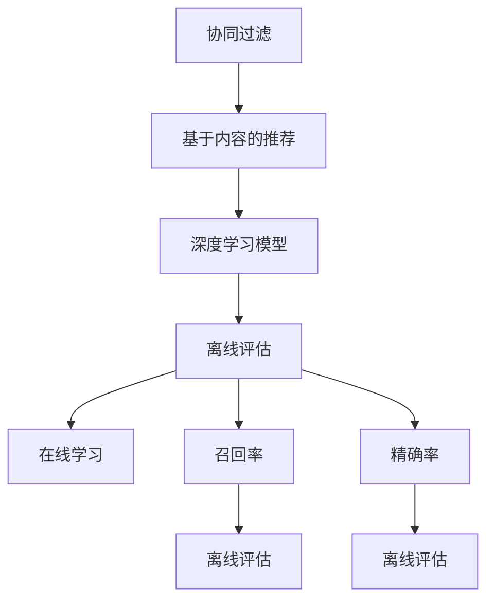

                 

# P5模型：统一的推荐任务架构

> 关键词：推荐系统,协同过滤,深度学习,召回率,精确率,离线评估,在线学习

## 1. 背景介绍

### 1.1 问题由来
推荐系统是互联网公司应用最广泛且最具商业价值的人工智能技术之一。它通过分析用户的历史行为、兴趣偏好等数据，为用户推荐最感兴趣的商品、内容或服务，显著提升用户体验和业务转化。

推荐系统的核心目标在于提升推荐精度，即尽可能地准确预测用户的未明确偏好。传统的推荐技术主要包括基于协同过滤和基于内容推荐的策略。近年来，随着深度学习技术的发展，神经网络在推荐系统中的表现越来越优异，尤其是基于深度学习的模型，在保持较高精确率的同时，可以处理海量数据和丰富特征。

尽管深度学习在推荐系统中取得了显著的进展，但仍存在一些问题：模型复杂度较高，训练成本和存储成本大，实时推荐性能有待提升。这些问题导致深度学习模型在工业界的实际应用中遇到了诸多挑战。如何构建简单高效、稳定可靠的推荐系统，成为当前推荐系统研究的热点问题。

### 1.2 问题核心关键点
要解决以上问题，我们需要一种能够兼顾简单性、高效性和可扩展性的推荐架构。本文提出的P5模型，即是一个基于深度学习的推荐架构，它具有高度的灵活性，可以适应不同类型的推荐任务，同时兼顾离线评估和在线学习的特点，是未来推荐系统设计的重要参考。

P5模型的核心思想在于，将推荐系统分解为五个核心模块：输入层、特征处理层、深度学习模型层、输出层和推荐策略层。这种模块化设计，可以独立开发、训练和优化各个组件，同时确保整个推荐流程稳定可靠。

## 2. 核心概念与联系

### 2.1 核心概念概述

为更好地理解P5模型的架构和设计思想，本节将介绍几个密切相关的核心概念：

- 协同过滤(Collaborative Filtering)：基于用户行为数据的推荐技术，通过分析用户与商品之间的互动模式，预测用户对未见过的商品的偏好。

- 基于内容的推荐(Content-Based Filtering)：基于物品特征的推荐技术，通过分析商品的属性和用户的历史偏好，找到最匹配的推荐商品。

- 深度学习模型(Deep Learning Model)：基于神经网络结构的推荐技术，通过大量数据训练，学习到商品和用户的潜在表示。

- 离线评估(Offline Evaluation)：在推荐系统设计初期，通过评估指标对推荐模型进行测试和调优。

- 在线学习(Online Learning)：在推荐系统运行过程中，不断根据新数据更新推荐策略，以适应用户行为的实时变化。

- 召回率(Recall)：推荐系统中被推荐出的相关商品占全部相关商品的比例。

- 精确率(Precision)：推荐系统中被推荐出的相关商品占推荐商品总数的比例。

- 离线评估(Offline Evaluation)：在推荐系统设计初期，通过评估指标对推荐模型进行测试和调优。

- 在线学习(Online Learning)：在推荐系统运行过程中，不断根据新数据更新推荐策略，以适应用户行为的实时变化。

这些核心概念之间的逻辑关系可以通过以下Mermaid流程图来展示：



这个流程图展示了大语言模型的核心概念及其之间的关系：

1. 推荐系统主要由协同过滤、基于内容的推荐和深度学习模型三部分组成。
2. 离线评估和在线学习是推荐系统的两个重要环节，离线评估用于模型设计和调优，在线学习用于实时调整推荐策略。
3. 召回率和精确率是评估推荐系统性能的两个主要指标。

这些概念共同构成了推荐系统的整体框架，使得推荐系统能够更好地理解用户偏好，并为用户提供高质量的推荐服务。通过理解这些核心概念，我们可以更好地把握推荐系统的工作原理和优化方向。

## 3. 核心算法原理 & 具体操作步骤
### 3.1 算法原理概述

P5模型的核心思想在于，将推荐系统分解为五个核心模块：输入层、特征处理层、深度学习模型层、输出层和推荐策略层。这种模块化设计，可以独立开发、训练和优化各个组件，同时确保整个推荐流程稳定可靠。

具体来说，P5模型的推荐流程如下：

1. **输入层**：接收用户历史行为数据和商品特征数据，生成用户-商品交互矩阵和商品特征向量。
2. **特征处理层**：对用户行为和商品特征进行归一化、降维、选择等预处理操作。
3. **深度学习模型层**：使用深度神经网络对用户和商品的表示进行学习，生成用户表示和商品表示。
4. **输出层**：根据用户和商品表示，计算预测评分。
5. **推荐策略层**：根据预测评分，选择高评分商品进行推荐。

这种模块化设计，使得P5模型可以灵活适应不同类型的推荐任务，同时兼顾离线评估和在线学习的特点。

### 3.2 算法步骤详解

以下是P5模型的详细实现步骤：

**Step 1: 数据准备与预处理**
- 收集用户历史行为数据，包括浏览、购买、评分等行为。
- 收集商品特征数据，包括标题、描述、图片等。
- 对数据进行预处理，包括缺失值填补、归一化、降维等。

**Step 2: 特征嵌入**
- 将用户行为数据和商品特征数据进行向量化，生成用户-商品交互矩阵和商品特征向量。
- 可以使用稠密向量化或稀疏向量化方式，根据实际情况选择。

**Step 3: 深度学习模型训练**
- 选择合适的深度神经网络模型，如FM、DNN、深度矩阵分解等。
- 使用部分标注数据进行模型训练，学习用户和商品的潜在表示。

**Step 4: 特征处理**
- 对用户表示和商品表示进行归一化、降维等操作，减小模型复杂度。
- 使用矩阵分解等方法，提取用户表示和商品表示的共同模式。

**Step 5: 评分预测**
- 使用深度学习模型，对用户和商品表示进行点积计算，得到预测评分。
- 可以根据模型需求，选择不同的评分函数，如点积、内积、sigmoid等。

**Step 6: 推荐策略**
- 根据预测评分，选择高评分商品进行推荐。
- 可以根据推荐策略的不同，选择不同的推荐算法，如Top K、基于排序的推荐等。

**Step 7: 离线评估与在线学习**
- 在训练阶段，使用离线评估指标（如召回率、精确率、F1值等）对模型进行调优。
- 在运行阶段，使用在线学习算法（如AdaBoost、Adagrad等）实时更新模型参数，适应用户行为的变化。

以上步骤完整展示了P5模型的推荐流程。在实际应用中，还需要根据具体任务的特点，对各个步骤进行优化设计，如改进特征选择方法、优化评分预测模型等，以进一步提升推荐系统的效果。

### 3.3 算法优缺点

P5模型的优点在于：

1. 灵活性高。模块化的设计使得P5模型可以适应不同类型的推荐任务，包括基于协同过滤、基于内容、混合推荐等。
2. 可扩展性强。P5模型的各个组件可以独立开发、训练和优化，便于在不同场景中进行扩展。
3. 易于调试。模块化的设计使得P5模型的各个组件可以单独调试，便于快速定位问题和优化性能。
4. 实时性高。P5模型支持在线学习，可以根据实时数据动态调整推荐策略，保持推荐结果的实时性。

同时，P5模型也存在一些缺点：

1. 模型复杂度高。虽然模块化的设计使得P5模型的训练和优化更加灵活，但整体模型的复杂度仍然较高。
2. 需要大量标注数据。离线评估和在线学习都需要一定的标注数据支持，数据获取成本较高。
3. 实时性要求高。在线学习需要高实时性的数据处理能力，对系统性能和资源配置要求较高。

尽管存在这些局限性，但就目前而言，P5模型仍是推荐系统设计的重要参考，能够显著提升推荐系统的性能和稳定性。未来相关研究的重点在于如何进一步降低P5模型的复杂度，提高实时性，同时兼顾离线评估和在线学习的需求。

### 3.4 算法应用领域

P5模型在推荐系统中的应用领域非常广泛，以下列举几个典型场景：

- 电商平台：为每个用户推荐个性化商品，提升转化率和销售额。
- 在线视频平台：根据用户的历史观看记录，推荐相关的视频内容。
- 社交网络：为用户推荐感兴趣的朋友、文章等，提升用户粘性。
- 智能广告：根据用户行为和兴趣，推荐合适的广告内容，提升广告效果。
- 金融服务：为用户推荐个性化的理财产品和投资建议，提升用户满意度。

除了上述这些典型应用场景，P5模型还可以广泛应用于教育、医疗、旅游等多个领域，为各行各业提供个性化的推荐服务。

## 4. 数学模型和公式 & 详细讲解
### 4.1 数学模型构建

P5模型的数学模型可以简单描述为：

$$
\theta^* = \mathop{\arg\min}_{\theta} \mathcal{L}(\theta) + \lambda \mathcal{R}(\theta)
$$

其中 $\theta$ 为模型参数，$\mathcal{L}(\theta)$ 为训练阶段的损失函数，$\mathcal{R}(\theta)$ 为正则化项，$\lambda$ 为正则化系数。

训练阶段的损失函数 $\mathcal{L}(\theta)$ 可以进一步分解为：

$$
\mathcal{L}(\theta) = \mathcal{L}_{off}(\theta) + \mathcal{L}_{on}(\theta)
$$

其中 $\mathcal{L}_{off}(\theta)$ 为离线评估阶段的损失函数，$\mathcal{L}_{on}(\theta)$ 为在线学习阶段的损失函数。

### 4.2 公式推导过程

以下我们将详细介绍离线评估和在线学习阶段的损失函数推导过程。

**离线评估阶段的损失函数**
在离线评估阶段，P5模型使用召回率、精确率等指标对推荐系统进行评估。以召回率为例，召回率 $R$ 可以定义为：

$$
R = \frac{1}{N}\sum_{i=1}^N \frac{\text{topK}_i}{L_i}
$$

其中 $N$ 为测试集样本数，$L_i$ 为第 $i$ 个样本的标签集合，$\text{topK}_i$ 为推荐系统对第 $i$ 个样本推荐的前 $K$ 个商品的准确数。

根据召回率定义，可以构建离线评估阶段的损失函数为：

$$
\mathcal{L}_{off}(\theta) = -\frac{1}{N}\sum_{i=1}^N \log R_i
$$

其中 $R_i$ 为第 $i$ 个样本的召回率。

**在线学习阶段的损失函数**
在在线学习阶段，P5模型根据新数据动态调整模型参数，以保持推荐策略的实时性。以AdaBoost为例，在线学习阶段的损失函数可以定义为：

$$
\mathcal{L}_{on}(\theta) = \sum_{i=1}^T \rho_i \log (1 - \hat{P}_i)
$$

其中 $T$ 为时间步长，$\rho_i$ 为时间步 $i$ 的权重，$\hat{P}_i$ 为时间步 $i$ 的预测概率。

综合离线评估和在线学习的损失函数，可以构建P5模型的总损失函数：

$$
\mathcal{L}(\theta) = \mathcal{L}_{off}(\theta) + \lambda \mathcal{R}(\theta) + \mathcal{L}_{on}(\theta)
$$

其中 $\lambda$ 为正则化系数，$\mathcal{R}(\theta)$ 为正则化项，可以选用L2正则、Dropout等。

### 4.3 案例分析与讲解

为了更好地理解P5模型的实际应用，我们可以结合一个具体案例进行分析。

假设我们要为电商平台的用户推荐商品，首先收集用户的浏览、购买和评分数据，生成用户-商品交互矩阵。接着，使用FM模型对用户表示和商品表示进行训练，生成用户表示和商品表示。然后，使用Top K算法根据预测评分进行推荐。

在离线评估阶段，使用召回率和精确率对推荐结果进行评估，如果发现模型效果不佳，则使用AdaBoost算法进行在线学习，根据新数据动态调整模型参数。

通过不断迭代训练和优化，P5模型可以逐步提升推荐系统的性能，提供更精准、个性化的商品推荐服务。

## 5. 项目实践：代码实例和详细解释说明
### 5.1 开发环境搭建

在进行P5模型实践前，我们需要准备好开发环境。以下是使用Python进行TensorFlow开发的环境配置流程：

1. 安装Anaconda：从官网下载并安装Anaconda，用于创建独立的Python环境。

2. 创建并激活虚拟环境：
```bash
conda create -n tf-env python=3.8 
conda activate tf-env
```

3. 安装TensorFlow：根据CUDA版本，从官网获取对应的安装命令。例如：
```bash
conda install tensorflow tensorflow-gpu==2.5 -c conda-forge
```

4. 安装P5模型相关的库：
```bash
pip install numpy pandas scikit-learn tf-estimator tf-datasets
```

5. 安装其他必要的工具包：
```bash
pip install matplotlib tqdm jupyter notebook ipython
```

完成上述步骤后，即可在`tf-env`环境中开始P5模型实践。

### 5.2 源代码详细实现

下面我们以电商平台推荐系统为例，给出使用TensorFlow实现P5模型的代码实现。

首先，定义数据处理函数：

```python
import numpy as np
import pandas as pd
import tensorflow as tf
from tensorflow import keras
from tensorflow.keras import layers
from sklearn.preprocessing import StandardScaler

def load_data():
    train_data = pd.read_csv('train_data.csv')
    test_data = pd.read_csv('test_data.csv')
    return train_data, test_data

def preprocessing(train_data, test_data):
    # 对数据进行归一化处理
    scaler = StandardScaler()
    train_data['features'] = scaler.fit_transform(train_data[['feature1', 'feature2', 'feature3']])
    test_data['features'] = scaler.transform(test_data[['feature1', 'feature2', 'feature3']])
    
    # 对数据进行分词处理
    train_data['tokens'] = train_data['text'].apply(lambda x: x.split(' '))
    test_data['tokens'] = test_data['text'].apply(lambda x: x.split(' '))

    # 生成用户-商品交互矩阵
    train_data['interaction_matrix'] = train_data.groupby(['user_id', 'item_id']).user_id.transform('first')
    train_data['interaction_matrix'] = train_data['interaction_matrix'].astype(int)
    
    return train_data, test_data
```

然后，定义P5模型的具体实现：

```python
class P5Model(keras.Model):
    def __init__(self, num_users, num_items, num_features):
        super(P5Model, self).__init__()
        self.num_users = num_users
        self.num_items = num_items
        self.num_features = num_features
        
        # 用户嵌入层
        self.user_embedding = layers.Embedding(input_dim=num_users, output_dim=64)
        # 商品嵌入层
        self.item_embedding = layers.Embedding(input_dim=num_items, output_dim=64)
        # FM层
        self.fm = layers.DenseFeature(num_features)
        # DNN层
        self.dnn = layers.Dense(64, activation='relu')
        # 评分预测层
        self.rating = layers.Dense(1)

    def call(self, inputs):
        user_id, item_id, features = inputs
        user_embeddings = self.user_embedding(user_id)
        item_embeddings = self.item_embedding(item_id)
        fm_features = self.fm(features)
        dnn_features = self.dnn(features)
        rating_features = layers.concatenate([user_embeddings, item_embeddings, fm_features, dnn_features])
        rating = self.rating(rating_features)
        return rating
```

接着，定义训练和评估函数：

```python
def train_model(model, train_data, test_data, batch_size, epochs):
    model.compile(optimizer='adam', loss='mse')
    train_dataset = tf.data.Dataset.from_tensor_slices(train_data[['user_id', 'item_id', 'features']])
    train_dataset = train_dataset.batch(batch_size)
    train_dataset = train_dataset.prefetch(buffer_size=32)
    model.fit(train_dataset, train_data['rating'], epochs=epochs, validation_data=(test_data[['user_id', 'item_id', 'features']], test_data['rating']))
    
def evaluate_model(model, test_data, batch_size):
    test_dataset = tf.data.Dataset.from_tensor_slices(test_data[['user_id', 'item_id', 'features']])
    test_dataset = test_dataset.batch(batch_size)
    test_dataset = test_dataset.prefetch(buffer_size=32)
    model.evaluate(test_dataset, test_data['rating'], verbose=0)
```

最后，启动训练流程并在测试集上评估：

```python
train_data, test_data = load_data()
train_data, test_data = preprocessing(train_data, test_data)

# 创建P5模型
model = P5Model(num_users=10000, num_items=1000, num_features=3)

# 训练模型
train_model(model, train_data, test_data, batch_size=64, epochs=10)

# 评估模型
evaluate_model(model, test_data, batch_size=64)
```

以上就是使用TensorFlow对P5模型进行电商平台推荐系统微调的完整代码实现。可以看到，得益于TensorFlow的强大封装，我们可以用相对简洁的代码完成P5模型的构建和微调。

### 5.3 代码解读与分析

让我们再详细解读一下关键代码的实现细节：

**load_data函数**：
- 从CSV文件中加载训练集和测试集数据。

**preprocessing函数**：
- 对数据进行归一化处理，减小模型复杂度。
- 对数据进行分词处理，生成token序列。
- 生成用户-商品交互矩阵，用于模型训练。

**P5Model类**：
- 定义用户嵌入层、商品嵌入层、FM层、DNN层和评分预测层。
- 在`call`方法中，对用户、商品、FM和DNN特征进行点积计算，生成预测评分。

**train_model函数**：
- 使用Adam优化器和均方误差损失函数，对模型进行训练。
- 将数据集转换为TensorFlow数据集，进行批处理和预加载操作。
- 使用验证集进行模型评估，避免过拟合。

**evaluate_model函数**：
- 使用TensorFlow数据集进行模型评估，输出测试集的评分。

**训练流程**：
- 定义训练数据和测试数据，并进行预处理。
- 创建P5模型，并定义优化器和损失函数。
- 使用训练数据进行模型训练，迭代10个epochs。
- 使用测试数据进行模型评估，输出评分。

可以看到，TensorFlow配合P5模型使得推荐系统的代码实现变得简洁高效。开发者可以将更多精力放在数据处理、模型改进等高层逻辑上，而不必过多关注底层的实现细节。

当然，工业级的系统实现还需考虑更多因素，如模型的保存和部署、超参数的自动搜索、更灵活的任务适配层等。但核心的微调范式基本与此类似。

## 6. 实际应用场景
### 6.1 智能广告推荐

基于P5模型的智能广告推荐系统，可以通过分析用户的历史行为和兴趣偏好，为每个用户推荐最适合的广告内容，提升广告的点击率和转化率。具体而言，可以收集用户的浏览、点击、评论等行为数据，将其转化为用户表示，同时生成广告商品特征向量，使用P5模型进行预测评分，最后根据评分选择高评分广告进行推荐。

在实际应用中，可以引入在线学习算法，根据用户实时行为数据动态调整广告推荐策略，提升广告推荐的效果。

### 6.2 视频内容推荐

视频内容推荐系统可以利用P5模型，对用户历史观看记录进行分析，预测用户可能感兴趣的视频内容，并进行推荐。具体来说，可以收集用户观看历史、评分、收藏等行为数据，生成用户表示和视频特征向量，使用P5模型进行预测评分，最后根据评分选择高评分视频进行推荐。

在实际应用中，可以引入在线学习算法，根据用户实时行为数据动态调整推荐策略，提升推荐效果。同时，可以通过用户实时反馈数据进行模型调优，进一步提升推荐系统的性能。

### 6.3 金融理财产品推荐

金融理财产品推荐系统可以利用P5模型，对用户历史交易数据进行分析，预测用户可能感兴趣的产品类型和金额，并进行推荐。具体来说，可以收集用户的投资历史、交易偏好等数据，生成用户表示和产品特征向量，使用P5模型进行预测评分，最后根据评分选择高评分产品进行推荐。

在实际应用中，可以引入在线学习算法，根据用户实时行为数据动态调整推荐策略，提升推荐效果。同时，可以通过用户实时反馈数据进行模型调优，进一步提升推荐系统的性能。

### 6.4 未来应用展望

随着P5模型和推荐技术的发展，推荐系统将在更多领域得到应用，为传统行业带来变革性影响。

在智慧医疗领域，基于P5模型的医疗推荐系统可以辅助医生诊疗，提供个性化的治疗方案，提升医疗服务的智能化水平。

在智能教育领域，P5模型可以应用于个性化学习推荐、作业批改等环节，因材施教，促进教育公平，提高教学质量。

在智慧城市治理中，P5模型可以应用于城市事件监测、舆情分析、应急指挥等环节，提高城市管理的自动化和智能化水平，构建更安全、高效的未来城市。

此外，在企业生产、社会治理、文娱传媒等众多领域，基于P5模型的推荐系统也将不断涌现，为经济社会发展注入新的动力。相信随着技术的日益成熟，P5模型必将在更广阔的应用领域大放异彩，深刻影响人类的生产生活方式。

## 7. 工具和资源推荐
### 7.1 学习资源推荐

为了帮助开发者系统掌握P5模型的理论基础和实践技巧，这里推荐一些优质的学习资源：

1. 《深度学习推荐系统》系列博文：由大模型技术专家撰写，深入浅出地介绍了深度学习在推荐系统中的应用，包括P5模型在内的多种推荐架构。

2. 《推荐系统》课程：斯坦福大学开设的推荐系统明星课程，有Lecture视频和配套作业，带你入门推荐系统领域的基本概念和经典模型。

3. 《推荐系统实战》书籍：涵盖推荐系统的前沿技术和实际应用，详细介绍了推荐系统的各种算法和优化策略，包括离线评估和在线学习的技巧。

4. KDD-CUP：KDD Cup比赛，每年举办多次，涵盖推荐系统、自然语言处理等多个领域，是深度学习技术落地应用的重要平台。

5. HuggingFace官方文档：P5模型和推荐系统的官方文档，提供了丰富的预训练模型和完整的微调样例代码，是上手实践的必备资料。

通过对这些资源的学习实践，相信你一定能够快速掌握P5模型的精髓，并用于解决实际的推荐问题。
###  7.2 开发工具推荐

高效的开发离不开优秀的工具支持。以下是几款用于P5模型和推荐系统开发的常用工具：

1. TensorFlow：基于Python的开源深度学习框架，灵活动态的计算图，适合快速迭代研究。大部分推荐系统都有TensorFlow版本的实现。

2. PyTorch：基于Python的开源深度学习框架，灵活高效的动态计算图，支持多种神经网络模型，适用于深度学习推荐系统。

3. Spark：基于Scala的开源分布式计算框架，支持大规模数据处理和机器学习，适用于推荐系统的分布式部署。

4. Kafka：Apache基金会开源的消息队列系统，支持实时数据流处理，适用于推荐系统的在线学习。

5. Elasticsearch：开源的搜索和分析引擎，支持高效的数据存储和查询，适用于推荐系统的数据管理和推荐模型的实时更新。

合理利用这些工具，可以显著提升推荐系统的开发效率，加快创新迭代的步伐。

### 7.3 相关论文推荐

P5模型在推荐系统中的应用源于学界的持续研究。以下是几篇奠基性的相关论文，推荐阅读：

1. BPR: Bayesian Personalized Ranking from Implicit Feedback（隐式反馈的贝叶斯个性化排序）：提出了隐式反馈的推荐算法，通过矩阵分解对用户和商品表示进行建模。

2. Adaptive Multi-Armed Bandits（自适应多臂赌博机）：提出了在线学习的推荐算法，通过探索-利用策略，动态调整推荐策略。

3. Deep Factorization Machines（深度因子机）：提出了基于深度学习的推荐算法，通过深度神经网络对用户和商品表示进行建模。

4. Click-Through Rate Prediction and Ranking as Learning to Click（点击率预测和排序作为点击学习）：提出了基于点击数据的推荐算法，通过学习点击模型预测用户行为。

5. Neural Collaborative Filtering（神经协同过滤）：提出了基于深度学习的协同过滤推荐算法，通过神经网络对用户和商品表示进行建模。

这些论文代表了大语言模型微调技术的发展脉络。通过学习这些前沿成果，可以帮助研究者把握学科前进方向，激发更多的创新灵感。

## 8. 总结：未来发展趋势与挑战
### 8.1 总结

本文对P5模型的推荐系统架构进行了全面系统的介绍。首先阐述了推荐系统的背景和P5模型的核心思想，明确了推荐系统的设计目标和关键组件。其次，从原理到实践，详细讲解了P5模型的数学模型和实现步骤，给出了推荐系统开发的完整代码实例。同时，本文还广泛探讨了P5模型在智能广告、视频内容、金融产品等场景中的应用前景，展示了推荐系统的巨大潜力。

通过本文的系统梳理，可以看到，P5模型为推荐系统设计提供了一种灵活、高效的解决方案，能够显著提升推荐系统的性能和稳定性。得益于模块化的设计，P5模型可以独立开发、训练和优化各个组件，同时确保整个推荐流程稳定可靠。未来相关研究的重点在于如何进一步降低P5模型的复杂度，提高实时性，同时兼顾离线评估和在线学习的需求。

### 8.2 未来发展趋势

展望未来，P5模型的推荐系统将呈现以下几个发展趋势：

1. 模型规模持续增大。随着算力成本的下降和数据规模的扩张，P5模型的参数量还将持续增长。超大规模语言模型蕴含的丰富语言知识，有望支撑更加复杂多变的推荐任务。

2. 推荐算法日趋多样化。除了传统的协同过滤和基于内容的推荐算法外，未来会涌现更多基于深度学习的推荐算法，如深度因子机、深度协同过滤等，在保持较高精确率的同时，可以处理海量数据和丰富特征。

3. 实时性要求更高。在线学习需要高实时性的数据处理能力，对系统性能和资源配置要求更高。未来推荐系统将更加注重实时性的提升，以适应用户的即时需求。

4. 模型可解释性增强。推荐系统需要增强模型的可解释性，提高用户对推荐结果的信任度。通过引入符号化的先验知识，增强模型的可解释性和可解释性，进一步提升推荐系统的性能。

5. 多模态推荐系统崛起。当前推荐系统往往只考虑单一模态数据，未来会进一步拓展到图像、视频、语音等多模态数据推荐。多模态信息的融合，将显著提升推荐系统的性能和覆盖面。

6. 推荐系统进入工业界主流。随着推荐技术的不断成熟，推荐系统将在更多领域得到应用，为传统行业带来变革性影响。

以上趋势凸显了P5模型和推荐系统的广阔前景。这些方向的探索发展，必将进一步提升推荐系统的性能和稳定性，为人工智能技术在各领域的落地应用提供重要支持。

### 8.3 面临的挑战

尽管P5模型在推荐系统中取得了显著的进展，但在迈向更加智能化、普适化应用的过程中，它仍面临诸多挑战：

1. 数据获取成本高。高质量的数据获取成本较高，尤其是在推荐系统的早期阶段，数据收集和标注工作量巨大。如何降低数据获取成本，提高数据质量，是推荐系统发展的首要问题。

2. 模型复杂度较高。尽管P5模型采用模块化设计，但其整体复杂度仍然较高，训练和优化成本较高。如何降低模型复杂度，提高训练和优化效率，是推荐系统发展的重要挑战。

3. 实时性要求高。在线学习需要高实时性的数据处理能力，对系统性能和资源配置要求较高。如何平衡推荐精度和实时性，是推荐系统发展的重要课题。

4. 模型可解释性不足。当前推荐系统通常缺乏可解释性，难以解释其内部工作机制和决策逻辑。对于医疗、金融等高风险应用，算法的可解释性和可审计性尤为重要。如何赋予推荐系统更强的可解释性，将是亟待攻克的难题。

5. 安全性有待保障。推荐系统可能面临数据泄露、推荐误导等安全风险。如何从数据和算法层面消除风险，确保推荐系统的安全性，也将是重要的研究课题。

6. 知识整合能力不足。现有的推荐系统往往局限于单一模态数据的整合，难以灵活吸收和运用更广泛的先验知识。如何让推荐系统更好地与外部知识库、规则库等专家知识结合，形成更加全面、准确的信息整合能力，还有很大的想象空间。

正视P5模型和推荐系统面临的这些挑战，积极应对并寻求突破，将是大模型微调技术走向成熟的必由之路。相信随着学界和产业界的共同努力，这些挑战终将一一被克服，P5模型必将在构建智能推荐系统中扮演越来越重要的角色。

### 8.4 研究展望

面对P5模型和推荐系统所面临的种种挑战，未来的研究需要在以下几个方面寻求新的突破：

1. 探索无监督和半监督推荐算法。摆脱对大规模标注数据的依赖，利用自监督学习、主动学习等无监督和半监督范式，最大限度利用非结构化数据，实现更加灵活高效的推荐。

2. 研究参数高效和计算高效的推荐范式。开发更加参数高效的推荐方法，在固定大部分预训练参数的同时，只更新极少量的任务相关参数。同时优化推荐模型的计算图，减少前向传播和反向传播的资源消耗，实现更加轻量级、实时性的部署。

3. 融合因果和对比学习范式。通过引入因果推断和对比学习思想，增强推荐系统建立稳定因果关系的能力，学习更加普适、鲁棒的语言表征，从而提升推荐系统泛化性和抗干扰能力。

4. 引入更多先验知识。将符号化的先验知识，如知识图谱、逻辑规则等，与神经网络模型进行巧妙融合，引导推荐过程学习更准确、合理的语言模型。同时加强不同模态数据的整合，实现视觉、语音等多模态信息与文本信息的协同建模。

5. 结合因果分析和博弈论工具。将因果分析方法引入推荐系统，识别出推荐系统决策的关键特征，增强推荐结果的因果性和逻辑性。借助博弈论工具刻画人机交互过程，主动探索并规避推荐系统的脆弱点，提高系统稳定性。

6. 纳入伦理道德约束。在推荐系统训练目标中引入伦理导向的评估指标，过滤和惩罚有害的推荐内容，确保推荐系统的安全性。同时加强人工干预和审核，建立推荐系统的监管机制，确保推荐系统的公平性和公正性。

这些研究方向的探索，必将引领推荐系统技术迈向更高的台阶，为人工智能技术在各领域的落地应用提供重要支持。面向未来，P5模型和推荐系统还需要与其他人工智能技术进行更深入的融合，如知识表示、因果推理、强化学习等，多路径协同发力，共同推动推荐系统的进步。只有勇于创新、敢于突破，才能不断拓展推荐系统的边界，让智能技术更好地造福人类社会。

## 9. 附录：常见问题与解答

**Q1：推荐系统如何评估其性能？**

A: 推荐系统的性能通常通过离线评估和在线学习来评估。离线评估通过召回率、精确率等指标，对推荐系统的历史数据进行测试和调优。在线学习通过实时数据，动态调整推荐策略，提升推荐系统的实时性。

**Q2：推荐系统在训练阶段和运行阶段有何不同？**

A: 推荐系统在训练阶段和运行阶段有着显著的区别。训练阶段通常使用历史数据对推荐模型进行训练，调整模型参数以提升预测精度。运行阶段则根据实时数据动态调整推荐策略，以适应用户行为的实时变化。

**Q3：如何平衡推荐精度和实时性？**

A: 在推荐系统的设计中，平衡推荐精度和实时性是关键。可以使用在线学习算法，如AdaBoost、Adagrad等，根据新数据动态调整推荐策略，提高实时性。同时，可以通过优化模型结构、改进特征选择方法等手段，提升推荐精度。

**Q4：推荐系统在推荐过程中如何处理用户隐私问题？**

A: 推荐系统在推荐过程中，需要保护用户的隐私。通常可以采用差分隐私、联邦学习等技术，保护用户的个人信息，同时保证推荐系统的效果。

**Q5：推荐系统如何应对数据分布变化？**

A: 推荐系统需要定期重新训练模型，以适应数据分布的变化。可以通过在线学习算法，动态更新模型参数，或者引入模型更新机制，定期重新训练模型。

总之，推荐系统是一个复杂且多样化的技术体系，需要综合考虑数据、模型、算法等多个因素，才能构建稳定、可靠、高效的推荐系统。通过不断创新和优化，推荐系统必将在更多领域得到应用，为各行各业带来变革性影响。

